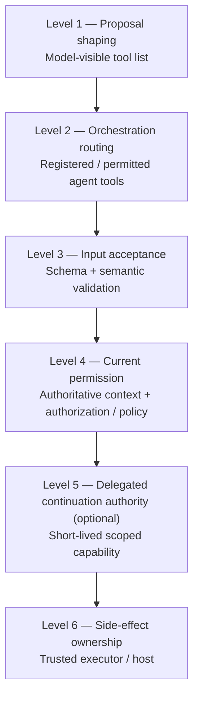

# Agent and Tool Authorization Models and Host-Owned Execution

**Pattern classification:** Alternative Pattern

**Difficulty:** Advanced

**Prerequisites:** Recommended — [Governed AI Tool Gateway](../tutorials/governed-ai-tool-gateway.md) and [Scoped Capability and Host-Owned Execution](../tutorials/scoped-capability-and-host-owned-execution.md). [Typed AI Proposed Intent and Schema-Validation Boundaries](../ai-integration/typed-ai-proposed-intent-and-schema-validation-boundaries.md) is useful when the model emits structured tool arguments.

> **Terminology note:** This comparison uses `tool list`, `tool registration`, `agent permission`, `tool-call validation`, `authorization`, `capability`, and `host-owned execution` as architectural terms. Agent frameworks differ. Some tool registries are only orchestration configuration; others are trusted enforcement points that directly own credentials and execution. The important question is what the mechanism actually controls, not what the API calls it.

> **Industry anchors:** Frameworks and ecosystems such as LangChain, Semantic Kernel, AutoGen, and Model Context Protocol (MCP) servers/registries expose different ways to register, discover, or provide tools and functions. They are orientation points for searchability, not endorsements or definitions of the authorization boundary. In particular, tool discovery or registration through one of these mechanisms does not by itself establish resource-level permission or execution authority.

> **Standalone-reader note:** In this article, **Learning** means the ASI Backbone Learning repository and tutorial series. Its recurring rule is: **The model may propose. The host retains execution authority.** The host may be a conventional application, an agent runtime that is deliberately trusted as the execution boundary, a background worker, a tool gateway, or another component that owns the real side effect.

Use this page as the **detailed reference comparison** across tool visibility, framework registration, agent permissions, authorization, capabilities, credential custody, and host-owned execution. If you want the shorter standalone argument that isolates the proposal-versus-authority boundary around one minimal `case.add-note` loop, start with [Why an AI Tool Call Is a Proposal, Not Authority](../articles/2026/why-ai-tool-call-is-only-a-proposal.md).

## Executive Summary

AI and agent controls operate at different boundaries:

- **Tool visibility and registration** shape what the model or orchestration runtime can reach.
- **Schema and semantic validation** determine whether a proposed call is acceptable in form and meaning; they do not create permission.
- **Host authorization / policy** decides whether the current actor may perform the operation on the current resource under authoritative constraints.
- **Capability-scoped authority** is useful when permission must cross a delay, process, or trust boundary without forwarding broad standing credentials.
- **Host-owned execution** identifies the trusted component that can ultimately create or block the side effect.

A framework allowlist can be sufficient when the runtime is deliberately trusted, non-bypassable, and already enforces the required resource and argument authorization. More elaborate governance should be added only when the consequence, delay, policy ownership, or delegation boundary actually requires it.

> **Central lesson:** Judge the boundary by what it can prevent and what authority it actually owns. Do not infer security semantics from the word `tool`, `agent`, `allowed`, or `approved` alone.

**Five-minute path:** read [Quick Orientation](#quick-orientation), [The Authority Ladder](#the-authority-ladder), [Direct Answers to the Core Questions](#direct-answers-to-the-core-questions), and [A Practical Decision Guide](#a-practical-decision-guide).

---

## Quick Orientation

| Mechanism | Primary question | Useful guarantee when correctly enforced | Does not automatically prove |
| --- | --- | --- | --- |
| Model-visible tool selection | What may the model choose from? | Proposal surface is narrowed | Caller authorization, resource authorization, safe arguments, current policy, or execution authority |
| Framework tool registration | What tools can this runtime route to? | Unregistered tools are unavailable through that framework path | That every registered call is authorized for the current actor/resource |
| Per-agent tool permission | Which registered tools may this agent invoke? | Agent-specific attack surface is reduced | That the agent may use every allowed tool against every resource or destination |
| Tool-call / schema validation | Is the proposed call well-formed and within declared constraints? | Malformed, unknown, or out-of-range calls can be rejected early | That the actor owns the target, the destination is permitted, or policy allows the action |
| Host-side authorization / policy | May this operation proceed under authoritative current context? | Permission is decided using trusted facts and policy | That delayed execution still has valid authority unless freshness/revalidation is handled |
| Capability-scoped execution | May this executor perform this exact operation now? | Delegated authority can be narrow, short-lived, audience-bound, and replay-resistant | That capability issuance was correct or that human acknowledgment occurred |
| Host-owned execution | Who controls the side effect? | The trusted execution boundary can block or perform the operation | That every upstream proposal or decision was valid unless the host verifies required evidence |

These mechanisms compose well.

They should not be stacked automatically.

For a low-risk, immediate, same-process tool call, framework registration plus ordinary application authorization may be entirely sufficient.

For delayed, cross-service, or consequential execution, separating proposal, policy, approval, and execution authority may become valuable.

---

## The Authority Ladder

One way to reason about agent/tool control is to ask how far each mechanism gets toward a real side effect.



Higher levels are not always better.

They answer different questions and carry different operational costs.

A design is strong when it uses the lowest amount of machinery that still protects the boundaries that actually matter.

### Why This Is Not a Maturity Model

A simple application may intentionally stop at:

```text
Registered tool
   ↓
Host validates arguments
   ↓
Ordinary authorization
   ↓
Immediate execution in the same process
```

That can be the correct design.

Adding an external policy service, acknowledgment store, capability issuer, and separate executor would not improve security if no independent trust, delay, delegation, or consequence boundary requires them.

Conversely, a system can use an elaborate agent framework and still have a weak authorization model if every tool shares broad credentials and accepts model-selected resources without authoritative host validation.

---

## 1. Model-Visible Tool Selection

Many AI APIs let the application provide descriptions of tools that the model may choose from.

A simplified path is:

```text
Available tool descriptions
        ↓
Model evaluates prompt and context
        ↓
Model proposes one tool call
```

This is valuable because it narrows the model's action vocabulary.

The model is less likely to propose operations it has never been told about, and the application can expose different tool sets for different tasks.

### What Tool Visibility Is Good At

Tool visibility can improve:

- Prompt clarity.
- Tool selection accuracy.
- Proposal-surface reduction.
- Task-specific specialization.
- Reduced accidental use of unrelated operations.
- Simpler model output validation.
- Lower orchestration complexity.

For example:

```text
Customer-support agent sees:
- customer.lookup
- case.add_note

Infrastructure agent sees:
- deployment.status
- deployment.request
```

This is much safer than exposing one universal catalog containing every administrative operation.

### Is Hiding a Tool from the Model a Security Boundary?

**Not by itself.**

Hiding a tool changes what the model can easily propose. It does not necessarily change what the surrounding software can execute.

If an attacker can inject a raw tool call, invoke the tool endpoint directly, mutate orchestration state, or reach the underlying service through another path, model visibility did not protect the resource.

The important distinction is:

```text
Not visible to model
        ≠
Not executable by system
```

Visibility controls model behavior, not system authority. Treating visibility as authorization risks accidental privilege exposure through alternate execution paths that remain reachable even when the model never saw the tool description.

However, visibility can participate in a real boundary when the model's tool interface is the only route and the trusted runtime rejects any call outside the supplied set.

Even then, the boundary usually answers:

> Which operation names may this model-driven workflow invoke?

It does not necessarily answer:

> Which customer record may the current user modify?

or:

> Is this transfer permitted under current regional policy?

### Proposal Shaping Is Still Security-Relevant

Calling tool visibility "not authorization" should not be read as "not useful for security."

Reducing reachable functionality is a legitimate defense-in-depth measure.

A smaller proposal surface can reduce accidental tool calls, prompt-injection opportunities, and the number of dangerous code paths exposed to the model.

The mistake is treating proposal-surface reduction as the entire authorization model for consequential operations.

### Indirect Prompt Injection in Multi-Step Agents

A multi-step agent can be influenced by untrusted data returned from an earlier tool, document, web page, message, or external system. That data may contain instructions intended to make the model propose a more privileged second tool call.

```text
Read untrusted external content
        ↓
Content tells model to export secrets
        ↓
Model proposes a second tool call
        ↓
Host reconstructs current context and authorizes the new proposal
        ↓
Trusted executor either blocks or performs the exact permitted side effect
```

Tool registration and schema validation help constrain the proposal surface, but they do not make an injected follow-on proposal trustworthy. For consequential multi-step agents, current host-side authorization at Level 4 and a non-bypassable execution boundary at Level 6 are critical controls because each new proposal must earn permission independently of the untrusted content that influenced it.

An earlier successful tool call should not create ambient authority for later calls.

---

## 2. Framework Tool Registration and Per-Agent Permissions

Agent frameworks often let the application register tools and assign subsets to individual agents.

```text
Tool Registry
   ├── customer.lookup
   ├── case.add_note
   ├── refund.request
   └── refund.execute

Support Agent
   ├── customer.lookup
   └── case.add_note

Refund Agent
   ├── customer.lookup
   └── refund.request
```

This can be a strong architectural control.

### Attack-Surface Reduction

A per-agent allowlist can prevent an agent from reaching unrelated tools through the normal orchestration path.

That supports least functionality:

```text
Agent role in workflow
        ↓
Narrow tool set
        ↓
Smaller reachable execution surface
```

It also makes review easier because the system can answer:

> Which operations was this agent ever configured to invoke?

### Is an Agent Tool Allowlist Equivalent to Authorization?

**Sometimes, but not automatically.**

A framework allowlist becomes a real authorization boundary when all of the following are true enough for the threat model:

- The framework runtime is trusted.
- The runtime owns or mediates the only path to tool execution.
- Unregistered tools cannot be reached through another execution path.
- The allowlist is enforced server-side rather than only described to the model.
- Tool credentials are not separately available to the model or an untrusted component.
- Resource- and argument-level checks are either unnecessary or enforced elsewhere.
- The current actor/tenant/workload identity is bound correctly to the call.

Under those conditions, the framework may itself be the host-owned enforcement boundary.

That is valid architecture.

The Learning rule is not:

> Never trust an agent framework.

It is:

> Know which component is trusted to enforce the boundary and do not treat model output as authority merely because the framework produced it.

### When the Allowlist Is Only Orchestration Configuration

The same allowlist is weaker if:

```text
Agent is allowed to call refund.execute
        ↓
Tool implementation holds broad payment credentials
        ↓
Model supplies arbitrary accountId and amount
        ↓
No host-side ownership, limit, or policy validation occurs
```

The agent was authorized to reach the **tool**.

It was not necessarily authorized to perform **this operation on this resource with these arguments**.

Tool-level permission and object-level authorization are different dimensions.

### Tool Registration Can Be Sufficient

Suppose a documentation assistant has three read-only tools:

```text
docs.search
docs.open
release.notes
```

All data is public, tools are read-only, no sensitive credentials exist, no tenant isolation applies, and the runtime rejects unregistered tools.

A framework tool allowlist may be all the authorization complexity the agent layer needs.

Adding capabilities or a governance workflow would be ceremony without a meaningful additional boundary.

---

## 3. Tool-Call Validation: Structure Is Not Authority

A model may produce a tool call such as:

```json
{
  "tool": "customer.export",
  "arguments": {
    "customerId": "cust-123",
    "destination": "partner-a"
  }
}
```

The host or framework may validate that:

- `tool` is recognized.
- Required arguments exist.
- Types are correct.
- String lengths are acceptable.
- Enumerated values are valid.
- Numeric values are within declared ranges.
- Additional unexpected fields are rejected.

This is important.

But successful validation establishes only that the proposal is acceptable **as data**.

It does not establish that the side effect is authorized.

### Schema Validation

Schema validation answers questions such as:

```text
Is customerId a string?
Is destination one of the declared enum values?
Is amount <= the schema maximum?
```

Those checks can reject malformed or obviously unsafe proposals early.

### Semantic Validation

Semantic validation may go further:

```text
Does customerId exist?
Does destination identify a known integration partner?
Is the requested transition valid for the current workflow state?
Is the amount positive and internally consistent?
```

These are stronger checks, but they still may not answer authorization.

### Resource Identity Must Be Reconstructed Authoritatively

A model might propose:

```text
customerId = cust-123
classification = Public
ownerTenant = tenant-a
```

The host should not assume those claims are authoritative merely because they were well-formed.

A stronger flow is:

```text
Model proposes customerId = cust-123
        ↓
Host loads cust-123 from authoritative storage
        ↓
Host derives actual tenant, classification, region, and state
        ↓
Authorization / policy evaluates trusted facts
```

This is especially important for object-level authorization, tenancy, ownership, region, classification, legal state, and other security-relevant properties.

### Who Validates Arguments?

Responsibility can be layered:

```text
Framework
   ↓
Basic schema validation

Tool adapter / application host
   ↓
Semantic validation

Authorization / policy boundary
   ↓
Actor-resource-operation constraints

Executor
   ↓
Final execution-boundary invariants
```

One component may perform several layers.

The key is that untrusted model output should not become trusted resource identity or authorization context merely because a schema parser accepted it.

---

## 4. Host-Side Tool Authorization

Host-side authorization treats the model call as a proposal and reconstructs the permission question using trusted application context.

A representative flow is:

```text
Tool proposal
   ↓
Tool recognition
   ↓
Schema / semantic validation
   ↓
Authenticated actor or workload
   ↓
Authoritative resource and environment context
   ↓
Authorization / policy
   ↓
Immediate host-owned execution
```

This is often enough.

A separate capability layer is optional.

### The Host Owns the Permission Question

The host can combine facts the model should not control:

```text
Actor identity
Tenant
Resource owner
Resource classification
Region
Current workflow state
Current policy version
Destination trust status
Operational window
Rate / quota state
```

The model may contribute advisory context, but the host decides which facts are authoritative.

### Where Should Credentials Live?

As a default rule:

> **Credentials should live with the trusted host or executor that owns the side effect, not in the model prompt, model memory, model-visible tool schema, or model-generated arguments.**

That can mean:

```text
Model
   ↓
Proposal only

Trusted host / executor
   ↓
Authorization
   ↓
Credential acquisition or use
   ↓
External side effect
```

Examples include:

- Database credentials held by the application service.
- Cloud credentials held by a deployment worker.
- Payment credentials held by a payment service.
- API tokens retrieved from a server-side secret store.
- Workload identity acquired by the executor at runtime.

Concrete workload-identity patterns include SPIFFE/SPIRE identities, Azure Managed Identities, and Amazon EKS IAM Roles for Service Accounts (IRSA). These are grounding examples, not required products; the architectural point is that the executor acquires narrowly appropriate credentials without placing them in model-reachable state.

The model does not need the credential merely because it selected the operation.

### Least-Privilege Tool Credential Scoping

Tool-level permissions are stronger when the underlying infrastructure credential is scoped to the same consequence boundary. A narrow tool name backed by a broad administrator credential can leave a much larger blast radius than the tool registry suggests.

For example:

| Tool | Executor credential scope | Why the scope matters |
| --- | --- | --- |
| `customer.lookup` | Read-only customer profile access for the current tenant | A lookup bug cannot become an export or mutation path |
| `customer.export` | Export permission for the approved tenant, dataset, and destination class | The handler cannot redirect arbitrary customer data to an unrelated destination |
| `deployment.restart` | Restart permission for one service/environment, without deployment or secret-management rights | A restart proposal cannot silently become broader infrastructure control |

A useful design rule is:

> **The tool registry should narrow the reachable operation; the executor credential should narrow the infrastructure authority behind that operation.**

Where practical, prefer workload identity or just-in-time credential acquisition over long-lived shared secrets, and avoid reusing one privileged credential across unrelated tools merely because they execute in the same agent runtime.

### What If the Agent Framework Holds the Credentials?

That can be valid if the framework runtime is intentionally part of the trusted host boundary.

Then the architectural statement becomes:

```text
Model output is untrusted proposal
Framework runtime is trusted host
Runtime validates / authorizes / executes
```

The name of the process is not important.

The trust assignment is.

Trust must be assigned explicitly from the threat model rather than inferred from the presence of an agent framework. Treat the runtime as trusted only when its isolation, bypass resistance, credential handling, validation, authorization, and execution responsibilities are intentionally part of the trusted computing boundary.

### Ordinary Authorization May Be Enough

For an internal agent that runs inside a single web application, the following can be entirely sufficient:

```text
Authenticated user
   ↓
Agent proposes tool call
   ↓
Registered tool handler
   ↓
ASP.NET Core authorization / domain authorization
   ↓
Immediate execution in same application
```

If there is no delayed executor, no independent policy owner, no human acknowledgment requirement, and no need to delegate narrower authority, adding a capability issuer would likely over-engineer the system.

---

## 5. Capability-Scoped Execution

A capability boundary becomes useful when the system needs to separate **the decision to continue** from **the authority held by a later executor**.

A representative flow is:

```text
Approved proposal
      ↓
Short-lived scoped authority
      ↓
Executor validates authority
      ↓
Side effect
```

### When This Additional Boundary Is Justified

Capability-scoped execution is most useful when one or more of these conditions apply:

- Execution is delayed.
- Execution happens in a different process or service.
- A background worker should receive less authority than the requester.
- The executor should not inherit broad standing credentials from the orchestrator.
- The action is high consequence.
- Replay needs explicit control.
- Authority must be bound to a specific resource or destination.
- Authority needs an explicit audience.
- One approved proposal may be used only once.
- The approval or acknowledgment must be cryptographically or structurally bound to continuation authority.
- The system needs an inspectable handoff artifact between trust boundaries.

A capability can carry bindings such as:

```json
{
  "authorityId": "cap-2026-178-01",
  "subject": "user-42",
  "operation": "customer.export",
  "resource": "cust-123",
  "destination": "partner-a",
  "audience": "export-worker",
  "intentFingerprint": "sha256:7f4c...",
  "policyVersion": "customer-export/4.2",
  "acknowledgmentId": "ack-991",
  "useId": "use-01",
  "idempotencyKey": "customer-export:cust-123:7f4c",
  "expiresAt": "2026-08-24T18:30:00Z",
  "maxUses": 1
}
```

The exact token format is implementation-specific.

A `useId`, nonce, or equivalent one-time identifier can strengthen replay controls. An idempotency key serves a related but different purpose: it lets the executor recognize that a retried request represents the same intended side effect rather than a new authorization. Both should be bound to the approved intent rather than supplied authoritatively by the model.

The architectural point is that the executor receives **narrow continuation authority**, not the model's proposal and not the requester's broad identity token.

### Capability Is Not Automatically Better Than Reauthorization

A delayed executor can also reauthorize directly:

```text
Queued operation
   ↓
Executor reconstructs current context
   ↓
Executor performs fresh authorization
   ↓
Execution
```

This can be simpler and safer when current policy must always control.

Capabilities are useful when delegation, audience binding, reduced privilege, disconnected execution, or explicit handoff semantics justify them.

---

## 6. Consequential Human Approval and Acknowledgment

Agent systems increasingly propose actions that are not appropriate to execute immediately.

Examples include:

- Large financial transfers.
- Destructive administrative changes.
- Restricted-data exports.
- Production deployments.
- Customer-impacting account actions.
- External publication.

A human step may be needed, but the human record should be represented precisely.

### Acknowledgment Is Not Authorization

The Learning model preserves:

```text
Acknowledgment
≠
Authorization
≠
Execution authority
```

A user can acknowledge a warning without gaining permission to perform the action.

### Approval Is Not a Generic Boolean

A consequential approval should normally be bound to the thing reviewed.

Useful evidence may include:

```text
Reviewer identity
Reviewer eligibility / role at decision time
Exact tool / operation
Exact resource or resource set
Destination when relevant
Argument or intent fingerprint
Proposal revision
Timestamp
Expiration when relevant
Reason / comment
Separation-of-duties evidence when relevant
```

A record such as:

```text
Approved = true
```

is weak if the proposal can change afterward.

Approval is evidence of human disposition, not a transferable permission artifact.

A stronger model is:

```text
Reviewer R approved intent fingerprint H
for operation O on resource X
until time T
```

### AI-Originated Action with Approval, Policy, and Scoped Authority

A higher-consequence path may look like:

```text
User asks AI to export restricted records
        ↓
AI proposes customer.export
        ↓
Host validates tool and arguments
        ↓
Host loads authoritative classification, tenant, and destination data
        ↓
Policy returns RequireAcknowledgment
        ↓
Human acknowledges exact export intent
        ↓
Host re-evaluates current policy
        ↓
Short-lived capability issued for exact dataset + destination
        ↓
Export worker validates capability
        ↓
Host-owned export execution
        ↓
Decision, acknowledgment, authority, and execution evidence correlated
```

The AI participated in proposal generation.

It never became the source of authority.

### When Approval Alone Is Enough

Not every approval needs a separate policy decision and capability.

If the domain rule is literally:

> One eligible reviewer approval of this exact revision permits immediate publication in the same trusted application.

then the approval workflow plus ordinary authorization may already be the complete governing rule.

The system should not add another `Allowed` layer merely to restate that approval exists.

See [Workflow Engines, Human Approval Systems, and Governed Execution](workflow-engines-human-approval-and-governed-execution.md) for the broader approval comparison.

---

## 7. Delayed Execution Changes the Authorization Question

Immediate execution and delayed execution are not the same problem.

Consider:

```text
12:00  Model proposes customer.export
12:01  Policy allows export
12:02  Human acknowledges
12:30  Background worker executes
```

Between 12:02 and 12:30:

- The resource classification may change.
- The user may lose authorization.
- The destination may be blocked.
- A legal hold may appear.
- The policy version may change.
- The capability may expire.
- The operation may have already executed through another retry path.

Retries also create a duplicate-side-effect problem that authorization alone does not solve. Where an operation can be retried, bind an idempotency key to the immutable intent or intent fingerprint and have the executor persist or otherwise recognize the completed key before repeating the side effect.

```text
Approved intent fingerprint
        ↓
Bound idempotency key
        ↓
Queue retry
        ↓
Executor checks prior completion for same key
        ↓
Execute once or return prior outcome
```

A valid capability can answer whether the retry is authorized. Idempotency answers whether the same authorized effect should happen again.

The system needs an explicit freshness model.

### Pattern A — Fresh Authorization at Execution

```text
Proposal
   ↓
Decision / approval
   ↓
Queue
   ↓
Executor reconstructs current context
   ↓
Fresh authorization / policy
   ↓
Execute or reject
```

This is appropriate when current policy should always dominate.

### Pattern B — Bounded Authority Snapshot

```text
Proposal
   ↓
Decision / approval
   ↓
Issue short-lived capability
   ↓
Queue capability + immutable intent reference + idempotency key
   ↓
Executor validates capability bindings, audience, expiry, use count, and prior idempotent completion
   ↓
Execute once or return prior outcome
```

This is appropriate when the system intentionally delegates a narrow authority snapshot for a bounded period.

### Pattern C — Capability Plus Current Revocation / Constraint Check

Some systems combine both:

```text
Valid capability
        +
No current revocation / emergency deny
        ↓
Execute
```

This gives a bounded grant while still allowing selected current conditions to invalidate it.

The architecture must define which facts are frozen by approval and which facts are re-evaluated at execution.

---

## 8. What Happens When Policy Changes After Proposal Generation?

A proposal generated under policy version `4.1` is still only a proposal.

If policy changes to `4.2` before authorization, the host should evaluate the proposal under whichever policy version the architecture defines as authoritative for that decision.

The more interesting case is when policy changes **after** approval but **before** execution.

There are several valid models:

| Model | Meaning | Best fit |
| --- | --- | --- |
| Re-evaluate current policy | Execution must satisfy policy in force now | Safety-sensitive or rapidly changing policy |
| Honor bounded issued grant | A valid capability remains usable until expiry/revocation | Explicit delegation and predictable continuation |
| Hybrid | Capability remains necessary but selected current denials/revocations can block execution | Systems needing both delegation and emergency control |

What should be avoided is accidental behavior such as:

```text
Old policy decision said Allow
        ↓
Queue retries for 6 hours
        ↓
Executor assumes Allow is still current
```

or:

```text
Policy changed
        ↓
Host silently treats every outstanding approval as invalid
        ↓
No stated freshness or revocation model
```

Policy change handling should be an explicit architectural rule.

The [Policy Engines, Rules Engines, and Distributed Policy Enforcement](policy-engines-rules-engines-and-distributed-policy-enforcement.md) comparison explores policy version, distribution, staleness, and degraded enforcement in more detail.

---

## 9. Who Ultimately Owns the Side Effect?

The most useful question in an agent architecture is often not:

> Which component chose the tool?

It is:

> **Which component possesses the credentials, network access, file handles, database connection, device channel, or privileged API needed to make the real-world change?**

That component is the practical execution boundary.

### Host-Owned Execution Does Not Require a Separate Product

The host can be:

- The web application.
- A trusted agent runtime.
- A tool gateway.
- A background worker.
- A service endpoint.
- A deployment runner.
- A local device gateway.

The principle is ownership, not topology.

### The Executor Should Be Able to Say No

A useful execution invariant is:

```text
Invalid / missing authority
        ↓
Executor invocation blocked
```

For higher-consequence systems, the executor should validate whatever evidence the architecture requires immediately before the side effect:

```text
Tool / operation identity
Resource binding
Audience
Expiration
Use count / replay state
Intent fingerprint
Current revocation or policy condition when required
```

A model-generated message saying `approved: true` should not be sufficient unless the host deliberately treats the model as a trusted authority—which is a substantially different architecture and threat model.

### Minimum Agent/Tool Authorization Telemetry

A small event vocabulary can make these boundaries observable without turning telemetry into authority:

```text
tool_call_proposed
tool_call_rejected_reason
capability_issued
capability_validation_failure
executor_side_effect
```

Useful fields include proposal/intent identifiers, tool name, decision or rejection stage, reason code, policy identity, capability identifier, executor identity, idempotency key, and sanitized resource/destination references. Avoid recording secrets, raw credentials, or unnecessarily sensitive prompt/tool payloads.

Telemetry records what the system believed and attempted. It must not be accepted by an executor as permission merely because an event says a proposal was allowed or a capability was issued.

---

## 10. Architectural Scenarios

The right boundary depends on consequence, trust, delay, and delegation.

### Scenario 1 — Public Read-Only Research Assistant

Tools:

```text
public.search
public.open_page
public.lookup_release_notes
```

Assumptions:

- All data is public.
- Tools are read-only.
- No tenant or user-specific authorization exists.
- No privileged credentials are exposed.
- The framework rejects tools outside the registered set.

Reasonable architecture:

```text
Model-visible tool list
        ↓
Framework tool registry
        ↓
Schema validation
        ↓
Read-only tool execution
```

No separate governance layer or capability issuer is needed.

The framework registration is sufficient for the meaningful risk boundary.

### Scenario 2 — Internal Support Agent with Ordinary Authorization

Tools:

```text
customer.lookup
case.add_note
case.assign
```

Assumptions:

- User authentication is already established.
- Each tool handler runs inside the application.
- Handlers perform tenant and resource authorization.
- Execution is immediate.
- No human acknowledgment is required.
- No separate worker receives delegated authority.

Reasonable architecture:

```text
Authenticated support user
        ↓
Agent proposes registered tool
        ↓
Host validates arguments
        ↓
Ordinary resource authorization
        ↓
Immediate host execution
```

A separate capability layer would add little.

### Scenario 3 — AI-Originated Restricted Data Export

Requirements:

- AI may propose the export.
- Dataset and destination must be validated.
- Current regional/classification policy applies.
- A human must acknowledge the consequence.
- Execution occurs in a background worker.
- The worker should receive only export-specific authority.

Reasonable architecture:

```text
AI proposal
   ↓
Schema + semantic validation
   ↓
Authoritative host context
   ↓
Policy evaluation
   ↓
Human acknowledgment of exact intent
   ↓
Policy re-evaluation
   ↓
Short-lived export capability
   ↓
Background export worker
   ↓
Execution-boundary validation
   ↓
Export
```

Here, model-visible tools and agent permissions remain useful defense in depth, but they are not the whole authorization story.

### Scenario 4 — Delayed Infrastructure Change Across Services

Requirements:

- Agent proposes a deployment action.
- The orchestrator and deployment runner are separate services.
- The runner must not receive the user's broad cloud credentials.
- Change windows and target environment are tightly bounded.
- Retry may occur later.

A capability can be justified:

```text
Approved deployment intent
        ↓
Capability:
- operation = deployment.apply
- environment = production-eu
- artifact digest = sha256:...
- audience = deployment-runner
- expires = 20 minutes
- maxUses = 1
        ↓
Runner validates and executes
```

The capability narrows the authority transferred across the service boundary.

### Scenario 5 — Adding Governance Would Only Duplicate the Framework

Suppose an agent runtime already:

- Enforces a server-side per-agent tool allowlist.
- Owns the only tool execution path.
- Performs current application authorization in each handler.
- Keeps credentials server-side.
- Executes immediately.
- Emits sufficient audit logs.
- Has no separate approval, policy, or delegation requirement.

Adding another service that receives the same call and returns `Allowed` based on the same inputs would likely duplicate an existing boundary.

The better design may be to keep the framework as the trusted host and improve its tests, authorization handlers, and audit evidence.

> **A separate governance component is justified by a separate responsibility or trust boundary, not by architectural fashion.**

---

## Direct Answers to the Core Questions

| Question | Practical answer |
| --- | --- |
| **Is hiding a tool from the model a security boundary?** | It is proposal-surface reduction and defense in depth. It becomes a stronger boundary only when the trusted runtime also rejects any call outside that set and no bypass path exists. It still does not automatically provide resource-level authorization. |
| **Is an agent's tool allowlist equivalent to authorization?** | It can authorize access to a tool path when enforced by a trusted, non-bypassable runtime. It is not automatically authorization for every resource, destination, or argument the tool can reach. |
| **Where should credentials live?** | With the trusted host or executor that owns the side effect, ideally acquired through server-side secret or workload-identity mechanisms. They should not need to enter the model prompt, memory, or generated arguments. |
| **Who validates resource identity and arguments?** | The trusted host/tool adapter should validate structure and semantics, then reconstruct security-relevant resource facts from authoritative sources. The model's claims about ownership, classification, tenant, or policy state should not become authoritative merely because they parse correctly. |
| **What happens when execution is delayed?** | Define an explicit freshness model: reauthorize at execution, validate a short-lived bounded capability, or combine a capability with current revocation/constraint checks. Do not assume an old `Allow` remains current. |
| **What happens when policy changes after proposal generation?** | Proposal generation creates no authority. If policy changes before decision, evaluate under the current/declared policy. If it changes after approval, the architecture must state whether current policy, a bounded issued grant, or a hybrid revocation model controls execution. |
| **How should consequential human approval be represented?** | As bound evidence tied to the exact actor, operation, resource, destination/arguments or intent fingerprint, timestamp, eligibility, and expiration when relevant. Approval is evidence of human disposition, not a transferable permission artifact, free-floating boolean, or silent policy override. |
| **Which component ultimately owns the side effect?** | The trusted host/executor that possesses the effective credentials and can physically perform or block the operation. The model or agent may choose/propose; the executor owns the final effect. |

---

## A Practical Decision Guide

| Situation | Model tool list | Framework allowlist | Host authorization / policy | Capability-scoped execution | Separate acknowledgment / approval |
| --- | --- | --- | --- | --- | --- |
| Public read-only tools | Useful and often sufficient with enforced registry | Strong fit | Usually unnecessary beyond ordinary service controls | Unnecessary | Unnecessary |
| Same-process internal agent with ordinary resource permissions | Useful | Strong fit | Strong fit | Usually unnecessary | Only if domain requires it |
| Tool can reach many tenant/resource objects | Useful | Useful | Required somewhere trusted | Optional | Domain-dependent |
| Consequential AI-proposed action | Useful | Useful | Strong fit | Often useful if execution is separated/delayed | Strong fit when consequence requires human disposition |
| Background worker executes later | Useful | Useful | Revalidate or define grant semantics | Strong fit when narrow delegation is valuable | Preserve any required approval binding |
| Cross-service executor should not inherit requester credentials | Useful | Useful | Required before delegation | Strong fit | Domain-dependent |
| Framework is trusted, non-bypassable, performs resource authorization, and executes immediately | Useful | May itself be the enforcement boundary | Can live inside framework handlers | Usually unnecessary | Only if needed |
| Adding a second service would repeat the same allowlist and authorization logic | Useful | Strong fit | Already satisfied | Weak fit | Weak fit unless consequence requires it |

The decision should begin with four questions:

```text
1. What can the model merely propose?
2. Where is current permission actually decided?
3. Does authority need to cross a time/process/trust boundary?
4. Which component can create the real side effect?
```

If those answers are clear, the architecture usually becomes much easier to justify.

---

## Anti-Patterns at a Glance

| Anti-pattern | Why it fails | Better boundary |
| --- | --- | --- |
| Hidden tool = unauthorized tool | Visibility can often be bypassed through another system path | Enforce the permitted tool set in a trusted runtime and still authorize consequential resources/arguments |
| Agent allowlist = permission for every target | Tool-level access says little about object, tenant, destination, amount, or current policy | Reconstruct authoritative resource context and authorize the exact operation |
| Narrow tool name + broad shared credential | The registry looks least-privileged while the handler still possesses administrator-level authority | Scope executor credentials to the tool's operation, tenant/resource, destination, and environment where practical |
| Valid schema = authorized action | Structural validity does not establish caller or resource authority | Separate schema/semantic validation from authorization/policy |
| `Approved = true` = portable permission | Human disposition can become stale, replayed, or detached from the reviewed intent | Bind approval to the exact intent and issue/revalidate execution authority separately when needed |
| Old `Allow` can be retried indefinitely | Policy, actor status, resources, and operational state can change during delay | Define freshness/revalidation and bounded grant semantics explicitly |
| Valid authorization means duplicate retries are safe | A retry may repeat the same real-world side effect | Bind an idempotency key to the immutable intent and enforce it at the executor |

The detailed failure modes below expand the same issues and add credential, proposal-mutation, and over-engineering concerns.

## Common Failure Modes

### Failure 1 — Treating the Tool Description as a Permission Grant

```text
Tool is visible to model
        ↓
Assume model is authorized to use it
```

Better:

```text
Tool visibility influences proposal
Authorization controls permission
```

### Failure 2 — One Broad Credential Behind Many Narrow Tool Names

```text
agent-a allowed: customer.lookup
agent-b allowed: customer.export
        ↓
Both tools share unrestricted admin credential
        ↓
Argument validation bug broadens effect
```

Tool names are narrow, but underlying authority is not.

Credential and resource scope should match the threat model.

### Failure 3 — Trusting Model-Supplied Ownership or Classification

```text
Model says resource classification = Public
        ↓
Host authorizes export
```

Better:

```text
Model supplies resource identifier
        ↓
Host loads classification from authoritative source
        ↓
Policy evaluates trusted value
```

### Failure 4 — Treating Schema Success as Authorization

```text
JSON parsed successfully
        ↓
Execute
```

Better:

```text
Parse
   ↓
Schema validation
   ↓
Semantic validation
   ↓
Authorization / policy
   ↓
Execution consideration
```

### Failure 5 — Keeping Credentials in Model-Reachable State

Examples include:

- Prompt text.
- Memory records.
- Tool descriptions.
- Model-visible environment dumps.
- Generated command arguments.
- Unfiltered error messages.

A model should usually receive the capability to **request** an operation, not the secret needed to perform it directly.

### Failure 6 — Reusing Old Approval After Proposal Mutation

```text
Approval for export A
        ↓
Model replans to export B
        ↓
Old Approved = true reused
```

Approval should be bound to the exact reviewed intent or revision.

### Failure 7 — Retrying an Old Allow Forever

```text
Policy = Allow at 09:00
        ↓
Queue outage
        ↓
Retry at 16:00
        ↓
Execute without freshness check
```

Delay requires an explicit authority freshness model.

### Failure 8 — Making Every Framework Tool Call Go Through an Unnecessary Governance Service

Over-engineering is also a failure mode.

If the framework already owns the only execution path, validates arguments, performs current resource authorization, executes immediately, and has sufficient evidence, another decision hop may only increase latency and operational coupling.

### Failure 9 — Letting an Untrusted Tool Result Authorize the Next Tool Call

```text
Tool A returns untrusted content
        ↓
Content instructs model to call privileged Tool B
        ↓
Tool B executes because the agent already "has access"
```

Better:

```text
Tool A result influences proposal
        ↓
Tool B proposal is treated as new untrusted intent
        ↓
Current authoritative context + policy
        ↓
Trusted executor controls side effect
```

Indirect prompt injection is a proposal-manipulation problem. It should not inherit authority across steps.

### Failure 10 — Retrying an Authorized Side Effect Without Idempotency

```text
Capability valid
        ↓
Executor performs transfer
        ↓
Response lost
        ↓
Queue retries
        ↓
Transfer performed again
```

Authorization can be correct on both attempts while the business outcome is still wrong.

Bind an idempotency key to the approved immutable intent or intent fingerprint and enforce duplicate detection at the component that owns the side effect.

---

## Review Checklist

When reviewing an agent/tool architecture, ask:

- Which tools are visible to the model?
- Which tools are registered in the runtime?
- Are per-agent tool restrictions enforced server-side?
- Can the model or agent bypass the framework and invoke the underlying tool directly?
- Which component validates the tool name?
- Which component validates schema?
- Which component performs semantic validation?
- Which component resolves authoritative resource identity, ownership, tenant, region, and classification?
- Where is actor/workload identity established?
- Where is authorization or policy evaluated?
- Are credentials exposed to the model, or held only by trusted execution components?
- Does execution happen immediately or later?
- If later, what makes prior authority fresh enough to use?
- Is authority delegated across a process/service boundary?
- If a capability is used, is it bound to operation, resource, audience, expiration, intent, and replay rules?
- For retryable side effects, is an idempotency key bound to the immutable intent and enforced by the executor?
- Can untrusted tool results or retrieved content influence a later proposal without bypassing fresh authorization?
- Can policy changes or revocation invalidate pending execution when required?
- If a human approves or acknowledges, is that record bound to the exact proposal?
- Can the final executor independently reject missing, stale, mismatched, expired, replayed, or already-completed authority?
- Do telemetry events preserve proposal/rejection/capability/execution correlation without becoming authorization inputs?
- Which component can actually create the external side effect?
- Is any added layer protecting a real boundary, or merely repeating a decision already enforced elsewhere?

A design that can answer these questions explicitly is usually easier to test and audit than one that relies on the broad statement:

> The agent is only allowed to use approved tools.

---

## Relationship to Other Learning Material

This comparison is intentionally cross-cutting.

Use these pages for deeper treatment of specific boundaries:

- [Governed AI Tool Gateway](../tutorials/governed-ai-tool-gateway.md) — end-to-end model proposal, host validation, policy, acknowledgment, scoped authority, and execution.
- [Typed AI Proposed Intent and Schema-Validation Boundaries](../ai-integration/typed-ai-proposed-intent-and-schema-validation-boundaries.md) — parsing and typed acceptance without treating model output as authority.
- [Agent Memory and Governance Boundaries](../ai-integration/agent-memory-and-governance-boundaries.md) — remembered context as advisory rather than current authorization.
- [Governed Multi-Tool Workflows and Recovery Boundaries](../ai-integration/governed-multi-tool-workflows-and-recovery-boundaries.md) — step-scoped execution, replanning, retry, and recovery.
- [AI Proposal Rejection, Uncertainty, and Recovery Patterns](../ai-integration/ai-proposal-rejection-uncertainty-and-recovery-patterns.md) — bounded retry and proposal rejection without weakening the host boundary.
- [Policy Context and Explicit Decision Outcomes](../tutorials/policy-context-and-explicit-decision-outcomes.md) — authoritative context and explicit decision semantics.
- [Acknowledgment and Audit Residue](../tutorials/acknowledgment-and-audit-residue.md) — acknowledgment as a distinct governance boundary.
- [Scoped Capability and Host-Owned Execution](../tutorials/scoped-capability-and-host-owned-execution.md) — narrow delegated execution authority.
- [Role-Based, Claims-Based, and Capability-Based Authorization](role-based-claims-based-and-capability-based-authorization.md) — standing identity/claims authority compared with bounded capabilities.
- [Workflow Engines, Human Approval Systems, and Governed Execution](workflow-engines-human-approval-and-governed-execution.md) — approval, workflow state, policy, and execution authority as separate or composable concerns.
- [Policy Engines, Rules Engines, and Distributed Policy Enforcement](policy-engines-rules-engines-and-distributed-policy-enforcement.md) — policy evaluation and enforcement placement, including freshness and distributed policy behavior.

---

## Scope and Boundaries

This article is educational architecture guidance.

It does not claim that:

- Every agent system needs a separate governance service.
- Framework tool registration is inherently insecure.
- Model-visible tool restrictions are useless.
- Capabilities are superior to ordinary authorization in every design.
- Human approval automatically makes an operation safe.
- Host-owned execution eliminates application-specific security requirements.
- A tool gateway replaces authentication, authorization, secret management, sandboxing, egress control, or conventional secure coding.

The intended discipline is narrower:

> **Use model and framework controls to reduce what can be proposed and routed. Use trusted host controls to decide what is permitted. Introduce scoped continuation authority only when delay, delegation, consequence, or trust boundaries justify it. Keep the final side effect owned by a component that can still refuse execution.**

That preserves the core repository rule without turning it into a requirement for maximum architectural layering:

> **The model may propose. The host retains execution authority.**

---

> **Read it. Run it. Question it. Improve it.**
