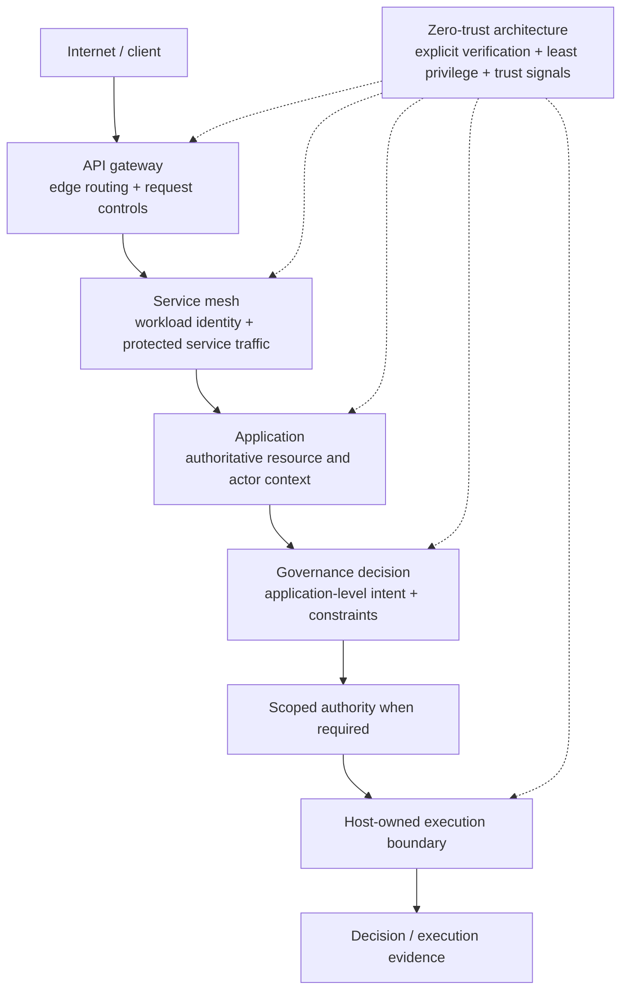

# API Gateways, Service Meshes, Zero Trust, and Governed Execution

**Pattern classification:** Alternative Pattern

**Difficulty:** Advanced

**Prerequisites:** [Trust Boundaries and Least Privilege](../security/trust-boundaries-and-least-privilege.md), [Decision Before Execution](../tutorials/decision-before-execution.md), and familiarity with distributed application boundaries.

> **Terminology note:** This comparison uses `API gateway`, `service mesh`, `zero-trust architecture`, `governance decision`, `scoped authority`, and `host-owned execution` as architectural terms. Product implementations vary. The comparison focuses on responsibilities and trust boundaries rather than requiring one vendor, proxy, mesh, identity system, or policy engine. See the [Architecture Glossary](glossary.md) and [Terminology and Established Architecture Concepts](terminology-and-established-concepts.md) for the broader vocabulary used throughout Learning.

API gateways, service meshes, zero-trust architecture, and governed execution can all appear to answer a similar question:

> Where should the system decide whether a request is allowed to continue?

That similarity is useful, but incomplete.

The four approaches commonly protect different things:

```text
API gateway
=
How may traffic enter or leave an API boundary?

Service mesh
=
How may identified workloads communicate across service boundaries?

Zero-trust architecture
=
What security assumptions should govern access regardless of network location?

Governed execution
=
Should this application-level intent become this real-world side effect,
and what authority and evidence must exist before execution?
```

The important question is therefore not:

> Which gateway should replace the others?

It is:

> **Which boundary is being protected, what fact is being verified there, and who ultimately owns the side effect?**

A mature distributed system may legitimately use all four.

---

## Quick Orientation

| Approach | Primary boundary | Typical concern | What it can establish well | What it does not establish automatically |
| --- | --- | --- | --- | --- |
| API gateway | Client/API or edge boundary | North-south request mediation | Route, client authentication integration, edge authorization, throttling, transformation | Business approval, acknowledgment, durable decision provenance, narrow continuation authority |
| Service mesh | Service-to-service boundary | East-west workload communication | Workload identity, mTLS, traffic policy, service authorization, telemetry | Application intent semantics, human approval, resource-specific business decisions |
| Zero-trust architecture | Cross-cutting security architecture | Trust evaluation independent of network location | Explicit verification, least privilege, identity-centered access, continuous security signals | One universal request pipeline or one application decision model |
| Governed execution | Application decision/execution boundary | Consequential action | Explicit decision outcomes, acknowledgment/escalation, scoped authority, execution ownership, decision evidence | Transport encryption, routing, workload identity, network segmentation by itself |

This matrix is not a ranking.

Each approach becomes misleading only when evidence from one layer is treated as proof of a different property at another layer.

For example:

```text
mTLS succeeded
```

can establish that an authenticated workload participated in a protected channel.

It does not by itself establish:

```text
This production database should be deleted.
```

Likewise:

```text
Governance decision = Allowed
```

is not a substitute for:

```text
Authenticate the workload.
Encrypt the channel.
Rate-limit the public edge.
Validate the destination service.
```

The boundaries can reinforce one another precisely because they are not identical.

---

## A Layered View

A useful conceptual stack is:



The diagram should not be read as one mandatory deployment topology.

An application may have no service mesh. An internal API may have no public gateway. A low-risk operation may need no separately issued capability or acknowledgment workflow.

The diagram exists to make the responsibility boundaries visible.

---

## 1. API Gateway

An API gateway usually mediates requests at an application or platform edge.

```text
Client
   ↓
API gateway
   ↓
One or more backend APIs
```

Common responsibilities include:

- Routing.
- Authentication integration.
- Coarse or endpoint-level authorization.
- Rate limiting and quotas.
- Request and response transformation.
- Header normalization.
- API aggregation.
- Protocol mediation.
- Edge telemetry.
- Centralized rejection of malformed or disallowed traffic.

Those responsibilities can be security-critical.

A gateway may prevent an unauthenticated client from reaching a backend at all. It may enforce token validation, reject oversized payloads, apply quotas, or route requests only to known services.

That is meaningful protection.

### What an API Gateway Does Not Automatically Know

The gateway normally does not have enough authoritative application state to answer every business-level question.

Consider:

```text
POST /cases/case-123/purge
```

The gateway may know:

```text
Caller token is valid.
Route exists.
Request shape is acceptable.
Rate limit is not exceeded.
Client may invoke this API family.
```

The application may still need to determine:

```text
Does case-123 exist?
Is it under legal hold?
Does the current tenant own it?
Has retention expired?
Does this operation require a second reviewer?
Was the warning acknowledged?
Should the operation execute now, defer, or escalate?
```

Those facts are application semantics, not merely edge traffic semantics.

A gateway can integrate with a business policy service, but that is an architectural choice. The label **API gateway** does not itself guarantee that consequential application decisions, acknowledgment workflows, continuation authority, or durable decision provenance exist.

### Where an API Gateway Clearly Wins

Consider a public read-only catalog API.

Requirements:

- Authenticate API clients.
- Enforce per-client quotas.
- Route `/catalog/*` to the catalog service.
- Normalize API versions.
- Reject malformed requests before they reach the application.
- Return only non-sensitive published catalog data.
- No operation changes external state.

A practical architecture may be:

```text
Client
   ↓
API gateway
   ↓
Authenticated + rate-limited request
   ↓
Catalog service
   ↓
Read response
```

Adding acknowledgment records, scoped continuation grants, or a governance-decision ledger to every catalog read would add complexity without addressing a meaningful consequential-action problem.

The API gateway is not a lesser design in this case.

It is the boundary that matches the problem.

---

## 2. Service Mesh

A service mesh focuses primarily on communication among workloads inside a distributed system.

```text
Service A
   ↓
Mesh-mediated service boundary
   ↓
Service B
```

Common responsibilities include:

- Workload or service identity.
- Mutual TLS.
- Certificate and trust-domain integration.
- Traffic routing.
- Service-to-service authorization policy.
- Retries, timeouts, and circuit-breaking behavior.
- Telemetry and distributed request observation.
- Traffic shaping for rollouts or failover.

Depending on the mesh and deployment, policy can inspect transport properties, workload identity, request metadata, or selected application-layer attributes.

That can produce strong service communication controls.

### Service Identity Is Not Business Intent

Suppose the mesh proves:

```text
Caller workload = deployment-api
Destination workload = deployment-runner
Channel = mutually authenticated and encrypted
Mesh policy = deployment-api may call deployment-runner
```

Those facts answer an important infrastructure question:

> May these identified workloads communicate through this service path?

They do not necessarily answer:

> Was release 2026.08.24.3 approved for production by the required humans under the current change window?

The second question requires application state and domain semantics that a generic service-communication layer may not possess.

A mesh authorization rule can be part of the answer, but it should not be mistaken for the whole decision merely because traffic passed through an authenticated sidecar or proxy.

### Retries Expose the Layer Difference

Service meshes often provide retry behavior because transient network failure is common.

That is valuable for safe retryable operations.

But a mesh cannot infer that every consequential application command is semantically safe to repeat.

For example:

```text
POST /payments/settle
```

or:

```text
POST /accounts/user-123/disable
```

may require application-level idempotency, replay protection, or bounded-use authority.

The infrastructure can retry transport.

The application must still define what duplicate execution means.

This is a useful boundary rule:

> **Transport recovery does not automatically define side-effect recovery.**

### Where a Service Mesh Clearly Wins

Consider an internal metrics query path.

Requirements:

- Only approved observability workloads may query the metrics service.
- Calls must use authenticated workload identity.
- Traffic must be encrypted in transit.
- Requests should fail over safely between equivalent read-only replicas.
- Telemetry should expose latency and failure rates.
- The query does not create a consequential side effect.

A service mesh can be a natural place to enforce the workload-to-workload communication contract.

A separate application governance pipeline may not add enough value to justify itself.

---

## 3. Zero-Trust Architecture

Zero trust is broader than either an API gateway or a service mesh.

It is a security architecture strategy built around the idea that trust should not be granted merely because an actor or workload is on an internal network, behind a perimeter, or previously admitted to a trusted zone.

Common principles include:

- No implicit trust based only on network location.
- Explicit verification of users and workloads.
- Least-privilege access.
- Resource-oriented protection.
- Strong identity and credential hygiene.
- Evaluation of relevant security signals.
- Reassessment when risk, identity, device, workload, session, or resource conditions change.
- Designing with the possibility of compromise in mind.

Those principles can influence:

```text
Identity provider
API gateway
Service mesh
Application authorization
Secrets system
Device posture checks
Policy engine
Execution boundary
Audit and telemetry
```

That breadth is the point.

### Zero Trust Is Not One Pipeline

A system does not become zero trust merely by inserting one product between the client and the application.

Likewise, zero-trust architecture does not prescribe one universal sequence such as:

```text
Intent
   ↓
Decision
   ↓
Acknowledgment
   ↓
Capability
   ↓
Execution
```

That sequence belongs to a particular governed-execution lifecycle.

Zero-trust principles may strengthen every stage of that lifecycle, but zero trust is the security strategy, not the application's complete consequential-decision semantics.

### Continuous Evaluation Does Not Remove Decision Ownership

Security signals can change after initial authentication:

```text
User disabled.
Workload identity rotated.
Device posture degraded.
Source risk increased.
Resource sensitivity changed.
Session exceeded policy lifetime.
```

A zero-trust design may re-evaluate access when those signals change.

Application governance can consume such signals as authoritative context where relevant.

But the application still needs to decide what those signals mean for the domain operation.

For example:

```text
Risk state = elevated
```

might mean:

```text
Read-only query -> allow
Production deployment -> require acknowledgment
Key deletion -> deny
Emergency failover -> escalate
```

The security signal and the business decision are related without being identical.

---

## 4. Governed Execution

Governed execution focuses on the transition from proposed intent to real side effect.

The Learning model is:

```text
Intent
   ↓
Authoritative context
   ↓
Policy / constraints
   ↓
Explicit decision
   ↓
Acknowledgment or escalation when required
   ↓
Scoped authority when required
   ↓
Host-owned execution
   ↓
Audit residue / decision evidence
```

This model is useful when the application must preserve distinctions that ordinary request admission does not express cleanly.

Examples include:

- `Allow` versus `Deny` is not sufficient because `Defer`, `RequireAcknowledgment`, or `Escalate` are meaningful outcomes.
- A human approval must survive independently of the caller's session.
- A later worker should receive only narrow continuation authority.
- A model or external client may propose an action but must not own the side effect.
- Current resource state must be reconstructed immediately before a consequential decision.
- The system must preserve why a consequential action was allowed, blocked, delayed, or escalated.

### Governed Execution Is Not a Network Security Layer

A governance decision should not be treated as permission to bypass infrastructure controls.

An allowed application decision may still require:

```text
Authenticated workload
   +
Encrypted transport
   +
Allowed service path
   +
Valid destination identity
   +
Current execution authority
```

The host that owns the side effect remains responsible for validating the conditions that matter at execution time.

That is consistent with the repository's broader trust-boundary rule:

> **A trust boundary should change what the system is willing to believe and what authority it is willing to pass onward.**

---

## Which Boundary Protects What?

The issue becomes clearer when the questions are asked directly.

| Question | Primary answer | Notes |
| --- | --- | --- |
| Which boundary protects public API ingress and egress? | API gateway | May integrate authentication, authorization, throttling, transformation, and routing. |
| Which boundary protects service-to-service identity and transport? | Service mesh | Commonly handles workload identity, mTLS, traffic policy, and service communication controls. |
| Which architecture rejects implicit trust based on network location? | Zero-trust architecture | Cross-cutting security strategy rather than one proxy or one pipeline. |
| Which layer evaluates application-level intent against authoritative domain context? | Application authorization/policy or governed execution | Depends on whether ordinary authorization or a richer decision lifecycle is required. |
| Which component owns the real side effect? | The host/executor that performs it | Infrastructure and governance controls should constrain access to this boundary; they do not eliminate execution ownership. |
| Which layer can preserve why a consequential action was allowed, denied, deferred, acknowledged, or escalated? | Governed application decision/evidence layer | Gateway and mesh logs remain valuable operational/security evidence but are not automatically business-decision provenance. |

The word **primary** matters.

Real systems may intentionally integrate these responsibilities. A gateway can call a policy engine. A mesh can enforce application-layer attributes. A governance service can use workload identity. A host can emit transport, security, business, and audit telemetry from one request.

Integration does not erase the semantic distinction among the facts being enforced.

---

## Communication Authorization Versus Action Authorization

A particularly useful distinction is:

```text
Communication authorization
=
May this caller or workload reach this service or endpoint?
```

versus:

```text
Action authorization / governance
=
Should this concrete operation against this concrete resource proceed now?
```

Those questions can collapse into one check for a simple application.

For example:

```text
Authenticated reader
   ↓
GET /published-report/123
   ↓
Role check
   ↓
Return report
```

For a consequential distributed operation, they may need to remain separate:

```text
Deployment API may communicate with deployment runner
        ↓
Does not yet imply
        ↓
Release X is approved for production
```

This prevents a common false-confidence pattern:

> **Reachability is not the same thing as authority to perform every reachable action.**

---

## Operational Telemetry Versus Decision Provenance

All four approaches can produce evidence, but not necessarily the same evidence.

### API Gateway Evidence

Typical evidence may include:

- Client identity or token-validation result.
- Route selected.
- Request metadata.
- Rate-limit result.
- Edge response code.
- Request correlation data.

### Service Mesh Evidence

Typical evidence may include:

- Source workload identity.
- Destination workload identity.
- mTLS state.
- Service-authorization result.
- Retry count.
- Latency.
- Upstream/downstream failures.

### Zero-Trust Evidence

Depending on the architecture, evidence may include:

- User/workload identity evaluation.
- Device or workload posture.
- Risk signals.
- Policy-decision inputs.
- Credential state.
- Session or resource-access observations.

### Governed-Execution Evidence

For a consequential application decision, evidence may include:

- Intent or operation.
- Authoritative resource identity.
- Decision outcome.
- Reason codes.
- Policy version or fingerprint.
- Required acknowledgment or approval.
- Scoped authority issued.
- Execution correlation.
- Final execution result.

These evidence types can be correlated.

They should not be substituted for one another.

A `200` at an API gateway does not explain why a production deployment was approved.

A governance receipt does not prove that the service-to-service channel used mTLS.

The strongest architecture preserves the evidence needed for each boundary and correlates it without pretending that one log is every kind of proof.

---

## Example: Infrastructure Controls Are Sufficient

Consider an internal read-only employee directory query.

Requirements:

- Only authenticated corporate users may call the public directory API.
- Requests are rate limited.
- The gateway routes only supported API versions.
- Internal service calls use authenticated workload identity and encrypted transport.
- The directory service returns already-approved directory fields.
- No update, deletion, approval, or external side effect occurs.

The architecture may be:

```text
Corporate user
   ↓
API gateway
   - authenticate user
   - apply rate limit
   - route request
   ↓
Service mesh
   - authenticate workloads
   - encrypt service traffic
   - enforce service path
   ↓
Directory service
   - ordinary resource authorization
   ↓
Read response
```

Zero-trust principles can guide identity, least privilege, and verification throughout the path.

A separate governed-execution lifecycle would likely be unnecessary unless the domain introduces a consequential decision that ordinary authorization cannot express adequately.

---

## Example: Application-Level Governance Is Additionally Justified

Now consider a production deployment.

Requirements:

- The external operator must be authenticated.
- The edge must reject unauthorized or abusive traffic.
- Only the deployment API may communicate with the deployment runner.
- Workload traffic must be mutually authenticated and encrypted.
- The release must match the requested environment.
- The current change window must permit deployment.
- High-risk releases require human acknowledgment or escalation.
- A later runner should receive authority only for this release and environment.
- The runner must not inherit the operator's broad standing credentials.
- The system must preserve why deployment was allowed and what was executed.

The combined architecture can be:

```text
Operator
   ↓
API gateway
   - authenticate / rate limit / route
   ↓
Deployment API
   ↓
Authoritative release + environment + risk context
   ↓
Governance policy
   ├── Deny
   ├── Defer
   ├── RequireAcknowledgment
   └── Allow
          ↓
Short-lived deployment capability
   - operation = deployment.apply
   - release = release-2026.08.24.3
   - environment = production
   - audience = deployment-runner
          ↓
Service mesh
   - deployment-api workload may reach deployment-runner
   - authenticated / encrypted service path
          ↓
Deployment runner
   - validate scoped authority
   - re-check execution-sensitive state
          ↓
Host-owned deployment
          ↓
Decision + execution evidence
```

Zero-trust principles apply across the entire flow:

- The operator is not trusted merely because the request came from a corporate network.
- The deployment API is not trusted merely because it is an internal service.
- The runner accepts only the workload and authority intended for the operation.
- Authority is narrower than the operator's general identity.
- Relevant state is verified where it matters.

No one layer replaces the others.

Each layer contributes a different guarantee.

---

## Common False-Confidence Patterns

### "The Gateway Authenticated the User, So the Operation Is Authorized"

Authentication at the edge establishes who presented acceptable credentials according to the configured identity path.

It does not automatically establish that every resource-specific business action is allowed.

Prefer:

```text
Edge authentication
   +
application authorization / policy
```

when the domain requires both.

### "mTLS Means the Calling Service Is Trusted"

mTLS can establish authenticated encrypted communication between identities participating in the trust model.

It does not establish that every request from that workload is semantically correct, current, non-compromised, or permitted for every resource.

Prefer:

```text
Authenticated workload
   +
least-privilege service policy
   +
application validation where required
```

### "We Bought a Zero-Trust Product"

Zero trust is not established by the presence of one gateway, proxy, identity provider, endpoint agent, or policy product.

The architecture must still explain:

- What is verified.
- Which signals are authoritative.
- Where least privilege is enforced.
- What happens when trust signals change.
- Which resources are protected.
- How access is constrained after compromise is assumed possible.

### "Governance Allowed It, So Infrastructure Controls Can Be Skipped"

An application decision does not replace workload identity, transport security, secrets hygiene, network/service policy, or destination validation.

The execution host should require all controls that protect its boundary.

### "The Mesh Will Retry It Safely"

A transport retry can repeat an application request.

Consequential operations need explicit application-level idempotency, replay, or bounded-use semantics when duplicate execution would be unsafe.

### "The Gateway Log Is the Audit Record"

Gateway and mesh telemetry can be important evidence.

But if the requirement is to explain a consequential decision, preserve the decision semantics directly:

```text
What operation?
Which resource?
Which policy?
Which outcome?
Which reason?
Which acknowledgment?
Which authority?
Which execution?
```

---

## Where Responsibilities Overlap

The boundaries are distinct, but the implementations can overlap.

### Authentication

An API gateway may authenticate a user.

A service mesh may authenticate a workload.

The application may authenticate or validate a caller context again before a sensitive operation.

These checks answer identity questions at different boundaries.

### Authorization

A gateway may authorize an endpoint or scope.

A mesh may authorize service-to-service communication.

An application may authorize a user against a resource.

A governed workflow may decide that an authorized actor still requires acknowledgment or escalation before a consequential operation proceeds.

The word `authorization` therefore needs context:

> Authorized **for what**, **against which resource**, **at which boundary**, and **for how long**?

### Policy

All four approaches can use policy.

Policy at one layer should not be assumed to contain every rule needed by another layer.

Examples:

```text
Gateway policy:
Requests above quota are rejected.

Mesh policy:
Only service A may call service B.

Zero-trust access policy:
Workload identity and current posture must satisfy the resource access rule.

Governance policy:
Production deletion requires current retention eligibility and reviewer acknowledgment.
```

The shared word does not make the policies interchangeable.

### Telemetry

Gateway, mesh, identity, policy, application, and executor telemetry should be correlated where practical.

Correlation improves diagnosis and evidence without collapsing the records into one undifferentiated log stream.

---

## When Not to Add Governed Execution

Prefer infrastructure controls plus ordinary application authorization when:

- The operation is read-only or low consequence.
- Authorization is consumed immediately in the same application boundary.
- No human acknowledgment or escalation state must survive the request.
- No later worker needs independently scoped continuation authority.
- Ordinary resource authorization expresses the domain rule completely.
- Gateway or mesh controls already solve the actual infrastructure problem.
- A governance-decision ledger would create more operational burden than useful evidence.

The existence of a governed-execution pattern does not make every request a governance event.

Canonical does not mean universal.

---

## A Practical Decision Guide

Start by identifying the property you need.

### Add or Strengthen an API Gateway When

```text
The problem is primarily at the client/API edge:
routing + ingress policy + authentication integration + quotas + transformation
```

Ask:

1. Do multiple APIs need a common external entry point?
2. Should malformed, unauthenticated, or over-quota traffic be rejected before reaching backend services?
3. Are routing, versioning, aggregation, or protocol concerns being duplicated across services?

If yes, an API gateway may be the right boundary.

### Add or Strengthen a Service Mesh When

```text
The problem is primarily workload-to-workload communication:
identity + mTLS + service policy + traffic behavior + telemetry
```

Ask:

1. Do many services need consistent workload identity and transport protection?
2. Is service-to-service policy duplicated in application code or platform configuration?
3. Do traffic shaping, failover, retries, or service telemetry need a common infrastructure layer?

If yes, a service mesh may be earning its complexity.

### Apply Zero-Trust Architecture When

```text
The security model relies too heavily on trusted network location
or broad standing access
```

Ask:

1. Which users, workloads, devices, and resources need explicit identity?
2. Where is access granted because something is merely "inside"?
3. Can authority be made more resource-specific and least-privilege?
4. Which security signals should cause access to be re-evaluated?
5. What changes if compromise is assumed possible?

Zero trust is an architecture-wide reasoning model rather than a single deployment component.

### Add Governed Execution When

```text
The application must reason explicitly about whether intent becomes action
and preserve that decision across a consequential boundary
```

Ask:

1. Does the operation have meaningful outcomes beyond allow/deny?
2. Must authoritative resource or policy state be reconstructed before acting?
3. Is acknowledgment, escalation, or human approval part of the lifecycle?
4. Must a later executor receive narrower authority than the caller possesses?
5. Must the system preserve durable evidence explaining the consequential decision?
6. Does the execution host need to validate authority independently immediately before the side effect?

If several answers are yes, governed execution may solve an application-level problem that infrastructure controls intentionally do not.

---

## Relationship to Existing Learning Material

Use these pages together when useful:

1. [Trust Boundaries and Least Privilege](../security/trust-boundaries-and-least-privilege.md) — explains how trust changes across clients, services, queues, proxies, and execution contexts.
2. [When ASP.NET Core Authorization Is Enough](when-aspnet-core-authorization-is-enough.md) — determines whether ordinary application authorization already expresses the access-control requirement.
3. [Role-Based, Claims-Based, and Capability-Based Authorization](role-based-claims-based-and-capability-based-authorization.md) — compares standing identity authority with narrowly scoped continuation authority.
4. [Decision Before Execution](../tutorials/decision-before-execution.md) — introduces the foundational rule that a blocked decision never reaches the executor.
5. [Governed AI Tool Gateway](../tutorials/governed-ai-tool-gateway.md) — applies the same execution-ownership boundary when an AI model proposes an operation.

These pages describe different layers of the same larger architecture problem.

They should be composed only where the corresponding boundaries actually exist.

---

## Review Checklist

Before treating an infrastructure control as sufficient, ask:

- [ ] Which identity did this boundary verify: user, client, workload, device, or something else?
- [ ] What exact communication or operation did the policy authorize?
- [ ] Is current authoritative resource state required before the side effect?
- [ ] Does a successful network/service policy decision prove the business action is allowed?
- [ ] Could retry, replay, or delayed execution change the meaning of the request?
- [ ] Which component owns the real side effect?
- [ ] What evidence is needed later: transport telemetry, security evidence, business-decision provenance, execution evidence, or several of these?

Before adding governed execution, ask:

- [ ] Does the application really have a consequential decision lifecycle?
- [ ] Are `Defer`, `RequireAcknowledgment`, or `Escalate` meaningful outcomes?
- [ ] Does authority need to survive narrowly across time, process, queue, gateway, or trust boundaries?
- [ ] Would ordinary authorization plus existing gateway/mesh controls be simpler and sufficient?
- [ ] Have transport security and workload identity been preserved rather than replaced by governance logic?

---

## Summary

API gateways protect API edges and mediate request traffic.

Service meshes protect and control workload-to-workload communication.

Zero-trust architecture provides a cross-cutting security strategy that rejects implicit trust based solely on location and emphasizes explicit verification and least privilege.

Governed execution protects the application-level transition from proposed intent to consequential side effect through explicit decisions, acknowledgment or escalation where required, narrow continuation authority where useful, host-owned execution, and decision evidence.

The strongest design is not the one with the most gateways.

It is the one that can answer, at every important boundary:

```text
What is being protected?
What was verified?
What authority crossed the boundary?
Who owns the side effect?
What evidence remains?
```

Use the smallest set of boundaries that answers those questions without false confidence or unnecessary ceremony.

---

> **Read it. Run it. Question it. Improve it.**
