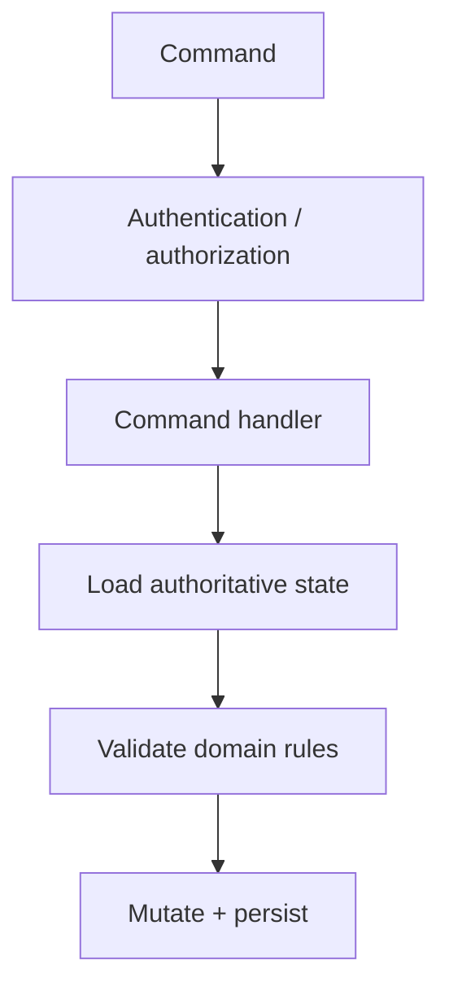
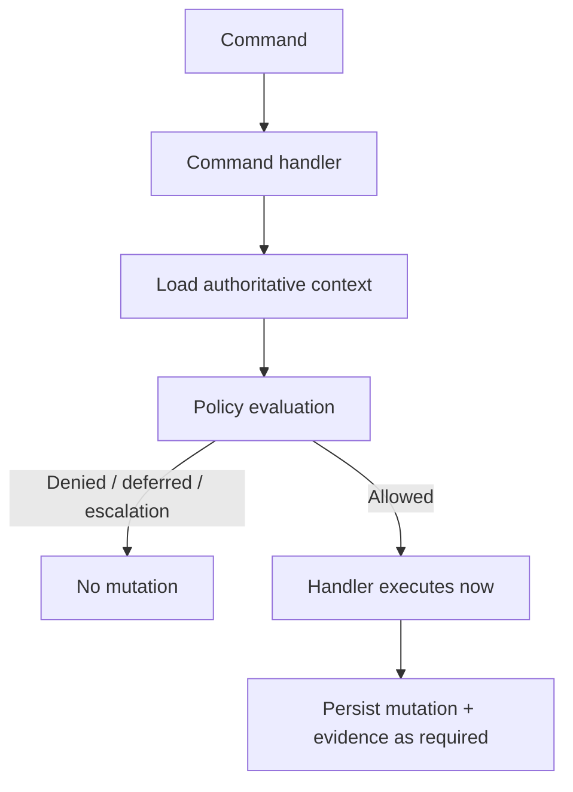
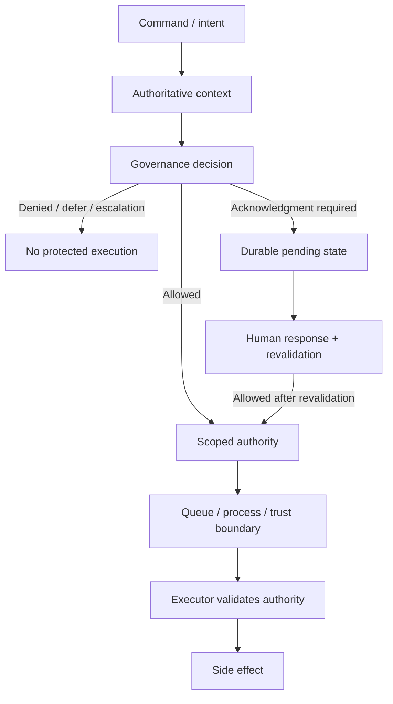

# CQRS, Command/Query Separation, and Governed Execution

**Pattern classification:** Alternative Pattern

**Difficulty:** Intermediate

**Prerequisites:** Recommended — [Decision Before Execution](../tutorials/decision-before-execution.md) and [When a Simple Application Service Is Enough](when-a-simple-application-service-is-enough.md). [Scoped Capability and Host-Owned Execution](../tutorials/scoped-capability-and-host-owned-execution.md) is useful when a command is approved now but executed later or elsewhere.

> **Terminology note:** This comparison uses `command`, `query`, `command handler`, `CQRS`, `governance decision`, `scoped authority`, and `host-owned execution` as architectural terms. Libraries and frameworks use these words differently. The important question is which responsibility a component actually owns, not whether an API is named `CommandHandler`, `Mediator`, `Pipeline`, or `Behavior`.

> **Industry anchors:** .NET teams often encounter MediatR, Wolverine, message buses, mediator pipelines, and separate read/write models while implementing command/query separation. These are orientation points for searchability, not definitions of CQRS and not evidence that a governance boundary exists. A request/handler library can support CQRS-style organization without providing authorization, policy provenance, approval, or scoped continuation authority by itself.

> **Standalone-reader note:** In this article, **Learning** means the ASI Backbone Learning repository and tutorial series. Its governed-execution model separates proposed intent, authoritative context, policy decision, optional acknowledgment or escalation, scoped authority when needed, host-owned execution, and audit residue. Those responsibilities may live in one application or be split across components.

## Executive Summary

Keep the boundaries small:

- **CQRS** separates reads from mutation requests.
- **A command handler** may be the complete host-owned execution boundary for an immediate, authorized mutation.
- **Explicit policy** belongs in the immediate path when richer decision semantics are useful but execution still happens now.
- **A separate governance lifecycle** is justified when approval, delay, policy drift, delegation, or a different executor makes authority survive beyond the handler.

> **Central lesson:** CQRS separates application responsibilities. Governed execution separates decision from execution only when the lifecycle actually requires that distinction.

**Five-minute path:** read [Quick Orientation](#quick-orientation), [The Three Designs](#the-three-designs), [CQRS, Event Sourcing, and Governed Execution Are Independent Choices](#cqrs-event-sourcing-and-governed-execution-are-independent-choices), and [A Practical Decision Guide](#a-practical-decision-guide).

---

## Quick Orientation

| Concern | Primary question | Natural strength | Does not automatically provide |
| --- | --- | --- | --- |
| Query | What information should be returned? | Read-focused models and optimized projections | Permission to disclose sensitive data or evidence requirements |
| Command | What state change is being requested? | Explicit mutation intent | Authorization, policy approval, durable authority, or provenance |
| Command handler | How should this mutation be validated and executed? | Focused use-case boundary, transaction coordination, domain-rule invocation | Separate policy lifecycle or post-decision authority unless deliberately implemented |
| CQRS | Should read and write responsibilities/models be separated? | Independent read/write evolution where justified | Event sourcing, governance, approval, capabilities, or audit evidence |
| Governed execution | May this proposed mutation proceed under current constraints? | Explicit decision semantics, provenance, acknowledgment/escalation, revalidation | A requirement to split read/write models |
| Scoped authority | May a later/different executor perform this exact mutation now? | Narrow delegated continuation authority | Correctness of the original decision |
| Host-owned execution | Which trusted component ultimately creates or blocks the side effect? | Final enforcement of the mutation boundary | Correct upstream evidence unless the host verifies it |

These mechanisms compose, but none is a maturity level above the others.

A routine path may be:

```text
Command
   ↓
Authorization + validation
   ↓
Command handler
   ↓
Domain mutation
   ↓
Save
```

A delayed consequential path may be:

```text
Command / intent
      ↓
Authoritative context
      ↓
Governance decision
      ↓
Human review when required
      ↓
Scoped continuation authority
      ↓
Later executor
```

---

## What Command/Query Separation Actually Means

At its smallest useful form:

```text
Query
   ↓
Read path
   ↓
Result

Command
   ↓
Write path
   ↓
Mutation result
```

A query asks for information. A command requests a state transition or side effect.

Examples:

```text
Queries:
- GetAccountSummary
- SearchCases

Commands:
- ArchiveCase
- DisableAccount
```

A command is intent, not proof that the mutation already happened:

```text
ArchiveCase command
        ≠
CaseArchived fact
```

A command is also not authority. If a command contains:

```csharp
public sealed record ArchiveCaseCommand(
    string CaseId,
    string RequestedBy);
```

the object does not prove that `RequestedBy` is authenticated, may edit `CaseId`, or that the case is still in a mutable state.

### Queries Are Not Automatically Safe

A query can disclose sensitive data even when it does not mutate state. Read paths may still need authentication, authorization, tenant isolation, row/resource filtering, data minimization, privacy controls, and audit evidence.

Command/query separation distinguishes mutation semantics. It does not replace a read-side threat model.

---

## CQRS Is a Separate Architectural Choice

CQRS becomes more architectural when read and write responsibilities or models intentionally differ:

```text
Write side
   ↓
Domain model
   ↓
Transactional persistence

Read side
   ↓
Projection / denormalized view
   ↓
Query model
```

Possible motivations include different performance needs, query-specific models, complex write-side invariants, independent scaling, or multiple projections.

The costs are also real:

- Multiple models for the same business concept.
- Projection maintenance.
- Eventual consistency.
- More mapping and message types.
- Additional failure/retry paths.
- More operational debugging.

> **Separate read and write models only as far as the problem earns the complexity.**

---

## The Command Handler Can Be the Host-Owned Execution Boundary

A command handler often already owns the immediate use-case boundary:

```text
Load authoritative state
        ↓
Authorize actor/resource
        ↓
Validate domain transition
        ↓
Mutate
        ↓
Persist
```

For example:

```csharp
public sealed class ArchiveCaseHandler(
    ICaseRepository cases,
    IAuthorizationService authorization,
    IUnitOfWork unitOfWork)
{
    public async Task<ArchiveCaseResult> HandleAsync(
        ArchiveCaseCommand command,
        ClaimsPrincipal actor,
        CancellationToken cancellationToken)
    {
        CaseFile? caseFile = await cases.FindAsync(
            command.CaseId,
            cancellationToken);

        if (caseFile is null)
        {
            return ArchiveCaseResult.NotFound();
        }

        AuthorizationResult auth = await authorization.AuthorizeAsync(
            actor,
            caseFile,
            "ArchiveCase");

        if (!auth.Succeeded)
        {
            return ArchiveCaseResult.NotPermitted();
        }

        if (!caseFile.IsDraft)
        {
            return ArchiveCaseResult.InvalidState("case.archive.not-draft");
        }

        caseFile.Archive();
        await unitOfWork.SaveChangesAsync(cancellationToken);

        return ArchiveCaseResult.Succeeded();
    }
}
```

If the operation is immediate, local, and fully decided inside this trusted boundary, that may be the entire architecture required.

> **Host-owned execution does not require a special `Executor` class. A command handler can be the host when it actually owns and can block the side effect.**

### Handler Versus Executor

The terms can overlap, but they describe different responsibilities:

| Role | Primary responsibility | Typical lifetime | May be the same component? |
| --- | --- | --- | --- |
| Command handler | Interpret one mutation request, load authoritative state, validate, coordinate domain work, and return an application result | Usually one command dispatch | Yes |
| Executor | Own the final protected side effect and reject execution when required authority is absent or stale | Immediate or later/different process | Yes, when the handler performs the side effect itself |

For an immediate local mutation:

```text
Command handler = executor
```

For delayed execution:

```text
Original command handler
        ≠
Later worker / executor
```

The distinction matters only when time, trust, or delegation separates the two responsibilities.

---

## The Three Designs

### Design 1 — Direct Command Handler with Authorization and Validation



Use this when execution is immediate, one application trust boundary owns the use case, ordinary authorization expresses actor/resource access, domain rules are local, and no durable approval or later executor exists.

This is often the correct architecture for routine mutations.

### Design 2 — Command Handler Invokes Policy Before Immediate Execution

Sometimes ordinary authorization is not the whole decision, but a delayed authority lifecycle is still unnecessary.



Use this when structured policy outcomes, reason codes, or policy identity add value, while execution still happens immediately inside the same trusted application.

The handler remains the host-owned executor.

### Design 3 — Decision and Execution Split Across Time or Process Boundaries



A compact teaching shape might separate the original command from the later execution message:

```csharp
public sealed record ExecuteDeployment(
    string DeploymentId,
    string CapabilityId,
    string IntentFingerprint,
    string IdempotencyKey);

public sealed class ExecuteDeploymentHandler(
    ICapabilityValidator capabilities,
    IDeploymentService deployments)
{
    public async Task HandleAsync(
        ExecuteDeployment command,
        CancellationToken cancellationToken)
    {
        CapabilityValidationResult authority = await capabilities.ValidateAsync(
            command.CapabilityId,
            expectedOperation: "deployment.execute",
            expectedResource: command.DeploymentId,
            expectedIntentFingerprint: command.IntentFingerprint,
            cancellationToken);

        if (!authority.IsValid)
        {
            return;
        }

        await deployments.ExecuteOnceAsync(
            command.DeploymentId,
            command.IdempotencyKey,
            cancellationToken);
    }
}
```

The capability shape and persistence mechanism are implementation-specific. The architectural point is that the later handler does **not** infer execution authority merely from the fact that a command arrived.

Use this when execution is delayed, a different worker/service executes, human review interrupts the flow, policy or resource state may drift, or the later executor should receive narrower authority than the requester holds.

The richer lifecycle exists because authority must survive a real boundary—not because CQRS demands it.

---

## Mediator Pipelines Are Structure, Not Semantics

Mediator pipelines can be an excellent place to compose cross-cutting concerns:

```text
ValidationBehavior
AuthorizationBehavior
PolicyBehavior
TransactionBehavior
Handler
```

But the presence of a pipeline does not prove what any stage means.

For example, a `PolicyBehavior` could evaluate a versioned governance policy and persist reason-coded provenance, or it could simply call a boolean predicate. An `AuthorizationBehavior` could enforce authoritative resource access, or it could trust caller-supplied identifiers without loading the resource. The pipeline supplies **placement and ordering**; the application still owns the semantics, evidence, and trust model.

> **Mediator pipeline = composition structure, not automatic authorization or governance semantics.**

## Authorization, Validation, Policy, and Domain Rules Are Different

The checks inside that structure still answer different questions.

| Check | Example question |
| --- | --- |
| Authentication | Who is the caller? |
| Authorization | May this actor request this operation on this resource? |
| Structural validation | Is the command shape valid? |
| Domain validation | Is this transition valid for current domain state? |
| Governance policy | May the operation proceed under broader current constraints? |
| Execution-authority validation | May this later executor perform this exact operation now? |

Pipeline placement does not itself answer which facts are authoritative, which policy version produced the decision, whether approval is durable, or what authority crosses a queue.

---

## When a Direct Handler Is Enough

Prefer the direct handler when most of these are true:

- Execution is immediate.
- One trusted application boundary owns the use case.
- Ordinary authorization covers actor/resource access.
- Validation and domain rules are local.
- No human acknowledgment or approval interrupts the flow.
- No later component needs portable authority.
- Normal audit/history is sufficient.
- The command does not survive a meaningful delay.

Example:

```text
UpdateNotificationPreference
        ↓
Authorize current user
        ↓
Validate preference
        ↓
Handler persists immediately
```

Adding a decision ledger, capability issuer, replay store, and separate executor would not protect an additional requirement.

---

## When Policy Inside the Handler Is Enough

Consider:

```text
StartDeployment
```

Requirements:

- Actor is authorized to deploy.
- Target environment is authoritative.
- Current change window must be open.
- Regional policy may deny.
- Policy identity/reasons should be recorded.
- Execution starts immediately after `Allowed`.

A reasonable path is:

```text
StartDeploymentCommand
        ↓
Handler loads context
        ↓
Policy evaluator
        ↓
Allowed / Denied / Deferred
        ↓
If Allowed: handler executes now
```

The policy evaluator is a distinct responsibility. The command handler still owns immediate execution.

A separate capability is unnecessary if no authority must cross time, process, or trust boundaries.

---

## When the Decision Must Outlive the Handler

Now change the deployment requirement:

```text
Command received at 13:00
        ↓
Approval at 13:20
        ↓
Change window opens at 14:00
        ↓
Worker executes at 14:05
```

The original handler cannot safely imply:

```text
Allowed at 13:00
        =
Authorized to execute at 14:05
```

The system must decide what the reviewer approved, which facts must be refreshed, what happens if policy or artifact identity changes, and what authority the worker receives.

A richer path becomes justified:

```text
Command
   ↓
Decision
   ↓
Durable pending / approval state
   ↓
Revalidation
   ↓
Scoped continuation authority
   ↓
Worker
   ↓
Execution
```

The distinction is temporal and trust-oriented, not merely structural.

---

## CQRS, Event Sourcing, and Governed Execution Are Independent Choices

These patterns are often mentioned together, but they solve different problems.

### CQRS Does Not Require Event Sourcing

A system can use separate read/write models while storing current write-side state in ordinary relational tables.

### Event Sourcing Does Not Require CQRS

An event-sourced system can reconstruct domain state from events without adopting a strongly separated read/write application model. The patterns often compose, but neither logically requires the other.

### Governed Execution Requires Neither

A conventional application can use policy decisions, acknowledgment, and scoped authority without event sourcing or separate read/write models.

Likewise, an event-sourced CQRS application may need no specialized governance lifecycle when ordinary authorization and domain rules are sufficient.

### All Three Can Be Composed

When each solves a real requirement:

```text
Command
   ↓
Governance decision
   ↓
Scoped authority
   ↓
Command-side executor
   ↓
Domain event
   ↓
Read projection
   ↓
Query
```

For the historical-record distinction, see [Event Sourcing, Audit Trails, and Governance Decision Provenance](event-sourcing-audit-trails-and-governance-decision-provenance.md).

---

## Transaction Boundaries Still Matter

CQRS does not remove transaction reasoning. It also does not remove concurrency reasoning: an immediate handler may still need an optimistic concurrency token, aggregate version, or other conflict-detection strategy when two commands race against the same state.

An immediate command may need:

```text
Load aggregate
   ↓
Validate
   ↓
Mutate
   ↓
Save one local transaction
```

If it also publishes integration events, a transactional outbox may be appropriate.

A delayed governed command may have separate durable steps:

```text
Decision stored
   ↓
Work item / authority stored
   ↓
Later executor transaction
```

A transaction does not make earlier policy fresh. Local atomicity and execution authority are different properties.

See [Data Access Boundaries and Transaction Reasoning](../aspnetcore/data-access-boundaries-and-transaction-reasoning.md).

---

## Asynchronous Commands Change the Authority Question

In-process dispatch:

```text
Endpoint
   ↓
Mediator
   ↓
Handler
   ↓
Mutation
```

may remain one immediate trust boundary.

Durable asynchronous dispatch:

```text
Endpoint
   ↓
Queue
   ↓
Time passes
   ↓
Worker
   ↓
Handler
   ↓
Mutation
```

creates a continuation boundary.

The worker must decide what it trusts. Options include current re-authorization/policy reconstruction, a narrowly scoped capability, or immutable intent/decision identity plus required revalidation.

A queue is not authorization:

```text
Message was published
        ≠
Execution is currently permitted
```

Transport properties such as retry, ordering, dead-lettering, or deduplication do not establish actor permission, policy freshness, human approval, or resource scope.

---

## Retries and Idempotency

Commands may be retried because of HTTP retries, queue redelivery, worker restart, or timeout ambiguity.

A logical operation might carry:

```text
CommandId = cmd-781
Operation = payment.release
Resource = payment-42
IdempotencyKey = hash("payment.release|payment-42|cmd-781")
```

The exact key format is application-specific; it should identify the logical side effect rather than a transport delivery attempt. The executor may need completion/use state so duplicate delivery cannot release payment twice.

Keep two questions separate:

```text
Authority valid?
        +
Logical operation already completed?
```

Idempotency is not authorization, and authorization is not idempotency.

---

## Human Approval Is Not Portable Execution Authority

A CQRS application may model:

```text
ApproveDeployment
RejectDeployment
```

as commands. That is useful.

But:

```text
ApproveDeployment succeeded
        ≠
Any deployment may now execute
```

Approval should be bound to the exact reviewed subject—such as deployment, artifact digest, environment, reviewer, and expiration.

The approval command records human disposition. A later executor may still require policy revalidation and scoped authority.

See [Workflow Engines, Human Approval Systems, and Governed Execution](workflow-engines-human-approval-and-governed-execution.md).

---

## Read Models Should Not Become Accidental Write Authority

A CQRS read projection may lag behind the authoritative write model.

Suppose a read model says:

```text
AccountStatus = Active
```

while the command-side aggregate is already:

```text
AccountStatus = Suspended
```

Using the stale projection as authoritative policy context for a consequential command can produce an incorrect decision.

> **A read model optimized for queries is not automatically an authoritative source for write-side authorization or governance.**

Freshness and authority must be deliberate.

---

## Anti-Patterns

| Anti-pattern | Why it is weak | Better question |
| --- | --- | --- |
| "It's a command, so it's authorized" | Message type describes intent, not permission | Which trusted boundary authorizes the actor/resource? |
| "The handler is separate, so execution is governed" | Class separation does not create policy semantics | Which decision can actually block the side effect? |
| "CQRS means event sourcing" | Read/write separation and event-based state are independent | Which state model does the domain require? |
| "We use a mediator pipeline, so provenance is handled" | Pipeline placement does not preserve policy identity/reasons automatically | What evidence is recorded? |
| "The command was approved earlier, so the worker can run it" | Delay introduces policy/context drift | What authority is valid at execution time? |
| "The queue authenticated the producer, so the command is authorized" | Producer identity is not resource/operation permission | What does the consumer verify? |
| "Queries are safe because they do not mutate" | Reads can disclose sensitive information | What read-side authorization/privacy applies? |
| "A transaction guarantees the workflow" | Local atomicity does not span time/process/policy boundaries | Which facts become durable at each boundary? |

---

## Failure Modes Worth Testing

### Caller-Supplied Context Becomes Authoritative

```json
{
  "accountId": "account-123",
  "classification": "Public"
}
```

If policy trusts `classification` directly, a tidy CQRS design can still make an unsafe decision.

Prefer:

```text
Command supplies resource identity
        ↓
Host loads account
        ↓
Authoritative classification resolved
        ↓
Authorization / policy
```

### Authorization Exists Only at the API Edge

```text
HTTP endpoint
   ↓
Authorize
   ↓
Queue
   ↓
Worker executes later
```

Role, resource, or policy state may change before consumption. The worker needs an explicit current-authority story.

### Retry Repeats an External Side Effect

```text
Charge succeeds
   ↓
Handler times out before recording success
   ↓
Message redelivered
   ↓
Charge repeats
```

This is an idempotency/transaction failure. Governance authorization alone does not solve duplicate effects.

### Query Path Bypasses Tenant Isolation

The write side authorizes every command while a global read projection leaks cross-tenant rows. Separate read/write models increase the need to verify security on both sides.

---

## Scenarios

### Scenario 1 — Routine Mutation: Direct Handler Wins

```text
UpdateNotificationPreference
```

Requirements: authenticated user, own-resource authorization, small input validation, immediate local mutation, no separate policy authority, no delayed approval, no later executor.

Use:

```text
Command
   ↓
Authorization + validation
   ↓
Handler
   ↓
Persist
```

A broader governance spine would duplicate responsibilities.

### Scenario 2 — Policy-Enriched Immediate Command

```text
ArchiveCustomerCase
```

Requirements: current actor/resource authorization, authoritative classification/retention context, reason-coded policy outcomes, policy identity/version evidence, immediate execution only when `Allowed`.

Use:

```text
Command
   ↓
Handler
   ↓
Authoritative context
   ↓
Policy
   ↓
Allowed?
   ├── no  -> no mutation
   └── yes -> mutate now
```

The handler remains the host-owned execution boundary.

### Scenario 3 — Delayed Cross-Process Execution

```text
ReleaseRestrictedExport
```

Requirements: policy evaluation, possible steward approval, future execution window, separate worker, policy drift, narrow worker authority, duplicate-delivery control, durable evidence.

Use:

```text
Command / intent
   ↓
Governance decision
   ↓
Approval when required
   ↓
Revalidation
   ↓
Scoped capability
   ↓
Queue
   ↓
Worker validates capability + idempotency
   ↓
Export
```

CQRS did not create this lifecycle. Delay and delegated authority did.

---

## A Practical Decision Guide

| Requirement | Direct handler | Handler + immediate policy | Decision/execution split |
| --- | --- | --- | --- |
| Immediate local mutation | Strong fit | Strong fit when policy adds value | Usually unnecessary |
| Ordinary actor/resource authorization | Strong fit | Strong fit | Still required somewhere |
| Explicit reason-coded policy outcomes | Optional | Strong fit | Strong fit |
| Policy identity/version provenance | Usually unnecessary | Good fit | Strong fit |
| Human acknowledgment/review | Weak fit for durable review | Possible for short synchronous cases | Strong fit |
| Execution delayed minutes/hours/days | Weak fit | Weak fit | Strong fit |
| Different worker/service executes | Possible with fresh authorization | Possible with re-evaluation | Strong fit when delegated authority is needed |
| Narrow authority after approval | Weak fit | Weak fit | Strong fit |
| Policy/context drift before execution | Re-evaluate locally | Re-evaluate policy | Explicit freshness/revalidation required |
| Replay/idempotency-sensitive queue | Not relevant to immediate call | Only if queued | Must be designed explicitly |
| Separate read/write models | Independent choice | Independent choice | Independent choice |
| Event sourcing | Independent choice | Independent choice | Independent choice |

A useful default is:

> **Start with a direct command handler. Add explicit policy when the decision semantics need it. Split decision from execution only when time, trust, delegation, or human review creates a real continuation boundary.**

---

## Decision Tree

```text
Does the operation mutate state?
    |
    +-- no --> Query/read path.
    |          Apply read authorization/privacy as required.
    |
    +-- yes --> Immediate in one trusted application boundary?
                 |
                 +-- yes --> Can ordinary authorization + validation + domain rules decide it?
                 |            |
                 |            +-- yes --> Direct command handler.
                 |            |
                 |            +-- no --> Need explicit policy/reasons/provenance?
                 |                         |
                 |                         +-- yes --> Handler invokes policy, then executes if allowed.
                 |
                 +-- no --> Authority survives delay/process/human review?
                              |
                              +-- yes --> Separate decision from later execution.
                                           Revalidate and/or issue scoped authority.
```

---

## Tests That Expose the Boundary

### Direct Handler

```text
Unauthorized actor
        ↓
Mutation count = 0
```

```text
Invalid domain state
        ↓
SaveChanges count = 0
```

### Handler + Policy

```text
Policy = Denied
        ↓
Mutation count = 0
        ↓
Decision evidence preserves policy identity/reason
```

### Delayed Execution

```text
Capability expired
        ↓
Worker mutation count = 0
```

```text
Policy changed before continuation
        ↓
Required revalidation blocks stale execution
```

```text
Same command delivered twice
        ↓
Idempotency / use-state prevents duplicate side effect
```

### Query Side

```text
Tenant A query
        ↓
Tenant B rows returned = 0
```

---

## Observability

Useful correlation vocabulary may include:

```text
command_received
command_rejected
policy_decision
command_handler_completed
command_enqueued
capability_issued
execution_rejected
execution_completed
query_executed
projection_lag_observed
```

Useful identifiers may include `CommandId`, `CorrelationId`, `DecisionId`, `CapabilityId`, `ResourceId`, and `PolicyId/PolicyVersion` when appropriate.

Telemetry helps reconstruct operations.

It does not become authorization merely because a log says `command_authorized = true`.

---

## Review Checklist

Before adding a separate governance lifecycle to a CQRS command path, ask:

### Command / Query

- [ ] Is the operation actually a mutation request?
- [ ] Are read/write models separated only where useful?
- [ ] Are query-side authorization, privacy, and tenant boundaries explicit?

### Immediate Handler

- [ ] Does the handler load authoritative write-side state?
- [ ] Is caller/resource authorization enforced?
- [ ] Are structural/domain validations explicit?
- [ ] Is concurrency/conflict handling explicit where needed (for example, an optimistic concurrency token or aggregate version)?
- [ ] Is the transaction boundary clear?
- [ ] Can the handler safely execute immediately?

### Policy

- [ ] Does explicit policy add semantics beyond ordinary domain validation?
- [ ] Are policy inputs authoritative?
- [ ] Are outcomes/reasons explicit?
- [ ] Is policy identity/version preserved if reconstruction requires it?

### Delayed Execution

- [ ] Does the decision survive the original handler?
- [ ] Can policy/context drift?
- [ ] Does a different process/service execute?
- [ ] Is human approval durable and bound to exact intent?
- [ ] Is continuation authority narrower than standing requester authority?
- [ ] Does the executor validate authority immediately before the side effect?

### Messaging / Evidence

- [ ] Can the command be delivered more than once?
- [ ] Is idempotency or bounded-use state explicit?
- [ ] Are transport guarantees distinguished from authorization guarantees?
- [ ] Can denied commands leave required evidence without mutation?
- [ ] Are command, decision, capability, and execution identifiers correlated?
- [ ] Is event sourcing used only if domain-state reconstruction actually requires it?

If the answers do not justify a separate lifecycle, keep the handler simple.

---

## Relationship to Existing Learning Material

- [Decision Before Execution](../tutorials/decision-before-execution.md) establishes that proposed mutation and side effect can be separated; a command is a familiar representation of that mutation intent.
- [When a Simple Application Service Is Enough](when-a-simple-application-service-is-enough.md) explains why an ordinary immediate use-case boundary is often preferable; a command handler is one common implementation.
- [Scoped Capability and Host-Owned Execution](../tutorials/scoped-capability-and-host-owned-execution.md) becomes relevant when a decision survives the handler and a later executor needs bounded authority.
- [Event Sourcing, Audit Trails, and Governance Decision Provenance](event-sourcing-audit-trails-and-governance-decision-provenance.md) explains why event-sourced domain history and governance evidence answer different historical questions.
- [Data Access Boundaries and Transaction Reasoning](../aspnetcore/data-access-boundaries-and-transaction-reasoning.md) covers persistence and transaction boundaries that still matter regardless of whether a request is modeled as a command.

---

## Final Takeaway

CQRS asks:

```text
Is this a read or mutation?
How should read and write responsibilities be organized?
```

Governed execution asks:

```text
May this proposed mutation proceed under current constraints?
What happens if review or delay interrupts the path?
What authority reaches the later executor?
What evidence explains the decision?
```

A command handler can be the correct host-owned executor. An explicit policy step can sit inside that immediate handler path. A separate decision/authority/execution lifecycle becomes valuable only when time, trust, human review, policy drift, delegation, or consequence makes those boundaries real.

> **Use command/query separation to clarify application intent, and add governance boundaries only where authority must be independently decided, preserved, revalidated, or transferred.**

---

> **Read it. Run it. Question it. Improve it.**
