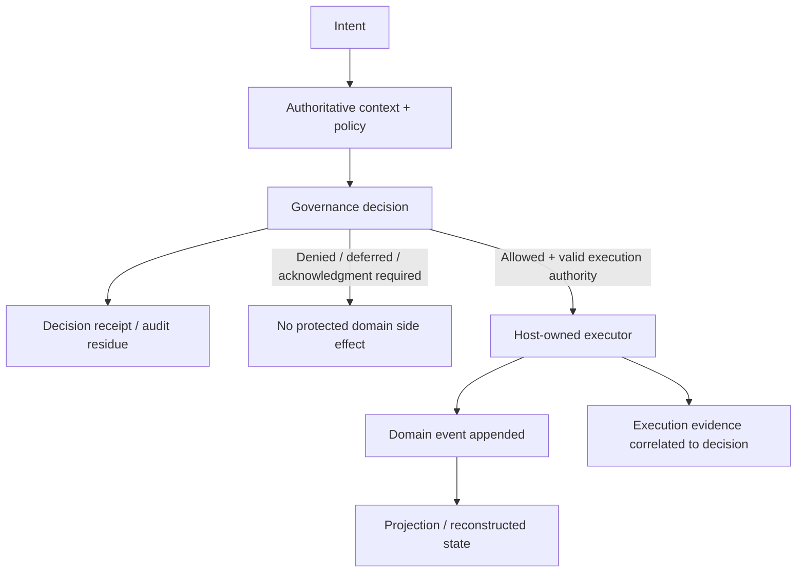

# Event Sourcing, Audit Trails, and Governance Decision Provenance

**Pattern classification:** Alternative Pattern

**Difficulty:** Advanced

**Prerequisites:** Recommended — [Acknowledgment and Audit Residue](../tutorials/acknowledgment-and-audit-residue.md) and [Policy Versioning and Decision Provenance](../governance/policy-versioning-and-decision-provenance.md). [Secure Logging Across Trust Boundaries](../security/secure-logging-across-trust-boundaries.md) is useful when comparing operational telemetry with evidence-oriented records.

> **Terminology note:** This comparison uses `operational log`, `audit trail`, `decision receipt`, `audit residue`, `domain event`, `event stream`, `projection`, `replay`, and `event sourcing` as architectural terms. Products and organizations use these words differently. The comparison is about what record owns which responsibility, not about prescribing one storage product or event framework.

> **Industry anchors:** EventStoreDB and Axon Framework are commonly associated with event-sourced architectures. Apache Kafka, Amazon SNS, and Amazon EventBridge are commonly used for event transport or event-driven integration, but using one of them does not by itself make domain events the source of application state. These names are included only for orientation and searchability.

> **Standalone-reader note:** In this article, **Learning** means the ASI Backbone Learning repository and tutorial series. `Audit residue` means structured evidence left by a governed lifecycle; it does not imply that a log line, database row, event stream, or hash is automatically immutable, tamper-evident, legally sufficient, or complete.

## Executive Summary

History serves different purposes:

- **Operational logs** explain runtime behavior.
- **Audit trails** explain who changed what and when.
- **Governance receipts / audit residue** explain why authority proceeded, stopped, paused, or transferred.
- **Event sourcing** makes domain events the source used to reconstruct application state.

A system may use several of these at once. None automatically implies the others.

### Thirty-Second Selection

```text
Need diagnostics?
    -> operational logs

Need ordinary change accountability?
    -> audit/history/temporal records

Need to reconstruct why authority was granted, denied, deferred, or exercised?
    -> governance decision evidence

Need domain state reconstructed from historical facts?
    -> event sourcing
```

A full event-sourced architecture is unnecessary when durable governance evidence is the real requirement. A decision-receipt store is likewise not a substitute for event sourcing when the domain genuinely requires event-based state reconstruction.

> **Central lesson:** Choose the historical record by the question you need to answer. **State reconstruction and authority reconstruction are different requirements.**

**Five-minute path:** read [Quick Orientation](#quick-orientation), [The State-and-Evidence Split](#the-state-and-evidence-split), the four [Architectural Scenarios](#8-architectural-scenario-1--crud-with-ordinary-audit-history), and [A Practical Decision Guide](#14-a-practical-decision-guide).

---

## Quick Orientation

| Record model | Primary question | Is it normally the source of application state? | Natural strength | Does not automatically provide |
| --- | --- | --- | --- | --- |
| Operational logging | What happened inside the running system? | No | Diagnostics, telemetry, debugging, service health, incident investigation | Complete business history, decision provenance, append-only retention, tamper evidence |
| Traditional audit trail | Who changed what, when, and sometimes from what to what? | Usually no | Accountability, change history, user/resource attribution | Policy identity, reason codes, acknowledgment lineage, execution authority, replayable domain state |
| Governance decision receipt / audit residue | Why did authority proceed, stop, pause, or transfer? | No | Intent identity, context provenance, outcome, reasons, policy evidence, acknowledgment/capability/execution linkage | Complete domain history or automatic reconstruction of current domain state |
| Event sourcing | What domain facts occurred, and what state results from replaying them? | Yes, by design | Full domain history, temporal state reconstruction, projections, event-driven integration | Decision reasons, denied attempts, policy evidence, privacy handling, tamper evidence, or safe replay of side effects |

A mature architecture can combine these records deliberately.

For example:

```text
Operational logs
        +
Governance receipts
        +
Event-sourced domain stream
        +
Read projections
```

The presence of one record does not make the others redundant unless it actually carries the required semantics and guarantees.

---

## The State-and-Evidence Split

A governed event-sourced operation may produce two distinct historical facts:



The diagram exposes an important case:

> A denied decision may leave governance evidence **without producing any domain event at all**.

That means an event stream containing only accepted domain state transitions cannot, by itself, answer every governance question.

Likewise, a decision receipt may explain why `AccountDisabled` was allowed without being sufficient to rebuild the account aggregate's entire history.

### Two Different Reconstruction Questions

Event sourcing often asks:

> Given events 1 through N, what was the aggregate state after event N?

Governance evidence asks questions such as:

> Which intent was evaluated?
>
> Which authoritative facts and policy version produced the decision?
>
> Why was it allowed or denied?
>
> Was acknowledgment required?
>
> Which capability or execution later relied on the decision?

Those are related historical questions, but not the same reconstruction problem.

---

## 1. Operational Logging

Operational logs are optimized for understanding the behavior and health of a running system.

Typical events include:

```text
Request started
Dependency timeout
Retry scheduled
Cache miss
Queue lag detected
Policy evaluator latency = 18 ms
Projection checkpoint advanced
Unhandled exception
```

Their primary consumers are usually:

- Developers.
- Operators.
- Site-reliability teams.
- Security monitoring teams.
- Incident responders.
- Observability systems.

### Operational Logs Are Often Intentionally Lossy

Production logging pipelines may legitimately use:

- Level filtering.
- Sampling.
- Aggregation.
- Rotation.
- Short retention.
- Collector buffering.
- Backend indexing limits.
- Cost-based exclusion.

Those behaviors can be appropriate for telemetry.

They are dangerous assumptions for evidence that must reconstruct a consequential decision.

For example:

```text
Information log sampled at 10%
        ↓
Decision reason emitted only as Information
        ↓
Historical investigation cannot prove which policy reason applied
```

The solution is not necessarily to disable sampling everywhere.

It is to avoid making ordinary telemetry the only copy of evidence whose completeness has different requirements.

### Structured Logging Is Still Not Decision Provenance

A log entry may be beautifully structured:

```json
{
  "event": "export_allowed",
  "resourceId": "dataset-42",
  "actorId": "analyst-7",
  "correlationId": "req-91"
}
```

but still omit:

```text
Intent fingerprint
Authoritative context identity
Policy id/version/fingerprint
Reason codes
Acknowledgment identity
Capability identity
Execution boundary
```

Structure improves queryability.

It does not create missing semantics.

The [Secure Logging Across Trust Boundaries](../security/secure-logging-across-trust-boundaries.md) material also emphasizes that retained logs are not automatically tamper-evident governance evidence.

---

## 2. Traditional Audit Trails

A traditional audit trail records accountable changes to application data or business resources.

A minimal CRUD model may preserve fields such as:

```text
CreatedUtc
CreatedBy
ModifiedUtc
ModifiedBy
```

A richer history table might preserve:

```text
AuditEntryId
ActorId
ResourceType
ResourceId
Operation
OldValue
NewValue
OccurredUtc
CorrelationId
```

This can be exactly the right architecture for many systems.

### What Traditional Audit History Answers Well

A well-designed audit trail can answer:

- Who created the record?
- Who changed it?
- When was it changed?
- Which fields changed?
- What was the previous value?
- Which application request or batch operation caused the change?

For ordinary administration or CRUD accountability, those questions may be all the business needs.

### Audit History Is Not Automatically Governance Evidence

Consider a row:

```text
Actor: admin-42
Operation: account.disable
Resource: user-123
OccurredUtc: 14:02
```

It records an accountable action.

It may not explain:

```text
Why was disable permitted?
Which policy version evaluated the request?
Was acknowledgment required?
Was a previous attempt denied?
Which exact proposed intent was approved?
Did a scoped capability authorize a later worker?
```

Those fields can be added to an audit system.

At that point the system is deliberately carrying decision provenance, not merely ordinary change history.

That is a valid design. The name of the table matters less than the semantics preserved.

---

## 3. Governance Decision Receipts and Audit Residue

Governance evidence exists to reconstruct the governed path around consequential authority.

A decision receipt might preserve:

```json
{
  "decisionId": "dec-123",
  "correlationId": "req-91",
  "intentFingerprint": "sha256:9d2a...",
  "actorId": "analyst-7",
  "operation": "data.export",
  "resourceId": "dataset-42",
  "contextVersion": "ctx-18",
  "outcome": "Allowed",
  "reasonCodes": ["export.partner-approved"],
  "policy": {
    "id": "customer-export",
    "version": "4.2",
    "fingerprint": "sha256:2d4c..."
  },
  "acknowledgmentId": null,
  "occurredUtc": "2026-08-24T16:10:00Z"
}
```

The exact schema is application-specific.

The important property is that the record can answer the intended governance questions later. Later acknowledgment, capability, and execution records can reference `decisionId` rather than rewriting the historical decision receipt to add facts that did not yet exist at decision time.

### A Decision Receipt Can Exist When Nothing Executes

This is one of the clearest differences from an ordinary domain event stream.

Suppose policy returns:

```text
Denied
Reason = export.destination-restricted
```

No protected export should occur.

No `DataExported` domain event should exist.

But governance evidence may still need to preserve:

```text
Intent was proposed
Policy 4.2 evaluated it
Outcome was Denied
Reason was destination-restricted
Executor invocation count = 0
```

This is why the repository's foundational invariant:

> **A blocked decision never reaches the executor.**

creates evidence requirements that are not identical to domain-state requirements.

### What a Denied Decision Looks Like Across the Four Models

| Record model | Typical result when policy denies a proposed operation |
| --- | --- |
| Operational logging | A rejection log may exist, but it can be filtered, sampled, or expired unless retention is deliberately stronger |
| Traditional audit trail | Often no resource-change record exists because no resource changed; an application may add an attempt audit separately |
| Governance decision receipt / audit residue | A durable `Denied` decision can preserve intent, reasons, policy evidence, correlation, and `execution = none` |
| Event-sourced domain stream | Usually no accepted domain event is appended because the protected state transition never occurred |

The comparison is intentionally asymmetric. A denied attempt can be important governance evidence while correctly being absent from the domain event stream and ordinary change history.

### Audit Residue Is a Lifecycle, Not One Mandatory Storage Technology

Governance evidence may be stored in:

- A relational decision table.
- An append-oriented evidence store.
- A dedicated governance event stream.
- A durable outbox plus evidence repository.
- An event-sourced governance subsystem.
- Another storage model that meets the application's reconstruction and integrity requirements.

Learning does not require event sourcing for audit residue.

It requires that the architecture preserve the distinctions it claims to preserve.

### Historical Provenance Must Stay Historical

If a decision was made under:

```text
PolicyVersion = 4.2
```

and current policy later becomes `4.3`, historical evidence should still identify `4.2`.

The [Policy Versioning and Decision Provenance](../governance/policy-versioning-and-decision-provenance.md) material treats this as decision-time evidence rather than current-state decoration.

A future replay of domain events should not silently relabel the old decision with the current policy version.

---

## 4. Event Sourcing

Event sourcing is a state model, not merely an audit feature.

In an event-sourced aggregate, domain state is derived from an ordered stream of domain events.

A simplified flow is:

```text
Command
   ↓
Load event stream
   ↓
Reconstruct current aggregate state
   ↓
Validate business transition
   ↓
Append new domain event(s)
   ↓
Update projections
```

For example:

```text
AccountCreated
EmailChanged
AccountSuspended
AccountReactivated
```

The current account state is derived from those facts rather than treated as one mutable row whose previous values are incidental history.

### Event Sourcing Is Not "We Publish Events"

A system may publish integration events such as:

```text
OrderPlaced
InvoiceGenerated
ShipmentDispatched
```

while still storing canonical state in ordinary relational tables.

That is event-driven integration.

It is not necessarily event sourcing.

The defining question is:

> If the current-state store disappeared, is the event history the authoritative source from which domain state is reconstructed?

If the answer is no, the architecture may use events without being event sourced.

### Domain Events Represent Accepted Facts

Well-designed domain events normally describe facts that the domain accepted:

```text
AccountDisabled
FundsReserved
OrderCancelled
ExportCompleted
```

They should not usually mean:

```text
TryDisableAccount
MaybeReserveFunds
CallThisMethod
```

Commands propose transitions.

Events record accepted domain facts.

This distinction becomes especially important for governance because a denied proposal does not necessarily create a domain fact.

### Event Sourcing Does Not Automatically Capture Denied Decisions

Suppose:

```text
DisableAccount command
        ↓
Governance = Denied
        ↓
No AccountDisabled event
```

If the event store contains only the account aggregate's accepted domain events, the denied attempt is absent from the aggregate history.

That may be entirely correct for the domain model.

If the denied decision matters for governance, preserve it elsewhere or model a separate governance stream whose events have governance semantics.

Do not force rejected commands into the domain stream merely to make the event store look like a universal audit log.

---

## 5. Event-Sourced Domain + Governance Evidence

Event sourcing and governance evidence compose cleanly when each record keeps its own meaning.

A useful design is:

```text
Proposed command
      ↓
Governance evaluation
      ↓
Decision receipt persisted
      ↓
Allowed?
  ┌───┴────┐
  │        │
 No       Yes
  │        │
Stop    Execute domain transition
           ↓
      Append domain event
           ↓
      Project current state
```

The domain event may carry a correlation to the governance evidence:

```json
{
  "eventId": "evt-901",
  "eventType": "AccountDisabled",
  "aggregateId": "account-123",
  "aggregateVersion": 17,
  "decisionId": "dec-123",
  "correlationId": "req-91",
  "causationId": "cmd-781",
  "occurredUtc": "2026-08-24T16:11:02Z"
}
```

The event does not need to duplicate the entire decision receipt if a durable, trustworthy linkage exists.

### Metadata Versus Domain Payload

Governance linkage often fits event metadata better than domain semantics.

For example:

```text
Domain payload:
AccountDisabled(accountId, reason)

Event metadata:
DecisionId
CorrelationId
CausationId
PolicyVersion (optional)
Actor/workload identity (when appropriate)
```

This keeps the business fact readable while preserving cross-boundary traceability.

The exact split is domain-specific.

### When to Duplicate Policy Evidence Into the Event

Duplicating selected policy evidence into domain-event metadata may be useful when:

- The event crosses organizational boundaries.
- The decision receipt may live in another retention domain.
- Historical consumers need to know which policy release authorized the state change.
- The event will outlive the service that created the decision.

But duplication creates consistency and privacy costs.

If both records preserve `PolicyVersion`, the architecture should define which is authoritative and how mismatch is detected.

### Governance Itself May Be Event Sourced

A team may choose to event source the governance subsystem:

```text
IntentReceived
DecisionProduced
AcknowledgmentRequested
AcknowledgmentAccepted
CapabilityIssued
ExecutionObserved
```

That can be valid when governance state genuinely benefits from event-sourced lifecycle reconstruction.

It is still a separate design choice from event sourcing the business aggregate.

```text
Event-sourced business domain
        ≠
Event-sourced governance subsystem
```

A system may use either, both, or neither.

### Event-Store and Evidence-Store Retention May Diverge

Even when domain events and governance receipts are correlated, their retention responsibilities may differ.

For example:

```text
Operational logs:
30 days

Integration topic:
7 days

Governance decision receipts:
7 years

Authoritative domain event stream:
Retained or archived according to the domain's state-reconstruction policy
```

The exact periods are application-specific. The architectural point is that one store's lifetime should not silently determine another's.

If an event-sourced aggregate depends on historical events for authoritative reconstruction, those events or an explicitly supported archival/compaction representation must remain reconstructable under that domain's policy. Governance evidence may need to outlive hot event storage for investigation, or it may need a shorter lifetime because it contains sensitive decision context.

This becomes sharper across organizational, regional, or tenant boundaries. A domain event may cross into another system while the full decision receipt remains in the originating trust domain, making correlation, data minimization, access control, and independent retention schedules explicit design concerns.

> **Retention follows purpose.** Do not keep sensitive data in an event or evidence store merely because a different historical record has a longer retention requirement.

---

## 6. Replay, Projections, and Side Effects

Replay is one of event sourcing's strongest capabilities and one of its most important operational hazards.

### Replay Reconstructs State

A projection can replay historical events:

```text
Event 1
Event 2
Event 3
...
Event N
   ↓
Rebuilt read model
```

This can support:

- New projections.
- Corrected projection logic.
- Historical state views.
- Analytics.
- Migration of read models.
- Recovery after projection loss.

### Replay Must Not Re-Execute Historical Side Effects

A dangerous handler is:

```text
On AccountDisabled
    send email
    call external identity provider
    revoke hardware token
```

If projection replay invokes those effects again, rebuilding a read model could recreate real-world actions.

Event-sourced systems therefore need a clear separation among:

```text
State reconstruction
Integration publication
External side effects
```

Historical replay should not silently become live execution.

### Replay Should Not Re-Authorize Old Domain Facts as New Commands

An event such as:

```text
AccountDisabled at T1 under policy 4.2
```

is a historical fact.

Replaying it at T2 should not normally mean:

```text
Evaluate current policy 5.0 and decide whether the historical event was allowed.
```

Current policy may be relevant to whether a **new** command may execute now.

Historical decision provenance explains what governed the original transition.

Those are different time boundaries.

### Duplicate Delivery Still Exists

Even when an event is appended exactly once to an aggregate stream, downstream consumers may process delivery more than once depending on infrastructure.

Consumers may therefore need:

- Event IDs.
- Consumer checkpoints.
- Idempotency keys.
- Deduplication state.
- Safe repeated projection updates.

Event sourcing does not eliminate replay or duplicate-delivery design.

---

## 7. Snapshots, Projections, and What Counts as Evidence

Event-sourced systems often introduce derived stores for performance.

### Projection

A projection is derived from events:

```text
Event stream
   ↓
Projector
   ↓
CustomerReadModel
```

The read model may be rebuilt.

It is not necessarily the authoritative historical record.

### Snapshot

A snapshot may capture aggregate state at a point in the stream:

```text
Events 1..10,000
      ↓
Snapshot at version 10,000
      +
Events 10,001..10,025
      ↓
Current aggregate
```

A snapshot can reduce replay cost.

It does not automatically replace the domain-event history or governance evidence.

### An Audit Projection Is Still a Projection

A team can build an `AuditHistory` projection from domain events.

That may provide an excellent human-readable timeline.

But its completeness depends on the source events.

If denied decisions never produced domain events, the projection cannot invent them later.

Likewise, if historical events did not preserve policy identity, a new projection cannot reliably reconstruct that missing evidence merely from the current policy repository.

---

## 8. Architectural Scenario 1 — CRUD With Ordinary Audit History

Consider an internal product-catalog application.

Requirements:

- Authenticated staff can create and edit catalog records.
- Ordinary application authorization controls editor access.
- The business needs to know who last changed a product and retain a simple change history.
- No consequential approval lifecycle exists.
- No need exists to reconstruct aggregate state by replaying every historical change.
- No independent governance policy version must be preserved.

A reasonable design is:

```text
Product table
   +
CreatedBy / CreatedUtc
ModifiedBy / ModifiedUtc
   +
ProductAuditHistory table
```

The audit history may record field changes when needed.

Adding event sourcing would introduce:

- Event stream versioning.
- Projection infrastructure.
- Replay semantics.
- Event schema evolution.
- Snapshot decisions.
- Event-store operational concerns.

without satisfying a requirement that the simpler audit model lacks.

> **Ordinary CRUD plus ordinary audit history is often enough.**

---

## 9. Architectural Scenario 2 — Governed Action Without Event Sourcing

Consider export of restricted customer data to an external partner.

The application uses conventional relational state.

Requirements include:

- The exact export intent must be identifiable.
- Current classification and region must be authoritative.
- Policy identity/version must be preserved.
- Denied attempts must leave decision evidence.
- A human acknowledgment may be required for large volume.
- A short-lived export capability may authorize a background worker.
- The eventual execution must correlate to the decision.

A reasonable design is:

```text
Application tables
        +
GovernanceDecisionReceipt
        +
AcknowledgmentRecord
        +
CapabilityRecord / use state
        +
ExecutionReceipt
```

No event sourcing is required.

The system can still preserve strong decision provenance because governance evidence is a distinct persistence requirement.

A denied export can produce:

```text
DecisionReceipt = Denied
ExecutorInvocations = 0
```

without any domain-state event.

This is a central case where introducing event sourcing merely to obtain immutable-looking history would be unnecessary complexity.

---

## 10. Architectural Scenario 3 — Event-Sourced Domain With Governance Metadata

Consider an event-sourced financial-account domain.

The aggregate stream contains:

```text
AccountOpened
DepositPosted
WithdrawalPosted
AccountFrozen
AccountUnfrozen
```

A freeze request is consequential and policy governed.

A strong path may be:

```text
FreezeAccount command
        ↓
Authoritative context
        ↓
Policy evaluation
        ↓
Decision receipt
        ↓
Allowed + valid authority
        ↓
Append AccountFrozen
        ↓
Projection updates account state
```

The `AccountFrozen` event metadata can contain:

```text
DecisionId
CorrelationId
CausationId
Actor/workload identity
PolicyVersion or policy evidence reference
```

A denied freeze request produces a governance receipt but no `AccountFrozen` event.

This architecture uses event sourcing where it is valuable—the domain state—and governance evidence where it is valuable—the authority lifecycle.

### Historical Review

An investigator can later ask two different questions:

```text
What was the account state immediately before the freeze?
        ↓
Replay / temporal projection
```

and:

```text
Why was the freeze allowed?
        ↓
Decision receipt + policy evidence
```

The records correlate, but neither replaces the other.

---

## 11. Architectural Scenario 4 — Event Sourcing Only for Audit History

Consider a small line-of-business application whose only new requirement is:

> We need to know who changed each record and what the previous value was.

A team proposes:

```text
Replace CRUD persistence with event sourcing
because event sourcing gives us an audit log.
```

That may be a poor trade.

The team now owns:

- Event schema design.
- Event versioning.
- Projection correctness.
- Replay behavior.
- Historical migration strategy.
- Snapshot strategy.
- Event-store backup and recovery.
- Ordering and concurrency rules.
- Duplicate-delivery behavior.
- Privacy treatment of historical events.
- Eventual consistency where projections are asynchronous.

A history table or temporal database feature may satisfy the original requirement with much less architectural surface.

For relational systems, SQL temporal-table approaches, including `SYSTEM_VERSIONING`-style features where supported, can preserve row history without changing the application's source-of-state model. They do not provide the same semantics as event sourcing, but they may be a much better match when the requirement is simply to inspect previous row values and change times.

> **Auditability can be a benefit of event sourcing, but "we need an audit trail" is not by itself a sufficient reason to make events the source of application state.**

---

## 12. Tradeoffs That Matter

### Storage Volume

Operational logs may generate the highest raw volume because they record technical behavior.

Traditional audit trails usually record selected business changes.

Governance receipts record decision lifecycle evidence and may be relatively compact but long-lived.

Event sourcing records the domain transitions needed to reconstruct state, potentially indefinitely.

Storage planning should consider:

- Event count per aggregate.
- Payload size.
- Snapshot frequency.
- Projection copies.
- Search indexes.
- Evidence retention.
- Cross-region replicas.
- Backups and archives.

A small event payload copied into five projections is not small from a lifecycle perspective.

### Schema Evolution

Long-lived events create a compatibility obligation.

Old events may outlive:

- Current application code.
- Current serializer defaults.
- Current enum values.
- Current policy schemas.
- Current data contracts.

Common strategies include:

- Versioned event types.
- Backward-compatible readers.
- Upcasters/adapters at read time.
- Explicit migration of historical events under controlled rules.

The same principle applies to governance receipts: version the evidence schema deliberately if historical readers must survive application evolution.

### Replay

Replay is powerful only when its semantics are explicit.

Teams should define:

```text
What may replay?
What must never replay?
Which handlers are projection-only?
Which integrations are live-only?
How are duplicates detected?
```

### Event Immutability

Event sourcing commonly treats committed events as immutable domain history.

That is an architectural rule.

It is not automatically a cryptographic or infrastructure guarantee that no administrator, compromised process, migration script, or storage operator can alter bytes.

If the threat model requires stronger evidence, use explicit integrity controls appropriate to that threat model.

The [Signing, Verification, Key Custody, and Tamper Evidence](../security/signing-verification-key-custody-and-tamper-evidence.md) material discusses hashes, signatures, integrity chains, and protected checkpoints without collapsing them into authorization.

### Privacy and Deletion Obligations

Append-oriented history can conflict with data-minimization and deletion requirements.

Potential design techniques include:

- Keep unnecessary sensitive values out of events.
- Store stable opaque identifiers instead of copied profile data.
- Separate erasable sensitive payloads from durable domain facts when the model permits it.
- Use purpose-limited projections.
- Apply explicit retention policies to telemetry and evidence stores.
- Treat redaction, tombstoning, anonymization, and cryptographic erasure as application-specific designs rather than universal compliance shortcuts.

A privacy request may affect:

```text
Event store
Projections
Search indexes
Audit stores
Telemetry
Backups
Exports
Analytics copies
```

An architecture should know which copies exist before claiming that deletion or anonymization is complete.

This material is architectural guidance, not legal advice or a compliance determination.

### Correlation

Useful identifiers may include:

```text
EventId
AggregateId
AggregateVersion
CommandId
DecisionId
CorrelationId
CausationId
CapabilityId
ExecutionReceiptId
```

These identifiers have different meanings.

For example:

```text
CorrelationId
        ≠
Authenticated actor identity
        ≠
Causation proof
        ≠
Execution authority
```

A correlation ID helps find related records.

A causation ID identifies a more specific predecessor relationship when the architecture defines it.

Neither grants permission.

### Projections

Projections trade write history for query convenience.

They introduce concerns such as:

- Lag.
- Rebuild time.
- Versioning.
- Idempotency.
- Partial failure.
- Poison events.
- Checkpoint corruption.
- Access control over derived data.

A projection is often disposable and rebuildable.

That makes it a poor place to preserve the only copy of evidence that cannot be regenerated from source data.

### Tamper Evidence

Several properties are commonly conflated:

```text
Append-only API
        ≠
Immutable storage
        ≠
Tamper-evident history
        ≠
Digitally signed history
        ≠
Trusted decision provenance
```

An append-only event-store interface can prevent ordinary application updates while still leaving privileged storage paths capable of mutation.

A hash can identify content without proving authorship.

A signature can authenticate bytes under a key without proving that the signer was authorized for the business decision.

A decision receipt can preserve policy identity without proving that the database was never altered.

Use the property names precisely. For signing, verification, key custody, hash chains, protected anchors, and stronger integrity claims, continue with [Signing, Verification, Key Custody, and Tamper Evidence](../security/signing-verification-key-custody-and-tamper-evidence.md).

### Historical Policy Reconstruction

Replaying domain events reconstructs historical domain state.

It does not automatically reconstruct the policy implementation that existed at the time of each event.

If historical review must answer:

```text
Which policy evaluated this action?
```

preserve:

```text
PolicyId
PolicyVersion
Optional PolicyFingerprint
DecisionId
ReasonCodes
```

at decision time.

If exact policy-content reconstruction is required, the organization may also need a retained, identifiable policy artifact or release record corresponding to that evidence.

A fingerprint helps identify canonical content only when the relevant content and canonicalization rules are available.

It is not a substitute for retaining what must later be examined.

---

## 13. Anti-Patterns and Failure Modes

| Anti-pattern | Why it fails | Better boundary |
| --- | --- | --- |
| "We use Kafka/events, so we are event sourced" | Publishing events does not make events the source of domain state | Define where authoritative state comes from |
| "The event store is our governance audit" | Accepted domain events may omit denied, deferred, or acknowledgment-required decisions | Preserve explicit decision receipts or a governance stream |
| "Append-only means tamper-proof" | Privileged mutation or whole-history replacement may still be possible | Define the integrity threat model and add explicit tamper-evidence controls when required |
| "Replay every handler" | Projection rebuild may resend emails, payments, device commands, or external calls | Separate state reconstruction from live side-effect delivery |
| "Current policy can explain old events" | Policy semantics may have changed | Preserve decision-time policy identity/version/fingerprint |
| "Projection contains the audit history, so source evidence is unnecessary" | Projection may be incomplete, lagging, mutable, or unable to reconstruct omitted facts | Preserve non-regenerable evidence in its authoritative store |
| "Never delete events" | Permanent retention can conflict with privacy, minimization, contractual, or legal obligations | Design sensitive-data lifetime deliberately across events and derived stores |
| "Event sourcing is the simplest way to add change history" | It introduces replay, projections, schema evolution, concurrency, and operations that may exceed the need | Prefer a history table, temporal table, or ordinary audit model when state reconstruction is not required |
| "Event store and evidence store should have the same retention" | Domain-state reconstruction and governance evidence may have different legal, privacy, investigation, or operational lifetimes | Define independent retention and archival rules for each record purpose |
| "We need reliable event publication, so we need event sourcing" | Reliable publication does not require events to become the source of domain state | Consider transactional outbox plus CDC or another reliable publication pattern |

### Failure Mode: Denied Decisions Disappear

```text
Command proposed
   ↓
Policy denies
   ↓
No domain event
   ↓
Investigator queries event stream
   ↓
"No record exists"
```

The event stream is behaving correctly as domain history.

The governance architecture is incomplete if denied attempts were required evidence.

### Failure Mode: Replay Causes Real Effects

```text
Rebuild projection
   ↓
Historical PaymentCaptured event handled
   ↓
Payment gateway called again
```

The bug is a failure to separate replayable state handling from live side effects.

### Failure Mode: Historical Policy Is Rewritten

```text
Event occurred under policy 4.2
Current policy = 5.0
Audit projection labels old event with 5.0
```

The new projection has converted current configuration into false historical provenance.

### Failure Mode: Decision Receipt Exists but Cannot Link to Execution

```text
Decision = Allowed
Capability issued
Worker executes
Domain event appended
```

but each record uses unrelated identifiers.

The organization has many records and little reconstructability.

Correlation should be designed as part of the lifecycle rather than added after an incident.

### Failure Mode: Sensitive Data Is Copied Into Every Event

A convenient event such as:

```text
CustomerProfileUpdated(
  fullName,
  email,
  phone,
  address,
  governmentId,
  ...)
```

may create permanent sensitive copies across:

- The event store.
- Projections.
- Search indexes.
- Analytics stores.
- Integration topics.
- Backups.

Event design should preserve the domain fact without treating historical storage as a license to duplicate every attribute forever.

---

## 14. A Practical Decision Guide

Use the simplest record model that answers the required historical question.

| Requirement | Strong starting point |
| --- | --- |
| Debug requests, failures, latency, service health | Operational structured logging / telemetry |
| Know who changed ordinary CRUD data and when | Traditional audit fields or history table |
| Reconstruct why a consequential decision allowed, denied, deferred, acknowledged, or escalated | Durable governance decision receipt / audit residue |
| Bind later execution to earlier policy, acknowledgment, or capability evidence | Decision receipt plus explicit correlation and execution receipt |
| Reconstruct aggregate/domain state from its complete history | Event sourcing |
| Build multiple read models from domain history | Event sourcing + projections |
| Preserve denied governance decisions in an event-sourced application | Separate governance evidence or an explicitly modeled governance event stream |
| Obtain simple audit history only | Do **not** default to event sourcing; ordinary audit persistence or temporal tables are usually simpler |
| Publish domain/integration events reliably while keeping CRUD state authoritative | Transactional outbox plus CDC (or another reliable relay) may be simpler than full event sourcing |
| Need cryptographic integrity evidence | Add signing/integrity controls based on threat model; do not infer them from event sourcing or append-only storage |

### A Useful Selection Sequence

Ask these questions in order:

1. **What historical question must be answered?** Diagnostics, change accountability, authority provenance, or state reconstruction?
2. **Which records must exist even when no side effect occurs?** Denied or deferred decisions often expose this requirement.
3. **Must current domain state be reconstructable from history?** If not, event sourcing may be unnecessary.
4. **Do you only need reliable publication of changes?** If yes, a transactional outbox plus CDC or another reliable relay may preserve CRUD state ownership without adopting full event sourcing.
5. **Will execution happen later or elsewhere?** If yes, preserve the authority linkage independently of current workflow state.
6. **Does historical policy identity matter?** Capture it at decision time.
7. **What may replay safely?** Separate pure state reconstruction from side effects.
8. **What integrity claim is actually required?** Append-only, signed, hash-chained, externally anchored, or ordinary protected storage are different properties.
9. **What data may survive long term?** Design privacy, retention, and derived copies before adopting "keep every event forever" assumptions.

---

## 15. Evidence Shape Examples

### Ordinary CRUD Audit Entry

```json
{
  "auditId": "aud-501",
  "actorId": "editor-17",
  "resourceType": "Product",
  "resourceId": "prod-44",
  "operation": "Update",
  "changedFields": ["Price"],
  "occurredUtc": "2026-08-24T17:05:00Z"
}
```

This can be entirely sufficient for CRUD accountability.

### Governance Decision Receipt

```json
{
  "decisionId": "dec-123",
  "intentFingerprint": "sha256:9d2a...",
  "operation": "account.disable",
  "resourceId": "account-123",
  "outcome": "AcknowledgmentRequired",
  "reasonCodes": ["account.active-session-warning"],
  "policyId": "account-administration",
  "policyVersion": "7.4",
  "policyFingerprint": "sha256:2d4c...",
  "correlationId": "req-91",
  "occurredUtc": "2026-08-24T17:07:00Z"
}
```

This explains a decision even though no account state changed yet.

### Domain Event With Governance Linkage

```json
{
  "eventId": "evt-901",
  "eventType": "AccountDisabled",
  "aggregateId": "account-123",
  "aggregateVersion": 17,
  "payload": {
    "reason": "administrative-review"
  },
  "metadata": {
    "decisionId": "dec-124",
    "correlationId": "req-91",
    "causationId": "cmd-781"
  },
  "occurredUtc": "2026-08-24T17:09:00Z"
}
```

This records the accepted domain fact and links it to the governance lifecycle without pretending that the event payload itself is the complete policy record.

---

## 16. Review Checklist

Before choosing or reviewing a historical-record architecture, ask:

- What is the canonical source of current domain state?
- Are events actually the source of state, or only integration messages?
- Which operational logs may be sampled, filtered, or expired?
- Which audit facts must be complete?
- Which governance outcomes must be recorded even when execution never occurs?
- Can a denied decision be reconstructed?
- Are intent, policy, reasons, acknowledgment, capability, and execution linked by stable identifiers?
- Is historical policy identity captured at decision time?
- If exact policy reconstruction is required, is the corresponding policy artifact retained and identifiable?
- Are event and receipt schemas versioned for long-lived readers?
- Can projections be rebuilt deterministically?
- Does replay avoid live external side effects?
- Are event consumers idempotent where delivery may repeat?
- Are snapshots clearly treated as performance artifacts rather than unexplained replacements for source history?
- Does the system distinguish append-only behavior from tamper evidence?
- If signatures or integrity chains are used, are verification and key-custody rules explicit?
- What sensitive information is stored in events, receipts, logs, and projections?
- Do the event store, governance evidence store, telemetry store, and integration transports have explicitly independent retention rules?
- How do retention, redaction, deletion, anonymization, backups, and derived copies interact?
- When records cross tenant, regional, organizational, or trust boundaries, is correlation preserved without copying more decision context than the receiver needs?
- Are correlation IDs treated as correlation rather than identity or authority?
- Would a simple audit table or decision-receipt store meet the requirement with less complexity?

If those questions have explicit answers, the architecture is much easier to reason about than one that simply claims to have an "event log."

---

## Related Learning Material

Continue with:

- [Acknowledgment and Audit Residue](../tutorials/acknowledgment-and-audit-residue.md) for the distinction between acknowledgment, decision evidence, and execution evidence.
- [Policy Versioning and Decision Provenance](../governance/policy-versioning-and-decision-provenance.md) for policy identity, historical evidence, fingerprints, and drift.
- [Secure Logging Across Trust Boundaries](../security/secure-logging-across-trust-boundaries.md) for the operational-logging boundary, minimization, retention, and the limits of ordinary telemetry.
- [Signing, Verification, Key Custody, and Tamper Evidence](../security/signing-verification-key-custody-and-tamper-evidence.md) when the threat model requires integrity properties beyond ordinary durable persistence.
- [Scoped Capability and Host-Owned Execution](../tutorials/scoped-capability-and-host-owned-execution.md) for the boundary between a decision and later execution authority.
- [AI Governance Observability and End-to-End Decision Tracing](../ai-integration/ai-governance-observability-and-end-to-end-decision-tracing.md) for correlation across proposal, decision, acknowledgment, capability, and execution telemetry.

---

## Scope and Boundaries

This comparison does not claim that event sourcing is inherently stronger or weaker than CRUD persistence, audit tables, or governance receipts.

It also does not claim that:

- Event sourcing guarantees tamper evidence.
- Event stores are legally immutable records.
- Governance receipts establish regulatory compliance.
- A policy fingerprint proves authorship or authorization.
- Append-only storage prevents every privileged rewrite or truncation attack.
- Permanent retention is appropriate for every event.
- Replay is safe without application-specific controls.

The correct architecture depends on the domain's state model, historical questions, trust boundaries, integrity requirements, privacy obligations, operational capabilities, and failure model.

The repository's core evidence lesson remains modest:

> **Preserve the record that explains the boundary you actually need to reconstruct.**

For event-sourced systems, that often means preserving both domain history **and** governance provenance—linked deliberately, but not confused with one another.

---

> **Read it. Run it. Question it. Improve it.**
