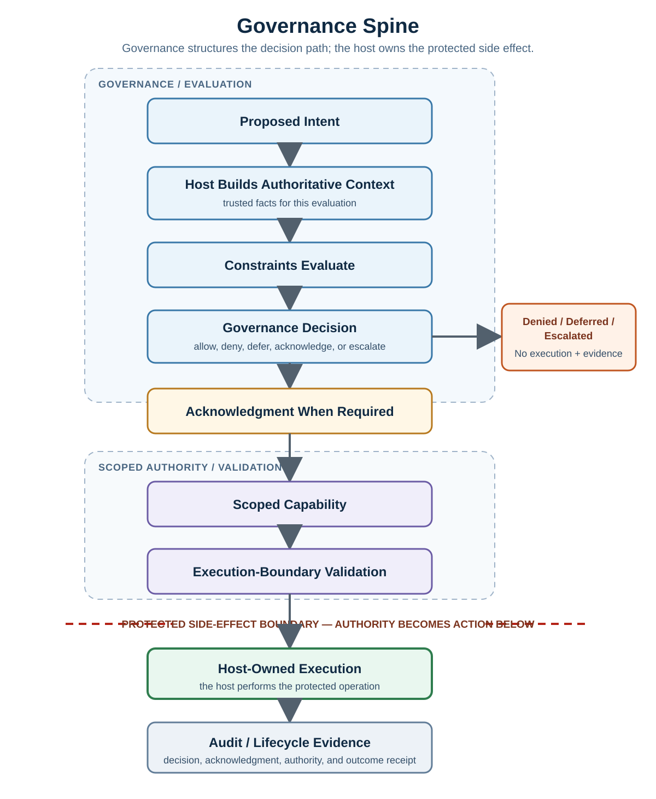
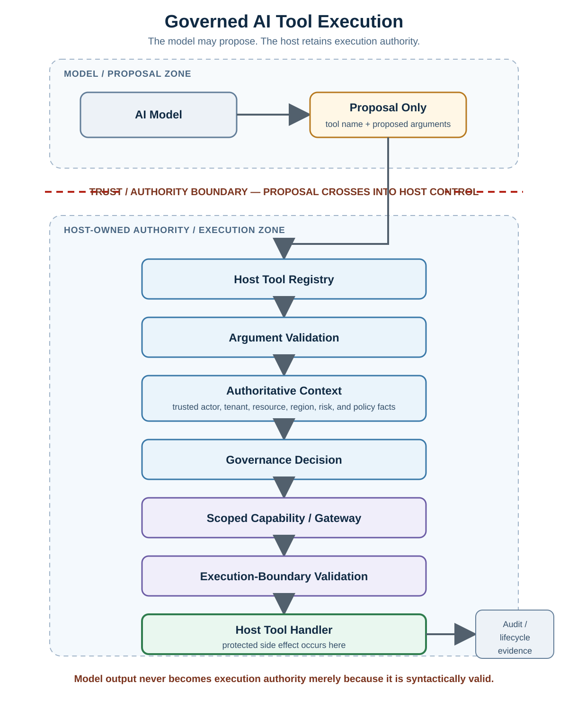

# Governance Spine and Capability Validation Diagrams

This page provides a compact visual reference for the major governed-execution boundaries introduced across the foundational Learning path.

The diagrams complement the tutorials, samples, tests, and labs. They intentionally emphasize **responsibility boundaries** rather than package APIs so the same reasoning can be applied to different hosts and implementation styles.

> **Core boundary:** AsiBackbone-style governance can structure how an operation is evaluated and how narrow authority is carried forward, but the host remains responsible for authentication, authorization, current resource validation, operational safety, and the protected side effect itself.

## 1. Governance Spine



The important separation is not merely the order of the boxes.

The boundary before execution means:

```text
Policy evaluation
   ≠
Protected operation
```

A decision may stop, defer, or escalate the flow. When continuation is allowed, acknowledgment and scoped capability can preserve additional conditions before authority reaches the execution boundary.

The protected side effect still occurs only through the host-owned execution path.

## 2. Policy Context, Constraints, and Decision Composition


This diagram preserves three distinctions that are easy to lose in a large policy pipeline:

```text
Context ≠ Policy
Constraint Result ≠ Final Decision
Decision ≠ Execution
```

The context is an evaluation-time snapshot of relevant facts.

Constraints interpret those facts and return individual results.

A composition strategy resolves those results into the final governance decision. Precedence should be explicit rather than emerging accidentally from evaluation order.

## 3. Capability Validation Profiles


Capability inspection and capability validation can happen at different points for different reasons.

A metadata-oriented check may be useful for routing, diagnostics, structural validation, expected scope, policy bindings, and temporal inspection. Passing that reduced check does **not** establish proof authenticity, replay resistance, authentication, authorization, or permission to execute.

A consequential execution boundary should use an explicitly stronger validation profile that checks the bindings required by that boundary, such as:

- Proof or signature authenticity.
- Issuer and audience.
- Subject, operation, scope, and resource.
- Policy identity.
- Acknowledgment or handshake reference when required.
- Not-before and expiration windows.
- Bounded-use, replay, revocation, or cancellation state when that boundary owns those guarantees.

Even successful execution-boundary capability validation is only one input into the host's final decision to execute.

It does not replace host authentication, host authorization, current resource authorization, input validation, transaction controls, or operational safety mechanisms.

## 4. Governed AI Tool Execution



The visual rule remains:

> **The model may propose. The host retains execution authority.**

A model-generated tool name or argument set is not a permission grant.

The host owns the executable tool registry, validates proposal shape, replaces model assertions with authoritative facts where required, evaluates governance, validates any scoped capability at the execution boundary, and invokes the real tool handler only when all required host controls permit continuation.

## Related Learning Material

Use the diagrams as orientation, then follow the corresponding lessons for reasoning, code, tradeoffs, and failure modes:

- [Getting Started](../getting-started/index.md)
- [Decision Before Execution](../tutorials/decision-before-execution.md)
- [Policy Context and Explicit Decision Outcomes](../tutorials/policy-context-and-explicit-decision-outcomes.md)
- [Acknowledgment and Audit Residue](../tutorials/acknowledgment-and-audit-residue.md)
- [Scoped Capability and Host-Owned Execution](../tutorials/scoped-capability-and-host-owned-execution.md)
- [Governed AI Tool Gateway](../tutorials/governed-ai-tool-gateway.md)
- [Trust Boundaries and Least Privilege](../security/trust-boundaries-and-least-privilege.md)

## Working Implementation References

The Learning diagrams are intentionally framework-neutral. The current AsiBackbone implementation repository contains fuller implementation-facing references:

- [Core Governance Flow Diagrams](https://github.com/AsiBackbone/AsiBackbone/blob/main/docs/articles/core-governance-flow-diagrams.md)
- [Core Policy Evaluator Pipeline](https://github.com/AsiBackbone/AsiBackbone/blob/main/docs/articles/policy-evaluator-pipeline.md)
- [Capability Grant Hardening](https://github.com/AsiBackbone/AsiBackbone/blob/main/docs/articles/capability-grant-hardening.md)

Those implementation references may use concrete package types and validation profiles. This Learning page keeps the architectural lesson independent of any one API surface.

---

> **Read the flow visually. Then verify the boundary in code.**
