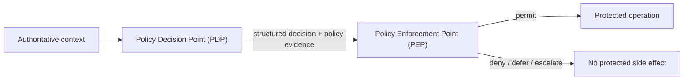
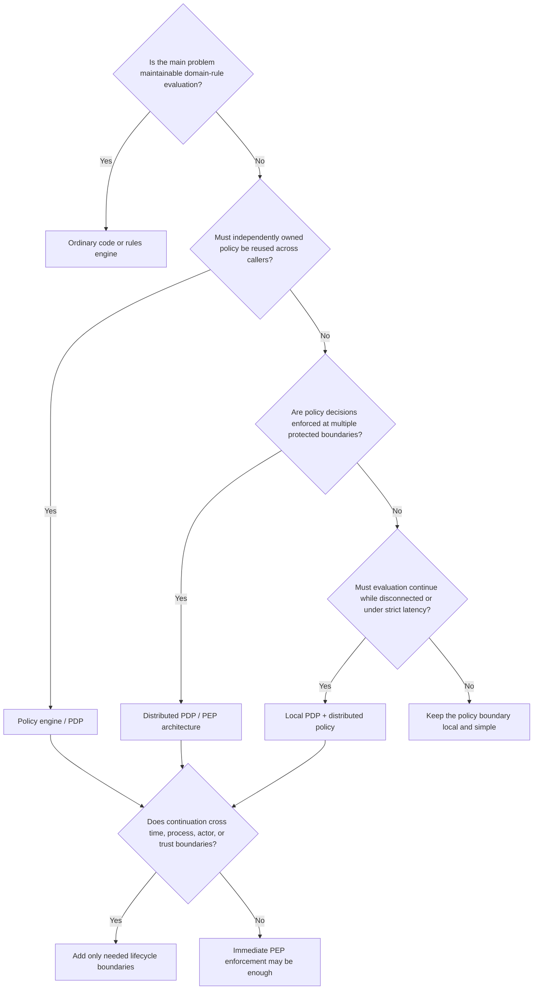

# Policy Engines, Rules Engines, and Distributed Policy Enforcement

**Pattern classification:** Alternative Pattern

**Difficulty:** Advanced

**Prerequisites:** Recommended — [Policy Context and Explicit Decision Outcomes](../tutorials/policy-context-and-explicit-decision-outcomes.md), [Policy Versioning and Decision Provenance](../governance/policy-versioning-and-decision-provenance.md), and [Regional and Tenant Policy Overlays](../advanced/regional-and-tenant-policy-overlays.md).

> **Terminology note:** This comparison uses `rules engine`, `policy engine`, `Policy Decision Point (PDP)`, `Policy Enforcement Point (PEP)`, `policy-as-code`, and `distributed policy enforcement` as architectural terms. Products overlap. A rules engine may evaluate authorization rules, a policy engine may use a rules language internally, and one platform may contain authoring, evaluation, enforcement, audit, and workflow features. The comparison is about responsibilities and trust boundaries rather than vendor categories.

> **Industry anchors:** Technologies commonly encountered in these spaces include Drools for rule evaluation and OPA/Rego, Cedar, or XACML-based engines for policy evaluation. They are examples for orientation and searchability, not definitions of the categories.

> **Standalone-reader note:** In this article, **Learning** means the ASI Backbone Learning repository and tutorial series. Its recurring governance pipeline is a responsibility model for `Intent -> Authoritative Context -> Policy / Constraints -> Decision -> Acknowledgment or Escalation when required -> Scoped Authority when needed -> Host-Owned Execution -> Audit Residue`. Those responsibilities may be implemented in one application or distributed across several components.

## Executive Summary

Keep four questions separate:

- **Rules engine:** How should a body of domain rules evaluate against facts?
- **Policy engine / PDP:** What does independently expressed governing policy decide for this input?
- **Distributed enforcement:** Where and how is that decision enforced across protected boundaries?
- **Broader governance lifecycle:** What else must happen before or after evaluation—such as acknowledgment, escalation, bounded continuation authority, execution, or reconstructable evidence?

These are composable responsibilities, not maturity levels. A remote PDP is not automatically more correct than embedded rules, and a policy engine is not merely a weaker governance pipeline.

> **Central lesson:** Separate evaluation logic from enforcement location, then add only the lifecycle boundaries the consequence and trust model actually require.

**Five-minute path:** read [Quick Orientation](#quick-orientation), [PDP and PEP Placement](#pdp-and-pep-placement-at-a-glance), the four [architectural scenarios](#9-architectural-scenario-1--embedded-rules-in-a-monolith), and [A Practical Decision Guide](#14-a-practical-decision-guide). For a deeper review, continue through distribution, freshness, caching, failure modes, rollout, and the review checklist.

---

## Quick Orientation

| Approach | Primary responsibility | Natural strength | Not automatically provided |
| --- | --- | --- | --- |
| Rules engine | Evaluate a body of domain rules against facts | Centralized, declarative business logic, decision tables, chaining, rule reuse | A distributed policy lifecycle, authoritative context, execution authority, or enforcement topology |
| Policy engine / PDP | Evaluate externalized authorization or governance policy | Consistent policy evaluation, policy-as-code, versioned policy, reusable decisions across heterogeneous callers | Trustworthy input construction, acknowledgment, escalation workflow, capability issuance, execution, or complete audit residue |
| Distributed policy enforcement | Apply policy decisions at one or more PEPs | Enforcement close to the protected resource or side effect | A single universal consistency, freshness, partition, or degraded-mode strategy |
| Learning governance pipeline | Coordinate consequential-action lifecycle boundaries | Explicit context, outcomes, acknowledgment/escalation, scoped authority, host-owned execution, provenance | A requirement that every application use a separate framework or remote policy service |

The rows can live in one process.

They can also span many services.

The architecture should be driven by responsibility, consequence, and trust boundaries rather than by the number of deployable components.

### PDP and PEP Placement at a Glance



The PDP answers the policy question. The PEP controls whether the protected action actually proceeds. A deployment may colocate them, place them in separate processes, or use one PDP with many PEPs.

The broader lifecycle may wrap that relationship when the operation requires more than immediate policy enforcement:

```text
Intent
  -> authoritative context
  -> PDP decision
  -> acknowledgment / escalation when required
  -> scoped continuation authority when needed
  -> PEP / host-owned execution
  -> audit residue
```

### One Policy Decision, Many Possible Placements

A policy decision can be evaluated:

```text
Inside the application process

Inside a shared library

Inside a sidecar or local policy process

Inside a remote policy service

Inside a central decision service
```

The logical question remains:

> **Which component acts as the Policy Decision Point, and which component acts as the Policy Enforcement Point?**

Physical centralization and logical centralization are different decisions.

---

## 1. Rules Engines

A rules engine evaluates rules against facts. Typical uses include eligibility, pricing, routing, validation, fraud indicators, underwriting, configuration selection, operational thresholds, and domain decision tables. That can be the entire requirement; a rules engine does not need a broader governance architecture to be legitimate.

### Declarative Business Rules

Rules engines often make business logic more declarative than nested control flow.

```csharp
if (customer.IsPreferred && order.Total >= 500m && !order.IsRestricted)
{
    discount = 0.10m;
}
```

may become:

```text
IF customer.preferred = true
AND order.total >= 500
AND order.restricted = false
THEN discount = 10%
```

The architectural value is visibility and reviewability of domain rules; the specific rule language is secondary.

### Condition / Action Evaluation

A common model is:

```text
Condition -> match -> action or derived result
```

For consequential operations, the "action" can remain a host-interpreted result rather than a side effect:

```text
Rules result: Route = ManualReview
        ↓
Host persists workflow state and assigns reviewer
```

That separation can be useful even without a separate governance framework.

### Decision Tables

Decision tables are often the clearest representation when a finite set of conditions maps to outcomes.

| Preferred customer | Order total | Restricted item | Outcome |
| --- | ---: | --- | --- |
| No | Any | No | Standard pricing |
| Yes | < 500 | No | Preferred pricing |
| Yes | >= 500 | No | Preferred pricing + discount |
| Any | Any | Yes | Manual review |

This remains ordinary domain logic. The [Practical Policy Testing and Decision-Table Strategies](../governance/practical-policy-testing-and-decision-table-strategies.md) material shows that the same technique can also represent governance policy; the responsibility depends on what the rule means.

### Forward and Backward Chaining

Some engines support inference-oriented evaluation.

```text
Forward chaining: known facts -> matching rules -> derived facts -> more matches
Backward chaining: goal -> candidate rule -> required conditions -> resolve facts
```

Many business-rule systems need neither. The relevant distinction is that a rules engine may be optimized for reasoning over domain logic rather than for distributing authorization policy across services.

### Domain Rule Centralization

Centralization can improve reviewability, test coverage, consistency, and change management. It also introduces a rule language/runtime, indirect control flow, conflict or ordering semantics, and the temptation to move every conditional into the engine.

A rules engine earns its complexity when the rule set is easier to understand, test, and change there than in ordinary application code.

### When a Rules Engine Is Simply the Right Business-Logic Tool

Consider a monolithic insurance application:

```text
Submission loaded
   ↓
Domain facts constructed
   ↓
Rules engine evaluates eligibility
   ↓
AutomaticReview or ManualReview
   ↓
Same application continues workflow
```

If one application owns the workflow, there is no independent policy authority, no cross-service enforcement problem, and no delayed portable execution grant, a rules engine may be the clearest design. A remote PDP, capability issuer, or separate governance layer would add boundaries without solving a new problem.

> **Use a rules engine when the problem is fundamentally rule evaluation and the engine makes those rules easier to reason about.**

---

## 2. Policy Engines

A policy engine evaluates policy as an explicit responsibility separate from the ordinary application flow that wants to act.

```text
Policy input -> Policy Decision Point (PDP) -> decision -> Policy Enforcement Point (PEP)
```

The PDP may be embedded, local/sidecar, remote, centralized, or packaged as a library with centrally distributed policy. The important boundary is semantic: policy evaluation is intentionally identifiable.

### Externalized Authorization and Governance Rules

External policy evaluation is especially useful when heterogeneous services need the same policy source or decision semantics:

```text
Customer API ─────┐
Billing API ──────┼──> Shared policy evaluation
Export Service ──┤
Admin Portal ─────┘
```

If those services already construct authoritative context, enforce the decision immediately, and retain sufficient evidence, the external policy engine may be the complete policy architecture they need.

### Policy-as-Code

Policy-as-code can bring source control, review, automated tests, static validation, versioned releases, simulation/shadow evaluation, staged rollout, and rollback to policy changes. Those practices improve operational discipline; they do not prove that the policy is correct, lawful, complete, or authorized simply because it is stored as code.

### Versioned Policy

A reconstructable decision may preserve:

```text
PolicyId: customer-export
PolicyVersion: 4.2
PolicyFingerprint: sha256:2d4c...
```

`PolicyId` identifies the logical policy family, `PolicyVersion` the declared revision/release, and an optional fingerprint the canonical content used. The [Policy Versioning and Decision Provenance](../governance/policy-versioning-and-decision-provenance.md) material covers the distinction in depth.

A fingerprint strengthens content identity; it does not by itself prove authorship, approval authority, correctness, or tamper-evidence of the full decision record.

### Policy Engines Can Return More Than Allow / Deny

A PDP can return structured results:

```json
{
  "outcome": "require_acknowledgment",
  "reason_code": "export.large-volume",
  "policy_id": "customer-export",
  "policy_version": "4.2",
  "obligations": ["record-decision", "require-export-warning"]
}
```

The caller must still know what those semantics mean. `RequireAcknowledgment` does not mean acknowledgment already happened, and `Escalate` does not mean the evaluator owns the review workflow.

### Conceptual OPA / Rego Example

OPA/Rego makes the architectural split easy to see: an application or gateway supplies structured input, the evaluator returns a decision, and the application/gateway enforces it. The point is not to prescribe OPA; it is to show that policy need not live inside ordinary business control flow.

### The Policy Engine Is Only as Trustworthy as Its Inputs

A PDP can perfectly evaluate unsafe input. If a caller sends:

```json
{
  "actor_role": "Administrator",
  "tenant": "tenant-a",
  "resource_region": "EU",
  "classification": "Public"
}
```

the host still needs to know which component authenticated the actor, resolved resource ownership/region/classification, and which values came from untrusted request data. [Policy Context and Explicit Decision Outcomes](../tutorials/policy-context-and-explicit-decision-outcomes.md) treats those facts as distinct from the rules that interpret them.

> **A PDP evaluates policy; it does not make caller-provided facts authoritative.**

### The Same Question Across Three Patterns

Suppose the question is whether a restricted record may be exported outside its region:

| Pattern | Illustrative representation | Architectural meaning |
| --- | --- | --- |
| Rules engine | `IF Restricted AND destination != region THEN ManualReview` | Domain rules derive a workflow result |
| Policy engine | Facts -> PDP -> `Deny` + policy evidence | An explicit policy boundary decides whether the operation is permitted |
| Distributed PDP/PEP | PDP returns the decision; export boundaries enforce it | The architecture also owns placement, freshness, distribution, partitions, and enforcement consistency |

The syntax can overlap. The responsibility and lifecycle distinguish the patterns.

---

## 3. Centralized Versus Embedded Policy Evaluation

"Centralized policy" can mean several different things.

Teams should distinguish at least three forms:

```text
Centralized authoring
=
One authoritative source controls policy content.

Centralized distribution
=
One system packages and distributes policy artifacts.

Centralized evaluation
=
One runtime service performs the decision for callers.
```

These can be combined differently.

### Model A — Remote Central PDP

```text
Service A ──┐
Service B ──┼──> Central PDP ──> decision
Service C ──┘
```

Advantages may include:

- One evaluation runtime.
- Immediate use of centrally deployed policy.
- Easier evaluator upgrades.
- Consistent decision semantics.
- Centralized decision observability.

Costs may include:

- Network latency on the decision path.
- Availability dependency.
- Capacity planning for the central service.
- Partition behavior that must be explicit.
- Potentially large blast radius if the service or policy deployment fails.

### Model B — Local PDP with Centrally Distributed Policy

```text
Central policy source
        ↓
Versioned policy bundle
        ↓
Service A local evaluator
Service B local evaluator
Service C local evaluator
```

Advantages may include:

- Low evaluation latency.
- Continued local operation during selected network failures.
- Enforcement close to the protected operation.
- Reduced dependency on a synchronous policy network call.

Costs may include:

- Policy distribution complexity.
- Temporary version divergence.
- Stale policy risk.
- More evaluator instances to observe and upgrade.
- Need for explicit bundle authenticity, freshness, and rollback behavior.

### Model C — Embedded Policy Library

```text
Application
   ├── domain code
   ├── embedded evaluator
   └── local policy artifact
```

This can be the simplest architecture when:

- Only one application needs the policy.
- Policy change cadence matches application deployment.
- No separate policy service is operationally justified.
- The policy boundary remains visible in code and tests.

Externalizing policy into a network service is not inherently superior.

The relevant question is whether independent policy ownership, deployment, reuse, or failure isolation justifies that boundary.

---

## 4. Policy Decision Points and Policy Enforcement Points

A Policy Decision Point answers a policy question.

A Policy Enforcement Point controls whether the protected operation proceeds.

The basic relationship is:

```text
Policy Decision Point
        ↓
decision
        ↓
Policy Enforcement Point
```

The PEP may be:

- Application middleware.
- An API gateway.
- A service endpoint.
- A background worker.
- A database access boundary.
- A deployment agent.
- A tool gateway.
- A local device gateway.
- Another host-owned execution boundary.

### The PEP Owns the Last Meaningful Check

A decision such as:

```text
Allow export.records for resource-123
```

has no practical effect until some component can actually perform or block the export.

That component is the enforcement boundary.

If the PEP accepts a decision, it should understand enough binding information to know that the decision applies to:

```text
This operation
This resource
This actor or workload, when relevant
This tenant or region, when relevant
This policy state or freshness model
This execution boundary
```

A generic `Allow = true` detached from those bindings may be too weak for reuse across a later boundary.

### Multiple Enforcement Points

A distributed system may have many PEPs:

```text
                    ┌──> API Gateway PEP
Policy decision ────┼──> Service PEP
                    ├──> Worker PEP
                    └──> Data-access PEP
```

This does not necessarily mean every PEP should independently reevaluate policy.

Possible architectures include:

```text
One central PDP + many PEPs

Many local PDPs + many PEPs

Gateway PDP/PEP + service-level defense in depth

Central decision service + scoped authority for later PEPs
```

The correct model depends on latency, consequence, trust boundaries, freshness, and failure behavior.

---

## 5. Distributed Policy Enforcement

Distributed enforcement creates a systems problem in addition to a policy problem.

Once policy decisions and protected actions occur at different boundaries, the architecture must address:

- Consistency.
- Policy distribution.
- Stale policy.
- Latency.
- Network partitions.
- Local autonomy.
- Fail-open / fail-closed behavior.
- Provenance.
- Decision caching.
- Revocation or freshness.
- Cross-service correlation.

### Consistency Is a Chosen Property

A central PDP can reduce policy-version divergence because callers consult one evaluator.

It does not automatically guarantee consistency of the **inputs**.

Two services can ask the same policy service about different snapshots of resource state and legitimately receive different decisions.

Likewise, local evaluators can use identical policy versions and still disagree if:

- Their context differs.
- Their data is stale.
- Their clocks or environment state differ.
- Their evaluator versions differ.
- Their policy dependencies differ.

Therefore:

> **Policy consistency includes policy identity, evaluator semantics, authoritative context, and freshness—not merely identical source files.**

### Policy Distribution Is Part of the Trust Model

If policy is evaluated locally, the host needs a way to distribute policy artifacts.

A policy package may need evidence such as:

```text
PolicyId
PolicyVersion
PolicyFingerprint
Issued / effective time
Target environment or audience
Compatibility metadata
Source or release identity
```

The exact fields are implementation-specific.

The important questions are:

```text
Who is authoritative for this policy?
How does the local evaluator know which version to use?
How is a bad rollout stopped or rolled back?
How is stale policy detected?
What happens if the distribution channel is unavailable?
```

Policy distribution is not just file synchronization.

It determines which rules are allowed to control protected operations.

### Policy Package Integrity, Source Authenticity, and Atomic Activation

A local evaluator should not activate a policy artifact merely because it arrived through the expected transport. The distribution path is itself a trust boundary:

```text
Policy authority
   | signed / versioned package
   v
Distribution channel
   v
Staging store
   | verify signer + fingerprint + audience
   | compile / validate / smoke-test
   v
Atomic active-version switch
   v
Local PDP -> decision + policy evidence -> PEP -> protected action

Invalidation / version watermark ------------------^
```

A concrete activation sequence can be deliberately boring:

```text
active = v12
download v13 to staging
verify authenticity and digest
compile / validate v13
run required activation checks
atomically switch active pointer: v12 -> v13
```

If any pre-activation step fails, `v12` remains active and `v13` never becomes partially visible. The exact mechanism may be an atomic file move, immutable bundle directory plus pointer swap, transactional configuration update, or equivalent host primitive.

Authenticity and atomic activation strengthen **which policy artifact is running**. They do not prove that the policy is legally correct, semantically safe, or correctly composed with other authorities.

### Stale Policy Is an Architectural State

Suppose a local evaluator has `PolicyVersion = 12` while the authoritative source advertises `PolicyVersion = 13`. The local decision may still be intentionally acceptable, or it may be unsafe.

A concrete detector can combine version and age:

```text
Local active policy: v12, activated 12:00
Authoritative watermark: v13
Now: 12:18

customer.read   -> may proceed under lag <= 1 and age <= 30 min; record stale-policy evidence
customer.delete -> exact-current required; Defer or Deny until v13 is active
```

The evaluator should expose the divergence instead of silently treating `v12` as current.

Possible freshness contracts include:

| Contract | Example behavior |
| --- | --- |
| Exact-current | Destructive administration requires the evaluator's version to equal the current authoritative version |
| Maximum staleness | Low-risk reads may use policy with version lag <= 1 **and** artifact age <= 30 minutes |
| Last-known-good | Continue with a specifically approved prior artifact during outage, subject to a declared maximum age |
| Operation-specific | Reads may tolerate bounded staleness while export/delete operations require exact-current policy |
| Explicit compatibility | Permit an older policy only when policy authority declares that version compatible for the operation |

There is no universal answer.

The dangerous state is accidental staleness:

```text
Policy update failed
        ↓
Old policy remains loaded
        ↓
System continues as though nothing changed
```

If stale policy is allowed, that behavior is itself policy.

If freshness is calculated from timestamps, define how clock skew is bounded or use a trusted receive/activation time. A nominal `30 minute` freshness window is ambiguous if evaluator clocks may differ materially.

### Invalidation and Revocation Channels

Time-to-live alone may be too slow for emergency withdrawal. A runtime needs a contract for learning that an accepted policy or cached decision is no longer eligible.

For example:

```text
Invalidate:
  PolicyId = customer-export
  MinimumAcceptedVersion = 13
  Reason = emergency-residency-fix
```

A local evaluator still on `v12` can immediately mark that artifact ineligible, purge affected decision-cache entries, fetch or activate `v13`, and keep destructive operations in `Defer`/`Deny` until the required version is active.

Push events, authoritative version watermarks, emergency deny lists, polling for critical policy families, and forced pre-execution reevaluation are all possible implementations. The contract matters more than the transport: **what is invalidated, how quickly must PEPs stop relying on it, and what happens when the invalidation channel is unavailable?**

### Latency and Decision Placement

Remote evaluation adds a network hop.

For low-latency operations, the difference may be significant.

Local evaluation removes that synchronous hop but shifts complexity into:

- Policy distribution.
- Evaluator lifecycle management.
- Version convergence.
- Local evidence collection.

A useful rule is:

> **Move evaluation closer to enforcement only when the latency or availability benefit is worth the additional policy-distribution and freshness responsibility.**

### Partition Behavior Must Be Deliberate

Consider:

```text
PEP
 ↓
Central PDP unreachable
 ↓
?
```

Possible behaviors include:

```text
Fail closed
Fail open
Defer
Escalate
Use bounded cached decision
Use last-known-good policy locally
Permit only reduced low-risk operations
```

The correct choice depends on consequence and operational need.

For example, a life-safety system may need local autonomy rather than a simple "deny everything when disconnected" rule.

A sensitive data export may reasonably fail closed.

The architecture must define the behavior rather than allowing a timeout library, exception handler, or default boolean to decide it accidentally.

### Fail Open and Fail Closed Are Not Complete Strategies

`Fail open` and `fail closed` are useful shorthand, but distributed governance often needs richer degraded outcomes.

For example:

```text
Policy service unavailable
        ↓
Low-risk read = allow with last-known-good policy
High-risk export = defer
Emergency operation = escalate to local authority
Administrative delete = deny
```

This is closer to a degraded-mode policy than a single global failure switch.

A concrete contract might say:

```text
If central PDP is unreachable:
- customer.read may continue for 30 minutes with last-known-good policy <= 1 version behind
- customer.export must Defer
- customer.delete must Deny
- emergency.restore may Escalate to the designated local authority
```

That contract is reviewable and testable. `catch timeout -> allow` is not.

The [Safe Degraded Mode and Fail-Safe Governance](../labs/safe-degraded-mode-and-fail-safe-governance.md) lab explores this boundary directly.

### Local Autonomy Can Be a Safety Property

A disconnected environment may need policy enforcement to continue locally.

Examples include:

- Remote industrial sites.
- Edge devices.
- Field systems.
- Intermittently connected facilities.
- Regionally isolated infrastructure.

A local PDP can preserve bounded autonomy if it has:

- A known policy artifact.
- A defined freshness contract.
- Authoritative local context.
- A restricted operation set.
- Local audit evidence.
- Explicit recovery and reconciliation behavior.

Local autonomy should not mean:

```text
Disconnected
   ↓
Ignore policy
```

It means the system has intentionally defined what authority remains valid while disconnected.

---

## 6. Policy Caching and Decision Caching Are Different

Distributed systems often cache policy-related data, but two caches solve different problems.

### Policy Cache

A policy cache stores the rules or policy artifact used for local evaluation:

```text
Policy bundle v12
        ↓
Local PDP
        ↓
Evaluate new requests against current local context
```

The freshness question is:

> **Is this policy artifact still acceptable to use?**

### Decision Cache

A decision cache stores a prior evaluation result:

```text
Input X
   ↓
Decision = Allow
   ↓
Reuse later
```

The freshness question is broader:

> **Are the policy, actor, resource, operation, and environmental facts still sufficiently equivalent that this decision remains valid?**

A cached decision can become stale even when policy has not changed.

For example:

```text
Policy unchanged
Resource classification changed
        ↓
Old Allow decision is no longer valid
```

Decision caching therefore needs careful binding and invalidation semantics.

Do not treat:

```text
Cache TTL = 5 minutes
```

as proof that authority remains valid for five minutes.

TTL is an operational mechanism.

The authority semantics must be defined separately.

---

## 7. What May Sit Outside the Policy Engine

The Learning governance pipeline treats policy evaluation as one part of a broader consequential-action lifecycle.

A representative flow is:

```text
Intent
   ↓
Authoritative Context Construction
   ↓
Policy / Constraint Evaluation
   ↓
Explicit Decision
   ↓
Acknowledgment or Escalation when required
   ↓
Scoped Authority when needed
   ↓
Host-Owned Execution
   ↓
Audit Residue
```

A policy engine can occupy the evaluation step:

```text
Authoritative context
        ↓
External PDP
        ↓
Structured policy result
        ↓
Host maps result into lifecycle behavior
```

The surrounding responsibilities may remain elsewhere.

> **Trust-boundary reminder:** The requester may misstate intent or resource attributes; a policy distributor may be stale or compromised; a PDP may be unavailable or evaluate stale context; a PEP may misapply a valid decision; and the executor owns the actual side effect. The architecture should state which component is trusted for each fact, artifact, and transition rather than treating `policy evaluated` as a universal trust stamp.

| PDP may return | Host / surrounding lifecycle may still own |
| --- | --- |
| `Allow`, `Deny`, or richer outcome | Mapping the result to actual process behavior |
| Reason codes and obligations | Acknowledgment UI/workflow, escalation, reviewer assignment |
| Policy ID/version/fingerprint | Correlation with context, acknowledgment, capability, and execution evidence |
| Decision metadata | Capability issuance when later execution needs bounded continuation authority |
| Permit decision | Credentials and the protected side effect at the PEP/executor |

### Authoritative Context Construction

A PDP should not automatically trust every field supplied by a caller.

The host may need to resolve:

- Authenticated actor identity.
- Tenant membership.
- Resource ownership.
- Current resource state.
- Region or jurisdiction.
- Environment state.
- Classification.
- Operation identity.
- Prior workflow or acknowledgment state.

The policy engine evaluates those facts.

It does not necessarily own the systems that establish them.

### Acknowledgment

A policy result may state:

```text
RequireAcknowledgment
```

The host may still need to:

- Render the acknowledgment.
- Bind it to the exact proposal and policy decision.
- Record who acknowledged.
- Handle expiration.
- Detect proposal drift.
- Decide whether reevaluation is required afterward.

That is a lifecycle responsibility, not merely a predicate.

### Escalation

A policy engine may return:

```text
Escalate
```

But escalation may require:

- Reviewer assignment.
- Separation of duties.
- Queue or workflow state.
- Expiration.
- Re-review after changes.
- Human decision evidence.

The [Escalation Patterns in Governed Systems](../governance/escalation-patterns-in-governed-systems.md) material treats that as a distinct boundary.

### Capability Issuance

An `Allow` decision does not automatically become reusable authority.

If execution happens immediately in the same host, no separate capability may be needed.

If execution occurs later or across another trust boundary, the system may intentionally convert an eligible decision into narrow continuation authority:

```text
Policy decision = Allow
        ↓
Issue capability scoped to:
operation + resource + audience + lifetime
        ↓
Later executor validates capability
        ↓
Execute
```

The [Scoped Capability and Host-Owned Execution](../tutorials/scoped-capability-and-host-owned-execution.md) tutorial covers that lifecycle.

For example, a successful policy decision for `case-123` could justify a later grant shaped like:

```json
{
  "operation": "case.purge",
  "resource": "case-123",
  "audience": "purge-worker",
  "expires_at": "2026-08-24T18:10:00Z",
  "maximum_uses": 1,
  "decision_id": "dec-123"
}
```

The artifact is useful only if issuance, validation, expiration, replay behavior, and the PEP's trust in the issuer are deliberately defined.

A remote policy decision and a scoped execution capability solve different problems.

### Execution

The PDP decides.

The PEP enforces.

The component that owns the real side effect should remain identifiable.

A policy engine returning `Allow` should not obscure which host:

- Holds credentials.
- Calls the external API.
- Mutates the resource.
- Sends the command.
- Applies the deployment.
- Performs the database change.

This is the same reason the Learning material preserves **host-owned execution**.

### Audit Residue

A policy engine may emit decision logs.

Those logs can be valuable.

They are not automatically the complete governance record.

A reconstructable lifecycle may need to correlate:

```text
Intent
Context identity or snapshot
Decision ID
Reason codes
Policy identity / version / fingerprint
Acknowledgment or escalation evidence
Capability identity, if issued
Execution attempt
Execution result
Correlation / trace identifiers
```

Operational telemetry and governance evidence may overlap without being identical.

### Policy Version and Hash Recording

The evaluator is often the best place to know exactly which policy content it used.

The host is often the best place to preserve that evidence alongside the rest of the operation lifecycle.

A useful split is:

```text
PDP
returns policy identity evidence
        ↓
Host
persists it with the decision and later lifecycle evidence
```

The architecture may choose another placement.

What matters is that the final record can answer:

> **Which policy produced this decision, and what happened because of it?**

---

## 8. A Policy Engine Can Carry More of the Lifecycle

A policy platform may also provide context adapters, policy distribution, obligations, decision logs, approval hooks, local enforcement integrations, or audit exports. If those features satisfy the application's actual trust and lifecycle requirements, duplicating them in a second governance layer can make the system worse rather than safer.

The practical test is whether the architecture can still answer: **who supplied authoritative context, which policy decided, where enforcement occurred, what happened during failure, what evidence survived, and—if execution happened later—what authority justified it then?**

> **Do not add a second policy or governance layer merely because Learning demonstrates one.**

---

## 9. Architectural Scenario 1 — Embedded Rules in a Monolith

Consider a claims-processing application with an internal rule set:

```text
Claim loaded
   ↓
Domain facts constructed
   ↓
Embedded rules engine
   ↓
AutoProcess / ManualReview / Reject
   ↓
Same application continues
```

The rules cover:

- Claim amount thresholds.
- Required document combinations.
- Product-specific eligibility.
- Routing to specialist queues.

The application already owns:

- Identity and authorization.
- The authoritative claim record.
- Workflow state.
- Immediate execution.
- Audit logging appropriate to the domain.

A separate external policy engine would introduce:

- Another deployment surface.
- Network or local-runtime integration.
- Policy synchronization.
- More failure modes.

without solving a real cross-boundary problem.

**Best fit:** Embedded rules engine or ordinary domain service.

**Why:** The central problem is maintainable business-rule evaluation, not distributed policy enforcement.

---

## 10. Architectural Scenario 2 — External Policy Engine for Multiple Services

Consider several services that must apply one organization-wide data-access policy:

```text
Customer API ─────┐
Billing API ──────┼──> External PDP
Analytics API ────┤       ↓
Admin Portal ─────┘    decision
                     ↙   ↓   ↘
                 local PEPs in callers
```

Each service builds authoritative context from:

- Authenticated identity.
- Current resource ownership.
- Tenant information.
- Data classification.
- Requested operation.

The PDP evaluates one versioned policy model and returns a structured allow/deny result with policy evidence.

Each service enforces the result immediately before its protected operation.

No delayed handoff exists.

No acknowledgment is required.

No capability needs to survive the request.

**Best fit:** External policy engine with local enforcement.

**Why:** The primary requirement is consistent policy evaluation across heterogeneous services.

This is not a lesser version of a governance pipeline.

It is the architecture that directly matches the problem.

---

## 11. Architectural Scenario 3 — Central Decision Service with Distributed Enforcement

Now consider a higher-consequence administrative operation:

```text
Admin Portal
    ↓
Authoritative context
    ↓
Central PDP / decision service
    ↓
Allow with provenance
    ↓
Queue
    ↓
Background execution worker
    ↓
Protected side effect
```

The decision and execution are separated by time and process.

Important questions now include:

```text
Did the policy change after the decision?
Did the resource change?
Was the decision intended for this operation?
Can the queue message be replayed?
Does the worker have more authority than necessary?
What happens if execution occurs after the decision's freshness window?
```

One possible design is:

```text
Central PDP
   ↓
Allow decision + provenance
   ↓
Host issues short-lived scoped capability
   ↓
Worker validates capability at execution boundary
   ↓
Execute
```

Another design may reevaluate policy directly in the worker.

The correct choice depends on consequence, freshness requirements, latency, and operational cost.

**Best fit:** Central policy decision plus explicit distributed-enforcement semantics; add scoped continuation authority only when the delayed boundary earns it.

**Why:** Policy evaluation and enforcement are now separated enough that freshness and authority handoff must be explicit.

---

## 12. Architectural Scenario 4 — Locally Evaluated Policy in a Disconnected Environment

Consider a remote facility that must continue selected operations during loss of connectivity to the central control plane.

```text
Central policy authority
        ↓
Versioned policy bundle
        ↓
Remote facility local PDP
        ↓
Local PEP
        ↓
Bounded local operation
```

The local environment may be allowed to use:

```text
PolicyId: facility-safety
PolicyVersion: 27
Freshness: last-known-good for up to 12 hours
Allowed degraded operations:
  equipment.stop
  equipment.safe-mode
  read.local-status
Denied while disconnected:
  firmware.update
  configuration.expand-limits
```

The exact policy is illustrative.

The architectural point is that degraded operation is explicit.

The site knows:

- Which policy version it has.
- How stale it may become.
- Which operations remain locally authorized.
- Which operations must defer or deny.
- What local evidence to retain.
- How to reconcile after connectivity returns.

**Best fit:** Centrally governed policy distribution with local evaluation and local enforcement.

**Why:** Local autonomy is required, so synchronous central evaluation would create an unacceptable availability dependency.

---

## 13. Comparison Matrix

| Concern | Rules engine | External / shared policy engine | Central PDP + distributed PEPs | Local PDP + distributed policy |
| --- | --- | --- | --- | --- |
| Primary problem | Domain rule evaluation | Consistent externalized policy decisions | Shared decision authority with multiple enforcement locations | Low-latency or disconnected policy enforcement |
| Typical policy placement | Embedded or application-local | Shared evaluator | Central evaluator | Centrally authored, locally evaluated |
| Enforcement placement | Often same application | Usually caller or gateway | Multiple PEPs | Local PEP beside evaluator |
| Network dependency for each decision | Usually none | Usually yes if remote | Usually yes | Usually no |
| Policy distribution complexity | Low to moderate | Central runtime deployment | Central runtime deployment | High; artifacts must converge safely |
| Stale policy risk | Tied to application/rule deployment | Lower for remote central runtime, but not zero | Lower for evaluator policy; decision reuse can still go stale | Explicit first-class concern |
| Input consistency risk | Local domain facts | Caller-supplied context may differ | Caller/context service may differ | Local context may diverge from central state |
| Partition behavior | Application-local | Must define PDP-unavailable behavior | Must define central decision outage behavior | Local autonomy possible within defined bounds |
| Best fit | Business logic centralization | Heterogeneous services needing common policy | Many PEPs relying on shared decisions | Edge / regional / disconnected operation |
| Broader governance lifecycle required? | Only if the domain requires it | Only if acknowledgment, escalation, delayed authority, etc. require it | Often more relevant because decision and action are separated | Often relevant for degraded-mode evidence and reconciliation |

This matrix is not a ranking.

Each approach can be the simplest correct design for a different problem.

---

## 14. A Practical Decision Guide

Start by identifying the problem that is actually causing complexity.



The branches are heuristics rather than exclusive product categories. A mature platform may implement several boxes in one deployment.

### Use Ordinary Code or a Rules Engine When

```text
One application
+
clear domain facts
+
rule evaluation is the main complexity
+
no separate policy authority is needed
```

Ask:

1. Are these primarily business rules rather than cross-service authorization policy?
2. Would decision tables or declarative rules make the logic easier to review?
3. Does the same application own evaluation and the resulting workflow?
4. Is there no independent policy deployment or enforcement boundary to preserve?

If yes, an embedded rules engine or ordinary application service may be enough.

### Use an External Policy Engine When

```text
Several callers
+
shared authorization / governance rules
+
independent policy lifecycle
+
consistent evaluation matters
```

Ask:

1. Do multiple services need the same policy semantics?
2. Should policy be deployed independently from application code?
3. Can callers build trustworthy structured context?
4. Is remote or local externalized evaluation operationally acceptable?
5. Can the PEP enforce the result immediately and correctly?

If yes, an external PDP can be the cleanest architecture.

### Use Central Decision with Distributed Enforcement When

```text
Shared decision authority
+
multiple protected boundaries
+
decision and enforcement are physically separated
```

Ask:

1. Which PEPs are allowed to rely on the decision?
2. How is operation/resource binding preserved?
3. How is freshness checked?
4. What happens if policy changes before enforcement?
5. Is a scoped capability needed, or can the PEP safely reevaluate?
6. How are decision and execution evidence correlated?

If these questions matter, treat the PDP/PEP boundary as a first-class distributed-systems concern.

### Use Local Evaluation with Distributed Policy When

```text
Latency or availability requires local decisions
+
central policy ownership must remain
```

Ask:

1. How are policy artifacts distributed and authenticated?
2. Which policy version is active locally?
3. What staleness is allowed?
4. Which operations remain available when disconnected?
5. How are local decisions and execution evidence reconciled later?
6. What happens when a policy rollout partially succeeds?

If local autonomy is required, these are policy-design questions rather than deployment details.

### Add Broader Governance Lifecycle Boundaries When

```text
Policy decision alone is not enough to justify execution
```

Signals include:

- Human acknowledgment is required.
- Escalation is a distinct outcome.
- Execution happens later or elsewhere.
- Narrow continuation authority is needed.
- Decision provenance must survive independently.
- Policy freshness must be checked again before execution.
- A blocked decision must provably never reach the executor.

The governance pipeline should be added because these lifecycle semantics are required, not because policy engines are considered incomplete by definition.

---

## 15. Common Failure Modes

### Treating a Rules Engine as an Authority Source Without Saying So

A business rules engine may gradually accumulate conditions such as:

```text
IF actor.role = Admin
AND resource.region = EU
THEN allow export
```

At that point it is making authorization or governance decisions.

That may be acceptable.

But the trust model should become explicit:

```text
Where did actor.role come from?
Who established resource.region?
Which policy version contains this rule?
Where is the result enforced?
```

Do not let an authority boundary emerge accidentally from ordinary business-rule infrastructure.

### Trusting Caller-Provided Context

A perfect policy engine cannot repair untrusted inputs.

Avoid:

```text
Client says tenant = tenant-a
Client says classification = Public
PDP accepts both as authoritative
```

Resolve important facts through trusted host systems before evaluation.

### Central PDP Becomes an Accidental Global Outage

A remote PDP on every request path creates an availability dependency.

If the service fails and the architecture has no explicit degraded behavior, application behavior may be determined by:

```text
HTTP timeout
Exception handling
Default retry policy
```

Those are not policy semantics.

### Silent Policy-Bundle Staleness

Avoid:

```text
Policy distribution failed
Local evaluator kept old policy
No stale-state signal emitted
System continued normally
```

If last-known-good operation is allowed, record and expose that degraded state.

### Decision Reuse Without Binding

Avoid treating:

```text
DecisionId = dec-123
Outcome = Allow
```

as reusable authority without knowing what it was bound to.

A later PEP should not have to guess:

```text
Which operation?
Which resource?
Which actor/workload?
Which policy version?
Which freshness contract?
```

### Allow Decision Mistaken for a Capability

A policy decision answers:

> **What did policy decide at evaluation time?**

A capability answers:

> **What narrow authority may this presenter exercise at this execution boundary now?**

They may be connected.

They are not automatically the same artifact.

### Fail Open Hidden in Error Handling

Avoid:

```csharp
try
{
    return await policyClient.IsAllowedAsync(request);
}
catch
{
    return true;
}
```

if the system has not explicitly defined that operation as safe to continue without current policy.

Fallback is policy.

Treat it as policy.

### Policy Version Recorded Without Policy Identity

Avoid evidence such as:

```text
PolicyVersion = 12
```

when several policy families can all have version `12`.

Preserve a stable policy identity and, where useful, content fingerprint.

### Every PEP Implements Its Own Interpretation

A central policy decision is weakened if each enforcement point maps it differently:

```text
PEP A: Defer => deny
PEP B: Defer => retry forever
PEP C: Defer => allow temporarily
```

Different mappings can be intentional.

If so, they should be explicit, documented, and testable rather than accidental local conventions.

---

## 16. Policy Simulation, Rollout, and Change Impact

Policy-as-code makes policy changes easier to test before broad enforcement, but rollout still needs a strategy.

Useful techniques include:

```text
Unit tests
Decision tables
Historical replay
Shadow evaluation
Diffing old and new outcomes
Canary policy rollout
Regional / tenant staged rollout
Explicit rollback
```

A safe rollout question is not only:

> Does the new policy compile?

It is also:

> **Which decisions would change, at which PEPs, for which resources, and what happens if only part of the fleet receives the new policy?**

The [Policy Simulation and Change-Impact Analysis](../labs/policy-simulation-and-change-impact-analysis.md) lab is a useful companion for this boundary.

### Partial Rollout Creates Mixed Policy Reality

Suppose:

```text
Service A local PDP = policy v13
Service B local PDP = policy v12
Service C local PDP = policy v13
```

That may be an intentional canary.

Or it may be deployment drift.

The architecture should make the difference observable rather than leaving version divergence to incident reconstruction. The telemetry baseline below is one practical way to do that.

### Minimum Distributed-Policy Telemetry

For systems where freshness, degraded operation, or multi-PEP consistency matters, useful decision telemetry commonly includes enough data to answer **what evaluated, what was active, where it was enforced, and whether the system was degraded**.

A compact baseline is:

```text
DecisionId
PolicyId
PolicyVersion
PolicyFingerprint, when available
EvaluatorInstance / evaluator version
PEP or execution-boundary identity
Context or resource fingerprint, when appropriate
Decision outcome + reason code
Policy age or activation time
DegradedMode = true/false
DegradationReason
Correlation / trace ID
OccurredUtc
```

Operational metrics can then surface fleet-level conditions such as:

```text
policy_version_active{policy_id, evaluator}
policy_age_seconds{policy_id, evaluator}
pdp_unreachable_total{operation}
policy_bundle_verification_failure_total{policy_id}
decision_staleness_rejection_total{operation}
degraded_policy_decision_total{reason}
```

These names are illustrative, not a required telemetry schema. Avoid high-cardinality labels such as raw `DecisionId` or resource IDs in aggregate metrics; keep those identifiers in logs/traces or governance evidence instead.

---

## 17. Relationship to Regional and Tenant Policy Overlays

Distributed enforcement and policy overlays solve related but different problems.

Policy overlays ask:

> **Which policy authorities apply, and how are their contributions composed?**

Distributed enforcement asks:

> **Where is the resulting policy evaluated and enforced, and how does it remain fresh and consistent across those locations?**

A system may have:

```text
Global policy
+
Regional policy
+
Tenant policy
        ↓
Explicit composition
        ↓
Local regional PDP
        ↓
Regional PEPs
```

The [Regional and Tenant Policy Overlays](../advanced/regional-and-tenant-policy-overlays.md) material covers precedence, narrowing, override authority, multi-policy provenance, drift, and missing-policy behavior in greater depth.

When the two patterns are combined, provenance may need to preserve both:

```text
Which policy layers participated?
Which composition policy combined them?
Which evaluator / policy bundle version was active?
Which PEP enforced the final result?
```

---

## 18. Relationship to the Learning Governance Pipeline

As defined near the beginning of this article, the ASI Backbone Learning governance pipeline should be read as a responsibility model, not as a requirement that every responsibility be a different product or service.

One implementation may look like:

```text
Application host
   ├── authoritative context builder
   ├── embedded policy evaluator
   ├── acknowledgment workflow
   ├── capability issuer
   ├── executor
   └── audit store
```

Another may look like:

```text
Application
   ↓
External PDP
   ↓
Application acknowledgment workflow
   ↓
Capability service
   ↓
Worker PEP
   ↓
External system
```

Another may simply be:

```text
Application
   ↓
External PDP
   ↓
Immediate local PEP
   ↓
Execute
```

All three can be correct.

The comparison should preserve one principle from the rest of Learning:

> **Do not infer execution authority merely because a policy evaluation succeeded somewhere earlier in the system.**

If evaluation and enforcement are immediate and colocated, ordinary policy enforcement may be enough.

If they are separated by delay, queue, service, actor, or trust boundary, the host should explicitly decide how authority survives that separation.

---

## 19. Relationship to Existing Learning Material

Use these pages together when useful:

1. [Policy Context and Explicit Decision Outcomes](../tutorials/policy-context-and-explicit-decision-outcomes.md) — separates authoritative decision facts from the rules that interpret them and models outcomes richer than booleans.
2. **Policy Engines, Rules Engines, and Distributed Policy Enforcement** — compares evaluation mechanisms, PDP/PEP placement, distribution, freshness, latency, partitions, and local autonomy.
3. [Compare Competing Policy Architectures](../labs/compare-competing-policy-architectures.md) — turns the comparison into a learner exercise requiring explicit architecture selection, rejection rationale, failure-model analysis, trust-boundary placement, and minimum decision evidence.
4. [Constraint Composition and Policy Precedence](../governance/constraint-composition-and-policy-precedence.md) — explains how multiple constraints compose without relying on incidental execution order.
5. [Policy Versioning and Decision Provenance](../governance/policy-versioning-and-decision-provenance.md) — preserves policy identity, versions, fingerprints, and freshness evidence.
6. [Practical Policy Testing and Decision-Table Strategies](../governance/practical-policy-testing-and-decision-table-strategies.md) — applies decision-table and policy-testing techniques to governance logic.
7. [Regional and Tenant Policy Overlays](../advanced/regional-and-tenant-policy-overlays.md) — extends policy composition across independently owned policy scopes and degraded operation.
8. [Policy Simulation and Change-Impact Analysis](../labs/policy-simulation-and-change-impact-analysis.md) — exercises shadow evaluation, outcome diffs, and rollout reasoning.
9. [Safe Degraded Mode and Fail-Safe Governance](../labs/safe-degraded-mode-and-fail-safe-governance.md) — exercises explicit dependency-failure and bounded degraded-operation choices.
10. [Scoped Capability and Host-Owned Execution](../tutorials/scoped-capability-and-host-owned-execution.md) — covers narrow continuation authority when policy approval must cross a later execution boundary.

This is not a progression from rules engines to policy engines to a governance framework.

A reader should stop at the smallest architecture that correctly expresses the real responsibility and failure model.

---

## 20. Review Checklist

Before introducing a rules engine, ask:

- [ ] Are the rules numerous or volatile enough that declarative representation helps?
- [ ] Would a decision table make the domain logic easier to review?
- [ ] Are rule ordering, chaining, and conflict semantics understood?
- [ ] Is the engine being used for business logic, governance policy, or both?
- [ ] If it makes authority decisions, are the trust boundaries explicit?

Before introducing an external policy engine, ask:

- [ ] Which component is the PDP?
- [ ] Which components are PEPs?
- [ ] Who constructs authoritative policy input?
- [ ] Is policy authored and deployed independently from application code?
- [ ] Does the engine return policy identity/version evidence?
- [ ] What happens when the PDP is unavailable?
- [ ] Is remote latency acceptable, or should evaluation be local?
- [ ] Does the application need richer lifecycle behavior beyond the policy result?

Before distributing policy enforcement, ask:

- [ ] How are policy artifacts distributed?
- [ ] How are policy package source/authenticity and content integrity verified before activation?
- [ ] How is stale policy detected?
- [ ] What consistency model is required?
- [ ] What happens during a network partition?
- [ ] Which operations may continue locally?
- [ ] Which operations fail closed, defer, or escalate?
- [ ] How are policy versions, evaluator identities, policy age, and degraded-mode reasons observed across PEPs?
- [ ] Which invalidation or revocation channel forces stale policy/decisions out of use, and what is its recovery behavior?
- [ ] Can a cached decision become invalid because resource or actor state changed?
- [ ] How are decision and execution records correlated?

Before adding a broader governance lifecycle, ask:

- [ ] Is acknowledgment a real requirement rather than a generic approval label?
- [ ] Is escalation a distinct outcome with its own workflow?
- [ ] Does execution happen later or in another host?
- [ ] Would a scoped capability reduce authority compared with forwarding standing credentials?
- [ ] Must policy freshness be reconsidered immediately before execution?
- [ ] Does the added architecture preserve a boundary that the policy platform does not already provide?

---

## Summary

Rules engines, policy engines, and distributed policy enforcement are complementary patterns.

A rules engine is often the clearest tool for centralizing domain logic:

```text
Facts
+
Rules
=
Domain result
```

A policy engine externalizes authorization or governance evaluation:

```text
Authoritative input
+
Versioned policy
=
Policy decision
```

Distributed policy enforcement separates that decision from one or more protected boundaries:

```text
PDP
   ↓
decision
   ↓
PEP or PEPs
   ↓
protected action
```

The broader Learning governance pipeline adds lifecycle responsibilities only when the problem requires them:

```text
Acknowledgment
Escalation
Scoped continuation authority
Host-owned execution
Decision and execution provenance
```

The architecture should therefore be chosen by the real problem:

> **Use a rules engine when rule evaluation is the problem. Use a policy engine when consistent externalized policy evaluation is the problem. Distribute enforcement when protection must occur across multiple boundaries. Add broader governance lifecycle machinery only when consequential-action semantics extend beyond the policy decision itself.**

---

> **Read it. Run it. Question it. Improve it.**
