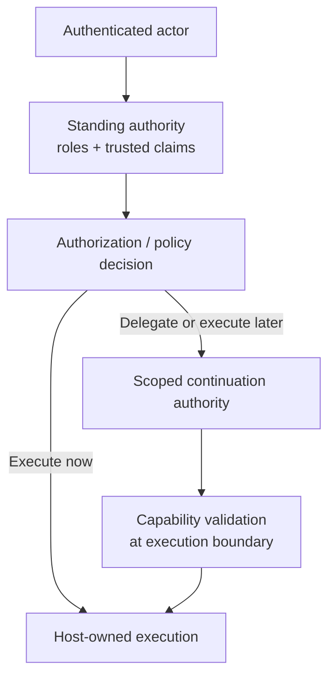

# Role-Based, Claims-Based, and Capability-Based Authorization

**Pattern classification:** Alternative Pattern

**Difficulty:** Intermediate

**Prerequisites:** [When ASP.NET Core Authorization Is Enough](when-aspnet-core-authorization-is-enough.md) and [Scoped Capability and Host-Owned Execution](../tutorials/scoped-capability-and-host-owned-execution.md)

> **Terminology note:** This comparison uses `role`, `claim`, `policy`, `scoped capability`, `execution authority`, and `host-owned execution` as architectural terms. See the [Architecture Glossary](glossary.md) and [Terminology and Established Architecture Concepts](terminology-and-established-concepts.md) for the broader vocabulary used throughout Learning.

Role-based authorization, claims-based authorization, and capability-based authority all help answer questions about what an actor or component may do.

They do not represent authority in the same way.

A useful first approximation is:

```text
Role-based authorization
=
What may members of this organizational role generally do?

Claims-based authorization
=
What may this authenticated principal do given these trusted attributes
and the current authorization policy?

Capability-based authority
=
What exact authority does this narrowly scoped grant convey
at this execution boundary?
```

None of these models is automatically more mature than the others.

A simple role check can be the correct architecture.

A claims policy can express conditions that roles cannot express cleanly.

A scoped capability can preserve narrow authority across time, process, or trust boundaries when standing identity is too broad.

The important question is not:

> Which model wins?

It is:

> **Which representation of authority matches the lifecycle and trust boundary of this operation?**

That distinction matters because modern systems often authorize in one place and execute somewhere else: a queue worker, deployment agent, background service, external gateway, or another tenant-aware application boundary.

If the authority model does not match that lifecycle, teams tend to make one of two mistakes: pass broad standing credentials farther than necessary, or introduce capability infrastructure where a role or resource-aware policy would have been simpler and safer.

The goal is proportionality: preserve only the authority the operation actually needs, for only as long and as far as it needs it.

---

## Quick Orientation

| Model | Authority is primarily represented by | Natural fit |
| --- | --- | --- |
| Role-based authorization | Membership in an organizational role | Stable, coarse-grained permissions |
| Claims-based authorization | Trusted attributes about the authenticated principal | Composable identity/context conditions |
| Capability-based authority | Possession or presentation of a narrowly scoped grant | Delegated, bounded, delayed, or cross-boundary execution |

The three models can also be composed:

```text
Authenticated actor
        ↓
Roles + trusted claims
        ↓
Authorization / policy evaluation
        ↓
Allowed decision
        ↓
Scoped capability when one is actually needed
        ↓
Capability validation at the execution boundary
        ↓
Host-owned execution
```

That composition is often stronger than forcing one model to solve every authorization and execution problem.

### Standing and Continuation Authority at a Glance



Roles and claims commonly describe authority available to the current principal. A capability becomes useful when an allowed decision must continue across a later boundary without forwarding that principal's broader standing authority.

### The Implementation Representations Can Overlap

The distinctions are semantic, not necessarily different wire formats.

A role may arrive as a role claim. A claims policy may inspect that role alongside other trusted attributes. A capability may also be encoded as a signed token containing claim-like fields.

What matters is what the host trusts the artifact to mean:

```text
Role membership = standing organizational permission
Identity claims = trusted attributes used by authorization policy
Scoped capability = bounded authority for a specific follow-on use
```

The same token technology can therefore carry different authority semantics.

---

## 1. Role-Based Authorization

Role-based authorization begins with organizational membership.

```text
Actor
   ↓
Role membership
   ↓
Allowed operation
```

Examples include:

```text
Administrator
Reviewer
SupportAgent
BillingManager
```

The application then maps one or more roles to operations or resources.

In ASP.NET Core, a simple role restriction may be expressed directly:

```csharp
[Authorize(Roles = "BillingManager")]
public IActionResult ReconcileInvoice(string invoiceId)
{
    // Application-owned operation.
    return NoContent();
}
```

For a stable organizational permission, that may be all the architecture needs.

### Where Roles Are Strong

Role-based authorization is especially effective when:

- Organizational responsibilities are stable.
- Permissions are relatively coarse grained.
- Administrators already manage users through familiar groups or roles.
- The number of roles remains understandable.
- The operation is consumed immediately inside the current application boundary.
- No separate portable execution authority is required after authorization succeeds.

Roles are also operationally familiar.

Many identity systems, administrative consoles, directory services, and application frameworks already expose role or group membership in ways that are easy for teams to understand and review.

### Where Roles Begin to Strain

Roles become less expressive when authorization depends on combinations such as:

```text
Actor is a reviewer
AND
actor belongs to tenant A
AND
resource belongs to tenant A
AND
resource classification <= actor clearance
AND
operation is allowed only in the current environment
```

Trying to encode every combination as another role can lead to role explosion:

```text
TenantAReviewer
TenantAProtectedReviewer
TenantAProtectedProductionReviewer
TenantBReviewer
TenantBProtectedReviewer
...
```

Roles also do not naturally represent narrow temporary authority such as:

```text
May purge case-123
for five minutes
through purge-worker
exactly once
```

A role such as:

```text
TemporaryCasePurger
```

would hide the very bindings that make the authority narrow.

### Scenario Where RBAC Clearly Wins

Consider an internal reporting application.

Requirements:

- Employees authenticate through the organization's identity provider.
- Members of `ReportReader` may view published reports.
- Members of `ReportAdministrator` may publish or retire reports.
- Reports are not tenant-specific.
- Operations happen immediately in the same application.
- There is no delayed worker, delegated execution, or human approval lifecycle.

The useful architecture may be:

```text
Authenticated employee
   ↓
Role check
   ↓
Application service
   ↓
Read / publish / retire report
```

Adding a per-operation capability issuer would create more infrastructure without solving a meaningful authority problem.

For this system, roles are not a primitive predecessor to a better design.

They are the better design.

---

## 2. Claims-Based Authorization

Claims-based authorization begins with trusted attributes associated with an authenticated principal.

```text
Actor
   ↓
Identity claims
   ↓
Authorization policy
   ↓
Allowed operation
```

Claims might describe facts such as:

```text
tenant_id = tenant-a
department = finance
employment_type = employee
clearance = restricted
region = us-central
```

The important word is **trusted**.

A string supplied by an untrusted client does not become authoritative merely because an application calls it a claim.

Claims normally acquire meaning through the authentication and identity system that issued or validated them.

### Where Claims Are Strong

Claims-based authorization is useful when the decision depends on richer actor attributes than one role name can represent cleanly.

Strengths include:

- Composable authorization conditions.
- Natural integration with modern identity providers.
- Reduced pressure to create a role for every attribute combination.
- Ability to combine identity attributes with resource-aware authorization.
- Familiar integration with ASP.NET Core policies and custom authorization handlers.

For example, a policy may require an organizational claim:

```csharp
builder.Services.AddAuthorization(options =>
{
    options.AddPolicy(
        "FinanceEmployee",
        policy => policy
            .RequireClaim("department", "finance")
            .RequireClaim("employment_type", "employee"));
});
```

A richer resource-based handler can then compare trusted identity data with current resource state.

When policy evaluates attributes of the subject, resource, action, or environment, this design overlaps with **attribute-based access control (ABAC)**. Claims are one possible source of subject attributes; they are not the whole ABAC model.

That distinction matters.

A `tenant_id` claim may identify the actor's tenant, while the resource's tenant should normally come from the application's authoritative resource state rather than from a second client-provided claim.

```text
Trusted actor claim
        +
Authoritative resource state
        ↓
Authorization policy
```

### Claims Are Attributes, Not Automatically Current World State

A claim can become stale.

For example:

```text
clearance = restricted
```

may have been true when the principal or access token was issued.

Meanwhile:

- Employment may have ended.
- Role membership may have changed.
- Tenant assignment may have changed.
- Resource classification may have changed.
- Emergency suspension may have been applied.

The architecture must decide which facts may safely travel in identity state and which facts must be reconstructed from authoritative services at decision time.

Do not turn the principal into a cache of every mutable fact merely to avoid loading current context.

### Where Claims Begin to Strain

Claims-based authorization is still commonly a form of **standing authority** attached to the current authenticated principal.

That can be the wrong artifact when the requirement is:

```text
A decision occurred now.
Execution happens later.
A different component performs it.
The later component should receive only the exact authority approved.
```

A broad principal containing:

```text
role = Administrator
scope = cases.manage
```

may be far more authority than a later worker requires to execute:

```text
case.purge
resource = case-123
```

Claims also do not automatically preserve a durable approval that must survive independently of the caller's session.

The application can build that lifecycle around claims, but the claim itself is not the lifecycle.

### Scenario Where Claims Clearly Win

Consider a multi-tenant document application.

Requirements:

- Every user authenticates through a trusted identity provider.
- The principal carries `tenant_id` and `department` claims.
- A user may edit a document only when the document belongs to the same tenant.
- Finance documents additionally require `department = finance`.
- The application loads the document before authorization.
- Editing happens immediately in the current request.
- No delayed executor or separately delegated authority exists.

The flow can remain:

```text
Authenticated principal
   ↓
Trusted tenant + department claims
   +
Authoritative document state
   ↓
Resource-based authorization policy
   ↓
Edit now or reject
```

Creating roles for every tenant/department combination would be awkward.

Creating a capability for each edit would add a boundary the workflow does not need.

Claims plus current resource authorization are the natural fit.

---

## 3. Capability-Based Authority

Capability-based authority represents permission as a grant that is intentionally narrow enough to be presented at an execution boundary.

```text
Decision
   ↓
Scoped grant
   ↓
Operation + resource + audience + expiration
   ↓
Execution
```

A capability may be represented by:

- An opaque server-side handle.
- A signed token.
- A reference to durable grant state.
- Another application-specific artifact whose semantics convey bounded authority.

> **Scope note:** This page uses *capability* in the practical distributed-application sense of a scoped grant or handle presented as authority. Pure object-capability systems are a distinct design family in which possession of an unforgeable object reference itself conveys authority; this comparison does not attempt to model that full object-capability discipline.

The important property is not the serialization format.

The important property is that the grant is bound to the authority that was actually approved.

For example:

```text
Capability:
cap-123

Subject:
reviewer-42

Operation:
case.purge

Resource:
case-123

Audience:
purge-worker

Issued:
2026-08-23T18:00:00Z

Expires:
2026-08-23T18:05:00Z

Maximum uses:
1
```

That is materially narrower than:

```text
reviewer-42 is an Administrator
```

or:

```text
scope = cases.manage
```

### Where Capabilities Are Strong

Capabilities are useful when execution authority must be:

- Narrowly scoped to one operation.
- Narrowly scoped to one resource.
- Bound to one intended audience or executor.
- Short lived.
- Delegated without copying the caller's broad standing authority.
- Preserved across a queue, worker, gateway, process, or trust boundary.
- Bounded by use count or replay controls.
- Linked to the decision or acknowledgment that justified issuance.

A capability creates a concrete answer to:

> **What exact authority may this executor rely on right now?**

### Capabilities Have Real Costs

A capability model adds infrastructure and security obligations.

Depending on the implementation, the system may need:

- Issuance rules.
- Issuer trust.
- Signature or proof verification.
- Audience validation.
- Expiration and not-before handling.
- Replay or bounded-use state.
- Revocation or cancellation reasoning.
- Key custody when cryptographic signing is used.
- Provenance linking the capability to the decision that produced it.
- Execution-boundary validation close to the side effect.

A poorly designed capability can be worse than a simple authorization check.

For example:

```text
scope = *
expires = next year
replay = unlimited
audience = any service
```

is not meaningfully narrow merely because the application calls the artifact a capability. It may instead create a portable bearer credential with broader reach, longer lifetime, and less obvious administrative visibility than the role or policy it was meant to improve.

A capability should also preserve enough provenance to explain where it came from. For consequential operations, that may include a `decision_id`, `approval_id`, policy version or fingerprint, or another stable link to the decision that justified issuance.

### Self-Contained Versus Stateful Grants

Capability validation does not require one universal storage design.

A short-lived signed grant may rely primarily on local cryptographic verification plus current execution checks. A single-use, revocable, or long-running grant may require server-side grant state, a consumption record, or a revocation lookup. Those choices directly affect operational cost, availability, and replay behavior.

The important requirement is to make the revocation and consumption story explicit rather than assuming expiration alone solves every lifecycle problem. See [Replay Protection and Bounded-Use Authority](../security/replay-protection-and-bounded-use.md) for the deeper stateful-use boundary.

### Minimum Capability Contract

Before a capability is treated as execution authority, define at least:

- The exact operation.
- The exact resource or resource class.
- The subject or workload when subject binding matters.
- The intended audience or executor.
- The validity window.
- Replay or use-count semantics.
- The decision/provenance link and the validation point closest to execution.

### Scenario Where Capabilities Clearly Win

Consider a purge workflow.

Requirements:

- A case administrator may request purge.
- Current retention and legal-hold policy must allow the purge.
- A reviewer approves the irreversible action.
- The purge executes later through a background worker.
- The worker must not inherit the reviewer's broad administrator permissions.
- Authority should apply only to one case, one operation, one worker, and a short window.
- Duplicate use must be detectable or prevented.

The lifecycle may be:

```text
Authenticated requester
        ↓
Role / claims authorization
        ↓
Authoritative case + retention context
        ↓
Policy decision
        ↓
Reviewer approval / acknowledgment
        ↓
Scoped purge capability
        ↓
Queue / delayed worker
        ↓
Validate capability for this execution
        ↓
Host-owned purge executor
```

The capability solves a problem that roles and standing claims do not solve cleanly:

> **How does a later executor receive only the authority approved for this one action?**

At the execution boundary, validation should be explicit and close to the side effect:

```csharp
CapabilityValidationResult validation =
    await capabilityValidator.ValidateForExecutionAsync(
        capability,
        audience: "purge-worker",
        operation: "case.purge",
        resourceId: caseId,
        cancellationToken);

if (!validation.IsValid)
{
    return PurgeResult.Denied("invalid_or_expired_capability");
}

await purgeExecutor.ExecuteAsync(
    caseId,
    cancellationToken);
```

The exact API is application-specific. The architectural requirement is: **the host that owns the side effect validates the authority for that exact execution before acting.**

---

## Distinctions That Prevent Misuse

### Capabilities Do Not Replace Identity

A capability does not automatically answer:

> Who is this actor?

Authentication still establishes identity where identity matters.

A production execution boundary may legitimately require:

```text
Authenticated workload or actor
        +
Current host authorization
        +
Current resource state
        +
Validated scoped capability
```

Likewise, a capability should not be minted merely because a caller is authenticated.

The issuer may first evaluate:

- Roles.
- Claims.
- Current resource state.
- Policy constraints.
- Risk state.
- Required acknowledgment.
- Approval state.

Only an allowed decision should produce the scoped authority needed for follow-on execution.

This is why the models compose naturally:

```text
Identity establishes who is asking.
Roles / claims help determine standing permission and context.
Policy determines whether this operation should proceed.
Capability preserves narrow follow-on authority.
Executor performs the side effect.
```

### Capabilities Do Not Replace Policy Evaluation

Possessing a capability can be sufficient authorization at a carefully designed execution boundary **only when the capability's issuance and validation semantics make that safe**.

That does not mean capabilities eliminate policy.

Policy may have been responsible for creating the capability in the first place.

For example:

```text
Role:
CaseAdministrator

Claim:
tenant_id = tenant-a

Resource:
case-123 belongs to tenant-a

Policy:
no legal hold

Decision:
Allowed

Issued capability:
case.purge / case-123 / purge-worker / expires in 5 minutes
```

The capability preserves the result of a narrower authority decision.

It does not explain why `CaseAdministrator`, tenant membership, legal-hold state, or other constraints were valid unless that provenance is separately retained.

### A Claims Token Is Not Automatically a Capability

The implementation formats can look similar.

For example, both identity/access tokens and capabilities may be signed token structures containing fields such as:

```text
sub
aud
scope
exp
```

Do not infer architectural semantics from the token format alone.

A broad access token may carry claims describing a principal's standing permissions:

```text
scope = cases.manage
```

A narrowly designed capability may instead represent:

```text
operation = case.purge
resource = case-123
audience = purge-worker
exp = 5 minutes
maximum_uses = 1
```

The second artifact is not "more secure" merely because it has more fields.

Its security value comes from deliberate issuance, narrow authority, trusted validation, bounded lifetime/use, and enforcement at the boundary where authority becomes action.

The reverse distinction also matters:

> A claim can describe authority without being a capability, and a capability can convey authority without being a general-purpose identity document.

In ASP.NET Core, JWT bearer authentication commonly materializes a validated bearer token's claims as a `ClaimsPrincipal`. A capability token should therefore have a deliberately distinct validation path—such as a separate authentication scheme, gateway validator, or execution-boundary handler—so a scoped execution grant is not accidentally accepted as a general identity token, or vice versa.

The same caution applies to fields such as `aud`. A general access token's audience and a capability's intended executor may both be represented with an audience field, but the semantic question is different: **which component is authorized to rely on this artifact for this operation?** Validate the expected audience in the execution context rather than trusting the field name alone.

### Standing Authority Versus Continuation Authority

One useful way to choose among these models is to distinguish **standing authority** from **continuation authority**.

Roles and many identity claims typically describe permissions that remain available while the principal remains valid:

```text
Standing authority
=
This actor is generally permitted to request or perform this category of operation.
```

A narrow capability can represent a later stage:

```text
Continuation authority
=
This exact approved operation may continue through this exact execution boundary under these bindings.
```

For example:

```text
Role:
DeploymentOperator
```

may allow a user to request a production deployment.

After policy and human approval, the deployment worker might receive only:

```text
Operation:
deployment.apply

Release:
release-2026.08.23.1

Environment:
production

Audience:
deployment-runner

Expires:
10 minutes
```

The role and capability are not competing models.

They represent authority at different points in the lifecycle.

### Resource Specificity Changes the Choice

Resource specificity is not unique to capabilities.

Claims-based or role-based authorization can be resource aware when the application loads the resource and evaluates current state.

For example:

```text
Actor role = Editor
Actor tenant = tenant-a
Document tenant = tenant-a
Document status = Draft
```

can be evaluated directly through ordinary resource-based authorization.

A capability becomes more useful when the **resource-specific approval must survive beyond that decision point**.

Compare:

```text
Request-local resource authorization
        ↓
Authorize document-123
        ↓
Edit document-123 now
```

with:

```text
Approve external deletion of document-123
        ↓
Execution occurs later elsewhere
        ↓
Later executor needs portable narrow authority for document-123
```

The second flow has an authority-handoff problem that the first does not.

### Delegation Changes the Choice

Delegation is another signal.

Suppose an authenticated administrator can perform several account operations:

```text
account.disable
account.restore
account.reset-mfa
account.change-owner
```

A background worker needs authority for only:

```text
account.disable / user-123
```

Copying the administrator's full identity token or service credentials into the worker expands authority.

A narrower delegated grant can reduce that expansion.

But if there is no delegation:

```text
Administrator request
   ↓
Same host authorizes
   ↓
Same host executes immediately
```

then a separate capability may add no value.

---

## Comparison Matrix

| Concern | Role-based authorization | Claims-based authorization | Capability-based authority |
| --- | --- | --- | --- |
| Primary question | What may members of this role generally do? | What may this principal do given trusted attributes and policy? | What exact authority does this grant convey at this boundary? |
| Typical authority shape | Coarse-grained standing permission | Attribute-driven standing/contextual permission | Narrow, explicit, bounded grant |
| Identity relationship | Strongly identity-centric | Strongly identity-centric | May be identity-bound but is not itself necessarily an identity document |
| Administrative familiarity | High | Moderate to high | Usually lower; custom lifecycle may be required |
| Composable conditions | Limited if encoded only as roles | Strong | Usually encoded at issuance/validation rather than as arbitrary identity attributes |
| Resource-aware checks | Possible with application/resource authorization | Strong with resource-based policy | Strong when resource is explicitly bound into the grant |
| Temporary authority | Awkward if modeled as temporary roles | Possible through token/session lifetime but often broad | Natural through explicit expiration/not-before bindings |
| Delegation | Usually coarse | Often delegates the principal's broader access context | Natural when a narrow grant can be passed to another boundary |
| Delayed execution | Standing role may be too broad | Standing claims/token may be too broad or stale | Strong fit when authority must survive narrowly across the delay |
| Audience binding | Usually not represented by the role itself | May be present in the token carrying claims | Common capability binding |
| Replay/bounded use | Not normally a role concern | Token replay is a credential concern, but per-operation use may not exist | Often a first-class concern for reusable grants |
| Revocation | Role/group/session mechanisms | Identity/token/session mechanisms | Requires deliberate grant revocation, expiry, or validation strategy |
| Operational cost | Low | Low to moderate | Moderate to high |
| Clear win | Stable organizational permissions | Rich attribute/resource policies | Narrow delegated or continuation authority |

This matrix is not a security ranking.

Each model becomes weak when it is stretched beyond the problem it naturally represents.

---

## Three Designs That Should All Exist

A healthy architecture vocabulary should allow all three of these designs to be correct.

### Design A — Role Check and Immediate Execution

```text
Authenticated user
   ↓
Role = ReportAdministrator?
   ├── no  → reject
   └── yes → publish report now
```

Use when the organizational permission is stable and the operation remains inside one request/host boundary.

### Design B — Claims + Resource-Based Policy

```text
Authenticated user
   ↓
Trusted tenant / department claims
   +
Current document state
   ↓
Authorization policy
   ├── fail → reject
   └── pass → edit now
```

Use when richer actor attributes and current resource state determine access, but no separate execution authority is needed.

### Design C — Authorization + Policy + Scoped Capability

```text
Authenticated requester
   ↓
Role / claims authorization
   ↓
Current resource + governing constraints
   ↓
Allowed decision
   ↓
Short-lived resource-specific capability
   ↓
Later executor validates capability
   ↓
Execute
```

Use when authority must cross a time, process, gateway, queue, or trust boundary without copying broad standing permissions.

---

## Common Failure Modes

### Role Explosion as a Policy Substitute

As discussed in the RBAC section, avoid using role names as a substitute for every dynamic policy combination.

```text
RegionAHighRiskTenantBProductionApprover
```

is a signal that attributes, resource state, or policy may deserve their own representation.

### Temporary Approval Hidden as a Role

Avoid:

```text
Add user to TemporaryPurgeApprover role
```

when the actual requirement is:

```text
Approve purge of case-123 once before 18:05Z
```

The role broadens and obscures the approval semantics.

### Mutable World State Stuffed into Claims

Avoid treating long-lived identity claims as authoritative copies of rapidly changing application state.

Load current resource or policy state when freshness matters.

### Client-Provided Attributes Treated as Trusted Claims

Do not accept:

```json
{
  "tenant_id": "tenant-a",
  "role": "Administrator"
}
```

from an ordinary request body and then treat those values as equivalent to claims established by the authentication system.

### Broad Access Token Passed as Delegated Execution Authority

Avoid sending a caller's broad token to a worker merely because the worker needs to perform one approved operation.

Ask whether the worker can receive narrower authority.

### Capability Minted Before the Decision

Avoid:

```text
Request arrives
   ↓
Mint capability
   ↓
Evaluate whether operation is allowed
```

The safe direction is normally:

```text
Evaluate
   ↓
Allowed
   ↓
Mint only the authority justified by that decision
```

### Capability Validated Far from Execution

A capability that was valid several calls earlier may no longer be valid when the side effect occurs.

Expiration, revocation, resource state, audience, use count, or other bindings can change.

Follow the foundational tutorial's rule:

> **Validate where authority becomes action.**

---

## When Not to Introduce Capabilities

Prefer ordinary role/claims/resource authorization when:

- The caller and executor are inside the same trusted host.
- Execution follows immediately after authorization.
- No separate component needs delegated authority.
- No approval must survive independently of the current session.
- Current resource authorization already expresses the requirement.
- There is no useful replay or bounded-use problem to solve.
- A capability issuer, validator, signing key, revocation store, or consumption store would create more risk and maintenance than the boundary justifies.

The existence of [Scoped Capability and Host-Owned Execution](../tutorials/scoped-capability-and-host-owned-execution.md) as a canonical Learning tutorial does not mean every application should mint capabilities.

Canonical does not mean universal.

The capability pattern is valuable when the authority-handoff problem exists.

Without that problem, the simpler authorization model should remain available.

---

## A Practical Decision Guide

Start with the smallest question.

### Use Roles When

```text
Permission is organizational
   +
coarse grained
   +
stable
   +
immediate
```

Ask:

1. Can a small, understandable role set express the requirement?
2. Would administrators naturally manage this permission as role/group membership?
3. Does the operation stay within the current request and application boundary?

If yes, roles may be enough.

### Use Claims-Based Policies When

```text
Decision depends on trusted actor attributes
   +
possibly current resource state
   +
execution remains immediate
```

Ask:

1. Does the decision need several identity attributes rather than one role?
2. Can authoritative resource state be loaded before authorization?
3. Are success/failure authorization semantics sufficient?
4. Is there no later component that needs separately scoped authority?

If yes, claims/resource policies may be enough.

### Add Capabilities When

```text
Approval and execution separate
   or
execution moves to another boundary
   or
authority must be delegated narrowly
   or
replay / expiration / audience / use bindings matter
```

Ask:

1. Must another process, worker, gateway, or host execute later?
2. Would passing the caller's standing identity give that executor too much authority?
3. Must authority be bound to one operation and one resource?
4. Must it expire independently of the caller's session?
5. Does use count or replay matter?
6. Must the executor validate that the grant was intended specifically for it?
7. Must the grant be linked to a prior decision or acknowledgment?

If several answers are yes, a scoped capability may be earning its complexity.

---

## Relationship to ASP.NET Core Authorization

ASP.NET Core already supports role-based, claims-based, policy-based, and resource-based authorization.

That framework should remain the first choice when it completely expresses the access-control problem.

The [When ASP.NET Core Authorization Is Enough](when-aspnet-core-authorization-is-enough.md) comparison explains that boundary in detail.

Capability-based authority becomes an additional concern when a successful authorization or governance decision must produce **portable, narrow follow-on authority** for another execution boundary.

The relationship can therefore be:

```text
ASP.NET Core authentication
        ↓
ASP.NET Core role / claims / resource authorization
        ↓
Application or governance policy
        ↓
Immediate execution
```

or, when required:

```text
ASP.NET Core authentication
        ↓
ASP.NET Core role / claims / resource authorization
        ↓
Application or governance policy
        ↓
Scoped capability issuance
        ↓
Later host validates capability
        ↓
Execution
```

The second path is not inherently superior.

It solves an additional lifecycle problem.

---

## Relationship to Existing Learning Material

Use these pages together when useful:

1. [When ASP.NET Core Authorization Is Enough](when-aspnet-core-authorization-is-enough.md) — determines whether ordinary framework authorization fully expresses the problem.
2. **Role-Based, Claims-Based, and Capability-Based Authorization** — compares different representations of standing and delegated authority.
3. [When a Simple Application Service Is Enough](when-a-simple-application-service-is-enough.md) — asks whether the authorized use case can remain an immediate application workflow.
4. [Policy Context and Explicit Decision Outcomes](../tutorials/policy-context-and-explicit-decision-outcomes.md) — separates authoritative context from explicit governance outcomes.
5. [Scoped Capability and Host-Owned Execution](../tutorials/scoped-capability-and-host-owned-execution.md) — demonstrates narrow post-decision execution authority and boundary validation.
6. [Replay Protection and Bounded-Use Authority](../security/replay-protection-and-bounded-use.md) — covers reusable-grant replay and consumption concerns in greater depth.

This is not a mandatory progression from roles to claims to capabilities.

A reader should stop at the smallest model that correctly preserves the required boundary.

---

## Review Checklist

Before replacing roles with something more complex, ask:

- [ ] Is the permission fundamentally organizational and stable?
- [ ] Is the role set still understandable and administratively useful?
- [ ] Does execution happen immediately inside the current host?

Before replacing claims/resource authorization with capabilities, ask:

- [ ] Can trusted identity attributes plus authoritative resource state already express the rule?
- [ ] Is authorization consumed immediately?
- [ ] Is there no delegated or delayed execution authority to preserve?

Before introducing a capability, ask:

- [ ] What exact operation is granted?
- [ ] What exact resource is granted?
- [ ] Which subject or workload may use it?
- [ ] Which audience may accept it?
- [ ] When does it become valid and expire?
- [ ] Can it be replayed, and is that acceptable?
- [ ] How is it revoked or cancelled if necessary?
- [ ] What policy or decision produced it?
- [ ] Where is it validated immediately before execution?
- [ ] Would the same host be safer and simpler by authorizing and executing directly instead?

---

## Summary

Role-based authorization is often the clearest model for stable organizational permissions.

Claims-based authorization adds richer identity attributes and composes naturally with current resource-aware policy.

Capability-based authority becomes valuable when a decision must be converted into narrow, bounded authority that can cross a later execution boundary without carrying the caller's full standing permissions.

The models are therefore complementary:

```text
Roles
=
coarse organizational permission

Claims
=
richer trusted principal attributes

Capabilities
=
narrow bounded execution authority
```

Capabilities do not make roles or claims obsolete.

Roles and claims do not make capabilities unnecessary when authority must be delegated or preserved narrowly across time, process, or trust boundaries.

Prefer the smallest authority model that makes the real boundary explicit.

---

> **Read it. Run it. Question it. Improve it.**
