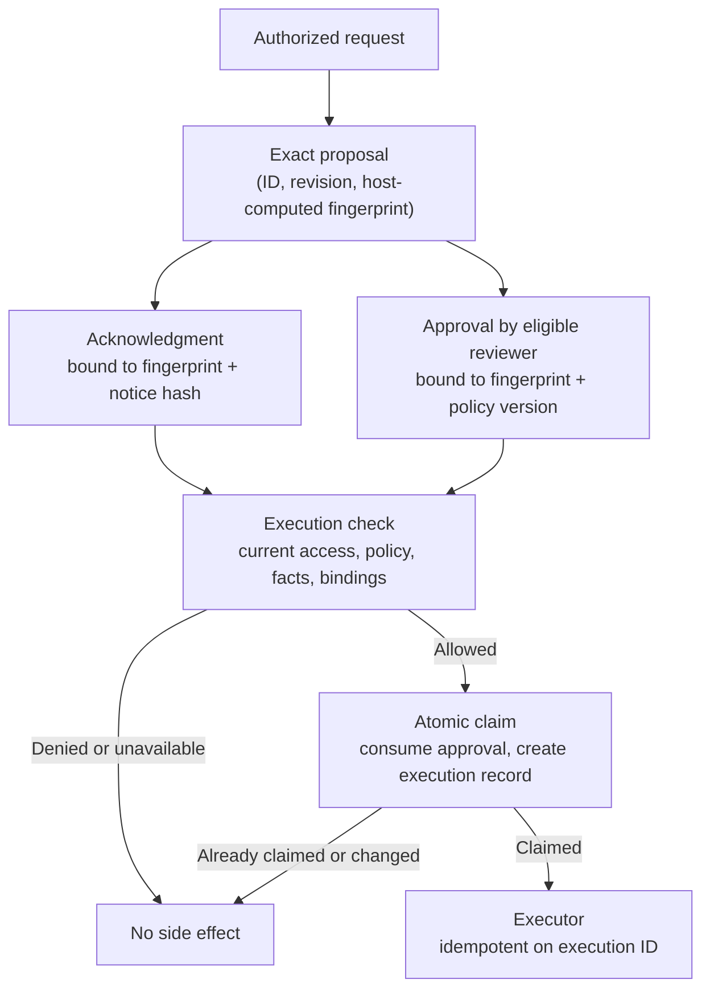

# Authorization vs. Approval vs. Acknowledgment: Which Decision Do You Actually Have?

**Pattern classification:** General learning material

**Difficulty:** Intermediate

**Prerequisites:** Familiarity with C# and ASP.NET Core authorization is helpful. No AsiBackbone package, workflow engine, or prior Learning material is required. The code uses `TimeProvider`, available since .NET 8.

**What this article covers:** what authorization, approval, acknowledgment, and execution permission each mean in plain terms; who produces each one, what it binds to, how long it lasts, and what evidence it leaves; what each decision does *not* prove; when ordinary ASP.NET Core authorization followed by immediate execution is enough; how a delayed operation should check permission again, claim it once, and execute; and the failure modes that appear when one decision quietly stands in for another.

A background worker picks up a queued job and runs this:

```csharp
var job = await _jobs.GetAsync(jobId, ct);

if (job.Status == JobStatus.Approved && job.Acknowledged)
{
    await _exporter.ExportCustomerDataAsync(job.TenantId, job.Fields, job.Destination, ct);
}
```

Every word in that condition sounds like permission. `Approved` sounds like someone with authority said yes. `Acknowledged` sounds like the risks were accepted. The requester was certainly authorized when they created the job, or the API would have rejected it.

Now ask four ordinary questions about that export:

- The requester was authorized on Monday. Are they still allowed to export this tenant's data on Thursday, when the worker runs?
- The reviewer approved an export of three fields. The job now lists five. Did anyone approve five?
- Someone ticked a box about personal data. Who ticked it, which notice were they shown, and was that box ever meant to grant anything?
- The tenant was placed on a legal hold on Wednesday. Does any of the stored state know that?

The code cannot answer any of them, because it collapsed four different decisions into two flags.

**The short version.** Authorization says who may ask. Approval says an eligible reviewer accepted one exact proposal. Acknowledgment says a specific person accepted one exact notice. None of them says the operation may run *now*. When execution is delayed, the host must check again at the point of execution, claim that permission exactly once, and only then perform the side effect. When execution is immediate and nobody else has to agree, ordinary authorization is usually enough.

> Authorization, approval, and acknowledgment answer different questions. None should silently inherit the authority or evidence semantics of another.

## Four Questions, Four Decisions

Teams use *authorized*, *approved*, *confirmed*, and *acknowledged* almost interchangeably. In a system that executes consequential operations, they should mean distinct things:

| Decision | The question it answers |
| --- | --- |
| **Authorization** | May this identified actor request this operation on this resource, under current access policy? |
| **Approval** | Did an eligible reviewer, other than the requester where required, accept this specific proposal at this specific revision? |
| **Acknowledgment** | Did this person accept the exact notice, warning, or condition the host presented? |
| **Execution permission** | Is this exact operation still allowed at the moment the protected side effect is about to happen? |

In the simplest case, where the request is handled and the side effect performed immediately, the authorization check is also the check that permits the operation to run. The rest of this article is about what changes when those two moments separate.

*Execution permission* is this article's label, not an industry term. The same idea appears elsewhere as enforcement-time authorization, just-in-time authorization, or time-of-use checking, the fix for time-of-check-to-time-of-use (TOCTOU) gaps. The name matters less than the rule: it is decided at the boundary, not remembered from earlier.

*Confirmed* is deliberately missing. In practice it is used for all four, and also for "the user clicked OK so they didn't fat-finger the button." When you see it in a design, ask which of the four it means. If the answer is "it prevents accidental clicks," it is a user-interface safeguard, which is useful and legitimate, and it should not be recorded or consumed as any of the four decisions above.

These are working definitions for this article. Standards, products, and teams use the words differently, and some regulated domains define them precisely. What matters is that *your* system gives each one a single meaning and never lets one stand in for another by accident.

## The Example: A Customer Data Export

A support analyst at a software company needs a full export of one tenant's customer records to help with a data migration. The export includes names, email addresses, and phone numbers. Company policy says:

- Only analysts assigned to the tenant may request an export of its data.
- Any export containing personal data must be approved by a data steward for that tenant, who may not be the requester.
- Before an export containing personal data is submitted, the requester must acknowledge a notice that the file contains personal data and must be deleted within seven days.
- Exports run overnight in a background worker, because large tenants take hours.
- Nothing may be exported from a tenant on legal hold.

That one scenario contains all four decisions:

```text
Monday 10:02   Analyst (authenticated) requests export, revision 1: name, email
               → authorization: analyst is assigned to tenant       ✔
Monday 10:03   Analyst edits proposal, revision 2: name, email, phone
Monday 10:04   Analyst acknowledges personal-data handling notice v3 for revision 2
Tuesday 09:15  Steward approves revision 2, valid for 72 hours
Wednesday      Tenant placed on legal hold
Thursday 02:00 Worker picks up the job
               → execution permission: ?
```

The question at 02:00 on Thursday is not "was this authorized, approved, and acknowledged?" All three happened. The question is whether the export is **still** permitted, for **this** revision, under the rules and facts that are true **now**. The answer is no, and nothing in the stored flags would say so.

## What Each Decision Binds To and How Long It Lasts

This table is the core of the article. Each row is a property you should be able to state for every decision your system records.

| | Authorization | Approval | Acknowledgment | Execution permission |
| --- | --- | --- | --- | --- |
| **Question** | May this actor request this kind of operation on this resource? | Did an eligible reviewer accept this exact proposal? | Did this person acknowledge this exact notice for this proposal? | Is this exact operation still allowed right now? |
| **Produced by** | Access policy evaluated by the host | An eligible reviewer, recorded by the host | The person the requirement names, recorded by the host | The host, at the protected boundary |
| **Binds to** | Actor, operation, resource, current policy | Proposal fingerprint, reviewer, reviewer's verified scope, policy version | Actor, notice ID, version, and content hash, proposal fingerprint | The exact operation about to run |
| **Lifetime** | The request or session in which it was evaluated | Until expiry, revocation, consumption, rejection, supersession, or material drift | Until expiry, or until the notice or proposal changes | One claimed execution attempt |
| **Evidence to retain** | Decision, reason code, policy version, inputs used | Reviewer, disposition, bound fingerprint, scope, policy version, time, expiry, rationale where required | Actor, notice ID, version, content hash, bound fingerprint, time | Check result, policy version, the approval and acknowledgment relied on, execution ID, outcome |
| **Safe downstream inference** | The requester could legitimately *propose* the operation at that time | The reviewer accepted *this proposal* at that time | The person submitted acceptance of *this notice* at that time | The side effect may run, once, now |

The rows that teams skip are **binds to** and **lifetime**. A decision without a binding can be reused for something it never considered. A decision without a lifetime becomes permanent by default.

## What Each Decision Does Not Prove

The inverse table is just as useful in design review, because most incidents come from inferences nobody wrote down.

| Decision | Does not prove |
| --- | --- |
| **Authorization** | That anyone reviewed the operation. That the actor is still authorized later. That the resource is still in the state it was in. That a worker running later has the same authority. |
| **Approval** | That the requester was authorized. That the reviewer was eligible, unless the host checked. That a different proposal is acceptable. That policy, resource state, or the requester's access are unchanged. That execution should happen now. |
| **Acknowledgment** | That the person may perform the operation. That anyone approved it. That the person read or understood the notice. That the operation is safe or lawful. That the person consented in any legal sense. That a different or updated notice was accepted. |
| **Execution permission** | That the effect completed. It is a decision to proceed, not a record of the outcome, which needs its own evidence. |

Two rows deserve emphasis.

**Acknowledgment grants nothing.** It satisfies one specific requirement, such as "the requester has been told about the retention rule," and every other constraint still applies. If a checkbox can turn a denied operation into an allowed one, it has become an override, and overrides need an authorized person, not an informed one.

**Acknowledgment is not legal consent.** This article uses acknowledgment in its engineering sense: evidence that an identified person submitted acceptance of a notice the host presented. Whether that is sufficient for consent, notice, or disclosure obligations in your jurisdiction or industry is a legal and compliance question, and this article does not answer it.

## The Proportional Path: When Authorization Is the Whole Story

Most operations do not need approval, acknowledgment, or anything else in this article.

Suppose the same analyst exports a small report about their own team's ticket volume. It contains no personal data, it is generated in a few seconds, and it is returned in the same HTTP response. The honest design is ordinary resource-based authorization followed by the operation:

```csharp
app.MapPost("/reports/{reportId}/export", async (
    string reportId,
    ClaimsPrincipal user,
    IAuthorizationService authorization,
    IReportStore reports,
    IReportExporter exporter,
    CancellationToken ct) =>
{
    var report = await reports.FindAsync(reportId, ct);
    if (report is null)
    {
        return Results.NotFound();
    }

    var result = await authorization.AuthorizeAsync(user, report, "Reports.Export");
    if (!result.Succeeded)
    {
        return Results.Forbid();
    }

    var file = await exporter.ExportAsync(report, ct);
    return Results.File(file.Content, file.ContentType, file.FileName);
});
```

```text
authenticated actor
    → authorization (current policy, loaded resource)
    → protected executor, same request
```

Here, authorization effectively *is* execution permission: the same principal, the same loaded resource, the same policy, the same process, and a gap of milliseconds. There is no revision to drift, no second person, and no later worker. Adding a proposal store, an approval queue, and an execution gate to this endpoint would add cost and a false impression of rigor.

"Same request" does not guarantee that nothing changed. A concurrent update or an external policy change can still land in those milliseconds. For a read-only report, that is usually acceptable. For a mutation, the usual tools apply: optimistic concurrency on the resource, or authorization evaluated inside the same transaction as the write.

[When ASP.NET Core Authorization Is Enough](../../architecture/when-aspnet-core-authorization-is-enough.md) explores this boundary in depth. The short test is: **if the decision and the side effect happen in the same request, nobody else needs to agree, and the relevant state stays valid through the side effect, authorization is usually sufficient.**

The distinctions start to matter when at least one of these is true:

- A second person must agree, or policy requires separation of duties.
- A person must be told something specific before the operation proceeds.
- Execution is delayed, queued, retried, or runs under a different identity.
- The proposal can be edited after someone has looked at it.
- The operation is expensive or irreversible enough that "which decision allowed this?" will be asked afterward.

## The Delayed Path: Separate Decisions, a Fresh Check, One Claim

For the customer export, each step produces a distinct record, and nothing runs until the last three steps succeed:



In words: an authorized request becomes an exact proposal. Acknowledgment and approval each bind to that proposal. At execution time, a fresh check re-evaluates access, policy, facts, and those bindings. If the check allows it, an atomic claim consumes the approval exactly once. Only then does the executor run. A denied or unavailable check, or a lost claim, means no side effect.

### The proposal is the thing everyone decides about

Approval and acknowledgment are only meaningful if they refer to something exact. Model the export as a proposal with a revision, and have the host compute a fingerprint over every field that matters to the decision:

```csharp
public sealed record ExportProposal(
    string ProposalId,
    int Revision,
    string TenantId,
    string RequesterId,
    IReadOnlyList<string> Fields,
    string Destination,
    string Purpose);

public static class ProposalFingerprint
{
    // Change this tag whenever the set of material fields changes, so old and
    // new fingerprints can never collide by accident.
    private const string Format = "export-proposal/v1";

    public static string Compute(ExportProposal proposal)
    {
        // A structured encoding, not string concatenation: JSON escaping keeps
        // ["a,b"] distinct from ["a", "b"], and a newline inside Purpose cannot
        // impersonate a field boundary.
        var material = new
        {
            Format,
            proposal.ProposalId,
            proposal.Revision,
            proposal.TenantId,
            proposal.RequesterId,
            Fields = proposal.Fields.Order(StringComparer.Ordinal).ToArray(),
            proposal.Destination,
            proposal.Purpose,
        };

        var bytes = JsonSerializer.SerializeToUtf8Bytes(material);
        return Convert.ToHexString(SHA256.HashData(bytes));
    }
}
```

Three rules make the fingerprint trustworthy:

- **The host computes it from the stored proposal, every time.** A worker must never accept a fingerprint, or an approval binding, supplied by the client or carried in the job message. A hash the caller chose proves nothing.
- **Revision is part of it.** This example takes the strict rule: every new revision needs fresh approval and acknowledgment, even if its content happens to match an earlier one. If your domain wants approval to follow content rather than revisions, leave the revision out, and say so in the design.
- **The encoding is unambiguous and stable.** This serializer output is deterministic for one type in one codebase, which is enough when the same service computes and compares. If different services or platforms compute the fingerprint, define a canonical form, such as the JSON Canonicalization Scheme (RFC 8785), and test it across both.

Deciding which fields are material is a domain decision. Here, adding a field or changing the destination is material. Fixing a typo in an internal note is not, which is why the note is not in the fingerprint.

### Approval, acknowledgment, and authorization are separate records

Keep each decision as its own type, even if all three end up in the same database:

```csharp
public sealed record ExportApproval(
    string ApprovalId,
    string ProposalId,
    string ProposalFingerprint,
    string ReviewerId,
    string ReviewerScope,           // scope the host verified at approval time, e.g. "data-steward:tenant-contoso"
    string PolicyVersion,           // policy the approval was given under
    DateTimeOffset ApprovedAt,
    DateTimeOffset ExpiresAt,
    DateTimeOffset? ConsumedAt,
    DateTimeOffset? RevokedAt);

public sealed record ExportAcknowledgment(
    string AcknowledgmentId,
    string ProposalId,
    string ProposalFingerprint,
    string ActorId,
    string NoticeId,                // e.g. "personal-data-export-notice"
    int NoticeVersion,              // versions are immutable once published
    string NoticeContentHash,       // hash of the exact text the host rendered
    DateTimeOffset AcknowledgedAt,
    DateTimeOffset ExpiresAt);
```

Notice what these records do *not* contain: a `Status` field that means "go," or the requester's claims, token, or session. Approval records that a reviewer accepted a fingerprint. Acknowledgment records that a person submitted acceptance of a notice for a fingerprint. Neither is an instruction to execute.

Each record is checked when it is created, not only later. When the steward clicks **Approve**, the host verifies that the steward is eligible for this tenant and is not the requester, then records the scope it verified. When the analyst acknowledges, the host records the notice ID and version it rendered and a hash of that text. The host also retains every published notice version, unchanged, so "which words were on screen" can be answered by retrieving that version, with the hash confirming it is the same text. Neither record proves the person read the text; they prove what the host presented and who submitted acceptance.

At request time, the host evaluates the requester's authorization and stores that decision with its reason code and policy version, as described in [Your Audit Log Records the Story, Not the Decision](your-audit-log-is-not-evidence.md). That record is evidence that the request was legitimate *when it was made*. It is not a ticket the worker may carry forward.

### Execution permission is decided again, at the boundary

The worker does not trust any stored flag. Immediately before the side effect, it asks the host a fresh question. The check is read-only; it decides, and a separate claim step makes that decision count exactly once.

```csharp
public sealed class ExportExecutionGate(
    IProposalStore proposals,
    IApprovalStore approvals,
    IAcknowledgmentStore acknowledgments,
    IAccessPolicy access,
    IExportPolicy exportPolicy,
    TimeProvider time)
{
    public async Task<ExecutionCheck> CheckAsync(string proposalId, CancellationToken ct)
    {
        try
        {
            return await EvaluateAsync(proposalId, ct);
        }
        catch (DependencyUnavailableException)
        {
            // If the access store, policy, or legal-hold source cannot answer,
            // the honest result is "not now", never "allowed".
            return ExecutionCheck.Unavailable("dependency.unavailable");
        }
    }

    private async Task<ExecutionCheck> EvaluateAsync(string proposalId, CancellationToken ct)
    {
        var proposal = await proposals.GetCurrentAsync(proposalId, ct);
        if (proposal is null)
        {
            return ExecutionCheck.Deny("proposal.not-found");
        }

        var fingerprint = ProposalFingerprint.Compute(proposal);
        var now = time.GetUtcNow();

        // 1. The requester must still be authorized now, not merely on Monday.
        var requesterAccess = await access.EvaluateAsync(
            proposal.RequesterId, "customer-data.export", proposal.TenantId, ct);
        if (!requesterAccess.Allowed)
        {
            return ExecutionCheck.Deny(requesterAccess.ReasonCode);
        }

        // 2. Evaluate current policy against current facts, and ask what it requires.
        var requirements = await exportPolicy.EvaluateAsync(proposal, ct);
        if (requirements.Denied)
        {
            return ExecutionCheck.Deny(requirements.ReasonCode); // e.g. "tenant.legal-hold"
        }

        // 3. Approval: the current unconsumed, unrevoked approval for this exact
        //    fingerprint, unexpired, given under the current policy version, by a
        //    reviewer who is still eligible and is not the requester.
        ExportApproval? approval = null;
        if (requirements.ApprovalRequired)
        {
            approval = await approvals.FindCurrentAsync(proposalId, fingerprint, ct);
            if (approval is null)
            {
                return ExecutionCheck.Deny("approval.missing-for-current-revision");
            }

            if (approval.ExpiresAt <= now)
            {
                return ExecutionCheck.Deny("approval.expired");
            }

            if (approval.PolicyVersion != requirements.PolicyVersion)
            {
                return ExecutionCheck.Deny("approval.policy-changed");
            }

            if (approval.ReviewerId == proposal.RequesterId)
            {
                return ExecutionCheck.Deny("approval.self-approval");
            }

            var reviewerAccess = await access.EvaluateAsync(
                approval.ReviewerId, "customer-data.approve-export", proposal.TenantId, ct);
            if (!reviewerAccess.Allowed)
            {
                return ExecutionCheck.Deny("approval.reviewer-no-longer-eligible");
            }
        }

        // 4. Acknowledgment: by the named actor, for this fingerprint, of the exact
        //    notice version and text current policy requires.
        ExportAcknowledgment? acknowledgment = null;
        if (requirements.AcknowledgmentRequired)
        {
            acknowledgment = await acknowledgments.FindAsync(proposalId, fingerprint, ct);
            if (acknowledgment is null
                || acknowledgment.ActorId != proposal.RequesterId
                || acknowledgment.NoticeId != requirements.NoticeId
                || acknowledgment.NoticeVersion != requirements.NoticeVersion
                || acknowledgment.NoticeContentHash != requirements.NoticeContentHash
                || acknowledgment.ExpiresAt <= now)
            {
                return ExecutionCheck.Deny("acknowledgment.missing-or-stale");
            }
        }

        return ExecutionCheck.Allow(
            proposalId, fingerprint, requirements.PolicyVersion, approval, acknowledgment);
    }
}
```

What the gate adds over the stored flags:

- **Re-evaluation instead of memory.** Requester access, current policy, and current facts are read now. The legal hold placed on Wednesday denies the export on Thursday even though the approval and acknowledgment are both valid.
- **Bindings instead of statuses.** Approval and acknowledgment are found by fingerprint, so a record for revision 2 cannot satisfy revision 3.
- **An explicit policy-change rule.** This example uses the strict rule: an approval given under an earlier policy version does not carry forward, and the proposal goes back for review. Some domains deliberately allow approvals to survive compatible policy changes. That should be a written rule, not an accident of which fields the worker reads. [Human-in-the-Loop Governance Workflows](../../governance/human-in-the-loop-governance-workflows.md#policy-drift-during-the-review-window) compares the options.
- **Eligibility then and now.** `ReviewerScope` is evidence of the scope verified when the steward approved. The gate still asks whether the steward is eligible *today*.
- **Fail closed.** An unreachable dependency returns `Unavailable`, not `Allow`, and the worker does not call the executor. This article keeps the outcome set to allowed, denied, and unavailable. Richer designs distinguish more, such as deferring an export until a hold lifts rather than denying it. [What Should an AI Tool Gateway Validate Before Execution?](validate-ai-tool-call-before-execution.md) uses the same "unavailable is not executed" rule for AI tool calls.

`ExecutionCheck` records which approval and acknowledgment it relied on and which policy version it applied, so the evidence for *this execution* points to the evidence for the decisions behind it.

### Check, then claim, then execute

A check alone does not make execution safe. Between `CheckAsync` returning and the file being written, the proposal could be edited, the approval revoked, or a second worker could pass the same check. The worker closes that gap with an atomic claim:

```csharp
public sealed class ExportWorker(
    ExportExecutionGate gate,
    IExecutionClaims claims,
    ICustomerDataExporter exporter)
{
    public async Task RunAsync(string proposalId, CancellationToken ct)
    {
        var check = await gate.CheckAsync(proposalId, ct);
        if (!check.Allowed)
        {
            await claims.RecordNotExecutedAsync(check, ct);
            return;
        }

        // One transaction: consume the approval, confirm the proposal still has
        // the checked fingerprint, and create the execution record.
        // The claim stores an immutable snapshot of the checked proposal with the
        // execution record. Returns null if any condition no longer holds.
        var claim = await claims.TryClaimAsync(check, ct);
        if (claim is null)
        {
            // Lost the claim: consumed, changed, or claimed by another worker.
            // This is not a policy denial and should not be recorded as one.
            return;
        }

        // The exporter works from the snapshot, never from a fresh load of the
        // proposal, and refuses if the snapshot's fingerprint does not match.
        var outcome = await exporter.ExportAsync(
            claim.ProposalSnapshot, claim.Fingerprint, idempotencyKey: claim.ExecutionId, ct);

        await claims.CompleteAsync(claim, outcome, ct);
    }
}
```

In a relational store, the heart of `TryClaimAsync` is a conditional update that only one caller can win:

```sql
UPDATE export_approvals
SET    consumed_at = @now, consumed_by_execution = @execution_id
WHERE  approval_id = @approval_id
  AND  proposal_fingerprint = @fingerprint
  AND  consumed_at IS NULL
  AND  revoked_at IS NULL
  AND  expires_at > @now;
-- In the same transaction: confirm the proposal row still has @fingerprint,
-- and insert the execution record. A unique constraint on
-- (proposal_id, fingerprint) stops a duplicate run even when no approval is required.
```

If the update touches zero rows, the claim fails and nothing runs. If it succeeds, the exporter receives the snapshot captured in the same transaction. An exporter that reloaded the proposal by ID could pick up an edit made a moment after the claim and export something nobody approved. Facts that live in the same database, such as the proposal itself, can be rechecked inside the claim. Facts that live elsewhere, such as a legal-hold service, cannot. Keep the gap between check and claim short, and if a stale answer from another system is unacceptable, have the system that performs the effect enforce that rule itself.

The file write cannot join the database transaction, so the claim does not make the export itself exactly-once. The design handles that gap on purpose:

- The execution ID is the exporter's idempotency key, so a retried write for the same claim produces the same file, not a second copy.
- A crash after the claim leaves an execution record with no outcome. Recovery reconciles that record by asking the exporter what happened to that execution ID. It does not create a fresh claim and run again.
- An uncertain outcome is recorded as uncertain, not as success or failure, until reconciliation settles it.

### The worker has its own, narrow authority

The worker does not run as the analyst. It has no copy of the analyst's token, and it should not have one. Carrying a user's session into a job that runs days later extends that session's authority far beyond the request that created it and ties the job's permissions to whatever the token happened to contain.

This is where *execution permission* and *execution authority* separate:

- **Execution permission** is the host's decision that this operation may run now. The gate and the claim produce it.
- **Execution authority** is what the executor actually accepts before it performs the side effect: the credential, grant, or claim it validates.

The worker runs under its own service identity, and its authority is narrow: *run the export for a claimed execution*. There are two common ways to enforce that:

- **Direct executor check.** The executor runs in the same trust boundary and refuses anything but a valid, unconsumed claim for the proposal and fingerprint it is about to export. This is the simplest option and is enough for most applications.
- **Narrow execution authority.** When the exporter is a separate service, it should not trust a message that says "the worker checked." The claim step issues a short-lived, single-use grant bound to the execution ID, proposal, and fingerprint, and the exporter validates that grant itself. [Do You Need a Capability Token, or Are Roles and Claims Enough?](roles-claims-or-capability-token-dotnet.md) covers when this is worth it.

The same thinking applies when policy lives in its own service. The gate calls it at execution time, treats "no answer" as unavailable, and records the policy version it was given. A policy decision cached from Monday is Monday's decision.

## Failure Modes

Each of these starts as a reasonable shortcut.

### 1. `Acknowledged = true` treated as authorization

A requester who lacks export permission sees a warning, ticks "I understand," and the export proceeds. The checkbox recorded acceptance of a notice. It never proved authority. Acknowledgment should satisfy a named requirement and nothing else, and the actor who acknowledges must be the one the requirement names, not "anyone who can reach the button."

### 2. Workflow state `Approved` treated as indefinite permission

The job row says `Approved`, so the worker runs it whenever it gets to it, whether that is in an hour or next quarter. A status enum describes where the proposal is in its lifecycle; it is the wrong place to store permission. Every approval needs an expiry, and the executor must enforce it with a trusted clock. `Approved` is a disposition by a reviewer at a point in time, not a standing grant.

### 3. Approving one revision and executing another

The steward approves name and email. The analyst adds phone after approval, and the job keeps its `Approved` status because approval was stored on the job, not on the content. Bind approval to a host-computed fingerprint, and treat any material edit as a new revision that needs a new approval. [Human-in-the-Loop Governance Workflows](../../governance/human-in-the-loop-governance-workflows.md) discusses the options for edits during review in detail.

### 4. Retaining approval after material resource or policy drift

The approval was correct when given. Since then, the tenant went on legal hold, the policy version changed, or the reviewer lost their steward role. Execution-time evaluation catches the hold, an explicit policy-version rule catches the policy change, and re-checking the reviewer's eligibility catches the role change. Each of those should be a line of code, not an assumption.

### 5. Carrying the requester's session authority into a later worker

The API serializes the user's claims or access token into the job so the worker can "act as" them. The worker now acts with whatever authority the token had on Monday, which may include far more than this export, and which does not reflect removals since. Give the worker its own narrow identity, and re-evaluate the requester's current authorization instead of replaying their old one.

### 6. A generic audit message with no binding to the decision

The logs contain `"Export approved by j.doe"` and `"Export completed"`. Neither line names the proposal fingerprint, the policy version, the notice version, or which approval the execution relied on. A reviewer cannot tell whether the approved export and the executed export were the same thing. Record each decision as its own structured record bound to the proposal fingerprint, and have the execution record point to them. [Decision Receipts and Acknowledgment](../../tutorials/decision-receipts-and-acknowledgment.md) develops this evidence model.

### 7. A partial update that slips past the fingerprint

The create endpoint bumps the revision and clears approvals. A later `PATCH /exports/{id}` endpoint, added for a different feature, updates `Fields` in place. It doesn't bump the revision, and the approval row still carries the old fingerprint. If the worker compares against a fingerprint stored on the job, the export runs with fields nobody approved.

The defenses are the ones above, applied consistently. Compute the fingerprint from the full stored proposal at check time, never from a stored copy or from the fields a request happened to change. Route every material write, whatever the endpoint, through one method that creates a new revision and invalidates existing approvals and acknowledgments in the same transaction.

### 8. An approval that is checked but never consumed

The gate verifies the approval, the export runs, and nothing marks the approval as used. A queue redelivers the message, an operator clicks **Retry**, or a second worker starts. Each one passes the same check against the same unexpired approval, and one approval produces several exports. Checking an approval proves it is valid; only consuming it, atomically with the execution record, as in the claim step above, makes it single-use.

## Storing Them Together Is Fine; Merging Them Is Not

None of this requires a workflow engine, a specialized governance store, or a capability token. A single `export_requests` table with `approvals`, `acknowledgments`, and `executions` tables beside it, plus a gate the worker calls, is a perfectly good implementation for many applications.

What matters is that the *meanings* stay distinct even when the storage is shared:

- No single column should mean both "a reviewer accepted this" and "the worker may run this."
- An acknowledgment row should never be counted as an approval row, even if a later query finds that convenient.
- The job's status should describe the proposal's lifecycle, such as `Pending`, `Approved`, `Rejected`, `Expired`, `Executed`, or `Failed`, not replace the execution check.

If you later adopt a workflow engine, keep the same separation: let the engine own waiting, reminders, and routing, and keep the final execution check in the host that owns the side effect. [Workflow Engines, Human Approval Systems, and Governed Execution](../../architecture/workflow-engines-human-approval-and-governed-execution.md) covers that division of responsibility.

## Test the Distinctions, Not Only the Happy Path

The most valuable tests prove that one decision cannot stand in for another, and that a valid decision runs only once. Using a small harness that seeds proposals, approvals, acknowledgments, and policy facts, and records executor calls:

```csharp
[Fact]
public async Task Acknowledgment_without_approval_does_not_execute()
{
    var harness = ExportHarness.WithProposal(PersonalDataExport);
    harness.Acknowledge(by: Analyst, notice: PersonalDataNoticeV3);

    await harness.RunWorkerAsync();

    Assert.Empty(harness.Executor.Calls);
    Assert.Equal("approval.missing-for-current-revision", harness.LastCheck.ReasonCode);
}

[Fact]
public async Task Approval_of_an_earlier_revision_does_not_execute_the_current_one()
{
    var harness = ExportHarness.WithProposal(PersonalDataExport);
    harness.Acknowledge(by: Analyst, notice: PersonalDataNoticeV3);
    harness.Approve(by: Steward);

    harness.EditProposal(p => p with { Fields = [.. p.Fields, "phone"] });
    harness.Acknowledge(by: Analyst, notice: PersonalDataNoticeV3);

    await harness.RunWorkerAsync();

    Assert.Empty(harness.Executor.Calls);
    Assert.Equal("approval.missing-for-current-revision", harness.LastCheck.ReasonCode);
}

[Fact]
public async Task Valid_approval_and_acknowledgment_do_not_override_a_legal_hold()
{
    var harness = ExportHarness.WithProposal(PersonalDataExport);
    harness.Acknowledge(by: Analyst, notice: PersonalDataNoticeV3);
    harness.Approve(by: Steward);

    harness.PlaceLegalHold(PersonalDataExport.TenantId);

    await harness.RunWorkerAsync();

    Assert.Empty(harness.Executor.Calls);
    Assert.Equal("tenant.legal-hold", harness.LastCheck.ReasonCode);
}

[Fact]
public async Task Expired_approval_does_not_execute()
{
    var harness = ExportHarness.WithProposal(PersonalDataExport);
    harness.Acknowledge(by: Analyst, notice: PersonalDataNoticeV3);
    harness.Approve(by: Steward, validFor: TimeSpan.FromHours(72));

    harness.Time.Advance(TimeSpan.FromHours(73));

    await harness.RunWorkerAsync();

    Assert.Empty(harness.Executor.Calls);
    Assert.Equal("approval.expired", harness.LastCheck.ReasonCode);
}

[Fact]
public async Task Two_workers_with_one_approval_execute_once()
{
    var harness = ExportHarness.WithProposal(PersonalDataExport);
    harness.Acknowledge(by: Analyst, notice: PersonalDataNoticeV3);
    harness.Approve(by: Steward);

    await Task.WhenAll(harness.RunWorkerAsync(), harness.RunWorkerAsync());

    Assert.Single(harness.Executor.Calls);
}
```

Each test asserts on the executor's call list, not only the returned result. A denied result proves the gate said no; an empty call list proves the export did not happen. [How to Test That a Denied Operation Never Executes](test-denied-operation-never-executes.md) explains why that difference matters and how to build the recording executor. `harness.Time` is a [`FakeTimeProvider`](https://learn.microsoft.com/dotnet/api/microsoft.extensions.time.testing.faketimeprovider) from the `Microsoft.Extensions.TimeProvider.Testing` package, which is why the gate takes `TimeProvider` rather than reading the system clock.

The concurrency test is only meaningful if the harness's claim store enforces the same conditional update as production. An in-memory fake that skips it will pass for the wrong reason. Run that test against a real database in integration tests.

Useful additions: a reviewer who has since lost eligibility, a requester who has since lost access, a self-approval, an approval given under an earlier policy version, an acknowledgment of an outdated notice, a partial update through a second endpoint, and an unavailable policy dependency.

## How These Terms Map to Learning

Learning's broader model describes one path from intent to effect: intent, authoritative context, a policy decision, acknowledgment or approval where required, scoped authority, and host-owned execution. The four decisions in this article sit *inside* that path; they do not replace it. Authorization and execution permission are policy decisions made at different times, approval and acknowledgment are human inputs that satisfy specific requirements, and execution authority is what the executor finally accepts. [Terminology and Established Concepts](../../architecture/terminology-and-established-concepts.md#approval-acknowledgment-authorization-and-authority) is the vocabulary reference for these terms across the curriculum.

| This article | Learning curriculum |
| --- | --- |
| Authorization | Authorization and policy evaluation, including [Policy Context and Explicit Decision Outcomes](../../tutorials/policy-context-and-explicit-decision-outcomes.md) |
| Approval | Human review with an approval disposition, in [Human-in-the-Loop Governance Workflows](../../governance/human-in-the-loop-governance-workflows.md) |
| Acknowledgment | Acknowledgment challenge and response, in [Decision Receipts and Acknowledgment](../../tutorials/decision-receipts-and-acknowledgment.md) and the [Human Acknowledgment Workflow](../../case-studies/human-acknowledgment-workflow.md#3-acknowledgment-is-not-approval) case study |
| Execution permission | Revalidation at the execution boundary |
| Execution authority | Scoped authority accepted by the host-owned executor, in [Scoped Capability and Host-Owned Execution](../../tutorials/scoped-capability-and-host-owned-execution.md) |

These are the terms this repository uses consistently. They are not an industry standard, and your organization may already use different words for the same ideas. Keeping the decisions distinct matters more than which names you give them.

## A Short Review Checklist

**Authorization**

1. Is the requester's authorization re-evaluated at execution time, rather than remembered from the request?
2. Does the worker run under its own narrow identity, without the requester's token or claims?
3. For operations that run in the same request with no reviewer and no notice, did you stop at ordinary authorization?

**Approval**

4. Is each approval bound to a host-computed fingerprint of the full proposal, never to a mutable job ID or a caller-supplied hash?
5. Does every approval expire, and is it consumed atomically so a retry or second worker cannot use it twice?
6. Is reviewer eligibility verified when approving and again at execution, and is the rule for policy changes written down?

**Acknowledgment**

7. Does the record capture the exact notice version and the hash of the text the host rendered?
8. Can acknowledgment satisfy anything other than its own named requirement? If so, it has become an override.

**Execution**

9. Does an unavailable dependency stop execution instead of allowing it?
10. Is the side effect idempotent on the execution ID, and can an uncertain outcome be reconciled without running again?
11. Does the execution record point to the approval, acknowledgment, and policy version it relied on?

## Continue Deeper

For long-running review, including reviewer eligibility, separation of duties, delegation, timeouts, and policy or context drift during the review window, continue with [Human-in-the-Loop Governance Workflows](../../governance/human-in-the-loop-governance-workflows.md).

For the acknowledgment challenge and response model, and the decision receipts that record a pause and later resumption, see [Decision Receipts and Acknowledgment](../../tutorials/decision-receipts-and-acknowledgment.md). The [Human Acknowledgment Workflow](../../case-studies/human-acknowledgment-workflow.md) case study follows one acknowledgment from challenge to execution.

For the AI-shaped version of the same distinction, where a model proposes a refund and a supervisor's approval is separate from both acknowledgment and the agent's authorization, read [What Should an AI Tool Gateway Validate Before Execution?](validate-ai-tool-call-before-execution.md)

If you are deciding whether a workflow engine should own the approval process, [Workflow Engines, Human Approval Systems, and Governed Execution](../../architecture/workflow-engines-human-approval-and-governed-execution.md) separates what an engine does well from what the executing host must still check. If the question is whether the workflow should also own the decision to execute, [When Should a Workflow Engine Own the Decision?](when-workflow-engine-should-own-decision.md) follows one production deployment through approval, a change freeze, and delayed retries to show where that decision belongs.

For the boundary between ordinary ASP.NET Core authorization and something larger, read [When ASP.NET Core Authorization Is Enough](../../architecture/when-aspnet-core-authorization-is-enough.md) and [When ASP.NET Core Authorization Is Not Enough](when-aspnet-core-authorization-is-not-enough.md). If the final check happens after the side effect has already begun, [Your Authorization Check Runs Too Late](authorization-check-runs-too-late.md) addresses that ordering problem. If the question is where the policy behind the gate should live, in-process, in an engine, or in a remote service, read [Policy as Code in ASP.NET Core Without Overengineering](policy-as-code-aspnet-core-without-overengineering.md).

The rule to keep is short: **authorization says who may ask, approval says a reviewer accepted this exact proposal, acknowledgment says a person accepted this exact notice, and only a fresh check at the boundary, claimed once, says the operation may run now.**
