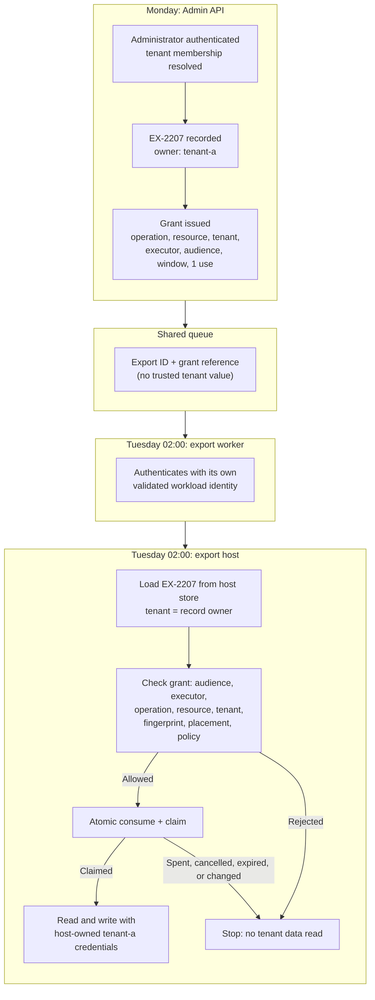

# Can One Worker Safely Execute Delayed Operations for Many Tenants?

**Pattern classification:** General learning material

**Difficulty:** Intermediate

**Prerequisites:** No formal prerequisites. Familiarity with multi-tenant applications, background workers, and access tokens in .NET is helpful, but no AsiBackbone package, identity provider, token format, or prior Learning material is required.

**What this article covers:** what actually stops one tenant's delayed operation from reaching another tenant's data when a single shared worker executes work for all of them, why a tenant check prevents substitution but does not contain a compromised worker, how to identify a workload unambiguously across issuers and directories, how ASP.NET Core claim mapping affects that identity, when separate identities, credentials, permissions, or execution partitions are worth their cost, what tenant-bound token exchange does and does not add, and when one shared worker with ordinary tenant checks is the right design.

Most multi-tenant products run background work the same way. Requests from every tenant land on one queue. One worker deployment, with one identity, picks them up and does the work later:

```text
Tenant A request ─┐
Tenant B request ─┼→ shared queue → shared worker → protected host → tenant data
Tenant C request ─┘
```

The usual safety check is one line at the place where the work happens:

```csharp
if (grant.TenantId != export.TenantId)
    return ExecutionResult.Rejected("grant.tenant-mismatch");
```

That check is worth having. The question this article answers is what it protects against, and what it does not.

> **Matching the grant tenant to the resource tenant prevents cross-tenant substitution, but it does not contain a compromised worker that is legitimately authorized for every tenant. Stronger compromise isolation requires separately enforced identities, credentials, permissions, or execution partitions that the worker cannot choose or forge.**

The opposite mistake matters as much. Most products do not need a worker per tenant, and building one by default buys operational cost for isolation the threat model may never require. Near the end, this article covers when one shared worker with ordinary tenant checks is sufficient and preferable.

---

## The Example: A Delayed Customer-Data Export

The rest of the article uses one operation.

A software-as-a-service product stores customer records for a few hundred business tenants. On Monday afternoon, an administrator at `tenant-a` requests export `EX-2207`: every customer record, including contact details and notes, as an encrypted file. Exports are heavy, so they run overnight. `EX-2207` is scheduled for 02:00 UTC on Tuesday and will be written to `tenant-a`'s own export store, where the administrator can download it.

The system has four parts:

- The **Admin API**, where the tenant administrator signs in and requests the export.
- A **shared queue** carrying scheduled exports for every tenant.
- The **export worker**, one deployment that processes due exports for all tenants.
- The **export host**, a service in the data tier that owns the record stores and the per-tenant export stores. It is the only component that can read a tenant's records in bulk and write an export file.

At 02:00, the worker picks up `EX-2207` and asks the export host to generate it.

The sensitive outcome is easy to name: `tenant-a`'s records ending up anywhere other than `tenant-a`'s export store, or `tenant-b`'s records ending up in `tenant-a`'s file. The rest of this article is about which design choices prevent which version of that outcome.

---

## Six Responsibilities in One Delayed Export

A multi-tenant export involves six things that are easy to collapse into one tenant field. Naming them separately makes it possible to say which one each check protects.

| Responsibility | In the example | Question it answers |
| --- | --- | --- |
| **Actor and tenant context** | The administrator, authenticated by the Admin API, acting in `tenant-a` | Who asked, in which tenant, and were they allowed to request this export **then**? |
| **Accepted operation and tenant-bound resource** | Export `EX-2207`: owned by `tenant-a`, full customer dataset, encrypted, destination `tenant-a`'s export store | What exactly was accepted, and which tenant owns it? |
| **Execution grant** | Authority to generate `EX-2207` only, at the export host only, by the export worker only, between 02:00 and 06:00 UTC, once | What may the later executor do with this one accepted operation? |
| **Workload identity** | The export worker, authenticated by a validated token or certificate issued to it | Which component is presenting the grant? |
| **Protected host** | The export host | Do the grant, the caller, the authoritative export record, and current tenant policy all permit this side effect **now**? |
| **Isolation boundary** | Optional: a partition-specific worker identity, credential, and permission set | If this worker is compromised, which tenants can it reach? |

The first five appear in any well-designed delayed operation; [How Short-Lived Execution Authority Differs from User Authorization](short-lived-execution-authority-vs-user-authorization.md) covers them for a single-tenant payout. The sixth is what multi-tenancy adds. It is also the one most often assumed to exist because a tenant identifier appears somewhere in the message.

---

## Three Controls That Are Easy to Merge

A single `tenantId` value often gets credited with three different jobs. They protect against different failures, are enforced in different places, and cost different amounts.

| Control | Question | What it stops | What it does not stop |
| --- | --- | --- | --- |
| **Cross-tenant substitution prevention** | Is this grant being used for a resource in the same tenant it was issued for? | `tenant-a`'s grant used to export `tenant-b`'s records, through a bug, a tampered message, or a mixed-up identifier | A caller that legitimately holds grants or standing permission for both tenants |
| **Workload authentication and authorization** | Is this caller the workload the grant was issued to, and is that workload allowed to perform this kind of operation? | A copied grant presented by another component; an unknown or unexpected caller | That workload acting maliciously within everything it is allowed to do |
| **Compromise isolation** | If this workload is compromised, which tenants can it reach? | An attacker in one partition's worker reaching tenants assigned elsewhere | Anything that partition's worker is legitimately allowed to do |

Each control is enforced at the protected host. Each depends on information the worker cannot change: the tenant comes from the host's own export record, the workload identity from transport authentication, and the partition assignment from configuration the host trusts.

A tenant field in the queue message provides none of the three by itself. It is a value the worker can read, and anything that can write to the queue can change.

---

## The Execution Path

The narrow design keeps each responsibility in its own place:

```text
tenant-scoped request accepted
    → exact operation and resource selected
    → issuer authorizes a tenant-bound execution grant
    → worker presents its validated workload identity and the grant
    → protected host resolves authoritative tenant/resource state
    → host validates tenant, audience, operation, freshness, and replay state
    → protected side effect
```

In the example:

1. On Monday, the Admin API authenticates the administrator, resolves their tenant membership from its own records, and authorizes the export request.
2. It records `EX-2207` with its owning tenant, dataset, format, destination, and schedule.
3. It issues a grant bound to operation `export.generate`, resource `EX-2207` and a fingerprint of the accepted export, tenant `tenant-a`, the worker's workload identity, audience `export-host`, the 02:00–06:00 window, and one use.
4. The queue message carries the export ID and a grant reference. It carries no credential and no tenant value that anything downstream trusts.
5. At 02:00, the worker authenticates to the export host as itself and presents the grant reference for `EX-2207`.
6. The export host loads `EX-2207` from its own store, checks the grant against the caller and the record, checks current tenant policy, and consumes the grant atomically.
7. Using credentials it owns, the host reads `tenant-a`'s records and writes the encrypted file into `tenant-a`'s export store.

The same path, drawn across its trust boundaries:



In words: the Admin API decides on Monday and records the export with its owning tenant. The queue carries only references. On Tuesday the worker proves who it is and presents the grant. The export host takes the tenant from its own record, never from the worker, checks every binding including placement, consumes the grant, and only then reads `tenant-a`'s data with credentials the worker never holds. Any failed check stops the request before tenant data is read.

The grant's lifecycle, atomic consumption, and unknown-outcome handling work exactly as they do for a single tenant. The execution-authority article covers them in detail. The rest of this article concentrates on what changes when one worker serves many tenants.

---

## Where the Tenant Comes From

The most common multi-tenant defect in background work is not a missing check. It is a check that compares two values the worker supplied.

```csharp
// Unsafe: both sides of the comparison came from the message.
if (message.TenantId != grantClaims.TenantId) return Rejected("tenant-mismatch");
await tenantData.OpenAsync(message.TenantId);
```

If the tenant in the message decides which tenant's data the host opens, then whoever can write that field chooses the tenant. Signing the message proves who wrote it, not that its author was allowed to choose that tenant.

The safe pattern resolves the tenant from state the host owns, then compares the grant to that:

```csharp
public sealed record WorkloadIdentity(string Issuer, string DirectoryTenantId, string PrincipalId);

public sealed record ExecutionGrant(
    string GrantId,
    string Operation,            // "export.generate"
    string ResourceId,           // "EX-2207"
    string ResourceFingerprint,  // canonical, versioned hash of the accepted export, including its owning tenant
    string TenantId,             // "tenant-a": the application tenant that owns the resource
    WorkloadIdentity Executor,   // structured, compared field by field
    string Audience,             // "export-host"
    DateTimeOffset NotBefore,
    DateTimeOffset ExpiresAt,
    int MaxUses,                 // 1
    string DecisionId);

public sealed class ExportExecutionHost(
    IGrantStore grants,
    IExportStore exports,
    ITenantPlacement placement,
    ITenantExportPolicy policy,
    ITenantDataAccess tenantData,
    TimeProvider clock)
{
    private const string Audience = "export-host";

    public async Task<ExecutionResult> GenerateAsync(
        WorkloadIdentity caller,   // established by transport authentication, never read from the message
        string grantId,
        string exportId,
        CancellationToken cancellationToken)
    {
        ExecutionGrant? grant = await grants.FindAsync(grantId, cancellationToken);
        if (grant is null)
            return ExecutionResult.Rejected("grant.unknown");

        // Is this grant meant for this host, this caller, this operation, and this export?
        if (grant.Audience != Audience)
            return ExecutionResult.Rejected("grant.wrong-audience");
        if (grant.Executor != caller)
            return ExecutionResult.Rejected("grant.wrong-executor");
        if (grant.Operation != "export.generate" || grant.ResourceId != exportId)
            return ExecutionResult.Rejected("grant.scope-mismatch");

        // An early rejection only; the window is enforced again in the atomic consume below.
        DateTimeOffset now = clock.GetUtcNow();
        if (now < grant.NotBefore || now >= grant.ExpiresAt)
            return ExecutionResult.Rejected("grant.outside-window");

        // Authoritative tenant: the owner recorded on the export the host itself stores.
        ExportRequest? export = await exports.FindAsync(exportId, cancellationToken);
        if (export is null || export.Status != ExportStatus.Scheduled)
            return ExecutionResult.Rejected("export.not-executable");

        // Substitution prevention: this grant was issued for this tenant's export, unchanged.
        if (grant.TenantId != export.TenantId)
            return ExecutionResult.Rejected("grant.tenant-mismatch");
        if (ExportFingerprint.Compute(export) != grant.ResourceFingerprint)
            return ExecutionResult.Rejected("export.changed-since-authorization");

        // Compromise isolation: is this workload assigned to execute for this tenant at all?
        // Meaningful only when partitions have genuinely separate identities and credentials.
        if (!await placement.IsAssignedAsync(caller, export.TenantId, cancellationToken))
            return ExecutionResult.Rejected("executor.not-assigned-to-tenant");

        // Current tenant policy: tenant active, exports enabled, destination still approved.
        PolicyResult current = await policy.EvaluateAsync(export, grant, cancellationToken);
        if (!current.Allowed)
            return ExecutionResult.Rejected(current.Reason);

        // Consume the grant and claim the export in one transaction, as in the single-tenant design.
        ClaimResult claim = await grants.TryConsumeAndClaimAsync(
            grant.GrantId, export.Id, expectedVersion: export.Version, cancellationToken);
        if (claim != ClaimResult.Claimed)
            return ExecutionResult.Rejected("grant.not-claimable");

        // Host-owned credentials, selected by the authoritative tenant. The worker never holds them.
        await using ITenantDataSession data = await tenantData.OpenAsync(export.TenantId, cancellationToken);
        return await data.WriteEncryptedExportAsync(export, cancellationToken);
    }
}
```

A few points carry most of the weight.

**Every tenant value the host acts on comes from the host's own record.** `export.TenantId` decides which tenant's data is opened. The grant's tenant is compared to it, never substituted for it. The caller supplies only an export ID and a grant reference, both of which the host looks up.

**The tenant is also inside the fingerprint.** Including the owning tenant in the fingerprint of the accepted export means a record moved between tenants after Monday no longer matches. The explicit comparison is there so the rejection reason says what happened.

**The grant check and the placement check answer different questions.** The tenant comparison says the grant belongs to this export. The placement check says this workload is allowed to act for this tenant at all. In a single shared deployment, every tenant is placed on the one worker identity, so the placement check passes for everyone and adds nothing. That is fine. It becomes a boundary only when partitions really exist, which the next sections cover.

**A valid, tenant-bound grant does not replace the host's tenant enforcement.** However the grant was issued, and however narrowly, the host still resolves the tenant itself and opens only that tenant's data. A grant that is correct about the tenant is evidence. The host's own resolution is enforcement.

**The sketch is illustrative.** It omits evidence recording, the execution-attempt record, and unknown-outcome reconciliation. The execution-authority article's host sketch shows those parts for a payout; they apply unchanged here.

---

## Why Tenant Equality Does Not Contain a Compromised Worker

Suppose an attacker gains code execution inside the shared export worker, perhaps through a vulnerable dependency or, in a worker that also parses tenant-uploaded files, through a crafted file supplied by one tenant.

The tenant check does exactly what it promises. The attacker cannot take `tenant-a`'s grant and point it at `tenant-b`'s export. The host loads `tenant-b`'s export, sees that the grant was issued for `tenant-a`, and rejects it.

The attacker does not need to do that. The compromised worker is the legitimate executor for every tenant. It already receives grant references for `tenant-b`'s exports, for `tenant-c`'s, and for everyone else's, because that is its job. When it presents `tenant-b`'s grant for `tenant-b`'s export, every check passes: right audience, right executor, right operation, right resource, right tenant. Substitution prevention was never designed to stop that.

What the attacker can reach depends on what the worker holds, not on the tenant check:

| Design | A compromised shared worker can reach |
| --- | --- |
| The worker holds standing data credentials, such as a connection string to the shared record store or a key for every tenant's storage | Every tenant's data directly. The export host and its checks are never consulted. |
| Host-owned execution, but the host authorizes any export when the worker's identity calls | Any export for any tenant, chosen by the attacker. |
| Host-owned execution, one shared worker identity, tenant-bound grants enforced at the host | The operations whose grants pass through it for as long as it remains compromised, within each grant's bindings, for every tenant. It cannot retarget a grant to another tenant or another destination. |
| As above, with separately enforced partition identities, credentials, and placement | Only the tenants assigned to the compromised partition. |
| As above, with dedicated per-tenant execution | One tenant. |

The first row is the most common in practice and the most important to notice. If the worker reads tenant data itself, with a credential that works for every tenant, then no tenant check anywhere else contains a compromise of that worker. Moving the data access behind a host that resolves the tenant itself, so the worker never holds data credentials, is often the largest single improvement available, and it does not require any partitioning.

The third row is a reasonable stopping point for many products. The worker can still misuse every grant that flows through it, which may include delivering or disclosing the results of legitimate operations, but it cannot invent new operations, choose new destinations, or reach tenants' data outside accepted, granted work. Whether that residual exposure is acceptable is a threat-model and contractual question, not a coding one.

Getting below the third row requires that the authority to act for different tenants be held by different things the worker cannot borrow: separate identities, issued separately; separate credentials, stored and rotated separately; separate permissions, configured at the resource or host; or separate execution partitions with all three. A tenant value cannot do this, because the compromised worker can write any tenant value it likes.

---

## Identifying the Worker Unambiguously

Every check above compares the caller to something: the grant's executor, the placement map, the permissions at the host. Those comparisons are only as good as the identity being compared.

### Identifiers Answer Different Questions

Identity providers issue several identifiers that look interchangeable and are not. Microsoft Entra ID is a useful illustration because its identifiers are well documented and commonly confused. The [access token claims reference](https://learn.microsoft.com/entra/identity-platform/access-token-claims-reference) and the description of [application and service principal objects](https://learn.microsoft.com/entra/identity-platform/app-objects-and-service-principals) are the authoritative sources.

| Identifier | Entra claim | What it identifies | Why it is not enough alone |
| --- | --- | --- | --- |
| **Issuer** | `iss` | The token service that issued the token, which for Entra also encodes the directory tenant | It says who vouches for the identity, not which principal it is. |
| **Directory tenant** | `tid` | The Entra directory in which the token was issued | It is a directory, shared by every principal in it. |
| **Principal object ID** | `oid` | The principal within that directory: for a workload, its service principal or managed identity | Object IDs are directory-local. The same application has a different service principal object ID in each directory where it exists. |
| **Application (client) ID** | `azp` in v2.0 tokens, `appid` in v1.0 | The application registration that requested the token | One multi-tenant registration has the same client ID in every directory, with a separate service principal and separately granted permissions in each. A client ID says which application, not which directory's permissions applied. |
| **Subject** | `sub` | The principal, as a pairwise value unique to the receiving application | Useful within one application and issuer; not intended as a cross-application key. |

Microsoft's documentation recommends `tid` and `oid` together when a user's identity must be shared across services, because every application receives the same pair for a user acting in a tenant. Because `oid` also identifies service principals, and is directory-local, the same pair is a natural key for a particular workload principal in a particular directory. Combined with the validated issuer, this article represents that as a structured identity of **issuer, directory tenant, principal object ID**.

Other environments use other shapes. A [SPIFFE ID](https://spiffe.io/docs/latest/spiffe-about/spiffe-concepts/) is a URI naming a workload within a trust domain, so the trust domain and the path together identify it. A Kubernetes service account token pairs an issuer with a subject that names the namespace and the service account. The general rule holds in each: **identify a workload by its validated issuer plus the identifier that issuer guarantees to be unique within its scope**, and compare those fields together.

### Two Meanings of "Tenant"

The word tenant now means two different things in the same system, and conflating them is a real defect.

- The **application tenant**, `tenant-a`, is your customer. Your application owns that concept and records it on `EX-2207`.
- The **directory tenant**, Entra's `tid`, is the identity directory in which a token was issued. Your worker's identity typically lives in your own directory, not in your customers' directories.

The export worker's token will carry your directory's `tid` for every export, whichever customer the export belongs to. That value says nothing about whether the worker may act for `tenant-a`. Never compare a token's directory tenant to an application tenant unless your design deliberately maps one to the other, for example when each customer has its own directory and the worker acts inside it.

That second case is where the client-ID distinction bites. If one multi-tenant application registration has service principals in several customer directories, each service principal has its own object ID and its own permissions, but credentials registered on the application can potentially be used to request tokens in any of those directories, subject to each directory's consent, permissions, and token-issuance policies. A per-directory identity therefore does not imply a per-directory credential. That matters for compromise isolation, discussed below.

### Compare Structured Identities, Not Strings

Represent the validated identity as a value with named fields, as `WorkloadIdentity` does in the sketch, and compare all of them. If you must store or transmit it as a single string, use one canonical, versioned encoding that cannot be ambiguous, such as length-prefixed fields, rather than joining values with a separator that could appear inside one of them.

Do not use display names, application names, or client IDs as the executor binding. Two workloads can share a display name. Two deployments of the same application share a client ID. Neither tells the host which principal, in which directory, presented the grant.

### Claim Mapping in ASP.NET Core

How the host derives `WorkloadIdentity` from a validated token is part of the security boundary, and ASP.NET Core's defaults do not help as much as they appear to.

By default, the JWT bearer handler maps some inbound claim types to longer URI-style names. `sub`, for example, becomes `ClaimTypes.NameIdentifier`, and Entra's `oid` and `tid` become `http://schemas.microsoft.com/identity/claims/objectidentifier` and `http://schemas.microsoft.com/identity/claims/tenantid`. Code written against `"oid"` then finds nothing, and code written against the long names silently stops working if mapping is later disabled. Setting [`JwtBearerOptions.MapInboundClaims`](https://learn.microsoft.com/dotnet/api/microsoft.aspnetcore.authentication.jwtbearer.jwtbeareroptions.mapinboundclaims) to `false` keeps the issuer's claim names, which makes the mapping explicit and reviewable. Microsoft's guide to [mapping, customizing, and transforming claims](https://learn.microsoft.com/aspnet/core/security/authentication/claims) describes the defaults.

Derive the identity once, at the point where the token has just been validated and before any application claims transformation runs. For JWT bearer authentication, that is the scheme's `JwtBearerEvents.OnTokenValidated` event, or an equivalent validated-token stage for another handler. Store the result, for example in `HttpContext.Features`, and use only that derived value for execution checks:

```csharp
public static class WorkloadIdentityReader
{
    // Claim names as issued by Microsoft Entra ID with MapInboundClaims = false.
    // Each trusted issuer needs its own explicit mapping; never guess or fall back.
    private const string IssuerClaim = "iss";
    private const string DirectoryTenantClaim = "tid";
    private const string PrincipalClaim = "oid";
    // idtyp is optional in Entra and must be explicitly configured for this API's access tokens.
    // This reader requires it, so a token without it is rejected: fail-closed by design.
    private const string TokenTypeClaim = "idtyp";

    // Called from JwtBearerEvents.OnTokenValidated with the just-validated identity,
    // before IClaimsTransformation can add or change claims.
    public static WorkloadIdentityResult Read(ClaimsIdentity validated, ITrustedWorkloadIssuers trusted)
    {
        if (!TryGetSingle(validated, IssuerClaim, out string? issuer, out string? error) ||
            !TryGetSingle(validated, DirectoryTenantClaim, out string? directoryTenantId, out error) ||
            !TryGetSingle(validated, PrincipalClaim, out string? principalId, out error) ||
            !TryGetSingle(validated, TokenTypeClaim, out string? tokenType, out error))
        {
            return WorkloadIdentityResult.Rejected(error);
        }

        // A workload endpoint should not accept a token that represents a signed-in user.
        if (tokenType != "app")
            return WorkloadIdentityResult.Rejected("identity.not-app-only");

        // For an issuer that embeds the directory, confirm the issuer and the tenant claim agree,
        // and that this issuer is trusted for workloads in this directory at all.
        if (!trusted.IsTrusted(issuer, directoryTenantId))
            return WorkloadIdentityResult.Rejected("identity.untrusted-issuer-or-directory");

        return WorkloadIdentityResult.Accepted(new WorkloadIdentity(issuer, directoryTenantId, principalId));
    }

    private static bool TryGetSingle(
        ClaimsIdentity identity,
        string claimType,
        [NotNullWhen(true)] out string? value,
        [NotNullWhen(false)] out string? error)
    {
        Claim[] claims = identity.FindAll(claimType).ToArray();
        value = null;
        error = null;

        if (claims.Length == 0)
        {
            error = $"identity.missing-claim:{claimType}";
            return false;
        }

        if (claims.Length > 1)
        {
            error = $"identity.ambiguous-claim:{claimType}";
            return false;
        }

        if (string.IsNullOrWhiteSpace(claims[0].Value))
        {
            error = $"identity.empty-claim:{claimType}";
            return false;
        }

        value = claims[0].Value;
        return true;
    }
}
```

Three habits matter more than the exact code.

**Reject missing and conflicting claims instead of falling back.** `ClaimsPrincipal.FindFirst` returns the first match and ignores any others, and a fallback such as "use `oid`, or `sub` if it is missing" turns a malformed or unexpected token into a different identity. If a required identity claim is missing, repeated, or empty, the request is rejected.

**Derive the identity before claims transformation, not from a principal that other code has modified.** `HttpContext.User` can combine several identities and can be extended by `IClaimsTransformation` implementations. A transformation that adds a tenant or object-ID claim for convenience can create exactly the duplicate or conflicting value the host is trying to detect. Calling `AuthenticateAsync` again does not avoid this, because the authentication service applies `IClaimsTransformation` on each authentication call. Derive the workload identity in the scheme's validated-token stage, preserve it, and have execution checks consume that preserved value rather than reconstructing it from the application principal.

**Map each issuer deliberately.** If the host trusts workloads from more than one issuer, each issuer gets its own mapping and its own uniqueness guarantee. `iss` plus `sub` from one issuer and `iss` plus `oid` from another are both valid identities; mixing their fields is not.

The `idtyp` claim is Entra-specific and is not present unless the API's application registration is configured to emit it as an optional claim. A standard Entra access token will not necessarily carry it, which is why the reader treats its absence as a rejection rather than a default. With another issuer, use whatever that issuer documents for distinguishing workload tokens from user tokens, or authenticate workloads through a separate mechanism such as mutual TLS, so a user token cannot reach the workload endpoint at all.

---

## Options for Isolating Tenants From a Compromised Worker

There are four common arrangements, and they compose. Each assumes the host-owned execution and host-side tenant resolution described above.

### One Shared Worker With Ordinary Tenant Checks

One worker deployment, one workload identity, every tenant placed on it. The host enforces audience, executor, operation, resource, tenant, freshness, and replay for every grant.

This prevents cross-tenant substitution and keeps data credentials out of the worker. A compromise of the worker reaches the operations of every tenant whose work flows through it. It is the simplest design to operate, and for many products it is the right one.

### Partitioned Workers With Separately Enforced Identities

The same code runs as several deployments, each serving a defined set of tenants: a region, a tier, or a fixed group. Each partition has its own workload identity, its own credential, and its own permissions at the host. A placement map, owned by the control plane and trusted by the host, says which partition identity may act for which tenant. The grant issuer binds each grant to the partition identity for its tenant, and the host's placement check rejects any other.

A compromise of one partition's worker reaches only that partition's tenants, because the other partitions' identities and credentials are not available to it and the host will not accept its identity for their tenants.

### Dedicated Per-Tenant Execution

The limiting case of partitioning: one partition per tenant. This is usually justified only for tenants with contractual isolation requirements, dedicated infrastructure, or sensitivity that differs sharply from everyone else's. Many products offer it as a separate tier rather than a default.

### Adding Tenant-Bound Token Exchange

An optional control that can be added to any of the arrangements above. Instead of the host accepting the worker's own identity directly, the worker exchanges its identity and the grant for a short-lived credential bound to the export's tenant, and the host accepts only that credential for tenant data operations. This is covered in more detail in its own section below.

On its own, token exchange reduces standing authority: the worker holds no reusable credential for any tenant between operations. It does not isolate tenants from a compromised shared worker, which can still exchange every grant it receives. Combined with partitioning, it narrows each partition's authority further.

### Comparing the Options

| Dimension | Shared worker, tenant checks | Partitioned identities | Per-tenant execution | Adding tenant-bound token exchange |
| --- | --- | --- | --- | --- |
| **Cross-tenant substitution** | Prevented by host checks | Prevented by host checks | Prevented by host checks | Unchanged; still enforced by the host |
| **Worker-compromise reach** | Potentially every tenant it serves, limited to work and grants it can obtain while compromised | One partition | One tenant | Unchanged for a shared worker; narrower standing authority |
| **Identity model** | One structured workload identity | One per partition, issued separately | One per tenant | Adds an issued, tenant-bound credential per operation |
| **Credentials** | One | One per partition, stored and rotated separately | One per tenant | Short-lived, issued by the exchange service |
| **Where the tenant decision lives** | Host, from its records | Host, plus placement map | Host, plus deployment topology | Exchange service and host, both from authoritative state |
| **Throughput and capacity** | Pooled; simplest to scale | Fragmented across partitions | Highly fragmented | Adds one call per operation |
| **Failure recovery** | One deployment to restore; affects every tenant | A partition outage affects only its tenants; no spillover without an explicit exception | Per-tenant | Exchange service becomes a dependency to fail closed on |
| **Operational cost** | Lowest | Moderate | Highest | Moderate |

---

## Separate Names Are Not Separate Boundaries

Partitioning is often done on paper. Three workers called `export-worker-eu`, `export-worker-us`, and `export-worker-apac` look partitioned. Whether they are depends on what sits behind the names.

They are **not** isolated from each other if:

- They authenticate with the same client secret or certificate, even under different configuration labels. Whoever holds that credential can be any of them.
- They share one managed identity or service account attached to all three deployments.
- They have different identities, but the host grants every one of those identities permission for every tenant.
- The partition name, or the tenant-to-partition assignment, comes from the worker's own configuration or from the message, rather than from a placement map the host trusts.
- One multi-tenant application registration has a service principal per customer directory, and the workers use credentials registered on the application itself, which can potentially request tokens in every one of those directories, subject to each directory's consent and policies.

They are isolated only when each partition's credential is distinct and stored where the other partitions cannot read it, each partition's identity is issued separately, and the host or resource grants each identity permission only for its own tenants.

A regional worker name also says nothing, by itself, about where data is stored, processed, replicated, logged, backed up, or accessible to operators. Running `export-worker-eu` does not establish that a tenant's data stays in a region or satisfies any data-residency or data-sovereignty obligation. Those depend on the actual data flows, storage locations, sub-processors, and legal requirements involved, and they need their own assessment. A regional partition can be one input to that assessment. It is not evidence of compliance.

---

## Tenant-Bound Token Exchange: Who Chooses the Tenant?

[OAuth 2.0 Token Exchange (RFC 8693)](https://www.rfc-editor.org/rfc/rfc8693.html) lets a client present a token it holds and request a new token for a target `audience`, `resource`, or `scope`. A security token service decides what to issue. RFC 8693 does not define tenants; binding a token to a tenant is a policy of the token service.

In the example, a tenant-bound exchange looks like this:

```text
Worker authenticates to the token service with its own workload identity
    → presents the grant reference for EX-2207
Token service
    → loads EX-2207 and its grant from authoritative state
    → confirms the caller is the grant's executor and the grant is usable
    → determines the tenant from the export record: tenant-a
    → issues a token: audience export-host, tenant tenant-a, operation export.generate,
      resource EX-2207, lifetime of minutes
Worker
    → presents that token to the export host
Export host
    → validates the token
    → still resolves EX-2207's owner from its own record and requires tenant-a
```

Three rules keep this from becoming a new way to cross tenants.

**The issuer chooses the tenant, not the worker.** If the worker sends `resource=https://export-host/tenants/tenant-b` and the token service issues what was asked for, the exchange has become a service that hands out any tenant's authority to whoever asks. The token service must derive the tenant from the accepted operation and its grant, and treat any tenant the caller names as, at most, a value to compare.

**The host still enforces the tenant boundary.** A valid, tenant-bound token says the token service decided `tenant-a`. The export host still loads `EX-2207`, still confirms its owner is `tenant-a`, and still opens only `tenant-a`'s data. Accepting the token's tenant as the tenant to open would move the substitution risk from the queue to the token service.

**It is an addition, not a requirement.** Token exchange narrows how long and how broadly the worker holds authority. It adds a highly trusted service, another dependency to fail closed on, and per-operation latency. For a shared worker that already presents a narrow, host-validated grant and holds no data credentials, it adds relatively little. It earns its place when the protected resource can only accept tokens from your identity provider, when you want no standing worker credential for tenant resources at all, or when partitioned identities need short-lived, tenant-scoped credentials at the resource. The IETF [Transaction Tokens](https://datatracker.ietf.org/doc/draft-ietf-oauth-transaction-tokens/) draft explores a related approach for propagating context within a trusted domain.

---

## What Separate Execution Costs

Partitioning has real costs, and they should be counted before choosing it.

**Credential rotation multiplies.** Each partition has a credential to issue, store, rotate, and revoke. Platform-managed identities or federated workload credentials remove stored secrets, but each identity still needs its own permissions configured and reviewed.

**Capacity fragments.** A shared worker pool absorbs one tenant's month-end spike with capacity another tenant is not using. Partitions cannot borrow from each other without weakening isolation, so each needs its own headroom.

**Tenant moves become coordinated changes.** Moving a tenant between partitions changes the placement map. Grants issued to the old partition's identity will fail the placement check at the host after the move, which is the correct outcome. In-flight work must be drained, cancelled, or re-granted to the new partition rather than allowed through as an exception.

**Failure recovery is narrower and less flexible.** A partition outage affects only its tenants, which is a benefit. Failing its work over to another partition means letting another identity act for those tenants, which is exactly the boundary partitioning exists to keep. If failover is needed, make it an explicit, recorded, and time-limited change to the placement map, not an automatic retry under a different identity.

**Deployment and observability grow.** More deployments to patch, monitor, and keep at the same version. Partitions that drift apart in code or configuration undermine the assumption that they behave identically.

---

## When One Shared Worker Is Enough

For many products, one shared worker with ordinary tenant checks is not a compromise. It is the proportionate design. It is usually enough when:

- The worker holds no standing data credentials, and the protected host resolves the tenant from its own records and opens only that tenant's data.
- The host enforces audience, executor, operation, resource, tenant, freshness, and replay for every grant.
- Tenants share a similar trust tier and sensitivity, and none has a contractual or regulatory commitment to execution isolation.
- The worker has a modest attack surface. It orchestrates work rather than parsing complex, tenant-supplied content.
- The operations are ones whose worst-case misuse, across all tenants, the threat model already accepts, or they are reversible or rate-limited.

Partitioning becomes worth its cost when one of those stops being true: tenants with sharply different sensitivity, commitments to isolate a tenant or tier, a worker that processes untrusted tenant input and is therefore a plausible way for one tenant to attack another, or operations whose cross-tenant blast radius is unacceptable.

Even then, the order of improvements matters. Removing data credentials from the worker and enforcing the tenant at the host usually reduces cross-tenant exposure more than any amount of partitioning a worker that still holds a key to every tenant's data.

---

## Failure Modes

**1. Trusting a tenant value supplied by the worker.** If the message's tenant decides which data the host opens, whoever can write the message chooses the tenant. Resolve the tenant from the host's own record of the operation.

**2. Treating grant/resource tenant equality as compromise containment.** The check stops substitution. A compromised worker that is the legitimate executor for every tenant passes it for every tenant.

**3. Comparing an identifier without its issuer and scope.** An application ID, a service principal object ID, or a subject means something only together with the issuer and the scope in which it is unique. A client ID shared across directories, or a directory-local object ID compared across directories, identifies the wrong thing.

**4. Silently falling back when identity claims are missing or conflicting.** Using `sub` when `oid` is absent, taking the first of two values, or reading a claim added by a transformation turns an unexpected token into a different identity. Reject it.

**5. Giving nominally separate workers the same credentials and permissions.** Different names on one credential, one shared managed identity, or identical host permissions create no boundary.

**6. Claiming data sovereignty from a regional worker name.** Where a worker runs does not establish where data is stored, replicated, logged, or accessed, or whether any legal obligation is met.

**7. Letting the worker choose the tenant in token exchange.** A token service that issues whatever tenant the caller requests is a cross-tenant authority service. The issuer derives the tenant from the accepted operation.

**8. Accepting a valid tenant-bound credential without re-enforcing the tenant at the host.** The credential is evidence of the issuer's decision. The host still resolves the tenant and opens only that tenant's data.

**9. Building per-tenant execution where a shared worker is proportionate.** Partitioning by default adds credentials, capacity fragmentation, and coordinated tenant moves without reducing a risk the threat model actually requires reducing.

---

## A Short Review Checklist

**Tenant and resource**

1. Does the protected host resolve the owning tenant from its own record of the operation, never from the message or the caller?
2. Is the owning tenant part of the grant and of the accepted operation's fingerprint?
3. Does the host open data only for the tenant it resolved, using credentials the worker does not hold?

**Workload identity**

4. Is the executor identified by a validated, structured identity, such as issuer and subject, or issuer, directory tenant, and principal object ID, compared field by field or through one canonical encoding?
5. Are application or client IDs, directory-local object IDs, and display names used only for what they actually identify?
6. Is the directory tenant in a token kept distinct from the application tenant that owns the resource?
7. Is claim mapping explicit, and are missing, repeated, empty, or conflicting identity claims rejected rather than defaulted?
8. Is the identity derived from the authentication handler's validated result, not from a principal that transformations may have changed?

**Isolation**

9. Is the required compromise isolation written down: none beyond the shared worker, per partition, or per tenant?
10. If partitions exist, does each have a distinct credential, a separately issued identity, and host-side permissions limited to its tenants?
11. Is the tenant-to-partition placement owned by something the host trusts and the worker cannot change?
12. Are failover and tenant moves explicit placement changes rather than automatic retries under another identity?
13. Is any regional partition described as a deployment boundary only, not as evidence of data-residency or sovereignty compliance?

**Token exchange, if used**

14. Does the token service derive the tenant from the accepted operation rather than from the caller's request?
15. Does the protected host still enforce the tenant boundary after accepting the exchanged credential?

**Proportionality**

16. If one shared worker with host-side tenant checks and no worker-held data credentials satisfies the threat model, have you avoided adding per-tenant infrastructure?

---

## Continue Deeper

For the delayed-authority handoff this article builds on, including grant bindings, execution-time freshness, atomic consumption, one-time use versus idempotency, and unknown outcomes, read [How Short-Lived Execution Authority Differs from User Authorization](short-lived-execution-authority-vs-user-authorization.md).

For the full queue-and-worker lifecycle behind a delayed operation, including why queue delivery and worker identity are not operation authority, threat models such as a stolen worker credential, and invariant tests, work through [Capability-Scoped Background Operation](../../case-studies/capability-scoped-background-operation.md).

When the harder problem is which tenant and regional policies apply and how they compose, including resolving tenant and region from authoritative context and keeping tenant isolation ahead of permissive composition, continue with [Multi-Tenant and Regional Policy Overlay](../../case-studies/multi-tenant-and-regional-policy-overlay.md).

For caller-supplied versus authoritative context, credential ownership, and why broad credentials create authority tunnels across boundaries, read [Trust Boundaries and Least Privilege](../../security/trust-boundaries-and-least-privilege.md).

For the complete lifecycle of a scoped execution capability, including subject, audience, time, and policy scope and validation at the execution boundary, see [Scoped Capability and Host-Owned Execution](../../tutorials/scoped-capability-and-host-owned-execution.md).

### Related Work

These references address related aspects of the problem:

- [OAuth 2.0 Token Exchange (RFC 8693)](https://www.rfc-editor.org/rfc/rfc8693.html) standardizes exchanging one token for another targeted at a specific audience, resource, or scope, leaving the issuance decision to the token service's policy.
- The IETF OAuth working group's [Transaction Tokens](https://datatracker.ietf.org/doc/draft-ietf-oauth-transaction-tokens/) draft propagates workload and authorization context through a call chain inside a trusted domain using very short-lived tokens.
- [SPIFFE](https://spiffe.io/docs/latest/spiffe-about/spiffe-concepts/) defines a vendor-neutral workload identity as a URI within a trust domain, with platform-issued identity documents.
- Microsoft's [access token claims reference](https://learn.microsoft.com/entra/identity-platform/access-token-claims-reference) and [application and service principal objects](https://learn.microsoft.com/entra/identity-platform/app-objects-and-service-principals) describe the issuer, directory, object, client, and subject identifiers used as an illustration here.

None of these decides how many execution partitions a product needs or which tenants belong in each. Those remain threat-model and product decisions.

---

## The Short Answer

Yes, one worker can safely execute delayed operations for many tenants, if "safely" means that one tenant's operation cannot be turned into another tenant's. Resolve the tenant at the protected host from its own records, bind every grant to that tenant and to a validated, structured workload identity, keep data credentials out of the worker, and let the host open only the resolved tenant's data.

That design does not contain a compromise of the worker itself. A worker that is legitimately the executor for every tenant can act for every tenant if it is taken over. If your threat model needs a smaller blast radius, give partitions identities, credentials, and permissions that are genuinely separate, and let the host, not the worker, decide which partition may act for which tenant.

If your threat model does not need that, one shared worker with ordinary tenant checks is the simpler and better design.
