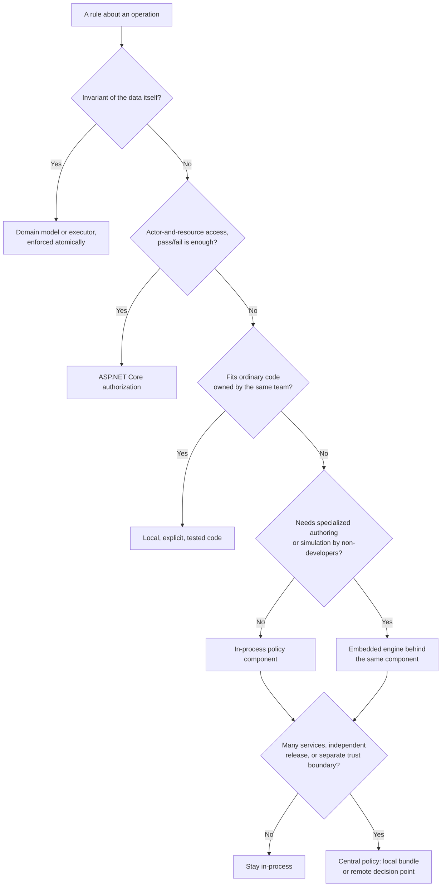

# Policy as Code in ASP.NET Core Without Overengineering

**Pattern classification:** General learning material

**Difficulty:** Intermediate

**Prerequisites:** Familiarity with C# and ASP.NET Core authorization is helpful. No AsiBackbone package, policy engine, or prior Learning material is required.

**Sample scope:** The code targets .NET 8 or later and C# 12. Stores, the approval workflow, the refund executor, and the test harness are illustrative interfaces, not a runnable sample; the snippets show where each responsibility lives, not a complete implementation.

**What this article covers:** what policy-as-code means in plain terms; five places a policy decision can live in an ASP.NET Core application, from ordinary code to a remote decision service; which pressures justify each step and what each step costs; how to handle latency, availability, caching, freshness, failure, and version provenance when evaluation is remote; what should stay outside the policy evaluator whatever you choose; and the failure modes that show up when policy placement is chosen as a maturity badge instead of for a reason.

A team's refund endpoint has grown a little at a time:

```csharp
if (user.IsInRole("SupportTier1") && request.Amount > 250) return Results.Forbid();
if (user.IsInRole("SupportTier2") && request.Amount > 1000) return Results.Forbid();
if (order.HasOpenChargeback) return Results.BadRequest("Chargeback open");
if ((DateTime.UtcNow - order.PurchasedAt).TotalDays > 90 && !request.AcknowledgedLateRefund)
    return Results.BadRequest("Acknowledge late refund");
```

Finance wants to change the tier limits next quarter. Risk wants high-risk customers held for review. Someone notices that an agent can simply send `"acknowledgedLateRefund": true` in the request body. In the design review, a proposal appears: *adopt policy-as-code*. It comes with a diagram showing a new policy service, a policy language, a deployment pipeline, and a sidecar.

That might be the right answer. More often, it is several steps further than the problem requires. The code above has real defects: rules scattered through an endpoint, results that erase the difference between "no" and "ask a supervisor," and a trusted fact supplied by the caller. None of those defects is caused by the rules living in the application's own process, and none of them is fixed by moving the rules somewhere else.

**The short version.** Policy-as-code means decision logic you can point to, read, review, test, and identify by version. It does not mean a particular engine, language, or deployment topology. In an ASP.NET Core application, the usual progression is ordinary code, then framework authorization for actor-and-resource access, then a dedicated in-process policy component with a trusted context and explicit outcomes. An embedded engine and a remote decision service are real options, each justified by specific pressures, such as rule authors who are not developers, many services that must enforce the same rules, or a policy owner in a separate trust boundary.

> Policy-as-code is a way to make decision logic explicit, reviewable, and testable, not a requirement to adopt a separate engine or remote service. Choose the smallest policy boundary that satisfies the system's real change, reuse, trust, and operational needs.

## What Policy-as-Code Actually Means

Strip away the tooling and policy-as-code has four properties:

| Property | What it means in practice |
| --- | --- |
| **Explicit** | The decision lives in one identifiable place, with named inputs and named outcomes, not in a scatter of `if` statements across endpoints. |
| **Reviewable** | The rules are in source control, changes go through review, and a diff shows what changed in the decision, not only in the plumbing around it. |
| **Testable** | Given the same inputs, the decision is deterministic, and the rules can be exercised directly, without an HTTP request, a database, or a live service. |
| **Identifiable** | You can say which version of the policy produced a decision, and you can keep that alongside the decision when it matters later. |

A C# class in your web project can have all four. A rule in a sophisticated engine can have none of them if it is edited in production through an admin screen with no history and no tests.

Much published policy-as-code material is about infrastructure: admission control for clusters, cloud resource guardrails, deployment gates. Those systems and an ASP.NET Core refund endpoint share the four properties above and almost none of the topology. This article is about application decisions, where the policy usually runs next to the code that acts on it.

The useful question is therefore not "Do we have policy-as-code yet?" but "Which of these properties is missing, and what is the smallest change that adds it?" The opening example is missing *explicit* and *testable*. Neither requires a new runtime.

## The Example: Refunds in a Support Application

Every option below is applied to one operation. A support agent issues a refund on a customer's order through `POST /orders/{orderId}/refunds`. The current rules, owned by the finance operations team, are:

- Only agents with the refund permission, assigned to the order's region, may issue refunds on it.
- A refund may not exceed what is still refundable on the order.
- Tier 1 agents may refund up to 250, and tier 2 agents up to 1,000, in the store's settlement currency. Larger refunds need a supervisor's approval for that exact refund.
- Orders with an open chargeback may not be refunded.
- Refunds for customers the risk service rates as high risk are escalated to the risk team, whatever the amount.
- Refunds requested more than 90 days after purchase require the agent to acknowledge a late-refund notice first.

That list contains three kinds of rule:

1. **Access control.** *May this agent act on this order?* That is actor-and-resource authorization.
2. **A domain invariant.** *A refund may not exceed the refundable balance.* That is true regardless of who asks or what finance decides next quarter. It belongs to the order, not to a policy.
3. **An operational decision with more than two outcomes.** Allowed; denied; needs a supervisor's approval; needs the risk team; needs an acknowledgment; or cannot be decided right now because a fact is missing.

Many policy-as-code discussions go wrong by treating all three as one thing called "policy" and choosing one place for all of them. The design gets simpler once they are separated.

## Five Places a Policy Decision Can Live

The options below are ordered by how much new machinery they introduce, not by how good they are. Every one of them is the right answer for some systems.

### 1. Ordinary application code

If the only rule were "tier 1 agents may refund up to 250," a well-named method in the application service is a complete, respectable implementation:

```csharp
public sealed class RefundService(IOrderStore orders, IRefundExecutor executor)
{
    // Refund limits by agent tier. Owned by finance operations; see ADR-014.
    private static decimal LimitFor(AgentTier tier) => tier switch
    {
        AgentTier.Tier1 => 250m,
        AgentTier.Tier2 => 1_000m,
        _ => 0m,
    };

    public async Task<RefundResult> RefundAsync(Agent agent, string orderId, decimal amount, CancellationToken ct)
    {
        var order = await orders.GetAsync(orderId, ct);

        if (amount > LimitFor(agent.Tier))
        {
            return RefundResult.OverAgentLimit;
        }

        return await executor.RefundAsync(order, amount, ct);
    }
}
```

The rule is in one place, reviewed in pull requests, and testable with a unit test. It changes when the application changes, which is fine because the same team owns both. That is policy-as-code in every sense that matters.

The domain invariant belongs even closer to the data. `Order.RefundableBalance`, enforced by the executor inside the same transaction that records the refund, is not a policy decision and should not move into a policy component. Policy can change on Tuesday; "you cannot refund money you never captured" cannot.

**Stay here when** the rules are few, local, owned by the application team, and answered with success or an ordinary application error. [When a Simple Application Service Is Enough](../../architecture/when-a-simple-application-service-is-enough.md) explores this boundary in depth.

### 2. ASP.NET Core authorization policies and handlers

The first rule, "agents with the refund permission, assigned to the order's region," is access control, and ASP.NET Core has a well-designed home for it.

A quick refresher if you have mostly used `[Authorize(Roles = "...")]`: a *requirement* names what must be true, a *handler* decides whether the current user meets it, and a *resource-based* handler also receives the object being acted on. Because the resource usually has to be loaded first, resource-based checks are invoked from code through `IAuthorizationService.AuthorizeAsync(user, resource, policyName)` rather than by an attribute. Microsoft's [resource-based authorization](https://learn.microsoft.com/aspnet/core/security/authorization/resourcebased) guide covers the details.

```csharp
public sealed class RefundOrderRequirement : IAuthorizationRequirement;

public sealed class RefundOrderHandler : AuthorizationHandler<RefundOrderRequirement, Order>
{
    protected override Task HandleRequirementAsync(
        AuthorizationHandlerContext context,
        RefundOrderRequirement requirement,
        Order order)
    {
        if (context.User.HasClaim("permission", "orders.refund")
            && context.User.HasClaim("region", order.Region))
        {
            context.Succeed(requirement);
        }

        return Task.CompletedTask;
    }
}

builder.Services.AddAuthorizationBuilder()
    .AddPolicy("Orders.Refund", policy => policy
        .RequireAuthenticatedUser()
        .AddRequirements(new RefundOrderRequirement()));

builder.Services.AddSingleton<IAuthorizationHandler, RefundOrderHandler>();
```

This is policy-as-code too. The rule has a name, a single implementation, framework integration, and it is easy to test by constructing an `AuthorizationHandlerContext`. The endpoint loads the order from its own store and passes it in, so the region comes from the server's copy of the order, not from the request.

In this example the handler decides over the principal and an already-loaded resource, and nothing else. That is a design choice, not a framework limit. Handlers are resolved from dependency injection and can use repositories or services, registered with a matching lifetime; a handler that uses a scoped `DbContext` must not be a singleton. External lookups are legitimate, but each one adds latency, a failure the framework will surface as "not authorized" or an exception, and a lifetime to manage.

The stronger reason to stop here is semantic. Authorization answers *may this actor do this to this resource*, and its result is succeed or fail. The refund rules about tier limits, risk escalation, and late-refund notices produce outcomes such as "ask a supervisor" or "acknowledge first." Forcing those into `Succeed` and `Fail` either loses them or smuggles them through failure reasons that the rest of the application has to parse.

**Stay here when** the question is fundamentally actor-and-resource access and pass or fail is a complete answer. For most access-control rules in most applications, this is not a stepping stone to something better; it is the destination. [When ASP.NET Core Authorization Is Enough](../../architecture/when-aspnet-core-authorization-is-enough.md) explains why.

### 3. A dedicated in-process policy component

The remaining refund rules have outgrown both an inline method and an authorization handler. They have more than two outcomes, they read facts from several places, finance will change them on its own schedule, and support leads will ask "why was this refund held?" The next step is still in-process: a small, explicit boundary with a context, an evaluator, and a decision.

```csharp
public enum RefundOutcome
{
    Allowed,
    Denied,
    AcknowledgmentRequired,     // the same agent must acknowledge a notice
    ApprovalRequired,           // a supervisor must approve this exact refund
    EscalationRecommended,      // route to another team; they decide, not the agent
    Unavailable,                // a needed fact was missing or unusable; nothing was decided
}

public sealed record RefundDecision(RefundOutcome Outcome, string ReasonCode, string? PolicyVersion)
{
    // Without a version: no policy ran, for example because a fact was missing.
    // With a version: that policy ran, but its answer could not be used.
    public static RefundDecision Unavailable(string reasonCode, string? policyVersion = null) =>
        new(RefundOutcome.Unavailable, reasonCode, policyVersion);
}

public sealed record RefundPolicyContext(
    // Operation parameters: what the agent asked for, validated by the host.
    Guid OperationId,
    decimal Amount,                     // settlement currency; already checked against the refundable balance

    // Authoritative facts: resolved by the host from trusted sources, never from the request body.
    AgentTier AgentTier,
    TimeSpan SincePurchase,             // elapsed time, computed from the host's clock
    bool HasOpenChargeback,
    RiskBand CustomerRisk,
    bool LateRefundAcknowledged,        // true only if an acknowledgment is recorded for this OperationId
    VerifiedApproval? SupervisorApproval);

// Produced by the host only after it has checked that the approval is current, unconsumed,
// unrevoked, given by an eligible supervisor who is not the requester, and bound to this operation.
public sealed record VerifiedApproval(Guid OperationId, decimal ApprovedAmount, string ApproverId);

public interface IRefundPolicy
{
    RefundDecision Evaluate(RefundPolicyContext context);
}
```

The context separates two kinds of input on purpose. The *amount* and the *operation ID* legitimately come from the caller; they describe what is being requested, and the host validates them. The client generates the operation ID, typically a random UUID, once per intended refund and reuses it on every retry. Everything below those two fields is a fact the policy relies on, and the host resolves each one itself. That includes currency: the host converts the amount to the settlement currency, or rejects it, before building the context, so the policy compares like with like.

The evaluator is a pure function of its context:

```csharp
public sealed class RefundPolicy : IRefundPolicy
{
    public const string Version = "refund-policy/2026-09";

    private static readonly TimeSpan LateRefundAfter = TimeSpan.FromDays(90);

    public RefundDecision Evaluate(RefundPolicyContext context)
    {
        // A value this version of the policy does not know is never a reason to allow.
        if (!Enum.IsDefined(context.AgentTier) || !Enum.IsDefined(context.CustomerRisk))
        {
            return Decide(RefundOutcome.Unavailable, "context.unsupported-value");
        }

        // Precedence is part of the policy: a chargeback denies even a small refund,
        // and risk escalation applies before the amount is considered.
        if (context.HasOpenChargeback)
        {
            return Decide(RefundOutcome.Denied, "refund.chargeback-open");
        }

        if (context.CustomerRisk == RiskBand.High)
        {
            return Decide(RefundOutcome.EscalationRecommended, "refund.high-risk-review");
        }

        // A tier the enum defines but this policy version has no limit for is also unusable.
        if (LimitFor(context.AgentTier) is not { } limit)
        {
            return Decide(RefundOutcome.Unavailable, "policy.no-limit-for-tier");
        }

        // A supervisor's approval satisfies the amount limit, and nothing else.
        if (context.Amount > limit && !ApprovalCovers(context))
        {
            return Decide(RefundOutcome.ApprovalRequired, "refund.requires-supervisor");
        }

        if (context.SincePurchase > LateRefundAfter && !context.LateRefundAcknowledged)
        {
            return Decide(RefundOutcome.AcknowledgmentRequired, "refund.late-refund-notice");
        }

        return Decide(RefundOutcome.Allowed, "refund.permitted");
    }

    private static bool ApprovalCovers(RefundPolicyContext context) =>
        context.SupervisorApproval is { } approval
        && approval.OperationId == context.OperationId
        && approval.ApprovedAmount == context.Amount;

    private static decimal? LimitFor(AgentTier tier) => tier switch
    {
        AgentTier.Tier1 => 250m,
        AgentTier.Tier2 => 1_000m,
        _ => null,
    };

    private static RefundDecision Decide(RefundOutcome outcome, string reasonCode) =>
        new(outcome, reasonCode, Version);
}
```

Three details carry more weight than they appear to:

- **An approval satisfies one requirement.** It lifts the tier limit for this operation and this amount. It does not clear a chargeback, bypass risk escalation, or stand in for the late-refund acknowledgment. If a supervisor's approval could override everything, it would be an override, and overrides need their own rule.
- **"More than 90 days" means elapsed time.** The host computes `SincePurchase` from an injected `TimeProvider` and the stored purchase time, so a refund 90 days and 12 hours after purchase is late, and tests can control the clock. If the business means calendar days in the store's time zone, compute that in the host instead, and put the boundary in the tests either way.
- **Unsupported values fail closed.** An integer cast into an enum, a risk band added to the risk service before the policy knows it, or a new agent tier this policy version has no limit for, produces `Unavailable`, not a path that falls through to `Allowed` or quietly picks a default.

Learning's broader material also uses `Deferred` for a valid request that simply has to wait, such as one blocked by a maintenance window. This refund policy has no such rule, so the enum leaves it out. If yours does, add it as its own outcome rather than reusing `ApprovalRequired`, because the next step is waiting, not a person.

The endpoint composes the three kinds of rule, each in its own place:

```csharp
app.MapPost("/orders/{orderId}/refunds", async (
    string orderId,
    RefundRequest request,              // { OperationId, Amount }
    ClaimsPrincipal user,
    IAuthorizationService authorization,
    IOrderStore orders,
    IRefundOperations operations,
    RefundContextBuilder contexts,
    IRefundPolicy policy,
    IRefundDecisionLog decisions,
    IRefundWorkflow workflow,
    IRefundExecutor executor,
    CancellationToken ct) =>
{
    var order = await orders.FindAsync(orderId, ct);
    if (order is null)
    {
        return Results.NotFound();
    }

    // 1. Access control: framework authorization against the server's copy of the order.
    var access = await authorization.AuthorizeAsync(user, order, "Orders.Refund");
    if (!access.Succeeded)
    {
        return Results.Forbid();
    }

    // 2. One stable identity for this refund. A retry with the same ID and parameters
    //    returns the same operation; the same ID with a different order or amount is
    //    rejected, never reused.
    var operation = await operations.GetOrCreateAsync(request.OperationId, order.Id, request.Amount, user, ct);
    if (operation is null)
    {
        return Results.Conflict(new { ReasonCode = "operation.parameters-changed" });
    }

    // A retry of a refund that already ran gets its recorded result. It must not be
    // judged against a balance that the refund itself has since reduced.
    if (operation.RecordedResult is { } recorded)
    {
        return Results.Ok(recorded);
    }

    // 3. Domain invariant, checked early for a clear error. The executor checks it
    //    again when it claims the operation, because the balance can change before then.
    if (request.Amount <= 0 || request.Amount > order.RefundableBalance)
    {
        return Results.ValidationProblem(new Dictionary<string, string[]>
        {
            ["amount"] = ["Amount must be positive and no more than the refundable balance."],
        });
    }

    // 4. Operational policy: the host builds trusted context, then asks the policy.
    var built = await contexts.BuildAsync(user, order, operation, ct);
    var decision = built.Context is null
        ? RefundDecision.Unavailable(built.ReasonCode)
        : policy.Evaluate(built.Context);

    await decisions.RecordAsync(operation.Id, decision, ct);

    // The host, not the policy, decides what each outcome does.
    return decision.Outcome switch
    {
        RefundOutcome.Allowed =>
            Results.Ok(await executor.RefundAsync(operation, ct)),
        RefundOutcome.AcknowledgmentRequired =>
            Results.Conflict(new { operation.Id, decision.ReasonCode }),
        RefundOutcome.ApprovalRequired =>
            Results.Accepted(value: await workflow.RequestApprovalAsync(operation, decision, ct)),
        RefundOutcome.EscalationRecommended =>
            Results.Accepted(value: await workflow.EscalateAsync(operation, decision, ct)),
        RefundOutcome.Denied =>
            Results.UnprocessableEntity(new { decision.ReasonCode }),
        RefundOutcome.Unavailable =>
            Results.Problem(statusCode: StatusCodes.Status503ServiceUnavailable, title: "Refund decision unavailable"),
        _ => throw new UnreachableException(),
    };
})
.RequireAuthorization();
```

The status codes are this host's conventions, not part of the policy: `409` tells the client "act, then retry the same operation," `202` says "someone else now has it," and `503` says "nothing was decided." Another host could map the same outcomes to a UI state or a queue message. `RequestApprovalAsync` and `EscalateAsync` are idempotent on `operation.Id` too: a client that retries while the supervisor is still deciding gets the same pending request, not a second one.

`RefundContextBuilder` is where the trust work happens. It reads the agent's tier from the directory, or from a claim the identity provider issued. It asks the risk service for the customer's band. It looks up an acknowledgment and an approval recorded against `operation.Id` instead of believing anything in the request body. Its contract is strict: if any fact cannot be resolved, it returns no context and a reason code such as `risk.unavailable`, and the endpoint records `Unavailable`. The request says what the agent *wants*; the host says what is *true*.

`IRefundExecutor.RefundAsync` receives the operation, not loose values, and works in two steps that are deliberately not one transaction:

1. **Claim, in the database.** One local transaction marks the operation as executing, reserves the amount against the refundable balance, and consumes any approval it relied on. Each is a conditional update, such as `UPDATE ... WHERE consumed_at IS NULL`, so two concurrent requests or continuations cannot both win. If any condition no longer holds, nothing is claimed and nothing runs.
2. **Execute, at the gateway.** The call to the payment gateway cannot join that transaction. It uses `operation.Id` as the gateway's idempotency key, and the operation's durable state records the outcome as succeeded, failed, or uncertain. An uncertain outcome, such as a timeout after the request was sent, is reconciled through whatever recovery mechanism the gateway actually supports: querying a gateway identifier recorded on the operation, processing the gateway's webhook, or safely repeating the identical request with the same idempotency key while the gateway still retains it. Gateways differ here, and idempotency keys often expire, so check your provider's contract rather than assuming a lookup by key exists. Recovery resumes the existing operation; it never creates a new claim or a new key.

A retried request therefore reaches the same operation and cannot refund twice. The decision record says the refund was *permitted*; the operation's state says whether it *happened*, and both share the operation ID.

This step fixes every defect in the opening example without new infrastructure:

- **Explicit.** One class holds the operational refund rules, with named outcomes and reason codes.
- **Reviewable.** A change to the tier limits is a small diff in one file, and `Version` changes with it.
- **Testable.** `RefundPolicy.Evaluate` is a pure function, so a decision table can cover it exhaustively in milliseconds.
- **Identifiable.** Every recorded decision carries the policy version that produced it, or `null` when no policy ran.

`Version` is a hand-maintained string here, which is enough when policy ships with the application and its history is in source control. If you need to prove exactly which rules produced a decision, record the build or commit as well, or a fingerprint of the rule content. [Policy Versioning and Decision Provenance](../../governance/policy-versioning-and-decision-provenance.md) covers the difference between a version label and content identity.

**Stay here when** the rules need a clear boundary, richer outcomes, independent tests, or version evidence, but developers still author them and one application enforces them. This is where many teams that ask for policy-as-code actually need to land. [Policy Context and Explicit Decision Outcomes](../../tutorials/policy-context-and-explicit-decision-outcomes.md) develops the context-and-outcome model in more detail.

#### When the supervisor approves

`ApprovalRequired` ends the request, not the operation. When a supervisor approves, the approval workflow records the approval against the operation ID and amount. The continuation then runs the same checks again, with fresh facts:

```csharp
public async Task<RefundDecision> ContinueAfterApprovalAsync(Guid operationId, CancellationToken ct)
{
    var operation = await operations.GetAsync(operationId, ct);

    // Access first: is the requesting agent still permitted to refund this order,
    // under current directory data? The agent's original token is not replayed.
    var access = await agentAccess.EvaluateAsync(operation.RequesterId, "orders.refund", operation.OrderId, ct);
    if (!access.Allowed)
    {
        var denied = new RefundDecision(RefundOutcome.Denied, access.ReasonCode, access.PolicyVersion);
        await decisions.RecordAsync(operation.Id, denied, ct);
        return denied;
    }

    // Fresh facts, plus the verified approval. Monday's decision is not reused.
    var built = await contexts.BuildForContinuationAsync(operation, ct);
    var decision = built.Context is null
        ? RefundDecision.Unavailable(built.ReasonCode)
        : policy.Evaluate(built.Context);

    await decisions.RecordAsync(operation.Id, decision, ct);

    // Only Allowed executes. Any other outcome is handled like the first request:
    // escalate, ask for acknowledgment, or stop. "We had an approval" is not a path.
    if (decision.Outcome == RefundOutcome.Allowed)
    {
        await executor.RefundAsync(operation, ct);
    }

    return decision;
}
```

The continuation runs under the approval workflow's own service identity, whose only authority is to continue approved refund operations. It acts *for* the requesting agent without acting *as* them. That is why it asks whether the agent is still permitted, using the same rule as `RefundOrderHandler` evaluated against current directory data. An agent who lost the refund permission or moved to another region while the approval was pending no longer gets the refund.

A chargeback opened while the approval was pending still denies the refund. A customer who became high risk is still escalated. The approval changed exactly one input.

The policy itself can also change while an approval is pending: finance lowers the tier 2 limit, and a new policy version ships. The continuation evaluates under the *current* version and records it. Whether an approval given under the earlier version still counts is a rule to decide and write down, not an accident. The strict rule is that it does not, and the context builder drops it. [Policy Versioning and Decision Provenance](../../governance/policy-versioning-and-decision-provenance.md#policy-drift-is-a-first-class-state) compares the options.

Re-evaluating immediately before execution narrows the gap between decision and effect, but does not close it. Facts in the executor's own database, such as the refundable balance, the operation's state, and approval consumption, are rechecked when it claims the operation. Facts that live elsewhere, such as a chargeback raised at the payment processor, can change in the milliseconds between. If that window is unacceptable, the system performing the effect has to enforce the rule itself; here, the payment gateway refusing refunds on disputed charges. [Authorization vs. Approval vs. Acknowledgment](authorization-vs-approval-vs-acknowledgment.md) develops this check, claim, and execute pattern for a delayed operation.

### 4. An embedded rules or policy engine

Suppose the refund rules grow in a different direction. Finance now maintains dozens of limits by region, product line, payment method, and customer segment, as a table like this:

| Region | Segment | Payment method | Tier 1 limit | Tier 2 limit | Needs approval above |
| --- | --- | --- | --- | --- | --- |
| EU | Consumer | Card | 250 | 1,000 | 1,000 |
| EU | Business | Invoice | 0 | 2,500 | 2,500 |
| US | Consumer | Any | 200 | 800 | 800 |
| … | … | … | … | … | … |

They want to edit it themselves, see how a change would have affected last month's refunds before publishing it, and ship changes without waiting for a sprint. Rows overlap, and "which row wins" has become a real question.

That is a pressure an engine is built for: specialized rule authoring, composition and conflict semantics, and simulation. An embedded engine runs in the application's process, evaluating rules loaded as data. Keep the boundary you built in step 3, and put the engine behind it:

```csharp
public sealed class RuleSetRefundPolicy(IRuleEngine engine, IActiveRuleSet rules) : IRefundPolicy
{
    public RefundDecision Evaluate(RefundPolicyContext context)
    {
        // An immutable, validated rule set. Activation replaces it atomically;
        // evaluation never sees a half-loaded set.
        var ruleSet = rules.Current;
        var result = engine.Evaluate(ruleSet, context);

        return result.Outcome switch
        {
            "allow" => new(RefundOutcome.Allowed, result.ReasonCode, ruleSet.Version),
            "deny" => new(RefundOutcome.Denied, result.ReasonCode, ruleSet.Version),
            "acknowledge" => new(RefundOutcome.AcknowledgmentRequired, result.ReasonCode, ruleSet.Version),
            "approve" => new(RefundOutcome.ApprovalRequired, result.ReasonCode, ruleSet.Version),
            "escalate" => new(RefundOutcome.EscalationRecommended, result.ReasonCode, ruleSet.Version),

            // An outcome the host does not understand is never treated as permission.
            // The rule set did run, so its version is kept as evidence.
            _ => RefundDecision.Unavailable("policy.unrecognized-outcome", ruleSet.Version),
        };
    }
}
```

Moving the *existing* rules into an engine changes nothing outside this class: the endpoint, the context builder, and the endpoint's tests stay as they are. New rules are a different matter. The table above keys on region, segment, and payment method, which the current context does not carry, so adopting it also means the host resolving three more authoritative facts. The engine changes where rules live and who can change them, and that brings new obligations:

- **The rule set is now a deployable artifact.** Publishing needs validation (no gaps or unintended overlaps, every row yields a known outcome), a simulation against recorded contexts, review, and rollback. Without those it is an unreviewed production edit with a nicer editor.
- **Version provenance moves with it.** `ruleSet.Version` should identify the exact published content, ideally with a content hash, and published rule sets should be immutable.
- **Testing needs a second layer.** The decision table that tested `RefundPolicy` now has to run against each published rule set, including its conflict resolution.
- **Debugging crosses a language boundary.** "Why was this held?" is answered by the engine's trace, not by stepping through C#.

**Choose this when** rule authoring, composition, or evaluation semantics genuinely need specialized machinery. Do not choose it to make a dozen `if` statements look more serious.

### 5. A remote policy decision point

The last option moves evaluation out of the process: the application sends context to a policy service and enforces the decision it returns. In common terminology, the policy service is a *policy decision point* (PDP) and the code that acts on its answer is a *policy enforcement point* (PEP).

The pressures that lead here are specific:

- **Cross-service reuse.** Refunds can now be issued by the support application, a partner API written in another language, and a back-office batch job, and all three must apply the same rules.
- **Independent deployment and ownership.** A risk team owns refund policy, changes it several times a week, and must not wait for three application release trains.
- **Centralized administration.** Auditors need one place to see which refund policy was in force, everywhere, at a given time.
- **A distinct trust boundary.** The team that writes the application should not be able to change the rules that constrain it.

Those pressures justify *centralizing the policy*. They do not by themselves require *remote evaluation*. A common alternative is to publish the policy centrally as a versioned, signed bundle and evaluate it locally in each service, which keeps shared ownership and independent release without a network call per decision. Choose between the two on freshness (how fast must a change apply everywhere?), trust (should services hold the policy at all?), and operations (which failure would you rather run?).

If none of the pressures is present, a remote PDP adds a network dependency to every refund and buys nothing the in-process component did not already provide. It is not more secure by default. It is a different trust and failure model, and only better when that model matches the system.

When remote evaluation is justified, the change in the contract is the honest part:

```csharp
public sealed class RemoteRefundPolicyClient(HttpClient http)
{
    private static readonly TimeSpan Budget = TimeSpan.FromMilliseconds(300);

    public async Task<RefundDecision> EvaluateAsync(RefundPolicyContext context, CancellationToken ct)
    {
        using var timeout = CancellationTokenSource.CreateLinkedTokenSource(ct);
        timeout.CancelAfter(Budget);

        try
        {
            using var response = await http.PostAsJsonAsync("v1/decisions/refund", context, timeout.Token);
            if (!response.IsSuccessStatusCode)
            {
                return RefundDecision.Unavailable("policy.service-error");
            }

            var body = await response.Content.ReadFromJsonAsync<RemoteDecision>(timeout.Token);
            return Map(body);
        }
        catch (OperationCanceledException) when (!ct.IsCancellationRequested)
        {
            return RefundDecision.Unavailable("policy.timeout");
        }
        catch (HttpRequestException)
        {
            return RefundDecision.Unavailable("policy.unreachable");
        }
        catch (JsonException)
        {
            return RefundDecision.Unavailable("policy.malformed-response");
        }
    }

    private static RefundDecision Map(RemoteDecision? body)
    {
        // No policy version means no provenance: the answer cannot be attributed.
        if (body is null || string.IsNullOrWhiteSpace(body.PolicyVersion))
        {
            return RefundDecision.Unavailable("policy.incomplete-response");
        }

        // A version without a reason code is still unusable, but the version is evidence.
        if (string.IsNullOrWhiteSpace(body.ReasonCode))
        {
            return RefundDecision.Unavailable("policy.incomplete-response", body.PolicyVersion);
        }

        return body.Outcome switch
        {
            "allow" => new(RefundOutcome.Allowed, body.ReasonCode, body.PolicyVersion),
            "deny" => new(RefundOutcome.Denied, body.ReasonCode, body.PolicyVersion),
            "acknowledge" => new(RefundOutcome.AcknowledgmentRequired, body.ReasonCode, body.PolicyVersion),
            "approve" => new(RefundOutcome.ApprovalRequired, body.ReasonCode, body.PolicyVersion),
            "escalate" => new(RefundOutcome.EscalationRecommended, body.ReasonCode, body.PolicyVersion),
            _ => RefundDecision.Unavailable("policy.unrecognized-outcome", body.PolicyVersion),
        };
    }

    private sealed record RemoteDecision(string? Outcome, string? ReasonCode, string? PolicyVersion);
}
```

Each of these responses is a contract failure, and each maps to `Unavailable` rather than to a guess:

```json
{ "outcome": "allow" }
{ "outcome": "allow", "reasonCode": "refund.permitted", "policyVersion": "" }
{ "outcome": "permit-with-review", "reasonCode": "refund.new-rule", "policyVersion": "v42" }
{ "allowed": true }
{ "outcome": { "value": "allow", "confidence": 0.9 }, "reasonCode": "refund.permitted", "policyVersion": "v42" }
```

The first two cannot be attributed to a policy. The third uses an outcome this client was never taught; the policy service shipped a new rule before its callers were ready. The fourth is someone's older API shape, and deserializes to a record with every field `null`. The fifth nests the outcome in an object where a string was expected, which fails deserialization and becomes `policy.malformed-response`. Unknown extra fields are ignored by default; if the service adding fields should be a visible contract change, configure the serializer to reject unmapped members.

Evaluation is now asynchronous, has a latency budget, can fail in several distinct ways, and returns a policy version this application did not deploy. Every one of those needs a deliberate answer, covered in [Remote Evaluation Has Its Own Obligations](#remote-evaluation-has-its-own-obligations) below.

The same context builder still runs *before* the call. A remote PDP evaluates what it is given; it does not make the caller's facts true. If the application sends `"customerRisk": "Low"` because the request body said so, the PDP will faithfully allow a refund it should have escalated.

## Compare the Options

| | Ordinary code | ASP.NET Core authorization | In-process policy component | Embedded engine | Remote PDP |
| --- | --- | --- | --- | --- | --- |
| **Best at** | Local rules owned by the app team | Actor-and-resource access | Operational decisions with rich outcomes | Many composable rules authored outside development | One policy enforced by many services, owned separately |
| **Who changes it** | Application team | Application team | Application team, often with a policy owner reviewing | Rule authors through the engine's tooling | Policy team, on its own release cadence |
| **Change cadence** | With the application | With the application | With the application | Independent of application releases | Independent of all consuming services |
| **Outcomes** | Application results | Succeed or fail | Explicit enum with reason codes, including `Unavailable` | Engine results mapped by the host; unknown results become `Unavailable` | Service results mapped by the host; timeouts, errors, and unknown results become `Unavailable` |
| **Testing** | Unit tests | Handler tests | Decision tables against a pure function | Decision tables per published rule set, plus simulation | Contract tests against the service and each policy version |
| **Version provenance** | Build or commit | Build or commit | Explicit version recorded with each decision | Rule set version and content hash | Version returned per decision, recorded by the caller |
| **Latency** | None added | None added, unless the handler performs lookups | None added | Engine evaluation cost | A network round trip per decision |
| **Availability** | Same as the app | Same as the app, plus any handler dependencies | Same as the app, plus the context sources | Same as the app, plus rule-set loading | New dependency with its own outages |
| **Caching and freshness** | Not applicable | Not applicable | Not applicable | Rule-set staleness | Decision-cache staleness, invalidation |
| **Operational burden** | Lowest | Low | Low | Moderate: tooling, publishing, a second language | Highest: a service, its deployment, monitoring, and failure modes |
| **Portability** | Tied to this app | Tied to ASP.NET Core | Tied to this app, easy to extract later | Tied to the engine | Language-neutral for callers |

Centrally published policy evaluated locally from a bundle sits between the last two columns: it has the ownership and cadence of the remote PDP, the latency of the embedded engine, and freshness questions about the bundle rather than about individual decisions.

Two rows deserve emphasis. **Who changes it** and **change cadence** are the rows that most often justify moving right, and they are organizational facts, not technical ones. **Availability** is the row most often forgotten until the first outage.

## A Selection Flow



In text:

```text
Is the rule an invariant of the data itself (balances, uniqueness, state transitions)?
  yes → keep it in the domain model or executor, enforced atomically. It is not policy.

Is it "may this actor do this to this resource", and is pass/fail a complete answer?
  yes → ASP.NET Core authorization: a named policy, a resource-based handler.

Does it fit comfortably in ordinary application code owned by the same team?
  yes → keep it local, explicit, and tested.
  no  → it needs richer outcomes, a trusted context, version evidence, or its own
        tests: continue.

Does it need specialized authoring, composition, or simulation by non-developers?
  no  → a dedicated in-process policy component.
  yes → an embedded engine behind that same component boundary.

Must several services apply it, must it deploy independently, or must its owner
sit in a separate trust boundary?
  yes → centralize the policy. Evaluate it locally from a published bundle, or
        remotely at a decision point, based on freshness, trust, and operations,
        with explicit answers for latency, availability, caching, and failure.
```

The flow is not a ladder you are expected to climb. Most applications stop at the third or fourth question for most rules, and one application commonly uses several answers at once: authorization for access, a domain invariant in the executor, and an in-process component for operational decisions, exactly as in the refund endpoint above.

It is also reversible in one direction. Because step 3 introduced `IRefundPolicy` with an explicit context and outcomes, moving to an engine or a remote service later is an implementation change behind a stable seam. Skipping step 3 and going straight to a remote service tends to leak the service's request format, error model, and outcome strings into every caller.

## Signals That the Current Boundary Is Too Small, or Too Large

**Signs you need more boundary than you have:**

- The same rule is implemented in two places, and they have started to disagree.
- Support or audit asks "why was this held?", and nobody can answer without reading endpoint code.
- Callers parse authorization failure reasons to decide whether to open an approval, show a notice, or retry.
- Rule changes wait weeks for a release even though the policy owner needs them in days.
- Several services, possibly in different languages, must apply the same decision.

**Signs you have more boundary than you need:**

- The remote policy service has one caller, owned by the same team, deployed on the same schedule.
- Every rule in the engine was written by a developer and could be a `switch` expression.
- The policy service's outage runbook is longer than its rule set.
- Nobody can name which of reuse, independent ownership, specialized authoring, or trust separation the extra boundary provides.

## What Stays Outside the Policy Evaluator

In the design this article recommends, the evaluator decides and does nothing else. Some engines can fetch external data during evaluation; if yours does, each fetch becomes part of the policy's trust and failure model, with the same questions about source, freshness, and outages as the context builder. For the refund policy, these responsibilities stay with the host:

- **Authoritative context.** The host resolves the agent's tier, the order's chargeback status, the customer's risk band, and whether an acknowledgment or approval exists for this operation. It never accepts those from the caller.
- **Workflow state.** `ApprovalRequired` means "a supervisor must approve this refund," and `EscalationRecommended` means "the risk team must look at it." Opening the request, routing it, reminding, expiring it, and recording the answer belong to the host or a workflow component. The policy learns about an approval only as a verified input.
- **Protected side effects.** The executor issues the refund, enforces the balance atomically, and is idempotent on the operation ID. A policy that "allows and also issues the refund" cannot be tested without moving money and cannot be asked "what would you decide?"
- **Retries.** If a context source is flaky, the host decides whether to retry it. An evaluator that retries internally hides latency and failure from the caller that has to budget for them.
- **Logging beyond the decision.** The decision, reason code, and policy version are the evaluator's evidence, and the host records them. An evaluator that writes its own logs tends to leak context values, such as customer data, into places nobody reviews.
- **Changing its inputs.** The context is an immutable record. An evaluator that "corrects" a value before deciding makes the recorded context and the evaluated context different things.
- **Execution-time re-evaluation.** As in the approval continuation above, the host asks again before acting on a decision made earlier.

This division is what makes the policy boundary replaceable. An evaluator that only maps a context to a decision can move from a class to an engine to a service. One that also opens tickets and calls the payment gateway cannot move anywhere.

## Remote Evaluation Has Its Own Obligations

If you do adopt a remote decision point, or centrally published bundles, each of these needs a written answer before the first production refund depends on it.

**Latency.** Set a budget per decision, like the 300 ms above, and measure it. A refund endpoint that used to take 80 ms now takes 80 ms plus a round trip. Retrying a policy *evaluation* is safe, because it has no side effect, but each retry spends budget. Retrying the refund *request* is only safe because the executor is idempotent on the operation ID; do not add automatic retries around an endpoint that moves money without that.

**Availability and failure behavior.** "Fail closed" is the right default for moving money, and the client above returns `Unavailable` for every failure. It is not a complete plan. Decide what the agent sees, whether the operation can be re-evaluated when the service recovers, and who is alerted. An outage of the policy service is now an outage of refunds in every service that calls it.

**Policy caching versus decision caching.** These solve different problems:

- A **policy cache** keeps a copy of the rules close to the caller, as a bundle evaluated locally. The question is whether *this policy version* is still acceptable to use. Verify the bundle's signature and content hash before activating it; a bundle anyone could replace is a privilege-escalation path. Give each bundle a maximum age, and treat an older one as `Unavailable`, not as current.
- A **decision cache** keeps a prior answer. The question is much broader: are the policy, the agent, the order, the customer's risk band, and the amount all still equivalent? A cached `Allowed` from five minutes ago says nothing about a chargeback opened four minutes ago.

If you cache decisions at all, key them by policy version *and* a fingerprint of the full context, and prefer caching denials over caching permission. For operations that move money or data, local evaluation of a fresh, verified bundle is usually a better answer than caching remote decisions.

**Freshness and invalidation.** Decide how quickly a policy change must take effect everywhere. If the answer is "immediately," you need an invalidation channel and a way to know every caller received it. If the answer is "within ten minutes," write that down, because during those ten minutes different services are enforcing different policies.

**Version provenance and evidence.** Record the policy version the service *returned*, not the version you think is deployed. That string identifies the version the service *claims* to have used; it does not authenticate the service. Authenticate the channel, for example with mutual TLS, or verify signed responses or bundles, if a forged answer would matter. To explain a decision later, keep the facts it used, or references to historical facts you can still retrieve. A context fingerprint lets you check that two contexts matched; by itself it explains nothing. And a decision record is not evidence that the refund happened; correlate it with the executor's outcome by operation ID. [Your Audit Log Records the Story, Not the Decision](your-audit-log-is-not-evidence.md) covers what decision evidence needs.

**Enforcement is still local.** Centralizing policy administration does not mean every refund path asks the policy. The back-office batch job, the partner API, the admin console's "fix it" button, and the database script a developer runs at 2 a.m. are all enforcement points, or bypasses. Keep an inventory of every path that can issue a refund, and have the executor refuse refunds that do not arrive with a permitted operation.

## Failure Modes

Each of these starts as a reasonable decision.

### 1. A remote policy service adopted as a maturity badge

The team builds a policy service because "mature organizations externalize policy." It has one caller, the same owners, and the same release cadence as that caller. The application now has a new network dependency, a new deployment, and a new failure mode, and the rules are no more explicit or better tested than a class would have made them. Name the pressure that justifies each boundary. If you cannot, use a smaller one.

### 2. Authorization handlers that grow an unmodeled failure path

`RefundOrderHandler` gains a call to the risk service and a query for open chargebacks. Injecting those dependencies is supported, but now authorization can time out, and the framework reports that as "not authorized" or as an unhandled exception, never as "could not decide." Worse, the handler starts calling `context.Fail(new AuthorizationFailureReason(this, "needs-supervisor"))`, and the endpoint parses reasons to decide whether to open an approval. When a decision needs a third outcome or an explicit failure model, give it a contract that has one, and keep the handler to access control.

### 3. Callers supplying authoritative facts

The request body includes `agentTier`, `customerRisk`, or `acknowledgedLateRefund`, and the endpoint copies them into the policy context. The policy evaluates flawlessly and returns the answer the caller wanted. Every fact the policy relies on must come from a source the host trusts: the authenticated principal, its own stores, or a service it calls. This matters even more with a remote PDP, where it is easy to forward a request body as the policy input unchanged.

### 4. Caching decisions without binding them to policy and context

A decision cache keyed by `(agentId, orderId)` with a five-minute TTL returns `Allowed` for a refund of 900 because an earlier request for 90 was allowed. Or it keeps returning `Allowed` after the policy version changed. A cached decision is only valid for the exact policy version and context that produced it. If you cannot build that key cheaply, do not cache the decision; cache the policy.

### 5. Flattening rich outcomes into one Boolean

`bool CanRefund(...)` returns `false` for "chargeback open," "needs a supervisor," "needs the risk team," "acknowledge the late-refund notice," and "risk service down." The endpoint can only show one error, so agents learn to ask a supervisor for everything, or to retry until the risk service answers. `Denied`, `ApprovalRequired`, `EscalationRecommended`, `AcknowledgmentRequired`, `Deferred` where you have it, and `Unavailable` lead to different next steps, and the host can only choose the right one if the decision tells it which.

### 6. Workflow orchestration and side effects inside the evaluator

The policy returns `ApprovalRequired` and also creates the approval ticket. Then it starts issuing the refund when the amount is small enough. Now evaluation has side effects, running it twice creates two tickets, and a "what would the policy say?" simulation moves real money. Evaluation should be safe to run any number of times. Anything that changes the world belongs to the host.

### 7. Assuming central administration guarantees enforcement

The risk team publishes a new rule, sees it active in the policy service's console, and considers refunds protected. The partner API was never wired to the service, and the batch job caches decisions for a day. Central administration tells you what the policy *says*. Only an inventory of enforcement points, and tests at each one, tell you where it is *applied*.

## Test the Decision and the Boundary

The in-process component makes the most valuable test cheap: a decision table that states the policy as rows and checks each one against the evaluator.

```csharp
public sealed class RefundPolicyTests
{
    private static readonly RefundPolicy Policy = new();
    private static readonly Guid Operation = Guid.NewGuid();

    private static readonly RefundPolicyContext Baseline = new(
        OperationId: Operation,
        Amount: 100m,
        AgentTier: AgentTier.Tier1,
        SincePurchase: TimeSpan.FromDays(10),
        HasOpenChargeback: false,
        CustomerRisk: RiskBand.Low,
        LateRefundAcknowledged: false,
        SupervisorApproval: null);

    public static TheoryData<string, RefundPolicyContext, RefundOutcome, string> Rows => new()
    {
        { "tier 1 at limit", Baseline with { Amount = 250m }, RefundOutcome.Allowed, "refund.permitted" },
        { "tier 1 just over limit", Baseline with { Amount = 250.01m }, RefundOutcome.ApprovalRequired, "refund.requires-supervisor" },
        { "tier 2 at limit", Baseline with { AgentTier = AgentTier.Tier2, Amount = 1_000m }, RefundOutcome.Allowed, "refund.permitted" },
        { "approval covers this amount", Baseline with { Amount = 400m, SupervisorApproval = new(Operation, 400m, "sup-7") }, RefundOutcome.Allowed, "refund.permitted" },
        { "approval for a smaller amount", Baseline with { Amount = 400m, SupervisorApproval = new(Operation, 300m, "sup-7") }, RefundOutcome.ApprovalRequired, "refund.requires-supervisor" },
        { "approval for another operation", Baseline with { Amount = 400m, SupervisorApproval = new(Guid.NewGuid(), 400m, "sup-7") }, RefundOutcome.ApprovalRequired, "refund.requires-supervisor" },
        { "approval does not clear a chargeback", Baseline with { Amount = 400m, HasOpenChargeback = true, SupervisorApproval = new(Operation, 400m, "sup-7") }, RefundOutcome.Denied, "refund.chargeback-open" },
        { "approval does not skip risk escalation", Baseline with { Amount = 400m, CustomerRisk = RiskBand.High, SupervisorApproval = new(Operation, 400m, "sup-7") }, RefundOutcome.EscalationRecommended, "refund.high-risk-review" },
        { "chargeback denies a small refund", Baseline with { Amount = 5m, HasOpenChargeback = true }, RefundOutcome.Denied, "refund.chargeback-open" },
        { "high risk escalated under limit", Baseline with { CustomerRisk = RiskBand.High }, RefundOutcome.EscalationRecommended, "refund.high-risk-review" },
        { "exactly 90 days is not late", Baseline with { SincePurchase = TimeSpan.FromDays(90) }, RefundOutcome.Allowed, "refund.permitted" },
        { "90 days and a second is late", Baseline with { SincePurchase = TimeSpan.FromDays(90) + TimeSpan.FromSeconds(1) }, RefundOutcome.AcknowledgmentRequired, "refund.late-refund-notice" },
        { "late refund acknowledged", Baseline with { SincePurchase = TimeSpan.FromDays(120), LateRefundAcknowledged = true }, RefundOutcome.Allowed, "refund.permitted" },
        { "unknown risk band", Baseline with { CustomerRisk = (RiskBand)99 }, RefundOutcome.Unavailable, "context.unsupported-value" },
        { "unknown agent tier", Baseline with { AgentTier = (AgentTier)99 }, RefundOutcome.Unavailable, "context.unsupported-value" },
    };

    [Theory]
    [MemberData(nameof(Rows))]
    public void Refund_policy_decision_table(
        string row, RefundPolicyContext context, RefundOutcome outcome, string reasonCode)
    {
        var decision = Policy.Evaluate(context);

        Assert.True(
            decision.Outcome == outcome && decision.ReasonCode == reasonCode,
            $"{row}: expected {outcome}/{reasonCode}, got {decision.Outcome}/{decision.ReasonCode}");
        Assert.Equal(RefundPolicy.Version, decision.PolicyVersion);
    }
}
```

The rows are the policy, written so that finance can read them. Boundary values, such as exactly 250 and exactly 90 days, precedence cases, such as a chargeback on an approved refund, and unsupported inputs are where real policies break. If you later move the rules into an engine or a remote service, keep the table and run it against the new implementation. Passing the same rows is how you show the move changed where the policy lives, not what it says.

A decision table proves the evaluator. It does not prove the endpoint honors it, or that the context builder refuses to trust the caller. Test those separately, and assert on what the executor did, not only on the status code:

```csharp
[Fact]
public async Task Over_limit_refund_requests_approval_and_does_not_execute()
{
    await using var app = RefundApi.WithAgent(Tier1Agent).WithOrder(OrderWithBalance(900m));

    var response = await app.ClientFor(Tier1Agent)
        .PostAsJsonAsync($"/orders/{OrderId}/refunds", new { operationId = NewOperation, amount = 400m });

    Assert.Equal(HttpStatusCode.Accepted, response.StatusCode);
    Assert.Empty(app.Executor.Calls);
    Assert.Single(app.Workflow.ApprovalsRequested);
}

[Fact]
public async Task Unavailable_risk_service_does_not_execute()
{
    await using var app = RefundApi.WithAgent(Tier1Agent).WithOrder(OrderWithBalance(900m));
    app.Risk.FailWith(new HttpRequestException());

    var response = await app.ClientFor(Tier1Agent)
        .PostAsJsonAsync($"/orders/{OrderId}/refunds", new { operationId = NewOperation, amount = 50m });

    Assert.Equal(HttpStatusCode.ServiceUnavailable, response.StatusCode);
    Assert.Empty(app.Executor.Calls);
}

[Fact]
public async Task Acknowledgment_flag_in_request_body_is_ignored()
{
    await using var app = RefundApi.WithAgent(Tier1Agent).WithOrder(OrderPurchasedDaysAgo(120));

    var response = await app.ClientFor(Tier1Agent)
        .PostAsJsonAsync($"/orders/{OrderId}/refunds",
            new { operationId = NewOperation, amount = 50m, acknowledgedLateRefund = true });

    Assert.Equal(HttpStatusCode.Conflict, response.StatusCode);
    Assert.Empty(app.Executor.Calls);
}

[Fact]
public async Task Retried_request_refunds_once()
{
    await using var app = RefundApi.WithAgent(Tier1Agent).WithOrder(OrderWithBalance(900m));
    var client = app.ClientFor(Tier1Agent);
    var body = new { operationId = NewOperation, amount = 50m };

    await client.PostAsJsonAsync($"/orders/{OrderId}/refunds", body);
    await client.PostAsJsonAsync($"/orders/{OrderId}/refunds", body);

    Assert.Single(app.Gateway.RefundsIssued);
}

[Fact]
public async Task Retry_after_a_refund_that_used_most_of_the_balance_returns_the_recorded_result()
{
    await using var app = RefundApi.WithAgent(Tier2Agent).WithOrder(OrderWithBalance(900m));
    var client = app.ClientFor(Tier2Agent);
    var body = new { operationId = NewOperation, amount = 600m };

    var first = await client.PostAsJsonAsync($"/orders/{OrderId}/refunds", body);
    var retry = await client.PostAsJsonAsync($"/orders/{OrderId}/refunds", body);   // 300 now remains

    Assert.Equal(HttpStatusCode.OK, first.StatusCode);
    Assert.Equal(HttpStatusCode.OK, retry.StatusCode);
    Assert.Single(app.Gateway.RefundsIssued);
}

[Fact]
public async Task Chargeback_opened_while_approval_was_pending_does_not_execute()
{
    await using var app = RefundApi.WithAgent(Tier1Agent).WithOrder(OrderWithBalance(900m));
    await app.ClientFor(Tier1Agent)
        .PostAsJsonAsync($"/orders/{OrderId}/refunds", new { operationId = NewOperation, amount = 400m });

    app.Payments.OpenChargeback(OrderId);
    var decision = await app.Workflow.ApproveAndContinueAsync(NewOperation, by: Supervisor);

    Assert.Equal(RefundOutcome.Denied, decision.Outcome);
    Assert.Empty(app.Executor.Calls);
}

[Fact]
public async Task Agent_who_lost_region_while_approval_was_pending_does_not_get_the_refund()
{
    await using var app = RefundApi.WithAgent(Tier1Agent).WithOrder(OrderWithBalance(900m));
    await app.ClientFor(Tier1Agent)
        .PostAsJsonAsync($"/orders/{OrderId}/refunds", new { operationId = NewOperation, amount = 400m });

    app.Directory.RemoveRegion(Tier1Agent, OrderRegion);
    var decision = await app.Workflow.ApproveAndContinueAsync(NewOperation, by: Supervisor);

    Assert.Equal(RefundOutcome.Denied, decision.Outcome);
    Assert.Empty(app.Executor.Calls);
}
```

`RefundApi` is a small harness over `WebApplicationFactory` that seeds agents and orders, fakes the risk service and the payment gateway, and records executor and workflow calls. [How to Test That a Denied Operation Never Executes](test-denied-operation-never-executes.md) explains how to build that kind of recording harness and why an empty call list is stronger evidence than a status code. The retry test is only meaningful if the fake gateway enforces idempotency keys the way the real one does. [Practical Policy Testing and Decision-Table Strategies](../../governance/practical-policy-testing-and-decision-table-strategies.md) covers equivalence classes, boundary values, conflicting rules, and testing historical policy versions.

## How This Maps to Learning

The Learning curriculum describes the same responsibilities with its own vocabulary. You do not need it to apply this article, but it helps when reading further:

| This article | Learning curriculum |
| --- | --- |
| Trusted context built by the host | Authoritative context construction, in [Policy Context and Explicit Decision Outcomes](../../tutorials/policy-context-and-explicit-decision-outcomes.md) |
| `Allowed`, `Denied`, `AcknowledgmentRequired`, `EscalationRecommended` | Explicit governance outcomes of the same names |
| `ApprovalRequired` and `VerifiedApproval` | Approval as a separate decision bound to one proposal, in [Authorization vs. Approval vs. Acknowledgment](authorization-vs-approval-vs-acknowledgment.md) |
| `Unavailable` | Dependency unavailability, tested separately from explicit denial |
| Policy version recorded with each decision | Policy identity, version, and fingerprint, in [Policy Versioning and Decision Provenance](../../governance/policy-versioning-and-decision-provenance.md) |
| Remote decision point and enforcement points | PDP and PEP placement, in [Policy Engines, Rules Engines, and Distributed Policy Enforcement](../../architecture/policy-engines-rules-engines-and-distributed-policy-enforcement.md) |
| The executor that issues the refund | Host-owned execution |

These are the terms this repository uses consistently. They are not an industry standard.

## A Short Review Checklist

**Placement**

1. Can you name the pressure, such as reuse, independent ownership, specialized authoring, or trust separation, that justifies each boundary beyond ordinary code and framework authorization?
2. Are domain invariants kept in the domain or executor rather than moved into policy?
3. If authorization handlers call other dependencies, is the failure behavior explicit, and do callers avoid parsing failure reasons to drive workflow?

**Contract**

4. Does the policy boundary have an explicit context and explicit outcomes, rather than a Boolean?
5. Are operation parameters separated from authoritative facts, and is every fact supplied by a trusted source?
6. Do unknown or unsupported values, and incomplete answers from an engine or service, map to `Unavailable`, never to `Allowed`?
7. Does an approval satisfy only the requirement it names, for one operation and amount?

**Responsibilities**

8. Is the evaluator free of workflow state, side effects, retries, and its own logging, so it is safe to run any number of times?
9. Is there one stable operation ID from request through acknowledgment, approval, decision, and execution, with the executor idempotent on it?
10. Does a continued operation recheck the requester's current access and get a fresh policy evaluation, rather than reusing the original decision or token?

**Operations and evidence**

11. Is each decision recorded with the policy version that produced it, and correlated with the execution outcome?
12. For central policy, are the latency budget, failure behavior, bundle integrity, caching, freshness, and invalidation written down?
13. Is there an inventory of every path that performs the protected operation, and a test at each one?

## Continue Deeper

For the full comparison of rules engines, policy engines, central and embedded evaluation, PDP and PEP placement, policy distribution, partitions, and caching, continue with [Policy Engines, Rules Engines, and Distributed Policy Enforcement](../../architecture/policy-engines-rules-engines-and-distributed-policy-enforcement.md). It is the advanced reference; this article is the selection guide in front of it.

Before reaching for it, confirm that the simpler options really fall short. [When ASP.NET Core Authorization Is Enough](../../architecture/when-aspnet-core-authorization-is-enough.md) and [When a Simple Application Service Is Enough](../../architecture/when-a-simple-application-service-is-enough.md) make the case for framework-native and application-level designs, and [When ASP.NET Core Authorization Is Not Enough](when-aspnet-core-authorization-is-not-enough.md) identifies the signals that the boundary has genuinely grown.

For the context-and-outcome model behind `IRefundPolicy`, read [Policy Context and Explicit Decision Outcomes](../../tutorials/policy-context-and-explicit-decision-outcomes.md). For testing it, [Practical Policy Testing and Decision-Table Strategies](../../governance/practical-policy-testing-and-decision-table-strategies.md). For recording which policy produced a decision, and deciding when an old decision is still fresh enough to act on, [Policy Versioning and Decision Provenance](../../governance/policy-versioning-and-decision-provenance.md).

If policy logic has drifted into MediatR pipeline behaviors or decorators, [Your Pipeline Behavior Can Watch the Operation. It Should Not Decide It.](pipeline-behavior-should-not-decide-the-operation.md) addresses that placement. For the full delayed-approval path, including an atomic claim so one approval executes once, read [Authorization vs. Approval vs. Acknowledgment](authorization-vs-approval-vs-acknowledgment.md). For the same refund decided at an AI tool boundary, see [What Should an AI Tool Gateway Validate Before Execution?](validate-ai-tool-call-before-execution.md)

The rule to keep is short: **make the decision explicit, keep its facts trusted and its side effects outside it, and move it only as far from the application as a real pressure requires.**
