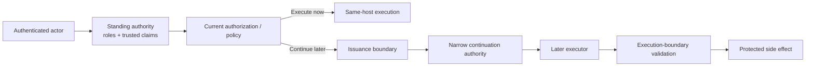
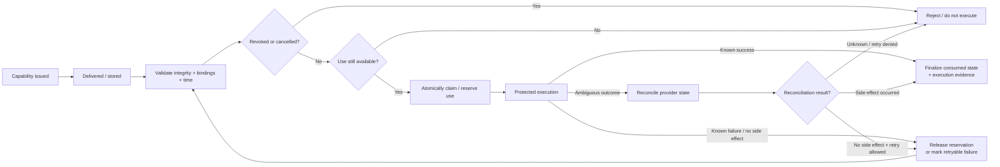

# Do You Need a Capability Token, or Are Roles and Claims Enough?

**Pattern classification:** General learning material

**Difficulty:** Intermediate

**Prerequisites:** No formal prerequisites. Familiarity with ASP.NET Core authentication and authorization is helpful, but no AsiBackbone package, external policy engine, capability library, or prior Learning material is required.

**What this article covers:** when roles are enough, when claims plus resource authorization are a better fit, when a separately issued capability becomes materially useful, why capability authority is a lifecycle concept rather than merely a token format, and what operational costs appear once capability issuance, validation, replay, revocation, and provenance become real responsibilities.

A capability token can look like an architectural upgrade:

```text
Roles
   ↓
Claims
   ↓
Capabilities
```

That is the wrong mental model.

Roles, claims, and capabilities answer different authority questions.

For many .NET applications, the best design is still:

```text
Authenticated actor
      ↓
Roles / claims / resource authorization
      ↓
Immediate application-owned execution
```

A capability becomes useful when the application has a different problem:

> **An allowed decision is made now, but execution happens later or somewhere else, and the later executor should receive only the authority approved for this one operation.**

The practical selection rule is:

> **Use the smallest authority model that matches the real lifecycle and trust boundary.**

Do not introduce capability infrastructure because it sounds more advanced.

Introduce it when ordinary standing authority no longer expresses the authority you need to preserve.

---

## The Three Questions Are Different

A useful first approximation is:

```text
Role
=
What may members of this organizational role generally do?

Claim
=
What trusted facts about this authenticated principal
may authorization policy use?

Capability
=
What exact narrow authority may this later executor rely on
for this follow-on operation?
```

Those models can compose.

They do not have to replace one another.

A common strong design is shown below. The first half answers whether the current actor is allowed to request or initiate something. The second half exists only when the authority must survive a separate continuation boundary.



The issuance boundary converts an allowed decision into bounded continuation authority. The execution boundary decides whether that authority is still valid for the exact side effect about to occur.

---

## Scenario 1 — Roles Clearly Win

Consider an internal reporting application.

Requirements:

- Employees authenticate through the organization's identity provider.
- Members of `ReportReader` may view reports.
- Members of `ReportAdministrator` may publish or retire reports.
- Reports are not tenant-specific.
- Operations execute immediately in the same application.
- There is no queue, separate worker, delayed approval, delegated executor, or cross-service continuation.

The flow is straightforward:

```text
Authenticated employee
        ↓
Role check
        ↓
Application service
        ↓
Immediate operation
```

In ASP.NET Core, a role check may be enough:

```csharp
[Authorize(Roles = "ReportAdministrator")]
[HttpPost("/reports/{reportId}/retire")]
public async Task<IActionResult> RetireAsync(
    string reportId,
    CancellationToken cancellationToken)
{
    await reportService.RetireAsync(
        reportId,
        cancellationToken);

    return NoContent();
}
```

Assume the operation really is that simple: membership in `ReportAdministrator` is the complete access rule, the report does not require additional resource-state authorization, and execution occurs immediately.

In ASP.NET Core, roles are commonly represented as role claims on the authenticated `ClaimsPrincipal`; the distinction in this article is semantic, not mechanical. A role check answers a coarse organizational-permission question. A claims/resource policy uses richer trusted attributes and current resource state. If the role rule later grows beyond one stable membership check, a named authorization policy can wrap the role requirement without introducing capability infrastructure.

Adding this:

```text
Role check
    ↓
Capability issuer
    ↓
Signed capability
    ↓
Capability validator
    ↓
Capability store
    ↓
Executor
```

would create more code, more credentials, more failure modes, and more operational state without solving an actual authority problem.

For this scenario:

> **Roles are not the primitive version of a capability design. Roles are the better design.**

---

### What Roles Are Good At

Roles are a natural fit when authority is:

- organizational;
- relatively stable;
- coarse grained;
- easy for administrators to understand;
- consumed immediately inside the same trusted application boundary.

Examples include:

```text
ReportReader
BillingManager
SupportAgent
ReleaseAdministrator
```

A well-chosen role answers a durable organizational question.

It does not need to encode every transient operation instance.

---

### Where Roles Start to Strain

Roles become awkward when the decision depends on combinations such as:

```text
Actor is a reviewer
AND
actor belongs to tenant-a
AND
resource belongs to tenant-a
AND
resource classification <= actor clearance
AND
resource is currently editable
```

Trying to encode every combination as a role can produce role explosion:

```text
TenantAReviewer
TenantAFinanceReviewer
TenantARestrictedFinanceReviewer
TenantBReviewer
...
```

That is usually a sign that trusted attributes and resource-aware authorization are a better fit.

It is not yet a reason to introduce a capability.

---

## Scenario 2 — Claims-Based Authorization Clearly Wins

Consider a multi-tenant document application.

Requirements:

- Every user authenticates through a trusted identity provider.
- The authenticated principal contains:
  - `tenant_id`
  - `department`
- The application loads the current document.
- A user may edit only documents in the same tenant.
- Finance documents additionally require `department = finance`.
- Editing occurs immediately in the current request.
- There is no delayed executor or separately delegated worker.

The authority question is not:

```text
Is this user a member of one giant role?
```

It is closer to:

```text
Trusted actor attributes
        +
Current resource state
        ↓
May this actor edit this document now?
```

A resource-aware authorization handler is a natural fit.

For example:

```csharp
public sealed record EditDocumentRequirement
    : IAuthorizationRequirement;

public sealed record EditDocumentResource(
    string TenantId,
    string Department,
    bool IsLocked);

public sealed class EditDocumentHandler
    : AuthorizationHandler<
        EditDocumentRequirement,
        EditDocumentResource>
{
    private const string FinanceDepartment = "finance";

    protected override Task HandleRequirementAsync(
        AuthorizationHandlerContext context,
        EditDocumentRequirement requirement,
        EditDocumentResource resource)
    {
        string? actorTenant =
            context.User.FindFirst("tenant_id")?.Value;

        string? actorDepartment =
            context.User.FindFirst("department")?.Value;

        if (!string.Equals(
                actorTenant,
                resource.TenantId,
                StringComparison.Ordinal))
        {
            context.Fail();
            return Task.CompletedTask;
        }

        if (resource.IsLocked)
        {
            context.Fail();
            return Task.CompletedTask;
        }

        if (string.Equals(
                resource.Department,
                FinanceDepartment,
                StringComparison.Ordinal) &&
            !string.Equals(
                actorDepartment,
                FinanceDepartment,
                StringComparison.Ordinal))
        {
            return Task.CompletedTask;
        }

        context.Succeed(requirement);
        return Task.CompletedTask;
    }
}
```

The endpoint can load the authoritative resource, construct the resource projection, and then call `IAuthorizationService`:

```csharp
AuthorizationResult result =
    await authorization.AuthorizeAsync(
        User,
        resource,
        new EditDocumentRequirement());

if (!result.Succeeded)
{
    return Forbid();
}
```

Register the handler through dependency injection:

```csharp
builder.Services.AddSingleton<
    IAuthorizationHandler,
    EditDocumentHandler>();
```

Singleton is safe here only because the handler is stateless and has no scoped dependencies. If a real handler later depends on a scoped service such as an EF Core `DbContext`, choose a compatible lifetime rather than copying the singleton registration mechanically.

The `tenant_id` value is trusted only because the application's authentication configuration validates tokens from the intended issuer and then accepts the issuer's claim mapping. Do not copy an unvalidated client field into `ClaimsPrincipal` and call it authoritative. Assume the trusted identity provider normalizes the `department` claim values used by this application; the sample therefore uses ordinal comparison for both the normalized department value and the opaque tenant identifier.

The example treats tenant isolation and a locked document as hard vetoes by calling `context.Fail()`: cross-tenant access is categorically invalid in this scenario, and a lock is modeled as non-overridable here. The finance-department check is a narrower additional requirement. Returning without `Succeed()` leaves that requirement unsatisfied for this handler, so another deliberately registered handler could contribute only if the application's policy is designed to allow that composition. By contrast, `context.Fail()` makes the overall authorization result fail even if another handler would otherwise succeed. The distinction is architectural, not a claim that every lock or department rule should compose this way.

```text
Authenticated principal
        ↓
Trusted actor claims
        +
Authoritative document state
        ↓
Resource-based authorization
        ↓
Edit immediately
```

A capability adds little here.

The authorization decision is consumed immediately by the same trusted host.

There is no authority handoff to preserve.

For this scenario:

> **Claims plus current resource authorization are the better fit.**

---

### Claims Are Not Caller-Supplied Strings

The word *claim* is easy to misuse.

Suppose a client submits:

```json
{
  "tenantId": "tenant-a",
  "department": "finance"
}
```

Those fields do not become trusted claims merely because the application copies them into an authorization object.

The important distinction is:

```text
Caller assertion
        ≠
Trusted identity claim
```

and:

```text
Trusted actor claim
        ≠
Authoritative resource state
```

The actor's `tenant_id` may come from a validated identity token.

The document's tenant should normally come from the application's current resource store.

The authorization decision then compares trusted identity state with trusted resource state.

---

### Claims Can Become Stale Too

Claims are not automatically current world state.

A claim such as:

```text
department = finance
```

may have been true when an access token or session was established.

Meanwhile:

- employment may have changed;
- tenant assignment may have changed;
- suspension may have been applied;
- resource classification may have changed;
- an emergency policy may have changed.

The application must decide which facts may safely travel with identity and which facts must be resolved at authorization time.

That freshness question exists whether or not capabilities are used.

A capability does not eliminate stale identity or stale resource state by magic.

---

## The Decision Point — Are You Authorizing Now or Preserving Authority for Later?

The strongest signal that a capability may be useful is not:

```text
The operation is important.
```

The stronger signal is:

```text
Authorization happens here.
Execution happens later or somewhere else.
The later executor should not inherit broad standing authority.
```

That creates a continuation problem.

Compare these two flows.

### Immediate same-host operation

```text
Authenticated actor
      ↓
Roles / claims / policy
      ↓
Current resource authorization
      ↓
Immediate execution
```

The host already knows:

- who the actor is;
- what resource is current;
- what policy applies;
- what operation is about to execute.

There may be no reason to mint another authority artifact.

### Delayed or delegated operation

```text
Authenticated actor
      ↓
Current authorization / policy
      ↓
Decision made now
      ↓
Queue or delay
      ↓
Different worker
      ↓
Execution later
```

Now the later worker needs an answer to a different question:

> **What exact authority may I rely on for this execution, without receiving the actor's broader standing permission?**

That is where a capability can become materially useful.

---

## Scenario 3 — A Separately Issued Capability Clearly Wins

Consider an irreversible case-purge workflow.

Requirements:

- A case administrator may request purge.
- Current retention policy must permit purge.
- A legal hold blocks purge.
- A reviewer must approve the irreversible action.
- The purge happens later through a background worker.
- The worker must not receive the reviewer's broad administrator credentials.
- Authority should apply only to:
  - `case.purge`;
  - `case-123`;
  - the `purge-worker`;
  - a short validity window.
- Duplicate use must be detectable or prevented.

The lifecycle may be:

```text
Authenticated requester
        ↓
Roles / claims authorization
        ↓
Current case + retention state
        ↓
Policy decision
        ↓
Required review
        ↓
Narrow purge authority
        ↓
Queue
        ↓
Purge worker
        ↓
Validate authority
        ↓
Host-owned purge executor
```

The key point is that the capability does not replace the earlier role or claims decision.

It preserves the result of that decision in a narrower form for a later executor.

A conceptual capability might contain:

```text
CapabilityId:
cap-123

ApprovedBy:
reviewer-42

Operation:
case.purge

Resource:
case-123

Audience:
purge-worker

Issued:
2026-09-02T18:00:00Z

Expires:
2026-09-02T18:05:00Z

MaximumUses:
1

DecisionId:
decision-987
```

`ApprovedBy` is provenance: it identifies the reviewer whose approval contributed to issuance. It is not the presenter binding. If the grant must be bound to a workload identity, model that separately (for example, `SubjectWorkload = purge-worker`) and validate that authenticated workload at execution. `Audience` answers which execution boundary may accept the grant; it does not by itself prove who presented it.

| Field | Meaning |
| --- | --- |
| `ApprovedBy` | Who approved or reviewed the action; provenance, not presenter identity |
| `SubjectWorkload` | Which authenticated workload may present/use the grant when subject binding is required |
| `Audience` | Which executor or validation boundary may accept the grant |
| `DecisionId` | Which decision justified issuance |

A minimal application model could look like:

```csharp
public sealed record CapabilityGrant(
    string CapabilityId,
    string Operation,
    string Resource,
    string Audience,
    DateTimeOffset IssuedUtc,
    DateTimeOffset ExpiresUtc,
    int MaximumUses,
    string DecisionId,
    string? SubjectWorkload = null,
    string? ApprovedBy = null);
```

Use `DateTimeOffset` for absolute timestamps. In .NET 8 and later, inject `TimeProvider` when code must evaluate issuance/expiration so tests can control time without relying on the process clock.

The worker can validate:

```text
Operation matches?
Resource matches?
Audience matches?
Not expired?
Not revoked?
Use still available?
Decision lineage recognized?
Current execution constraints still acceptable?
```

Only then does it invoke the side effect.

That is a real authority problem that roles and standing claims do not express cleanly.

A broad access token saying:

```text
role = CaseAdministrator
scope = cases.manage
```

would give the worker far more authority than it needs.

For this scenario:

> **Separately issued, narrow continuation authority is justified.**

---

## A Capability Is Not Simply "A JWT With Different Claims"

This question deserves a precise answer.

A capability may be encoded as a JWT.

It may also be:

- an opaque database-backed handle;
- a signed custom envelope;
- a one-time identifier referencing server-side grant state;
- another artifact whose semantics are understood by the issuer and executor.

The serialization format is not what makes it a capability.

A JWT access token and a capability token may both contain:

```text
sub
aud
scope
exp
```

but their **authority semantics and lifecycle responsibilities** can be different.

A general access token may mean:

```text
This authenticated principal has standing scopes
usable across this API audience.
```

A narrow capability may mean:

```text
This exact operation
on this exact resource
may be performed by this exact executor
until this exact time
under this exact continuation rule.
```

The same token format can represent either one.

The important questions are:

- Who may issue it?
- What decision justifies issuance?
- What exact authority does possession convey?
- Which executor may accept it?
- Which bindings must match?
- How long is it valid?
- Can it be reused?
- How is it revoked or cancelled?
- What provenance connects it to the original decision?
- What current checks still happen at execution?

That is why:

> **Capability is primarily an authority-lifecycle concept, not a JWT feature.**

### Where Existing Standards Fit

Existing standards cover adjacent pieces of this problem. [OAuth 2.0 Token Exchange (RFC 8693)](https://www.rfc-editor.org/rfc/rfc8693.html) defines token exchange for impersonation and delegation scenarios. [OAuth 2.0 Rich Authorization Requests (RFC 9396)](https://www.rfc-editor.org/rfc/rfc9396.html) carries fine-grained authorization details. [DPoP (RFC 9449)](https://www.rfc-editor.org/rfc/rfc9449.html) sender-constrains OAuth tokens using proof of possession, [OAuth 2.0 Mutual-TLS Client Authentication and Certificate-Bound Access Tokens (RFC 8705)](https://www.rfc-editor.org/rfc/rfc8705.html) describes certificate-bound access tokens, and [GNAP (RFC 9635)](https://www.rfc-editor.org/rfc/rfc9635.html) defines a broader delegation and authorization protocol.

Those mechanisms can inform a production design, but none of their names automatically means "the capability model described in this article." Start from the authority semantics and lifecycle, then choose a standard or implementation that actually enforces them.

Also keep two bindings distinct:

```text
Audience binding
=
Which service may accept the artifact?

Sender constraint
=
Which presenter can prove it is entitled to use the artifact?
```

An audience-bound bearer token is still a bearer token. Audience validation limits where it can be used; it does not stop another party that steals the artifact from presenting it to that same audience. Sender-constraining mechanisms such as DPoP or mutual-TLS-bound access tokens solve a different problem.

---

### Keep Identity Tokens and Capability Tokens Semantically Separate

If a capability is encoded as a JWT, do not automatically treat it as an ordinary identity token or register it as the application's default bearer identity scheme.

In ASP.NET Core, a validated bearer token commonly becomes a `ClaimsPrincipal`. That is useful for authentication and standing authorization, but a capability may instead be intended only for a specific execution boundary. Prefer a separate named authentication/validation path or a dedicated execution-boundary validator unless the artifact is intentionally designed to establish the request principal. This prevents capability fields from being mapped accidentally into general application identity and standing authorization.

A safer architecture can use:

```text
Identity/access token
        ↓
Authentication + standing authorization

Scoped capability
        ↓
Dedicated execution-boundary validation
```

Even when both are signed tokens, they should not accidentally become interchangeable.

For example:

```text
audience = purge-worker
operation = case.purge
resource = case-123
```

should not silently authenticate the presenter as a general application user with broad session authority.

Likewise, a normal identity token should not automatically become permission to execute a previously approved irreversible purge.

---

## Capabilities Do Not Replace Authentication

A capability does not necessarily answer:

> Who is this actor?

Authentication still matters when identity matters.

A production flow may require both:

```text
Authenticated workload or actor
        +
Validated capability
        ↓
Execution
```

For example, the purge worker may authenticate as workload identity:

```text
workload = purge-worker
```

and then present a capability whose audience is also:

```text
purge-worker
```

The executor can require both:

- the caller is the expected authenticated workload;
- the presented capability authorizes this exact purge.

The capability narrows the action.

It does not necessarily establish the caller's general identity.

---

## A Practical Capability Validator Pattern in ASP.NET Core

There is no single required ASP.NET Core hook. Choose the validation location based on where capability authority becomes actionable.

| Placement | Good fit | Main caution |
| --- | --- | --- |
| Dedicated executor/service method | Same-process host-owned side effect | Keep every alternate path from reaching the executor without this guard |
| Endpoint filter or authorization-style boundary | Capability is presented directly to one HTTP operation | Do not confuse validation success with general user authentication |
| Separate named authentication scheme | Capability is consistently presented over HTTP and framework integration is useful | Do not make it the default scheme or hydrate broad application identity accidentally |
| Middleware | Many downstream endpoints share one transport-level check | Middleware is often too early to know the exact resource, operation, current state, or replay semantics |

A compact host-owned worker or service method can remain explicit:

```csharp
CapabilityValidationResult validation =
    await capabilityValidator.ValidateForExecutionAsync(
        grant,
        expectedOperation: "case.purge",
        expectedResource: caseId,
        expectedAudience: "purge-worker",
        cancellationToken: cancellationToken);

if (!validation.IsValid)
{
    return;
}

await purgeExecutor.ExecuteAsync(
    caseId,
    cancellationToken);
```

The bare `return` represents a non-executing rejection in this small sketch. A production worker should record structured rejection evidence and then apply its explicit queue/recovery policy (for example, dead-letter, defer, or discard) rather than translating the result into an HTTP status code.

The validator should check the exact bindings that matter for the operation: integrity/proof, issuer trust, operation, resource, audience, time window, revocation/cancellation, use state, subject/workload binding when present, and any current execution-time vetoes. Keep provider credentials inside the host-owned executor rather than inside the grant or the request principal.

For many applications, a dedicated validator at the host-owned executor is easier to reason about than middleware because it has the current resource and exact side effect in view.

---

## Capabilities Do Not Replace the Decision That Creates Them

A capability should normally come **after** current authorization or policy.

A reasonable flow is:

```text
Authenticated actor
        ↓
Roles / claims
        ↓
Current resource state
        ↓
Authorization / governance decision
        ↓
Allowed
        ↓
Capability issuance
```

The capability preserves narrow follow-on authority.

Issuance is itself an authority boundary. The issuer should be a trusted application component that may mint a grant only after the required current authorization, policy, and review conditions succeed; it should not be an open endpoint that turns caller-supplied fields into signed authority. A compromised or over-privileged issuer can manufacture valid-looking grants, so issuer permissions and auditability are part of the threat model.

The capability does not prove that the original role assignment, claims, resource state, review, or policy decision were correct unless the system preserves that provenance separately.

For consequential operations, useful provenance may include:

```text
DecisionId
PolicyId / version
ActorId
Approval or acknowledgment reference
Resource version
IssuedUtc
```

The exact model is application-specific.

The important point is that a later executor should be able to understand what authority it is relying on and, where required, what decision produced it.

---

## The Bindings That Make a Capability Narrow

A capability becomes useful because authority is intentionally bounded.

Common bindings include:

| Binding | Question it answers |
| --- | --- |
| Operation | What action may occur? |
| Resource | Which object or target may be affected? |
| Subject/workload | Who or what may present/use the grant when subject binding matters? |
| Audience | Which executor may accept it? |
| Issued time | When was authority created? |
| Expiration | How long may it remain usable? |
| Not-before | When may use begin, if delayed activation matters? |
| Use count | How many times may it be consumed? |
| Decision/provenance | What authorized issuance, including actor/reviewer identity when needed? |
| Policy/resource version | Which evaluated state did issuance depend on? |

Do not add fields mechanically.

Each binding should answer a real risk.

For a one-minute, same-process continuation, a portable token may be unnecessary.

For a delayed cross-service purge, operation/resource/audience/expiration bindings may be central to the design.

---

## Expiration Is Necessary but Not Sufficient

A short expiration reduces the period in which a stolen or stale bearer artifact can be used.

It does not answer every lifecycle problem.

Suppose a capability is valid for five minutes.

During minute one:

- the case enters legal hold;
- the actor is suspended;
- the purge is cancelled.

The capability is still unexpired.

The system must decide which changes require current execution-time validation.

Possible strategies include:

```text
Exact resource-version match
Current policy re-evaluation
Revocation lookup
Cancellation state
Short expiry plus bounded risk
```

The right answer depends on consequence and latency.

For the irreversible purge scenario in this article, a defensible default is to re-check current legal-hold and cancellation state immediately before execution even when the capability is unexpired and unused. Other resource facts may legitimately be frozen at approval time if the workflow defines that semantics explicitly; document which facts are snapshot evidence and which remain execution-time vetoes.

The important point is:

> **Expiration bounds age. It does not prove that the world stayed unchanged.**

---

## Replay Is a Separate Responsibility

A capability can be perfectly signed, correctly scoped, and still be replayed.

If a capability means:

```text
case.purge / case-123 / maximum uses = 1
```

then the system needs some way to enforce that use bound.

That may require:

- durable consumption state;
- an atomic compare-and-set;
- a replay store;
- provider idempotency;
- reconciliation after ambiguous failures, such as losing the provider response after the side effect may already have occurred.

A purely self-contained token cannot prove by itself that another worker has not already consumed the same grant unless the execution environment provides another stateful mechanism.

Stateful enforcement does not require one storage product. A relational database can use a unique capability identifier plus a transaction or conditional update. A distributed cache can work when it provides an atomic conditional operation (for example, a Redis transaction or script) and its durability/failover semantics match the consequence of the operation. A transactional outbox can make delivery and recovery more reliable, but it does not by itself replace atomic capability-consumption state. The storage choice should follow the required replay, durability, partition, and recovery guarantees.

This is one of the largest differences between:

```text
"Token validates cryptographically"
```

and:

```text
"Authority is still valid for this use."
```

For deeper treatment, see [Replay Protection and Bounded-Use Authority](../../security/replay-protection-and-bounded-use.md).

---

## Revocation Is a Design Choice, Not a Free Feature

A capability lifecycle should state what "revoke" means.

Possibilities include:

### Very short-lived, no online revocation

```text
Valid until expiration
```

This is operationally simple but may leave a short window after cancellation.

### Server-side grant state

```text
Capability ID
        ↓
Lookup current status
        ↓
Active / consumed / revoked / cancelled
```

This improves control but adds storage and availability dependencies.

### Key or issuer revocation

Useful for broad compromise response, but often too coarse for cancelling one specific operation.

### Resource/policy revalidation

The executor rejects the capability because the current resource or policy no longer supports the operation.

These mechanisms solve different problems.

Do not write:

```text
capability supports revocation
```

unless the implementation defines how.

A bounded-use lifecycle is easier to reason about when replay, revocation, and ambiguous execution are shown together:



The diagram is deliberately not an exactly-once claim. Real designs may reserve, consume, release, carry forward, or finalize use state at different points, and each choice creates a different crash window. A definitive no-side-effect failure can release the reservation or record a retryable attempt according to policy. After an ambiguous outcome, reconciliation decides whether the reserved use is finalized as consumed, released for a new attempt, or retained/carried forward under a controlled retry. The invariant is narrower: concurrent or repeated attempts must not silently obtain more authority, revoked/cancelled grants must not execute, and ambiguous provider outcomes must be reconciled before another consequential attempt.

---

## Capability Infrastructure Has Real Cost

A capability architecture adds more than a record type.

Depending on the design, you may need to own:

- issuance policy;
- issuer authentication/authorization;
- signing-key or proof custody;
- token/handle serialization;
- audience validation;
- expiration and clock-skew handling;
- revocation/cancellation semantics;
- replay or bounded-use state;
- durable consumption;
- current resource/policy freshness rules;
- decision provenance;
- observability;
- incident response;
- key rotation;
- issuer/executor trust configuration;
- queue/message custody;
- troubleshooting for rejected grants;
- recovery from ambiguous external execution.

The availability model also changes.

Suppose the replay store is unavailable.

Does the worker:

```text
Fail closed?
Defer?
Use a last-known state?
Execute anyway?
```

That is now an architectural decision.

A simple same-host role check did not have that dependency.

This is why capability infrastructure should solve a concrete boundary rather than be added for aesthetic consistency.

---

## Threat Model Snapshot

A capability design should state what failures it is intended to contain. A compact threat model for the purge scenario looks like this:

| Threat | Example failure | Primary control | Residual question |
| --- | --- | --- | --- |
| Stolen bearer capability | Another party presents the grant to the intended audience | Short lifetime, narrow bindings, protected transport/storage, sender constraint when justified | How quickly can theft be detected or cancelled? |
| Compromised or over-privileged issuer | Issuer mints a syntactically valid purge grant without a legitimate decision | Issuer authorization, least privilege, issuance audit/provenance | What trust anchor can detect or contain a bad issuer? |
| Replay / concurrent use | Two workers present the same single-use grant | Atomic claim/consumption state, idempotency/reconciliation | What happens if the replay store is partitioned or unavailable? |
| Stale world state | Legal hold appears after issuance | Explicit execution-time freshness/veto checks | Which facts are frozen at approval and which remain current vetoes? |
| Resource or audience substitution | Valid grant is applied to a different case or executor | Exact operation/resource/audience validation | Are identifiers canonical and compared consistently? |
| Audience treated as sender proof | Stolen token reaches the correct service | Workload authentication or proof-of-possession when required | Is bearer possession acceptable for this consequence class? |
| Queue/log disclosure | Grant leaks through message inspection, dead-letter storage, or diagnostics | Queue ACLs, encryption, retention discipline, no routine token logging | Which operational systems can read bearer authority? |
| Validation dependency outage | Replay/revocation state cannot be checked | Explicit fail-closed/defer policy | Is degraded operation permitted for this specific action? |

The purpose of this table is not to claim that capability authority eliminates these threats. It narrows what a stolen, replayed, stale, or misrouted authorization artifact is allowed to cause and makes the remaining assumptions reviewable.

---

## Standing Authority Versus Continuation Authority

A useful vocabulary distinction is:

### Standing authority

```text
This actor is generally allowed to request
or perform this class of operation.
```

Roles and many identity claims commonly participate here.

Examples:

```text
role = CaseAdministrator
scope = cases.manage
department = finance
tenant_id = tenant-a
```

### Continuation authority

```text
This exact approved operation may continue
through this exact later execution boundary.
```

A capability is often a good representation here.

Example:

```text
operation = case.purge
resource = case-123
audience = purge-worker
expires = 18:05Z
maximum_uses = 1
decision_id = decision-987
```

The distinction prevents a common mistake:

```text
Allowed once
      ↓
Grant broad standing permission
```

Instead:

```text
Allowed once
      ↓
Preserve only the narrow authority needed to continue
```

---

## Do Not Confuse Delegation With Forwarding Broad Credentials

Suppose a web application authorizes an administrator and then queues work for a background worker.

A tempting implementation is:

```text
User access token
        ↓
Queue
        ↓
Worker reuses user token
```

That may be inappropriate because:

- the token may contain more scopes than the worker needs;
- the token may expire before execution;
- its audience may not be the worker;
- forwarding bearer credentials increases exposure;
- it may represent the user's general session rather than one approved operation;
- provenance between the decision and this queued work may be weak.

A narrower pattern is:

```text
Current user authorization
        ↓
Allowed decision
        ↓
Issue authority for:
  operation + resource + worker + short lifetime
        ↓
Queue
        ↓
Worker validates
        ↓
Execute
```

The capability is valuable because it reduces authority during delegation.

It is not valuable merely because a queue exists.

If a bearer capability is placed directly in a queue message, the queue becomes part of the credential trust boundary. Queue ACLs, encryption, dead-letter handling, diagnostics, message inspection, retention, and backup access now affect who can obtain usable authority. Prefer references or protected envelopes when they reduce exposure, and avoid copying capability values into routine logs.

If the worker can independently reconstruct current identity and authorization safely, a separate capability may still be unnecessary.

---

## A Queue or Service Boundary Does Not Automatically Mean Capability

### Cross-process services that can re-authorize

Consider two internal services:

```text
Orders API
    ↓
Inventory API
```

If the Inventory API already authenticates the Orders workload, evaluates current authorization for the requested operation, and does not need to preserve an earlier human approval, then ordinary service authorization may be enough.

Do not force this:

```text
Service call
     ↓
Capability issuer
     ↓
Capability validator
```

without a reason.

A capability becomes more useful when System B must rely on authority decided in System A that cannot or should not be reconstructed as broad standing permission.

Ask:

> **What authority information must survive the handoff that ordinary authenticated service identity does not express safely?**

If the answer is "none," keep the simpler model.

---

### Queue workers that can re-authorize

A background worker can sometimes safely re-evaluate current authority from durable workflow state.

For example:

```text
Request creates job
        ↓
Job stores resource + requested operation
        ↓
Worker loads current resource
        ↓
Worker applies current policy
        ↓
Worker executes
```

If the worker has a trusted service identity and the business rule does not require preserving an earlier approval as portable authority, this may be enough.

A capability becomes justified when the worker must preserve a specific earlier decision or delegation while receiving less standing authority than the initiating actor.

Again, the question is not:

```text
Is there a queue?
```

It is:

```text
What exact authority should the worker possess?
```

---

## A Practical Decision Guide

Use this sequence before introducing a capability.

### Question 1 — Does the operation execute immediately in the same trusted host?

If **yes**, start with:

```text
Authentication
   ↓
Roles / claims / resource authorization
   ↓
Immediate execution
```

A capability is usually unnecessary unless another independent authority boundary exists.

If **no**, continue.

---

### Question 2 — Can the later executor safely make a fresh authorization decision?

If **yes**, consider:

```text
Durable intent / job
       ↓
Later executor authenticates
       ↓
Load current resource
       ↓
Current authorization / policy
       ↓
Execute
```

You may not need portable authority.

If **no**, continue.

---

### Question 3 — Must the later executor rely on a specific earlier approval or decision?

If **yes**, a continuation artifact may be useful.

The key distinction is semantic: **what authorizes the side effect?**

| Later-execution design | What the durable artifact means | Capability-like execution authority? |
| --- | --- | --- |
| Job row records `RequestedOperation` and prior approval, but the worker independently loads current identity/resource state and makes a fresh authorization decision | Workflow intent and evidence | Usually no |
| Grant row/opaque handle is accepted by the executor as bounded authority after validating operation, resource, audience, expiry, use state, and required freshness | Execution authority | Yes, even though validation uses server-side state |
| Signed/self-contained artifact is accepted as bounded authority after equivalent validation | Portable execution authority | Yes |

An opaque database-backed handle can therefore be a capability. An approved job record can be merely workflow evidence. The difference is not whether a network lookup occurs or whether the artifact is a JWT; it is whether validated possession/reference to that artifact is what authorizes execution.

Do not turn `Approved = true` into an unlimited permission bit. Bind any continuation authority to the exact operation/resource/audience/lifetime/use semantics the executor is allowed to rely on.

If the later executor needs bounded authority, continue.

---

### Question 4 — Can the authority be made materially narrower than standing credentials?

A capability should be able to say something like:

```text
Only operation X
Only resource Y
Only executor Z
Only until time T
Possibly only once
```

If the proposed capability is effectively:

```text
scope = *
audience = *
expires = next year
unlimited use
```

then the design is not gaining much from capability semantics.

---

### Question 5 — Can you operate the lifecycle safely?

Before issuing anything, answer:

- Who issues?
- Who may request issuance?
- What decision permits issuance?
- How is the artifact validated?
- How are audience/resource/operation bindings checked?
- How is expiration handled?
- What is the replay/use model?
- How is cancellation or revocation handled?
- What happens when replay/revocation state is unavailable?
- How is provenance preserved?
- What evidence remains after execution?
- What happens after ambiguous provider failure?

If those answers are unclear, capability infrastructure may currently create more uncertainty than it removes.

---

## Selection Matrix

| Scenario | Roles | Claims/resource authorization | Separately issued capability |
| --- | --- | --- | --- |
| Internal report admin, immediate same host | **Strong fit** | Usually unnecessary unless resource attributes matter | Weak fit |
| Multi-tenant document edit, immediate same host | Possible but can cause role explosion | **Strong fit** | Weak fit |
| Delayed purge after approval, separate worker | Useful for initial requester authorization | Useful for initial current decision | **Strong fit** |
| Service-to-service call with fresh authorization at receiver | Possibly useful for workload roles | **Strong fit** when receiver can decide current permission | Often unnecessary |
| Queue worker re-evaluates current policy independently | Useful upstream | Useful at worker if identity/context available | Optional |
| One-time delegated operation with narrow audience/resource/time | Weak as continuation artifact | Standing claims may be too broad | **Strong fit** |
| Read-only low-risk same-process action | Often sufficient | Often sufficient | Usually excessive |

The table is not a maturity ladder.

A mature architecture may intentionally choose the first or second column.

---

## What a Capability Should Never Be Used to Hide

Do not introduce a capability to avoid answering these questions:

### Who authenticated the actor?

Capability possession is not automatically identity.

### Who authorized the original request?

Issuance still needs a trusted decision.

### Which resource is current?

A resource ID inside a token does not prove current state.

### What policy version applies?

A policy version field does not make stale policy correct.

### Who owns the external credential?

The executor should still keep infrastructure credentials appropriately isolated.

### What happens under replay?

A signature is not a use counter.

### What happens under revocation?

Expiration is not always cancellation.

### What happened during execution?

Authority evidence and execution evidence are different artifacts.

A capability can preserve authority.

It cannot replace the surrounding security and operational model.

---

## Example — Same Operation, Three Different Architectures

Consider:

```text
account.disable
```

The correct authority model depends on lifecycle.

### Version A — Simple role

Requirements:

- Only local administrators may disable accounts.
- No tenant distinction.
- No protected-account state.
- Immediate same-host execution.

```text
Authenticated user
      ↓
Administrator role
      ↓
Disable now
```

Capability: unnecessary.

---

### Version B — Claims plus resource authorization

Requirements:

- Administrator must belong to the same tenant as the account.
- Protected accounts cannot be disabled.
- Current resource state is loaded immediately.
- Execution occurs in the same request.

```text
Authenticated user
      ↓
tenant_id claim
      +
current account tenant/protection state
      ↓
Resource authorization
      ↓
Disable now
```

Capability: still unnecessary.

---

### Version C — Delayed reviewed disablement

Requirements:

- Same tenant/resource checks as Version B.
- High-risk accounts require review.
- Execution happens later in a dedicated worker.
- Worker must not inherit broad administrator authority.
- Approval applies only to this account and expires quickly.
- Retry/replay must be bounded.

```text
Authenticated user
      ↓
Claims + resource authorization
      ↓
Review
      ↓
Narrow disable capability
      ↓
Queue
      ↓
Account-disable worker
      ↓
Capability validation
      ↓
Disable
```

Capability: materially useful.

The operation name did not change.

The lifecycle did.

That is the selection principle.

---

## Testing the Boundary

Whichever model you choose, test the invariant that matters.

For immediate role/claims authorization:

```text
Unauthorized
      ↓
Protected executor calls = 0
```

For a capability continuation:

```text
Expired capability
      ↓
Executor calls = 0
```

```text
Wrong resource
      ↓
Executor calls = 0
```

```text
Wrong audience
      ↓
Executor calls = 0
```

```text
Already consumed
      ↓
Additional executor calls = 0
```

Also prove the positive path:

```text
Valid capability
+
bindings/current checks pass
        ↓
Executor calls = 1
        ↓
Single-use state = consumed
```

The important proof is not that the authority artifact parses.

It is that invalid authority cannot cross the execution boundary.

---

## Common Mistakes

### 1. Treat capabilities as a maturity upgrade

Avoid:

```text
Roles are basic.
Claims are intermediate.
Capabilities are advanced.
```

Prefer:

```text
Different authority models fit different lifecycles.
```

---

### 2. Mint a capability for every allowed request

If the same host can execute immediately, minting a token just to validate it one method later may add ceremony without improving authority isolation.

---

### 3. Put broad standing scopes inside a "capability"

This:

```text
scope = admin.*
resource = *
audience = *
expires = 30 days
```

is not meaningfully narrow merely because the object is named `CapabilityToken`.

---

### 4. Let a capability replace current resource reasoning

A capability may have been issued against:

```text
resource_version = 17
```

If resource version 18 materially changes whether execution is safe, the execution boundary needs a freshness rule.

---

### 5. Assume a signed token solves replay

Cryptographic integrity can establish that an artifact was not modified after issuance.

It does not prove that the artifact has not already been used.

---

### 6. Forward the caller's broad token because delegation is easier

This can turn a narrowly approved operation into reusable standing authority inside a worker or downstream service.

---

### 7. Store capability state without defining failure behavior

If validation requires a grant/replay store, define what happens when that store is unavailable.

Do not let availability failure silently broaden authority.

---

### 8. Treat `Approved = true` as a bound grant

A workflow row that says only `Approved = true` may preserve evidence that somebody approved something, but it does not automatically bind the operation, resource, executor, freshness, or use count. If the worker treats that boolean as portable execution permission, a retry or changed resource selector can silently broaden the original decision.

Preserve workflow evidence as evidence, or define a real bounded grant contract when the row/handle is intended to authorize execution.

---

## When Roles Are Enough

Choose roles confidently when:

- the permission is organizational and stable;
- role count remains understandable;
- the operation is immediate;
- the same trusted host owns authorization and execution;
- current resource-specific facts are not needed;
- no narrow delegated continuation authority is required.

That is a complete architecture, not a temporary one.

---

## When Claims and Resource Authorization Are Enough

Choose claims/resource authorization when:

- trusted actor attributes matter;
- current resource state matters;
- roles would multiply awkwardly;
- authorization occurs close to execution;
- the same host can make the current decision;
- no separate executor needs a portable grant.

This is often the natural ASP.NET Core design for multi-tenant and resource-sensitive applications.

---

## When a Capability Is Justified

A separately issued capability becomes materially useful when several of these are true:

- authorization and execution are separated in time;
- a different process/service/worker executes;
- the later executor should not receive broad standing identity authority;
- the operation must be bound to one resource;
- the executor/audience must be explicit;
- short lifetime matters;
- bounded use or replay protection matters;
- an earlier approval or governance decision must be preserved;
- provenance from decision to execution matters;
- current execution-time validation can enforce the grant's semantics.

The stronger the continuation boundary, the more useful capability authority becomes.

---

## When a Capability Is Probably Overengineering

Keep the simpler role/claims/resource-authorization path when most of these are true:

- execution is immediate in the same trusted host;
- ordinary ASP.NET Core authorization fully expresses the rule;
- no specific earlier approval must be carried into a later executor;
- the later worker/service can safely make a fresh authorization decision;
- the proposed capability would be nearly as broad as the caller's standing access token;
- replay/revocation infrastructure would add more failure surface than authority reduction;
- the issuer and validator would sit beside each other with no meaningful time, process, trust, or delegation boundary between them.

The presence of a queue, another service, or an "important" operation does not by itself justify a capability.

---

## A Compact Review Checklist

Before adding capability authority, ask:

- [ ] What problem do roles fail to express?
- [ ] What problem do trusted claims plus resource authorization fail to express?
- [ ] Is execution delayed, delegated, cross-process, or cross-trust-boundary?
- [ ] Must a specific earlier decision survive into later execution?
- [ ] Can the later executor independently re-authorize instead?
- [ ] Is the capability materially narrower than standing credentials?
- [ ] What operation is bound?
- [ ] What resource is bound?
- [ ] What audience is bound?
- [ ] What subject/workload is bound when needed?
- [ ] What is the validity window?
- [ ] What is the replay/use-count rule?
- [ ] What is the revocation/cancellation rule?
- [ ] What provenance links issuance to the original decision?
- [ ] What current state must be revalidated at execution?
- [ ] What happens when validation infrastructure is unavailable?
- [ ] Can the simpler same-host authorization path preserve the same invariant?

If the final question is yes, prefer the simpler architecture.

---

## The Short Answer

Do you need a capability token?

Often, no.

Use a role when the permission is stable, organizational, and consumed immediately.

Use trusted claims plus current resource authorization when richer actor attributes and resource state determine permission.

Use a separately issued capability when an allowed decision must become **narrow continuation authority** for a later or different executor without forwarding broad standing credentials.

The progression is not:

```text
roles
  ↓
claims
  ↓
capabilities
```

It is:

```text
Choose the authority model
that matches the boundary you actually have.
```

For the full semantic comparison, continue with [Role-Based, Claims-Based, and Capability-Based Authorization](../../architecture/role-based-claims-based-and-capability-based-authorization.md).

If a bounded continuation grant is justified, continue with [Scoped Capability and Host-Owned Execution](../../tutorials/scoped-capability-and-host-owned-execution.md) for issuance and execution-boundary design, then [Replay Protection and Bounded-Use Authority](../../security/replay-protection-and-bounded-use.md) for replay, use-count, and failure-window concerns.

---

> **A capability should solve an authority handoff problem. If there is no handoff, roles, claims, and current host authorization may already be enough.**
