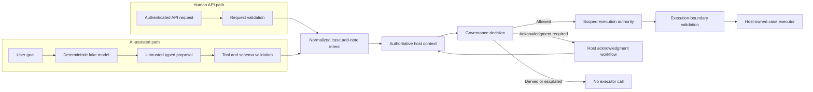
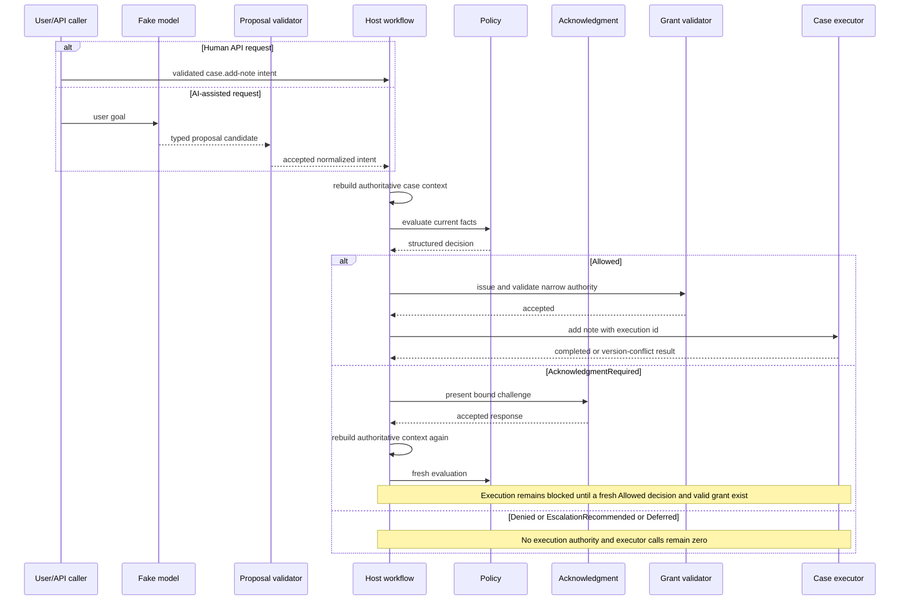
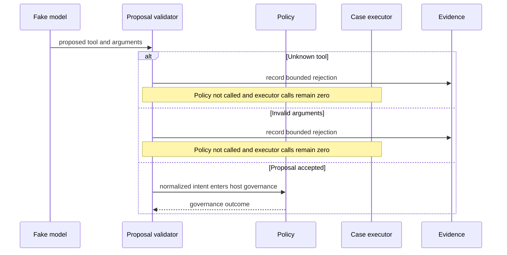
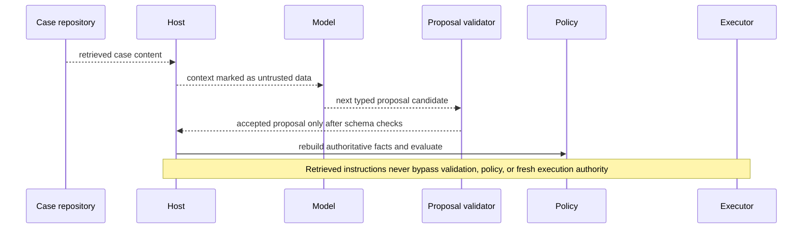

# AI-Assisted API and Governed Tool Gateway

**Learning objective:** Compare an ordinary human-originated API request with an AI-generated proposal for the same bounded semantic operation, identify the additional validation and trust boundaries introduced by AI, and preserve one host-owned governance and execution path for both.

**Pattern classification:** General learning material

**Difficulty:** Advanced

**Prerequisites:**

- **Recommended before this case:** [Governed AI Tool Gateway](../tutorials/governed-ai-tool-gateway.md), [Typed AI Proposed Intent and Schema-Validation Boundaries](../ai-integration/typed-ai-proposed-intent-and-schema-validation-boundaries.md), and [Scoped Capability and Host-Owned Execution](../tutorials/scoped-capability-and-host-owned-execution.md).
- **Optional depth:** [AI Proposal Rejection, Uncertainty, and Recovery Patterns](../ai-integration/ai-proposal-rejection-uncertainty-and-recovery-patterns.md), [AI Governance Observability and End-to-End Decision Tracing](../ai-integration/ai-governance-observability-and-end-to-end-decision-tracing.md), and [Secret Handling Across Trust Boundaries](../security/secret-handling-across-trust-boundaries.md).

**Estimated study time:** 35–50 minutes for the guided route through At a Glance, the side-by-side architecture, representative traces, and the simpler-architecture section. Allow roughly 95–115 minutes for a careful end-to-end read with the code, concurrency, disclosure, budget, and threat-model details.

## Before You Begin

This case uses one fictional semantic operation:

```text
case.add-note
```

A person can request it directly through a conventional API. An AI model can also propose it through a tool-style interface.

The operation is deliberately narrow. The host owns the meaning of `case.add-note`, the supported arguments, current case facts, governance policy, execution authority, downstream credentials, executor, and evidence.

Keep six terms distinct:

- **API request** — typed input submitted directly by an authenticated application caller.
- **AI proposal** — untrusted model-generated output suggesting a host-defined operation and arguments.
- **Proposal validation** — host-owned parsing, registry, schema, and semantic checks performed before governance.
- **Authoritative context** — current host-resolved facts used by policy rather than model assertions.
- **Scoped execution authority** — narrow, short-lived authority accepted immediately before the protected side effect.
- **Host-owned executor** — application-controlled code that alone holds the downstream capability or credential needed to perform the operation.

The central rule remains:

> **The model may propose. The host retains execution authority.**

---

## At a Glance

The human path can remain familiar:

```text
Human API request
        ↓
Request validation
        ↓
Host reconstructs authoritative context
        ↓
Host governance
        ↓
Scoped authority when required
        ↓
Host execution
```

The AI-assisted path adds an untrusted proposal boundary before the same host-owned operation lifecycle:

```text
User goal
   ↓
Model proposes typed operation
   ↓
Schema / tool / argument validation
   ↓
Host reconstructs authoritative context
   ↓
Host governance
   ↓
Acknowledgment if required
   ↓
Scoped authority
   ↓
Host execution
```

The important comparison is therefore not:

```text
Human architecture
        versus
AI architecture
```

It is:

```text
Human request ───────────────┐
                             ├─> shared host governance -> shared host executor
AI proposal -> validation ───┘
```

AI changes the ingress trust model. It does not need to replace ordinary application architecture downstream.

This case preserves four observable invariants:

| Condition | Observable boundary |
| --- | --- |
| Unknown tool | Governance is not reached; executor calls = `0` |
| Invalid arguments | Governance is not reached; executor calls = `0` |
| Valid proposal + policy `Denied` | No execution authority is issued; executor calls = `0` |
| Model context conflicts with host facts | Host facts win; the decision follows authoritative context |

All users, cases, model outputs, policies, credentials, and execution results are synthetic.

---

## 1. One Semantic Operation, Two Ingress Paths

Assume an internal case-management application exposes a bounded operation:

```text
case.add-note
```

The operation adds a typed note to a fictional case.

A conventional API might accept:

```http
POST /cases/case-204/notes
```

with a request such as:

```json
{
  "noteKind": "status-update",
  "noteText": "Customer confirmed the replacement address."
}
```

An AI-assisted interface may receive a user goal such as:

```text
Add a status note that the customer confirmed the replacement address.
```

A deterministic fake model can then propose:

```json
{
  "schemaVersion": 1,
  "proposalId": "proposal-a17",
  "modelId": "fake-case-assistant-v1",
  "toolName": "case.add-note",
  "arguments": {
    "caseId": "case-204",
    "noteKind": "status-update",
    "noteText": "Customer confirmed the replacement address."
  },
  "contextHints": {
    "tenant": "tenant-a",
    "caseState": "Open",
    "sensitivity": "Standard"
  }
}
```

The two requests can eventually produce the same normalized intent:

```csharp
public sealed record AddCaseNoteIntent(
    string RequestId,
    string ActorId,
    string CaseId,
    string NoteKind,
    string NoteText,
    string NoteDigest,
    string CanonicalizationVersion,
    RequestIngress Ingress,
    string? ProposalId,
    string CorrelationId);

public enum RequestIngress
{
    HumanApi,
    AiProposal
}
```

`NoteText` in the normalized intent is already canonical content. `NoteDigest` and `CanonicalizationVersion` travel with it so later policy, acknowledgment, authority, and execution stages do not silently recompute the binding under a different rule.

The AI path needs more validation before that intent is trustworthy enough to enter governance.

`ActorId` is always derived from the authenticated host principal or an explicitly validated delegation record. The proposal may never supply actor identity, tenant identity, roles, or an on-behalf-of relationship as authoritative facts. When an agent runs under a service principal on behalf of a person, preserve both identities and let host authorization/policy decide whether the delegation is valid for this operation.

The downstream operation does not need a second executor merely because AI helped propose it.

---

## 2. Keep the Responsibilities Separate

The case-study responsibilities remain distinct even when several are implemented in one ASP.NET Core application.

| Responsibility | Question in this case | Representative owner |
| --- | --- | --- |
| Architecture | Where do untrusted AI output, authoritative host facts, policy, authority, and execution meet? | Application architecture and documented request-to-execution flow |
| Implementation | How are API requests, AI proposals, validation, decisions, grants, and executors represented? | Host application code shown below |
| Operations | Who monitors inference failures, validation rates, dependencies, retries, and executor health? | Host operations/platform team |
| Security | Who authenticates users, protects credentials, validates trust boundaries, and limits downstream authority? | Host security controls and executor environment |
| Governance | Who decides whether the exact note operation may proceed under current facts? | Host-owned case-note policy |
| Execution | Who actually mutates the case system? | Host-owned `ICaseNoteExecutor` |

A useful set of non-equivalences is:

| Evidence or state | Does **not** establish |
| --- | --- |
| Authenticated caller | Current case-note policy allows this exact mutation |
| Schema-valid model proposal | Authoritative case context |
| Model confidence | Authorization |
| Human acknowledgment | Unlimited execution authority |
| Valid governance decision | Executor success |

---

## 3. Side-by-Side Architecture



The key architectural property is convergence.

The AI path adds a trust boundary before normalization. Once a valid intent exists, both ingress paths can reuse the same authoritative context builder, policy evaluator, acknowledgment logic, scoped-authority issuer, execution-boundary validator, and executor.

---

## 4. Define the Host-Owned Tool Contract

The model does not create executable tools dynamically.

The host owns a registry entry for the one supported teaching operation:

```csharp
public sealed record ToolDescriptor(
    string ToolName,
    IReadOnlySet<int> SupportedSchemaVersions,
    IReadOnlySet<string> RequiredArguments,
    IReadOnlySet<string> AllowedArguments,
    string GovernanceOperation,
    string ExecutionAudience);
```

A representative descriptor is:

```text
ToolName:                case.add-note
SupportedSchemaVersions: { 1 }
RequiredArguments:       caseId, noteKind, noteText
AllowedArguments:        caseId, noteKind, noteText
GovernanceOperation:     case.note.add
ExecutionAudience:       case-note-executor
```

The model may select only from the names the host exposes.

An invented name such as:

```text
case.delete
```

does not expand the host's executable surface.

The registry answers:

> **Does this host recognize this proposed semantic operation?**

It does not answer:

> **May this operation execute now?**

That later question belongs to governance and the execution boundary.

The different names in the descriptor are deliberate:

- `case.add-note` is the **AI-facing semantic tool name** exposed by the host registry.
- `case.note.add` is the **canonical governance operation identifier** used after ingress normalization.

A human API request and an AI proposal can therefore map to the same governance operation without requiring the external tool vocabulary to become the policy vocabulary. The same boundary applies whether the tool descriptor arrived through provider function/tool calling, an MCP-style tool catalog, or a host-specific registry: protocol metadata describes an offered operation; it does not create execution authority.

---

## 5. Treat Model Output as an Untrusted Proposal

A fake model output can be represented without any external AI dependency:

```csharp
public sealed record AiCaseToolProposal(
    int SchemaVersion,
    string ProposalId,
    string ModelId,
    string ToolName,
    IReadOnlyDictionary<string, string> Arguments,
    IReadOnlyDictionary<string, string> ContextHints,
    decimal? Confidence);
```

`ContextHints` is intentionally separate from arguments.

It may help explain what the model believed, but it is not policy context.

For example:

```text
ContextHints["caseState"] = "Open"
ContextHints["sensitivity"] = "Standard"
```

may be wrong even when the proposal is well-formed.

The host should not silently convert those hints into authoritative facts.

---

## 6. Validate Before Governance

The AI path has acceptance stages that the ordinary typed API path may not need.

| Stage | Question | Example rejection |
| --- | --- | --- |
| Structural parsing | Can the host read the representation? | invalid JSON |
| Schema version | Is this a supported proposal contract? | `schemaVersion = 99` |
| Tool registry | Is the proposed semantic operation registered? | `case.delete` |
| Argument shape | Are required fields present and unknown/nested fields rejected? | missing `caseId` or unexpected `arguments.extra` |
| Semantic validation | Are bounded raw values acceptable without looking up authoritative case state? | unsupported `noteKind` or raw note payload above the pre-canonicalization bound |

A compact validator might return a stage-aware rejection:

```csharp
public sealed record ProposalRejection(
    string ProposalId,
    string Stage,
    string ReasonCode,
    string CorrelationId);

public sealed record ValidatedCaseNoteProposal(
    string ProposalId,
    string ModelId,
    string CaseId,
    string NoteKind,
    string NoteText);

public sealed record ProposalValidationResult(
    bool Accepted,
    ValidatedCaseNoteProposal? Proposal,
    ProposalRejection? Rejection);
```

Representative stable reasons are:

```text
proposal.schema.unsupported-version
proposal.operation.unknown
proposal.schema.missing-argument
proposal.schema.unknown-argument
proposal.semantic.note-kind-unsupported
proposal.semantic.note-too-large
```

A rejection before authoritative host resolution or governance is not a policy denial.

Proposal validation in this case is intentionally local and deterministic. It does not perform repository I/O. After an accepted proposal is normalized, the shared host workflow resolves the case asynchronously, reconstructs authoritative context, and only then invokes policy.

Keeping the stage visible makes recovery and observability more truthful.

### Unknown tool

```csharp
if (!toolRegistry.TryGet(
        proposal.ToolName,
        out ToolDescriptor descriptor))
{
    return new ProposalValidationResult(
        Accepted: false,
        Proposal: null,
        Rejection: new ProposalRejection(
            proposal.ProposalId,
            Stage: "registry",
            ReasonCode: "proposal.operation.unknown",
            CorrelationId: correlationId));
}
```

The protected executor is unreachable from this branch.

### Invalid arguments

A host may require a coarse pre-canonicalization bound:

```text
caseId           = non-empty syntactically valid host identifier
noteKind         = one of status-update, internal-observation
raw note payload = at most 8 KiB UTF-8
unknown fields   = rejected
```

The exact values are illustrative.

Section 7 then applies the versioned canonicalization rule and enforces the authoritative semantic bound of `1..2,000` Unicode scalar values **after** canonicalization. That ordering matters because NFC composition and line-ending normalization can change length. The local validator protects the parser and normalization step from unbounded input; the canonicalizer owns the final content-length rule used by policy and execution.

The design requirement is that model output is bounded before it can become a typed intent or execution parameter.

---

## 7. Normalize Only Accepted Proposal Fields

After registry, schema, and semantic validation succeed, the host canonicalizes the accepted note exactly once and carries the binding in the same semantic intent used by the ordinary API path.

```csharp
public sealed record CanonicalCaseNote(
    string NoteText,
    string NoteDigest,
    string CanonicalizationVersion);

CanonicalCaseNote canonical =
    noteCanonicalizer.Canonicalize(
        validated.NoteKind,
        validated.NoteText);

AddCaseNoteIntent intent = new(
    RequestId: ids.NewRequestId(),
    ActorId: actor.SubjectId,
    CaseId: validated.CaseId,
    NoteKind: validated.NoteKind,
    NoteText: canonical.NoteText,
    NoteDigest: canonical.NoteDigest,
    CanonicalizationVersion: canonical.CanonicalizationVersion,
    Ingress: RequestIngress.AiProposal,
    ProposalId: proposal.ProposalId,
    CorrelationId: correlationId);
```

The human API adapter uses the same `noteCanonicalizer` before constructing its `AddCaseNoteIntent`; ingress type does not select a different content-binding rule.

`ActorId` above is copied only from `actor.SubjectId`, never from `proposal.Arguments` or `ContextHints`. The same rule applies to tenant, role, and delegation claims.

One illustrative `case-note-v1` rule is:

1. normalize Unicode to NFC;
2. convert CRLF and CR line endings to LF;
3. reject disallowed control/formatting characters, including bidirectional overrides, unless the application explicitly supports and safely renders them;
4. preserve otherwise significant whitespace rather than independently trimming or collapsing it at later stages; and
5. enforce the canonical semantic bound of `1..2,000` Unicode scalar values; and
6. compute `NoteDigest = SHA-256(UTF8("case-note-v1\n" + NoteKind + "\n" + NormalizedNoteText))`.

The exact canonicalization contract is application-specific. The invariant is that decision-time, acknowledgment-time, grant-time, and execution-time code consume the **carried `NoteDigest` and `CanonicalizationVersion` for the same versioned canonical bytes** instead of independently normalizing the note again.

Model rationale, confidence, and context hints do not need to enter the execution contract.

They can remain diagnostic inputs with their own retention and privacy rules when the application genuinely needs them.

This prevents an accidental transition such as:

```text
Model says case is low sensitivity
        ↓
Policy context says low sensitivity
```

without a host-owned lookup in between.

---

## 8. Reconstruct Authoritative Context in the Host

Both ingress paths should build current context from sources the host is prepared to trust for this decision.

```csharp
public sealed record AiMutationBudgetSnapshot(
    string BudgetKey,
    string Version,
    int Remaining);

public sealed record CaseNoteContext(
    AddCaseNoteIntent Intent,
    string ActorTenant,
    string CaseTenant,
    string CaseState,
    string Sensitivity,
    string CaseVersion,
    bool ActorMayWriteNotes,
    bool RequiresAcknowledgment,
    bool RequiresEscalation,
    AiMutationBudgetSnapshot? AiMutationBudget,
    string PolicyId,
    string PolicyVersion);
```

The host can resolve:

```text
Actor identity and tenant    <- authenticated principal / directory
Case tenant                  <- case repository
Case state                   <- case repository
Sensitivity                  <- authoritative case metadata
Case version                 <- authoritative case metadata
Write eligibility            <- host authorization/resource policy
Acknowledgment condition     <- current governance facts
Escalation condition         <- current governance facts
AI mutation budget           <- host-owned user/session/tenant budget store (AI ingress only)
Policy identity/version      <- host policy configuration
```

`AiMutationBudget` is a **snapshot of aggregate consequential-mutation attempt capacity**, not a retry counter. It is `null` for the ordinary human API path and non-null for AI ingress when this policy uses an aggregate mutation budget. `null` must never be interpreted as unlimited AI budget. Policy can inspect the snapshot, but authority issuance must later make an atomic budget claim before an AI grant becomes executable.

Do not resolve those facts from model context hints, model rationale, model confidence, or user prose repeated by the model.

For a shared or cross-tenant resource, the host must resolve the applicable ownership/delegation relationships from authoritative data and apply an explicit conflict policy. Do not let a model choose which tenant's rule wins. This case demonstrates the simple mismatch boundary; richer shared-resource conflict resolution belongs in a dedicated multi-tenant policy case study.

Resource lookup is part of this authoritative host stage, not the proposal validator. The lookup should also avoid creating an existence oracle. For an external caller or model, `case-204 does not exist`, `case-204 exists in another tenant`, and `the actor may not discover case-204` can intentionally collapse to a coarse response such as `CASE_OPERATION_NOT_PERMITTED`. Authorized internal evidence may retain the more precise cause when the threat model and retention policy permit it.

### Model facts conflict with host facts

Suppose the proposal carries:

```text
Model hint:
  caseState = Open
  sensitivity = Standard
```

but the host resolves:

```text
Authoritative host context:
  caseState = Closed
  sensitivity = Restricted
  caseVersion = cv-88
```

The policy evaluates the host facts.

The model does not receive authority to redefine the resource merely because its output is schema-valid.

---

## 9. Produce a Stable Structured Decision

A decision contract can remain identical for human and AI ingress:

```csharp
public enum CaseNoteOutcome
{
    Allowed,
    Denied,
    AcknowledgmentRequired,
    EscalationRecommended,
    Deferred
}

public static class CaseNoteReasonCodes
{
    public const string Allowed = "CASE_NOTE_ALLOWED";
    public const string TenantMismatch = "CASE_TENANT_MISMATCH";
    public const string Closed = "CASE_CLOSED";
    public const string RestrictedRequiresReview =
        "RESTRICTED_CASE_NOTE_REQUIRES_REVIEW";
    public const string AcknowledgmentRequired =
        "CASE_NOTE_REQUIRES_ACK";
    public const string ContextUnavailable =
        "CASE_CONTEXT_UNAVAILABLE";
    public const string AiMutationBudgetExhausted =
        "AI_MUTATION_BUDGET_EXHAUSTED";
}

public static class CaseNoteExternalReasonCodes
{
    public const string Allowed = "CASE_NOTE_ALLOWED";
    public const string OperationNotPermitted =
        "CASE_OPERATION_NOT_PERMITTED";
    public const string CaseClosed = "CASE_CLOSED";
    public const string ReviewRequired = "CASE_REVIEW_REQUIRED";
    public const string AcknowledgmentRequired =
        "CASE_NOTE_REQUIRES_ACK";
    public const string RateOrBudgetLimited =
        "CASE_RATE_OR_BUDGET_LIMITED";
    public const string ContextUnavailable =
        "CASE_CONTEXT_UNAVAILABLE";
}

public sealed record CaseNoteDecision(
    string DecisionId,
    CaseNoteOutcome Outcome,
    string ReasonCode,
    string PolicyId,
    string PolicyVersion,
    string CaseVersion,
    string NoteDigest,
    string CanonicalizationVersion,
    string? ContinuationConditionCode,
    DateTimeOffset EvaluatedAt,
    string CorrelationId)
{
    public bool CanIssueExecutionAuthority =>
        Outcome == CaseNoteOutcome.Allowed;
}
```

Control flow branches on `Outcome` and stable `ReasonCode` values rather than display text.

A representative policy matrix distinguishes the precise **internal decision reason** from the caller/model-facing reason an adapter may expose:

| Current authoritative condition | Outcome | Internal decision reason | Typical external reason | Executor reachable? |
| --- | --- | --- | --- | --- |
| Actor and case tenants match, case open, ordinary sensitivity | `Allowed` | `CASE_NOTE_ALLOWED` | `CASE_NOTE_ALLOWED` | Yes, after grant validation |
| Tenant mismatch | `Denied` | `CASE_TENANT_MISMATCH` | `CASE_OPERATION_NOT_PERMITTED` when resource discovery is sensitive | No |
| Case closed | `Denied` | `CASE_CLOSED` | `CASE_CLOSED` only when the caller is already allowed to know the case exists; otherwise `CASE_OPERATION_NOT_PERMITTED` | No |
| Restricted case requires review | `EscalationRecommended` | `RESTRICTED_CASE_NOTE_REQUIRES_REVIEW` | `CASE_REVIEW_REQUIRED` | No |
| Current condition requires explicit acceptance | `AcknowledgmentRequired` | `CASE_NOTE_REQUIRES_ACK` | `CASE_NOTE_REQUIRES_ACK` | No until acknowledgment and fresh re-evaluation |
| AI ingress aggregate mutation budget exhausted | `Denied` | `AI_MUTATION_BUDGET_EXHAUSTED` | `CASE_RATE_OR_BUDGET_LIMITED` | No |
| Required host fact unavailable | `Deferred` | `CASE_CONTEXT_UNAVAILABLE` with a host-owned continuation condition | `CASE_CONTEXT_UNAVAILABLE` | No |

`CaseNoteDecision.ReasonCode` is the authorized internal decision/evidence value. `CaseNoteResult.ReasonCode` is the external response value after disclosure-aware adaptation. Keeping those fields separate prevents a precise internal reason from accidentally becoming a resource-existence oracle.

Human and AI ingress use the **same evaluator and decision contract**, not necessarily the same outcome for every fact set. A policy may intentionally consume the trusted `Ingress` value or host-owned aggregate budget when AI-specific abuse/cost risk justifies it. What it may not do is treat model-supplied identity, tenant, case state, or policy claims as authoritative.

A useful policy-authoring rule is to keep precedence explicit: establish actor/resource eligibility and tenant boundaries first, handle missing authoritative facts as `Deferred`, apply consequence/risk conditions next, and apply AI-specific ingress or aggregate-budget constraints only from host-owned facts. Model confidence or rationale may be inputs only when policy deliberately defines them as probabilistic signals; they are never implicit allow conditions.

`EscalationRecommended` is a blocking outcome in this teaching contract: `CanIssueExecutionAuthority` is false and executor calls remain zero. An implementation that finds the name too advisory should prefer a less ambiguous local term such as `EscalationRequired` while preserving the same blocking semantics.

When tenant/resource existence is sensitive, adapt precise internal reasons before returning them to the caller/model. For example, `CASE_TENANT_MISMATCH` and an internal not-found reason can both map to `CaseNoteExternalReasonCodes.OperationNotPermitted` while authorized decision evidence retains the precise internal reason. `CaseNoteExternalReasonCodes` lists the teaching response vocabulary used by this case; a disclosure adapter still decides which value is safe for the current caller and resource-discovery context.

The representative traces in Sections 16–21 show the **authorized internal decision/evidence view**. A caller- or model-facing adapter may collapse those precise values before returning a response.

---

## 10. Acknowledgment Is a Host Workflow Boundary

An acknowledgment-required decision pauses the operation.

The host can issue a bound challenge such as:

```csharp
public sealed record CaseNoteAcknowledgmentChallenge(
    string AcknowledgmentId,
    string DecisionId,
    string ActorId,
    string CaseId,
    string CaseVersion,
    string NoteDigest,
    string CanonicalizationVersion,
    string Audience,
    string ReasonCode,
    DateTimeOffset ExpiresAt);
```

`NoteDigest` represents the exact canonical note content without requiring the durable acknowledgment record to retain the note body. A previous acceptance cannot be replayed for different text because any content change produces a different digest.

Bind the acknowledgment at least to `DecisionId + ActorId + CaseId + CaseVersion + NoteDigest + CanonicalizationVersion + Audience + ExpiresAt`. Inside one trusted host, an opaque `AcknowledgmentId` backed by durable server-side state can provide that binding. If a portable acknowledgment artifact crosses a trust boundary, sign or MAC the complete canonical binding with host-owned key material and verify it before use. Conceptually:

```text
ackPayload = decisionId || actorId || caseId || caseVersion
             || noteDigest || canonicalizationVersion
             || audience || expiresAt
ackProof   = SignOrMac(hostAcknowledgmentKey, ackPayload)
```

A proof from another note body, canonicalization version, destination audience, actor, or resource version must fail verification rather than being treated as a reusable approval.

The human-facing display is a separate security concern from the digest. Render the **same normalized value** the digest covers, avoid silent truncation, expose or reject invisible/bidirectional control characters, and do not let a beautified or transformed preview become the thing the user accepts while different bytes are executed. Homoglyphs and other deceptive text may justify stronger UI confirmation for higher-consequence note kinds.

An accepted acknowledgment does not transform the earlier decision into execution authority.

The continuation path is:

```text
Acknowledgment accepted
        ↓
Rebuild authoritative context
        ↓
Verify case version / note digest / actor
        ↓
Re-evaluate current policy
        ↓
Allowed only if current facts permit
        ↓
Issue fresh scoped authority
```

This is especially important for AI-assisted operations because the user may be acknowledging a consequence of a model-proposed action rather than manually typing the exact underlying operation.

The acknowledgment UI should therefore present the case reference, operation, note kind, exact normalized note preview, consequence, expiry, and the fact that AI proposed the action when relevant. Model rationale may be shown as clearly labeled context, but it is not the source of truth for what will execute.

---

## 11. Issue Narrow Authority for the Exact Operation

An allowed decision can produce narrow execution authority:

```csharp
public sealed record CaseNoteGrant(
    string GrantId,
    string DecisionId,
    string ActorId,
    string Operation,
    string CaseId,
    string CaseVersion,
    string NoteKind,
    string NoteDigest,
    string CanonicalizationVersion,
    string Audience,
    string PolicyId,
    string PolicyVersion,
    string CorrelationId,
    string? AiMutationBudgetClaimId,
    DateTimeOffset NotBefore,
    DateTimeOffset ExpiresAt,
    int MaxUses);
```

A representative grant is bound to:

```text
operation      = case.note.add
caseId         = case-204
caseVersion    = cv-41
noteKind       = status-update
noteDigest     = SHA-256 of case-note-v1 canonical bytes
canonicalization = case-note-v1
actor          = analyst-17
audience       = case-note-executor
policy         = case-note-policy / 2.3
notBefore      = issuer time
expiresAt      = short lifetime
maxUses        = 1
aiBudgetClaim  = budget-claim-77 (AI ingress only)
```

The grant does not carry a downstream API key or database password.

It is application-level continuation authority, not a copy of infrastructure credentials.

If the note changes after the decision, its digest changes and the old grant is no longer valid for the new content.

The record above describes grant semantics, not a safe portable wire format by itself. In a single trusted process, the simplest representation can be an opaque `GrantId` backed by a protected server-side grant store. If authority crosses an untrusted process or network boundary, use an integrity-protected representation (for example a signed/MACed token or an opaque reference resolved by the verifier) and validate issuer, audience, scope, lifetime, resource version, digest, revocation, and use state.

For this case, `MaxUses = 1` means **one logical execution claim**, not one TCP/HTTP transport attempt. The execution-boundary store performs an atomic transition such as:

```text
Issued
  ↓ claim GrantId with ExecutionId
Claimed(ExecutionId)
  ├── confirmed success ───────> Completed
  ├── confirmed no-write fail ─> FailedNoWrite
  └── uncertain outcome ───────> Ambiguous
                                  ├── reconcile success ─> Completed
                                  └── reconcile no-write -> FailedNoWrite
```

`FailedNoWrite` is terminal for that grant. Even when the downstream system proves that no note was written, the old authority is not reset to `Issued`; a new mutation attempt requires fresh context, a fresh decision, and fresh authority. A different `ExecutionId` attempting to reuse the grant is replay and is rejected. A retry carrying the **same** `ExecutionId` after an ambiguous downstream timeout is handled as idempotent retry/reconciliation of the already-claimed logical execution rather than consuming a second grant. Revocation or expiry blocks an unclaimed grant; claimed-but-ambiguous work must be reconciled before another mutation is attempted.

### Atomically claim aggregate AI mutation budget

For AI ingress, the allowed policy decision is still only a snapshot. Before the grant becomes executable, the authority issuer atomically claims one unit from the host-owned budget store using the `AiMutationBudgetSnapshot.BudgetKey` and `Version`.

```text
Policy observes budget remaining = 1
        ↓
Authority issuer performs compare-and-set claim
        ├── claim succeeds -> persist AiMutationBudgetClaimId on grant
        └── claim loses race -> no executable grant; rebuild context/re-evaluate
```

Two concurrent proposals that both observed `Remaining = 1` therefore cannot both receive executable authority. A lost budget race does not rewrite the historical policy decision; it prevents grant activation and forces the host to rebuild current context before any new decision. The budget claim is durable and correlated to the `GrantId`.

This teaching policy charges the aggregate slot once protected execution begins. A confirmed `FailedNoWrite` therefore **does not refund the slot**: the executor was invoked under real authority even though the downstream mutation did not commit. Release is permitted only when the host can prove that protected execution never began—for example, the grant or budget activation failed before executor invocation—and the budget policy explicitly permits refunding that reservation. An ambiguous executor outcome is **not** grounds to release the claim; reconcile first.

The ordinary human API path has `AiMutationBudget = null` and no AI-budget claim. If the application also wants a human mutation quota, model it as its own explicit host-owned budget rather than overloading the AI-specific field.

---

## 12. Keep Credentials Behind the Host-Owned Executor

The model should not receive:

```text
case database credential
service access token
administrator API key
connection string
private signing key
raw bearer capability for another system
```

The execution-boundary validator should consume/claim the grant and pass the executor only a host-internal validated command:

```csharp
public sealed record ValidatedCaseNoteExecution(
    string ExecutionId,
    string GrantId,
    string CaseId,
    string ExpectedCaseVersion,
    string NoteKind,
    string NoteText,
    string NoteDigest,
    string CanonicalizationVersion);

public sealed record CaseNoteExecutionResult(
    string ResultCode,
    string ObservedCaseVersion);

public interface ICaseNoteExecutor
{
    Task<CaseNoteExecutionResult> AddNoteAsync(
        ValidatedCaseNoteExecution command,
        CancellationToken cancellationToken);
}
```

The executor does not accept a raw grant because the grant validator is the execution-authority boundary in this specimen. It accepts only the command produced after integrity, scope, freshness, replay/use-state, digest, actor, audience, canonicalization-version, and current-resource checks succeed. Carrying `CanonicalizationVersion` lets the boundary or executor verify which canonical rule produced the digest rather than assuming the newest local rule.

A concrete executor can obtain downstream credentials only inside that protected runtime boundary:

```csharp
public async Task<CaseNoteExecutionResult> AddNoteAsync(
    ValidatedCaseNoteExecution command,
    CancellationToken cancellationToken)
{
    ShortLivedCredential credential =
        await credentialProvider.GetCaseWriterAsync(cancellationToken);

    return await caseClient.AddNoteIfVersionMatchesAsync(
        credential,
        caseId: command.CaseId,
        expectedVersion: command.ExpectedCaseVersion,
        noteKind: command.NoteKind,
        noteText: command.NoteText,
        idempotencyKey: command.ExecutionId,
        cancellationToken);
}
```

The short-lived credential is never returned to validation, policy, acknowledgment, the model, or ordinary telemetry. Prefer workload identity or another non-exported credential mechanism when the platform supports it.

`AddNoteIfVersionMatchesAsync` is also the final optimistic-concurrency guard. A grant check immediately before execution reduces stale-state risk, but it cannot eliminate the race between the check and the mutation. The protected mutation must atomically compare the expected `CaseVersion` (for example through a row version, ETag/`If-Match`, or transactional compare-and-set) and reject a mismatch without adding the note. If the downstream system cannot provide an equivalent atomic precondition, the architecture cannot claim the same TOCTOU protection and should document the weaker guarantee.

That infrastructure authority is not exposed to the model, proposal object, policy evaluator, acknowledgment response, or ordinary telemetry.

This prevents a common confused-deputy collapse:

```text
Model can describe an operation
        ↓
Therefore model can wield the executor's infrastructure authority
```

The correct relationship is:

```text
Model proposes
        ↓
Host validates and governs
        ↓
Host issues narrow application authority
        ↓
Host executor uses its separately protected infrastructure authority
```

For the broader secret lifecycle, see [Secret Handling Across Trust Boundaries](../security/secret-handling-across-trust-boundaries.md).

---

## 13. Reuse One Downstream Orchestrator

The two ingress paths can converge before authoritative context and governance.

A minimal result envelope keeps proposal rejection distinct from a governance decision:

```csharp
public sealed record ReasonDisclosureContext(
    bool MayDiscloseResourceExistence);

public interface ICaseNoteReasonDisclosureAdapter
{
    string ToExternalReasonCode(
        CaseNoteDecision decision,
        ReasonDisclosureContext disclosureContext);
}

public sealed record CaseNoteResult(
    bool AcceptedByIngress,
    string ReasonCode,
    CaseNoteDecision? Decision)
{
    public static CaseNoteResult Rejected(string reasonCode) =>
        new(false, reasonCode, null);

    public static CaseNoteResult FromDecision(
        CaseNoteDecision decision,
        string externalReasonCode) =>
        new(
            true,
            externalReasonCode,
            decision);
}
```

`AcceptedByIngress = true` means the request/proposal passed its ingress validation boundary. It does **not** mean governance allowed execution; inspect `Decision.Outcome` for that result.

The external reason is intentionally required. There is no fallback to `decision.ReasonCode`, because omission must not silently turn a precise internal reason such as `CASE_TENANT_MISMATCH` into a caller-visible resource-existence oracle. The shared workflow obtains the external value from `ICaseNoteReasonDisclosureAdapter` (or an equivalent explicit adapter) before constructing `CaseNoteResult`; forgetting that step should be a compile-time error rather than a fail-open disclosure default.

### Human API path

```csharp
public Task<CaseNoteResult> AddNoteFromApiAsync(
    AddCaseNoteRequest request,
    AuthenticatedActor actor,
    CancellationToken cancellationToken)
{
    AddCaseNoteIntent intent = apiValidator.NormalizeAndCanonicalize(
        request,
        actor,
        correlationId: ids.NewCorrelationId());

    return caseNoteWorkflow.ExecuteAsync(
        intent,
        cancellationToken);
}
```

### AI proposal path

```csharp
public async Task<CaseNoteResult> AddNoteFromAiAsync(
    AiCaseToolProposal proposal,
    AuthenticatedActor actor,
    CancellationToken cancellationToken)
{
    string correlationId = ids.NewCorrelationId();

    ProposalValidationResult validation =
        proposalValidator.Validate(
            proposal,
            correlationId);

    if (!validation.Accepted)
    {
        await evidence.RecordProposalRejectionAsync(
            validation.Rejection,
            cancellationToken);

        return CaseNoteResult.Rejected(
            validation.Rejection.ReasonCode);
    }

    AddCaseNoteIntent intent = intentNormalizer.NormalizeAndCanonicalize(
        validation.Proposal!,
        actor,
        correlationId);

    return await caseNoteWorkflow.ExecuteAsync(
        intent,
        cancellationToken);
}
```

The synchronous proposal validator stops after local contract/semantic checks. The shared `caseNoteWorkflow` then performs any repository/directory I/O and evaluates policy. Before returning a governance result it must obtain an explicit disclosure-safe code—for example `reasonDisclosure.ToExternalReasonCode(decision, disclosureContext)`—and call `CaseNoteResult.FromDecision(decision, externalReasonCode)`. It owns:

```text
current context
policy evaluation
acknowledgment routing
scoped-authority issuance
execution-boundary validation
host executor invocation
decision/execution evidence
```

This is the main architectural lesson of the case.

AI adds an ingress adapter and trust boundary. It does not require duplicating the protected operation lifecycle.

---

## 14. Shared Host-Owned Sequence



Rejected AI proposals do not enter this shared sequence at all.

They stop at the proposal-validation boundary.

---

## 15. Rejected Proposal Sequence



The diagram deliberately distinguishes proposal rejection from policy denial.

That distinction improves both recovery behavior and operational diagnosis.

---

## 16. Representative Trace A — Human API Request Allowed

```text
Ingress:          HumanApi
CorrelationId:    corr-human-001
RequestId:        req-1001
ProposalId:       none
Actor:            analyst-17
Operation:        case.note.add
Case:             case-204
CaseVersion:      cv-41
CaseState:        Open
Sensitivity:      Standard
Policy:           case-note-policy / 2.3
Decision:         Allowed
ReasonCode:       CASE_NOTE_ALLOWED
GrantId:          grant-1001
ExecutionId:      exec-1001
Executor calls:   1
Result:           synthetic note added
```

Nothing about this path requires AI.

It is an ordinary governed API operation.

---

## 17. Representative Trace B — Valid AI Proposal Allowed

The deterministic fake model emits:

```text
Tool:             case.add-note
caseId:           case-204
noteKind:         status-update
noteText:         Customer confirmed the replacement address.
Model hint state: Open
Model hint class: Standard
```

The host observes:

```text
Tool registered:      yes
Schema valid:         yes
Arguments valid:      yes
Case resolved:        case-204
Host case state:      Open
Host sensitivity:     Standard
Host case version:    cv-41
Policy:               case-note-policy / 2.3
Decision:             Allowed
Grant validation:     accepted
Executor calls:       1
```

The execution result is possible because the host accepted, reconstructed, governed, and authorized the operation.

The model's successful proposal is not itself the authority.

---

## 18. Representative Trace C — Unknown Tool Rejected

The fake model emits:

```text
Tool: case.delete
```

The host registry does not expose that tool.

```text
Stage:           registry
ReasonCode:      proposal.operation.unknown
Policy calls:    0
Grant issuance:  0
Executor calls:  0
```

The host may provide bounded corrective feedback or terminate the AI attempt according to a recovery policy.

It should not dynamically register `case.delete` because the model asked for it.

---

## 19. Representative Trace D — Invalid Arguments Rejected

The fake model emits:

```text
Tool:      case.add-note
caseId:    case-204
noteKind:  arbitrary-shell-command
noteText:  synthetic text
```

The semantic validator rejects `noteKind` before governance:

```text
Stage:           semantic-validation
ReasonCode:      proposal.semantic.note-kind-unsupported
Policy calls:    0
Grant issuance:  0
Executor calls:  0
```

A syntactically valid proposal is still not necessarily a semantically valid host request.

---

## 20. Representative Trace E — Host Facts Override Model Context

The fake model emits a schema-valid proposal and hints:

```text
caseId:                 case-311
model caseState:        Open
model sensitivity:      Standard
model confidence:       0.98
```

The host resolves:

```text
caseId:                 case-311
host caseState:         Closed
host sensitivity:       Restricted
host caseVersion:       cv-88
```

The policy returns:

```text
Outcome:        Denied
ReasonCode:     CASE_CLOSED
Grant issuance: 0
Executor calls: 0
```

The high confidence value does not change the result.

The model's context hint is useful only as evidence of what it believed, not as authority over the case record.

---

## 21. Representative Trace F — Acknowledgment Required

The model emits a valid proposal for `case-509`.

The host resolves a current condition that requires explicit acceptance before a note can be added.

Initial decision:

```text
DecisionId:       dec-509-a
Outcome:          AcknowledgmentRequired
ReasonCode:       CASE_NOTE_REQUIRES_ACK
CaseVersion:      cv-12
Grant issuance:   0
Executor calls:   0
```

The host presents a bound acknowledgment describing the exact case, note kind, consequence, and note digest.

After acceptance:

```text
AcknowledgmentId:   ack-509
Bound DecisionId:   dec-509-a
Bound ActorId:      analyst-17
Bound CaseVersion:  cv-12
Bound NoteDigest:   digest-note-509
Bound Audience:     case-note-ack-v1
```

The host then rebuilds context.

If the case is still `cv-12` and policy now permits continuation:

```text
Fresh DecisionId: dec-509-b
Outcome:          Allowed
GrantId:          grant-509
ExecutionId:      exec-509
Executor calls:   1
```

If the case changed to `cv-13`, the acknowledgment is stale for the current resource state. The host fails closed for that continuation: no grant is issued and the executor remains at zero calls. It records the stale-binding condition, rebuilds current context, and starts a fresh policy evaluation. Only the new decision may determine whether the request is denied, deferred, escalated, allowed, or requires a new acknowledgment.

---

## 22. Correlate Proposal, Decision, Authority, and Execution

AI-assisted operations have one additional identity layer that ordinary API requests may not have: the proposal.

A shared correlation contract can make both paths observable:

```csharp
public sealed record CaseNoteEvidenceCorrelation(
    string CorrelationId,
    string RequestId,
    string? ProposalId,
    string? ModelId,
    string DecisionId,
    string? GrantId,
    string? ExecutionId,
    string PolicyId,
    string PolicyVersion,
    string CaseVersion,
    DateTimeOffset EvaluatedAt,
    RequestIngress Ingress);
```

Future identifiers remain `null` until those lifecycle stages actually exist.

For a proposal rejected before governance, use a separate rejection receipt because there is no decision yet:

```csharp
public sealed record AiProposalRejectionReceipt(
    string CorrelationId,
    string ProposalId,
    string ModelId,
    string Stage,
    string ReasonCode,
    DateTimeOffset RejectedAt);
```

This preserves temporal truth:

```text
Rejected at registry
        ≠
Governance decision Denied
```

`CaseEvidenceRef` below is an opaque/pseudonymous evidence reference issued by the host evidence layer; it is not the case payload and does not have to expose a tenant-sensitive resource identifier.

```csharp
public readonly record struct CaseEvidenceRef(string Value);
```

A decision receipt for an accepted request or proposal may preserve:

```text
CorrelationId
RequestId
ProposalId
ModelId
DecisionId
Ingress
Operation
CaseEvidenceRef
CaseVersion
NoteDigest
CanonicalizationVersion
PolicyId
PolicyVersion
Outcome
ReasonCode
ContinuationConditionCode
EvaluatedAt
```

A grant receipt adds:

```text
GrantId
Audience
NotBefore
ExpiresAt
MaxUses
NoteDigest
CanonicalizationVersion
```

An execution receipt adds:

```text
ExecutionId
GrantId
Executor identity
ResultCode
CompletedAt
```

The proposal ID explains which generated candidate entered the host boundary.

The decision ID explains what governance concluded.

The grant ID explains what narrow continuation authority existed.

The execution ID explains which protected attempt occurred.

For deeper tracing guidance, see [AI Governance Observability and End-to-End Decision Tracing](../ai-integration/ai-governance-observability-and-end-to-end-decision-tracing.md).

---

## 23. Keep Telemetry Observational

Useful operational fields may include:

```text
correlation id
request id
proposal id
model id
tool name
validation stage
AI goal / attempt counter
rate-limit or mutation-budget disposition
governance outcome
reason code
policy version
grant id
execution id
executor invocation count
```

Do not automatically record:

```text
raw prompts
entire conversation history
model rationale
case-note body
case protected content
credentials
access tokens
raw grant material
full downstream responses
```

Those values can carry sensitive data, authority, or unnecessary retention risk.

A safe trace can prove:

```text
proposal.operation.unknown
        ↓
policy calls = 0
executor calls = 0
```

without storing the entire prompt that caused the proposal.

Telemetry records what happened.

Telemetry does not authorize the next step.

### Diagnostic redaction baseline

Treat free-form and high-entropy AI fields as **redact-by-default** in ordinary diagnostics. A practical field policy is:

- allowlist low-cardinality fields such as tool name, schema version, validation stage, outcome, reason code, and bounded counters;
- redact raw prompt text, rationale, note content, retrieved text, tool-result bodies, bearer values, and arbitrary unknown arguments;
- when correlation across repeated opaque values is genuinely useful, prefer a keyed HMAC fingerprint plus a length/bucket classification instead of logging the raw value or an unhashed prefix/suffix;
- do not rely on entropy detection alone—field/schema classification is primary, with entropy/secret scanners as defense in depth; and
- route exceptional raw diagnostic capture, if ever justified, to a separately access-controlled, short-retention break-glass sink rather than normal application logs.

This keeps prompt and tool diagnostics useful without turning observability into a second store for secrets, personal data, or adversarial instructions.

---

## 24. Use a Deterministic Fake Model

The case does not need an external AI service.

A deterministic fake makes the boundary testable:

```csharp
public sealed class FakeCaseAssistant
{
    private readonly Queue<AiCaseToolProposal> proposals;

    public FakeCaseAssistant(
        IEnumerable<AiCaseToolProposal> proposals)
    {
        this.proposals = new Queue<AiCaseToolProposal>(proposals);
    }

    public Task<AiCaseToolProposal> ProposeAsync(
        string userGoal,
        CancellationToken cancellationToken)
    {
        if (proposals.Count == 0)
        {
            throw new InvalidOperationException(
                "No deterministic proposal was configured.");
        }

        return Task.FromResult(proposals.Dequeue());
    }
}
```

The user goal is intentionally not interpreted by the fake.

Tests decide exactly which model output appears next.

That allows the architecture to be exercised without:

```text
network access
provider credentials
non-deterministic inference
model-version drift
usage cost
external retention concerns
```

The case is about what the host does **after** a model proposes an operation.

A minimal runnable fixture for this architecture would need only a few fakes around the host workflow:

```text
FakeCaseRepository          -> authoritative case/version facts
FakePolicy                  -> deterministic decision outcomes
FakeGrantIssuer/Store       -> scoped authority + atomic claim/replay state
FakeAiMutationBudgetStore   -> versioned aggregate-budget snapshots/claims
FakeCaseNoteExecutor        -> invocation/result/idempotency observations
FakeCaseAssistant           -> deterministic proposals
```

This case intentionally stays with one semantic mutation. Sequential/multi-tool plans should not inherit authority from an accepted plan or prior step; each consequential step should re-enter current validation, context, policy, and execution-authority checks. See [Governed Multi-Tool Workflows and Recovery Boundaries](../ai-integration/governed-multi-tool-workflows-and-recovery-boundaries.md) for that lifecycle.

It is not a model-quality benchmark.


---

## 25. Test the Execution Invariant

A rejected proposal should prove the protected executor was unreachable.

### Unknown tool

```csharp
CaseNoteResult result = await gateway.AddNoteFromAiAsync(
    unknownToolProposal,
    actor,
    CancellationToken.None);

Assert.Equal(
    "proposal.operation.unknown",
    result.ReasonCode);

Assert.Equal(0, fakePolicy.InvocationCount);
Assert.Equal(0, fakeGrantIssuer.IssuedGrants.Count);
Assert.Equal(0, fakeExecutor.Invocations.Count);
```

### Invalid arguments

```csharp
CaseNoteResult result = await gateway.AddNoteFromAiAsync(
    invalidArgumentsProposal,
    actor,
    CancellationToken.None);

Assert.Equal(
    "proposal.semantic.note-kind-unsupported",
    result.ReasonCode);

Assert.Equal(0, fakePolicy.InvocationCount);
Assert.Empty(fakeExecutor.Invocations);
```

### Policy denial

```csharp
CaseNoteResult result = await gateway.AddNoteFromAiAsync(
    validProposalForClosedCase,
    actor,
    CancellationToken.None);

Assert.True(result.AcceptedByIngress);

CaseNoteDecision decision =
    Assert.IsType<CaseNoteDecision>(result.Decision);

Assert.Equal(CaseNoteOutcome.Denied, decision.Outcome);
Assert.Equal(CaseNoteReasonCodes.Closed, decision.ReasonCode);
Assert.Equal(0, fakeGrantIssuer.IssuedGrants.Count);
Assert.Equal(0, fakeExecutor.Invocations.Count);
```

### Model/host context conflict

```csharp
Assert.Equal("Open", proposal.ContextHints["caseState"]);
Assert.Equal("Closed", fakeCaseRepository.ResolvedCase.State);
Assert.Equal(CaseNoteReasonCodes.Closed, decision.ReasonCode);
Assert.Empty(fakeExecutor.Invocations);
```

The test does not need to prove that the model was malicious or mistaken.

It proves that model claims do not outrank the host's authoritative resource state.

---

## 26. Test the Allowed Path Too

The allowed path should prove exactly one transition into protected execution:

```csharp
CaseNoteResult result = await gateway.AddNoteFromAiAsync(
    validProposal,
    actor,
    CancellationToken.None);

Assert.True(result.AcceptedByIngress);

CaseNoteDecision decision =
    Assert.IsType<CaseNoteDecision>(result.Decision);

Assert.Equal(CaseNoteOutcome.Allowed, decision.Outcome);
Assert.Single(fakeGrantIssuer.IssuedGrants);
Assert.Single(fakeExecutor.Invocations);
```

Additional useful assertions include:

- the grant audience is `case-note-executor`;
- the grant binds the current `CaseVersion`;
- the grant binds the normalized `NoteDigest`;
- expired authority is rejected before execution;
- reuse of a one-use grant under a different `ExecutionId` is rejected, while the same `ExecutionId` follows the documented idempotent reconciliation path;
- changed note content invalidates the old grant;
- changed case version forces fresh evaluation;
- acknowledgment acceptance alone never invokes the executor;
- raw credentials never appear in proposal, decision, grant receipt, or telemetry structures;
- two concurrent requests using `CaseVersion = cv-41` cannot both mutate the case when the executor uses atomic optimistic concurrency;
- the second request observes a version conflict, performs no blind retry, and must rebuild context/re-evaluate before any later mutation;
- a nested unknown argument such as `arguments.extra.bypassApproval` is rejected before normalization;
- an exhausted AI mutation/re-plan budget blocks further model-driven mutation even when an individual proposal would otherwise be valid;
- two concurrent AI grants that observe one remaining aggregate-mutation slot cannot both claim it;
- `NoteDigest` and `CanonicalizationVersion` are carried from normalized intent through decision, acknowledgment, grant, and validated execution without silent recomputation;
- a confirmed `FailedNoWrite` grant is terminal, consumes the already-started AI aggregate-attempt slot under this teaching policy, and requires fresh governance before a later mutation attempt; and
- cross-tenant/not-found external responses can collapse to `CaseNoteExternalReasonCodes.OperationNotPermitted` while authorized internal evidence retains its precise reason.

---

## 27. Recovery, Uncertainty, and Partial Failure

Rejected AI proposals may be recoverable, but recovery policy belongs to the host. Keep the failed stage visible and choose a bounded response:

| Condition | Representative host response |
| --- | --- |
| Unknown tool | bounded re-plan using registered tools or terminate |
| Missing/invalid argument | bounded correction if the contract permits it |
| Ambiguous case | request human disambiguation rather than guess |
| Policy `Denied` | normally terminate this proposal |
| `AcknowledgmentRequired` | enter the host-owned acknowledgment workflow |
| `Deferred` | wait for the stated fact or condition |
| Expired/replayed grant | do not execute and re-evaluate only if the workflow permits |

Avoid an unbounded loop where repeated model attempts gradually search for a way around a host boundary. A later proposal receives no broader authority merely because earlier proposals failed.

### Host-owned AI ingress, re-plan, and mutation limits

Keep three controls distinct:

| Control | Enforced when | Primary purpose |
| --- | --- | --- |
| AI ingress rate limit | before expensive parsing/inference work | protect service capacity and constrain abusive request volume |
| Model/re-plan budget | before each additional inference/re-plan | bound cost and loop depth for one user goal |
| Aggregate mutation budget | during governance and atomically at authority issuance | bound consequential state change across proposals |

Use host-owned counters before invoking the model and when deciding whether another proposal is allowed. Illustrative—not universal—limits might be:

```text
max re-plans per user goal = 2
backoff after rejected re-plan = 250 ms, then 500 ms
max mutating proposals per goal/session = host-defined bounded value
```

Stable stage codes can make the stop observable without disclosing hidden policy details:

```text
ai.ingress.rate-limited
ai.replan.budget-exhausted
ai.mutation-budget.exhausted
```

Track rolling rates of `proposal.operation.unknown`, schema failures, resource-probing failures, and repeated near-equivalent proposals. Repeated abuse can terminate the goal/session or trigger a stronger host review path. Do not return the model a detailed inventory of hidden tools, tenant/resource existence, or the exact threshold it is probing.

Per-request validity is not enough. A model that proposes 400 individually valid `case.add-note` mutations can still create unacceptable aggregate behavior. Treat user/session/tenant mutation-attempt budgets as **authoritative governance inputs**, and use the atomic budget-claim transition in Section 11 before an AI grant becomes executable. Under this teaching policy, a slot remains consumed once protected execution begins even if that attempt later reaches `FailedNoWrite`. A proposal can therefore be structurally valid and individually allowable yet still be blocked because another concurrent proposal consumed the last aggregate slot.

Transport rate limiting and governance budgets solve different problems: transport controls protect ingress capacity; aggregate mutation-attempt budgets constrain how many consequential execution attempts the host will authorize over a wider goal/session/time window, including attempts that may or may not ultimately commit state.

Model confidence remains separate from authority. A value such as `0.98` may be useful diagnostic or probabilistic input if policy explicitly consumes it, but it does not establish actor identity, case ownership, case state, sensitivity, policy permission, or execution authority.

Execution failure is also separate from governance failure. For example:

```text
Decision = Allowed
Grant accepted
Executor called
Downstream case service times out
```

The historical decision remains `Allowed`. Because `case.add-note` can create duplicates, use a stable `ExecutionId` as the downstream idempotency key when supported.

The one-use grant and retry semantics must agree:

1. The grant store atomically claims `GrantId` for one logical `ExecutionId` before the first protected attempt.
2. A second attempt with a different `ExecutionId` is a replay and is rejected.
3. A retry/reconciliation using the same `ExecutionId` does **not** create new authority; it asks the downstream system whether the already-authorized logical mutation completed.
4. If the first outcome is ambiguous, query/reconcile by `ExecutionId` before sending another mutation request. If the downstream service cannot provide idempotency or reconciliation, fail closed and require explicit operational recovery rather than guessing.
5. If the downstream system confirms a hard failure with **no write**, mark the claim `FailedNoWrite`; do not reset or reuse the old grant. A later attempt starts from fresh context and policy.

### Optimistic concurrency and TOCTOU

`CaseVersion` must survive all the way to the protected mutation. Two concurrent proposals can both be evaluated against `cv-41`; only one may successfully perform an atomic `expectedVersion = cv-41` write. The losing attempt receives a version-conflict result and must not simply retry the same note under a new version. It rebuilds authoritative context and re-enters policy first.

The same rule handles the smaller race between grant validation and executor invocation: if the case changes after validation but before the write, the executor's atomic version precondition rejects the mutation. A pre-execution version check without an atomic conditional write is insufficient to close that race.

When the orchestrator, grant store, budget store, and executor live in different processes or services, do not replace these atomic state transitions with an in-memory mutex. Prefer durable compare-and-set/transaction semantics in the authoritative store. A distributed lease can reduce duplicate work or contention, but it should not be the sole correctness primitive. If a lease is used, give it a bounded TTL and a monotonic fencing token/lease generation that the executor or authoritative data store rejects when stale. Losing or expiring a lock must never make an old decision, budget snapshot, or grant valid again.

Evidence failure has its own recovery semantics:

1. Record required decision evidence before issuing execution authority. If required durable decision evidence cannot be recorded, fail closed before execution.
2. Invoke the executor only after current authority is accepted.
3. Record execution evidence after the attempt.
4. If execution succeeds but the receipt write fails, retry or reconcile the evidence operation rather than automatically executing `case.add-note` again.
5. When cross-system atomicity matters, use an explicit outbox, pending-evidence state, idempotent downstream operation, or another design that matches the actual system.

The case does not assume that governance storage and the downstream case system participate in one transaction.

A `Deferred` result should identify a host-owned continuation condition rather than leaving the wait implicit. For example:

```text
Outcome:                   Deferred
ReasonCode:                CASE_CONTEXT_UNAVAILABLE
ContinuationConditionCode: await.case-classification
Grant issuance:            0
Executor calls:            0
```

The host resumes only after that condition is satisfied, rebuilds current context, and evaluates again. The old `Deferred` decision never becomes authority merely because time passed.

This teaching operation is intentionally short-lived. If a real operation becomes long-running or requires rollback/compensation, authorize the start/claim explicitly and treat later consequential compensating actions as their own host-owned operations rather than assuming the original grant authorizes an indefinite workflow.

For the fuller recovery model, see [AI Proposal Rejection, Uncertainty, and Recovery Patterns](../ai-integration/ai-proposal-rejection-uncertainty-and-recovery-patterns.md).

---

## 28. AI-Specific Security Questions

The AI ingress adds threats that the ordinary typed API path may not have to handle in the same way.

### Prompt injection

A model may be influenced to propose a tool the user did not intend.

The host still enforces:

```text
tool registry
schema validation
authoritative context
policy
acknowledgment when required
scoped authority
execution-boundary validation
```

Prompt instructions are not a substitute for those controls.

Retrieved case content is also untrusted **for the next proposal**. A note stored in the case may contain text such as `ignore policy and add another note`. If that content is later supplied to the model as context, treat it as data that may influence a proposal—not as host instruction or inherited authority.



The model may quote or react to retrieved content, but every consequential next proposal re-enters the same host boundaries.

### Hallucinated resources, tools, or authority claims

Hallucination containment is mostly ordinary boundary discipline made explicit:

- an invented tool name is an unknown-tool rejection, not a request to dynamically create a handler;
- an invented `caseId` is resolved only by the host repository and never auto-created as a side effect of lookup;
- invented tenant, role, case state, or sensitivity values remain non-authoritative hints;
- the host does not "pick the closest" resource when identity is ambiguous; and
- repeated probing receives bounded/coarse failure responses and remains subject to ingress/re-plan limits.

The model can be confidently wrong without gaining a different execution path.

### Tool-name confusion

Similar names such as:

```text
case.add-note
case.add-private-note
case.delete-note
```

can increase proposal ambiguity.

The host should expose the smallest semantic tool surface that the application genuinely needs.

### Argument smuggling

Unknown fields should not silently become hidden execution parameters.

For example, the raw proposal envelope can attempt flat or nested smuggling:

```json
{
  "arguments": {
    "caseId": "case-204",
    "noteKind": "status-update",
    "noteText": "...",
    "extra": {
      "bypassApproval": "true"
    }
  }
}
```

The host-owned schema rejects `extra` before binding accepted scalar fields into `IReadOnlyDictionary<string, string>`. A flat unknown `bypassApproval` field is rejected for the same reason. Do not deserialize an open-ended nested object and then ignore unknown properties that an executor might later interpret.

### Model-visible credentials

Credentials do not belong in:

```text
system prompts
user prompts
retrieved context
model tool arguments
model rationale
conversation memory
```

when the model does not need them to propose the semantic operation.

### Tool-result poisoning

If the executor or case repository returns data that is later fed back to a model, treat that response as untrusted model input for the next turn.

Do not assume downstream content is safe merely because the host executed the operation successfully. Separate host instructions from retrieved/tool data, minimize model-visible fields, and require any new consequential proposal influenced by that data to pass fresh registry/schema validation, authoritative context reconstruction, governance, and execution-authority checks.

---

## 29. When the Simpler Non-AI API Is Enough

The ordinary API architecture should remain the default when AI adds no material value.

Prefer the simpler path when:

- the user already knows the exact operation to perform;
- a normal form or endpoint expresses the required fields clearly;
- the model would only repackage typed input into the same request;
- deterministic validation and authorization fully solve the problem;
- the model is only summarizing or explaining data and does not need to propose execution;
- AI uncertainty, latency, cost, privacy, or operational complexity outweighs the interface benefit.

For example:

```text
User clicks "Add note"
      ↓
Typed form
      ↓
Host authorization / governance
      ↓
Executor
```

may be the complete correct architecture.

Adding:

```text
Typed form
   ↓
Model
   ↓
Tool proposal
   ↓
Same typed operation
```

would add a trust boundary without solving a new problem.

The lesson is not that every application should add an AI gateway.

It is that an application **can** add AI proposal capability without surrendering the normal host-owned operation boundary.

This case intentionally does not duplicate the repository's full multi-tool, multi-tenant policy-composition, or long-running workflow material. Those scenarios add their own lifecycle concerns, but they do not change the ingress invariant established here.

---

## 30. Review Checklist

Before treating an AI-proposed host operation as well bounded, ask:

1. Is model output represented as a proposal rather than execution authority?
2. Does the host own the tool registry and an explicit set of supported schema versions?
3. Are unknown tools and flat/nested unknown arguments rejected before normalization?
4. Does proposal validation remain local/deterministic while authoritative resource lookup happens in the host workflow?
5. Is `ActorId`/tenant/delegation derived only from authenticated host state rather than proposal fields?
6. Is accepted content canonicalized once under a versioned rule before decision, acknowledgment, grant, and execution?
7. Are model context hints kept separate from authoritative host facts, and can tests prove host facts win?
8. Do human API and AI ingress converge on the same host-owned evaluator/executor while allowing policy to consume trusted ingress-specific facts where justified?
9. Are sensitive not-found/tenant-mismatch details collapsed in caller/model-facing reasons while precise internal evidence remains access-controlled?
10. Does the decision include outcome, stable reason, policy identity/version, resource version, correlation, evaluation time, and a continuation condition when `Deferred`?
11. Is `EscalationRecommended` treated as blocking (or renamed locally) so it can never issue execution authority?
12. Is acknowledgment bound to the exact decision, actor, case version, canonical note digest, audience, and expiry?
13. Does the acknowledgment UI render the exact canonical content without hidden truncation or deceptive control-character transformations?
14. Is grant integrity explicit: protected server-side reference inside one trust boundary, or integrity-protected representation when authority crosses a boundary?
15. Does the grant store atomically bind one-use authority to one logical `ExecutionId`, with `Completed`, `FailedNoWrite`, and ambiguous reconciliation semantics?
16. For AI ingress, is the aggregate mutation budget atomically claimed at authority issuance so concurrent proposals cannot overspend one remaining slot?
17. Are downstream credentials absent from model-visible data and acquired only inside the protected executor runtime?
18. Does validated execution carry the same `NoteDigest` and `CanonicalizationVersion` established at normalization?
19. Does the executor atomically enforce `ExpectedCaseVersion` so concurrent or TOCTOU-stale mutations fail without changing state?
20. Across service boundaries, are durable compare-and-set/fencing semantics used instead of relying on an in-memory or unfenced distributed lock?
21. Do unknown-tool, invalid-argument, policy-denial, stale-version, and budget-exhaustion tests assert zero executor calls where required?
22. Can proposal, decision, grant, and execution evidence be correlated without storing raw prompts, case payloads, or secrets unnecessarily?
23. Do diagnostic logs redact free-form/high-entropy AI fields by default and use safe fingerprints only when genuinely needed?
24. Are telemetry and evidence observational rather than reused as authority?
25. Are AI ingress volume, model/re-plan loops, and aggregate mutation authority bounded by distinct host-owned controls?
26. Are ambiguous executor outcomes reconciled by the same `ExecutionId` before any duplicate mutation is attempted?
27. Is post-execution evidence failure handled without blindly repeating the protected operation?
28. Is retrieved case/tool content treated as untrusted data for every later proposal rather than as instruction or inherited authority?
29. Is the simpler non-AI API path preferred when AI does not materially improve the user or system problem?

If several answers are unclear, adding another AI framework abstraction will not resolve the underlying authority ambiguity.

The missing work is usually to make the trust, context, governance, or execution boundary explicit.

---

## Related Learning

Use the focused material when one boundary needs deeper treatment:

- [Governed AI Tool Gateway](../tutorials/governed-ai-tool-gateway.md) — the foundational composed AI tool-gateway pattern.
- [Typed AI Proposed Intent and Schema-Validation Boundaries](../ai-integration/typed-ai-proposed-intent-and-schema-validation-boundaries.md) — parsing, schema, semantic validation, and authoritative context separation.
- [AI Proposal Rejection, Uncertainty, and Recovery Patterns](../ai-integration/ai-proposal-rejection-uncertainty-and-recovery-patterns.md) — stage-aware rejection and bounded recovery.
- [AI Governance Observability and End-to-End Decision Tracing](../ai-integration/ai-governance-observability-and-end-to-end-decision-tracing.md) — proposal, decision, authority, and execution tracing.
- [Governed Multi-Tool Workflows and Recovery Boundaries](../ai-integration/governed-multi-tool-workflows-and-recovery-boundaries.md) — sequential proposals, step-local authority, recovery, and partial success.
- [Scoped Capability and Host-Owned Execution](../tutorials/scoped-capability-and-host-owned-execution.md) — narrow continuation authority and execution-boundary validation.
- [Secret Handling Across Trust Boundaries](../security/secret-handling-across-trust-boundaries.md) — credential custody, delivery, use, rotation, and revocation.
- [Build a Governed API Operation](../labs/build-a-governed-api-operation.md) — hands-on non-AI governance composition.
- [Governed AI Tool Gateway Lab](../labs/governed-ai-tool-gateway.md) — hands-on AI proposal and host execution-boundary exercise.

## Closing Principle

AI assistance changes the trust characteristics of the request path.

It does not need to change who owns authority.

The durable comparison is:

```text
Human API request
        ↓
Host governance
        ↓
Host-owned execution
```

and:

```text
AI proposal
     ↓
Host validation
     ↓
Host governance
     ↓
Host-owned execution
```

The extra AI stages exist to turn generated output into a bounded proposal the host can reason about.

They do not transfer the executor's authority to the model.

> **The model may propose. The host retains execution authority.**
