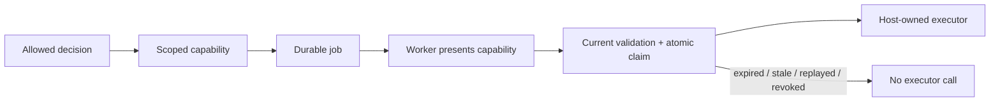
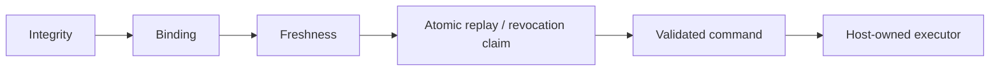
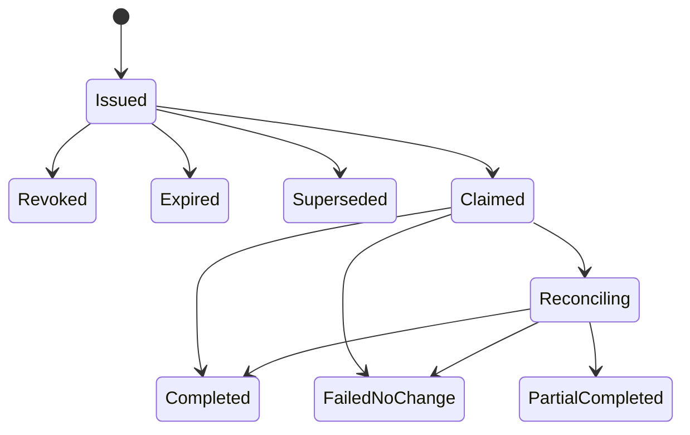
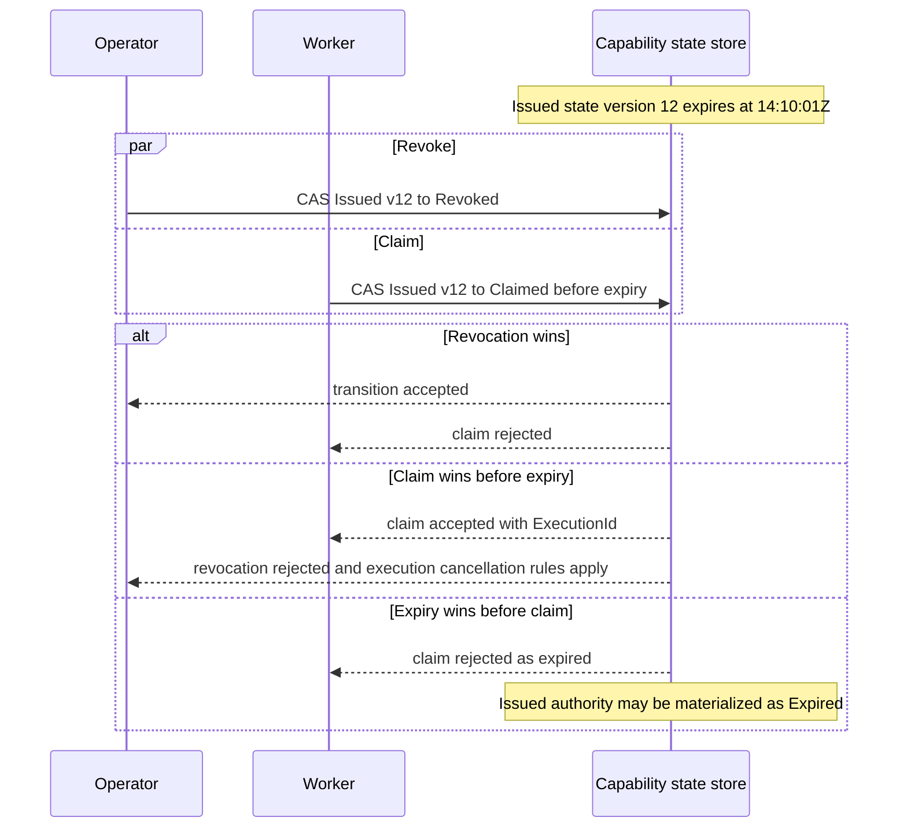

# Capability-Scoped Background Operation

**Learning objective:** Understand how a consequential operation can be approved during an interactive request and executed later by a background worker without turning the queue message, worker service identity, or a long-lived credential into broad execution permission.

**Pattern classification:** General learning material

**Difficulty:** Advanced

**Prerequisites:** Recommended — [Scoped Capability and Host-Owned Execution](../tutorials/scoped-capability-and-host-owned-execution.md), [Replay Protection and Bounded-Use Authority](../security/replay-protection-and-bounded-use.md), and [Signing, Verification, Key Custody, and Tamper Evidence](../security/signing-verification-key-custody-and-tamper-evidence.md). [Policy Versioning and Decision Provenance](../governance/policy-versioning-and-decision-provenance.md) and [CQRS, Command/Query Separation, and Governed Execution](../architecture/cqrs-command-query-separation-and-governed-execution.md) are useful companion reading.

**Estimated study time:** 60–80 minutes for the guided architecture path or approximately 110–135 minutes for a careful full read including the production variants, failure, replay, drift, requester-status, and reconciliation material.

## Before You Begin

This case study uses one fictional asynchronous operation:

```text
report.generate
```

An authenticated analyst requests generation of a versioned internal report. Current policy allows the exact request, but the host deliberately does **not** generate the report inside the interactive HTTP request. It creates narrow continuation authority, persists a background job, and later lets a worker present that authority to a host-owned executor.

Keep six artifacts distinct throughout the study:

| Artifact | What it means | What it does not mean |
| --- | --- | --- |
| User request / intent | The operation the initiating actor asks the host to consider | That policy allows it |
| Governance decision | What current policy concluded about the exact intent | That a later worker may execute indefinitely |
| Scoped capability | Narrow continuation authority for one delayed operation | That the queue message is trustworthy or that execution already happened |
| Queue job | Transport and orchestration data used to deliver work | Execution authority |
| Worker identity | Which service/process is presenting the job | Broad permission to perform every `report.generate` operation |
| Execution result | What the protected executor observed or completed | The original decision or capability provenance |

The central boundaries are:

```text
Queue message
     ≠
Execution authority
```

```text
Worker identity
     ≠
Operation authority
```

and:

```text
Valid current scoped authority
        +
Execution-boundary validation
        ↓
Host-owned execution may occur
```

**Five-minute route:** read **At a Glance**, **The Scenario**, **Queue Delivery Is Not Authority**, **Worker Identity Is Not Operation Authority**, **The Worker Validation Pipeline**, the four required invariant traces, and **When a Background Capability Is Not Worth the Complexity**.

**Ten-minute route for experienced reviewers:** add **Issue Narrow Background Execution Authority**, the grouped validation diagram in **The Worker Validation Pipeline**, **Atomically Claim the Capability**, and **Requester-Facing Async Status**. This route is intended for readers who already understand scoped capabilities and replay state and want to review the delayed-execution boundary quickly.

**Twenty-minute route:** add **Protect Portable Capability Integrity**, **Freshness Model: Rebuild Current Context Before Claim**, **Operational Retry Versus Authorization Retry**, **Background Worker Orchestration Sketch**, and the execution/reconciliation sections. The remaining sections are reference detail for production adaptation, failure analysis, and review.

---

## At a Glance

The representative lifecycle is:

```text
User request
      ↓
Standing authentication / authorization
      ↓
Bound report-generation intent
      ↓
Authoritative current context
      ↓
Current governance decision
      ↓
Allowed
      ↓
Scoped capability issued
      ↓
Durable job + outbox persisted
      ↓
Background job delivered
      ↓
Worker identity authenticated
      ↓
Capability proof + bindings validated
      ↓
Current policy / resource / destination freshness checked
      ↓
Capability atomically claimed
      ↓
Validated execution command
      ↓
Host-owned background executor
      ↓
Execution / reconciliation evidence
```



This study preserves four required invariants for the background-authority boundary:

```text
Expired capability
      ↓
Executor calls = 0
```

```text
Replayed capability
      ↓
Second logical execution blocked
```

```text
Queue message altered to broaden resource scope
      ↓
Validation fails
Executor calls = 0
```

```text
Operational retry
      ≠
Authorization retry
```

The policy rules, actor identities, resource identifiers, queue, capability proof mechanism, worker, report destination, and executor are synthetic teaching artifacts. No production queue, identity provider, report store, external AI service, or real customer data is used.

---

## 1. The Scenario

Assume the application exposes an authenticated request-time operation:

```http
POST /reports/generate
```

The request asks the host to create one internal report from a versioned resource snapshot:

```text
Operation:       report.generate
Actor:           analyst-17
Tenant:          tenant-a
Resource:        portfolio-204
ResourceVersion: rv-41
ReportType:      case-summary
Format:          pdf
Destination:     internal-report-vault
Purpose:         case-review
```

The host's synthetic environment defines:

```text
Initiating actor:
  analyst-17
  tenant-a

Resource:
  portfolio-204
  tenant-a
  version = rv-41
  classification = Confidential

Destination:
  internal-report-vault
  tenant-a
  kind = InternalReportStore
  registry version = destinations/19

Policy:
  report-generation / 7
  fingerprint = sha256:report-policy-7-demo

Capability issuer:
  learning-background-authority

Executor audience:
  background-report-executor

Worker identity:
  report-worker-3
  service class = BackgroundReportWorker

Capability lifetime:
  10 minutes

Maximum logical uses:
  1
```

The resource store and report destination are in-memory simulations. The names `Confidential`, `tenant-a`, and `internal-report-vault` are fictional labels, not claims about a real compliance regime.

### Representative policy matrix

This specimen uses a deliberately small policy:

| Current authoritative condition | Decision | Internal reason | Can issue capability? |
| --- | --- | --- | --- |
| Resource and actor tenants match; destination approved; resource classification is `Internal` or `Confidential`; no hold | `Allowed` | `REPORT_GENERATION_ALLOWED` | Yes |
| Actor and resource tenants differ | `Denied` | `REPORT_CROSS_TENANT_DENIED` | No |
| Destination is not currently approved for this tenant | `Denied` | `REPORT_DESTINATION_NOT_APPROVED` | No |
| Resource classification is `Restricted` | `Denied` | `REPORT_RESTRICTED_RESOURCE_DENIED` | No |
| Report-generation hold is active | `Deferred` | `REPORT_GENERATION_ON_HOLD` | No |

This is teaching policy only.

The important property is that the host evaluates **current authoritative facts** before issuing continuation authority.

---

## 2. Why a Background Worker Changes the Authority Problem

For an immediate request, the same host process may be able to do this safely:

```text
Authenticated request
      ↓
Authorize + evaluate current state
      ↓
Execute immediately
```

The caller's authenticated session, current request context, current policy decision, and side effect all exist close together in time.

A background job introduces a different lifecycle:

```text
14:00:00  User request authenticated
14:00:01  Policy = Allowed
14:00:01  Job persisted
14:03:42  Worker receives delivery
14:03:43  Worker prepares execution
```

During those minutes:

- The user's interactive session may end.
- The resource may change.
- Policy may change.
- The destination registry may change.
- The queue may redeliver the message.
- A different worker instance may receive the retry.
- The capability may expire.
- The capability may be revoked.
- An attacker or faulty producer may alter unprotected message fields.
- The first execution result may become ambiguous after a timeout.

The architecture therefore needs to answer:

> **What narrow authority survives the request-time boundary, and what must the later worker prove before the protected side effect can occur?**

That is the role of scoped continuation authority in this case.

---

## 3. Keep Six Responsibilities Separate

The case-study family uses the same responsibility split throughout.

| Responsibility | Question in this case | Representative owner |
| --- | --- | --- |
| Architecture | Where do time, process, queue, policy, authority, and execution boundaries exist? | Host application design |
| Implementation | How are intent, decision, capability, job, claim state, and execution represented? | Request orchestrator, job store, capability service, worker, executor |
| Operations | Who runs workers, retries delivery, monitors stuck jobs, and reconciles ambiguous results? | Host operations/platform team |
| Security | Who authenticates actors/workers, protects capability integrity, keeps credentials, and enforces replay state? | Identity platform plus host security controls |
| Governance | Who resolves current policy/resource facts and decides whether continuation authority may exist? | Host-controlled policy/context boundary |
| Execution | Which component performs the report-generation side effect? | `IReportGenerationExecutor` after current authority is accepted |

Physical separation is optional.

Semantic separation is not.

A single process can implement all six rows and still keep the evidence and authority boundaries explicit.

---

## 4. Bind the User Intent Before Policy Evaluation

Do not pass a mutable request object through the entire delayed workflow.

Normalize the consequential fields into one bounded intent:

```csharp
public sealed record ReportGenerateIntent(
    string ResourceId,
    string ReportType,
    string Format,
    string DestinationId,
    string PurposeCode);

public sealed record BoundReportGenerateIntent(
    ReportGenerateIntent Intent,
    string IntentDigest,
    string IntentCanonicalizationVersion);
```

This specimen uses:

```text
IntentCanonicalizationVersion = report-generate-v1
```

A conceptual canonical representation is:

```text
report-generate-v1\n
resource=<length>:<ResourceId>\n
reportType=<length>:<ReportType>\n
format=<length>:<Format>\n
destination=<length>:<DestinationId>\n
purpose=<length>:<PurposeCode>\n
```

Then:

```text
IntentDigest = sha256(canonical UTF-8 bytes)
```

The length-prefix notation is conceptual. Its purpose is to make boundaries unambiguous if independent components reproduce the digest. In `report-generate-v1`, text values are normalized to Unicode NFC before length calculation and UTF-8 encoding; a later normalization change requires a new canonicalization version.

The important rules are:

1. Normalize once under an explicitly named version.
2. Carry the canonicalization version wherever the digest travels.
3. Do not silently recompute the digest under a different rule at the worker.
4. Do not put mutable policy facts such as classification into the caller's intent.

The intent identifies **what was requested**.

Authoritative context identifies **what is currently true**.

---

## 5. Build Authoritative Request-Time Context

The request-time host resolves the facts needed to decide whether a background operation may be queued.

```csharp
public sealed record PolicyEvidence(
    string PolicyId,
    string PolicyVersion,
    string PolicyFingerprint);

public sealed record ReportGenerationContext(
    BoundReportGenerateIntent BoundIntent,
    string InitiatingActorId,
    string TenantId,
    string ResourceVersion,
    string ResourceClassification,
    string DestinationRegistryVersion,
    bool DestinationApproved,
    bool GenerationHoldActive,
    PolicyEvidence Policy,
    string CorrelationId);
```

Representative authoritative sources are:

| Field | Source of truth |
| --- | --- |
| `InitiatingActorId` | Authenticated request identity |
| `TenantId` | Host-resolved actor/resource relationship |
| `ResourceVersion` / classification | Resource repository or immutable snapshot service |
| Destination approval / registry version | Host-controlled destination registry |
| Generation hold | Current operations/governance state |
| Policy identity/version/fingerprint | Current policy provider |
| `CorrelationId` | Host request/orchestration boundary |

Do not accept these as authority because the client placed them in JSON:

```json
{
  "tenantId": "tenant-b",
  "resourceVersion": "rv-999",
  "classification": "Internal",
  "policyVersion": "1"
}
```

The client may supply a resource identifier and requested destination as intent.

The host decides what those identifiers currently mean.

---

## 6. Produce a Structured Decision

The evaluator returns a decision; it does not enqueue or execute the report itself.

```csharp
public enum ReportGenerationOutcome
{
    Allowed,
    Denied,
    Deferred
}

public static class ReportGenerationReasonCodes
{
    public const string Allowed = "REPORT_GENERATION_ALLOWED";
    public const string CrossTenant = "REPORT_CROSS_TENANT_DENIED";
    public const string DestinationNotApproved = "REPORT_DESTINATION_NOT_APPROVED";
    public const string Restricted = "REPORT_RESTRICTED_RESOURCE_DENIED";
    public const string OnHold = "REPORT_GENERATION_ON_HOLD";
}

public sealed record ReportGenerationDecision(
    string DecisionId,
    string CorrelationId,
    ReportGenerationOutcome Outcome,
    string ReasonCode,
    string? ContinuationConditionCode,
    string InitiatingActorId,
    string TenantId,
    string ResourceId,
    string ResourceVersion,
    string DestinationId,
    string DestinationRegistryVersion,
    string IntentDigest,
    string IntentCanonicalizationVersion,
    PolicyEvidence Policy,
    DateTimeOffset EvaluatedAt)
{
    public bool CanIssueExecutionCapability =>
        Outcome == ReportGenerationOutcome.Allowed;
}
```

For a hold, a continuation condition can state what the host is waiting for:

```text
ContinuationConditionCode = report-generation-hold-cleared
```

An `Allowed` decision is necessary to issue a capability in this specimen.

It is not itself the portable authority that a later worker presents.

---

## 7. Issue Narrow Background Execution Authority

The capability should answer exactly:

> **What may a later execution boundary accept, for whom, against what resource, under which decision and policy, for how long?**

A conceptual payload is:

```csharp
public sealed record ReportGenerationCapability(
    string CapabilityId,
    string JobId,
    string Issuer,
    string Audience,
    string InitiatingActorId,
    string TenantId,
    string OperationName,
    string ResourceId,
    string ResourceVersion,
    string ReportType,
    string Format,
    string DestinationId,
    string DestinationRegistryVersion,
    string PurposeCode,
    string IntentDigest,
    string IntentCanonicalizationVersion,
    string DecisionId,
    PolicyEvidence Policy,
    string CorrelationId,
    DateTimeOffset ExpiresAt);
```

For the worked example:

```text
CapabilityId:                 cap-report-0001
JobId:                        job-report-0001
Issuer:                       learning-background-authority
Audience:                     background-report-executor
InitiatingActorId:            analyst-17
TenantId:                     tenant-a
OperationName:                report.generate
ResourceId:                   portfolio-204
ResourceVersion:              rv-41
ReportType:                   case-summary
Format:                       pdf
DestinationId:                internal-report-vault
DestinationRegistryVersion:   destinations/19
IntentCanonicalizationVersion: report-generate-v1
DecisionId:                   dec-report-0001
Policy:                       report-generation / 7
PolicyFingerprint:            sha256:report-policy-7-demo
ExpiresAt:                    14:10:01Z
```

This is substantially narrower than:

```text
report-worker may generate reports
```

or:

```text
analyst-17 may generate reports later
```

The capability is authority for **one bounded continuation**, not a durable role assignment. This specimen intentionally defines every capability as single-use instead of exposing a configurable `MaxUses` value that the state machine cannot honor beyond one claim. A genuinely multi-use capability needs a different state model and is outside this case.

---

## 8. Protect Portable Capability Integrity

If the capability crosses a queue/process trust boundary as a portable artifact, another component must have a basis for detecting unauthorized modification.

A conceptual protected envelope is:

```csharp
public sealed record CapabilityProof(
    string ProofType,
    string KeyId,
    string Algorithm,
    string Value);

public sealed record ProtectedCapabilityEnvelope(
    string PayloadFormatVersion,
    string PayloadCanonicalizationVersion,
    string CanonicalPayload,
    CapabilityProof Proof);
```

A production design might use:

- A digital signature.
- A MAC when issuer and verifier deliberately share symmetric trust.
- An opaque random capability identifier whose claims remain server-side in an authoritative store.
- Another authenticated integrity mechanism appropriate to the trust boundary.

The important distinctions are:

```text
Policy/content fingerprint
    ≠
Capability signature / MAC
```

and:

```text
Valid cryptographic proof
    ≠
Current authorization to execute
```

The worker/executor boundary must still validate issuer, key or verification policy, audience, lifetime, resource, policy freshness, replay/use state, and current host facts.

A capability should be canonicalized under a versioned rule before a proof is created. This specimen carries the payload format and canonicalization versions inside the protected envelope so a verifier can select the exact supported rule. A verifier that supports multiple canonicalization or proof versions must select them explicitly rather than guessing from malformed input.

For the deeper trust model, see [Signing, Verification, Key Custody, and Tamper Evidence](../security/signing-verification-key-custody-and-tamper-evidence.md).

### Production variant: choose the capability representation deliberately

The teaching payload is intentionally verbose because every binding stays visible. Production systems often choose a more compact representation without weakening the semantics:

| Representation | Runtime lookup | Revocation | Typical tradeoff |
| --- | --- | --- | --- |
| Signed portable claims | Not required for claim recovery, but current-state checks still are | Harder without online state or short expiry | Easy cross-process verification; larger payload and key-rotation burden |
| Opaque random capability ID | Required | Immediate when authoritative state is reachable | Small message surface; central state lookup becomes availability-sensitive |
| Hybrid: opaque ID + minimal signed claims | Usually required | Immediate through server-side state | Keeps routing/audience hints portable while authoritative scope remains server-side |

A compact production capability might therefore contain only:

```text
CapabilityId
JobId
Audience
ExpiresAt
Integrity proof or opaque-reference entropy
```

A minimal teaching shape for that production variant could be:

```csharp
public sealed record MinimalBackgroundCapability(
    string CapabilityId,
    string JobId,
    string Audience,
    DateTimeOffset ExpiresAt,
    CapabilityProof Proof);
```

The authoritative actor, tenant, operation, resource, destination, decision, policy, and intent bindings remain server-side under `CapabilityId`. The security requirement is not that every binding be serialized into the queue. It is that every binding be established and revalidated at the execution boundary. An opaque implementation may omit a portable `Proof` field entirely and rely on an unguessable reference plus authenticated transport and server-side state, according to its threat model.

### Key rotation during a short capability lifetime

If portable capabilities use a `kid`, a safe rollover can publish the new verification key before issuance switches to it, keep the old verification key available for at least the maximum capability lifetime plus clock-skew allowance, and stop issuing under the old key before retiring verification. A ten-minute capability should not become unverifiable merely because key rotation happened at minute five. Compromise-driven revocation is different from routine rotation and may intentionally invalidate still-unexpired artifacts.

---

## 9. Persist the Grant and Job Before Depending on Queue Delivery

The queue is a delivery mechanism.

It should not be the only durable place where the host remembers what it authorized.

A stronger production shape is:

```text
Allowed decision
      ↓
Create capability state
Create background job state
Create outbox record
      ↓
Commit durable transaction
      ↓
Outbox publisher delivers queue message
```

This avoids treating successful queue publication as the source of decision or capability truth.

A conceptual job lifecycle is:

```csharp
public enum BackgroundJobStatus
{
    Queued,
    Validating,
    Running,
    Superseded,
    Completed,
    Failed,
    Reconciling,
    PartialCompleted
}
```

A conceptual job record is:

```csharp
public sealed record BackgroundReportJobRecord(
    string JobId,
    string CapabilityId,
    string CorrelationId,
    string OperationName,
    string ResourceId,
    string IntentDigest,
    string IntentCanonicalizationVersion,
    DateTimeOffset CreatedAt,
    BackgroundJobStatus Status,
    long StateVersion);
```

The job state and capability state are related, but they are not the same state machine. The **capability state is authoritative for operation authority**; the **job state is authoritative for orchestration and requester-facing progress**. They transition independently and are reconciled through the same `JobId`, `CapabilityId`, and `ExecutionId` evidence.

A useful mapping for this specimen is:

| Capability state | Typical job state | Meaning |
| --- | --- | --- |
| `Issued` | `Queued` or `Validating` | Work exists, but execution authority has not been claimed |
| `Claimed` | `Running` | One logical execution owns the capability |
| `Revoked`, `Expired`, or `Superseded` before claim | `Superseded` | The job remains historical, but no current execution authority exists |
| `Completed` | `Completed` | The logical execution completed successfully |
| `FailedNoChange` | `Failed` | The claimed execution ended with a confirmed no-change failure |
| `Reconciling` | `Reconciling` | Completion is uncertain and must be reconciled |
| `PartialCompleted` | `PartialCompleted` | A partial result exists and requires explicit repair/review |

The two records may briefly disagree while a worker or repair process persists the corresponding transition. That transient lag does not make the job status a substitute for capability authority. Before execution, the capability store decides whether authority may be claimed. For requester status, the host projects the durable job state after applying any required capability-state reconciliation.

If publication fails after the transaction commits, the outbox publisher can retry delivery.

If delivery happens twice, replay/use state still controls execution.

If the job record is cancelled before claim, the host can revoke or invalidate the corresponding capability according to the configured lifecycle.

---

## 10. Queue Delivery Is Not Authority

The queue payload intentionally repeats some capability-bound fields:

```csharp
public sealed record BackgroundReportJob(
    string JobId,
    string OperationName,
    string ResourceId,
    string ResourceVersion,
    string IntentDigest,
    string IntentCanonicalizationVersion,
    string CorrelationId,
    ProtectedCapabilityEnvelope Capability,
    DateTimeOffset EnqueuedAt);
```

Those repeated fields are useful for routing, diagnostics, and explicit tamper tests.

They are **not** authoritative.

The worker must not do this:

```csharp
await executor.GenerateAsync(
    job.ResourceId,
    cancellationToken);
```

merely because a trusted queue delivered `job`.

Instead:

```text
Queue delivery
      ↓
Parse as untrusted transport data
      ↓
Verify protected capability
      ↓
Compare message fields with capability bindings
      ↓
Reject any mismatch
```

For example, if an altered message says:

```text
ResourceId = portfolio-999
```

while the verified capability says:

```text
ResourceId = portfolio-204
```

the worker rejects the delivery.

It does not "prefer" the message or broaden the capability.

### Why bind `JobId` too?

Without a `JobId` binding, an attacker or faulty producer may copy a valid capability into a different queued workflow.

Binding:

```text
Capability.JobId = Job.JobId
```

lets the host reject capability swapping between job records even when the copied capability is otherwise valid.

The host should also resolve the durable job record by `JobId` and verify that the record still points to the same `CapabilityId`.

The queue can deliver work.

It cannot manufacture or reassign authority.

---

## 11. Worker Identity Is Not Operation Authority

The background worker should authenticate to the host or execution service.

For example:

```text
Worker identity:
report-worker-3

Service class:
BackgroundReportWorker
```

That identity may be authorized to:

- Read the background queue.
- Read job metadata required for processing.
- Present a protected capability to the report execution boundary.
- Write operational heartbeat/diagnostic state.

It should not automatically mean:

```text
report-worker-3 may generate any report for any tenant and resource
```

This case requires both:

```text
Authenticated eligible worker identity
        +
Valid scoped operation capability
```

The capability carries the initiating actor and operation/resource bindings. The initiating HTTP session may end without invalidating the capability merely because the session cookie or access token expired; the capability has its own lifetime and revocation semantics. If current actor status is a governance requirement, the worker resolves that fact during current-context re-evaluation rather than attempting to reuse the old interactive credential.

The worker identity identifies the **presenting service**.

Those are different principals with different roles in the evidence.

A useful validator can receive them separately:

```csharp
public sealed record WorkerIdentity(
    string WorkerId,
    string WorkerClass);

public sealed record WorkerExecutionRequest(
    WorkerIdentity Worker,
    BackgroundReportJob Job);
```

Do not write a capability in which:

```text
Subject = report-worker-3
Scope = reports.*
```

and then call that equivalent to the narrow continuation authority created for `analyst-17` and `portfolio-204`.

---

## 12. The Worker Validation Pipeline

A consequential background executor should make validation order explicit.

One representative sequence can be taught as five phases rather than fourteen unrelated checks:

```text
Integrity
  1. Authenticate worker identity
  2. Resolve durable JobId record
  3. Parse capability envelope
  4. Verify proof / issuer / key / algorithm / purpose

Binding
  5. Validate executor audience
  6. Validate job ↔ capability bindings
  7. Validate operation / tenant / resource / destination / intent digest

Freshness
  8. Validate ExpiresAt
  9. Rebuild current authoritative resource / destination / policy context
 10. Re-evaluate current policy and apply the documented freshness rule

Replay / revocation
 11. Atomically claim the single-use capability and check revocation state

Execution construction
 12. Construct a validated execution command from accepted authority + host facts
 13. Invoke the host-owned executor
 14. Persist completion or reconciliation state
```



The ordering has useful properties:

- No unverified capability claims are treated as authority.
- Queue fields cannot broaden verified claims.
- Expired capability does not consume an executor call.
- Policy/resource drift is discovered before a side effect.
- Replay/revocation state is checked atomically where authority becomes action.
- The protected executor receives a validated command, not the raw queue payload.

A different host may order inexpensive checks differently for denial-of-service resistance.

What should remain invariant is which facts must be established **before execution**.

---

## 13. Validation Is More Than Signature Verification

A valid signature or MAC is only one check.

A conceptual validation result can keep failures explicit:

```csharp
public enum CapabilityValidationOutcome
{
    Accepted,
    ProofInvalid,
    IssuerNotTrusted,
    AudienceMismatch,
    JobBindingMismatch,
    OperationMismatch,
    ResourceMismatch,
    IntentMismatch,
    Expired,
    Revoked,
    Replayed,
    PolicyStale,
    ResourceStale,
    DestinationStale,
    WorkerNotEligible
}
```

The executor is reachable only for `Accepted`.

The exact external error vocabulary may be coarser than these internal reasons.

Do not expose resource existence, tenant membership, policy versions, or capability validation details to an untrusted producer merely because they are useful internally.

---

## 14. Model Replay and Revocation as Stateful Authority

A portable token cannot prove by itself that it has never been used.

This specimen therefore maintains host-owned capability state:

```csharp
public enum BackgroundCapabilityStatus
{
    Issued,
    Revoked,
    Expired,
    Superseded,
    Claimed,
    Completed,
    FailedNoChange,
    Reconciling,
    PartialCompleted
}

public sealed record CapabilityUseState(
    string CapabilityId,
    BackgroundCapabilityStatus Status,
    string? ExecutionId,
    int UseCount,
    DateTimeOffset ExpiresAt,
    long StateVersion,
    DateTimeOffset UpdatedAt);
```

The important transition is atomic:

```text
Issued
  ├── revoke wins before claim ──────────────> Revoked
  ├── expiry observed before claim ──────────> Expired
  ├── freshness failure invalidates grant ───> Superseded
  └── atomic claim with ExecutionId ─────────> Claimed
                                                   ├── confirmed success ─────> Completed
                                                   ├── confirmed no change ───> FailedNoChange
                                                   └── uncertain / partial ───> Reconciling
                                                                                 ├── success ─> Completed
                                                                                 ├── no change -> FailedNoChange
                                                                                 └── partial -> PartialCompleted
```

`Completed`, `FailedNoChange`, `PartialCompleted`, `Revoked`, `Expired`, and `Superseded` are terminal for the old capability.



The capability never returns to `Issued`. This is a one-use design: `UseCount` is evidence that the single claim occurred, not support for a configurable multi-use grant.

If a later attempt is legitimate, the host creates fresh governance evidence and new continuation authority.

---

## 15. Revocation Is Useful but Has a Boundary

Because replay protection already requires online use state in this specimen, the same authoritative capability-state boundary can support revocation before claim.

Example:

```text
Capability = Issued
      ↓
Operator cancels job
      ↓
Capability state = Revoked
      ↓
Worker receives stale queue delivery
      ↓
Atomic claim fails
      ↓
Executor calls = 0
```

Revocation is not time travel.

If the worker has already won the atomic claim and the executor may have started an external side effect, changing the state to `Revoked` does not prove that execution stopped.

At that point the host needs its execution cancellation, idempotency, or reconciliation model.

The race should be defined explicitly:

```text
Revocation CAS wins first
    → no claim, no execution

Claim CAS wins first
    → capability is already consumed for that logical execution
    → later cancellation follows execution-specific semantics
```

The same atomic store also resolves a claim racing with expiry. A representative sequence is:



The diagram is illustrative rather than a database protocol. The production requirement is one authoritative atomic decision about the old `Issued` version; a revocation, expiry observation, or claim must not all succeed against the same version.

For a self-contained capability design with no online state, immediate revocation may not be available. That is one tradeoff of eliminating the state lookup.

---

## 16. Expiration Is Enforced by the Host Clock

The queue may hold a message longer than expected.

Suppose:

```text
Issued:    14:00:01Z
ExpiresAt: 14:10:01Z
Delivered: 14:14:30Z
```

The worker must not interpret late delivery as permission to extend authority.

```text
now > ExpiresAt
      ↓
Expired
      ↓
Capability state terminal for this grant
      ↓
Executor calls = 0
```

The host clock or trusted time source decides expiration.

A producer-supplied timestamp does not.

A background sweeper may mark abandoned issued capabilities as `Expired` for operational cleanup, but response-time/claim-time validation remains authoritative.

### Expiration does not mean "retry authorization"

If the capability expires, the worker does not simply create a new expiration value.

The host must return to a fresh governance boundary if the operation is still desired:

```text
Expired capability
      ↓
Fresh context
      ↓
Fresh policy decision
      ↓
New capability + new job when allowed
```

That is an **authorization/governance retry**, not a transport retry.

---

## 17. Freshness Model: Rebuild Current Context Before Claim

Delayed execution means the worker must not assume request-time facts remain current.

The worker resolves:

```text
Current resource version
Current classification
Current tenant ownership
Current destination approval / registry version
Current generation hold
Current policy identity/version/fingerprint
```

This teaching specimen uses a deliberately strict freshness rule before claim:

```text
Current PolicyId           = capability PolicyId
Current PolicyVersion      = capability PolicyVersion
Current PolicyFingerprint  = capability PolicyFingerprint
Current ResourceVersion    = capability ResourceVersion
Current DestinationId      = capability DestinationId
Current DestinationRegistryVersion
                            = capability DestinationRegistryVersion
Current policy evaluation  = Allowed
```

The final `Allowed` re-evaluation is mandatory because runtime facts can change without a policy deployment. The equality checks serve a different purpose: this specimen treats the original decision as authority for an exact policy/resource/destination snapshot, so any snapshot drift supersedes the old continuation authority even when a fresh evaluation might also allow the operation.

That choice is conservative and can reduce availability. An unrelated policy deployment or destination-registry revision inside the ten-minute window can invalidate many queued capabilities. A production host should choose and test one of two explicit models:

| Freshness model | Worker requirement | Tradeoff |
| --- | --- | --- |
| Exact snapshot | Current policy/resource/destination identities must exactly match the capability, and current evaluation must be `Allowed` | Simple and conservative; routine deployments can supersede otherwise-safe work |
| Explicit compatibility | Current evaluation must be `Allowed`, and a versioned compatibility rule must declare the earlier bound policy/destination snapshot acceptable | Better availability; compatibility metadata becomes governance material that must be reviewed, versioned, and evidenced |

Do not silently change from exact match to "latest policy says yes." If compatibility is allowed, preserve the original decision provenance **and** the compatibility rule that allowed continuation.

### If policy is re-evaluated, what is the capability still for?

Fresh re-evaluation does not make the capability redundant. The capability still proves which exact delayed intent may be attempted, narrows the worker below the initiating actor's standing authority, binds the operation/resource/destination/audience, carries the original decision provenance, limits lifetime, and supplies the stable identity whose atomic state prevents a second logical claim. Re-evaluation answers whether the old bounded intent remains acceptable **now**; it does not grant the worker freedom to choose a different intent.

### Version and fingerprint must agree

If:

```text
PolicyVersion = 7
```

but the current canonical content fingerprint differs from the fingerprint bound into the decision/capability, this specimen treats the condition as a policy-identity/integrity anomaly and does not execute.

A production application may implement an explicit compatibility rule instead of strict equality.

That compatibility rule is governance material of its own and should be versioned/tested rather than inferred from "close enough" versions.

### Freshness failure is terminal for the old capability

When the host establishes policy/resource/destination drift, or current re-evaluation is no longer `Allowed`, it atomically marks the old capability `Superseded` rather than leaving it indefinitely reusable in case the environment later rolls back to an old-looking state. If revocation, expiry, or another claim wins that state race first, the already-committed terminal/claim state remains authoritative.

Fresh continuation starts with fresh current context.

---

## 18. Resource Drift Example

Request-time decision:

```text
Resource:        portfolio-204
ResourceVersion: rv-41
Classification:  Confidential
Policy:          report-generation / 7
Decision:        Allowed
```

Before the worker claims the capability, the resource changes but remains otherwise policy-eligible:

```text
ResourceVersion: rv-42
Classification:  Confidential
```

The worker resolves the current state and sees:

```text
capability ResourceVersion = rv-41
current ResourceVersion    = rv-42
fresh policy evaluation    = Allowed
```

Under this specimen's exact-snapshot rule, the old capability is still superseded because the user authorized/report policy evaluated `rv-41`, not an unspecified future version of `portfolio-204`.

Result:

```text
Old capability = Superseded
Fresh decision = Allowed for rv-42
Executor calls under old capability = 0
```

If the product requirement is instead "generate from the latest version available when the worker runs," that is a different intent and capability contract. Model it explicitly rather than silently substituting `rv-42` under authority bound to `rv-41`.

---

## 19. Policy Drift Example

Request-time:

```text
Policy: report-generation / 7
Decision: Allowed
```

Before execution:

```text
Current policy: report-generation / 8
```

Version `8` introduces a temporary restriction for the current report type.

The worker does not execute under `7` merely because the capability is unexpired.

The historical evidence remains truthful:

```text
Decision dec-report-0001 was produced by policy 7.
```

The current operational result becomes:

```text
Capability policy != current policy
        ↓
Old capability = Superseded
        ↓
Fresh governance required
        ↓
No protected execution under the old capability
```

Historical provenance and current freshness are different questions.

See [Policy Versioning and Decision Provenance](../governance/policy-versioning-and-decision-provenance.md) for the broader model.

---

## 20. Atomically Claim the Capability

A naive check-then-act sequence is unsafe:

```csharp
if (!useStore.IsUsed(capability.CapabilityId))
{
    await executor.GenerateAsync(command, cancellationToken);
    await useStore.MarkUsedAsync(capability.CapabilityId, cancellationToken);
}
```

Two workers can both observe `unused`.

Prefer one atomic state transition:

```csharp
public interface IBackgroundCapabilityStateStore
{
    ValueTask<CapabilityUseState> GetRequiredAsync(
        string capabilityId,
        CancellationToken cancellationToken);

    ValueTask<CapabilityClaimResult> TryClaimAsync(
        string capabilityId,
        long expectedStateVersion,
        string executionId,
        DateTimeOffset now,
        CancellationToken cancellationToken);

    ValueTask<bool> TryMarkSupersededAsync(
        string capabilityId,
        long expectedStateVersion,
        string reasonCode,
        DateTimeOffset now,
        CancellationToken cancellationToken);
}
```

The store contract is conceptually:

```text
CapabilityId
Expected state = Issued
Current StateVersion
Single-use state = Issued
Stored ExpiresAt has not passed under the host clock
Not revoked
Not superseded
      ↓
Atomic compare-and-set / transaction
      ↓
Claimed(ExecutionId)
```

or:

```text
Rejected because the state no longer permits a claim
```

### Multi-instance deployment requirement

An in-memory `lock`, `SemaphoreSlim`, or `HashSet` can demonstrate this boundary in one process.

It does not coordinate five worker instances.

A production deployment that claims cross-instance replay resistance needs a shared authoritative state transition at the scope where that guarantee is claimed, such as:

- A transactional database conditional update.
- A uniqueness constraint for a one-use claim.
- A strongly consistent compare-and-set store.
- A single authoritative execution service.

### Concrete relational CAS sketch

A relational implementation might make the compare-and-set visible as one conditional update. The decisive predicates are the expected `Issued` status and `StateVersion`; expiry is checked in the same write:

```sql
UPDATE BackgroundCapabilityState
SET Status = 'Claimed',
    ExecutionId = @executionId,
    StateVersion = StateVersion + 1,
    UpdatedAt = @now
WHERE CapabilityId = @capabilityId
  AND Status = 'Issued'
  AND StateVersion = @expectedStateVersion
  AND ExpiresAt >= @now;
```

Exactly one row updated means the claim won. Zero rows means the worker must reload authoritative state and treat the claim as rejected, expired, revoked, superseded, or already claimed. The application must not follow zero rows with queue-only validation and execution.

If the authoritative capability-state store is unavailable, the worker cannot establish replay, revocation, expiry, or claim state. It must defer/fail closed according to the documented availability policy; it must **not** fall back to queue-message validation plus a local cache.

The sample later uses in-memory state only to make the semantics visible.

It does not claim production distributed replay protection.

---

## 21. Queue Redelivery Is Not Automatically a Replay Attack

Queues legitimately redeliver messages.

The execution boundary does not need to infer whether duplication is malicious or operational.

It only needs stable semantics.

Suppose the same job arrives twice:

```text
Delivery A
JobId = job-report-0001
CapabilityId = cap-report-0001

Delivery B
JobId = job-report-0001
CapabilityId = cap-report-0001
```

The first eligible worker wins the atomic claim. Expiry is checked again inside that atomic transition using the stored capability-state expiry, so a capability cannot pass an early time check and then be claimed after it has expired.

The second delivery cannot create a second logical execution claim.

```text
Delivery A -> TryClaim -> Claimed(ExecutionId=exec-report-0001)
Delivery B -> TryClaim -> AlreadyClaimed / terminal state
```

The worker may then:

- Acknowledge/drop the duplicate delivery when completion is known.
- Enter reconciliation when the existing execution result is ambiguous.
- Resume only through an explicit same-`ExecutionId` idempotent recovery contract when the executor supports it.

It does not mint a second capability merely because the queue retried delivery.

---

## 22. Build the Execution Command From Accepted Authority

After all validation and the atomic claim succeed, construct a separate command for the executor:

```csharp
public sealed record ValidatedReportGenerationExecution(
    string ExecutionId,
    string CapabilityId,
    string JobId,
    string InitiatingActorId,
    string TenantId,
    string OperationName,
    string ResourceId,
    string ExpectedResourceVersion,
    string ReportType,
    string Format,
    string DestinationId,
    string DestinationRegistryVersion,
    string IntentDigest,
    string IntentCanonicalizationVersion,
    string DecisionId,
    string CurrentDecisionId,
    PolicyEvidence Policy,
    string CorrelationId);
```

`DecisionId` preserves the request-time decision that issued the capability. `CurrentDecisionId` preserves the worker-time re-evaluation that confirmed the operation was still allowed immediately before claim.

Do not pass the raw queue message directly into the protected executor.

The command contains values that survived the trust transitions and current-state checks.

The worker cannot broaden:

```text
ResourceId
DestinationId
OperationName
ReportType
TenantId
```

by editing the message after capability issuance.

---

## 23. Close the Resource Check-to-Use Race

A freshness check before claim can still race with a resource update that occurs immediately afterward.

For example:

```text
Worker reads rv-41
      ↓
Freshness passes
      ↓
Another transaction writes rv-42
      ↓
Executor reads "current" resource without a version precondition
```

The background executor must therefore consume the resource according to the version bound into the accepted command.

Useful approaches include:

- Read an immutable snapshot identified by `rv-41`.
- Perform a conditional read/open using an ETag or resource version.
- Open a transaction/snapshot whose semantics guarantee the expected version.
- Re-check immediately at the authoritative data boundary and fail before publishing output if the exact version is unavailable.

The requirement is:

> **The executor must not silently substitute a newer resource for the version the decision and capability authorized.**

The same principle applies to the destination descriptor: use the validated destination identity/version or re-check it at the authoritative destination boundary before publish. A preflight `current version == rv-41` check by itself does not close the time-of-check/time-of-use gap.

---

## 24. Keep Downstream Credentials Host-Owned

The capability is operation authority.

It should not contain the report-store credential.

The queue job should not contain it either.

At execution time:

```text
Validated execution command
      ↓
Host-owned executor
      ↓
Executor obtains its own workload identity / short-lived credential
      ↓
Write bounded report artifact
```

The credential authorizes the executor to access infrastructure according to platform configuration.

The capability authorizes this application-level operation according to the host's governance model.

Those are separate authority systems.

Avoid placing:

```text
Storage access key
Database password
Bearer token
Cloud credential
Signing key
```

inside the background job simply because the worker runs later.

---

## 25. Give the Logical Execution a Stable Idempotency Identity

Replay control answers:

> May this capability create another logical execution claim?

Idempotency answers a different question:

> If the same logical execution is retried because the result is uncertain, can the side effect avoid duplication?

The worker creates one stable:

```text
ExecutionId = exec-report-0001
```

when the capability is claimed.

The executor uses that identity as an idempotency/reconciliation key.

A synthetic report artifact key could be:

```text
reports/tenant-a/portfolio-204/exec-report-0001
```

rather than:

```text
reports/tenant-a/portfolio-204/<new random name on every retry>
```

A safer publication pattern is:

```text
Generate into execution-scoped staging artifact
      ↓
Validate expected resource / output metadata
      ↓
Publish with create-if-absent or compare-and-set semantics
      ↓
Record resulting artifact identity against ExecutionId
```

Exactly-once side effects are not implied.

Idempotency reduces duplicate effects under a defined executor contract.

Replay protection prevents a second logical use of the authority.

Both may be needed.

---

## 26. Handle Ambiguous Execution Without Blind Replay

Suppose the executor sends the final publish request and then times out.

The worker does not know whether the destination committed the artifact.

Do not immediately do this:

```text
Timeout
  ↓
Generate a new report with a new ExecutionId
  ↓
Publish again
```

That can duplicate a successful side effect whose response was merely lost.

Represent the uncertainty:

```csharp
public enum ReportExecutionOutcome
{
    Completed,
    FailedNoChange,
    AmbiguousOrPartial
}
```

Then:

```text
AmbiguousOrPartial
      ↓
Capability state = Reconciling
      ↓
Query execution/artifact ledger by ExecutionId
      ↓
Determine completed / no change / partial
```

The old capability stays consumed.

`FailedNoChange` is also terminal for that claimed capability. A fresh logical attempt requires fresh governance and new authority rather than resetting the old grant to `Issued`.

If reconciliation reaches `PartialCompleted`, this specimen does not publish the partial artifact as a successful report. It keeps any partial/staging artifact quarantined, preserves the affected artifact identifiers in evidence, exposes the job to the requester as `NeedsReview`, and requires an operator or domain-specific repair path to decide whether to discard, complete, or supersede the work. The consumed capability remains terminal throughout.

If the downstream store can expose a durable idempotency record, reconciliation becomes much easier.

If it cannot, the architecture must state what uncertainty remains instead of claiming exactly-once execution.

---

## 27. Operational Retry Versus Authorization Retry

This distinction is one of the most important lessons in the case.

### Operational retry

The host is retrying **delivery or the same logical execution** under authority that is still current.

Examples:

```text
Outbox publish failed before queue delivery
      ↓
Retry publishing the same JobId
```

```text
Queue redelivered the same JobId before a claim succeeded
      ↓
Retry delivery processing
```

```text
Executor returned an explicitly retryable transport failure
and the executor contract guarantees same-ExecutionId idempotency
      ↓
Retry the same logical execution under the existing claim
```

### Authorization / governance retry

The old authority is no longer acceptable.

Examples:

```text
Capability expired
Policy changed
Resource version changed
Destination registry changed
Capability revoked
```

The correct path is:

```text
Fresh authoritative context
      ↓
Fresh policy evaluation
      ↓
New DecisionId
      ↓
New CapabilityId
      ↓
New JobId when execution is still allowed
```

Do not hide this difference behind one generic retry loop.

```text
Operational retry
      ≠
Re-authorize by extending or mutating old authority
```

---

## 28. Correlation Needs More Than One Identifier

A delayed workflow benefits from several stable identities:

| Identifier | Meaning |
| --- | --- |
| `CorrelationId` | End-to-end operational/governance story |
| `DecisionId` | Exact governance decision |
| `CapabilityId` | Exact continuation authority artifact/state |
| `JobId` | Durable background work item |
| `ExecutionId` | One logical protected execution attempt |
| Queue delivery ID | One transport delivery attempt, when available |

Do not use one identifier for all five meanings.

A useful trace can answer:

```text
Which decision issued this capability?
Which job carried it?
Which worker delivery presented it?
Which execution claimed it?
Which report artifact resulted?
```

The same `CorrelationId` connects the story without erasing the more specific identities.

---

## 29. Preserve Decision and Capability Provenance

A later reviewer should be able to reconstruct:

```text
Who initiated the request?
What exact intent digest was authorized?
Which resource version was current?
Which policy produced the Allowed decision?
Which capability was issued?
What audience and lifetime were bound?
Which job delivered the capability?
Which worker identity presented it?
Was the capability proof valid?
Was it revoked, expired, superseded, or claimed?
Which ExecutionId reached the executor?
What final or reconciled outcome occurred?
```

A compact evidence event might be:

```csharp
public sealed record BackgroundOperationEvidence(
    string EventId,
    DateTimeOffset OccurredAt,
    string Stage,
    string Outcome,
    string? ReasonCode,
    string CorrelationId,
    string? DecisionId,
    string? CapabilityId,
    string? JobId,
    string? ExecutionId,
    string? WorkerId,
    string? ResourceId,
    string? ResourceVersion,
    string? IntentDigest,
    string? IntentCanonicalizationVersion,
    string? PolicyId,
    string? PolicyVersion,
    string? PolicyFingerprint,
    long? CapabilityStateVersion);
```

Typical stages include:

```text
request-decision
capability-issued
job-persisted
queue-delivered
capability-proof-verified
freshness-validated
capability-claim-rejected
capability-claimed
execution-started
execution-completed
execution-failed-no-change
execution-reconciling
execution-partial
```

Structured evidence is not automatically immutable or tamper-evident. Storage, signing, access, retention, and external emission properties remain separate architectural concerns.

If particular evidence is required before execution, persist it durably before the protected side effect. If post-execution evidence delivery later fails, repair or outbox-deliver that evidence; do not invoke the report executor again merely to recreate a missing receipt. A receipt failure after a possible side effect is an evidence-recovery problem, not automatic permission for another logical execution.

---

## 30. A Decision/Execution Evidence Matrix

| Scenario | Decision-time state | Worker-time state | Capability result | Executor calls |
| --- | --- | --- | --- | ---: |
| Normal delayed report | Allowed under policy 7 / rv-41 | policy 7 / rv-41 still current | Claimed once | 1 |
| Capability expires in queue | Allowed originally | now > `ExpiresAt` | `Expired` | 0 |
| Duplicate queue delivery after first claim | Allowed originally | same current facts | second claim rejected | 1 total, not 2 |
| Queue resource changed to `portfolio-999` | Allowed for `portfolio-204` | capability still binds `portfolio-204` | job-binding mismatch | 0 |
| Queue swaps another JobId | Allowed originally | durable job binding differs | job-binding mismatch | 0 |
| Wrong executor audience | Allowed originally | worker presents to wrong audience | audience mismatch | 0 |
| Invalid capability proof | Allowed originally | proof fails | proof invalid | 0 |
| Resource changes to rv-42 | Allowed on rv-41 | current resource = rv-42 | `Superseded` | 0 |
| Policy changes to 8 | Allowed under 7 | current policy = 8 | `Superseded` | 0 |
| Capability revoked before claim | Allowed originally | current grant state = revoked | `Revoked` | 0 |
| Worker service authenticated but no capability | N/A | no operation authority | rejected | 0 |
| Executor timeout after possible publish | Allowed/current and claimed | outcome uncertain | `Reconciling` | no second logical execution |

The matrix is intentionally more specific than:

```text
background job succeeded / failed
```

because the architectural question is **which boundary stopped or permitted execution**.

### Requester-Facing Async Status

A background architecture also needs a safe answer to: **what does the initiating actor see after the original HTTP request returns?** The `202 Accepted` response identifies the durable job; it does not promise eventual success:

```text
DecisionId:  dec-report-0001
JobId:       job-report-0001
Correlation: corr-report-0001
Status:      Queued
```

A requester-facing view can stay deliberately coarse:

```csharp
public enum ReportJobPublicStatus
{
    Queued,
    Running,
    Completed,
    NotCompleted,
    NeedsReview
}

public sealed record ReportJobStatusView(
    string JobId,
    ReportJobPublicStatus Status,
    string? ReasonCode,
    string? ArtifactId);
```

Representative external reason codes might be:

```text
report.pending
report.completed
report.not-completed
report.authorization-expired-or-stale
report.needs-review
```

The projection should be deterministic rather than invented by each API handler:

| Internal `BackgroundJobStatus` | Public status | Representative external reason |
| --- | --- | --- |
| `Queued` | `Queued` | `report.pending` |
| `Validating` | `Running` | `report.pending` |
| `Running` | `Running` | `report.pending` |
| `Completed` | `Completed` | `report.completed` |
| `Superseded` | `NotCompleted` | `report.authorization-expired-or-stale` |
| `Failed` | `NotCompleted` | `report.not-completed` |
| `Reconciling` | `Running` | `report.pending` |
| `PartialCompleted` | `NeedsReview` | `report.needs-review` |

This public projection is intentionally coarser than the authority state. A capability may be internally `Expired`, `Revoked`, or `Superseded` while the durable job is projected as `Superseded`; the requester sees `NotCompleted` without learning sensitive policy details. A superseded job should therefore become visible rather than disappearing in a worker log. The status endpoint must authorize the current caller for the job/resource; possession of a guessable `JobId` is not sufficient access authority.

---

## 31. Trace A — Successful Delayed Execution

```text
14:00:00  analyst-17 requests report.generate
14:00:00  resource portfolio-204 = rv-41 / Confidential
14:00:01  policy report-generation / 7 = Allowed
14:00:01  DecisionId = dec-report-0001
14:00:01  CapabilityId = cap-report-0001
14:00:01  JobId = job-report-0001
14:00:01  durable job/capability/outbox commit
14:03:42  report-worker-3 receives job
14:03:42  capability proof = valid
14:03:42  audience = background-report-executor
14:03:42  job/resource/intent bindings = match
14:03:42  current policy = 7; resource = rv-41; destination registry = 19
14:03:42  TryClaim(cap-report-0001) = success
14:03:42  ExecutionId = exec-report-0001
14:03:43  executor reads exact rv-41 snapshot
14:03:44  report published under exec-report-0001 idempotency identity
14:03:44  capability state = Completed

Executor calls = 1
```

The user session is no longer needed at 14:03:42.

The later worker uses narrow continuation authority rather than impersonating the old interactive session.

---

## 32. Trace B — Expired Capability

```text
14:00:01  capability issued
14:10:01  capability expires
14:14:30  queue finally delivers job
14:14:30  proof valid
14:14:30  message bindings match
14:14:30  now > ExpiresAt
14:14:30  capability state -> Expired

TryClaim = rejected
Executor calls = 0
```

The queue being late does not extend authority.

If the report is still desired, a host-owned fresh governance flow must create new authority.

---

## 33. Trace C — Replayed Capability

```text
Delivery A:
  JobId        = job-report-0001
  CapabilityId = cap-report-0001
  TryClaim     = success
  ExecutionId  = exec-report-0001
  Executor     = invoked

Delivery B:
  JobId        = job-report-0001
  CapabilityId = cap-report-0001
  Current state = Claimed / Completed
  TryClaim      = rejected for second logical use

Second logical executor invocation = 0
Total logical executions = 1
```

A duplicate delivery can still produce an operational event.

It cannot create another authorized logical execution.

---

## 34. Trace D — Queue Message Altered to Broaden Resource Scope

Original verified capability:

```text
JobId:      job-report-0001
Operation:  report.generate
Resource:   portfolio-204
IntentDigest: sha256:<bound digest>
```

Altered queue message:

```text
JobId:      job-report-0001
Operation:  report.generate
Resource:   portfolio-999
IntentDigest: sha256:<different or stale digest>
```

Worker result:

```text
Capability proof = valid for original capability
Queue ResourceId != capability ResourceId
      ↓
JobBindingMismatch / ResourceMismatch
      ↓
TryClaim not reached
Executor calls = 0
```

If an attacker alters the portable capability itself, its authenticated integrity proof must also verify before any claims are accepted.

A mutable queue field cannot broaden signed/verified or server-side authority.

---

## 35. Trace E — Operational Retry Without Authority Broadening

```text
14:00:01  job/outbox committed
14:00:02  first queue publish attempt times out before confirmed delivery
14:00:12  outbox retries same JobId / CapabilityId
14:00:13  worker receives job
14:00:13  current authority is still valid
14:00:13  one atomic claim succeeds
14:00:14  executor completes
```

The outbox retry did not:

```text
extend ExpiresAt
change resource
change destination
mint a new capability
re-run authorization implicitly
```

It retried transport for the same already-authorized work item.

---

## 36. Deterministic Local Simulation

The case does not require a production queue.

A small runnable companion could use:

```text
FakeClock
DeterministicIdSource
InMemoryJobStore
InMemoryOutbox
InMemoryJobQueue
InMemoryCapabilityStateStore
DeterministicCapabilityProtector
FakePolicyProvider
FakeResourceRepository
FakeDestinationRegistry
RecordingReportGenerationExecutor
InMemoryEvidenceRecorder
```

The sample architecture is:

```text
Request simulation
      ↓
Decision + capability + job state
      ↓
In-memory outbox publication
      ↓
In-memory queue delivery
      ↓
Worker validation
      ↓
Atomic in-process TryClaim
      ↓
Recording executor
```

The in-memory store makes replay/revocation semantics visible in one process.

It intentionally does **not** prove:

- Cross-process atomicity.
- Durable replay state after restart.
- Production queue delivery guarantees.
- Production signing-key protection.
- External report-store idempotency.
- Exactly-once execution.

Those production properties require infrastructure whose contracts are explicit.

---

## 37. Request-Time Orchestration Sketch

A framework-neutral request path might look like:

```csharp
public async Task<ReportRequestResult> RequestAsync(
    ReportGenerateIntent intent,
    AuthenticatedActor actor,
    CancellationToken cancellationToken)
{
    string correlationId = ids.NewCorrelationId();

    BoundReportGenerateIntent boundIntent =
        intentCanonicalizer.Bind(intent);

    ReportGenerationContext context =
        await contextBuilder.BuildAsync(
            boundIntent,
            actor,
            correlationId,
            cancellationToken);

    ReportGenerationDecision decision =
        policy.Evaluate(
            context,
            ids.NewDecisionId(),
            clock.UtcNow);

    await evidence.RecordDecisionAsync(
        decision,
        cancellationToken);

    if (!decision.CanIssueExecutionCapability)
    {
        return ReportRequestResult.FromDecision(decision);
    }

    string jobId = ids.NewJobId();

    ProtectedCapabilityEnvelope capability =
        capabilityIssuer.IssueAndProtect(
            context,
            decision,
            jobId,
            clock.UtcNow);

    await jobPersistence.CommitJobAndOutboxAsync(
        jobFactory.Create(jobId, context, decision, capability),
        cancellationToken);

    return ReportRequestResult.Accepted(
        decision.DecisionId,
        jobId,
        correlationId);
}
```

The method does not call the report executor.

It creates durable continuation state only after current policy allows the exact intent.

---

## 38. Background Worker Orchestration Sketch

A representative worker path should make rejection evidence and worker eligibility visible rather than relying on hidden exceptions:

```csharp
public sealed record PreClaimValidationResult(
    CapabilityValidationOutcome Outcome,
    string ReasonCode,
    VerifiedReportCapability? VerifiedCapability = null,
    ReportExecutionContext? CurrentContext = null,
    ReportGenerationDecision? CurrentDecision = null)
{
    public bool Accepted =>
        Outcome == CapabilityValidationOutcome.Accepted;

    public (
        VerifiedReportCapability Capability,
        ReportExecutionContext Context,
        ReportGenerationDecision Decision) RequireAccepted()
    {
        if (!Accepted ||
            VerifiedCapability is null ||
            CurrentContext is null ||
            CurrentDecision is null)
        {
            throw new InvalidOperationException(
                "Rejected validation does not contain accepted execution inputs.");
        }

        return (
            VerifiedCapability,
            CurrentContext,
            CurrentDecision);
    }
}

public async Task ProcessAsync(
    WorkerIdentity worker,
    BackgroundReportJob deliveredJob,
    CancellationToken cancellationToken)
{
    BackgroundReportJobRecord? jobRecord =
        await jobStore.GetAsync(
            deliveredJob.JobId,
            cancellationToken);

    if (jobRecord is null)
    {
        await evidence.RecordValidationRejectedAsync(
            deliveredJob.JobId,
            worker.WorkerId,
            "background.job.not-found-or-not-permitted",
            cancellationToken);
        return;
    }

    PreClaimValidationResult preClaim =
        await workerValidation.ValidateBeforeClaimAsync(
            worker,
            jobRecord,
            deliveredJob,
            clock.UtcNow,
            cancellationToken);

    if (!preClaim.Accepted)
    {
        await evidence.RecordValidationRejectedAsync(
            deliveredJob.JobId,
            worker.WorkerId,
            preClaim.ReasonCode,
            cancellationToken);
        return;
    }

    // The accepted result contains the verified capability and current
    // authoritative context/decision established by the Integrity,
    // Binding, and Freshness phases from Section 12. Rejected results
    // deliberately carry no fake placeholder execution inputs.
    var accepted = preClaim.RequireAccepted();
    VerifiedReportCapability verified = accepted.Capability;
    ReportExecutionContext current = accepted.Context;
    ReportGenerationDecision currentDecision = accepted.Decision;

    CapabilityUseState useState =
        await capabilityState.GetRequiredAsync(
            verified.CapabilityId,
            cancellationToken);

    string executionId = ids.NewExecutionId();

    CapabilityClaimResult claim =
        await capabilityState.TryClaimAsync(
            verified.CapabilityId,
            useState.StateVersion,
            executionId,
            clock.UtcNow,
            cancellationToken);

    if (!claim.Accepted)
    {
        await evidence.RecordClaimRejectedAsync(
            verified.CapabilityId,
            deliveredJob.JobId,
            worker.WorkerId,
            claim.ReasonCode,
            cancellationToken);
        return;
    }

    ValidatedReportGenerationExecution command =
        executionFactory.Create(
            verified,
            current,
            currentDecision,
            executionId);

    ReportExecutionResult result =
        await executor.GenerateAsync(
            command,
            cancellationToken);

    await executionState.RecordAsync(
        command,
        result,
        cancellationToken);
}
```

`ValidateBeforeClaimAsync` is a teaching facade over the first three validation phases, not a suggestion to hide them in production. Its contract includes worker authentication/eligibility, durable job resolution, proof verification, binding checks, expiry, current-context reconstruction, current policy evaluation, and freshness rules. `PreClaimValidationResult` makes execution inputs nullable on rejection and exposes them only through `RequireAccepted()`, so a rejected result is representable without inventing placeholder capability/context/decision objects. Rejected validation is evidence and never falls through to claim or execution.

The useful property is the boundary order and the explicit zero-execution rejection paths.

---

## 39. What the Executor Is Allowed to Trust

The executor may trust only what its own boundary has validated according to the host's trust model.

It should not independently reinterpret raw job fields.

A compact trust table is:

| Input | Trusted as operation authority? | Why |
| --- | --- | --- |
| Queue delivery succeeded | No | Transport event only |
| `job.ResourceId` | No by itself | Untrusted/redundant transport field |
| Worker service identity | No by itself | Authenticates presenter, not exact operation |
| Verified capability claims | Part of authority | Integrity/authenticity established, but still needs current validation |
| Current host resource/policy facts | Yes for their defined purpose | Resolved from authoritative host sources |
| Successful atomic claim | Yes for use-state decision | Establishes this logical use won the authority transition |
| Executor credential | Infrastructure authority only | Does not replace application-level capability validation |

The final command exists because all required evidence converged.

---

## 40. Threat Model

### Threat: queue field broadening

```text
portfolio-204 -> portfolio-999
```

Control:

```text
verified capability binding + durable JobId binding + exact comparison
```

### Threat: portable capability modification

Control:

```text
signature / MAC / opaque server-side capability + verification policy
```

### Threat: duplicated valid capability

Control:

```text
stable CapabilityId + durable atomic use state
```

### Threat: stolen worker credential

Control:

```text
worker identity alone cannot create arbitrary operation authority
+
capability scope / audience / replay / freshness checks
```

A compromised eligible worker can still misuse valid capabilities it can obtain. Queue ACLs, workload identity, least privilege, monitoring, and capability confidentiality remain important.

### Threat: expired capability replay

Control:

```text
host-clock lifetime check + terminal expiry/use state
```

### Threat: policy changed after issuance

Control:

```text
current policy identity/version/fingerprint freshness check
```

### Threat: resource changed after issuance

Control:

```text
resource-version binding + current check + version-safe executor read
```

### Threat: destination changed

Control:

```text
destination binding + registry-version/current approval validation
```

### Threat: executor timeout after commit

Control:

```text
stable ExecutionId + idempotent publication + reconciliation
```

No single control makes the whole background operation safe.

The security property comes from the composition.

---

## 41. Important Invariant Tests

A focused suite should protect the authority boundaries rather than mirror every implementation branch:

| Boundary | Invariant to prove |
| --- | --- |
| Decision → capability | `Denied`/`Deferred` issue no capability or job; `Allowed` binds exact intent/resource/destination and preserves policy provenance |
| Canonical intent | Intent digest and canonicalization version survive without silent recomputation |
| Queue binding | Changing resource, operation, digest, JobId, or capability/job pairing rejects before claim |
| Proof/audience | Invalid proof, untrusted issuer/key policy, or wrong audience yields zero executor calls |
| Worker identity | Eligible workload identity is required but is insufficient without the capability |
| Expiry/revocation | Expired or revoked capability yields zero executor calls |
| Replay | Two concurrent claims against one single-use capability produce one accepted logical claim; duplicate delivery cannot create another |
| Resource drift | Exact-snapshot resource drift supersedes the old capability even when a fresh decision for the new snapshot is `Allowed` |
| Policy drift | Exact-match mode rejects version/fingerprint drift; compatibility mode requires its separately versioned rule |
| Destination drift | Current registry evaluation cannot broaden the bound destination silently |
| TOCTOU | Executor enforces the expected resource version at the data boundary |
| Credential custody | Queue/capability payload contains neither signing keys nor report-store credentials |
| Idempotency | Same logical execution reuses one `ExecutionId` for retry/reconciliation |
| Ambiguity | `AmbiguousOrPartial` never resets authority to `Issued`; `FailedNoChange` is terminal |
| Retry semantics | Transport retry preserves JobId/CapabilityId; fresh governance creates new DecisionId/CapabilityId/JobId |
| Evidence | Correlation connects decision, capability, job, worker, claim, execution, and reconciliation while preserving their distinct IDs |
| Requester status | Superseded/failed/reconciling jobs become visible through the coarse async status surface |
| Partial result | Partial artifacts remain quarantined until reconciliation resolves their disposition |

These tests do not certify a production queue or cryptographic implementation. They make the teaching contract executable.

---

## 42. Failure Modes and Common Misreadings

Four recurring misreadings are worth answering directly:

- **Reuse the user's token?** No. Its audience/lifetime describe an interactive principal, not one delayed report operation. Use workload identity plus narrow continuation authority.
- **Trust the queue because ACLs are strong?** No. Queue ACLs govern transport participation; they do not prove current operation authority.
- **Skip freshness because the capability is signed?** No. Integrity/authenticity does not freeze policy, resource, or destination state.
- **Skip replay state because execution is idempotent?** No. Idempotency limits duplicate effects for one logical execution; replay control prevents another logical claim.

| Failure mode | Why it is unsafe |
| --- | --- |
| Queue delivery implies permission | Transport becomes the authorization system |
| Broad worker role such as `reports.*` | Compromised workload identity gains more authority than the initiating request |
| Long-lived capability | Authority survives far beyond the intended queue delay |
| Valid proof means execute | Audience, binding, freshness, replay, and current-state checks disappear |
| Process-local replay cache in a multi-worker deployment | Every instance can accept the same first use |
| Queue retry extends expiry or mints replacement authority | Operational retry becomes hidden reauthorization |
| Resource checked before, but not atomically at, the write | Check-to-use race can substitute a different snapshot |
| Revocation after claim treated as undo | Revocation does not prove a side effect did not start or commit |
| Timeout creates a new `ExecutionId` immediately | Lost response can duplicate an already-committed report |
| Capability contains infrastructure secrets | Operation authority and report-store/signing credentials fail together |
| Capability-state store outage falls back to queue/local cache | Loss of replay/revocation state creates more authority |
| Evidence records only `job completed` | Decision, claim, replay, and worker/execution provenance disappear |

---

## 43. Production Responsibility Recap

The six-responsibility split from Section 3 becomes concrete in production ownership:

| Owner | Responsibilities that must remain explicit |
| --- | --- |
| Operations/platform | Worker health, queue age/backlog, outbox lag, dead-letter handling, stuck `Claimed`/`Reconciling` work, idempotency/use-state retention, key-rollout coordination, reconciliation runbooks |
| Security/identity | Request and workload identity, queue ACLs, signer/verifier trust, key custody, capability confidentiality, replay-state availability, executor credentials, tenant isolation, incident response |
| Governance/policy | Capability lifetime, freshness/compatibility rules, bound resource/destination facts, revocation semantics, executable outcomes, policy provenance |
| Protected executor | Exact-version reads, host-owned credentials, destination enforcement, `ExecutionId` idempotency, structured completion/ambiguity results, final refusal when authority is invalid |

Operational dashboards should distinguish delivery failure, validation rejection, expiry, replay, revocation, freshness failure, execution failure, ambiguity, and completion instead of collapsing them into `background job failed`. Physical teams may overlap; the accountability questions should not.

---

## 44. When a Background Capability Is Not Worth the Complexity

Do not introduce this lifecycle merely because the application has a queue.

A simpler architecture is usually better when:

- The operation can safely execute synchronously inside the authenticated request.
- The same trusted application service owns decision and immediate execution.
- Queue delay is negligible and no authority needs to cross a trust/process/time boundary.
- The background work is non-consequential bookkeeping that can be derived from already-committed state.
- The worker does not need delegated authority to perform a protected side effect.
- Ordinary service authorization plus an idempotent domain command already expresses the real requirement.

A conventional shape may be enough:

```text
Authenticated request
      ↓
Application service / command handler
      ↓
Current authorization + domain validation
      ↓
Mutation
```

or:

```text
Committed domain fact
      ↓
Background projection / notification
```

where the worker is processing an already-authoritative fact rather than receiving permission to create a new protected state transition.

[CQRS, Command/Query Separation, and Governed Execution](../architecture/cqrs-command-query-separation-and-governed-execution.md) examines when a normal command handler is already the correct host-owned boundary.

> **The point of a capability is not to make background work look sophisticated. It is to preserve narrow authority when authority truly must survive beyond the request that created it.**

---

## 45. When the Pattern Earns Its Cost

Use the heavier lifecycle when the delayed boundary changes the authority problem, not merely because a queue exists:

| Signal | Why it matters |
| --- | --- |
| Execution outlives the initiating session | Request-time credentials no longer express current continuation authority |
| A different process performs the side effect | Authority crosses a process/trust boundary |
| Worker should have less authority than the user | Narrow delegation materially reduces blast radius |
| Queue duplication/races are normal | Stateful single-use claim semantics matter |
| Policy/resource/destination can drift | Historical allow is not sufficient by itself |
| Expiry/revocation is meaningful | Authority needs an independent lifecycle |
| Execution may be ambiguous | Stable `ExecutionId` and reconciliation are required |
| Decision/capability/execution provenance matters | The delayed chain must remain reconstructable |

If most rows do not apply, prefer the simpler designs in Section 44.

---

## 46. Review Checklist

Before adapting this pattern, ask:

1. Is the operation consequential enough that delayed authority, replay, or drift materially matters?
2. Which exact actor, tenant, operation, resource version, destination, purpose, and intent digest are bound?
3. Is intent canonicalization explicit, versioned, and Unicode-normalized consistently?
4. Which policy identity/version/fingerprint produced the original `Allowed` decision?
5. Which executor audience may accept the capability, and how short is `ExpiresAt`?
6. Is the capability deliberately single-use?
7. Is the representation portable, opaque, or hybrid, and where do authoritative claims live?
8. Who owns signing/MAC keys, verification policy, rollover, and compromise response?
9. Can queue fields be altered without broadening verified authority?
10. Does durable `JobId` state still bind to the same `CapabilityId`?
11. Does workload identity authenticate the worker without becoming operation authority?
12. Are current policy/resource/tenant/destination facts rebuilt before claim?
13. Is freshness exact-match or governed by a separately versioned compatibility rule?
14. What happens when policy, resource, or destination state drifts?
15. What happens when expiry or revocation races with claim?
16. Is replay/use state shared and atomic across every worker instance covered by the guarantee?
17. Does the executor enforce the bound resource version at the actual data boundary?
18. What stable `ExecutionId` controls idempotency and reconciliation?
19. What happens after a timeout whose side effect may already have committed?
20. Are `FailedNoChange` and partial/ambiguous outcomes terminal for the old capability?
21. Which retries preserve old transport/execution identity, and which require fresh governance?
22. Are downstream credentials host-owned and absent from queue/capability payloads?
23. Can evidence distinguish DecisionId, CapabilityId, JobId, ExecutionId, worker, and delivery identity?
24. What requester-facing status/reason vocabulary exposes supersession or reconciliation without leaking internal policy details?
25. If execution is partial, which artifacts are quarantined and who owns the repair decision?
26. Does queue/storage/state infrastructure actually provide the durability, consistency, and fail-closed behavior the design claims?

If those questions cannot be answered, the authority-transfer model is not complete yet.

---

## 47. What This Case Intentionally Omits

This study does not prescribe:

- A production message broker.
- Exactly-once queue delivery.
- A particular database or distributed lock product.
- A specific JWT, CWT, macaroon, or capability-token format.
- A specific signature algorithm or key-management provider.
- Cloud workload identity configuration.
- A production report engine.
- Real confidential data.
- Multi-region replay-state replication.
- Cross-tenant delegated execution.
- A general-purpose workflow engine.
- Long-running multi-step sagas.
- Human approval or acknowledgment.
- AI-generated proposals.

Those are adjacent concerns.

The lesson here is the narrow authority handoff from an allowed request-time decision to a later background executor.

---

## 48. Related Learning

Continue with:

- [Scoped Capability and Host-Owned Execution](../tutorials/scoped-capability-and-host-owned-execution.md) for the foundational authority model.
- [Replay Protection and Bounded-Use Authority](../security/replay-protection-and-bounded-use.md) for atomic use-state and replay semantics.
- [Signing, Verification, Key Custody, and Tamper Evidence](../security/signing-verification-key-custody-and-tamper-evidence.md) for portable artifact integrity and key trust.
- [Policy Versioning and Decision Provenance](../governance/policy-versioning-and-decision-provenance.md) for historical provenance versus current freshness.
- [CQRS, Command/Query Separation, and Governed Execution](../architecture/cqrs-command-query-separation-and-governed-execution.md) for the simpler immediate-command and delayed-command alternatives.
- [Human Acknowledgment Workflow](human-acknowledgment-workflow.md) when a person must satisfy a governance requirement before authority can be issued.
- [Multi-Tenant and Regional Policy Overlay](multi-tenant-and-regional-policy-overlay.md) when several policy authorities determine the request-time decision.

---

## 49. Closing Principle

A background worker is useful precisely because it survives beyond the initiating request.

That lifecycle advantage should not become an authority shortcut.

Keep the boundaries explicit:

```text
User request
      ↓
Current authoritative facts
      ↓
Current policy decision
      ↓
Narrow time-bounded capability
      ↓
Durable background job
      ↓
Authenticated worker presents capability
      ↓
Proof / audience / job / operation / resource / lifetime validation
      ↓
Current policy and resource freshness
      ↓
Atomic replay / revocation claim
      ↓
Validated execution command
      ↓
Host-owned executor
```

The recurring rule is:

> **The queue carries work. The worker carries identity. The capability carries narrow continuation authority. The host still decides whether that authority is valid now.**

And the execution invariant remains:

```text
No valid current scoped authority
        ↓
No protected execution
```

---

> **Read it. Run it. Question it. Improve it.**
