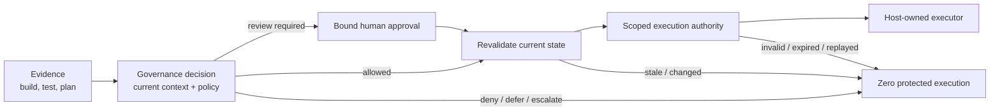

# Deployment Approval and Infrastructure Change Gates

**Learning objective:** Compose build evidence, environment policy, human approval, short-lived execution authority, credential custody, provenance, dry-run behavior, and host-owned execution around two familiar engineering workflows without treating CI success, approval, or a generated plan as permission to make production changes.

**Pattern classification:** General learning material

**Difficulty:** Advanced

**Prerequisites:** Recommended — [Human-in-the-Loop Governance Workflows](../governance/human-in-the-loop-governance-workflows.md), [Policy Versioning and Decision Provenance](../governance/policy-versioning-and-decision-provenance.md), [Scoped Capability and Host-Owned Execution](../tutorials/scoped-capability-and-host-owned-execution.md), and [Software Supply-Chain Integrity for .NET Repositories](../security/software-supply-chain-integrity-for-dotnet-repositories.md). [Workflow Engines, Human Approval Systems, and Governed Execution](../architecture/workflow-engines-human-approval-and-governed-execution.md) is useful when deciding which responsibilities can safely remain inside one delivery platform.

## At a Glance

This case study uses two simulated variants:

```text
Application deployment
```

and:

```text
Infrastructure change
```

The scenarios share three distinctions:

```text
Build passed
      ≠
Deployment authorized

Human approved
      ≠
Unlimited deployment authority

Change plan generated
      ≠
Change applied
```

The central invariant is:

> **A protected deployment or infrastructure apply occurs only after current policy permits the exact change and the executor accepts narrow, current execution authority for that target.**

The build system, artifact repository, deployment target, infrastructure provider, credentials, plans, approvals, and policy identifiers in this case are fictional. The executors are synthetic and perform no real external changes.

---

## 1. One Responsibility Model, Two Variants

The application-deployment flow is:

```text
Commit / release candidate
       ↓
Build + test + provenance evidence
       ↓
Target environment context
       ↓
Policy evaluation
       ↓
Approval when required
       ↓
Refresh context + re-evaluate
       ↓
Short-lived deployment authority
       ↓
Synthetic deployment executor
       ↓
Execution evidence
```

The infrastructure variant is:

```text
Proposed infrastructure change
       ↓
Plan / dry run
       ↓
Plan identity + current state context
       ↓
Policy + environment constraints
       ↓
Approval / escalation when required
       ↓
Refresh state + re-evaluate
       ↓
Scoped apply authority
       ↓
Synthetic infrastructure executor
       ↓
Execution evidence
```

The visual similarity is intentional. The architectural question is not whether a product calls the step a gate, environment, stage, approval, plan, or deployment job. The question is which responsibility each step actually owns.



Evidence can support a decision. It does not replace the decision.

---

## 2. Keep the Responsibilities Separate

A single CI/CD product may implement several rows below. Physical separation is optional; semantic separation is not.

| Responsibility | Case-study question | Representative owner |
| --- | --- | --- |
| Architecture | Which trust and lifecycle boundaries exist? | Delivery-system architecture and documented flow |
| Implementation | How are release candidates, plans, decisions, approvals, grants, and receipts represented? | Host application or delivery integration code |
| Operations | Who schedules releases, monitors execution, reconciles failures, and coordinates rollback? | Delivery/platform operations |
| Security | Who authenticates actors, protects deployment credentials, verifies artifacts, and controls target access? | Identity platform, secret/workload-identity system, artifact verification, target platform controls |
| Governance | Who defines environment policy and decides whether this exact change may proceed now? | Policy owner plus host-controlled policy evaluation |
| Execution | Which component actually changes the application or infrastructure? | Deployment or infrastructure executor that owns target credentials |

This separation prevents convenient evidence from being treated as broader authority than it represents.

For example:

```text
All tests passed
      ≠
Production policy allows this release now

Reviewer clicked Approve
      ≠
Artifact may change after review

Workflow state = Ready
      ≠
Current deployment authority is valid

Terraform-style plan exists
      ≠
Provider credentials may apply it
```

---

## 3. CI Evidence Is Input, Not Authorization

Build and test evidence can be essential to release policy. It can answer questions such as:

- Which source revision produced the artifact?
- Which workflow run built it?
- Which test suites passed?
- Which artifact digest was produced?
- Was expected provenance or signing evidence available?
- Did required vulnerability or policy checks complete?

Those facts still do not answer:

> **May this exact artifact be deployed to this exact environment now?**

A representative release candidate can keep evidence identity explicit:

```csharp
public sealed record ReleaseCandidate(
    string ArtifactDigest,
    string SourceRevision,
    string BuildRunId,
    string ProvenanceReference,
    string ArtifactType);
```

The important binding is the immutable artifact identity, not a mutable label such as:

```text
latest
release
production-candidate
```

A policy decision may require a green build, verified provenance, and an approved signer while still returning `Deferred` because the change window is closed, `ApprovalRequired` because production requires separation of duties, or `Denied` because the artifact digest is not the reviewed artifact.

For deeper source-to-artifact reasoning, use [Software Supply-Chain Integrity for .NET Repositories](../security/software-supply-chain-integrity-for-dotnet-repositories.md). For cryptographic evidence, remember that a valid signature or fingerprint proves only the property its verification policy establishes; it does not itself authorize deployment. See [Signing, Verification, Key Custody, and Tamper Evidence](../security/signing-verification-key-custody-and-tamper-evidence.md).

---

# Variant A — Application Deployment

## 4. Build Current Environment Context

Assume the release candidate targets a fictional production environment:

```text
environment = prod-west
```

The caller may request that target, but security- and policy-sensitive facts should come from host-owned sources.

A representative context is:

```csharp
public sealed record DeploymentContext(
    ReleaseCandidate Candidate,
    string EnvironmentId,
    string EnvironmentClass,
    string CurrentReleaseDigest,
    long EnvironmentGeneration,
    bool ChangeWindowOpen,
    bool IncidentFreezeActive,
    bool ArtifactVerificationPassed,
    bool SeparationOfDutiesRequired,
    string RequesterId,
    string PolicyId,
    string PolicyVersion,
    string CorrelationId);
```

`EnvironmentGeneration` is a teaching stand-in for any authoritative target-state version that can detect meaningful drift between review and execution.

The host, not the requester, should resolve facts such as:

```text
EnvironmentClass
CurrentReleaseDigest
EnvironmentGeneration
ChangeWindowOpen
IncidentFreezeActive
ArtifactVerificationPassed
SeparationOfDutiesRequired
```

A request saying `incidentFreeze=false` is not authoritative merely because it is valid JSON.

### Representative Deployment Policy

| Current condition | Outcome | Reason code | Executor call? |
| --- | --- | --- | --- |
| Non-production target; verified artifact; policy permits direct deploy | `Allowed` | `DEPLOYMENT_ALLOWED` | Yes, after authority validation |
| Production requires independent reviewer | `ApprovalRequired` | `PRODUCTION_APPROVAL_REQUIRED` | No until approved and revalidated |
| Change window closed | `Deferred` | `CHANGE_WINDOW_CLOSED` | No |
| Incident freeze active | `Denied` | `INCIDENT_FREEZE_BLOCKS_DEPLOYMENT` | No |
| Artifact verification failed | `Denied` | `ARTIFACT_VERIFICATION_FAILED` | No |
| Reviewer is same actor when separation of duties is required | `Denied` | `SEPARATION_OF_DUTIES_VIOLATION` | No |

A simple precedence rule for this specimen is:

```text
Verification / incident hard stop
        ↓
Change-window deferral
        ↓
Separation-of-duties requirement
        ↓
Approval requirement
        ↓
Allowed
```

The exact ordering is illustrative. The requirement is that precedence be explicit and testable rather than an accident of `if` statement order.

---

## 5. Use a Structured Deployment Decision

A deployment decision should be machine-readable and reconstructable without making human-facing text the control surface.

```csharp
public enum DeploymentOutcome
{
    Allowed,
    ApprovalRequired,
    Deferred,
    Denied,
    EscalationRecommended
}

public sealed record DeploymentDecision(
    string DecisionId,
    DeploymentOutcome Outcome,
    string ReasonCode,
    string PolicyId,
    string PolicyVersion,
    string ArtifactDigest,
    string EnvironmentId,
    long EnvironmentGeneration,
    DateTimeOffset EvaluatedAt,
    string CorrelationId);
```

Branch on `Outcome` and stable reason codes. Display text may change without changing control flow.

The decision records what policy concluded at a point in time. It does not prove that execution later happened or that the target remained unchanged.

---

## 6. Bind Human Approval to the Exact Release

When policy requires approval, create a durable review request that identifies exactly what is being reviewed.

A useful binding includes at least:

```text
DecisionId
ArtifactDigest
EnvironmentId
EnvironmentGeneration
PolicyId + PolicyVersion
ApprovalExpiresAt
EligibleReviewerScope
```

A fictional approval record might be:

```csharp
public sealed record DeploymentApproval(
    string ApprovalId,
    string DecisionId,
    string ArtifactDigest,
    string EnvironmentId,
    long EnvironmentGeneration,
    string ReviewerId,
    DateTimeOffset ApprovedAt,
    DateTimeOffset ExpiresAt);
```

The approval is invalid for a different artifact digest or environment.

It also expires.

This matters because a delayed review can outlive:

- the artifact that was reviewed;
- the environment generation;
- the approved change window;
- the current policy version;
- the reviewer's eligibility;
- an incident-state change.

The safe continuation is therefore:

```text
Approval accepted
      ↓
Rebuild current environment context
      ↓
Confirm approval bindings and expiry
      ↓
Re-evaluate policy
      ↓
Issue narrow deployment authority only if still allowed
```

A reviewer disposition is evidence for governance. It is not a reusable production credential.

---

## 7. Issue Short-Lived Deployment Authority

Once the current decision permits execution, the host may issue narrow authority for the deployment worker.

```csharp
public sealed record DeploymentGrant(
    string GrantId,
    string DecisionId,
    string? ApprovalId,
    string Operation,
    string ArtifactDigest,
    string EnvironmentId,
    long EnvironmentGeneration,
    string Audience,
    DateTimeOffset NotBefore,
    DateTimeOffset ExpiresAt,
    int MaxUses,
    string PolicyVersion,
    string CorrelationId);
```

Representative bindings are:

```text
operation = deployment.apply
artifactDigest = sha256:...
environment = prod-west
environmentGeneration = 381
audience = synthetic-deployment-executor
notBefore = issuer time
expiresAt = short lifetime
maxUses = 1
```

The grant is **scoped execution authority**. It is not a standing `ProductionDeployer` role and should not contain long-lived deployment credentials.

The execution boundary validates at least:

- operation;
- artifact digest;
- environment;
- target-state generation or equivalent freshness marker;
- audience;
- activation and expiration;
- use count / replay state where required;
- approval binding when approval was required;
- current policy freshness rule.

A stale or mismatched grant produces zero executor calls.

---

## 8. Keep Deployment Credentials Executor-Owned

The governance component should not need the credential that can change production.

A stronger ownership model is:

```text
Governance / policy service
        owns decision semantics
        does not own production credential

Deployment executor
        accepts narrow authority
        resolves workload identity / credential
        performs protected deployment
```

The executor might use workload identity, a platform deployment identity, a secret broker, or another target-native credential mechanism. The particular technology is outside this case.

The architectural point is:

> **The component that decides whether a deployment may proceed does not need to become the component that holds every deployment key or invokes every target API.**

Long-lived credentials in approval records, policy results, workflow variables, or grants collapse the security and governance boundaries this case is trying to preserve.

---

## 9. Synthetic Deployment Executor

The protected executor is intentionally fake:

```csharp
public interface IDeploymentExecutor
{
    Task<DeploymentExecutionResult> DeployAsync(
        string executionId,
        string artifactDigest,
        string environmentId,
        CancellationToken cancellationToken);
}
```

A teaching implementation can append an invocation to an in-memory collection and return:

```csharp
public sealed record DeploymentExecutionResult(
    string ExecutionId,
    bool Succeeded,
    string ResultCode);
```

It does not call Kubernetes, Azure, AWS, a VM manager, a package host, or any other real target.

That keeps the lesson on authority transfer and evidence rather than provider configuration.

---

# Variant B — Infrastructure Change Gate

## 10. Separate Plan from Apply

The infrastructure variant begins with a proposed change and a synthetic plan:

```text
Change proposal
      ↓
Read current state
      ↓
Generate plan
      ↓
PlanDigest + BaseStateVersion
```

The central rule is:

> **A plan describes a proposed effect. It does not confer apply authority.**

A minimal plan identity is:

```csharp
public sealed record InfrastructurePlan(
    string PlanId,
    string PlanDigest,
    string WorkspaceId,
    long BaseStateVersion,
    string ChangeSummary,
    int DestructiveActionCount);
```

For sensitive environments, durable evidence should usually preserve bounded metadata rather than the complete raw plan if the plan can expose secrets, internal addresses, identifiers, or configuration values.

A plan can be safely generated in a dry-run stage using only the read privileges required to inspect current state and compute changes. If apply credentials are not required to plan, do not provide them merely because both operations run in the same workflow product.

---

## 11. Evaluate the Plan Against Current Constraints

A representative infrastructure context adds host-owned facts:

```csharp
public sealed record InfrastructureChangeContext(
    InfrastructurePlan Plan,
    string EnvironmentClass,
    string ProviderAccountRef,
    long CurrentStateVersion,
    bool ChangeWindowOpen,
    bool IncidentFreezeActive,
    bool DestructiveChangeRequiresApproval,
    bool PlanPolicyChecksPassed,
    string RequesterId,
    string PolicyId,
    string PolicyVersion,
    string CorrelationId);
```

Policy can now ask questions such as:

- Does `BaseStateVersion` still equal `CurrentStateVersion`?
- Is the provider account the approved account for this workspace?
- Is the plan digest the reviewed plan?
- Are destructive changes permitted in this environment?
- Is an independent reviewer required?
- Is the change window open?
- Is the environment under an incident freeze?

Representative outcomes:

| Condition | Outcome | Reason code | Apply call? |
| --- | --- | --- | --- |
| Current plan, low-risk target, all checks pass | `Allowed` | `INFRA_APPLY_ALLOWED` | Yes, after apply-authority validation |
| Destructive production change requires review | `ApprovalRequired` | `DESTRUCTIVE_CHANGE_REQUIRES_APPROVAL` | No until approved and revalidated |
| State changed since plan | `Deferred` | `PLAN_STALE_REPLAN_REQUIRED` | No |
| Provider account mismatch | `Denied` | `PROVIDER_ACCOUNT_MISMATCH` | No |
| Incident freeze active | `Denied` | `INCIDENT_FREEZE_BLOCKS_INFRA_CHANGE` | No |

The stale-plan branch is especially important:

```text
Plan generated against state version 92
        ↓
Human reviews plan
        ↓
State advances to version 93
        ↓
Old plan is not applied merely because approval still exists
        ↓
Re-plan + re-evaluate
```

---

## 12. Bind Approval and Apply Authority to the Plan

Infrastructure approval should identify the exact plan rather than a generic statement such as:

```text
Approved infrastructure changes for production
```

Bind approval to:

```text
DecisionId
PlanId
PlanDigest
WorkspaceId
BaseStateVersion
ProviderAccountRef or approved target identity
PolicyId + PolicyVersion
ApprovalExpiresAt
```

After approval, refresh current state and re-evaluate.

Only then issue apply authority such as:

```csharp
public sealed record InfrastructureApplyGrant(
    string GrantId,
    string DecisionId,
    string? ApprovalId,
    string Operation,
    string PlanDigest,
    string WorkspaceId,
    long BaseStateVersion,
    string ProviderAccountRef,
    string Audience,
    DateTimeOffset NotBefore,
    DateTimeOffset ExpiresAt,
    int MaxUses,
    string CorrelationId);
```

Representative bindings are:

```text
operation = infrastructure.apply
planDigest = sha256:...
workspace = production-network
baseStateVersion = 92
providerAccount = account-ref-prod
audience = synthetic-infrastructure-executor
maxUses = 1
```

If the plan digest or state version changes, the grant is rejected.

---

## 13. Synthetic Infrastructure Executor

The infrastructure executor is also fake:

```csharp
public interface IInfrastructureExecutor
{
    Task<InfrastructureExecutionResult> ApplyAsync(
        string executionId,
        string planDigest,
        string workspaceId,
        CancellationToken cancellationToken);
}
```

It records that it **would** apply the exact reviewed plan.

A dry-run mode can stop earlier:

```text
Plan generated
      ↓
Policy evaluated
      ↓
WouldRequireApproval = true
WouldIssueApplyAuthority = false
WouldExecute = false
```

Dry run is not a hidden path to production authority. It is an observation mode that deliberately terminates before credentialed execution.

---

## 14. Separation of Duties Is a Policy Property

Separation of duties is stronger when expressed as a review constraint instead of a UI convention.

For a production deployment, policy may require:

```text
RequesterId != ReviewerId
```

and perhaps:

```text
Reviewer has production-review scope
Reviewer is eligible for this service/environment
Reviewer approval is unexpired
```

The same pattern applies to infrastructure changes.

Do not infer separation of duties from two different browser sessions or two different workflow steps. Preserve enough identity and review evidence to prove which actors occupied which roles in this specific change.

A workflow engine may coordinate assignment and timing. Governance still owns the rule that determines whether the resulting reviewer relationship satisfies policy.

---

## 15. Correlate the Change Without Turning Evidence into a Secret Store

Both variants need reconstructable lineage.

A shared evidence envelope can use fields such as:

```csharp
public sealed record ChangeEvidenceCorrelation(
    string CorrelationId,
    string DecisionId,
    string? ApprovalId,
    string? GrantId,
    string? ExecutionId,
    string PolicyId,
    string PolicyVersion,
    DateTimeOffset EvaluatedAt);
```

Deployment-specific evidence can add:

```text
ArtifactDigest
SourceRevision
BuildRunId
EnvironmentId
EnvironmentGeneration
```

Infrastructure-specific evidence can add:

```text
PlanId
PlanDigest
WorkspaceId
BaseStateVersion
ProviderAccountRef
```

Do **not** use governance receipts as a convenient place to retain:

- deployment credentials;
- cloud access tokens;
- private keys;
- secret values from an infrastructure plan;
- complete environment variable sets;
- full rendered manifests when they contain sensitive configuration;
- arbitrary approval comments containing confidential data.

Operational logs may carry a correlation identifier and high-level result code. Governance evidence should preserve the decision lineage. Neither should become a second copy of deployment secrets.

---

## 16. Four Representative Traces

### Trace A — Development Deployment Allowed Without Human Review

```text
Artifact digest verified
Environment = development
Change window = open
Policy = deploy-policy/7.4
        ↓
Decision = Allowed
Reason = DEPLOYMENT_ALLOWED
        ↓
One-use grant issued for exact artifact + environment
        ↓
Synthetic deployment executor calls = 1
        ↓
Execution receipt records success
```

The green build is evidence. The allowed decision is what permits grant issuance.

### Trace B — Production Deployment Waits for Independent Approval

```text
Artifact digest verified
Environment = production
Requester = engineer-a
Policy requires independent reviewer
        ↓
Decision = ApprovalRequired
Reason = PRODUCTION_APPROVAL_REQUIRED
        ↓
Synthetic deployment executor calls = 0
        ↓
Reviewer engineer-b approves exact artifact/environment
        ↓
Approval remains within expiry
Environment generation unchanged
Policy re-evaluation = Allowed
        ↓
One-use deployment grant issued
        ↓
Synthetic deployment executor calls = 1
```

Approval is a bound input to continuation, not an unlimited deployment credential.

### Trace C — Approved Artifact Changes Before Deployment

```text
Approval binds artifact digest A
        ↓
Pipeline points deployment stage at artifact digest B
        ↓
Approval binding mismatch
        ↓
No deployment grant
Synthetic deployment executor calls = 0
```

The workflow may still say the stage was previously approved. The exact approved artifact no longer matches.

### Trace D — Infrastructure Plan Becomes Stale

```text
Plan P generated against state version 92
Plan P approved
        ↓
External change advances state to 93
        ↓
Current state != approved plan base state
        ↓
Decision = Deferred
Reason = PLAN_STALE_REPLAN_REQUIRED
        ↓
Synthetic infrastructure executor calls = 0
        ↓
Re-plan before another decision
```

This is the infrastructure equivalent of artifact or environment drift after review.

---

## 17. Execution Failure Does Not Rewrite the Decision

A valid decision and valid grant mean that execution **may** be attempted.

They do not guarantee that execution succeeds.

For example:

```text
Decision = Allowed
Grant = Valid
Deployment starts
Target rejects operation because service is unavailable
```

The decision remains historically `Allowed` under the context evaluated at that time. Execution evidence records failure separately.

Do not mutate the original decision into `Denied` merely because the executor failed.

A retry policy must answer a new question:

> **May this exact operation be retried under current state without causing duplicate or stale effects?**

Depending on the target, the host may:

- reconcile actual state before retry;
- use `ExecutionId` as an idempotency key when the executor supports it;
- require a new grant after the original use is consumed;
- rebuild context and re-evaluate policy;
- re-plan infrastructure when provider state is uncertain;
- escalate ambiguous results for operator reconciliation.

Never assume that network failure means no side effect happened.

---

## 18. Rollback Is Its Own Consequential Operation

Operations owns rollback coordination, but rollback authority still needs an explicit boundary.

A failed deployment does not automatically mean:

```text
Any previous artifact may now be redeployed with unlimited authority
```

A safer model treats rollback as another intent:

```text
deployment.rollback
```

bound to:

```text
Current environment
Current failed execution / release
Approved rollback target
Current policy / emergency policy
Narrow execution authority
```

Infrastructure rollback is even more context-sensitive. Some changes are not safely reversible by applying an old plan, and provider state may have moved after partial execution.

This case therefore assigns:

- **operations** — detect failure, coordinate response, reconcile target state, select a recovery strategy;
- **governance** — decide whether the proposed recovery is permitted under current policy;
- **security** — protect recovery credentials and privileged target access;
- **executor** — perform the approved rollback or recovery action.

Emergency or break-glass procedures can exist, but they should be explicit, narrowly authorized, observable, and reviewed afterward rather than being hidden inside ordinary deployment credentials.

---

## 19. Why the Governance Service Should Not Become the Deployment Engine

It is technically possible to put everything in one service:

```text
Policy evaluator
      owns production credential
      calls deployment API
      applies infrastructure plan
      writes evidence
```

That shape expands the blast radius of the governance component and makes policy compromise equivalent to target compromise.

The case instead keeps the evaluator focused on decision semantics:

```text
Governance service
      ↓
structured decision
      ↓
scoped authority when allowed
      ↓
separate executor validates authority
      ↓
executor resolves target credential
      ↓
protected side effect
```

The executor can still run in the same product or process when the trust model permits it. The important rule is that the decision object itself does not silently contain or imply the credential required to perform the change.

---

## 20. Failure Modes to Review

| Failure mode | Why it is dangerous | Safer boundary |
| --- | --- | --- |
| Green CI status treated as deployment permission | Validation evidence becomes authority | Evaluate current environment policy separately |
| Approval attached to mutable release label | Different artifact can inherit old approval | Bind approval to artifact digest |
| Reviewer and requester are the same when independent review is required | Separation of duties exists only in UI | Enforce actor relationship in policy |
| Approval never expires | Old human judgment survives changed context indefinitely | Expire approval and revalidate current state |
| Grant contains long-lived cloud credential | Scoped authority becomes credential leakage | Executor resolves credentials from host-owned custody |
| Infrastructure plan is approved but state changes before apply | Reviewed effect no longer matches current state | Bind base-state version and require re-plan on drift |
| Workflow retry blindly repeats apply | Partial success can duplicate or corrupt effects | Reconcile actual state before retry |
| Rollback bypasses governance entirely | Recovery path becomes privileged backdoor | Model rollback/break-glass authority explicitly |
| Governance service directly invokes every target | Policy tier becomes deployment engine and credential concentrator | Keep host-owned execution boundary distinct |
| Raw plan or secrets copied into evidence | Governance records become a sensitive-data store | Preserve digests, bounded metadata, and references |

---

## 21. Test the Architectural Invariants

The highest-value tests verify absence of protected execution on blocked paths.

### Approval Pending Means Zero Deployment Calls

```csharp
DeploymentDecision decision = policy.Evaluate(context);

Assert.Equal(
    DeploymentOutcome.ApprovalRequired,
    decision.Outcome);
Assert.Equal(0, fakeDeploymentExecutor.Invocations.Count);
```

### Changed Artifact Invalidates Approval

```csharp
Assert.NotEqual(
    approval.ArtifactDigest,
    currentContext.Candidate.ArtifactDigest);

Assert.False(
    approvalValidator.IsValidFor(approval, currentContext));
Assert.Equal(0, fakeDeploymentExecutor.Invocations.Count);
```

### Stale Plan Means Zero Infrastructure Apply Calls

```csharp
Assert.NotEqual(
    plan.BaseStateVersion,
    currentContext.CurrentStateVersion);

Assert.Equal(0, fakeInfrastructureExecutor.Invocations.Count);
```

Other useful assertions include:

- unverified artifact -> no deployment grant;
- incident freeze -> no deployment call;
- approval expired -> no grant;
- requester equals reviewer when separation of duties is required -> blocked;
- wrong environment audience -> grant rejected;
- replayed one-use grant -> second executor call blocked;
- changed plan digest -> old approval rejected;
- changed provider account -> apply grant rejected;
- dry run -> `WouldExecute = false` and zero protected calls;
- executor failure -> failure receipt recorded without rewriting the historical decision.

---

## 22. When a Simpler Delivery Workflow Is Enough

Not every deployment needs a separate governance layer or custom capability format.

A simpler CI/CD workflow plus platform-native environment protection may be enough when:

- the same trusted delivery boundary owns validation and immediate execution;
- environment policy is simple and already expressed by the platform;
- human approval is a conventional release control rather than a durable cross-boundary authority transfer;
- no separate executor needs less authority than the workflow already holds;
- credentials remain properly scoped by the delivery platform;
- current-state revalidation does not need a separate policy lifecycle;
- ordinary deployment logs and platform audit history meet the evidence requirement.

[Workflow Engines, Human Approval Systems, and Governed Execution](../architecture/workflow-engines-human-approval-and-governed-execution.md) explains this proportionality threshold: workflow state, approval, governance decisions, and execution authority can coexist inside one platform when their semantics remain clear.

Use the broader model when the system must independently answer questions such as:

```text
Which exact artifact or plan was approved?
Which current policy allowed it?
Did target state change after approval?
Which narrow authority reached the executor?
Who owned the credential used for the side effect?
Why did execution proceed or stop?
```

---

## 23. Review Checklist

Before calling a deployment or infrastructure gate "governed," ask:

1. Is the release artifact or plan identified immutably?
2. Are build, test, signing, or plan results treated as evidence rather than permission?
3. Are target environment and current-state facts resolved from authoritative sources?
4. Are environment-specific policy and precedence explicit?
5. Is human approval bound to the exact artifact/plan and target?
6. Does approval expire?
7. Is reviewer eligibility and separation of duties enforceable as policy?
8. Is context rebuilt and policy re-evaluated after a delayed approval?
9. Is execution authority short-lived, audience-bound, target-bound, and narrowly scoped?
10. Can a stale, mismatched, expired, or replayed grant reach the executor? It should not.
11. Are deployment and infrastructure credentials owned by the executor/security boundary rather than copied into governance artifacts?
12. Can dry-run or plan generation occur without unnecessary apply credentials?
13. Does a blocked decision produce zero protected executor calls?
14. Does execution failure remain distinct from the historical governance decision?
15. Is ambiguous execution reconciled before retry?
16. Is rollback modeled as an operationally coordinated but separately authorized consequential action?
17. Do decision, approval, grant, and execution evidence correlate without storing secrets or raw sensitive plans?
18. Could the same requirements be met more simply by platform-native delivery controls?

If several answers are unclear, the problem is usually not that the pipeline needs more stages. It is that one or more responsibilities have been collapsed into a stage whose name hides what authority it actually owns.

---

## Related Learning

- [Human-in-the-Loop Governance Workflows](../governance/human-in-the-loop-governance-workflows.md) — bind delayed reviewer dispositions to exact intents and revalidate before continuation.
- [Policy Versioning and Decision Provenance](../governance/policy-versioning-and-decision-provenance.md) — preserve policy identity and reason about drift between decision and execution.
- [Scoped Capability and Host-Owned Execution](../tutorials/scoped-capability-and-host-owned-execution.md) — issue only the authority a later executor actually needs.
- [Software Supply-Chain Integrity for .NET Repositories](../security/software-supply-chain-integrity-for-dotnet-repositories.md) — distinguish source, build, artifact, provenance, and publication trust evidence.
- [Signing, Verification, Key Custody, and Tamper Evidence](../security/signing-verification-key-custody-and-tamper-evidence.md) — keep signatures, key custody, verification policy, authorization, and execution separate.
- [Workflow Engines, Human Approval Systems, and Governed Execution](../architecture/workflow-engines-human-approval-and-governed-execution.md) — compare orchestration, human approval, governance, and execution authority without assuming they require separate products.

The two variants lead to the same architectural conclusion:

> **Evidence can justify a decision, approval can satisfy a review requirement, and a workflow can coordinate the process — but only current, narrowly scoped authority accepted by the host-owned executor turns the proposal into a protected change.**
