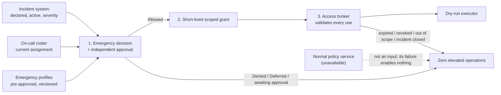

# Emergency Production Access and Break-Glass

**Learning objective:** Follow one emergency production-access request end to end, from a declared incident through validation, independent approval, short-lived scoped authority, host-owned access, expiry and revocation, evidence, and post-incident review. Distinguish a deliberately designed emergency authority path from an undocumented fallback that bypasses normal policy whenever a dependency is unavailable.

**Pattern classification:** General learning material

**Difficulty:** Advanced

**Prerequisites:** Recommended — [Scoped Capability and Host-Owned Execution](../tutorials/scoped-capability-and-host-owned-execution.md), [Escalation Patterns in Governed Systems](../governance/escalation-patterns-in-governed-systems.md), and [Should Authorization Fail Open, Fail Closed, or Defer?](../articles/2026/fail-open-fail-closed-or-defer.md). [Secret Handling Across Trust Boundaries](../security/secret-handling-across-trust-boundaries.md) and [Secure Logging Across Trust Boundaries](../security/secure-logging-across-trust-boundaries.md) support the credential and evidence sections.

**Estimated study time:** 30–45 minutes for the full case. The five-minute route below is enough to understand the core distinction before reading the failure-handling and review material.

## Before You Begin

Keep five terms in view:

- **Normal path** is how production access is granted on an ordinary day: a request, the normal policy decision, routine approval, and a just-in-time grant.
- **Emergency path** is a second, separately designed authority path. It has its own preconditions, its own approvers, and its own narrower limits. It is not the normal path with checks removed.
- **Declared incident** is the precondition for the emergency path. It comes from the authoritative incident system, not from the requester, and not from the fact that something else is broken.
- **Emergency grant** is narrow, short-lived, bounded-use authority for specific operations on one resource in one environment, tied to one incident.
- **Access broker** is the host-owned component that holds the privileged route into production. It validates the grant on every use and is the only thing that performs elevated operations.

**Five-minute route:** read **At a Glance**, **The Central Distinction**, **Normal Path and Emergency Path Compared**, **The Minimal Core Path**, the **Decision and Execution Matrix**, and **When an Existing Platform Should Own This**. The remaining sections cover dependency failure, evidence, review, failure modes, and the review checklist.

## At a Glance

This case study uses one fictional operation:

```text
production.access.elevate
```

At 02:10 UTC, the incident system records `INC-4471`: severity 1, payment message processing has stopped in the `prod-eu` environment. The on-call engineer for the payments queue needs to inspect the stuck queue and replay dead-lettered messages. That requires elevated access to `payments-queue-eu`, which nobody holds standing.

The normal access path would ask the central policy service, which is also failing because of the same incident. The tempting shortcut is to let access through because the policy service cannot answer. This case shows the alternative:

```text
Declared incident (authoritative)
        ↓
Emergency request: incident, environment, resource, operations, duration
        ↓
Authoritative validation: incident, on-call roster, emergency profile
        ↓
Independent approval: incident commander, not the requester
        ↓
Short-lived, scoped, bounded-use emergency grant
        ↓
Host-owned access broker validates every use
        ↓
Expiry, revocation, or incident closure ends the grant
        ↓
Evidence for start, each use, and end
        ↓
Mandatory post-incident review
```

The case preserves one invariant throughout:

> **No elevated operation runs without a current emergency grant, issued for a currently declared incident, validated by the access broker at the moment of use. An unavailable normal path never creates one.**

The incident, people, environments, resources, emergency profiles, and evidence below are fictional. The access broker's executor is a dry run that records what it would have done. Nothing in this case connects to a production system, a privileged-access product, or a cloud provider.

---

## The Central Distinction

Many organizations have an emergency procedure. The architectural question is what makes it available.

An **undocumented fallback** becomes available when something fails:

```text
Normal policy service unreachable
        ↓
"Allow so the on-call engineer can fix it"
        ↓
Broad standing credential, no expiry, reviewed later if at all
```

That design turns every outage of the access-control system into an open door. It also rewards anyone who can make the policy service unreachable.

A **designed emergency path** becomes available when a defined emergency condition is established by an authoritative source:

```text
Incident system: INC-4471 is active, severity 1, affecting prod-eu / payments-queue-eu
        ↓
Emergency path evaluates its own preconditions and limits
        ↓
Narrow grant, short lifetime, bounded use, recorded, reviewed
```

The emergency path does not depend on the normal policy service, so the policy outage does not block it. Equally, the policy outage does not enable it. An emergency request with no declared incident is denied whether the normal policy service is healthy or not.

> **Emergency access is a separately designed authority path. It is not "fail open when policy is down."**

[Should Authorization Fail Open, Fail Closed, or Defer?](../articles/2026/fail-open-fail-closed-or-defer.md) explains why an unavailable decision must never become permission. This case shows what to build instead, for the narrow situations where waiting is genuinely harmful.

---

## Normal Path and Emergency Path Compared

| | Normal path | Emergency path |
| --- | --- | --- |
| Precondition | A change or task that needs production access | A declared incident at or above the profile's minimum severity, from the incident system |
| Who may request | Anyone with a standing eligibility role | Only the person currently on call for the affected service, per the on-call roster |
| Policy source | Central policy service | Pre-approved, versioned emergency profiles, reviewed before any incident |
| Approval | Routine approver, often asynchronous | The incident commander, or a designated alternate, and never the requester |
| Scope | What the task needs | Only the operations listed in the matching emergency profile |
| Lifetime | Hours, as policy allows | Minutes, capped by the profile, and ended early by incident closure |
| Uses | Policy-defined | Bounded count per grant |
| Evidence | Ordinary access audit | Mandatory before the grant, at every use, and at the end |
| Review | Sampled or periodic | Mandatory after every incident that used the path |
| Depends on the normal policy service | Yes | No |
| Enabled by the normal policy service failing | — | No |

The emergency path is deliberately narrower than the normal path in every dimension except speed of approval. That is the trade it makes: faster access in exchange for tighter limits and heavier scrutiny afterward.

---

## The Minimal Core Path

The full study explains each responsibility. The smallest composition is:

```csharp
EmergencyContext context = await contexts.BuildAsync(request, cancellationToken);
EmergencyDecision decision = EmergencyAccessPolicy.Evaluate(context, clock.GetUtcNow());

// Evidence is mandatory: if it cannot be recorded, no grant is issued.
await evidence.RecordDecisionAsync(request, decision, cancellationToken);

if (decision.Outcome != EmergencyOutcome.Allowed)
{
    return decision;
}

EmergencyGrant grant = grants.Issue(context, decision);
await evidence.RecordGrantAsync(grant, cancellationToken);
return decision;

// Later, for each elevated operation, in the access broker:
BrokerResult result = await broker.ExecuteAsync(grant.GrantId, "queue.replay-dead-letters", cancellationToken);
```

The grant never contains a credential, and the requester never receives one. The broker re-validates the grant, and the incident's current state, every time it is used.

### Three Boundaries Only



---

## 1. The Scenario

**Incident:** `INC-4471`, severity 1, state `Active`, environment `prod-eu`, affected resource `payments-queue-eu`, incident commander `ic-oncall-02`, declared at 02:10 UTC.

**Requester:** `sre-oncall-17`, on call for the payments platform until 08:00 UTC according to the roster.

**Request:**

```text
operation:     production.access.elevate
incident:      INC-4471
environment:   prod-eu
resource:      payments-queue-eu
operations:    queue.inspect, queue.replay-dead-letters
duration:      45 minutes
justification: "Dead-letter growth after consumer crash; replay after fix"
```

**Matching emergency profile:**

```text
profile:            payments-queue-emergency
version:            2026.09.1, reviewed and approved before this incident
environment:        prod-eu
resource:           payments-queue-eu
operations:         queue.inspect, queue.replay-dead-letters, queue.pause-consumer
minimum severity:   2
maximum lifetime:   60 minutes
maximum uses:       25 elevated operations per grant
approval:           independent approver required
```

**What the profile excludes:** deleting queues, changing access policies, reading message payloads in bulk, and any other environment or resource. Those need the normal path, or a different profile reviewed in advance. An incident does not widen what a profile allows.

---

## 2. Keep the Responsibilities Separate

| Concern | Owner in this case | Responsibility |
| --- | --- | --- |
| Architecture | Platform architecture | Separate emergency path; which sources are authoritative; where the privileged route lives |
| Implementation | Platform engineering | Context building, the side-effect-free emergency policy, grant issuance, the broker's validation pipeline |
| Operations | Incident management | Declaring and closing incidents, maintaining the on-call roster, running post-incident review |
| Security | Security engineering | Custody of the broker's privileged identity, revocation, session handling, keeping secrets out of evidence |
| Governance | Emergency profile owners | Writing, reviewing, versioning, and retiring emergency profiles before they are needed |
| Execution | Access broker | Performing, or here dry-running, each elevated operation after validating the grant |

One product may implement several rows. A privileged-access management platform often owns implementation, security, and execution together. Physical separation is optional. Semantic separation is not: the person requesting access should never be the one who decides it, holds the credential, or reviews the outcome.

---

## 3. Authoritative Context

The emergency decision uses facts the requester cannot supply or alter:

```csharp
public sealed record EmergencyAccessRequest(
    string RequestId,
    string RequesterId,               // from authentication, not from the request body
    string IncidentId,
    string Environment,
    string ResourceId,
    IReadOnlySet<string> Operations,
    TimeSpan RequestedLifetime,
    string Justification);

public sealed record IncidentSnapshot(
    string IncidentId,
    IncidentState State,              // Active, Mitigated, Resolved
    int Severity,                     // 1 is most severe
    string Environment,
    IReadOnlySet<string> AffectedResources,
    string CommanderId,
    DateTimeOffset ObservedAtUtc);

public sealed record OnCallAssignment(
    string PersonId,
    string Service,
    DateTimeOffset ShiftEndsAtUtc,
    DateTimeOffset ObservedAtUtc);

public sealed record EmergencyProfile(
    string ProfileId,
    string Version,
    string Environment,
    string ResourceId,
    IReadOnlySet<string> AllowedOperations,
    int MinimumSeverity,
    TimeSpan MaxLifetime,
    int MaxUses,
    bool RequiresIndependentApproval);

public sealed record EmergencyContext(
    EmergencyAccessRequest Request,
    bool IncidentSystemReachable,     // false when the incident system cannot be asked
    IncidentSnapshot? Incident,       // null when no such incident is declared
    OnCallAssignment? OnCall,         // null when the requester is not on call, or the roster is unavailable
    EmergencyProfile? Profile,        // null when no reviewed profile matches
    ApprovalRecord? Approval);
```

Each fact has one source:

- **Incident identity, state, severity, environment, affected resources, and commander** come from the incident system. A requester-typed incident number is only a lookup key.
- **On-call status** comes from the roster, for the service that owns the resource, at the time of the request.
- **Allowed scope and limits** come from the emergency profile catalog, which is versioned and reviewed before incidents happen. The catalog is the emergency path's policy.
- **Approval** comes from the approval record, bound to this request identifier, with the approver's identity from authentication.

Each snapshot carries the time it was observed. The policy rejects snapshots older than a short bound, because incident state and on-call assignments change quickly during an incident.

---

## 4. The Emergency Decision

The policy is a pure function of the context. It returns an outcome and a stable reason code, and performs no writes, calls, or notifications.

```csharp
public static class EmergencyAccessPolicy
{
    public const string Version = "emergency-access/2026.09";
    private static readonly TimeSpan _maxContextAge = TimeSpan.FromMinutes(2);

    public static EmergencyDecision Evaluate(EmergencyContext context, DateTimeOffset now)
    {
        EmergencyAccessRequest request = context.Request;

        if (!context.IncidentSystemReachable)
        {
            // Cannot confirm an emergency: not now, and never "allow".
            return Defer("incident.unconfirmed");
        }

        if (context.Incident is not { } incident)
        {
            // The incident system answered: there is no such declared incident.
            return Deny("incident.not-declared");
        }

        if (now - incident.ObservedAtUtc > _maxContextAge ||
            (context.OnCall is { } staleRoster && now - staleRoster.ObservedAtUtc > _maxContextAge))
        {
            return Defer("context.stale");
        }

        if (incident.State != IncidentState.Active)
        {
            return Deny("incident.not-active");
        }

        if (context.Profile is not { } profile)
        {
            return Deny("profile.none-matches");
        }

        if (incident.Severity > profile.MinimumSeverity)
        {
            return Deny("incident.severity-below-profile");
        }

        if (request.Environment != incident.Environment || request.Environment != profile.Environment)
        {
            return Deny("scope.wrong-environment");
        }

        if (!incident.AffectedResources.Contains(request.ResourceId) || request.ResourceId != profile.ResourceId)
        {
            return Deny("scope.resource-not-affected");
        }

        if (!request.Operations.IsSubsetOf(profile.AllowedOperations) ||
            request.RequestedLifetime > profile.MaxLifetime)
        {
            return Deny("scope.excessive");
        }

        if (context.OnCall is null || context.OnCall.PersonId != request.RequesterId)
        {
            return Deny("requester.not-on-call");
        }

        if (profile.RequiresIndependentApproval)
        {
            if (context.Approval is null)
            {
                return AwaitApproval("approval.pending");
            }

            if (context.Approval.ApproverId == request.RequesterId)
            {
                return Deny("approval.not-independent");
            }
        }

        return Allow("emergency.allowed");
    }

    // Deny, Defer, AwaitApproval, and Allow build an EmergencyDecision with
    // the outcome, the reason code, Version, and the profile identity and version.
}
```

The order matters. An unreachable incident system or a stale snapshot defers before anything else, because nothing else can be judged without it. An incident the system does not know is a denial, not a deferral: the source answered, and the answer is no. Scope checks run before approval, so an approver is never asked to approve something the profile cannot allow. Approval runs last, so it can only narrow a valid request, never widen an invalid one.

---

## 5. Independent Approval, and the Single-Operator Alternative

The default profile requires an approver who is not the requester: the incident commander, or a designated alternate from the incident roster. The approval is bound to the request identifier, so it cannot be reused for a different resource or a broader request.

**What this provides:** a second person saw the request, its scope, and its justification before access existed.

**What it does not provide:** proof that the approver understood the risk, or protection against collusion. Requiring two people is a control. It is not a guarantee of separation of duties in any regulatory sense, and this case does not claim one.

Some environments have one on-call engineer and nobody else awake. For them, a separate profile can declare `RequiresIndependentApproval = false`, but only with compensating limits written into the profile in advance:

- a narrower operation list, for example `queue.inspect` and `queue.pause-consumer` only, and no replay;
- a shorter maximum lifetime, for example 20 minutes;
- an immediate, automatic notification to a second named person and to the security team when the grant is issued;
- a post-incident review within one business day, with the second person as reviewer.

That profile is reviewed and approved like any other. It does not appear when the approval service is down. It is a deliberate design for an environment that genuinely has one operator.

---

## 6. Short-Lived, Scoped, Bounded-Use Authority

An allowed decision produces a grant. The grant identifies what may be done; it carries no credential.

```csharp
public sealed record EmergencyGrant(
    string GrantId,
    string RequestId,
    string DecisionId,
    string IncidentId,
    string RequesterId,
    string Environment,
    string ResourceId,
    IReadOnlySet<string> Operations,
    DateTimeOffset NotBeforeUtc,
    DateTimeOffset ExpiresAtUtc,      // min(requested, profile maximum)
    int MaxUses,
    string ProfileId,
    string ProfileVersion);
```

The issuer binds every field from the decision and the profile, never from the request alone. The lifetime is the smaller of the requested and the profile maximum, here 45 minutes. A grant is stored by the issuer and referenced by identifier. The access broker looks it up rather than trusting a copy presented by the requester.

---

## 7. The Access Broker Validates Every Use

The broker is the only component with a route into production for these operations. It holds its own workload identity, managed by security engineering. It never hands that identity, or a session token derived from it, to the requester, and never writes it into evidence.

For each elevated operation:

```csharp
public async Task<BrokerResult> ExecuteAsync(string grantId, string operation, CancellationToken cancellationToken)
{
    DateTimeOffset now = clock.GetUtcNow();

    if (await grants.FindAsync(grantId, cancellationToken) is not { } grant)
    {
        return Refuse("grant.unknown");
    }

    if (await revocations.IsRevokedAsync(grantId, cancellationToken))
    {
        return Refuse("grant.revoked");
    }

    if (now < grant.NotBeforeUtc || now >= grant.ExpiresAtUtc)
    {
        return Refuse("grant.expired");
    }

    if (!grant.Operations.Contains(operation))
    {
        return Refuse("grant.operation-out-of-scope");
    }

    // Current-state check: the incident must still be active now, not only when the grant was issued.
    if (await incidents.GetCurrentAsync(grant.IncidentId, cancellationToken) is not { State: IncidentState.Active })
    {
        return Refuse("incident.no-longer-active");
    }

    // Atomic: consume one use, or fail because the bound is exhausted.
    if (!await uses.TryConsumeAsync(grantId, grant.MaxUses, cancellationToken))
    {
        return Refuse("grant.uses-exhausted");
    }

    // Mandatory evidence before the operation, not after.
    if (!await evidence.TryRecordUseAsync(grant, operation, now, cancellationToken))
    {
        return Refuse("evidence.unavailable");
    }

    DryRunResult result = await executor.ExecuteAsync(grant.Environment, grant.ResourceId, operation, cancellationToken);
    await evidence.RecordUseOutcomeAsync(grant, operation, result, cancellationToken);
    return BrokerResult.Executed(result);
}
```

The dry-run executor records the environment, resource, and operation it would have run, and does nothing else. In a real system this is where the broker would use its privileged identity against the target. That step is deliberately not shown.

Three checks in the broker matter most in an emergency:

- **The incident is checked again on every use.** Closing the incident ends the grant immediately, without waiting for expiry or a manual revocation.
- **Uses are bounded and consumed atomically.** A script stuck in a retry loop exhausts the grant instead of running indefinitely.
- **Evidence is written before the operation.** If the evidence store cannot record the use, the operation does not run. Evidence written afterward can be lost exactly when it matters.

---

## 8. Expiry, Revocation, and Ending the Grant

A grant ends in one of four ways, and each one is recorded:

| End | Trigger | Effect |
| --- | --- | --- |
| Expiry | `ExpiresAtUtc` passes | The broker refuses further uses. No action is needed, so expiry works even when everything else is down |
| Incident closure | The incident moves to `Mitigated` or `Resolved` | The broker refuses further uses on its next current-state check, and the issuer revokes the grant |
| Manual revocation | The incident commander or security revokes it | The broker refuses further uses as soon as the revocation is visible to it |
| Exhaustion | The use count reaches `MaxUses` | The broker refuses further uses. A new grant needs a new decision |

Extending access is never an edit to an existing grant. It is a new request, evaluated against current context, with a new approval, producing a new grant. That keeps every period of elevated access tied to a decision that was valid when it started.

---

## 9. When a Dependency Is Unavailable

Emergencies are when dependencies fail. Each dependency has a defined behavior, and none of them is "allow".

| Unavailable | Effect on the emergency path | Why |
| --- | --- | --- |
| Normal policy service | **None.** The emergency path does not use it | The emergency path has its own policy, the profile catalog. The outage neither blocks nor enables it |
| Incident system | `Deferred` with `incident.unconfirmed`; no grant | The declared incident is the precondition. Without it there is no emergency, only an outage |
| On-call roster | `Denied` with `requester.not-on-call`, or `Deferred` if the roster is merely stale | Eligibility cannot be inferred from the requester's say-so |
| Emergency profile catalog | `Denied` with `profile.none-matches`, unless a verified, version-bounded local copy is within its freshness limit | The profile is policy. A cached copy is usable only if that was designed in advance with explicit bounds |
| Approval service | `AwaitingApproval`; the commander or alternate can approve through the designated secondary channel, which records to the same evidence store | Approval moves to another channel, not away. Waiting for approval is not denial |
| Evidence store | No grant is issued, and no use is executed: `evidence.unavailable` | Evidence is mandatory. An emergency path that runs without a record is the fallback this case exists to prevent |
| Revocation channel | New grants are capped at a short "revocation-unavailable" lifetime, and existing grants rely on expiry and incident checks | Expiry is the backstop that needs no channel. Short lifetimes keep the exposure bounded |
| Access broker | No elevated operations | The broker is the only route. If the broker is down, the next step is a separately documented offline procedure, not a direct credential |

### The Last-Resort Offline Procedure

Some organizations keep a sealed, offline last-resort procedure for when the broker itself, or identity infrastructure, is unavailable. If it exists, treat it as a third, separately governed path:

- it is documented and reviewed in advance, with its own preconditions;
- using it requires more than one person, where the organization can arrange that;
- using it is itself an incident, with mandatory review and rotation of whatever was used;
- it is tested in exercises, not first used in a real emergency.

This case does not describe such a procedure in operational detail, and it should never be automatic. Its existence is not a reason to make the emergency path itself less strict.

---

## 10. Credential and Secret Custody

Every artifact in this case is identifiers and facts, never secrets:

- **The request** contains identifiers and a justification. Requesters should be told not to paste diagnostics containing secrets into the justification, and the field should be length-limited and scanned.
- **The decision and the grant** contain identifiers, scope, times, and reason codes. Neither is a bearer credential.
- **The broker's privileged identity** stays with the broker. It is acquired as late as possible, scoped to the target, and never logged.
- **Evidence** records what was done, by whom, under which grant, with what result. It does not record session tokens, connection strings, message payloads, or command output that could contain secrets.

[Secret Handling Across Trust Boundaries](../security/secret-handling-across-trust-boundaries.md#secret-custody-and-secret-consumption-are-different-responsibilities) covers why custody and consumption are separate responsibilities. [Secure Logging Across Trust Boundaries](../security/secure-logging-across-trust-boundaries.md) covers keeping elevated-session evidence useful without turning it into a secret store.

---

## 11. Evidence Across the Lifecycle

| Moment | Record | Written by |
| --- | --- | --- |
| Request | Request identifier, requester, incident, environment, resource, operations, lifetime, justification | Emergency access service |
| Decision | Outcome, reason code, policy version, profile identity and version, context observation times | Emergency access service |
| Approval | Approver, request identifier, time, channel | Approval service or secondary channel |
| Grant start | Grant identifier, bound scope, not-before, expiry, maximum uses | Issuer |
| Each use | Grant, operation, time, use number, written **before** execution | Access broker |
| Each use outcome | Dry-run or execution result, written after | Access broker |
| Grant end | Expiry, incident closure, revocation, or exhaustion, with time | Issuer and broker |
| Reconciliation | Elevated operations seen at the target without a matching use record | Reconciliation job |

The reconciliation record matters as much as the others. If the target system's own audit shows an elevated operation with no matching broker use record, something reached production without going through the emergency path. That is a security finding, investigated as one.

Decision evidence and execution evidence remain separate. A grant shows that access was permitted. Only the use records show what was actually done with it.

---

## 12. Post-Incident Review

Every incident that used the emergency path gets a review, owned by incident management and including security and the profile owner. The review answers:

- Was the incident correctly declared, and at the right severity?
- Did the requested scope match what the work needed? Were operations requested that were not used?
- Were all uses recorded, and does reconciliation show anything that was not?
- Did any dependency failure change the path's behavior, and did it behave as designed?
- Should the emergency profile change, by being narrowed, widened through its own review, or retired?

**Review does not retroactively authorize anything.** If reconciliation shows an operation outside a valid grant, the review records it as a control failure and an incident in its own right. It does not approve it after the fact. A review that concludes "it was necessary, so it is fine" has turned the emergency path back into the fallback this case is meant to prevent.

---

## 13. Decision and Execution Matrix

| Scenario | Decision | Grant | Broker | Elevated operations |
| --- | --- | --- | --- | ---: |
| Valid request, active SEV-1, independent approval, dry-run `queue.replay-dead-letters` | `Allowed` | issued | accepted | 1 |
| Normal policy service down, no incident declared | `Denied` (`incident.not-declared`) | none | not reached | 0 |
| Incident system unreachable | `Deferred` (`incident.unconfirmed`) | none | not reached | 0 |
| Incident resolved before the request | `Denied` (`incident.not-active`) | none | not reached | 0 |
| Incident resolved after the grant was issued | historical `Allowed` | issued | refused (`incident.no-longer-active`) | 0 |
| Wrong environment (`prod-us`) | `Denied` (`scope.wrong-environment`) | none | not reached | 0 |
| Operation outside the profile (`queue.delete`) | `Denied` (`scope.excessive`) | none | not reached | 0 |
| Lifetime above the profile maximum | `Denied` (`scope.excessive`) | none | not reached | 0 |
| Requester is not on call | `Denied` (`requester.not-on-call`) | none | not reached | 0 |
| Requester approves their own request | `Denied` (`approval.not-independent`) | none | not reached | 0 |
| No approval yet | `AwaitingApproval` | none | not reached | 0 |
| Incident or roster snapshot older than the bound | `Deferred` (`context.stale`) | none | not reached | 0 |
| Grant revoked by the incident commander | historical `Allowed` | revoked | refused (`grant.revoked`) | 0 |
| Grant used after expiry | historical `Allowed` | expired | refused (`grant.expired`) | 0 |
| Operation not in the grant | historical `Allowed` | issued | refused (`grant.operation-out-of-scope`) | 0 |
| Use count exhausted | historical `Allowed` | exhausted | refused (`grant.uses-exhausted`) | 0 |
| Evidence store unavailable at use | historical `Allowed` | issued | refused (`evidence.unavailable`) | 0 |
| Evidence store unavailable at decision | not recorded | none | not reached | 0 |

Several rows have a historical `Allowed` decision and still produce no elevated operation. A past decision is not current permission; the broker decides at the moment of use.

---

## 14. What the Tests Should Prove

The C# on this page is illustrative and is not a runnable companion. The tests below are the contract an implementation, or a future executable sample, should prove. Every blocked row asserts the outcome **and** that the dry-run executor was never called.

```csharp
[Theory]
[MemberData(nameof(BlockedScenarios))]
public async Task Every_blocked_path_performs_zero_elevated_operations(EmergencyScenario scenario)
{
    EmergencyHarness harness = EmergencyHarness.For(scenario);

    EmergencyDecision decision = await harness.RequestAsync();
    BrokerResult? use = decision.Outcome == EmergencyOutcome.Allowed
        ? await harness.UseAsync(scenario.Operation)
        : null;

    Assert.Equal(scenario.ExpectedReasonCode, use?.ReasonCode ?? decision.ReasonCode);
    Assert.Equal(0, harness.DryRunExecutor.Invocations);
}

[Fact]
public async Task Valid_emergency_request_reaches_the_dry_run_executor_exactly_once()
{
    EmergencyHarness harness = EmergencyHarness.For(EmergencyScenario.ValidSeverityOne);

    EmergencyDecision decision = await harness.RequestAsync();
    BrokerResult use = await harness.UseAsync("queue.replay-dead-letters");

    Assert.Equal(EmergencyOutcome.Allowed, decision.Outcome);
    Assert.True(use.Executed);
    Assert.Equal(1, harness.DryRunExecutor.Invocations);
    Assert.Single(harness.Evidence.UseRecords);
}

[Fact]
public async Task Normal_policy_outage_does_not_enable_the_emergency_path()
{
    EmergencyHarness harness = EmergencyHarness.For(EmergencyScenario.NoIncidentDeclared);
    harness.NormalPolicyService.MakeUnavailable();

    EmergencyDecision decision = await harness.RequestAsync();

    Assert.Equal(EmergencyOutcome.Denied, decision.Outcome);
    Assert.Equal("incident.not-declared", decision.ReasonCode);
    Assert.Equal(0, harness.DryRunExecutor.Invocations);
}
```

Additional tests should prove that:

- closing the incident refuses the next use without a separate revocation;
- the use count is consumed atomically under concurrent uses;
- evidence is written before the executor is called, and its failure prevents the call;
- the grant and every evidence record contain no credential material;
- extending access requires a new decision and approval, not an edit to the grant.

[How to Test That a Denied Operation Never Executes](../articles/2026/test-denied-operation-never-executes.md) covers this assertion pattern in depth, and the [Governed Failure-Injection Trace sample](https://github.com/AsiBackbone/Learning/blob/main/samples/governed-failure-injection-trace/README.md) shows a runnable version of the same zero-execution proof for a different operation.

---

## 15. When an Existing Platform Should Own This

Most of this lifecycle already exists in mature tools. Before building any of it, check what you have.

**A privileged-access or just-in-time access platform** can often own request, approval, time-bound elevation, session brokering, recording, and automatic expiry. If it can also take the incident as a precondition, enforce per-profile scope, and export evidence you can reconcile, configure it rather than building a governance layer beside it. Two systems deciding emergency access is worse than one.

**A cloud control plane** may offer time-bound role assignment with approval. If the emergency scope maps cleanly onto its roles and resources, use it.

**An audited operational runbook** may be enough for small teams. A written procedure, a named incident commander, a short-lived role assignment, and a mandatory review covers much of this case without new software.

A separate governance layer earns its place only when emergency decisions need application-specific context that the platform cannot express. Examples are tenant data-residency constraints, an operation that spans systems the platform does not broker, or evidence that must join the application's own decision records. Even then, keep the platform as the execution path and add only the missing decision.

### The Stopping Rule

Stop at the first design that meets these conditions: emergency access requires a declared incident from an authoritative source; scope is narrow and decided in advance; access is short-lived and ends with the incident; every use is recorded before it happens; and every use of the path is reviewed. If a platform or runbook already does that, building this architecture adds a second authority and a new failure mode, not safety.

---

## 16. Common Failure Modes

### The emergency path is the outage path

Access is granted when the normal policy service is unreachable. Any outage, accidental or induced, opens production. The emergency path's precondition is a declared incident, never a failure.

### Emergency profiles are written during the emergency

The scope is decided by the person who needs it, at 2 a.m., under pressure. Profiles are reviewed in advance. During an incident, a request can only be narrower than its profile.

### The requester approves themselves

A single on-call engineer requests and approves. Where an independent approver is available, that is required. Where it is genuinely not available, a separate single-operator profile with compensating limits applies, and that profile is designed in advance.

### Grants outlive the incident

A grant set for eight hours keeps working after the incident is resolved at 02:40. The broker checks the incident's current state on every use, and closure revokes.

### The requester receives the credential

The emergency path hands out a privileged password or long-lived token. The broker keeps custody, and the requester receives authority to ask the broker, never the means to bypass it.

### Evidence is written afterward, or not at all

Operations run and logging is attempted later. When the evidence store is down, nothing is recorded. Evidence before the operation is mandatory; no evidence means no operation.

### Review approves what happened

A post-incident review concludes that an operation outside the grant was justified, and closes the matter. Review records findings. It does not convert an unauthorized action into an authorized one.

### A second governance layer duplicates the platform

A team builds this architecture beside a privileged-access platform that already enforces it. Two systems now decide emergency access, and they will disagree. Use the platform, and add only what it cannot express.

---

## 17. Tradeoffs

| Choice | Benefit | Cost |
| --- | --- | --- |
| Incident as precondition | Outages cannot enable emergency access | An incident must be declared before access, which takes seconds to minutes |
| Pre-reviewed emergency profiles | Scope is decided calmly, in advance | An unforeseen emergency may need the normal path or a new profile |
| Independent approval | A second person sees every request | Needs a reachable approver; single-operator environments need a designed alternative |
| Short lifetimes and bounded uses | Exposure stays small | Long remediations need repeated requests |
| Evidence before each use | No unrecorded elevated operation | The evidence store becomes a dependency of the emergency path |
| Current-state check on every use | Incident closure ends access immediately | Every use depends on the incident system being reachable |
| Broker-held credentials | Requesters never hold privileged secrets | The broker is critical infrastructure that needs its own resilience and its own last-resort plan |

None of these choices is free. Each costs some speed or availability in exchange for keeping emergency access narrow, recorded, and tied to a real emergency.

---

## 18. Review Checklist

**Preconditions**

1. Does the emergency path require a declared incident from the authoritative incident system?
2. Does an outage of the normal policy service leave the emergency path's behavior unchanged, neither blocking nor enabling it?
3. Are emergency profiles versioned and reviewed before incidents, and can a request only narrow them?

**Decision and approval**

4. Is the requester's on-call status taken from the roster, not from the request?
5. Is independent approval required where an independent approver exists, and is any single-operator profile designed in advance with compensating limits?
6. Are stale incident or roster snapshots deferred rather than trusted?

**Authority and execution**

7. Is every grant narrow, short-lived, bounded in uses, and free of credentials?
8. Does the broker re-validate expiry, revocation, scope, use count, and current incident state on every use?
9. Does the requester never receive the broker's privileged credential?

**Evidence and review**

10. Is evidence written before each elevated operation, and does unavailable evidence prevent it?
11. Does reconciliation compare the target's own audit with broker use records?
12. Is every use of the path reviewed, and does review record findings without retroactively authorizing anything?

**Proportionality**

13. Has the team checked whether an existing privileged-access platform, cloud control plane, or runbook already meets the stopping rule?

---

## Continue Deeper

- [Should Authorization Fail Open, Fail Closed, or Defer?](../articles/2026/fail-open-fail-closed-or-defer.md) explains why an unavailable decision is never permission, which is the failure this case's emergency path is designed to avoid.
- [Escalation Patterns in Governed Systems](../governance/escalation-patterns-in-governed-systems.md#escalation-is-not-an-override) covers routing a decision to a different authority without turning escalation into an override.
- [Scoped Capability and Host-Owned Execution](../tutorials/scoped-capability-and-host-owned-execution.md) covers the narrow-authority and host-validation boundary the emergency grant and broker rely on.
- [Deployment Approval and Infrastructure Change Gates](deployment-approval-and-infrastructure-change-gates.md#18-rollback-is-its-own-consequential-operation) treats rollback and recovery as their own consequential operations, which is where emergency changes often begin.
- [Replay Protection and Bounded-Use Authority](../security/replay-protection-and-bounded-use.md) covers the atomic use-count boundary.
- [From Learning Samples to a Production Host](../getting-started/from-learning-samples-to-production-host.md) lists version-pinned implementation references for scoped authority and host-owned execution, if you want to compare this specimen with a working framework.

The case should leave one rule visible:

> **Design the emergency path before the emergency: an authoritative incident, a pre-reviewed scope, an independent decision where one is possible, a short-lived grant the broker checks on every use, evidence before every action, and a review that records rather than excuses.**
