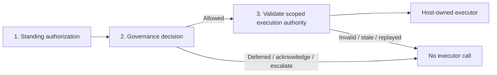
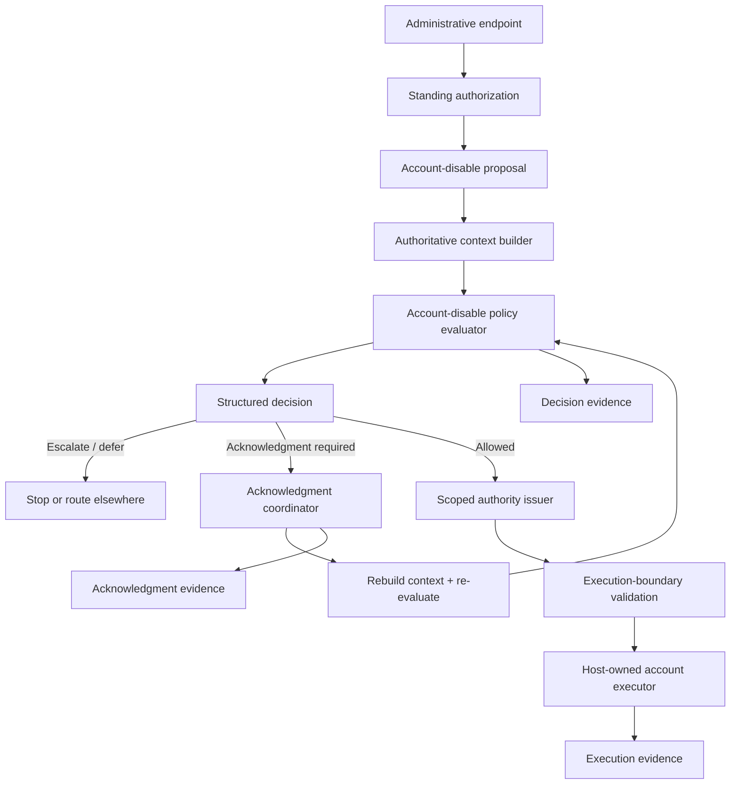

# Governed Administrative Operation

**Learning objective:** Compose the major governed-execution boundaries around one realistic administrative operation and distinguish architecture, implementation, operations, security, governance, and execution responsibilities without turning the specimen into a production framework.

**Pattern classification:** General learning material

**Difficulty:** Intermediate

**Prerequisites:** Recommended — [Decision Before Execution](../tutorials/decision-before-execution.md), [Policy Context and Explicit Decision Outcomes](../tutorials/policy-context-and-explicit-decision-outcomes.md), and [Scoped Capability and Host-Owned Execution](../tutorials/scoped-capability-and-host-owned-execution.md). [Acknowledgment and Audit Residue](../tutorials/acknowledgment-and-audit-residue.md) is useful for the paused branch.

**Estimated study time:** 30–45 minutes for the full case. The five-minute path below is enough to understand the composition before deciding whether the deeper implementation and operational sections are useful.

## Before You Begin

You do not need to have completed the prerequisite tutorials to use this case study. Keep five terms in view:

- **Standing authorization** answers whether the authenticated actor may enter the operation at all.
- **Authoritative context** contains host-trusted facts used to decide this exact operation.
- **Structured decision** is the operation-level outcome plus stable machine-readable evidence explaining why it was produced.
- **Scoped execution authority** is the narrow authority accepted at the final execution boundary; this case represents it with an `AccountDisableGrant`.
- **Host-owned execution** means the protected side effect remains behind application-controlled code instead of being performed by the evaluator or inferred directly from the request.

If one of those boundaries is unfamiliar, follow its contextual link when it first appears. The case remains readable without adopting the `AsiBackbone` package or any particular policy, workflow, or capability technology.

**Five-minute route:** read **At a Glance**, **The Minimal Core Path**, **Three Boundaries Only**, **Four-Branch Sequence**, the three traces, and **When Ordinary ASP.NET Core Authorization Is Enough**. The remaining sections are the deeper implementation, evidence, operations, and review material.

## At a Glance

This case study uses one fictional operation:

```text
account.disable
```

An authenticated administrator proposes disabling an account. The host must decide whether the exact operation may proceed under current resource and policy conditions before any protected side effect occurs.

The representative lifecycle is:

```text
Administrative request
        ↓
Authentication / standing authorization
        ↓
Typed proposed operation
        ↓
Authoritative resource and policy context
        ↓
Policy evaluation
        ↓
Structured decision + reason code
        ↓
Acknowledgment / escalation when required
        ↓
Scoped execution authority when allowed
        ↓
Host-owned executor
        ↓
Decision and execution evidence
```

The case preserves one invariant throughout:

> **No allowed decision and valid execution authority means no call to the protected executor.**

The operation, accounts, actors, policy identifiers, correlation identifiers, and evidence records below are simulated. Nothing in this case study connects to a real administrative system.

## The Minimal Core Path

The full study explains each responsibility independently. The smallest composition is only this:

```csharp
DisableAccountContext context =
    await contextBuilder.BuildAsync(proposal, actor, correlationId, cancellationToken);

AccountDisableDecision decision =
    AccountDisablePolicy.Evaluate(
        context,
        decisionId: ids.NewDecisionId(),
        evaluatedAt: clock.UtcNow);

await decisionRecorder.RecordAsync(context, decision, cancellationToken);

if (!decision.CanIssueExecutionAuthority)
{
    return decision;
}

AccountDisableGrant grant = grantIssuer.Issue(context, decision);

// Issuer-owned bindings, not caller-supplied authority:
// operation=account.disable; accountId=<proposal account>;
// resourceVersion=<current version>; notBefore=<issuer clock>;
// expiresAt=<short lifetime>; audience=account-administration; maxUses=1.
if (!grantValidator.TryAccept(grant, context, clock.UtcNow, out _))
{
    throw new InvalidOperationException("Execution authority was rejected.");
}

string executionId = ids.NewExecutionId();

await executor.DisableAsync(
    executionId,
    context.Proposal.AccountId,
    context.ResourceVersion,
    cancellationToken);

return decision;
```

The supporting sections exist to answer where `context`, `decision`, `grant`, freshness, evidence, and failure behavior come from. The architectural invariant does not require a large framework.

### Three Boundaries Only



Everything else in the case supports one of those three boundaries or preserves evidence about crossing it.

---

## 1. The Scenario

Assume an internal administrative API accepts a request to disable an account:

```http
POST /admin/accounts/account-204/disable
```

The authenticated principal may enter the endpoint only when the host's normal ASP.NET Core authorization policy recognizes the actor as an account administrator.

That standing authorization answers:

> **May this actor enter the account-disable operation?**

It does not yet answer every lifecycle question for the exact account. The organization also has operational rules such as:

- protected accounts require escalation instead of immediate execution;
- a maintenance hold defers account changes;
- a recent high-risk activity flag requires explicit acknowledgment before continuation;
- an ordinary account may be disabled immediately when current policy permits it.

Those rules create outcomes that are richer than endpoint access alone.

### Representative Policy Matrix

| Current condition | Decision outcome | Reason code | Immediate execution? |
| --- | --- | --- | --- |
| Ordinary account; no hold; no acknowledgment condition | `Allowed` | `ACCOUNT_DISABLE_ALLOWED` | Yes, after scoped authority is validated |
| Protected account | `EscalationRecommended` | `PROTECTED_ACCOUNT_REQUIRES_REVIEW` | No |
| Maintenance hold active | `Deferred` | `ACCOUNT_CHANGES_ON_HOLD` | No |
| High-risk activity requires explicit acceptance | `AcknowledgmentRequired` | `RECENT_ACTIVITY_REQUIRES_ACK` | No; pause, acknowledge, re-evaluate |
| Protected account **and** maintenance hold | `Deferred` | `ACCOUNT_CHANGES_ON_HOLD` | No; the hold takes precedence and the request is re-evaluated later |

The table is illustrative policy, not a claim that account administration should use these exact outcomes. When multiple signals are true, this specimen applies explicit precedence rather than relying on evaluation order by accident:

```text
Maintenance hold / Deferred
        ↓
Protected-account review / EscalationRecommended
        ↓
High-risk acceptance / AcknowledgmentRequired
        ↓
Allowed
```

That precedence is a teaching choice, not a universal rule. The important property is that conflicting policy signals have a deterministic resolution rule and the complete evaluated context remains available as evidence.

---

## 2. Keep the Responsibilities Separate

The case is easier to reason about when responsibility is explicit before classes are named.

| Responsibility | Case-study question | Representative owner in this specimen |
| --- | --- | --- |
| Architecture | Which components and boundaries exist? | Application architecture and the documented request-to-execution flow |
| Implementation | How might the boundaries be represented in .NET? | Endpoint, context builder, evaluator, continuation coordinator, grant validator, and interfaces shown below |
| Operational | Who deploys, monitors, retries, and supports it? | Host application's operations team and platform; intentionally not implemented here |
| Security | Who authenticates, protects credentials, and enforces trust boundaries? | ASP.NET Core authentication/authorization plus host and platform security controls |
| Governance | Who establishes policy and produces the decision? | Policy owner plus the host-controlled `AccountDisablePolicy` evaluator |
| Execution | Which component actually performs the side effect? | `IAccountDisableExecutor`, invoked only after the host accepts valid scoped authority |

A single application may implement several rows in one process. The point is not physical separation. The point is that evidence from one responsibility should not silently be treated as proof of another.

For example:

```text
Authenticated administrator
        ≠
Current operation-level policy allows this account change

Acknowledgment accepted
        ≠
Policy can no longer block the operation

Workflow state says Ready
        ≠
Current execution authority is valid

Decision recorded
        ≠
Side effect actually occurred
```

---

## 3. Architectural Component Map

The following names are teaching labels rather than required production abstractions.



Three boundaries matter most:

1. **Standing authorization boundary** — ordinary framework authorization decides whether the actor may enter the operation.
2. **Governance decision boundary** — current authoritative facts produce an explicit operation-level outcome.
3. **Execution boundary** — the host validates narrow authority immediately before the protected side effect.

---

## 4. Step One: Authenticate and Apply Standing Authorization

Use the platform authorization system for the job it already does well.

A representative endpoint could require a conventional policy:

```csharp
[Authorize(Policy = "AccountAdministrator")]
[HttpPost("/admin/accounts/{accountId}/disable")]
public Task<IResult> DisableAccountAsync(
    string accountId,
    DisableAccountRequest request,
    CancellationToken cancellationToken) =>
    accountDisableOrchestrator.HandleAsync(
        accountId,
        request,
        User,
        cancellationToken);
```

The endpoint delegates immediately to host-owned orchestration instead of embedding policy or execution logic in the controller.

The policy may inspect authenticated roles, claims, resource relationships, or other framework-supported inputs according to the application's needs.

Do not accept an `isAdministrator` flag from request JSON and treat it as equivalent evidence. The actor identity and standing authority come from host-trusted authentication and authorization state.

If ordinary ASP.NET Core authorization completely expresses the real requirement, the case can stop here and use a direct application service. A broader lifecycle earns its cost only when the operation genuinely needs more. [When ASP.NET Core Authorization Is Enough](../architecture/when-aspnet-core-authorization-is-enough.md) examines that boundary directly.

---

## 5. Step Two: Represent the Requested Operation Without Granting Authority

After standing authorization succeeds, turn the request into an explicit proposal:

```csharp
public sealed record DisableAccountProposal(
    string AccountId,
    string RequestedReason);
```

The proposal says what the caller is asking the application to consider. Treat the normalized proposal as immutable for that attempt; authoritative facts are added in the separate context rather than mutating the proposal into a trusted object.

It does **not** say that the operation is authorized, allowed, acknowledged, or executable.

`RequestedReason` is useful request provenance, but it remains caller-supplied narrative. It should not become a policy fact merely because it appears in a typed record.

Create the correlation identifier at the host orchestration boundary **before** authoritative context is built:

```text
CorrelationId = adm-2026-08-25-0001
```

That identifier is then propagated explicitly into the decision, any acknowledgment or escalation record, issued execution authority, and execution evidence. Do not regenerate it at each layer or rely on ambient log scope as the only correlation mechanism.

---

## 6. Step Three: Build Authoritative Context

The host now obtains the facts required to decide the exact operation.

A compact context model might be:

```csharp
public sealed record DisableAccountContext(
    DisableAccountProposal Proposal,
    string ActorId,
    bool IsProtectedAccount,
    bool MaintenanceHoldActive,
    bool RecentHighRiskActivity,
    string ResourceVersion,
    string PolicyId,
    string PolicyVersion,
    string CorrelationId);
```

Representative sources are deliberately different:

| Context field | Authoritative source |
| --- | --- |
| `ActorId` | Authenticated host identity |
| `AccountId` | Normalized route/proposal plus account lookup |
| `IsProtectedAccount` | Account or operations-policy source trusted for that classification |
| `MaintenanceHoldActive` | Current operations-policy state |
| `RecentHighRiskActivity` | Host-trusted risk or account state source |
| `ResourceVersion` | Account store concurrency/version signal |
| `PolicyId` / `PolicyVersion` | Policy provider or versioned policy configuration |
| `CorrelationId` | Host request/orchestration boundary |

The context builder should remain observational where practical. A method named `GetAccountAsync` is not harmless if it lazily provisions data, updates access timestamps, or triggers external side effects.

For deeper treatment of the trust transition, see [Trust Boundaries and Least Privilege](../security/trust-boundaries-and-least-privilege.md).

---

## 7. Step Four: Produce a Structured Decision

The evaluator returns a stable decision contract rather than performing the side effect.

```csharp
public enum AccountDisableOutcome
{
    Allowed,
    Deferred,
    AcknowledgmentRequired,
    EscalationRecommended
}

public static class AccountDisableReasonCodes
{
    public const string Allowed = "ACCOUNT_DISABLE_ALLOWED";
    public const string OnHold = "ACCOUNT_CHANGES_ON_HOLD";
    public const string AcknowledgmentRequired = "RECENT_ACTIVITY_REQUIRES_ACK";
    public const string ProtectedAccount = "PROTECTED_ACCOUNT_REQUIRES_REVIEW";
}

public sealed record AccountDisableDecision(
    string DecisionId,
    AccountDisableOutcome Outcome,
    string ReasonCode,
    string PolicyId,
    string PolicyVersion,
    DateTimeOffset EvaluatedAt,
    string CorrelationId)
{
    public bool CanIssueExecutionAuthority =>
        Outcome == AccountDisableOutcome.Allowed;
}
```

`Outcome` and `ReasonCode` are the fields application code may branch on. Display text is produced separately and is not a stable control-flow contract. `DecisionId`, `PolicyId`, `PolicyVersion`, `EvaluatedAt`, and `CorrelationId` make the decision independently identifiable and reconstructable later.

A representative evaluator can remain small and deterministic. The host supplies the decision identity and clock value so tests do not depend on hidden `Guid.NewGuid()` or `DateTimeOffset.UtcNow` calls:

```csharp
public static AccountDisableDecision Evaluate(
    DisableAccountContext context,
    string decisionId,
    DateTimeOffset evaluatedAt)
{
    if (context.MaintenanceHoldActive)
    {
        return Decision(
            context,
            decisionId,
            evaluatedAt,
            AccountDisableOutcome.Deferred,
            AccountDisableReasonCodes.OnHold);
    }

    if (context.IsProtectedAccount)
    {
        return Decision(
            context,
            decisionId,
            evaluatedAt,
            AccountDisableOutcome.EscalationRecommended,
            AccountDisableReasonCodes.ProtectedAccount);
    }

    if (context.RecentHighRiskActivity)
    {
        return Decision(
            context,
            decisionId,
            evaluatedAt,
            AccountDisableOutcome.AcknowledgmentRequired,
            AccountDisableReasonCodes.AcknowledgmentRequired);
    }

    return Decision(
        context,
        decisionId,
        evaluatedAt,
        AccountDisableOutcome.Allowed,
        AccountDisableReasonCodes.Allowed);
}

private static AccountDisableDecision Decision(
    DisableAccountContext context,
    string decisionId,
    DateTimeOffset evaluatedAt,
    AccountDisableOutcome outcome,
    string reasonCode) =>
    new(
        DecisionId: decisionId,
        Outcome: outcome,
        ReasonCode: reasonCode,
        PolicyId: context.PolicyId,
        PolicyVersion: context.PolicyVersion,
        EvaluatedAt: evaluatedAt,
        CorrelationId: context.CorrelationId);
```

The evaluator order implements the conflict precedence shown in the policy matrix. If the host later changes that precedence, tests should change with it; the order should never be an undocumented accident.

[Policy Context and Explicit Decision Outcomes](../tutorials/policy-context-and-explicit-decision-outcomes.md) develops this model in more detail.

---

## 8. Step Five: Route Acknowledgment and Escalation Without Falling Through

A non-allowed decision does not invoke the protected executor.

### Escalation

For a protected account:

```text
Outcome = EscalationRecommended
ReasonCode = PROTECTED_ACCOUNT_REQUIRES_REVIEW
```

The host may create a review task, return a structured response, or route the case to a separate workflow.

What it must not do is treat `EscalationRecommended` as a warning and continue into execution anyway.

For a fuller delayed-review lifecycle, see [Human-in-the-Loop Governance Workflows](../governance/human-in-the-loop-governance-workflows.md) and [Escalation Patterns in Governed Systems](../governance/escalation-patterns-in-governed-systems.md).

### Acknowledgment

For a high-risk activity condition:

```text
Outcome = AcknowledgmentRequired
ReasonCode = RECENT_ACTIVITY_REQUIRES_ACK
```

The host can issue a bound acknowledgment challenge containing enough identity to prove what the actor was asked to accept. Acceptance does not convert the old decision directly into execution authority.

A safer continuation is:

```text
Acknowledgment accepted
        ↓
Rebuild current authoritative context
        ↓
Re-evaluate current policy
        ↓
Allowed now?
  ├── no  → stop / defer / escalate again
  └── yes → issue scoped execution authority
```

That prevents acknowledgment from becoming a policy bypass. [Acknowledgment and Audit Residue](../tutorials/acknowledgment-and-audit-residue.md) covers challenge binding and evidence in detail.

---

## 9. Step Six: Issue Only the Authority Needed for Execution

An `Allowed` decision still does not need to become broad administrative permission.

A small host-owned grant model could bind the exact continuation:

```csharp
public sealed record AccountDisableGrant(
    string GrantId,
    string DecisionId,
    string ActorId,
    string Operation,
    string AccountId,
    string Audience,
    string ResourceVersion,
    string PolicyId,
    string PolicyVersion,
    string CorrelationId,
    string? AcknowledgmentId,
    DateTimeOffset IssuedAt,
    DateTimeOffset NotBefore,
    DateTimeOffset ExpiresAt,
    int MaxUses);
```

For this operation:

```text
Operation = account.disable
AccountId = account-204
Audience = account-administration
AcknowledgmentId = null on the direct allowed path
IssuedAt = host clock at issuance
NotBefore = host-selected activation time, normally issuance time here
ExpiresAt = shortly after `NotBefore`
MaxUses = 1
```

The case study uses **scoped execution authority** as the architectural concept and `AccountDisableGrant` as its illustrative record. The broader Learning material also uses **capability** for this class of bounded authority. Those terms should not be read as three different permissions in this specimen.

The case study intentionally does not prescribe JWT, macaroons, database-backed grants, signed envelopes, or another wire format. A capability format is useful only if the host can enforce the semantics it claims to carry.

A minimal acceptance check can still make the required semantics concrete:

```csharp
private static readonly TimeSpan MaximumGrantLifetime = TimeSpan.FromMinutes(5);
private static readonly TimeSpan AllowedClockSkew = TimeSpan.FromSeconds(30);

public bool TryAccept(
    AccountDisableGrant grant,
    DisableAccountContext current,
    DateTimeOffset now,
    out string? rejectionReason)
{
    bool bindingMismatch =
        grant.Operation != "account.disable" ||
        grant.Audience != "account-administration" ||
        grant.AccountId != current.Proposal.AccountId ||
        grant.ResourceVersion != current.ResourceVersion ||
        grant.PolicyId != current.PolicyId ||
        grant.PolicyVersion != current.PolicyVersion;

    bool freshnessFailure =
        grant.IssuedAt > now + AllowedClockSkew ||
        grant.NotBefore > now + AllowedClockSkew ||
        grant.ExpiresAt < now - AllowedClockSkew ||
        grant.ExpiresAt <= grant.NotBefore ||
        grant.ExpiresAt - grant.NotBefore > MaximumGrantLifetime;

    if (bindingMismatch || freshnessFailure ||
        !authorityState.TryConsumeIfActive(grant.GrantId, grant.MaxUses))
    {
        rejectionReason = "grant-invalid-stale-revoked-or-replayed";
        return false;
    }

    rejectionReason = null;
    return true;
}
```

The five-minute lifetime and 30-second skew are illustrative bounds, not universal security values. `TryConsumeIfActive` represents one protected atomic state transition that rejects revoked grants and exhausted/replayed uses. A grant that crosses an untrusted boundary would also need whatever issuer, integrity, signature, key, or storage validation its representation requires **before** these semantic checks are accepted.

The grant should be issued only from an allowed decision, and its current bindings should be validated at the execution boundary. [Scoped Capability and Host-Owned Execution](../tutorials/scoped-capability-and-host-owned-execution.md) explains the boundary; [Replay Protection and Bounded-Use Authority](../security/replay-protection-and-bounded-use.md) covers stateful one-time or bounded-use enforcement.

---

## 10. Step Seven: Keep the Side Effect Behind a Host-Owned Executor

The protected operation belongs to a dedicated host-owned execution seam:

```csharp
public interface IAccountDisableExecutor
{
    Task DisableAsync(
        string executionId,
        string accountId,
        string expectedResourceVersion,
        CancellationToken cancellationToken);
}
```

The orchestration boundary should make the final condition visible:

```csharp
string decisionId = ids.NewDecisionId();
DateTimeOffset evaluatedAt = clock.UtcNow;

AccountDisableDecision decision = AccountDisablePolicy.Evaluate(
    context,
    decisionId,
    evaluatedAt);

await decisionRecorder.RecordAsync(context, decision, cancellationToken);

if (!decision.CanIssueExecutionAuthority)
{
    return decision;
}

AccountDisableGrant grant = grantIssuer.Issue(context, decision);

if (!grantValidator.TryAccept(
        grant,
        context,
        clock.UtcNow,
        out string? rejectionReason))
{
    throw new InvalidOperationException(
        $"Execution authority was rejected: {rejectionReason}");
}

string executionId = ids.NewExecutionId();

await executor.DisableAsync(
    executionId,
    context.Proposal.AccountId,
    context.ResourceVersion,
    cancellationToken);
```

Production code may separate issuance and execution across processes or time. It may also use a durable outbox, queue, workflow engine, or transaction boundary. Those are operational and implementation decisions, not requirements of this teaching specimen.

The architectural rule survives those variations:

> **The component that evaluates or proposes the operation does not silently become the component that performs the side effect.**

This boundary also reduces a classic confused-deputy risk: the API or evaluator cannot use downstream administrative credentials merely because a caller supplied a plausible request or because policy evaluation returned a descriptive result. Only the execution seam receives the authority needed to perform the side effect.

### Idempotency Is a Separate Contract

`account.disable` is state-convergent—an already-disabled account is still disabled—but that does not make every downstream effect automatically idempotent. Notifications, external API calls, counters, or evidence writes can still duplicate.

For this specimen:

- every repeated request still passes through fresh authentication, context construction, and policy evaluation;
- the executor uses the expected resource version to reject stale writes;
- a downstream system that supports idempotency should receive the host-generated `ExecutionId` (or another deliberately stable operation key) as its idempotency key;
- if the account is already disabled when fresh authoritative state is loaded, the host may return a domain-level no-op/already-completed result rather than repeating side effects.

Idempotency limits duplicate effects. It does not replace authorization, policy freshness, or replay protection for execution authority.

---

## 11. Step Eight: Preserve Decision and Execution Evidence Separately

One correlation identifier connects the lifecycle, but different records answer different questions. Identifiers are added as they come into existence rather than pretending a future grant or execution already exists at decision time.

### Correlation Schema

Use one explicit linkage envelope across the three core evidence types—decision, grant, and execution:

```csharp
public sealed record EvidenceCorrelation(
    string CorrelationId,
    string DecisionId,
    string? GrantId,
    string? ExecutionId,
    string PolicyId,
    string PolicyVersion,
    string ResourceVersion,
    DateTimeOffset EvaluatedAt);
```

Each core receipt carries that envelope:

```csharp
public sealed record DecisionReceipt(
    EvidenceCorrelation Correlation,
    AccountDisableOutcome Outcome,
    string ReasonCode);

public sealed record GrantReceipt(
    EvidenceCorrelation Correlation,
    string Audience,
    DateTimeOffset NotBefore,
    DateTimeOffset ExpiresAt,
    int MaxUses);

public sealed record ExecutionReceipt(
    EvidenceCorrelation Correlation,
    string Executor,
    string Result,
    DateTimeOffset ExecutionTime);
```

The values become more complete as the lifecycle advances:

| Evidence record | `GrantId` | `ExecutionId` | Required common fields |
| --- | --- | --- | --- |
| Decision receipt | `null` | `null` | `CorrelationId`, `DecisionId`, `PolicyId`, `PolicyVersion`, `ResourceVersion`, `EvaluatedAt` |
| Grant/authority receipt | populated | `null` | the same common fields plus the issued `GrantId` |
| Execution receipt | populated | populated | the same common fields plus `GrantId` and `ExecutionId` |

An acknowledgment receipt uses the same decision linkage and policy/resource snapshot, plus its own `AcknowledgmentId` and response fields. Keeping future identifiers nullable preserves temporal truth while still giving every core evidence type one stable correlation schema.

The common keys make the evidence joinable without collapsing distinct lifecycle events into one oversized record.

### Decision Evidence

A decision receipt can preserve:

```text
CorrelationId: adm-2026-08-25-0001
DecisionId: decision-41a2
Operation: account.disable
ActorId: admin-17
AccountId: account-204
ResourceVersion: rv-882
PolicyId: account-administration-policy
PolicyVersion: 4.2
Outcome: Allowed
ReasonCode: ACCOUNT_DISABLE_ALLOWED
EvaluatedAt: 2026-08-25T13:45:12Z
```

The free-text `RequestedReason` from the proposal is intentionally omitted here because the illustrative policy does not use it. `AccountId` is shown only because this is fictional teaching data; a production evidence schema should minimize, tokenize, hash, or replace account identifiers, free text, PII, and other sensitive values when the full value is not genuinely required for reconstruction, accountability, or a defined retention purpose.

### Acknowledgment Evidence

A paused branch can preserve the bound interruption separately:

```text
CorrelationId: adm-2026-08-25-0003
DecisionId: decision-8c11
AcknowledgmentId: ack-7720
PolicyVersion: 4.2
ChallengeCode: RECENT_ACTIVITY_REQUIRES_ACK
ActorResponse: Accepted
RespondedAt: 2026-08-25T14:02:09Z
```

### Grant Evidence

The issued-authority receipt carries the same decision snapshot and adds the grant identity and activation bounds:

```text
CorrelationId: adm-2026-08-25-0001
DecisionId: decision-41a2
GrantId: grant-7f2a
ExecutionId: null
PolicyId: account-administration-policy
PolicyVersion: 4.2
ResourceVersion: rv-882
EvaluatedAt: 2026-08-25T13:45:12Z
Audience: account-administration
NotBefore: 2026-08-25T13:45:12Z
ExpiresAt: 2026-08-25T13:50:12Z
MaxUses: 1
```

### Execution Evidence

Execution evidence can preserve:

```text
CorrelationId: adm-2026-08-25-0001
DecisionId: decision-41a2
GrantId: grant-7f2a
ExecutionId: exec-2d90
PolicyId: account-administration-policy
PolicyVersion: 4.2
ResourceVersion: rv-882
EvaluatedAt: 2026-08-25T13:45:12Z
Operation: account.disable
AccountId: account-204
ExpectedResourceVersion: rv-882
Executor: AccountDisableExecutor
Result: Completed
ExecutionTime: 2026-08-25T13:45:13Z
```

The decision record explains **why the host permitted or blocked continuation**. The acknowledgment record explains **what interruption was accepted or rejected**. The grant record explains **what bounded authority was issued**. The execution record explains **whether the protected side effect was attempted or completed**.

None automatically proves immutability, tamper evidence, legal sufficiency, or complete operational history. Those properties require separate storage, signing, retention, access-control, and verification decisions. [Policy Versioning and Decision Provenance](../governance/policy-versioning-and-decision-provenance.md) explains why policy identity belongs in historical evidence.

---

## 12. Four-Branch Sequence

```mermaid
sequenceDiagram
    participant H as Host/orchestrator
    participant P as Policy evaluator
    participant A as Acknowledgment
    participant G as Grant validator
    participant E as Executor
    participant R as Evidence store

    H->>P: Evaluate current authoritative context
    alt Allowed
        P-->>H: Allowed + reason + policy evidence
        H->>R: Record decision receipt
        H->>G: Issue and validate scoped authority
        H->>R: Record grant/authority receipt
        G-->>H: Accepted
        H->>E: Execute account.disable
        E-->>H: Execution result
        H->>R: Record execution receipt
    else EscalationRecommended
        P-->>H: EscalationRecommended
        H->>R: Record decision receipt
        Note over H,E: No grant; executor invocations = 0
    else Deferred
        P-->>H: Deferred
        H->>R: Record decision receipt
        Note over H,E: Retry only through a fresh host-owned attempt; executor invocations = 0
    else AcknowledgmentRequired
        P-->>H: AcknowledgmentRequired
        H->>R: Record decision receipt
        H->>A: Present bound challenge
        A-->>H: Accepted
        H->>R: Record acknowledgment receipt
        H->>P: Rebuild context and re-evaluate
        alt Re-evaluation Allowed
            P-->>H: Allowed
            H->>R: Record new decision receipt
            H->>G: Issue and validate new scoped authority
            H->>R: Record new grant/authority receipt
            G-->>H: Accepted
            H->>E: Execute account.disable
            E-->>H: Execution result
            H->>R: Record execution receipt
        else Still blocked / changed policy
            P-->>H: Deferred or EscalationRecommended
            H->>R: Record new decision receipt
            Note over H,E: No grant; executor invocations = 0
        end
    end
```

The diagram deliberately shows zero protected execution on every non-`Allowed` branch. Acknowledgment does not reuse the old decision; it causes a fresh evaluation before any new execution authority can exist.

---

## 13. Trace A — Allowed Operation

The first trace uses an ordinary account with no active hold and no acknowledgment condition.

| Stage | Observed value |
| --- | --- |
| Correlation | `adm-2026-08-25-0001` |
| Decision ID | `decision-41a2` |
| Actor | `admin-17` |
| Standing authorization | Succeeded |
| Operation | `account.disable` |
| Resource | `account-204` |
| Resource version | `rv-882` |
| Protected account | `false` |
| Maintenance hold | `false` |
| High-risk acknowledgment condition | `false` |
| Policy | `account-administration-policy` version `4.2` |
| Decision | `Allowed` |
| Reason code | `ACCOUNT_DISABLE_ALLOWED` |
| Scoped grant | `grant-7f2a`, issued for `account.disable` on `account-204`, one use, short lifetime |
| Grant validation | Accepted |
| Execution ID | `exec-2d90` |
| Executor invocation count | `1` |
| Execution result | Simulated account disable completed |

The observable sequence is:

```text
Standing authorization succeeds
        ↓
Current context assembled
        ↓
Allowed / ACCOUNT_DISABLE_ALLOWED
        ↓
Decision evidence recorded
        ↓
One-use authority issued and validated
        ↓
Executor invoked exactly once
        ↓
Execution evidence correlated to the same request
```

The important claim is narrow: under these simulated conditions, the host has evidence of an allowed decision and the protected executor was invoked once.

---

## 14. Trace B — Escalated Operation

The second trace uses a protected account.

| Stage | Observed value |
| --- | --- |
| Correlation | `adm-2026-08-25-0002` |
| Decision ID | `decision-6ba4` |
| Actor | `admin-17` |
| Standing authorization | Succeeded |
| Operation | `account.disable` |
| Resource | `account-001` |
| Resource version | `rv-991` |
| Protected account | `true` |
| Policy | `account-administration-policy` version `4.2` |
| Decision | `EscalationRecommended` |
| Reason code | `PROTECTED_ACCOUNT_REQUIRES_REVIEW` |
| Scoped grant | **Not issued** |
| Executor invocation count | **`0`** |
| Next state | Review/escalation path only |

The observable sequence is:

```text
Standing authorization succeeds
        ↓
Current context assembled
        ↓
EscalationRecommended
        ↓
PROTECTED_ACCOUNT_REQUIRES_REVIEW
        ↓
Decision evidence recorded
        ↓
No execution authority issued
        ↓
Executor invocation count = 0
```

This is why the case separates standing authorization from the operation-level lifecycle. The actor is still a valid administrator, but the exact operation does not cross into immediate execution.

The architectural invariant is stronger than checking the returned enum:

> **The escalated decision produced zero protected executor calls.**

---

## 15. Trace C — Acknowledgment Does Not Override Changed Policy

A short third trace demonstrates why acknowledgment is a pause rather than a bypass.

```text
CorrelationId: adm-2026-08-25-0003
Initial DecisionId: decision-8c11
Initial policy: 4.2
Initial outcome: AcknowledgmentRequired
Reason: RECENT_ACTIVITY_REQUIRES_ACK
        ↓
Actor accepts bound acknowledgment
        ↓
Host rebuilds context
        ↓
Re-evaluation DecisionId: decision-b5e0
Current policy: 4.3
Maintenance hold: true
        ↓
Re-evaluated outcome: Deferred
Reason: ACCOUNT_CHANGES_ON_HOLD
        ↓
No grant issued
Executor invocation count: 0
```

The acknowledgment is still valid evidence that the actor accepted the presented condition. It simply does not prove that current policy allows execution. The same re-evaluation must account for **resource** drift as well as policy drift: if the account version changes between the original decision, acknowledgment, and continuation, the refreshed context and execution-boundary version check must prevent stale authority from silently reaching the executor.

---

## 16. What the Tests Should Prove

A useful test suite for this case should verify both decisions and execution behavior.

At minimum, every blocked-path test should assert both the decision and the absence of protected execution. With a recording fake:

```csharp
Assert.Equal(
    AccountDisableOutcome.EscalationRecommended,
    decision.Outcome);

Assert.Equal(0, fakeExecutor.Invocations.Count);
```

That second assertion is the boundary proof; checking only the returned outcome does not prove the host respected it.

For the allowed path:

```csharp
Assert.Equal(AccountDisableOutcome.Allowed, decision.Outcome);
Assert.Equal(AccountDisableReasonCodes.Allowed, decision.ReasonCode);
Assert.False(string.IsNullOrWhiteSpace(decision.DecisionId));
Assert.Equal("4.2", decision.PolicyVersion);
Assert.Equal(1, executor.InvocationCount);
```

For the protected-account path:

```csharp
Assert.Equal(
    AccountDisableOutcome.EscalationRecommended,
    decision.Outcome);
Assert.Equal(
    AccountDisableReasonCodes.ProtectedAccount,
    decision.ReasonCode);
Assert.Equal(0, executor.InvocationCount);
```

For the acknowledgment/re-evaluation path:

```csharp
Assert.Equal(AccountDisableOutcome.Deferred, decision.Outcome);
Assert.Equal(AccountDisableReasonCodes.OnHold, decision.ReasonCode);
Assert.Equal(0, executor.InvocationCount);
```

The conflicting-signal policy rule should also be executable rather than prose-only:

```csharp
Assert.True(context.IsProtectedAccount);
Assert.True(context.MaintenanceHoldActive);
Assert.Equal(AccountDisableOutcome.Deferred, decision.Outcome);
Assert.Equal(AccountDisableReasonCodes.OnHold, decision.ReasonCode);
Assert.Equal(0, executor.InvocationCount);
```

Additional tests should reject:

- an expired grant;
- a grant bound to a different account;
- a grant whose policy or resource freshness rule is no longer satisfied;
- replay when the grant is one-use;
- execution after `Deferred`, `AcknowledgmentRequired`, or `EscalationRecommended`.

The existing [Decision Before Execution executable sample](https://github.com/AsiBackbone/Learning/tree/main/samples/decision-before-execution) provides a smaller runnable example of the zero-execution invariant. The [Build a Governed API Operation lab](../labs/build-a-governed-api-operation.md) is the hands-on companion for composing similar boundaries yourself.

---

## 17. Operational and Security Questions Remain Host-Owned

The case study deliberately stops short of pretending that architecture diagrams answer production operations. It does, however, need a clear contract at the boundaries it introduces.

### Operational Responsibility

A real application still has to decide:

- where the endpoint and executor are deployed;
- how retries and timeouts work;
- whether delayed continuation uses a queue, workflow engine, or database state;
- how operators observe latency, failures, backlogs, and stuck reviews;
- how disaster recovery affects outstanding grants and acknowledgment state.

For this specimen, use these failure semantics as the teaching contract:

- **Decision evidence is required before authority is issued.** If the host cannot durably record the decision evidence it requires, the sample fails closed and does not mint a grant or call the executor.
- **Execution evidence is written after the protected attempt.** If the side effect succeeds but execution-evidence persistence fails, the host must reconcile or retry the **evidence write**, not blindly repeat the side effect. A transactional outbox or executor-owned durable result can narrow this gap when the implementation permits it.
- **Evidence success does not imply execution success.** A recorded `Allowed` decision may be followed by a failed executor result; preserve those as separate facts.
- **`Deferred` is retryable only through a fresh attempt.** The host or workflow owner controls queueing, lease ownership, backoff, expiration, and retry limits. A tight loop inside the evaluator is not the retry strategy.
- **Consumed one-use authority is not silently restored after executor failure.** A retry either requires fresh evaluation and a new grant or a deliberately designed claim/finalize authority state machine.
- **No cross-system atomicity is assumed.** If the protected side effect and evidence store are independent systems, the application must choose reconciliation, outbox, idempotency, or compensation behavior explicitly.

Concretely, the decision recorder runs **before** grant issuance: if `decisionRecorder.RecordAsync` fails, the host fails closed and never calls `DisableAsync`. Execution evidence runs **after** the protected attempt: if `DisableAsync` succeeds but `executionRecorder.RecordAsync` fails, retry the evidence write keyed by the same `ExecutionId`; do not repeat the side effect merely to recreate the receipt. This specimen assumes the executor can propagate `ExecutionId` as an idempotency key when the downstream administrative boundary supports that contract. If the executor result is ambiguous, reconcile by `ExecutionId` or authoritative resource state before deciding whether another attempt is safe. An outbox is one appropriate implementation when evidence and local state can share a durable transaction, but the architecture does not require an outbox when another durable reconciliation strategy provides the needed guarantee.

### Security Responsibility

A real application also has to decide:

- which authentication mechanism establishes the administrator identity;
- how credentials, signing keys, or service identities are stored and rotated;
- how tenant boundaries are enforced;
- how transport and storage are protected;
- which fields may safely appear in logs or durable evidence;
- how grant validation state is protected from replay or tampering.

For the scoped authority shown here, the minimum security story is explicit: bind audience, operation, account, policy/resource freshness, lifetime, and use count; allow only bounded clock skew; atomically consume one-use grants; and reject revoked grants. If the consequence or grant lifetime justifies active revocation, the host needs a protected revocation/consumption store rather than relying on expiry alone.

Evidence should follow data-minimization rules. Prefer stable identifiers, reason codes, versions, and purpose-limited references over raw request bodies, free-text reasons, credentials, tokens, or unnecessary account attributes. Operational logs may need even less data than durable governance evidence.

These concerns interact with governance but are not automatically solved by introducing a decision object or capability record.

---

## 18. When Ordinary ASP.NET Core Authorization Is Enough

This case study intentionally demonstrates a richer lifecycle. Do not infer that every account-disable endpoint needs one.

Suppose the complete requirement is:

```text
Only administrators may disable accounts,
and a loaded protected account simply fails authorization.
```

ASP.NET Core resource-based authorization can express actor and resource checks directly. If the decision is immediate, yes/no is sufficient, no acknowledgment or escalation lifecycle exists, no narrow continuation authority crosses another boundary, and ordinary application audit/history is enough, a direct authorized application service may be the clearer design.

Use the broader composition only when the requirements actually include distinctions such as:

```text
Allowed
Deferred
AcknowledgmentRequired
EscalationRecommended
```

or when decisions must survive time/process boundaries, mint narrower execution authority, or leave dedicated provenance before execution.

Two comparison pages make the proportionality threshold explicit without requiring you to leave this case to understand the distinction:

- [When ASP.NET Core Authorization Is Enough](../architecture/when-aspnet-core-authorization-is-enough.md) covers the case where framework-native roles, claims, policies, handlers, or resource-based authorization fully express the required yes/no access decision.
- [When a Simple Application Service Is Enough](../architecture/when-a-simple-application-service-is-enough.md) covers the case where one trusted host can validate and execute the operation immediately without a separate long-lived decision, acknowledgment, workflow, or scoped-authority lifecycle.

Use the richer case-study composition only after one of those simpler boundaries stops expressing the real requirement clearly.

---

## 19. Common Failure Modes

### Authorization is treated as the final lifecycle decision

The endpoint proves that the actor is an administrator, then immediately invokes the executor even though current account or policy state requires another outcome.

### The evaluator performs the side effect

If `Evaluate` disables the account while returning `Allowed`, there is no meaningful decision-before-execution boundary left to test.

### Acknowledgment becomes a bypass

The actor clicks `Continue`, and the host executes without rebuilding current context or re-evaluating changed policy.

### Escalation still falls through

The host records `EscalationRecommended` but invokes the executor because the routing branch is advisory rather than enforced.

### Scoped authority becomes standing authority

A grant for one account is reusable for arbitrary accounts, audiences, or future operations.

### Replay or revocation state is ignored

The grant is still cryptographically or structurally valid, so the executor accepts it again even though its one permitted use was consumed or the host revoked it.

### Display text becomes control flow

A host branches on a human-readable message such as `"Account changes are on hold"` instead of the stable outcome and reason-code contract. Wording changes then become behavior changes.

### Correlation is added only to log messages

The decision, acknowledgment, grant, and execution records cannot be joined reliably because the correlation identity was not modeled across the lifecycle.

### Decision evidence is mistaken for execution evidence

A record saying `Allowed` is later reported as proof that the account was disabled even though the executor may have failed or never run.

### The architecture is larger than the problem

A simple resource-based authorization requirement becomes a policy engine, workflow service, capability issuer, and evidence store without a real lifecycle or trust-boundary need.

---

## 20. Review Checklist

For an administrative operation like this one, ask:

1. What does ordinary authentication and authorization establish before governance begins?
2. Which proposal fields are caller supplied, and which facts must be rebuilt from authoritative host sources?
3. Which policy identity and version produced the decision?
4. Are reason codes stable enough to support tests and evidence without depending on display text?
5. Which outcomes stop immediate execution?
6. If acknowledgment occurs, is current context rebuilt and policy re-evaluated before continuation?
7. Is execution authority bound to the exact operation, resource, freshness state, lifetime, and use policy required?
8. Which component owns the protected side effect?
9. Can a test prove that blocked, deferred, or escalated paths produce zero executor invocations?
10. Can decision evidence and execution evidence be correlated without pretending they are the same event?
11. When multiple policy signals conflict, is precedence explicit and tested?
12. Are decision, acknowledgment, grant, and execution records linked by stable identifiers while minimizing sensitive data?
13. Is grant freshness, replay consumption, and revocation behavior defined at the execution boundary?
14. If execution and evidence persistence partially fail, is retry/reconciliation behavior defined without accidentally repeating the side effect?
15. Could ASP.NET Core authorization or one application service preserve the real requirements with less machinery?

If those answers are explicit, the architecture is easier to review even when the production implementation uses different class names, storage technologies, or deployment boundaries.

---

## Continue Deeper

For the individual boundaries behind this composition:

- [Decision Before Execution](../tutorials/decision-before-execution.md) explains the foundational zero-execution invariant.
- [Policy Context and Explicit Decision Outcomes](../tutorials/policy-context-and-explicit-decision-outcomes.md) develops authoritative context and richer outcomes.
- [Acknowledgment and Audit Residue](../tutorials/acknowledgment-and-audit-residue.md) covers bound interruption and evidence.
- [Scoped Capability and Host-Owned Execution](../tutorials/scoped-capability-and-host-owned-execution.md) covers narrow continuation authority and execution-boundary validation.
- [Policy Versioning and Decision Provenance](../governance/policy-versioning-and-decision-provenance.md) covers policy identity, drift, and historical evidence.

For practice rather than another explanation, complete [Build a Governed API Operation](../labs/build-a-governed-api-operation.md). It is the recommended next step after this 30–45 minute case study because it turns the composition into a learner-owned implementation and test exercise.

The case study should leave one composition rule visible:

> **Authenticate with established platform controls, decide from authoritative current context, pause or route when the outcome requires it, issue only the authority the allowed operation needs, and keep the protected side effect behind a host-owned execution boundary.**
