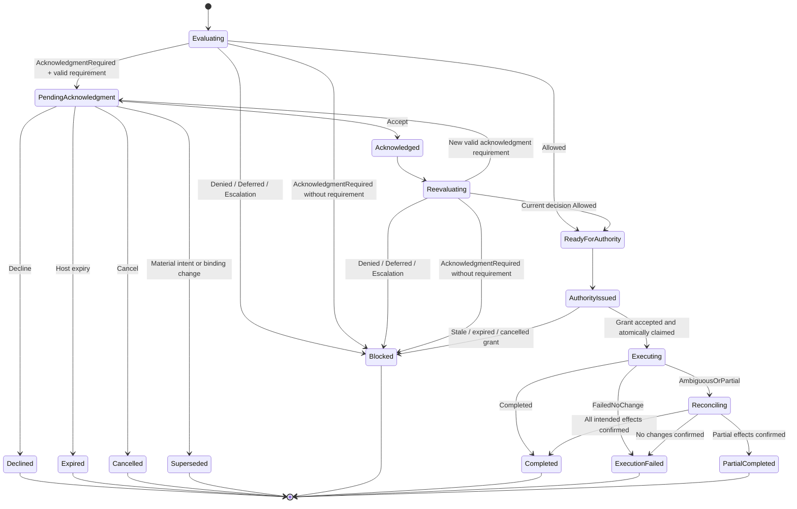
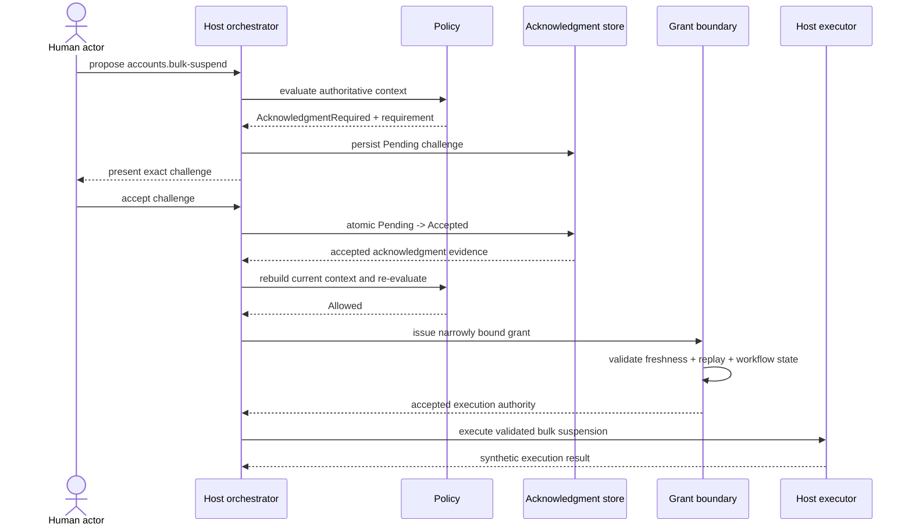

# Human Acknowledgment Workflow

**Learning objective:** Follow one consequential operation across the complete acknowledgment lifecycle and keep acknowledgment, approval, policy, persistence, scoped execution authority, and execution as separate architectural responsibilities.

**Pattern classification:** General learning material

**Difficulty:** Intermediate

**Prerequisites:** Recommended — [Acknowledgment and Audit Residue](../tutorials/acknowledgment-and-audit-residue.md) and [Scoped Capability and Host-Owned Execution](../tutorials/scoped-capability-and-host-owned-execution.md). [Human-in-the-Loop Governance Workflows](../governance/human-in-the-loop-governance-workflows.md) is useful when the requirement is independent review rather than acknowledgment.

**Estimated study time:** 35–50 minutes for the guided path or approximately 75–95 minutes for a careful full read including the persistence, race, evidence, and failure sections.

**Depth note:** The guided acknowledgment lifecycle is Intermediate material. The distributed compare-and-set, canonicalization, replay, and partial-execution sections are advanced implementation considerations that can be skipped on a first pass.

## Before You Begin

This case study uses one fictional operation:

```text
accounts.bulk-suspend
```

An authenticated tenant administrator asks the host to suspend three synthetic user accounts during a maintenance event. Current policy allows the operation in principle, but requires the actor to acknowledge the operational consequence before narrow execution authority can be created.

The study preserves two invariants:

> **Acknowledged ≠ Executed.**

and:

> **Acknowledgment without valid current authority means no protected execution.**

The accounts, actors, policies, challenge text, identifiers, persistence records, and executor are fictional. No real account system is contacted.

**Guided route:** read **At a Glance**, **The Scenario**, **Acknowledgment Is Not Approval**, **The Workflow State Machine**, **The Successful Sequence**, the four changed-state traces, and **Invariant Tests**. The remaining sections deepen implementation, persistence, concurrency, evidence, and operational tradeoffs.

## At a Glance

The complete path is:

```text
Intent
  ↓
Authoritative context
  ↓
Policy evaluation
  ↓
AcknowledgmentRequired
  ↓
Durable acknowledgment challenge
  ↓
Human accepts / declines
  ↓
Validate response + current workflow state
  ↓
Rebuild current context
  ↓
Re-evaluate current policy
  ↓
Allowed
  ↓
Scoped execution authority
  ↓
Execution-boundary validation
  ↓
Host-owned executor
```

The decisive distinction is that the acknowledgment is **evidence of a human response to a specific policy requirement**. It is not the policy decision, not approval by a separate reviewer, not a capability, and not a side effect.

A challenge record can exist for hours without any protected executor call. An accepted acknowledgment can remain historically valid while current policy still blocks continuation.

---

## 1. The Scenario

Assume a fictional internal API accepts:

```http
POST /admin/accounts/bulk-suspend
```

The authenticated actor is:

```text
ActorId: admin-42
Tenant: tenant-north
Standing role: TenantAccountAdministrator
```

The proposed operation is:

```text
Operation: accounts.bulk-suspend
Targets:
- acct-101
- acct-102
- acct-103
Reason: maintenance-access-reset
Requested duration: 30 minutes
```

The host resolves the current target facts:

| Target | Tenant | State | Protection | Version |
| --- | --- | --- | --- | --- |
| `acct-101` | `tenant-north` | Active | Ordinary | `rv-11` |
| `acct-102` | `tenant-north` | Active | Ordinary | `rv-7` |
| `acct-103` | `tenant-north` | Active | Ordinary | `rv-19` |

The fictional policy family is:

```text
PolicyId: tenant-account-bulk-suspend
PolicyVersion: 7
PolicyFingerprint: sha256:bulk-suspend-v7-demo
```

Its teaching rules are:

| Condition | Outcome | Reason code |
| --- | --- | --- |
| No targets | `Denied` | `BULK_SUSPEND_EMPTY_TARGET_SET` |
| Actor or target tenant mismatch | `Denied` | `BULK_SUSPEND_TENANT_MISMATCH` |
| Maintenance freeze active | `Deferred` | `ACCOUNT_CHANGES_ON_HOLD` |
| Any protected target | `EscalationRecommended` | `PROTECTED_ACCOUNT_REQUIRES_REVIEW` |
| More than 10 targets | `Denied` | `BULK_SUSPEND_TARGET_LIMIT` |
| 1–2 ordinary targets and no other blocking condition | `Allowed` | `BULK_SUSPEND_ALLOWED` |
| 3–10 ordinary targets and exact current acknowledgment not satisfied | `AcknowledgmentRequired` | `BULK_SUSPEND_IMPACT_ACK_REQUIRED` |
| 3–10 ordinary targets and exact current acknowledgment satisfied | `Allowed` | `BULK_SUSPEND_ALLOWED` |

When more than one condition is true, this specimen composes them through an explicit outcome rule rather than table order:

```text
Denied
  >
Deferred
  >
EscalationRecommended
  >
AcknowledgmentRequired
  >
Allowed
```

All applicable blocking facts may still be preserved as internal evidence. This precedence is a teaching choice for the fictional operation, not a universal governance hierarchy.

The target-count part of the table is intentionally total for this specimen: zero targets are invalid, one or two ordinary targets do not require acknowledgment, three through ten ordinary targets require the exact current acknowledgment, and more than ten targets are denied. Duplicate target identifiers should be rejected or canonicalized to one host-defined meaning before this table is evaluated rather than being allowed to change the effective count accidentally.

For the maintenance-freeze `Deferred` outcome, the decision also carries a host-defined continuation condition such as:

```text
ContinuationConditionCode = maintenance-freeze-cleared
```

That code does not make the old decision executable later. It tells the host what condition may justify a fresh current-state evaluation.

For this exact request, policy returns:

```text
AcknowledgmentRequired
Reason = BULK_SUSPEND_IMPACT_ACK_REQUIRED
```

The host did not ask for acknowledgment because the UI wanted a confirmation dialog. The host asks because the **current policy result requires it**.

That causal direction matters:

```text
Policy requirement
      ↓
Acknowledgment challenge
```

not:

```text
Client sends confirmed=true
      ↓
Host treats operation as permitted
```

---

## 2. Separate the Responsibilities

| Responsibility | Question | Representative owner in this specimen |
| --- | --- | --- |
| Architecture | Which lifecycle and trust boundaries exist? | Host application architecture |
| Implementation | How are challenge, response, re-evaluation, grant, and execution represented? | Orchestrator plus narrow interfaces shown below |
| Operations | Who persists pending state, expires work, repairs evidence, and supports retries? | Host operations and workflow/persistence infrastructure |
| Security | Who authenticates the actor and protects challenge/grant boundaries? | Host identity, persistence, and execution boundary |
| Governance | Why is acknowledgment required, and is current execution still allowed? | Versioned bulk-suspend policy |
| Execution | Which component changes account state? | Host-owned synthetic bulk-suspend executor |

Physical separation is optional. Semantic separation is not.

The case should still be able to answer:

```text
Who requested the operation?
Which policy required acknowledgment?
What exact condition was acknowledged?
What was current when the actor responded?
What policy allowed continuation afterward?
What narrow authority reached the executor?
Did execution actually happen?
```

---

## 3. Acknowledgment Is Not Approval

This case intentionally does **not** contain an independent approver.

The same authenticated actor who requested the operation is asked to acknowledge a policy-defined consequence.

| Concept | Meaning here | Does it by itself allow execution? |
| --- | --- | --- |
| Acknowledgment | The actor accepts a defined consequence for this exact challenge | No |
| Approval | An eligible reviewer gives a positive disposition for an exact review request | Not used in this specimen; still not automatically execution authority |
| Authorization | Standing or operation-specific permission evaluated by the host | No single authorization artifact replaces current governance and execution checks |
| Scoped authority | Narrow, short-lived authority accepted at the execution boundary | Only after validation |
| Execution | The host performs the protected side effect | Yes—the side effect occurs here |

The important anti-pattern is:

```text
AcknowledgmentAccepted
        ↓
Approved
        ↓
Execute
```

Nothing in this specimen makes those states equivalent.

If the domain requires a manager, security reviewer, or other independent person to approve the operation, use a real review workflow with reviewer eligibility and separation-of-duty semantics. See [Human-in-the-Loop Governance Workflows](../governance/human-in-the-loop-governance-workflows.md) and [Workflow Engines, Human Approval Systems, and Governed Execution](../architecture/workflow-engines-human-approval-and-governed-execution.md).

---

## 4. Represent the Intent Without Authority

A request can become an immutable proposed intent:

```csharp
public sealed record BulkSuspendIntent(
    string OperationName,
    IReadOnlyList<string> AccountIds,
    string ReasonCode,
    TimeSpan RequestedDuration,
    string CorrelationId);
```

The host canonicalizes the target IDs before policy evaluation:

```text
acct-101
acct-102
acct-103
```

A stable intent digest binds later lifecycle artifacts to the same proposal. This specimen names the canonicalization rule explicitly:

```text
IntentCanonicalizationVersion = bulk-suspend-intent-v1
IntentDigest = sha256:<canonical bytes>
```

`bulk-suspend-intent-v1` domain-separates the serialization with the version label, sorts canonical target IDs using ordinal comparison, and serializes material fields with an unambiguous structured or length-prefixed representation before hashing. Do not depend on an undocumented separator such as `|` when input values could contain that separator.

The exact canonicalization algorithm is application-specific, but its version must travel with the digest whenever another component may validate or reproduce that digest.

A teaching representation is:

```csharp
public sealed record BoundBulkSuspendIntent(
    BulkSuspendIntent Intent,
    string IntentCanonicalizationVersion,
    string IntentDigest);
```

The digest identifies the proposal. It does not authorize it.

---

## 5. Build Authoritative Context

The host reconstructs facts that the request does not control:

```csharp
public sealed record TargetSnapshot(
    string AccountId,
    string TenantId,
    string State,
    bool IsProtected,
    string ResourceVersion);

public sealed record PolicyEvidence(
    string PolicyId,
    string PolicyVersion,
    string PolicyFingerprint);

public sealed record BulkSuspendContext(
    BoundBulkSuspendIntent BoundIntent,
    string ActorId,
    string ActorTenantId,
    IReadOnlyList<TargetSnapshot> Targets,
    bool MaintenanceFreezeActive,
    long WorkflowRevision,
    PolicyEvidence Policy,
    AcknowledgmentSatisfaction? Acknowledgment,
    DateTimeOffset EvaluatedAt);
```

Authoritative sources in the specimen are:

| Fact | Source |
| --- | --- |
| Actor ID / tenant | Authenticated host identity |
| Target existence / tenant / state / protection | Account repository |
| Resource versions | Account repository concurrency state |
| Maintenance freeze | Host operations-policy source |
| Workflow revision / cancellation state | Durable host workflow state |
| Policy ID/version/fingerprint | Versioned policy provider |
| Correlation ID | Host orchestration boundary |
| Current time | Host clock |

The request cannot self-select:

```text
ActorId
ActorTenantId
TargetTenantId
IsProtected
ResourceVersion
PolicyVersion
```

Those are host-owned facts.

`PolicyFingerprint` is content-identity/freshness evidence in this specimen, not a signature or proof of policy authority. The policy provider remains a trusted host dependency; production policy distribution needs its own authenticated integrity and authorization controls.

The resource binding is also deterministic and versioned. This specimen uses:

```text
ResourceVersionVectorCanonicalizationVersion
    = bulk-suspend-resource-vector-v1

ResourceVersionVectorHash
    = sha256:<canonical resource-vector bytes>
```

`bulk-suspend-resource-vector-v1` sorts targets by canonical `AccountId` using ordinal comparison, prefixes the serialization with the canonicalization-version/domain tag, and encodes each `AccountId` and `ResourceVersion` as unambiguous structured or length-prefixed fields. The version is carried alongside the hash wherever the hash travels.

That hash identifies the target-version snapshot used by the decision. It does not replace optimistic concurrency checks against the authoritative account store at execution.

`WorkflowRevision` is deliberately workflow-level state on `BulkSuspendContext`, not a property of each `TargetSnapshot`. Target snapshots describe resource concurrency; workflow revision describes cancellation or supersession of this governed attempt.

---

## 6. Make the Acknowledgment Requirement Explicit

A policy result should carry enough information for the host to create a specific challenge without inventing the requirement in the UI layer.

```csharp
public sealed record AcknowledgmentRequirement(
    string RequirementCode,
    string PresentationVersion,
    string RequiredResponseCode,
    string PresentedTextDigest,
    string RequirementFingerprint);

public enum BulkSuspendOutcome
{
    Allowed,
    Denied,
    Deferred,
    AcknowledgmentRequired,
    EscalationRecommended
}

public sealed record BulkSuspendDecision(
    string DecisionId,
    BulkSuspendOutcome Outcome,
    string ReasonCode,
    string? ContinuationConditionCode,
    PolicyEvidence Policy,
    string IntentCanonicalizationVersion,
    string IntentDigest,
    string ResourceVersionVectorCanonicalizationVersion,
    string ResourceVersionVectorHash,
    long WorkflowRevision,
    AcknowledgmentRequirement? AcknowledgmentRequirement,
    DateTimeOffset EvaluatedAt)
{
    public bool CanIssueExecutionAuthority =>
        Outcome == BulkSuspendOutcome.Allowed;
}
```

The fictional requirement is:

```text
RequirementCode: bulk-suspend.accept-impact
PresentationVersion: 2
RequiredResponseCode: bulk-suspend.accept-impact-v2
PresentedTextDigest: sha256:bulk-suspend-impact-text-v2-demo
RequirementFingerprint: sha256:bulk-suspend-ack-v2-demo
```

The requirement fingerprint identifies the host-defined acknowledgment semantics. In this specimen it binds at least:

```text
RequirementCode
RequiredResponseCode
PresentationVersion
PresentedTextDigest
```

under a documented canonicalization rule. A material change to the text shown to the actor therefore requires a new `PresentedTextDigest` and a new requirement fingerprint. A matching human-readable reason string or unchanged presentation-version label alone is not enough to establish compatibility.

A challenge may be issued only when:

```text
Decision.Outcome = AcknowledgmentRequired
        +
Decision.AcknowledgmentRequirement != null
```

The client cannot create a privileged acknowledgment challenge simply by requesting one.

`AcknowledgmentRequired` with a null `AcknowledgmentRequirement` is a policy-contract violation. The host fails that path closed to `Blocked`, records the contract failure, and creates neither a challenge nor execution authority. Missing requirement data must not become an implicit `Allowed` path.

---

## 7. The Challenge Is a Durable Governance Artifact

A challenge should survive beyond one HTTP request or browser session when the workflow can pause.

```csharp
public enum AcknowledgmentChallengeStatus
{
    Pending,
    Accepted,
    Declined,
    Expired,
    Cancelled,
    Superseded
}

public sealed record AcknowledgmentChallenge(
    string ChallengeId,
    string DecisionId,
    string ActorId,
    string TenantId,
    string OperationName,
    string IntentCanonicalizationVersion,
    string IntentDigest,
    string ResourceVersionVectorCanonicalizationVersion,
    string ResourceVersionVectorHash,
    string RequirementCode,
    string RequirementFingerprint,
    string RequiredResponseCode,
    string PresentationVersion,
    string PresentedTextDigest,
    string CorrelationId,
    PolicyEvidence DecisionPolicy,
    DateTimeOffset IssuedAt,
    DateTimeOffset ExpiresAt,
    AcknowledgmentChallengeStatus Status,
    long StateVersion);
```

This specimen uses a ten-minute challenge lifetime:

```text
IssuedAt = 09:00
ExpiresAt = 09:10
```

The host clock determines expiry. Client timestamps do not extend the challenge.

This specimen uses **lazy authoritative expiry with optional sweeping**. A response or other state transition first compares host time with `ExpiresAt` and atomically materializes `Expired` when necessary. A background sweeper may materialize expiry earlier for cleanup, metrics, or UI freshness, but the sweeper is not the security boundary. An abandoned database row may still physically say `Pending`; after `ExpiresAt`, the authoritative transition logic must treat it as non-respondable and non-executable.

The record is not execution authority. Its status can remain `Pending` for its entire lifetime while executor invocation count remains zero.

Challenge creation should also be idempotent for the same policy decision and requirement. A useful persistence rule is one active challenge for:

```text
DecisionId + ActorId + RequirementFingerprint
```

A retry returns the existing pending challenge instead of creating several parallel challenges that could all be accepted. Creating a new challenge for materially changed state supersedes the old one explicitly.

Every re-evaluation creates a new `DecisionId`, even when the human-readable reason remains the same. A material resource, policy, or requirement change therefore rotates the challenge idempotency key naturally instead of causing a stale decision's challenge to be reused.

This teaching model treats the server-side challenge store as authoritative and lets the browser return only the challenge identity plus the response. If a production design instead sends a self-contained challenge artifact across a trust boundary and later trusts its contents, protect that artifact's integrity—for example with a signature/MAC or another authenticated envelope—before using those returned fields.

---

## 8. Present a Specific Human Choice

A useful acknowledgment should tell the actor what they are accepting.

For this specimen, the host-generated presentation says approximately:

> Suspend 3 accounts in tenant-north for up to 30 minutes. Active sessions may be interrupted. I acknowledge this operational impact.

The UI should present both explicit choices:

```text
Acknowledge and continue
Decline
```

Avoid:

```text
Are you sure?
[OK]
```

and avoid a preselected acceptance checkbox.

The persisted challenge carries a digest of the exact host-generated presentation plus a presentation version. That lets later evidence identify the content without treating UI text as authority. A digest alone does not reconstruct the text or prove that the user actually perceived it; if later reproduction is required, retain the canonical template/content version or protected rendered content under an explicit retention policy.

For sensitive operations, the host may display target counts or stable identifiers rather than unnecessary personal data. Acknowledgment evidence should not become a new sensitive-data store.

---

## 9. Model the Human Response Separately

```csharp
public sealed record AcknowledgmentResponse(
    string ResponseId,
    string ChallengeId,
    string ActorId,
    string ResponseCode,
    bool Accepted,
    DateTimeOffset ReceivedAt,
    string CorrelationId,
    string ClientRequestId);
```

`ActorId` in the stored response is derived from authenticated host identity. A client field claiming another actor is not authoritative.

`ClientRequestId` supports idempotent response submission. It is not a governance decision and is not reusable authority.

Decline is a real terminal result:

```text
Pending
  ↓
Declined
  ↓
No grant
No executor call
```

The actor cannot later flip the same challenge from `Declined` to `Accepted`. A new attempt starts with a fresh intent and current policy evaluation.

---

## 10. Validate and Persist the Response Atomically

A response validator checks more than `Accepted == true`:

```text
Challenge exists
Challenge is Pending
Actor matches
Correlation matches
Response code matches
Host time <= ExpiresAt
Intent binding still belongs to this challenge
State transition wins atomically
```

The persistence boundary should avoid a check-then-act race.

A useful shape is:

```csharp
public interface IAcknowledgmentStore
{
    ValueTask<AcknowledgmentTransitionResult> TryRespondAsync(
        AcknowledgmentResponse response,
        long expectedStateVersion,
        DateTimeOffset hostNow,
        CancellationToken cancellationToken);
}
```

Conceptually:

```text
Pending + expected StateVersion
        ↓
atomic compare-and-set
        ├── Accepted
        ├── Declined
        ├── Expired
        └── rejected because another terminal transition won
```

If acceptance, decline, cancellation, and expiry race, only one terminal transition should win at the scope where the application claims that guarantee.

A process-local lock is not a distributed guarantee. A multi-instance deployment needs a shared transactional/conditional-write boundary or another documented consistency mechanism.

Repeated submission with the same `ClientRequestId` may return the already-recorded result. A different response attempting to change the terminal disposition is rejected.

---

## 11. The Workflow State Machine



The state model distinguishes:

```text
Acknowledged
```

from:

```text
ReadyForAuthority
```

and from:

```text
AuthorityIssued
```

and from:

```text
Completed / ExecutionFailed / PartialCompleted
```

`Reconciling` is intentionally non-terminal. It represents the period in which the host has already claimed one-use authority but cannot yet prove whether all, none, or some target effects occurred.

That separation is the architecture.

`AcknowledgmentChallengeStatus.Accepted` remains historical after the response. If the overall workflow is later cancelled, the host changes the workflow state/revision; it does not rewrite a truthful accepted acknowledgment into a declined or cancelled response. `Cancelled` on the challenge itself applies when cancellation wins while the challenge is still pending.

---

## 12. Acknowledgment Satisfaction Is Narrow

An accepted response becomes one host-owned input to the next policy evaluation:

```csharp
public sealed record AcknowledgmentSatisfaction(
    string AcknowledgmentId,
    string ChallengeId,
    string ActorId,
    string IntentCanonicalizationVersion,
    string IntentDigest,
    string ResourceVersionVectorCanonicalizationVersion,
    string ResourceVersionVectorHash,
    string PresentationVersion,
    string PresentedTextDigest,
    string RequirementFingerprint,
    PolicyEvidence DecisionPolicy,
    DateTimeOffset AcceptedAt);
```

The host should construct this object only after a valid terminal `Accepted` transition.

The policy can then test whether the current requirement is satisfied:

```text
Same actor
Same intent canonicalization version + digest
Same resource-vector canonicalization version + hash
Same presentation version + presented-text digest
Same requirement fingerprint
Compatible policy binding under the host's freshness rule
```

This specimen deliberately uses a conservative rule:

> **Any material target-version change or policy version/fingerprint change makes the earlier acknowledgment historical evidence only. It does not satisfy a newly evaluated acknowledgment requirement.**

A production application may define an explicit compatibility rule, but it should not silently infer compatibility from a matching reason-code string.

---

## 13. Rebuild Current Context After Acceptance

After a valid acceptance, the host does **not** jump directly to execution.

It rebuilds:

```text
Current actor status
Current target existence / tenant / state
Current target protection flags
Current resource versions
Current maintenance-freeze state
Current policy identity/version/fingerprint
Current durable WorkflowRevision / cancellation state
```

Then it evaluates current policy again.

`BuildCurrentAsync` returns a context with the workflow revision read from the same authoritative workflow state used later for cancellation checks. The executor boundary still rechecks it because context reconstruction and execution are separated in time.

A useful orchestration boundary is:

```csharp
BulkSuspendContext current =
    await contextBuilder.BuildCurrentAsync(
        boundIntent,
        actor,
        acknowledgmentSatisfaction,
        cancellationToken);

BulkSuspendDecision currentDecision =
    policy.Evaluate(current, ids.NewDecisionId(), clock.UtcNow);
```

The important question is no longer:

> Was acknowledgment accepted?

It is:

> **Given the accepted acknowledgment and everything that is authoritative now, what is the current governance decision?**

---

## 14. Re-Evaluation Outcomes

After acknowledgment, current policy can legitimately return any supported outcome.

| Current state after response | Re-evaluation outcome | Continuation |
| --- | --- | --- |
| Same bound intent, same resource versions, same policy requirement | `Allowed` | May issue scoped authority |
| New maintenance freeze | `Deferred` | Stop; no grant |
| Target became protected | `EscalationRecommended` | Stop; route to review if defined |
| Actor/tenant no longer eligible | `Denied` | Stop |
| Policy now prohibits bulk suspension | `Denied` | Stop |
| Policy still requires acknowledgment but requirement fingerprint changed | `AcknowledgmentRequired` | Old acknowledgment does not satisfy it; issue a new challenge |
| Target version changed | `AcknowledgmentRequired` or another current outcome according to policy | Old acknowledgment is stale under this specimen's exact-binding rule |

Acknowledgment does not suppress unrelated constraints and does not freeze policy in time.

---

## 15. Issue Scoped Authority Only from the Current Allowed Decision

A grant is a separate artifact created after successful re-evaluation:

```csharp
public sealed record BulkSuspendGrant(
    string GrantId,
    string ExecutionId,
    string Issuer,
    string SubjectId,
    string TenantId,
    string OperationName,
    string IntentCanonicalizationVersion,
    string IntentDigest,
    string ResourceVersionVectorCanonicalizationVersion,
    string ResourceVersionVectorHash,
    PolicyEvidence Policy,
    string? AcknowledgmentId,
    string? RequirementFingerprint,
    string Audience,
    DateTimeOffset IssuedAt,
    DateTimeOffset ExpiresAt,
    int MaxUses,
    long WorkflowRevision);
```

Representative bindings are:

```text
Issuer = acknowledgment-workflow-host
Subject = admin-42
Tenant = tenant-north
Operation = accounts.bulk-suspend
IntentCanonicalizationVersion + IntentDigest = exact current proposal binding
ResourceVersionVectorCanonicalizationVersion + ResourceVersionVectorHash = exact current target-version binding
Policy = exact current allowed policy
AcknowledgmentId = accepted acknowledgment that satisfied this requirement
Audience = tenant-account-executor
ExpiresAt = short lifetime
MaxUses = 1
WorkflowRevision = current non-cancelled workflow revision
```

The acknowledgment can justify satisfying one governance requirement. It does not mint this grant by itself. `AcknowledgmentId` and `RequirementFingerprint` are nullable so the same grant shape can represent a policy path that was `Allowed` without acknowledgment; for the three-target scenario in this case both values are required and non-null.

The issuer requires:

```text
CurrentDecision.CanIssueExecutionAuthority = true
        +
CurrentContext contains the exact accepted acknowledgment satisfaction
that the current evaluation treated as valid
```

before grant creation.

If a grant crosses a trust boundary, its integrity must be protected—for example by signing/MACing a portable artifact or using an opaque server-side reference whose state is held by a trusted store. A plain record does not become secure merely because it is called a capability.

---

## 16. Validate Again at the Execution Boundary

Immediately before protected execution, validate:

```text
Grant integrity
Issuer / audience
Subject
Tenant
Operation
Intent canonicalization version + digest
Current resource-vector canonicalization version + hash
Current policy freshness
Acknowledgment binding
Expiration
Current workflow revision / cancellation state
Replay / bounded-use state
```

Only then create a validated execution command:

```csharp
public sealed record ValidatedBulkSuspendExecution(
    string ExecutionId,
    IReadOnlyList<string> AccountIds,
    IReadOnlyDictionary<string, string> ExpectedResourceVersions,
    IReadOnlyDictionary<string, string> PerTargetIdempotencyKeys,
    TimeSpan Duration);
```

The executor does not receive a generic permission to administer accounts.

It receives one validated operation.

A pre-execution resource-version check does **not** close the check-to-write race by itself. Each target mutation must use its `ExpectedResourceVersions[AccountId]` as an atomic conditional-write/compare-and-set precondition at the authoritative account store. If the product claims all-or-nothing bulk semantics, those conditional writes need a transaction with the required isolation across the entire target set. If the store cannot provide that transaction, the implementation must treat the operation as potentially partial and reconcile per target.

`PerTargetIdempotencyKeys` are stable for the logical execution—for example a host-derived key from `ExecutionId + AccountId`—so retry or reconciliation does not create a second independent side effect for a target whose result was already committed.

For stateful one-use semantics, see [Replay Protection and Bounded-Use Authority](../security/replay-protection-and-bounded-use.md). In this case, `MaxUses = 1` means one logical `ExecutionId` may claim the grant. A transport retry for that same claimed execution is a reconciliation question; it is not permission to claim a second independent execution.

In a multi-instance deployment, the grant claim and current workflow-revision/cancellation check need a shared transactional or compare-and-set boundary at the scope where the one-use and cancellation-ordering guarantees are claimed. A process-local lock cannot provide those guarantees across hosts.

---

## 17. Host-Owned Execution

The synthetic executor is deliberately boring:

```csharp
public interface IBulkSuspendExecutor
{
    ValueTask<BulkSuspendExecutionResult> ExecuteAsync(
        ValidatedBulkSuspendExecution command,
        CancellationToken cancellationToken);
}
```

A production implementation may acquire database or infrastructure credentials inside this host-owned boundary. Those credentials are not copied into:

```text
Acknowledgment challenge
Acknowledgment response
Policy context
Decision receipt
Browser session
Scoped grant presented to an unrelated component
```

The teaching executor can remain deterministic and local.

A production executor should preserve the version precondition through the write itself:

```text
ExpectedResourceVersion = rv-7
        +
Current stored version = rv-7
        ↓
atomic conditional suspension write
        ↓
new version committed
```

If the stored version is no longer `rv-7`, the old grant does not authorize a best-effort write against the new state. The attempt fails closed for that target and enters the documented reconciliation or fresh-governance path rather than silently refreshing the version inside the executor.

No real accounts are suspended.

---

## 18. The Successful Sequence



Nothing in the sequence permits:

```text
Accepted acknowledgment
        ↓
Direct executor call
```

---

## 19. Trace A — Decline Stops the Workflow

```text
09:00:00  Decision = AcknowledgmentRequired
09:00:01  Challenge ack-201 = Pending
09:03:12  Actor selects Decline
09:03:12  Atomic transition = Declined
09:03:13  Acknowledgment evidence recorded
09:03:13  Grant issuance count = 0
09:03:13  Executor invocation count = 0
```

A decline is not an error and does not require policy to convert it into `Denied` retroactively.

The historical evidence can remain:

```text
Policy required acknowledgment
Actor declined
Workflow terminated without execution
```

---

## 20. Trace B — Challenge Expires

```text
09:00:00  Challenge issued; ExpiresAt = 09:10:00
09:10:05  Response arrives
09:10:05  Host clock > ExpiresAt
09:10:05  Pending -> Expired wins atomically
09:10:05  Response rejected as stale
09:10:05  Grant issuance count = 0
09:10:05  Executor invocation count = 0
```

A browser showing an old dialog does not keep authority alive.

A new attempt requires current policy evaluation and, if still required, a new challenge.

---

## 21. Trace C — Policy Changes While Acknowledgment Is Pending

At 09:00, policy version 7 requires acknowledgment:

```text
tenant-account-bulk-suspend / 7
    ↓
AcknowledgmentRequired
```

At 09:04, version 8 becomes authoritative and disables bulk suspension during an incident:

```text
tenant-account-bulk-suspend / 8
    ↓
Denied
Reason = INCIDENT_BULK_SUSPEND_DISABLED
```

At 09:05, the actor accepts the still-unexpired challenge produced under version 7.

The correct history is:

```text
09:00  v7 required acknowledgment
09:05  actor accepted the v7 challenge
```

The correct current decision is still:

```text
09:05  rebuild current context
09:05  evaluate v8
09:05  Denied
09:05  grant issuance = 0
09:05  executor calls = 0
```

Do not relabel the old challenge as though version 8 produced it, and do not let the historical acknowledgment override the current denial.

---

## 22. Trace D — Resource Changes While Acknowledgment Is Pending

At challenge creation:

```text
acct-102
Protection = Ordinary
ResourceVersion = rv-7
```

Before the actor responds, a separate process changes the account:

```text
acct-102
Protection = Protected
ResourceVersion = rv-8
```

The actor then accepts the original challenge.

The response is valid evidence about what was presented, but its original resource-version binding is now stale.

Current reconstruction produces:

```text
Target set includes protected account
        ↓
EscalationRecommended
Reason = PROTECTED_ACCOUNT_REQUIRES_REVIEW
        ↓
No grant
No executor call
```

Even if the target had changed version without becoming protected, this specimen's exact-binding rule would require a fresh acknowledgment before the previous requirement could be treated as satisfied.

---

## 23. Trace E — Accepted Acknowledgment Exists but No Authority Exists

This is the shortest proof of the issue's core invariant:

```text
Acknowledgment record = Accepted
Scoped grant = absent
        ↓
Execution request reaches protected boundary
        ↓
Reject
Executor invocation count = 0
```

The executor is not allowed to query an acknowledgment table and infer permission from the presence of an accepted row.

Execution accepts **current scoped authority**, not generic historical evidence.

---

## 24. Cancellation Is a Separate Terminal Path

The requester may cancel while acknowledgment is pending:

```text
Pending
  ↓
Cancelled
  ↓
Later acknowledgment response rejected
```

If cancellation occurs after acceptance but before grant issuance, the orchestrator increments the durable workflow revision and refuses authority issuance. Preserve a stable cancellation reason code and actor/system source in workflow evidence; cancellation provenance is distinct from the historical acknowledgment response.

If a grant was already issued, execution-boundary validation compares:

```text
Grant.WorkflowRevision
        vs.
CurrentWorkflowRevision
```

and verifies that the workflow is still executable.

For a strong multi-instance guarantee, cancellation state and one-use grant claiming should meet at an authoritative atomic boundary close to execution. Checking a cancellation flag minutes earlier does not close the race.

The exact transaction technology is implementation-specific. The invariant is not:

> cancellation always wins every physical race everywhere.

The invariant is:

> **The application must define where cancellation and execution become mutually ordered, and must not claim a stronger guarantee than that boundary provides.**

---

## 25. Challenge Persistence and Recovery

A paused workflow can outlive:

```text
HTTP connection
Browser session
Application process
Deployment
Temporary dependency outage
```

If the application claims durable acknowledgment workflows, persist at least enough state to reconstruct:

```text
Challenge identity and bindings
Current challenge status
State version
Response identity if terminal
Workflow/cancellation revision and cancellation reason code when cancelled
Original decision provenance
Expiration
Correlation identity
```

An in-memory dictionary is useful for a teaching sample but does not survive restart and does not coordinate multiple application instances.

A production store should document:

- conditional-write / transaction semantics across all application instances that may respond, cancel, expire, or claim a grant;
- durability expectations;
- whether a timeout may occur after a transition commits;
- idempotent retry behavior;
- expiry processing;
- retention and cleanup;
- multi-region consistency if applicable.

If response persistence is ambiguous, do not create a second accepted acknowledgment blindly. Re-read the authoritative challenge state using stable response identity.

---

## 26. Evidence Across the Timeline

Useful evidence remains separated by event type.

### Original decision evidence

```text
DecisionId
Outcome = AcknowledgmentRequired
ReasonCode
PolicyId / PolicyVersion / PolicyFingerprint
IntentCanonicalizationVersion / IntentDigest
ResourceVersionVectorCanonicalizationVersion / ResourceVersionVectorHash
WorkflowRevision
RequirementFingerprint
ContinuationConditionCode when deferred
CorrelationId
EvaluatedAt
```

### Challenge evidence

```text
ChallengeId
DecisionId
ActorId
Operation
IntentCanonicalizationVersion / IntentDigest
ResourceVersionVectorCanonicalizationVersion / ResourceVersionVectorHash
RequirementCode
RequirementFingerprint
PresentationVersion
PresentedTextDigest
IssuedAt / ExpiresAt
Status transitions
```

### Human response evidence

```text
ResponseId
ChallengeId
ActorId
Accepted / Declined
ResponseCode
ReceivedAt
CorrelationId
```

### Re-evaluation evidence

```text
New DecisionId
Current outcome
Current reason
ContinuationConditionCode when deferred
Current policy evidence
Current intent/resource canonicalization versions and bindings
Current resource-version vector
Current WorkflowRevision
AcknowledgmentId if it was accepted as satisfying the current requirement
```

### Execution evidence

```text
GrantId
ExecutionId
Audience
Execution result
StartedAt / CompletedAt
Per-target result where applicable
```

The records can share a correlation ID without being collapsed into one object.

A structured record is not automatically immutable, tamper-evident, non-repudiable, or compliant. Those properties depend on persistence, access controls, signing, append-only storage, key management, retention, and operational architecture.

---

## 27. Evidence Failure Should Not Cause Duplicate Execution

Evidence and execution are separate responsibilities, but their failure ordering matters.

Before execution, the host may choose to fail closed if required governance evidence cannot be durably recorded:

```text
Current Allowed decision
        ↓
Required grant/evidence persistence unavailable
        ↓
Do not execute
```

After execution has begun, a receipt-write failure must not cause the host to blindly perform the side effect again merely to recreate evidence.

Prefer:

```text
Stable ExecutionId
        ↓
Reconcile known execution state
        ↓
Repair / re-emit evidence
```

not:

```text
Receipt missing
        ↓
Execute again
```

This distinction becomes important for any consequential bulk operation.

---

## 28. Bulk Execution and Partial Failure

The teaching executor can model the bulk operation as one synthetic all-or-nothing side effect.

A real system may not have that property.

For example:

```text
acct-101 suspended
acct-102 suspended
network timeout
acct-103 outcome unknown
```

An ambiguous or partial result is an execution/reconciliation problem, not an acknowledgment problem.

A useful one-use lifecycle is:

```text
Issued
  ↓
Claimed(ExecutionId)
  ├── Completed
  ├── FailedNoChange
  └── AmbiguousOrPartial
           ↓
       Reconciling
       ├── Completed
       ├── FailedNoChange
       └── PartialCompleted
```

`FailedNoChange` is terminal for the claimed grant in this specimen. Even when the host can prove that no target changed, retrying the business operation requires fresh current governance and fresh authority rather than reopening the consumed grant.

`AmbiguousOrPartial` also does not reopen the original grant for a new execution identity. The grant remains claimed while reconciliation determines what happened. If reconciliation confirms only a subset of targets completed, `PartialCompleted` is the terminal historical state for this attempt; any work on remaining targets begins with fresh policy evaluation and new scoped authority.

For a non-atomic bulk executor, give every target a stable idempotency key derived from the logical execution identity and target identity. Reconciliation should query or compare per-target results using those keys and authoritative resource versions before deciding what, if anything, may be attempted under a new governed operation.

A production design should define:

- whether the operation is transactionally atomic;
- per-target idempotency keys or execution identity;
- how partial state is reconciled;
- whether compensation is safe;
- whether a fresh decision is required before retrying remaining targets;
- how one-use authority interacts with retry;
- what evidence records completed and uncertain targets.

Do not interpret:

```text
Acknowledgment was accepted
```

as permission to retry indefinitely after partial execution.

---

## 29. Acknowledgment UX Is Part of the Boundary

The UI cannot create authority, but presentation can weaken the meaning of human acknowledgment.

Useful practices include:

- show the operation and consequence plainly;
- show the target count and relevant scope;
- avoid generic `OK` / `Continue` labels for consequential acceptance;
- provide an equally clear decline path;
- do not preselect acknowledgment;
- avoid hiding material text behind collapsed controls;
- make expiry visible when useful;
- fetch current challenge state before accepting a stale page action;
- avoid truncating the consequence in a way that changes its meaning;
- preserve accessibility and keyboard/screen-reader behavior.

The policy requirement should not depend on dark-pattern interaction design.

---

## 30. External Reason Disclosure

Internal evidence may need precise reason codes such as:

```text
PROTECTED_ACCOUNT_REQUIRES_REVIEW
ACCOUNT_CHANGES_ON_HOLD
INCIDENT_BULK_SUSPEND_DISABLED
```

A caller-facing API may deliberately expose a coarser vocabulary:

```text
request.acknowledgment-required
request.not-permitted
request.review-required
request.temporarily-unavailable
request.expired
request.cancelled
```

Do not let response adaptation accidentally turn internal policy detail into a resource or policy oracle.

The exact disclosure policy is host-specific; the evidence store can preserve more detail for authorized review than the public/client response contains.

---

## 31. Representative Decision and State Matrix

| Scenario | Original decision | Human response | Current decision | Grant issued | Executor calls |
| --- | --- | --- | --- | ---: | ---: |
| empty target set | `Denied` | — | — | 0 | 0 |
| ordinary one- or two-target request | `Allowed` | not required | `Allowed` | 1 | 1 |
| ordinary three-target request | `AcknowledgmentRequired` | none yet | — | 0 | 0 |
| actor declines | `AcknowledgmentRequired` | Declined | — | 0 | 0 |
| challenge expires | `AcknowledgmentRequired` | stale response | — | 0 | 0 |
| accepted, unchanged state | `AcknowledgmentRequired` | Accepted | `Allowed` | 1 | 1 |
| accepted, policy changed to deny | `AcknowledgmentRequired` | Accepted | `Denied` | 0 | 0 |
| accepted, target became protected | `AcknowledgmentRequired` | Accepted | `EscalationRecommended` | 0 | 0 |
| accepted, requirement changed | `AcknowledgmentRequired` | Accepted | `AcknowledgmentRequired` | 0 | 0 |
| pending challenge cancelled | `AcknowledgmentRequired` | later response rejected | — | 0 | 0 |
| accepted acknowledgment but grant absent | `AcknowledgmentRequired` | Accepted | `Allowed` | 0 | 0 |
| grant expired/stale before execution | `AcknowledgmentRequired` | Accepted | `Allowed` | 1 | 0 |

The row with an accepted acknowledgment and no grant is intentional. It proves that acknowledgment records do not themselves authorize protected execution.

---

## 32. Invariant Tests

A case-study test suite should protect the architectural boundaries rather than merely instantiate records.

### Invariant 1 — Policy Causes the Challenge

```text
Decision != AcknowledgmentRequired
        ↓
Challenge issuance rejected
```

A client cannot manufacture a challenge as an authority shortcut.

### Invariant 2 — Acknowledgment Requirement Contract Fails Closed

```text
Decision = AcknowledgmentRequired
AcknowledgmentRequirement = null
        ↓
Policy-contract violation
        ↓
No challenge
No grant
No executor call
```

### Invariant 3 — Challenge Issuance Is Idempotent

```text
Same DecisionId + ActorId + RequirementFingerprint
        ↓
Retry challenge issuance
        ↓
Same active challenge returned
```

A fresh re-evaluation receives a fresh `DecisionId`, so a materially changed resource, policy, or requirement cannot reuse the old challenge idempotency key.

### Invariant 4 — Pending Means No Execution

```text
Challenge.Status = Pending
        ↓
Grant issuance = 0
Executor calls = 0
```

### Invariant 5 — Decline Means No Execution

```text
Pending -> Declined
        ↓
Grant issuance = 0
Executor calls = 0
```

### Invariant 6 — Expiry Is Host-Enforced

```text
HostNow > ExpiresAt
        ↓
Response cannot produce Accepted
Grant issuance = 0
Executor calls = 0
```

### Invariant 7 — Wrong Actor Cannot Satisfy the Challenge

```text
Authenticated actor != Challenge.ActorId
        ↓
Response rejected
```

### Invariant 8 — One Terminal Response Wins

Two concurrent responses race against the same `Pending` state:

```text
Accept                 Decline
  \                      /
   \                    /
    atomic state transition
           ↓
exactly one terminal disposition
```

### Invariant 9 — Accepted Does Not Bypass Current Policy

```text
Acknowledgment = Accepted
Current policy = Denied
        ↓
Grant issuance = 0
Executor calls = 0
```

### Invariant 10 — Resource Drift Invalidates Exact Binding

```text
Challenge resource vector != current resource vector
        ↓
Old acknowledgment cannot satisfy current exact requirement
```

### Invariant 11 — Changed Requirement Needs a New Challenge

```text
Old RequirementFingerprint != current RequirementFingerprint
        ↓
AcknowledgmentSatisfaction rejected for current requirement
```

### Invariant 12 — Cancellation Invalidates Continuation

```text
Grant.WorkflowRevision != CurrentWorkflowRevision
        ↓
Executor calls = 0
```

### Invariant 13 — No Grant Means No Execution

```text
Acknowledgment record exists
Grant = absent
        ↓
Executor calls = 0
```

### Invariant 14 — Stale Grant Means No Execution

```text
Grant expired / replayed / resource-stale / policy-stale
        ↓
Executor calls = 0
```

### Invariant 15 — Execution Preserves Resource-Version Preconditions

```text
Grant accepted against resource vector V
        ↓
Each target write uses expected ResourceVersion from V atomically
        ↓
Any version mismatch prevents that target write
```

A read-time freshness check followed by an unconditional write does not satisfy this invariant.

### Invariant 16 — Successful Path Has Distinct Evidence

```text
AcknowledgmentRequired decision
challenge issued
acknowledgment accepted
current Allowed decision
grant issued
grant consumed
execution completed
```

Each stage keeps its own identity and timestamp while sharing correlation.

---

## 33. Common Failure Modes

| Failure | Why it is dangerous | Safer direction |
| --- | --- | --- |
| `confirmed=true` on the original request | Generic boolean is not bound to a policy-produced challenge | Persist a narrow challenge and response |
| Challenge created without an acknowledgment-required decision | UI can invent a continuation path | Require explicit policy requirement |
| `AcknowledgmentRequired` decision has no requirement payload | Workflow has no valid continuation contract | Fail closed as a policy-contract violation |
| Accepted response immediately calls executor | Acknowledgment becomes authority | Rebuild context, re-evaluate, issue scoped authority |
| Declined challenge can later be accepted | Terminal human disposition is mutable | One atomic terminal transition |
| Client timestamp controls expiry | Stale challenge can be extended | Host clock determines acceptance window |
| Challenge stored only in browser/session | Restart or multiple instances lose governance state | Durable authoritative state when durability is claimed |
| Old acknowledgment reused after resource change | Actor accepted a different operation/state | Bind exact intent/resource versions and canonicalization versions; require fresh satisfaction |
| Old acknowledgment survives incompatible policy change | Historical acceptance becomes a policy override | Re-evaluate current policy and freshness |
| Executor queries acknowledgment table directly | Evidence is mistaken for authority | Executor accepts validated scoped authority only |
| Cancellation checked far before execution | Race can leave stale grant executable | Recheck workflow revision near atomic execution claim |
| Resource versions checked before execution but writes are unconditional | TOCTOU allows changed resources to be mutated | Use expected versions in atomic conditional writes |
| Digest/hash version is omitted | Different components may compare values produced by different canonicalization rules | Carry the canonicalization version with every binding |
| Receipt failure causes repeated execution | Evidence repair duplicates side effect | Reconcile by stable execution identity |

---

## 34. When a Simple Confirmation Is Enough

Not every confirmation needs a durable governance workflow.

Prefer a simpler application design when:

- the operation is low consequence;
- there is no policy-defined acknowledgment requirement;
- the confirmation does not outlive the request;
- ordinary authorization remains sufficient;
- there is no need to preserve challenge/response provenance;
- there is no delayed execution authority;
- changed context does not create material risk.

A conventional server-rendered confirmation page or application dialog may be entirely appropriate.

The purpose of this case is not to turn every `Are you sure?` interaction into a policy engine.

Use the richer lifecycle only when the domain needs the distinction it creates.

---

## 35. When Approval Is the Real Requirement

Use a separate human-review/approval model when the requirement is:

```text
A different eligible person must judge this request
```

rather than:

```text
The requesting actor must explicitly accept this defined consequence
```

Approval may require:

- reviewer assignment;
- reviewer eligibility;
- separation of duties;
- quorum;
- delegated authority;
- rejection rationale;
- escalation;
- review expiry.

Those concerns belong to [Human-in-the-Loop Governance Workflows](../governance/human-in-the-loop-governance-workflows.md) rather than being hidden inside an acknowledgment checkbox.

---

## 36. Architecture Review Checklist

Ask these questions before adapting the pattern:

1. Which exact policy outcome causes acknowledgment to exist?
2. Can a client manufacture or bypass the challenge?
3. Does `AcknowledgmentRequired` without a complete requirement fail closed?
4. Is the challenge bound to actor, operation, tenant, intent, resource state, policy provenance, requirement, and expiry where those facts matter?
5. Do intent and resource-vector bindings carry explicit canonicalization versions anywhere their digests or hashes travel?
6. Is `PresentedTextDigest` part of the requirement compatibility rule, or is there an equally explicit discipline that forces `PresentationVersion` to change for every material text change?
7. Is the presented text specific enough for a meaningful human response?
8. Is acknowledgment clearly different from approval and authorization in the domain vocabulary?
9. Is actor identity resolved from authenticated host state rather than request JSON?
10. Is challenge state durable for as long as the product claims the workflow can pause?
11. Is challenge issuance idempotent for one decision/actor/requirement rather than creating parallel pending challenges?
12. Does each re-evaluation create a fresh decision identity so materially changed state cannot reuse the old challenge idempotency key?
13. What distributed consistency boundary prevents two terminal responses from both winning?
14. Does the host clock control challenge expiry even when no sweeper has materialized the `Expired` state yet?
15. What makes duplicate response submission idempotent?
16. Can a declined or expired challenge ever become accepted later?
17. Which resource changes make an earlier acknowledgment stale?
18. Which policy changes make an earlier acknowledgment stale?
19. How is requirement compatibility decided after policy drift?
20. Does the host rebuild authoritative context—including current `WorkflowRevision`—after acceptance?
21. Does current policy run again before scoped authority is issued?
22. Can `Denied`, `Deferred`, or `EscalationRecommended` after acknowledgment still block execution?
23. Does `Deferred` carry a continuation condition or other host-defined resume signal without making the old decision executable?
24. Does a changed acknowledgment requirement produce a new challenge instead of reusing the old response?
25. Is execution authority narrower than the actor's standing administrative role?
26. Is grant integrity protected if the grant crosses a trust boundary?
27. Is replay/use state durable and atomic across every instance at the scope where one-use behavior is claimed?
28. Where do cancellation and execution become mutually ordered?
29. Can the executor run when an accepted acknowledgment exists but no valid grant exists?
30. Does the executor preserve expected resource versions through atomic conditional writes rather than only preflight reads?
31. Does the executor use stable per-target idempotency identity for non-atomic or retryable bulk work?
32. Are decision, challenge, response, grant, and execution evidence distinguishable?
33. Can evidence repair occur without blindly repeating execution?
34. What happens when bulk execution partially succeeds or remains ambiguous?
35. Are caller-facing reason codes intentionally disclosed rather than copied from internal evidence?
36. Is the UI accessible and free of preselected or misleading acknowledgment controls?
37. Would an ordinary confirmation interaction solve the real requirement with less complexity?

---

## 37. What This Case Study Does Not Claim

This case does not provide:

- a production workflow engine;
- a real identity or account-management integration;
- a universal acknowledgment schema;
- a universal ten-minute expiry rule;
- a universal rule that every policy change invalidates acknowledgment;
- multi-actor acknowledgment chains, quorum acknowledgment, or multi-step acknowledgment orchestration;
- drift-tolerant requirement compatibility beyond the conservative exact-binding rule shown here;
- guaranteed exactly-once bulk execution;
- a durable distributed transaction across policy, acknowledgment, grant, and executor stores;
- cryptographic non-repudiation;
- tamper-proof audit evidence;
- regulatory compliance;
- a substitute for independent approval where approval is actually required.

It demonstrates the boundaries and the questions an implementation needs to answer.

---

## 38. Related Learning

Continue with:

- [Acknowledgment and Audit Residue](../tutorials/acknowledgment-and-audit-residue.md) — foundational challenge, response, and audit-residue concepts.
- [Scoped Capability and Host-Owned Execution](../tutorials/scoped-capability-and-host-owned-execution.md) — narrow authority after a current allowed decision.
- [Human-in-the-Loop Governance Workflows](../governance/human-in-the-loop-governance-workflows.md) — approval/review lifecycles and reviewer eligibility.
- [Escalation Patterns in Governed Systems](../governance/escalation-patterns-in-governed-systems.md) — when policy routes to additional authority rather than acknowledgment.
- [Workflow Engines, Human Approval Systems, and Governed Execution](../architecture/workflow-engines-human-approval-and-governed-execution.md) — orchestration versus approval versus governance versus execution authority.
- [Policy Versioning and Decision Provenance](../governance/policy-versioning-and-decision-provenance.md) — historical policy identity and current freshness.
- [Replay Protection and Bounded-Use Authority](../security/replay-protection-and-bounded-use.md) — stateful one-use authority and retry boundaries.

The case can be summarized in one line:

> **A human acknowledgment is evidence that one requirement was accepted; only a current allowed decision plus valid scoped authority can reach the protected executor.**

---

> **Read it. Question it. Test the boundaries.**
