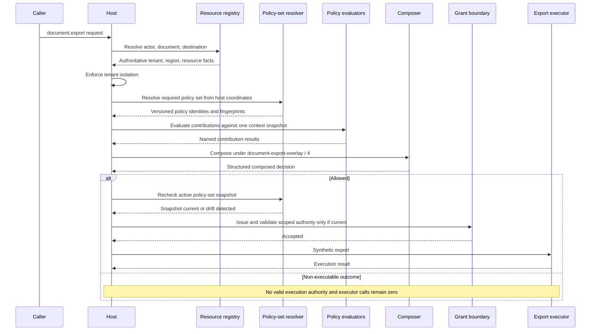

# Multi-Tenant and Regional Policy Overlay

**Learning objective:** Understand how a host can resolve tenant and regional policy coordinates from authoritative context, evaluate independently owned policy layers, compose their contributions through an explicit overlay contract, preserve policy-set provenance, simulate candidate changes safely, and keep protected execution host-owned.

**Pattern classification:** General learning material

**Difficulty:** Advanced

**Study time:** Approximately 55–75 minutes for the guided path, or 90–110 minutes for a careful full read with the implementation sketches and test matrices.

**Required prerequisites:**

- [Constraint Composition and Policy Precedence](../governance/constraint-composition-and-policy-precedence.md)
- [Regional and Tenant Policy Overlays](../advanced/regional-and-tenant-policy-overlays.md)
- [Policy Versioning and Decision Provenance](../governance/policy-versioning-and-decision-provenance.md)

**Recommended depth:**

- [Policy Context and Explicit Decision Outcomes](../tutorials/policy-context-and-explicit-decision-outcomes.md)
- [Practical Policy Testing and Decision-Table Strategies](../governance/practical-policy-testing-and-decision-table-strategies.md)
- [Minimal Policy Simulation Harness](../samples/index.md#minimal-policy-simulation-harness)
- [Sensitive-Data Access Decision](sensitive-data-access-decision.md)

> **Fictional-policy notice:** Every tenant, region, rule, threshold, authority relationship, and reason code in this case study is invented for teaching. Nothing here describes actual law, regulation, contractual obligation, residency requirement, or compliance mandate in any real jurisdiction.

---

## At a Glance

A fictional multi-tenant SaaS product exposes the bounded operation `document.export`. The host may need to consider a base policy, a regional overlay, a tenant overlay, and operation-specific constraints before it can decide whether the export may proceed.

The core flow is:

```text
Authoritative actor/resource context
        ↓
Base + regional + tenant + operation policy contributions
        ↓
Explicit composition contract
        ↓
Composed decision with full provenance
        ↓
Current scoped authority
        ↓
Host-owned execution
```

The arrows above are **not** a universal precedence hierarchy. They show participating scopes. This case study uses one explicit fictional composition contract so its behavior can be explained and tested; another system may choose a different contract.

The central invariant is:

> **The host selects policy coordinates from authoritative facts, composes every material policy contribution through an explicit contract, and permits protected execution only from a current composed decision.**

| Question | Primary owner |
| --- | --- |
| Which tenant and region apply? | Host context resolution |
| Which policy artifacts participate? | Policy-set resolution |
| How do their contributions combine? | Composition policy |
| May the export occur now? | Host-owned execution boundary |

---

## 1. The Fictional SaaS Scenario

Assume a fictional service named **Northstar Documents**. It stores synthetic documents for multiple tenants and exposes:

```text
document.export
```

The request contract accepts only `DocumentId`, `DestinationId`, and `PurposeCode`:

```csharp
public sealed record DocumentExportRequest(
    string DocumentId,
    string DestinationId,
    string PurposeCode);
```

A representative request is:

```json
{
  "documentId": "doc-204",
  "destinationId": "analytics-vault",
  "purposeCode": "case-review"
}
```

It does **not** accept authoritative tenant, region, or policy-version selectors.

The synthetic environment uses:

| Coordinate | Values |
| --- | --- |
| Tenants | `tenant-a`, `tenant-b` |
| Regions | `region-east`, `region-west` |
| Classifications | `Internal`, `Confidential`, `Restricted` |
| Destinations | `analytics-vault`, `partner-drop`, `regional-archive` |
| Approved purposes | `case-review`, `regulated-archive` |
| Operation | `document.export` |

The host-owned synthetic destination catalog is explicit too:

| Destination | Region | Kind | Approved |
| --- | --- | --- | --- |
| `analytics-vault` | `region-west` | `ExternalAnalytics` | yes |
| `partner-drop` | `region-west` | `ExternalPartner` | yes |
| `regional-archive` | `region-east` | `InternalArchive` | yes |

`regional-archive` gives the case study a concrete approved in-region destination that is neither an external analytics endpoint nor a tenant-specific exception target. The host-owned purpose catalog likewise recognizes only the fictional `case-review` and `regulated-archive` purposes in this specimen. A request may name one of those purpose codes, but it cannot create a new approved purpose by supplying arbitrary text. The region names are fictional labels, not proxies for real jurisdictions.

---

## 2. Architecture Before Policy Detail

The teaching flow is:

```text
Authenticated request
        ↓
Request validation
        ↓
Authoritative actor, document, and destination resolution
        ↓
Tenant-isolation check
        ↓
Policy-coordinate construction
        ↓
Required policy-set resolution
        ↓
Independent layer evaluation
        ↓
Explicit composition contract
        ↓
Structured composed decision
        ↓
Acknowledgment / escalation when required
        ↓
Current policy and resource revalidation
        ↓
Scoped execution authority
        ↓
Host-owned synthetic executor
        ↓
Correlated evidence
```

A small application may place several of these responsibilities in one process. The architecture still keeps their meanings distinct.

---

## 3. Responsibility Boundaries

| Responsibility | Primary question in this case |
| --- | --- |
| Architecture | Which scopes, trust boundaries, and lifecycle stages exist? |
| Implementation | How can the example be represented without prescribing one policy engine? |
| Operations | Who deploys policy artifacts, observes failures, and supports the workflow? |
| Security | Who authenticates actors, protects tenant isolation, policy distribution, and credentials? |
| Governance | Who defines policy authority, composition rules, outcomes, and provenance? |
| Execution | Which host-owned component actually performs the protected export? |

A tenant administrator may own tenant configuration. A regional team may manage a regional policy artifact. A platform team may deploy the evaluator. None of those facts alone answers which contribution may override another.

That is a governance-authority question.

---

## 4. Authoritative Tenant and Region Resolution

The authenticated actor is resolved separately from the request:

```csharp
public sealed record ActorIdentity(
    string SubjectId,
    string TenantId,
    IReadOnlySet<string> Roles);
```

The resource repository returns authoritative document facts:

```csharp
public sealed record DocumentSnapshot(
    string DocumentId,
    string TenantId,
    string RegionId,
    string ResourceVersion,
    string Classification,
    string State,
    long ApproximateSizeBytes);
```

The destination registry returns host-owned destination facts:

```csharp
public sealed record ExportDestination(
    string DestinationId,
    string DestinationRegionId,
    string DestinationKind,
    bool ApprovedForExport);
```

The host derives policy coordinates from those resolved values:

```csharp
public sealed record PolicyCoordinates(
    string TenantId,
    string RegionId,
    string ApplicationId,
    string OperationName);
```

For this case, `TenantId` and `RegionId` come from the document, `ApplicationId` is `northstar-documents`, and `OperationName` is `document.export`. Using the document's region as the regional policy coordinate is itself a deliberate teaching choice; another system might resolve region from a different authoritative data-location, workload, organization, or jurisdiction model. The selection rule must be defined rather than inferred.

If an older or malicious client sends extra fields such as `tenant`, `region`, or `policyVersion`, the host either rejects them or treats them only as non-authoritative hints. They never select the production policy set unless independently confirmed by the host.

> **The request may identify the resource. The host resolves the policy coordinates.**

---

## 5. Tenant Isolation Precedes Permissive Composition

Assume the authenticated actor belongs to `tenant-a` while the resolved document belongs to `tenant-b`.

This case study has no delegated cross-tenant export authority. The host therefore stops with a non-executable result before tenant policy can search for a permissive path.

If a future product legitimately needs `tenant-a` to act on a `tenant-b` document, model that as an explicit delegation artifact resolved by the host, not as a tenant policy `Allowed` result. A delegation grant would need its own issuer, subject tenant, resource tenant or document binding, permitted operation, purpose, audience, lifetime, and revocation/freshness semantics. The resulting delegation evidence would become authoritative context for a separate composition contract. This specimen intentionally omits that path.

Internal evidence may preserve:

```text
Reason: tenant.boundary.mismatch
Executor calls: 0
```

If resource existence across tenants is sensitive, the caller-facing response can be coarser, such as `request.not-permitted`.

The distinction is intentional:

```text
Precise internal evidence
        ≠
Unlimited external disclosure
```

Tenant isolation is a host trust-boundary invariant in this specimen, not a tenant preference that a tenant overlay may override.

---

## 6. Resolve a Policy Set, Not One Policy Version

Once authoritative coordinates exist, the host resolves all required policy artifacts.

```csharp
public sealed record PolicyArtifactIdentity(
    string PolicyId,
    string PolicyVersion,
    string PolicyFingerprint);

public sealed record ResolvedPolicySet(
    string PolicySetSnapshotId,
    long ActivationRevision,
    DateTimeOffset ResolvedAt,
    PolicyArtifactIdentity BasePolicy,
    PolicyArtifactIdentity RegionalPolicy,
    PolicyArtifactIdentity TenantPolicy,
    PolicyArtifactIdentity OperationPolicy,
    PolicyArtifactIdentity CompositionPolicy);
```

One synthetic set is resolved under:

```text
PolicySetSnapshotId: document-export-set/104
ActivationRevision: 104
```

| Layer | Policy | Version | Fingerprint |
| --- | --- | --- | --- |
| Base | `document-export-base` | `8` | `sha256:base-8-demo` |
| Region | `region-east-export` | `12` | `sha256:region-east-12-demo` |
| Tenant | `tenant-a-export` | `7` | `sha256:tenant-a-7-demo` |
| Operation | `document-export-operation` | `3` | `sha256:operation-3-demo` |
| Composition | `document-export-overlay` | `4` | `sha256:overlay-4-demo` |

The hashes are shortened fictional teaching values. A production fingerprint should identify a defined canonical representation of the relevant policy material. `PolicySetSnapshotId` and `ActivationRevision` identify the catalog snapshot that selected the complete set for this evaluation.

The fixed five-field shape is a teaching simplification. A production resolver may return a collection of required overlays—for example, several independently owned regional or sector policies—provided the complete set, authority classes, and composition semantics remain explicit.

A fingerprint helps identify content. It does not by itself prove authorship, approval, legal correctness, authorized deployment, evaluator integrity, or tamper-evident storage. Production policy distribution needs an authenticated integrity boundary before a fingerprint is trusted; Section 30 makes that requirement explicit.

---

## 7. Missing Required Policy Is Not `NotApplicable`

Every layer in this specimen is required.

If the current regional artifact cannot be loaded, the host does not reinterpret that as `NotApplicable`. The teaching contract produces:

| State | Outcome | Reason | Executor |
| --- | --- | --- | ---: |
| Required regional policy unavailable | `Deferred` | `policy.required-layer-unavailable` | 0 calls |

A different system might choose `Denied` or `EscalationRecommended`. The important property is that a missing mandatory layer cannot become implicit permission.

`NotApplicable` means the policy was loaded, evaluated, and intentionally had no contribution for this context. Missing policy is a resolution/dependency state.

---

## 8. Scope, Ownership, and Authority Stay Separate

Three concepts are easy to blur:

| Concept | Question | Example |
| --- | --- | --- |
| Scope | Where does the policy apply? | `Region = region-east` |
| Ownership | Who manages or versions it? | Regional governance team |
| Authority | What may its contribution change? | May impose a mandatory regional block |

For the fictional environment:

| Artifact | Example owner | Authority in this specimen |
| --- | --- | --- |
| Base policy | Platform governance team | Mandatory platform blocks |
| Regional overlay | Regional governance team | Mandatory regional restrictions/review |
| Tenant overlay | Tenant policy administrators | Preserve or narrow authority |
| Operation policy | Document-service team | Operation-specific blocks/review |
| Composition policy | Platform governance team | Defines how contributions combine |

A tenant administrator may be allowed to configure `ApprovedExportDestination = analytics-vault`. That means the administrator owns a configuration value. It does not automatically mean the administrator may override a mandatory regional denial.

> **Configuration ownership is not policy override authority.**

---

## 9. Represent Every Policy Contribution Explicitly

Each layer produces a local finding rather than mutating a shared global decision.

```csharp
public enum OverlayContributionOutcome
{
    Allowed,
    Denied,
    Deferred,
    AcknowledgmentRequired,
    EscalationRecommended,
    NotApplicable
}

public sealed record PolicyRequirement(
    PolicyArtifactIdentity SourcePolicy,
    string RequirementKind,
    string RequirementValue);

public sealed record PolicyContribution(
    PolicyArtifactIdentity Policy,
    string ScopeKind,
    string ScopeValue,
    string AuthorityClass,
    OverlayContributionOutcome Outcome,
    IReadOnlyList<string> ReasonCodes,
    IReadOnlyList<PolicyRequirement> Requirements);
```

A regional contribution might be:

```text
Policy: region-east-export / 12
Scope: Region / region-east
Authority: MandatoryRegional
Outcome: Denied
Reason: regional.external-export-blocked
```

A tenant contribution might be:

```text
Policy: tenant-b-export / 5
Scope: Tenant / tenant-b
Authority: TenantNarrowing
Outcome: EscalationRecommended
Reason: tenant.external-export-review
```

The composer receives both. It does not infer authority from which one happened to run last. `Requirements` carries explicit positive constraints—such as a required destination region—that may need compatibility checks across authorities. Each requirement repeats its source `PolicyArtifactIdentity` deliberately so attribution survives when requirements are copied into standalone conflict evidence. Empty requirements are valid.

This specimen deliberately has no `OverrideGrantId` on a policy contribution. If a different architecture permits delegated broadening, represent the delegation as a separate, independently validated authority artifact rather than as an optional field that is never exercised.

---

## 10. The Fictional Composition Contract

This case uses one named composition policy:

```text
document-export-overlay / 4
```

Its teaching rules are:

1. Every required layer must resolve successfully.
2. `NotApplicable` is neutral only when the policy was loaded and intentionally found no applicable rule.
3. A `MandatoryBase` or `MandatoryRegional` denial cannot be broadened by tenant or operation policy.
4. Tenant policy may preserve or narrow authority but may not broaden a mandatory upstream restriction.
5. If no `Denied` contribution exists, `Deferred` outranks `EscalationRecommended`, which outranks an unresolved `AcknowledgmentRequired` state in this specimen. An unresolved requirement conflict contributes `Deferred`.
6. `AcknowledgmentRequired` blocks execution until a bound acknowledgment is completed and current policy is re-evaluated.
7. Explicit requirements from applicable `MandatoryBase`, `MandatoryRegional`, `TenantNarrowing`, and `OperationConstraint` authorities are binding inputs to composition. A tenant requirement may narrow an upstream permission; if it cannot be satisfied simultaneously with another binding requirement, it is not discarded. The composer records an explicit conflict and returns `Deferred` in this specimen.
8. `Allowed` exists only when every required layer resolved and no blocking, deferred, acknowledgment, escalation, or unresolved-conflict state remains.

This is one possible contract, not a universal governance hierarchy. Another architecture may use delegated exceptions, peer-authority arbitration, a different escalation model, or operation-specific precedence.

The reusable rule is:

> **Whatever authority and precedence model exists must be explicit, deterministic, reviewable, and testable.**

---

## 11. Why `Last Writer Wins` Is Not a Composition Model

Avoid a loop where each layer overwrites the prior decision:

```csharp
GovernanceDecision decision = GovernanceDecision.Deny(
    "default",
    "Not yet allowed.");

foreach (IPolicyLayer layer in layers)
{
    decision = await layer.EvaluateAsync(context);
}

return decision;
```

`GovernanceDecision` and `IPolicyLayer` are intentionally generic anti-pattern placeholders here; they are not additional case-study contracts.

If contributions are `Base = Allowed`, `Region = Denied`, `Tenant = Allowed`, and `Operation = Allowed`, the last layer can erase the regional denial. Reordering dependency-injection registrations changes governance.

Prefer named contributions plus a named composition policy. Evaluation order may be operational; it must not silently become authority order.

---

## 12. Build One Authoritative Context Snapshot

Every policy layer interprets the same resolved facts:

```csharp
public sealed record DocumentExportContext(
    string CorrelationId,
    string ActorId,
    string ActorTenant,
    IReadOnlySet<string> ActorRoles,
    string DocumentId,
    string DocumentTenant,
    string DocumentRegion,
    string DocumentVersion,
    string Classification,
    string DocumentState,
    long ApproximateSizeBytes,
    string DestinationId,
    string DestinationRegion,
    string DestinationKind,
    bool DestinationApproved,
    string PurposeCode,
    DateTimeOffset EvaluatedAt);
```

The context contains facts. It does not contain hidden precedence such as `TenantAlwaysWins = true` or `RegionPriority = 200`.

`ApproximateSizeBytes` is host-resolved metadata, not a caller estimate. In this specimen it is only a review threshold input. If an approximation could undercount across a hard safety boundary, the host should obtain an exact or conservative upper-bound measure, or defer rather than treating an uncertain size as permission.

Composition semantics belong to the composition policy.

---

## 13. The Fictional Layer Rules

The following rules exist only to make the case concrete.

### Base policy — `document-export-base / 8`

| Condition | Contribution | Reason |
| --- | --- | --- |
| Actor lacks `DocumentExporter` | `Denied` | `base.actor-not-permitted` |
| Document state is not `Active` | `Denied` | `base.document-not-exportable` |
| Destination is not host-approved | `Denied` | `base.destination-not-approved` |
| Otherwise | `Allowed` | — |

Authority class: `MandatoryBase`.

### Region-east policy — `region-east-export / 12`

| Condition | Contribution | Reason |
| --- | --- | --- |
| `Restricted` document leaves `region-east` | `Denied` | `regional.external-export-blocked` |
| `Confidential` document leaves `region-east` | `AcknowledgmentRequired` | `regional.external-export-ack` |
| Otherwise | `Allowed` | — |

For purpose `regulated-archive`, this policy additionally contributes the requirement `destination-region = region-east`. Requirement checks are additive; they do not erase a blocking or acknowledgment outcome produced by another row.

Authority class: `MandatoryRegional`.

### Region-west policy — `region-west-export / 9`

| Condition | Contribution | Reason |
| --- | --- | --- |
| `Restricted` document goes to an approved `ExternalAnalytics` destination | `AcknowledgmentRequired` | `regional.restricted-export-ack` |
| Otherwise | `Allowed` | — |

Authority class: `MandatoryRegional`.

### Tenant-a policy — `tenant-a-export / 7`

| Condition | Contribution | Reason |
| --- | --- | --- |
| Destination is `analytics-vault` | `Allowed` | — |
| Another approved external destination | `AcknowledgmentRequired` | `tenant.destination-review` |
| Otherwise | `NotApplicable` | — |

For purpose `regulated-archive`, this policy additionally contributes the requirement `destination-id = analytics-vault`. In the synthetic catalog, `analytics-vault` is located in `region-west`.

Authority class: `TenantNarrowing`.

### Tenant-b policy — `tenant-b-export / 5`

| Condition | Contribution | Reason |
| --- | --- | --- |
| `Confidential` or `Restricted` document goes to an `ExternalAnalytics` destination | `EscalationRecommended` | `tenant.external-export-review` |
| Otherwise | `Allowed` | — |

Authority class: `TenantNarrowing`.

### Operation policy — `document-export-operation / 3`

| Condition | Contribution | Reason |
| --- | --- | --- |
| Purpose code is not approved | `Denied` | `operation.purpose-not-permitted` |
| Export exceeds fictional 250 MiB review ceiling | `Deferred` | `operation.export-size-review` |
| Otherwise | `Allowed` | — |

Authority class: `OperationConstraint`.

No row above is a claim about actual legal or regulatory policy.

---

## 14. Same Operation Under Two Tenants

Hold the region and document characteristics constant:

| Fact | Shared value |
| --- | --- |
| Operation | `document.export` |
| Region | `region-west` |
| Classification | `Confidential` |
| State | `Active` |
| Destination | `analytics-vault` |
| Destination kind | `ExternalAnalytics` |
| Destination approved | yes |
| Actor role | `DocumentExporter` |
| Purpose | `case-review` |

Now vary only the authoritative tenant coordinate:

| Contribution | Tenant A | Tenant B |
| --- | --- | --- |
| Base | `Allowed` | `Allowed` |
| Region-west | `Allowed` | `Allowed` |
| Tenant | `Allowed` | `EscalationRecommended` |
| Operation | `Allowed` | `Allowed` |
| **Final** | **`Allowed`** | **`EscalationRecommended`** |
| Executor | 1 call after valid authority | 0 calls |

The result differs because the resource belongs to a different tenant and therefore selects a different tenant policy. The caller does not choose which tenant policy is more convenient.

---

## 15. Same Operation Under Two Regions

Use simulation to hold the tenant and other resource attributes constant while varying only the resource region:

| Fact | Shared value |
| --- | --- |
| Tenant | `tenant-a` |
| Classification | `Restricted` |
| Destination | `analytics-vault` |
| Destination kind | `ExternalAnalytics` |
| Destination region | `region-west` |
| State | `Active` |
| Actor role | `DocumentExporter` |
| Purpose | `case-review` |

| Contribution | Resource in region-east | Resource in region-west |
| --- | --- | --- |
| Base | `Allowed` | `Allowed` |
| Regional | `Denied` | `AcknowledgmentRequired` |
| Tenant A | `Allowed` | `Allowed` |
| Operation | `Allowed` | `Allowed` |
| **Final** | **`Denied`** | **`AcknowledgmentRequired`** |
| Executor | 0 calls | 0 until fresh continuation |

In `region-east`, the mandatory regional denial cannot be broadened by tenant allow. In `region-west`, the regional acknowledgment requirement remains visible and blocks execution until a valid continuation path exists.

The same evaluator code can therefore produce different outcomes because the authoritative policy set differs.

---

## 16. Conflicting Constraints Must Remain Visible

Not every conflict fits a simple severity ladder. The `regulated-archive` rules declared in Section 13 make one conflict concrete. For an `Internal` `tenant-a` document in `region-east`, with purpose `regulated-archive` and requested destination `analytics-vault`:

- the ordinary region-east outcome is `Allowed`;
- the ordinary tenant-a outcome is `Allowed`;
- the operation outcome is `Allowed` because `regulated-archive` is in the host-owned approved-purpose catalog;
- the regional contribution additionally requires `destination-region = region-east`;
- the tenant contribution additionally requires `destination-id = analytics-vault`; and
- the host-owned destination registry says `analytics-vault` is in `region-west`.

Using `Internal` here isolates the requirement conflict from the region-east `Confidential` acknowledgment rule. The conflict itself—not a second workflow state—is what stops continuation.

Those requirements cannot both be satisfied for the same export. `TenantNarrowing` means the tenant layer may add a restriction; it does not mean an unsatisfiable tenant restriction may simply be discarded to recover an upstream allow. Neither requirement should disappear because its evaluator completed first or last.

Requirement compatibility needs authoritative relationship data. Here the host resolves `analytics-vault → region-west` from the same destination registry used to build `DocumentExportContext`, then gives the composer a resolved requirement view. The composer does not trust a tenant contribution to assert where an arbitrary destination lives, and it does not infer compatibility from free-form strings alone.

```csharp
public sealed record PolicyConflict(
    string ConflictId,
    IReadOnlyList<PolicyRequirement> ConflictingRequirements,
    string ConflictCode);
```

Because each `PolicyRequirement` carries its source policy identity, conflict evidence does not depend on parallel `PolicyIds` and requirement lists staying positionally aligned. This specimen records `PolicyConflict` only for an **unresolved** conflict. `ConflictCode` is therefore a blocking reason such as `overlay.conflict.unresolved`, not a successful resolution marker. An architecture that supports conflict arbitration should model the arbitration result separately and re-compose before the decision becomes executable.

This teaching contract produces:

| Condition | Outcome | Reason | Executor |
| --- | --- | --- | ---: |
| Required constraints cannot be satisfied together | `Deferred` | `overlay.conflict.unresolved` | 0 calls |

`Deferred` means no executable composition exists from the current policy set and context. Another domain might choose `Denied` or `EscalationRecommended`; the key invariant is that unresolved conflict cannot silently become `Allowed`.

---

## 17. Preserve Contributions Instead of Mutating Them

A composed decision can retain every material input:

```csharp
public enum CompositePolicyOutcome
{
    Allowed,
    Denied,
    Deferred,
    AcknowledgmentRequired,
    EscalationRecommended
}

public sealed record CompositePolicyDecision(
    string DecisionId,
    string CorrelationId,
    CompositePolicyOutcome Outcome,
    IReadOnlyList<string> ReasonCodes,
    IReadOnlyList<PolicyContribution> Contributions,
    PolicyArtifactIdentity CompositionPolicy,
    string PolicySetSnapshotId,
    long ActivationRevision,
    PolicyConflict? Conflict,
    DateTimeOffset EvaluatedAt)
{
    public bool CanIssueExecutionAuthority =>
        Outcome == CompositePolicyOutcome.Allowed &&
        Conflict is null;
}
```

Because this specimen retains a `PolicyConflict` only while it is unresolved, `Conflict is null` is intentionally part of the executable-decision predicate. A future architecture that supports explicit conflict resolution should produce a new re-composed decision after arbitration rather than marking the same conflict object as resolved in place.

The result should be able to explain which policy blocked, deferred, acknowledged, or escalated the request. A base allow should not erase a tenant escalation. A tenant allow should not erase a mandatory regional denial. `CanIssueExecutionAuthority` expresses decision-level eligibility only; current resource, policy-set freshness, audience, replay, and other grant-boundary checks still apply before authority is issued.

---

## 18. Provenance Must Identify the Whole Policy Set

A single `PolicyVersion = 12` field becomes ambiguous once multiple independently versioned authorities participate.

```csharp
public sealed record PolicyContributionEvidence(
    string PolicyId,
    string PolicyVersion,
    string PolicyFingerprint,
    string ScopeKind,
    string ScopeValue,
    string AuthorityClass,
    string ContributionOutcome,
    IReadOnlyList<string> ReasonCodes,
    IReadOnlyList<PolicyRequirement> Requirements);

public sealed record DocumentExportDecisionReceipt(
    string DecisionId,
    string CorrelationId,
    string DocumentEvidenceRef,
    string ResourceVersion,
    string PolicySetSnapshotId,
    long ActivationRevision,
    string PolicySetEvidenceHash,
    string TenantId,
    string RegionId,
    string Outcome,
    IReadOnlyList<string> ReasonCodes,
    IReadOnlyList<PolicyContributionEvidence> PolicyContributions,
    PolicyArtifactIdentity CompositionPolicy,
    string? ConflictId,
    DateTimeOffset EvaluatedAt);
```

A denied decision could preserve:

```text
Decision: Denied
Reason: regional.external-export-blocked
ResourceVersion: rv-41

Contributors:
- document-export-base / 8 / sha256:base-8-demo
- region-east-export / 12 / sha256:region-east-12-demo
- tenant-a-export / 7 / sha256:tenant-a-7-demo
- document-export-operation / 3 / sha256:operation-3-demo

Composition:
- document-export-overlay / 4 / sha256:overlay-4-demo
```

That evidence can answer: **Which policy contributed to this decision, and why?**

---

## 19. Composition Policy Has Provenance Too

The same four contributions can produce different results under different composition contracts. If one composition policy says escalation outranks acknowledgment while another requires both states to be satisfied in sequence, the final outcome can change even though the leaf policies did not.

Therefore decision provenance includes both:

```text
Material policy contributors
        +
Composition policy identity
```

Without the composition policy, a reviewer may know the inputs but still be unable to explain the output.

---

## 20. Evaluation Order Is Operational, Not Authoritative

Independent contributions may be evaluated sequentially or concurrently. They may come from an in-process catalog, verified cache, or policy service. Those choices affect latency and availability but should not silently change precedence.

```text
Base result ───────┐
Region result ─────┤
Tenant result ─────┼──> explicit composer
Operation result ──┘
```

Completion timing is not policy priority.

---

## 21. Sequence: Resolve, Evaluate, Compose, Execute



The resolver does not execute. The composer does not execute. The executor does not reinterpret policy precedence.

---

## 22. Acknowledgment Does Not Freeze the Policy Set

For the `region-west` restricted-export example, the composed result is `AcknowledgmentRequired`.

A challenge should bind the decision, resource version, destination, tenant, region, relevant policy identities, composition-policy identity, acknowledgment reason, and expiry.

After acknowledgment, the host must rebuild current state rather than turning the old result into permission:

```text
Acknowledgment accepted
        ↓
Reload authoritative document/destination facts
        ↓
Resolve current tenant and region
        ↓
Resolve current policy set
        ↓
Re-evaluate and re-compose
        ↓
Issue current scoped authority only if executable
```

The historical acknowledgment remains evidence of what the actor accepted. It is not an override against changed policy.

For example, if the challenge was created under `tenant-a-export / 7` and tenant policy `8` becomes active before continuation with a new `EscalationRecommended` requirement, acknowledgment of the old challenge does not preserve the old executable path. The host re-resolves the active set, observes the new tenant contribution, and blocks grant issuance pending the current escalation path.

---

## 23. Policy Drift Becomes a Set-Comparison Problem

With overlays, any contributor or the composition policy can drift:

| Layer | Decision set | Current set |
| --- | --- | --- |
| Base | 8 | 8 |
| Region-east | 12 | 13 |
| Tenant-a | 7 | 7 |
| Operation | 3 | 3 |
| Overlay | 4 | 4 |

This case uses a conservative teaching rule for protected export:

> **Before execution authority is issued, the current resolved policy set and composition policy must exactly match the set that produced the executable decision. Otherwise re-evaluate.**

For this specimen, exact match means the same `PolicySetSnapshotId` and `ActivationRevision`, plus the same `PolicyId`, `PolicyVersion`, and `PolicyFingerprint` for every required contributor and the composition policy. A version change counts as drift even when the fingerprint happens to remain the same. A fingerprint change under the same declared version is treated as a policy-integrity or activation anomaly and fails closed into re-resolution/re-evaluation.

Evaluation uses the immutable snapshot resolved at the start of the decision. A later activation does not mutate that historical input set in place. Immediately before authority issuance, the host re-reads the active catalog manifest (or equivalent version vector) and compares it with the decision snapshot. If it changed, the old decision cannot mint authority.

A real system may use explicit compatibility declarations or operation-specific freshness rules. What should not happen is invisible drift.

Historical provenance remains historical: an old decision produced under region policy 12 should not be rewritten as though version 13 produced it.

---

## 24. Scoped Authority Binds the Composed Decision

An `Allowed` decision is still not a credential.

```csharp
public sealed record DocumentExportGrant(
    string GrantId,
    string DecisionId,
    string Operation,
    string DocumentId,
    string ResourceVersion,
    string Classification,
    string TenantId,
    string RegionId,
    string DestinationId,
    string PolicySetSnapshotId,
    long ActivationRevision,
    string PolicySetEvidenceHash,
    string CompositionPolicyFingerprint,
    string Audience,
    DateTimeOffset NotBefore,
    DateTimeOffset ExpiresAt,
    int MaxUses);
```

`PolicySetEvidenceHash` is required in this teaching grant. It is a host-defined SHA-256 digest over a documented canonical ordering of the decision's required policy identities, composition-policy identity, snapshot ID, and activation revision. The digest is a compact binding, not a replacement for the underlying evidence and not proof that the policy artifacts were authentic.

The execution boundary validates operation, resource version, classification, tenant, region, destination, audience, time bounds, replay state, policy-set snapshot/revision, and current policy-set freshness. A stale or mismatched grant produces zero executor calls.

---

## 25. The Executor Owns the Protected Side Effect

The policy system should not become the export engine.

```csharp
public sealed record ValidatedDocumentExportExecution(
    string ExecutionId,
    string DocumentId,
    string ResourceVersion,
    string DestinationId,
    string TenantId,
    string RegionId);

public enum DocumentExportExecutionStatus
{
    Completed,
    FailedNoTransfer,
    AmbiguousOrPartial
}

public sealed record DocumentExportExecutionResult(
    string ExecutionId,
    DocumentExportExecutionStatus Status,
    string ResultCode,
    DateTimeOffset ObservedAt);

public interface IDocumentExportExecutor
{
    Task<DocumentExportExecutionResult> ExportAsync(
        ValidatedDocumentExportExecution execution,
        CancellationToken cancellationToken);
}
```

The teaching fake records invocations only. It connects to no real storage, partner endpoint, production database, or protected document contents.

A production executor would own the credential or workload identity required for the destination. The resolver, policy evaluator, composer, and decision receipt should not carry that credential.

### Execution failure, partial transfer, and replay state

`MaxUses = 1` requires durable consume state at the execution-authority boundary; a field on the grant is not enough by itself. A useful teaching lifecycle is `Issued → Claimed → Completed | FailedNoTransfer | AmbiguousOrPartial`. `ExecutionId` identifies the one logical export attempt that claimed the grant.

An external export can fail after bytes have left the host. A timeout therefore does not prove that nothing happened. Do not respond to an ambiguous or partial result by minting fresh authority and blindly sending the document again. Prefer a destination-supported idempotency/reconciliation key based on the stable `ExecutionId`, query or reconcile the remote state when possible, and require a fresh governed decision before a materially new export attempt. If compensation or deletion is required, model it as a separately governed operation rather than assuming rollback is automatic.

Evidence failure also needs stage-specific handling. If required pre-execution decision/grant evidence cannot be durably recorded, this specimen fails closed before export. If post-execution evidence persistence fails after an export may have occurred, preserve a pending/outbox-style reconciliation record and repair the evidence path; do not repeat the protected export merely to regenerate a receipt.

---

## 26. Five Representative Traces

The traces below show the authorized internal evidence view. A caller-facing adapter may expose coarser reason details where tenant/resource or policy information is sensitive.

### Trace A — Tenant A, Region West: Allowed

| Field | Value |
| --- | --- |
| Tenant | `tenant-a` |
| Region | `region-west` |
| Classification | `Confidential` |
| Destination | `analytics-vault` |
| Resource version | `rv-41` |
| Base | `Allowed` |
| Region | `Allowed` |
| Tenant | `Allowed` |
| Operation | `Allowed` |
| Final | `Allowed` |
| Executor | 1 call after current scoped authority |

### Trace B — Same Region and Operation, Tenant B: Escalated

| Field | Value |
| --- | --- |
| Tenant | `tenant-b` |
| Region | `region-west` |
| Classification | `Confidential` |
| Tenant contribution | `EscalationRecommended` / `tenant.external-export-review` |
| Final | `EscalationRecommended` |
| Grant | not issued |
| Executor | 0 calls |

### Trace C — Tenant A, Region East: Mandatory Regional Denial

| Field | Value |
| --- | --- |
| Tenant | `tenant-a` |
| Region | `region-east` |
| Classification | `Restricted` |
| Destination region | `region-west` |
| Regional contribution | `Denied` / `regional.external-export-blocked` |
| Tenant contribution | `Allowed` |
| Final | `Denied` |
| Grant | not issued |
| Executor | 0 calls |

The tenant allow cannot broaden the mandatory regional block under this composition contract.

### Trace D — Tenant A, Region West: Acknowledgment Required

| Field | Value |
| --- | --- |
| Tenant | `tenant-a` |
| Region | `region-west` |
| Classification | `Restricted` |
| Regional contribution | `AcknowledgmentRequired` / `regional.restricted-export-ack` |
| Final | `AcknowledgmentRequired` |
| Before acknowledgment | 0 executor calls |
| After acknowledgment | fresh policy/resource resolution required |

### Trace E — Tenant A, Region East: Unresolved Requirement Conflict

| Field | Value |
| --- | --- |
| Tenant | `tenant-a` |
| Region | `region-east` |
| Classification | `Internal` |
| Purpose | `regulated-archive` |
| Requested destination | `analytics-vault` |
| Regional outcome | `Allowed` |
| Tenant outcome | `Allowed` |
| Operation outcome | `Allowed` |
| Regional requirement | `destination-region = region-east` from `region-east-export / 12` |
| Tenant requirement | `destination-id = analytics-vault` from `tenant-a-export / 7` |
| Registry fact | `analytics-vault → region-west` |
| Conflict code | `overlay.conflict.unresolved` |
| Final | `Deferred` |
| Grant | not issued |
| Executor | 0 calls |

The conflict evidence preserves both policy identities and both requirements. It is the incompatibility of binding constraints—not evaluation order—that prevents an executable decision.

---

## 27. Candidate Policy Simulation Is a Separate Boundary

Policy owners often need to ask: **What would change if candidate policy X replaced current policy Y?** That is a simulation problem, not a protected execution problem.

```csharp
public sealed record SimulationScenario(
    string ScenarioId,
    string TenantId,
    string RegionId,
    string Classification,
    string DestinationId,
    string DestinationRegionId,
    string PurposeCode);

public sealed record PolicySimulationRequest(
    string SimulationId,
    string CandidatePolicySetId,
    IReadOnlyList<SimulationScenario> Scenarios);

public sealed record PolicyDecisionDelta(
    string ScenarioId,
    string BaselineOutcome,
    string CandidateOutcome,
    IReadOnlyList<string> ChangedPolicyIds,
    IReadOnlyList<string> BaselineReasons,
    IReadOnlyList<string> CandidateReasons);
```

The candidate selector belongs only on an authorized simulation/administrative surface. Ordinary `document.export` callers cannot select candidate or historical policy versions.

The simulation flow is:

```text
Synthetic or approved replay context
        ↓
Baseline policy set + candidate policy set
        ↓
Evaluate both through the same explicit composition semantics
        ↓
Structured decision delta
        ↓
Stop
```

No capability or export grant is issued. No executor is provided. Simulation results should expose `ExecutionAttempted = false`.

This matches the [Minimal Policy Simulation Harness](../samples/index.md#minimal-policy-simulation-harness): simulation evaluates policy behavior; it does not create execution authority.

---

## 28. Example Candidate Change

Assume production uses `region-east-export / 12` and a candidate `13-candidate` changes the fictional `Confidential` external-export outcome from `AcknowledgmentRequired` to `EscalationRecommended`.

| Scenario | Baseline | Candidate | Changed contribution |
| --- | --- | --- | --- |
| tenant-a, region-east, Confidential, `analytics-vault` | `AcknowledgmentRequired` | `EscalationRecommended` | Regional overlay |
| tenant-b, region-east, Confidential, `analytics-vault` | `EscalationRecommended` | `EscalationRecommended` | Intermediate contribution changed; final result did not |
| tenant-a, region-east, Internal, `regional-archive` | `Allowed` | `Allowed` | tenant policy remains `NotApplicable` |

The second row matters: a candidate can change material contribution evidence even when another layer keeps the same final outcome. A useful simulator compares both final decisions and material contributors.

A candidate `Allowed` result cannot be promoted directly into production execution. Simulation informs review; it does not deploy policy or mint authority.

---

## 29. Configuration Ownership Does Not Activate or Override Policy

Assume a tenant administrator can update an approved destination list or tenant export preference. Those settings may become policy inputs, but edit access does not automatically mean immediate production authority or override authority.

A production host may separately require schema validation, integrity-protected packages, staged activation, change review, policy versioning, propagation/freshness checks, or bounded authority classes.

The exact deployment process is outside this case study. The architectural principle is:

> **The ability to edit a value is not the same as authority for that value to override another policy layer.**

---

## 30. Policy-Set Resolution Is a Security Boundary

A malicious or buggy caller may try to:

- use `tenant-a` rules for a `tenant-b` resource;
- use `region-west` rules for a `region-east` resource;
- select an older permissive policy version;
- select candidate policy as though it were active;
- omit a required regional layer.

The active production set must be derived from authoritative tenant, authoritative region, application identity, operation identity, the production policy catalog, and current activation state.

Client-preferred tenant, region, version, or candidate identifiers do not select production authority.

### Resolve one activation snapshot, not four eventual-consistent reads

A production resolver should avoid independently asking several mutable stores for "whatever is current" and then composing a torn set. One practical pattern is a versioned activation manifest: a single authoritative catalog read returns `PolicySetSnapshotId`, `ActivationRevision`, and immutable artifact identities for every required layer and the composition policy. The evaluator then loads exactly those immutable artifacts.

If the backing catalog supports a transactional or strongly consistent read of the complete set, that can serve the same purpose. The important invariant is that one decision evaluates one coherent policy-set snapshot.

A new activation may occur while evaluation is running. That does not rewrite the in-flight snapshot. Before an `Allowed` decision can mint authority, the host rechecks the current activation manifest. A changed snapshot/revision triggers re-resolution and re-evaluation.

### Authenticate policy distribution before trusting fingerprints

A fingerprint identifies bytes only after the host has established which bytes it is willing to trust. If a regional artifact is fetched from blob/object storage, an attacker who can replace both policy content and an adjacent hash value must not be able to install a permissive policy merely by making the fingerprint self-consistent.

Production distribution should therefore make these boundaries explicit:

- authenticate the policy package and, where applicable, the activation manifest through the deployment trust model—for example with a verified signature, an appropriate MAC inside a shared-key boundary, or an authenticated/tamper-evident policy store;
- verify that authenticated artifact against host-configured trust material **before** admitting it into the active policy-set snapshot;
- compare the fingerprint only after that trust check, using the fingerprint for stable content/provenance identity rather than as a substitute for authenticity; and
- treat signing/MAC keys as security-sensitive authority with explicit custody, rotation, and revocation. A valid cryptographic proof establishes integrity/key control under the chosen trust model; it does not by itself prove legal correctness or organizational approval.

### Cached evaluators still need a freshness contract

Caching does not change the semantic requirement. A cached artifact still needs stable policy identity, scope, version/fingerprint, activation status, and an explicit freshness rule. Five evaluator instances must not be free to mint authority from five indefinitely different activation views.

A host may use a short maximum cache age, push invalidation, activation epochs, or another deployment-specific freshness strategy. For example, a 30-second cache age could be reasonable in one low-latency system, but it is illustrative rather than a universal number. For this specimen, authority issuance always performs the active-manifest snapshot/revision check even when policy evaluation used cached immutable artifacts.

---

## 31. Evidence Should Explain Policy Without Copying Protected Documents

Useful governance evidence can include correlation/decision IDs, safe document evidence reference, resource version, classification, tenant/region evidence, destination evidence reference, outcome, reason codes, policy-contributor identities, composition-policy identity, conflict identity, grant ID, and execution ID.

Avoid automatically retaining document contents, export payloads, destination credentials, bearer tokens, tenant secrets, raw policy source when stable identity is enough, or unrestricted free text.

A policy fingerprint can identify policy content without requiring every decision receipt to duplicate the policy document.

Internal provenance and external disclosure may differ. Authorized evidence can preserve `regional.external-export-blocked` while a public-facing API returns a coarser code if precise policy/resource information would create an oracle.

A small caller-facing vocabulary for this specimen is:

| External code | Meaning | Example internal states collapsed into it |
| --- | --- | --- |
| `request.not-permitted` | The export cannot proceed | tenant mismatch, mandatory deny |
| `request.review-required` | Human review/escalation is required | acknowledgment, escalation |
| `request.temporarily-unavailable` | The host cannot produce executable authority now | missing policy, unresolved conflict, stale snapshot |

The exact disclosure adapter is host-specific; internal reason codes never fall through to callers merely because no explicit mapping was supplied.

---

## 32. Resource Drift Matters Alongside Policy Drift

Between decision and execution, the document version, classification, tenant ownership, region assignment, or destination approval can change.

A decision for `ResourceVersion = rv-41` should not silently export `rv-42` when the change could affect policy. The grant in Section 24 binds both `ResourceVersion` and the classification observed for the executable decision, so the execution boundary can reject a changed resource before the executor is invoked.

For example, an acknowledgment may be issued while `doc-204` is `rv-41 / Confidential`. If the document becomes `rv-42 / Restricted` before continuation, the host does not reuse the old acknowledgment path to mint authority. It rebuilds context, resolves the current policy set, and re-composes the now-restricted export.

On mismatch:

```text
Reject stale authority
        ↓
Rebuild authoritative context
        ↓
Resolve current policy set
        ↓
Re-evaluate and re-compose
```

This keeps resource freshness and policy freshness visible as separate checks.

---

## 33. Invariant Tests

### Coordinate-resolution invariants

| Attempt | Expected behavior |
| --- | --- |
| Client claims `tenant-a` for a `tenant-b` document | Host resolves `tenant-b` or rejects unsupported selector |
| Client claims `region-west` for `region-east` document | Host resolves `region-east` or rejects unsupported selector |
| Client asks for old production policy version | Active production version remains host-selected |
| Client asks for candidate policy | Candidate selector unavailable on ordinary export path |

### Composition invariants

| Contributions | Expected final |
| --- | --- |
| All required layers allow | `Allowed` |
| Mandatory base deny + others allow | `Denied` |
| Mandatory region deny + tenant allow | `Denied` |
| Region acknowledgment + tenant allow | `AcknowledgmentRequired` |
| Region acknowledgment + tenant escalation | `EscalationRecommended` |
| Required policy missing | `Deferred` |
| Tenant policy `NotApplicable` for `regional-archive` + all other required layers allow | `Allowed` |
| `MandatoryRegional` requirement conflicts with binding `TenantNarrowing` requirement | `Deferred` with conflict evidence |

Run composition tests with contribution order shuffled. The semantic inputs should produce the same final outcome regardless of registration or completion order.

### Provenance invariants

Assert that every required contributor carries `PolicyId`, `PolicyVersion`, and required fingerprint; the composition-policy identity is present; material reasons remain attributable to contributors; every conflicting requirement preserves its own source policy identity; and historical evidence remains unchanged after later deployments.

### Freshness and continuation invariants

- Decision/acknowledgment under `tenant-a-export / 7` followed by activation of tenant policy `8` that adds `EscalationRecommended` → current set is re-resolved, old decision cannot mint a grant, executor calls = 0 until the current escalation path is satisfied.
- Decision/acknowledgment for `rv-41 / Confidential` followed by `rv-42 / Restricted` → resource mismatch rejects continuation, current context is rebuilt, executor calls = 0 under the stale grant path.
- Evaluator starts with activation revision `104`, revision `105` becomes current before authority issuance → active-manifest check detects drift and forces re-evaluation.
- Same declared policy version with a different fingerprint → treat as an integrity/activation anomaly; do not mint authority from the mismatched set.
- Five evaluator instances with different cache ages may evaluate from immutable cached artifacts, but none may issue authority unless its decision snapshot still matches the current activation manifest.

### Execution-boundary invariants

| Scenario | Grant issuance | Executor calls |
| --- | ---: | ---: |
| Cross-tenant request | 0 | 0 |
| Mandatory regional denial | 0 | 0 |
| Escalation required | 0 | 0 |
| Acknowledgment required before continuation | 0 | 0 |
| Missing required policy | 0 | 0 |
| Unresolved policy conflict | 0 | 0 |
| Policy-set snapshot changed before grant | 0 from stale decision | 0 |
| Resource version/classification changed before grant | 0 from stale decision | 0 |

For executor ambiguity, assert that a claimed one-use grant is not blindly reused or replaced after a timeout/partial-transfer result; reconciliation happens under the same `ExecutionId` before any materially new export is considered.

### Simulation invariants

- Simulation dependencies do not include `IDocumentExportExecutor`.
- Every simulation result reports `ExecutionAttempted = false`.
- Candidate `Allowed` does not create a `DocumentExportGrant`.
- Candidate/historical versions cannot be selected by ordinary production requests.
- Re-running the same synthetic scenarios under the same policy set produces the same contribution evidence.

A perfect decision object is insufficient if a blocked path can still reach the executor.

---

## 34. Main Decision Table

| Scenario | Tenant | Region | Destination | Classification | Purpose | Material contribution | Final | Executor |
| --- | --- | --- | --- | --- | --- | --- | --- | ---: |
| tenant-a-west-confidential | tenant-a | region-west | analytics-vault | Confidential | case-review | none blocking | `Allowed` | 1 |
| tenant-b-west-confidential | tenant-b | region-west | analytics-vault | Confidential | case-review | tenant escalation | `EscalationRecommended` | 0 |
| tenant-a-east-restricted-external | tenant-a | region-east | analytics-vault | Restricted | case-review | regional mandatory deny | `Denied` | 0 |
| tenant-a-west-restricted | tenant-a | region-west | analytics-vault | Restricted | case-review | regional acknowledgment | `AcknowledgmentRequired` | 0 until fresh continuation |
| tenant-a-east-internal | tenant-a | region-east | regional-archive | Internal | case-review | tenant `NotApplicable`; others allow | `Allowed` | 1 after valid authority |
| tenant-a-west-partner-review | tenant-a | region-west | partner-drop | Confidential | case-review | tenant destination review | `AcknowledgmentRequired` | 0 until fresh continuation |
| missing-region-policy | tenant-a | region-east | analytics-vault | Confidential | case-review | required layer unavailable | `Deferred` | 0 |
| incompatible-destinations | tenant-a | region-east | analytics-vault | Internal | regulated-archive | regional `destination-region=region-east` conflicts with tenant `destination-id=analytics-vault` | `Deferred` | 0 |

This is a test artifact for the fictional composition contract, not a statement that real SaaS exports should produce these outcomes.

---

## 35. Failure Modes

| Failure | Why it is dangerous | Safer response |
| --- | --- | --- |
| Caller selects tenant policy | Cross-tenant/permissive-policy bypass | Resolve tenant from authenticated/resource facts |
| Caller selects region policy | Regional-policy bypass | Resolve region from authoritative resource facts |
| Caller selects production policy version | Stale/permissive downgrade | Production resolver selects active version |
| Missing required policy becomes `NotApplicable` | Availability failure becomes permission | Explicit non-executable missing-layer outcome |
| Last result wins | Registration order becomes governance | Explicit composer + authority classes |
| Tenant config owner can override regional mandatory rule | Ownership becomes accidental authority | Explicit overlay contract |
| Only one policy version is retained | Decision cannot be reconstructed | Preserve all material contributors + composer |
| Candidate simulation can mint a grant | Analysis path becomes execution bypass | Simulation has no executor/authority issuer |
| Policy artifacts are fetched without authenticated integrity | Attacker-controlled content can be paired with attacker-controlled hashes | Verify signed/MACed packages or use an authenticated/tamper-evident activation store |
| Policy layers are resolved through independent eventual-consistent reads | One decision can evaluate a torn policy set | Resolve one versioned activation snapshot/bundle |
| Evaluator cache can mint authority after activation changes | Stale node bypasses new restrictions | Recheck active snapshot/revision before grant issuance |
| Acknowledgment reuses stale policy set | Old review bypasses new restrictions | Re-resolve/re-compose current policy |
| Policy freshness checked but resource version ignored | Changed data may export under stale assumptions | Bind authority to resource version and classification |
| Export timeout is treated as no side effect | Partial/duplicate data transfer | Reconcile by stable `ExecutionId`; do not blindly retry |
| Post-execution evidence failure triggers another export | Duplicate protected side effect | Repair evidence through pending/outbox reconciliation |
| Fingerprints treated as signatures | Content identity confused with authorization | Keep cryptographic meaning precise |
| Precise tenant mismatch exposed publicly | Resource-existence oracle | Separate internal evidence from external disclosure |

---

## 36. When a Simpler Architecture Is Enough

Do not introduce a multi-layer overlay merely because an application is multi-tenant.

A simpler architecture may be better when all tenants share the same policy, region does not affect the operation, one team owns the complete rule set, ordinary authorization expresses tenant isolation, there are no independently versioned policy authorities, and no multi-policy provenance or simulation requirement exists.

A straightforward path may be enough:

```text
Authenticated tenant-scoped API
        ↓
Resource-aware authorization
        ↓
One application policy
        ↓
Application service
```

Tenant IDs alone do not justify base + region + tenant + operation layers. Add layers only when they correspond to real, separately meaningful authority or lifecycle boundaries.

---

## 37. When the Overlay Architecture Adds Value

The broader model becomes more useful when several are true:

- independently owned policy authorities participate;
- policy artifacts deploy on different schedules;
- tenant-specific rules legitimately differ;
- regional constraints legitimately differ;
- explicit override/delegation authority must be represented;
- conflicts need reviewable resolution;
- candidate changes need simulation before activation;
- delayed continuation must detect policy-set drift;
- historical decisions must preserve every material contributor;
- security review must prove clients cannot select a more permissive scope.

The justification is not the number of policy files. It is the number of meaningful authority boundaries.

---

## 38. Review Checklist

Before adapting this case study, ask:

1. Which authoritative facts select tenant policy?
2. Which authoritative facts select regional policy?
3. Can a caller or model request a different tenant, region, production version, or candidate set?
4. Which policy layers are mandatory?
5. How is missing policy distinguished from `NotApplicable`?
6. Who owns each policy/configuration artifact?
7. What authority does each contribution actually have?
8. Which layers may narrow authority?
9. Can any layer broaden a restriction, and under what explicit delegation?
10. Is precedence encoded in a named composition policy rather than registration order?
11. Which authority classes may contribute binding requirements, and can a narrowing requirement be discarded accidentally?
12. How are cross-kind requirements resolved against authoritative registries before compatibility is evaluated?
13. How are incompatible required constraints represented?
14. Is unresolved conflict always non-executable?
15. Does evidence preserve every material `PolicyId`, `PolicyVersion`, and required fingerprint?
16. Does evidence preserve the composition-policy identity too?
17. Are active policy artifacts authenticated/integrity-verified before their fingerprints are trusted?
18. Is one coherent policy-set snapshot resolved atomically or through a versioned activation manifest?
19. Can a reviewer identify which contribution materially caused the final outcome?
20. Are historical policy identities preserved after later deployments?
21. What policy-set freshness rule applies before authority issuance?
22. Can stale evaluator caches mint authority after a newer activation becomes current?
23. Is resource freshness checked separately, including policy-relevant classification changes?
24. Does acknowledgment trigger current policy/resource re-resolution?
25. Can candidate simulation ever mint execution authority?
26. Is configuration ownership kept distinct from override authority?
27. If cross-tenant or lower-layer delegation is needed, is it represented as explicit bounded authority rather than an ordinary `Allowed` contribution?
28. Are credentials kept outside policy, composition, and evidence records?
29. Do non-executable outcomes prove zero executor calls?
30. Are one-use grant state, ambiguous execution, and partial-transfer reconciliation explicit?
31. Could precise external reason detail disclose tenant/resource existence or sensitive policy structure?
32. Would one simpler policy boundary satisfy the actual requirements?

If several answers are implicit, the architecture is not yet as explainable as the policy needs to be.

---

## Related Learning

- [Regional and Tenant Policy Overlays](../advanced/regional-and-tenant-policy-overlays.md)
- [Constraint Composition and Policy Precedence](../governance/constraint-composition-and-policy-precedence.md)
- [Policy Versioning and Decision Provenance](../governance/policy-versioning-and-decision-provenance.md)
- [Practical Policy Testing and Decision-Table Strategies](../governance/practical-policy-testing-and-decision-table-strategies.md)
- [Policy Context and Explicit Decision Outcomes](../tutorials/policy-context-and-explicit-decision-outcomes.md)
- [Minimal Policy Simulation Harness](../samples/index.md#minimal-policy-simulation-harness)
- [Sensitive-Data Access Decision](sensitive-data-access-decision.md)
- [Scoped Capability and Host-Owned Execution](../tutorials/scoped-capability-and-host-owned-execution.md)
- [Policy Engines, Rules Engines, and Distributed Policy Enforcement](../architecture/policy-engines-rules-engines-and-distributed-policy-enforcement.md)
- [Replay Protection and Bounded-Use Authority](../security/replay-protection-and-bounded-use.md)

---

## Closing Principle

A multi-tenant system does not become explainable merely because every policy layer is individually correct. The host must also make the relationship among those policies explicit.

For this fictional `document.export` operation:

```text
Authoritative tenant + region
        ↓
Explicit required policy set
        ↓
Independent versioned contributions
        ↓
Named composition contract
        ↓
Reconstructable composed decision
        ↓
Current scoped authority
        ↓
Host-owned execution
```

The specific precedence rules are intentionally fictional. The transferable lesson is:

> **Policy scope is not policy authority, configuration ownership is not override authority, and composition order must never become accidental governance.**
