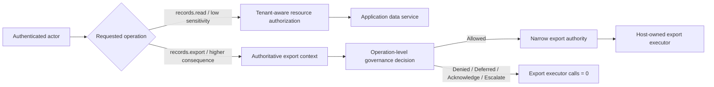
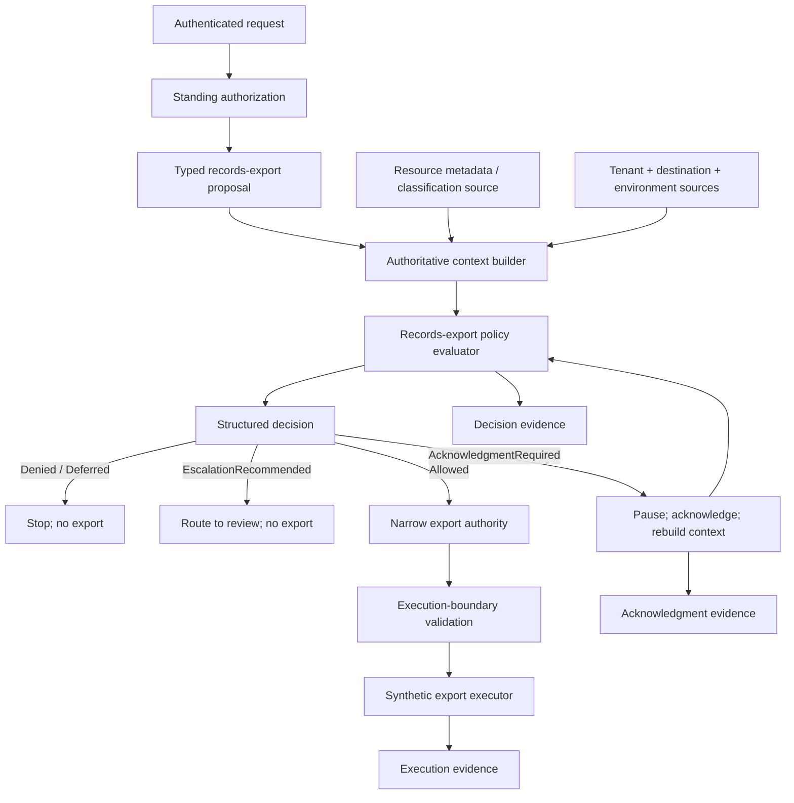
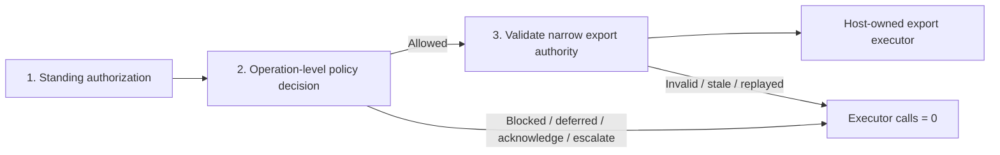
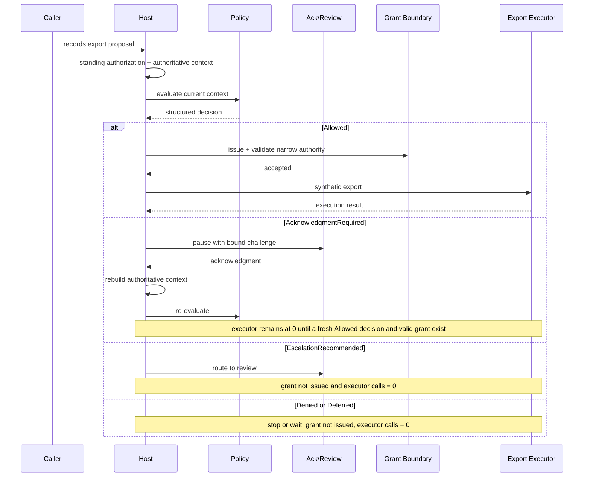

# Sensitive-Data Access Decision

**Learning objective:** Compose authorization, data-classification, policy, narrow execution authority, logging, and evidence boundaries around one fictional `records.export` operation while keeping data protection and governance responsibilities distinct.

**Pattern classification:** General learning material

**Difficulty:** Intermediate

**Prerequisites:** Recommended — [Trust Boundaries and Least Privilege](../security/trust-boundaries-and-least-privilege.md), [Policy Context and Explicit Decision Outcomes](../tutorials/policy-context-and-explicit-decision-outcomes.md), and [Scoped Capability and Host-Owned Execution](../tutorials/scoped-capability-and-host-owned-execution.md). [Secure Logging Across Trust Boundaries](../security/secure-logging-across-trust-boundaries.md), [Risk-Based Decisions in Governed Systems](../governance/risk-based-decisions-in-governed-systems.md), and [Policy Versioning and Decision Provenance](../governance/policy-versioning-and-decision-provenance.md) are useful deeper references.

**Estimated study time:** 25–35 minutes for the full case. The five-minute route below is enough to understand the architectural composition before reading the implementation and failure-handling details.

## Before You Begin

This case is intentionally about **decision and execution boundaries**, not about a particular database, data-loss-prevention product, privacy regime, or records platform.

Keep six terms in view:

- **Standing authorization** answers whether the authenticated actor may enter a records operation at all.
- **Resource classification** is a host-trusted fact about the current sensitivity of the exact resource.
- **Purpose and destination context** describe why the export is requested and where the result would go; callers may propose them, but the host decides which values it trusts.
- **Structured decision** is the operation-level outcome plus stable reason and policy evidence.
- **Narrow export authority** is short-lived authority bound to this operation, resource, destination, resource version, audience, and use count.
- **Protected content** is the data itself. It should not be copied into operational logs or governance evidence merely because the application is allowed to read it.

The case uses synthetic identifiers and a synthetic executor. It does not access real protected data.

**Five-minute route:** read **At a Glance**, **Two Different Access Questions**, **The Minimal Core Path**, **Representative Policy Matrix**, **Three Boundaries Only**, the four traces, and **When Ordinary Authorization Is Enough**.

## At a Glance

The consequential operation is:

```text
records.export
```

An authenticated employee requests an export of a records collection. The host must establish the resource's current classification, tenant, purpose, destination, environment, and policy state before deciding whether any export executor may run.

The representative lifecycle is:

```text
Authenticated actor
      ↓
Standing authorization
      ↓
Requested operation + resource
      ↓
Authoritative resource classification
      ↓
Tenant / purpose / destination / environment context
      ↓
Policy decision + reason code
      ↓
Acknowledgment / escalation when required
      ↓
Narrow resource-specific export authority
      ↓
Execution-boundary validation
      ↓
Synthetic host-owned export executor
      ↓
Minimal decision and execution evidence
```

The invariant is:

> **If the data-access decision is blocked, deferred, awaiting acknowledgment, or escalated, protected export executor calls remain zero.**

A second invariant protects the data itself:

> **Operational logs and governance evidence describe the decision path without becoming another copy of the protected records.**

---

## 1. Two Different Access Questions

The case deliberately separates a routine application-access question from a consequential export question.

### Ordinary low-sensitivity access

Suppose an employee opens a small internal reference dataset in the application:

```text
Operation:       records.read
Classification: Internal
Tenant:          tenant-a
Resource:        internal-demo-directory
Purpose:         ordinary application use
```

If the application's normal authentication, tenant-aware resource authorization, and data-access service completely express the requirement, the host can use those framework and domain controls directly.

The architectural question may simply be:

> **May this authenticated actor read this resource?**

A separate decision lifecycle, acknowledgment workflow, or scoped export grant would add ceremony without improving the boundary.

### Higher-sensitivity export

Now consider:

```text
Operation:       records.export
Classification: Confidential
Tenant:          tenant-a
Resource:        customer-support-history
Purpose:         approved-case-analysis
Destination:     approved-analytics-vault
Record count:    4,800
```

The actor may already be allowed to use the records application and may even be allowed to view individual records. The export question is still different:

> **May this actor export this exact classified resource, for this purpose, to this destination, under current policy and environment conditions?**

That distinction is the reason for the broader case-study flow.

```text
May use application
        ≠
May export every resource

May read one record
        ≠
May create a bulk copy

Has export role
        ≠
Current policy allows this export
```

### Ordinary Resource Authorization vs. Governed Export



The left path is enough when ordinary resource authorization fully expresses the requirement. The right path adds governance only when the export creates a distinct consequence, lifecycle, destination, or evidence boundary.

---

## 2. Keep the Responsibilities Separate

The same process may implement several responsibilities, but their meanings should remain distinct.

| Responsibility | Case-study question | Representative owner in this specimen |
| --- | --- | --- |
| Architecture | Which trust, decision, and execution boundaries exist? | The documented request-to-export flow |
| Implementation | How might those boundaries be represented in .NET? | Endpoint, context builder, policy evaluator, grant issuer/validator, evidence recorder, executor |
| Operations | Who monitors exports, handles retries, cleans up artifacts, and supports failures? | Host application's operations team and platform |
| Security | Who authenticates actors, protects credentials and data, enforces tenant boundaries, secures transport/storage, and controls access to the export destination? | ASP.NET Core/platform security controls and the protected data/export services |
| Governance | Who defines the policy that maps current authoritative facts into `Allowed`, `Denied`, `Deferred`, `AcknowledgmentRequired`, or `EscalationRecommended`? | Policy owner plus the host-controlled evaluator |
| Execution | Which component actually reads or emits the protected export? | The host-owned export executor, invoked only after narrow authority is accepted |

The critical distinction is:

> **Security protects the data and the systems that hold it. Governance decides whether this proposed operation may proceed under current policy. Neither responsibility replaces the other.**

For example, a governance decision marked `Allowed` does not encrypt the export, authenticate the destination, protect credentials, enforce database row security, or configure retention. Those remain security and operational responsibilities.

Likewise, an encrypted database and authenticated endpoint do not answer every operation-level policy question about a bulk export.

---

## 3. Architectural Component Map



The architecture does not require separate deployable services for these boxes. The boxes name responsibilities so that one kind of evidence is not mistaken for another.

### Three Boundaries Only

If the full diagram feels dense, retain this smaller model:



Everything else supports one of those three boundaries or records safe evidence about crossing it.

---

## 4. The Minimal Core Path

A complete production design may contain workflow state, durable evidence, destination services, key management, and operational recovery. The architectural composition itself can remain small:

```csharp
string correlationId = ids.NewCorrelationId();

RecordsExportContext context =
    await contextBuilder.BuildAsync(
        proposal,
        actor,
        correlationId,
        cancellationToken);

RecordsExportDecision decision =
    RecordsExportPolicy.Evaluate(
        context,
        decisionId: ids.NewDecisionId(),
        evaluatedAt: clock.UtcNow);

await decisionRecorder.RecordAsync(context, decision, cancellationToken);

if (!decision.CanIssueExportAuthority)
{
    return decision;
}

RecordsExportGrant grant =
    grantIssuer.Issue(context, decision, clock.UtcNow);

if (!grantValidator.TryAccept(
        grant,
        context,
        clock.UtcNow,
        out string? rejectionReason))
{
    throw new InvalidOperationException(
        $"Export authority rejected: {rejectionReason}");
}

string executionId = ids.NewExecutionId();

SyntheticExportResult result =
    await exportExecutor.ExportAsync(
        executionId,
        context,
        cancellationToken);

await executionRecorder.RecordAsync(
    context,
    decision,
    grant,
    result,
    cancellationToken);

return decision;
```

The grant is issuer-owned authority. It is not copied from caller claims. In this specimen it is bound to:

```text
operation       = records.export
resourceId      = current resource
resourceVersion = version used by the decision
destinationId   = approved destination
actorTenant     = current tenant
audience        = records-export-executor
notBefore       = issuer clock
expiresAt       = short lifetime
maxUses         = 1
policyId/version = decision provenance
```

If those bindings are unnecessary because the same trusted application immediately performs a low-consequence operation, use the simpler architecture instead.

---

## 5. Build Authoritative Context Instead of Trusting the Request

A request can propose an operation, resource, purpose, format, and destination. It should not be authoritative for security-sensitive facts merely because those fields arrive as valid JSON.

A proposal can remain narrow:

```csharp
public sealed record RecordsExportProposal(
    string ResourceId,
    string PurposeCode,
    string DestinationId,
    string Format);
```

Do not let the caller establish facts such as:

```text
classification = Internal
tenant = tenant-a
destinationApproved = true
incidentPosture = Normal
actorCanExport = true
```

The host resolves those facts from sources it is prepared to trust.

```csharp
public sealed record RecordsExportContext(
    RecordsExportProposal Proposal,
    string ActorId,
    string ActorTenantId,
    string ResourceTenantId,
    string Classification,
    string ResourceVersion,
    int RecordCount,
    string DestinationKind,
    bool DestinationApproved,
    bool PurposeAllowed,
    bool ElevatedIncidentPosture,
    string CorrelationId,
    string PolicyId,
    string PolicyVersion);
```

A context builder might combine:

```text
Authenticated principal
        +
Tenant directory
        +
Current resource metadata
        +
Current classification
        +
Destination registry
        +
Purpose rules
        +
Environment / incident state
        +
Current policy identity
```

The proposal remains useful because it states what the actor wants. The context states which facts the host trusts when deciding whether that proposal may proceed.

The **destination registry is host-owned security/governance configuration**, not a caller-controlled allow-list. `DestinationId` is only a lookup key. The host resolves it to the destination identity and connection configuration it actually trusts, and the executor uses that resolved configuration rather than a caller-supplied endpoint. An organization may implement approval as a static allow-list, dynamic attestation, or another control, but the approval must be bound to the resolved destination account/endpoint and current ownership or assurance state—not merely to a familiar string supplied in the request.

### Create Correlation Before Context Construction

Create the correlation identifier at the orchestration boundary before authoritative context is assembled. Pass that identifier through the context, decision, acknowledgment, grant, executor request, and evidence records.

Correlation should not be reconstructed later from log messages.

---

## 6. Representative Policy Matrix

The following policy exists only to make the specimen concrete.

| Current condition | Outcome | Stable reason code | Export executor? |
| --- | --- | --- | --- |
| Actor/resource tenant mismatch | `Denied` | `EXPORT_TENANT_BOUNDARY_MISMATCH` | No |
| Purpose is not permitted for the resource | `Denied` | `EXPORT_PURPOSE_NOT_ALLOWED` | No |
| Destination is not approved | `Denied` | `EXPORT_DESTINATION_NOT_APPROVED` | No |
| Required classification/destination facts are unavailable | `Deferred` | `EXPORT_CONTEXT_INCOMPLETE` | No |
| `Restricted` resource during elevated incident posture | `EscalationRecommended` | `RESTRICTED_EXPORT_REQUIRES_REVIEW` | No |
| `Confidential` resource to approved internal destination | `AcknowledgmentRequired` | `CONFIDENTIAL_EXPORT_REQUIRES_ACK` | No; acknowledge then re-evaluate |
| `Internal` resource, approved purpose and destination, normal posture | `Allowed` | `EXPORT_ALLOWED` | Yes, after narrow authority validation |

The evaluator uses deterministic precedence when multiple signals are true:

```text
Tenant / purpose / destination denial
        ↓
Missing authoritative context / Deferred
        ↓
Restricted + elevated posture / EscalationRecommended
        ↓
Confidential / AcknowledgmentRequired
        ↓
Allowed
```

That precedence is illustrative. The general requirement is that conflicting signals resolve through an explicit, testable rule rather than through accidental code order.

### Risk Is an Input, Not Hidden Authority

Risk information can influence the decision, but a risk score or classifier result should not silently become authorization or execution authority.

For example:

```text
Elevated incident posture
        ↓
Policy interprets the signal
        ↓
EscalationRecommended
```

is clearer than:

```text
riskScore > 80
        ↓
executor blocked by hidden scorer behavior
```

Use [Risk-Based Decisions in Governed Systems](../governance/risk-based-decisions-in-governed-systems.md) when risk modeling itself is the lesson.

---

## 7. Use a Stable Structured Decision Contract

The host should branch on stable fields, not display text.

```csharp
public enum RecordsExportOutcome
{
    Allowed,
    Denied,
    Deferred,
    AcknowledgmentRequired,
    EscalationRecommended
}

public static class RecordsExportReasonCodes
{
    public const string Allowed = "EXPORT_ALLOWED";
    public const string TenantMismatch = "EXPORT_TENANT_BOUNDARY_MISMATCH";
    public const string PurposeNotAllowed = "EXPORT_PURPOSE_NOT_ALLOWED";
    public const string DestinationNotApproved = "EXPORT_DESTINATION_NOT_APPROVED";
    public const string ContextIncomplete = "EXPORT_CONTEXT_INCOMPLETE";
    public const string RestrictedReview = "RESTRICTED_EXPORT_REQUIRES_REVIEW";
    public const string ConfidentialAcknowledgment = "CONFIDENTIAL_EXPORT_REQUIRES_ACK";
}

public sealed record RecordsExportDecision(
    string DecisionId,
    RecordsExportOutcome Outcome,
    string ReasonCode,
    string PolicyId,
    string PolicyVersion,
    string ResourceVersion,
    DateTimeOffset EvaluatedAt,
    string CorrelationId)
{
    public bool CanIssueExportAuthority =>
        Outcome == RecordsExportOutcome.Allowed;
}
```

A UI may render a friendlier explanation such as:

```text
This export requires review because the resource is Restricted
and the system is operating under elevated incident posture.
```

That display text is not the control-flow contract.

Use the enum, reason code, and policy identity for deterministic host behavior and durable evidence.

---

## 8. Acknowledgment and Escalation Do Not Become Export Permission

### Acknowledgment branch

A `Confidential` export may require the actor to acknowledge a condition such as:

```text
The export creates a new copy of Confidential records and must remain
inside the approved analytics destination.
```

The acknowledgment should be bound to the exact proposal or decision identity. In this specimen, an `AcknowledgmentId` is bound at minimum to `DecisionId + ResourceVersion + DestinationId` (and may also bind the actor and purpose). That prevents an accepted acknowledgment from being replayed against a different resource revision or export destination. After it is accepted, rebuild authoritative context and re-evaluate current policy.

```text
Decision v1: AcknowledgmentRequired
        ↓
Bound acknowledgment accepted
        ↓
Resource classification changes?
Destination approval changes?
Policy version changes?
Incident posture changes?
        ↓
Rebuild context
        ↓
Decision v2
```

Acknowledgment is evidence that a condition was presented and accepted. It does not override changed policy.

### Escalation branch

`EscalationRecommended` means the normal path stops and a separate review or workflow may begin.

It does **not** mean:

```text
EscalationRecommended
        ↓
Export anyway while review is pending
```

If an authorized review later changes the state of the request, the host still rebuilds current context and produces a fresh decision before issuing export authority.

---

## 9. Issue Narrow, Short-Lived Export Authority

An allowed decision should not silently become a reusable `CanExportRecords` permission.

A representative grant is:

```csharp
public sealed record RecordsExportGrant(
    string GrantId,
    string DecisionId,
    string CorrelationId,
    string Operation,
    string ResourceId,
    string ResourceVersion,
    string DestinationId,
    string ActorTenantId,
    string Audience,
    DateTimeOffset NotBefore,
    DateTimeOffset ExpiresAt,
    int MaxUses,
    string PolicyId,
    string PolicyVersion);
```

The representation could be a signed token, an opaque server-side handle, a database row, or another host-controlled mechanism. The case study does not prescribe one format.

At the execution boundary, validate at least the semantics that make the grant narrow:

```text
known issuer / integrity representation
operation == records.export
resource == current resource
resourceVersion == current version
destination == current approved destination
actorTenant == current tenant
audience == records-export-executor
current time >= notBefore - bounded clock skew
current time < expiresAt + bounded clock skew
maxUses has not been consumed
not revoked
policy/resource freshness still acceptable
```

For one-use authority, the use check must be an atomic host-owned state transition. A statically valid token is not replay protection by itself.

Do not place the raw grant or bearer representation into logs or broad audit records. Preserve a grant identifier or safe fingerprint when correlation requires it.

---

## 10. Keep the Protected Export Behind a Host-Owned Executor

The evaluator should never perform the data export.

```csharp
public interface IRecordsExportExecutor
{
    Task<SyntheticExportResult> ExportAsync(
        string executionId,
        RecordsExportContext context,
        CancellationToken cancellationToken);
}
```

This case uses a synthetic executor that returns metadata only:

```csharp
public sealed record SyntheticExportResult(
    string ExecutionId,
    string ArtifactId,
    int SimulatedRecordCount,
    string ResultCode);

public sealed class SyntheticRecordsExportExecutor
    : IRecordsExportExecutor
{
    public Task<SyntheticExportResult> ExportAsync(
        string executionId,
        RecordsExportContext context,
        CancellationToken cancellationToken)
    {
        cancellationToken.ThrowIfCancellationRequested();

        return Task.FromResult(
            new SyntheticExportResult(
                executionId,
                ArtifactId: $"synthetic-{executionId}",
                SimulatedRecordCount: context.RecordCount,
                ResultCode: "SYNTHETIC_EXPORT_CREATED"));
    }
}
```

No protected rows, customer values, credentials, or files are read or emitted by this specimen.

In a real system, the host-owned executor would be the component allowed to hold the credentials and network/data access needed for the protected side effect. Keeping those capabilities out of the evaluator reduces confused-deputy risk: a policy component or API layer cannot accidentally become a general-purpose data-export proxy merely because it can produce an `Allowed` result.

---

## 11. Data Minimization Across the Flow

A data-export workflow can leak sensitive information even when the export decision itself is correct.

Apply minimization before each new boundary.

### Proposal

Carry identifiers and declared intent, not protected content:

```text
ResourceId
PurposeCode
DestinationId
Format
```

Avoid request shapes that include a preview of the sensitive dataset merely so policy can decide whether export is allowed.

### Policy context

Carry the facts needed to decide:

```text
Classification
Tenant
ResourceVersion
RecordCount
Destination approval
Purpose allowance
Environment posture
```

Do not copy the entire record set into policy context when metadata is sufficient.

### Export authority

Bind the exact resource and destination, but do not embed the exported data itself.

### Evidence

Record why authority proceeded or stopped without storing protected payloads.

### Operational logging

Record stable event identity and correlation fields without serializing request/response bodies, row values, destination credentials, bearer grants, or protected data previews.

The design question is not only:

> **Can this component see the data?**

It is also:

> **Does this downstream component need another retained copy of the data to do its job?**

---

## 12. Keep Logs, Governance Evidence, and Protected Content Distinct

These three data surfaces answer different questions.

| Surface | Primary purpose | Good examples | Keep out |
| --- | --- | --- | --- |
| Operational log | Diagnose runtime behavior | event name, correlation ID, outcome, reason code, duration, safe component identifiers | record contents, request bodies, tokens, credentials, unrestricted user-entered text |
| Governance evidence | Reconstruct why authority proceeded or stopped | decision ID, policy/version, reason code, resource evidence reference, classification, grant/execution IDs, timestamps | protected rows, full exported artifact, destination secret, raw bearer grant |
| Protected records/export | Perform the actual business operation | the records the authorized executor needs | observability and evidence systems unless explicitly required and separately protected |

A safe operational event might look like:

```csharp
logger.LogInformation(
    "Records export decision {DecisionId} for {CorrelationId} " +
    "completed with {Outcome}/{ReasonCode} under policy {PolicyId}/{PolicyVersion}.",
    decision.DecisionId,
    decision.CorrelationId,
    decision.Outcome,
    decision.ReasonCode,
    decision.PolicyId,
    decision.PolicyVersion);
```

The log intentionally does not include:

```text
record bodies
customer names
emails
addresses
free-text case notes
access tokens
destination credentials
raw grant material
export artifact contents
```

Whether even a resource identifier may appear in operational logs depends on the system's data classification and threat model. When unnecessary, use a safe opaque or pseudonymous evidence reference instead.

---

## 13. Concrete Evidence Correlation Without Protected Content

Correlation should be explicit in data structures, not implied by nearby log lines.

```csharp
public sealed record ExportEvidenceCorrelation(
    string CorrelationId,
    string DecisionId,
    string? GrantId,
    string? ExecutionId,
    string PolicyId,
    string PolicyVersion,
    string ResourceVersion,
    DateTimeOffset EvaluatedAt);
```

A decision receipt can preserve:

```csharp
public sealed record RecordsExportDecisionReceipt(
    ExportEvidenceCorrelation Correlation,
    string ResourceEvidenceRef,
    string Classification,
    string RecordCountBand,
    string DestinationKind,
    RecordsExportOutcome Outcome,
    string ReasonCode);
```

A grant receipt can preserve the transition into execution authority without persisting the raw authority representation:

```csharp
public sealed record RecordsExportGrantReceipt(
    ExportEvidenceCorrelation Correlation,
    string Operation,
    string ResourceEvidenceRef,
    string DestinationKind,
    DateTimeOffset ExpiresAt,
    int MaxUses);
```

An execution receipt can preserve what the synthetic executor did:

```csharp
public sealed record RecordsExportExecutionReceipt(
    ExportEvidenceCorrelation Correlation,
    string ArtifactEvidenceRef,
    string RecordCountBand,
    string ResultCode,
    DateTimeOffset CompletedAt);
```

The evidence layer can deliberately coarsen counts instead of retaining the exact export size. One illustrative banding scheme is:

```text
0
1-10
11-100
101-1,000
1,001+
```

The thresholds are application-specific; the architectural point is to retain only the precision required for reconstruction or oversight. The executor may know an exact count to perform its work while the durable evidence record stores only the band.

`ResourceEvidenceRef` and `ArtifactEvidenceRef` are intentionally abstract. A production design may use an opaque identifier, keyed pseudonym, stable internal ID, or another representation appropriate to its threat model and reconstruction needs.

The evidence should be sufficient to answer:

```text
Which proposal/decision was this?
Which policy version decided it?
Which resource version was considered?
Was narrow authority issued?
Did protected execution occur?
Which execution corresponds to that authority?
```

It does not need to answer those questions by storing the protected data itself.

---

## 14. Four Representative Traces

### Trace A — Low-sensitivity read uses ordinary authorization

```text
Actor:          employee-21
Operation:      records.read
Resource:       internal-demo-directory
Classification: Internal
Tenant match:   yes
```

Flow:

```text
Authentication
    ↓
Resource-aware authorization
    ↓
Application data service
```

No export grant, acknowledgment, or governance workflow is introduced because ordinary authorization fully expresses the requirement.

### Trace B — Confidential export requires acknowledgment, then proceeds

```text
Actor:              analyst-17
Operation:          records.export
Resource:           customer-support-history
Classification:     Confidential
ResourceVersion:    rv-41
Tenant match:       yes
Purpose:            approved-case-analysis
Destination:        approved-analytics-vault
Incident posture:   normal
Policy:             records-export / 3.4
CorrelationId:      corr-7a1
```

First decision:

```text
Outcome:     AcknowledgmentRequired
ReasonCode:  CONFIDENTIAL_EXPORT_REQUIRES_ACK
Executor:    0 calls
```

After a bound acknowledgment:

```text
Rebuild authoritative context
        ↓
Classification still Confidential
ResourceVersion still rv-41
Destination still approved
Policy still permits continuation
        ↓
Fresh Allowed decision
        ↓
One-use grant issued
        ↓
Grant accepted at export boundary
        ↓
Synthetic executor invoked once
```

The acknowledgment did not create authority. The fresh decision did.

### Trace C — Restricted export under elevated posture escalates

```text
Actor:              analyst-17
Operation:          records.export
Classification:     Restricted
Incident posture:   elevated
Policy:             records-export / 3.4
```

Decision:

```text
Outcome:     EscalationRecommended
ReasonCode:  RESTRICTED_EXPORT_REQUIRES_REVIEW
Executor:    0 calls
Grant:       not issued
```

Review workflow may begin, but no protected export occurs while the request is escalated.

### Trace D — Cross-tenant export is denied

```text
Actor tenant:       tenant-a
Resource tenant:    tenant-b
Operation:          records.export
```

Decision:

```text
Outcome:     Denied
ReasonCode:  EXPORT_TENANT_BOUNDARY_MISMATCH
Executor:    0 calls
Grant:       not issued
```

The decision evidence records the stable reason and current policy identity without recording any tenant-b protected records. It should also avoid retaining both raw tenant identifiers or a sensitive cross-tenant resource pairing when that relationship is itself sensitive. A safe evidence reference plus `EXPORT_TENANT_BOUNDARY_MISMATCH` is often enough to reconstruct why the operation stopped without creating a new cross-tenant disclosure in logs or audit storage.

### Four-Branch Sequence



---

## 15. Test the Invariant, Not Only the Evaluator

A policy unit test that returns `Denied` is useful, but the stronger architecture test verifies that the protected executor was never reached.

```csharp
RecordsExportDecision decision =
    await workflow.ExecuteAsync(
        restrictedExportProposal,
        actor,
        CancellationToken.None);

Assert.Equal(
    RecordsExportOutcome.EscalationRecommended,
    decision.Outcome);

Assert.Equal(0, fakeExportExecutor.Invocations.Count);
Assert.Equal(0, fakeGrantIssuer.IssuedGrants.Count);
```

For a cross-tenant denial:

```csharp
Assert.Equal(
    RecordsExportOutcome.Denied,
    decision.Outcome);

Assert.Equal(
    RecordsExportReasonCodes.TenantMismatch,
    decision.ReasonCode);

Assert.Empty(fakeExportExecutor.Invocations);
```

For the allowed path, assert the opposite boundary deliberately:

```csharp
Assert.Equal(RecordsExportOutcome.Allowed, decision.Outcome);
Assert.Single(fakeGrantIssuer.IssuedGrants);
Assert.Single(fakeExportExecutor.Invocations);
```

Other useful tests include:

- stale `ResourceVersion` rejects the grant;
- expired grant rejects before execution;
- replay of a one-use grant rejects the second attempt;
- changed destination approval after acknowledgment prevents continuation;
- missing authoritative classification produces `Deferred` rather than a guessed allow;
- conflicting policy signals follow the documented precedence rule;
- decision/evidence records contain identifiers and policy facts but no protected payload fields.

Use synthetic sentinel values in tests so the minimization invariant is observable rather than only asserted in prose. For example, after arranging protected synthetic input containing these values:

```csharp
string evidenceText = receipt.ToString();

Assert.DoesNotContain(
    "customer@example.invalid",
    evidenceText,
    StringComparison.Ordinal);

Assert.DoesNotContain(
    "full-case-note-body",
    evidenceText,
    StringComparison.Ordinal);
```

The exact test mechanism can use serialization or structured fields instead of `ToString()`. The important point is that known protected sentinels present in the synthetic source data never appear in the evidence representation.

---

## 16. Freshness: Classification, Resource, Destination, and Policy Can Change

An allowed decision is about a particular state of the world.

Between decision and execution:

```text
Resource classification may change
Resource contents/version may change
Destination approval may be revoked
Actor employment/tenant state may change
Incident posture may change
Policy version may change
```

Binding `ResourceVersion` into the grant prevents a decision about `rv-41` from silently authorizing export of a materially changed `rv-42`.

The exact freshness mechanism is application-specific. Options include:

- optimistic concurrency/version checks;
- a fresh metadata read at the execution boundary;
- bounded decision/grant lifetime;
- policy-version compatibility rules;
- destination-registry revalidation;
- re-evaluation when critical context changed.

Do not assume that a short-lived grant solves every freshness problem. A resource can change inside a short window, and an externally owned destination can be revoked independently of the grant lifetime.

---

## 17. Partial Failure and Operational Contracts

Data export creates operational questions that policy evaluation alone cannot answer. There is no implied atomic transaction between the protected export side effect and a separate evidence store. This specimen therefore uses an asymmetric contract: required **pre-execution decision evidence fails closed**, while **post-execution evidence is recovered without blindly repeating the export**. A stable `ExecutionId` supports idempotency/reconciliation where the executor can honor it, and a durable outbox or pending-evidence record is one appropriate way to make later receipt delivery retryable.

### Decision evidence fails before authority is issued

If the host's policy requires durable decision evidence before an export may proceed and `RecordAsync` fails, fail closed before grant issuance and before export execution.

```text
Allowed decision
    ↓
Required decision evidence write fails
    ↓
No grant
    ↓
No export
```

### Export succeeds but execution evidence fails

Do not blindly repeat the export merely to recreate evidence.

Use a stable `ExecutionId` as an idempotency/reconciliation key where the executor supports it. Retry the evidence operation, not the protected side effect. A durable local outbox or pending-execution record is one valid implementation pattern when evidence must eventually be emitted to another store.

```text
ExecutionId = exec-31
Synthetic export succeeds
Execution evidence sink unavailable
        ↓
Preserve pending evidence state
        ↓
Retry evidence delivery
        ↓
Do not create export #2
```

If the executor returns an ambiguous result, reconcile that `ExecutionId` before deciding whether a retry is safe.

### Artifact exists but later delivery fails

Creation of an export artifact and delivery to a destination may be separate side effects. A production system should define whether it cleans up, retries delivery, expires the artifact, or requires human intervention. Do not hide those operational semantics inside the policy evaluator.

### `Deferred` needs an owner

`Deferred` means the operation cannot be decided now under the current contract. A queue, workflow, scheduler, or caller may own retry, but the owner and lease/retry semantics should be explicit. On retry, rebuild authoritative context rather than reusing stale facts.

### Revocation needs an owner

If issued authority must be revocable before expiration, define where revocation state lives and how the executor checks it. A signed token alone cannot learn that it was revoked unless the validation boundary consults state or uses another revocation-capable mechanism.

The case study names these contracts without prescribing a specific queue, outbox library, database, or workflow product.

---

## 18. Security Responsibilities That Governance Does Not Replace

Even a well-structured decision pipeline still depends on ordinary security engineering.

A production data system may need controls for:

- authentication and session security;
- resource-aware authorization;
- tenant isolation;
- database/query authorization;
- encryption in transit and at rest;
- destination authentication and authorization;
- credential storage and rotation;
- network egress restrictions;
- malware/content scanning where applicable;
- retention and deletion;
- secure temporary-file handling;
- export artifact access control;
- monitoring and incident response;
- backup and replica protection;
- secrets and key custody.

The policy evaluator should not receive raw destination credentials merely because destination approval is a policy input. The executor can own the credential or secret reference required to perform the protected operation.

[Secret Handling Across Trust Boundaries](../security/secret-handling-across-trust-boundaries.md) covers that ownership question in more depth.

The broader rule is:

> **Governance may authorize an operation. It does not make the operation secure by itself.**

---

## 19. Common Failure Modes

### Endpoint role becomes universal export permission

```text
User.IsInRole("RecordsExporter")
        ↓
Export any dataset
```

Standing authorization has been stretched beyond the resource, purpose, destination, and current policy context it actually proves.

### Caller supplies authoritative classification

```json
{
  "resourceId": "restricted-42",
  "classification": "Internal"
}
```

Schema-valid input is not authoritative classification.

### Policy evaluator reads or emits protected data

If the evaluator must fetch whole datasets or perform export side effects, policy and execution responsibilities have collapsed.

### A risk score becomes hidden authorization

A score can be useful evidence, but the policy should define what the score means for this operation and preserve the reasoned outcome.

### Audit evidence becomes a shadow database

Copying record bodies into evidence because they were "part of the decision" creates another sensitive data store with its own access, retention, breach, and deletion obligations.

### Request/response body logging leaks protected content

A correctly denied export can still become a data incident if middleware logs the request, query result, or generated artifact indiscriminately.

### Grant is broad or long-lived

A reusable `records.export:anything` token defeats the purpose of narrowing authority after the decision.

### Retry duplicates the export

If `ExecutionId` is not stable or the executor is not idempotent/reconcilable, an operational retry can create multiple copies of the same sensitive dataset.

### Escalation is mistaken for approval

A request routed to review has not yet acquired export authority.

### Policy decision is recorded but execution is not correlated

A later investigator can see that an export was allowed but cannot prove whether that decision corresponds to the observed side effect.

### Every read becomes a governance pipeline

The architecture has become ceremony. Use ordinary authorization when it already preserves the required boundary.

---

## 20. When Ordinary ASP.NET Core Authorization Is Enough

Use ordinary authentication, ASP.NET Core authorization, resource-aware authorization, validation, and a clear application service when they fully answer the real question.

Examples include:

- low-sensitivity read-only access inside one tenant;
- an immediate operation whose authorization policy already has all relevant current facts;
- a resource access decision with no acknowledgment, escalation, delayed continuation, or separate execution authority;
- a small application where introducing a second decision vocabulary would obscure rather than clarify responsibility.

[When ASP.NET Core Authorization Is Enough](../architecture/when-aspnet-core-authorization-is-enough.md) explains the framework-native boundary in detail. It is the better starting point when the problem is fundamentally access control.

[When a Simple Application Service Is Enough](../architecture/when-a-simple-application-service-is-enough.md) is the second comparison point when one trusted application boundary can validate and perform the operation without a separate governance lifecycle.

Use the broader case-study flow only when it answers questions that those simpler designs do not.

---

## 21. Review Checklist

Before treating a sensitive-data export as architecturally complete, ask:

1. What exact operation is proposed: read, search, export, transform, or deliver?
2. Does normal framework/resource authorization already express the full requirement?
3. Which resource classification and version are current?
4. Which component is authoritative for tenant, classification, purpose, destination approval, and environment facts?
5. Can the caller influence any of those values without host verification?
6. Is risk a transparent policy input rather than hidden authority?
7. Are outcome and reason codes stable and machine-readable?
8. Are conflicting policy signals resolved deterministically?
9. Does acknowledgment pause and re-evaluate rather than bypass policy?
10. Does escalation keep executor invocations at zero while review is pending?
11. Is export authority bound to operation, resource, resource version, destination, tenant, audience, lifetime, and use count?
12. Can stale, expired, revoked, or replayed authority reach the executor?
13. Does the executor alone own the protected data side effect and any required destination credentials?
14. Can tests prove blocked decisions create zero executor calls and zero grants?
15. Do operational logs exclude protected records, credentials, request bodies, and raw grant material?
16. Does governance evidence preserve decision provenance without becoming another copy of the exported dataset?
17. Can decision, grant, and execution evidence be correlated explicitly?
18. What happens when decision evidence fails before execution?
19. What happens when execution succeeds but execution-evidence persistence fails?
20. Are retries idempotent or reconciled by stable execution identity?
21. Who owns `Deferred` retries, artifact cleanup, grant revocation, monitoring, and incident response?
22. Which security controls remain necessary even after governance returns `Allowed`?

If those answers are explicit, the system is easier to review because access control, governance, data protection, and execution have not been collapsed into one ambiguous permission check.

---

## Check Your Understanding

After reviewing the case, you should be able to:

- Explain why permission to use a records application is not automatically permission to export every resource.
- Identify which export facts must come from authoritative host sources.
- Explain why resource classification and risk are policy inputs rather than execution authority.
- Show how an escalated or denied decision produces zero export-executor invocations.
- Describe the bindings that make one export grant narrower than standing authorization.
- Distinguish operational logs, governance evidence, and protected data.
- Explain why post-execution evidence failure should not automatically cause the export to run again.
- Name the security responsibilities that remain outside governance policy evaluation.

---

## Further Reading and Practice

- [Trust Boundaries and Least Privilege](../security/trust-boundaries-and-least-privilege.md) — deepen the distinction between caller claims, authoritative facts, and authority carried across boundaries.
- [Secure Logging Across Trust Boundaries](../security/secure-logging-across-trust-boundaries.md) — examine how even diagnostic data becomes an outbound security decision once it enters telemetry and retention systems.
- [Secret Handling Across Trust Boundaries](../security/secret-handling-across-trust-boundaries.md) — keep destination credentials and other secrets owned by the components that actually require them.
- [Policy Context and Explicit Decision Outcomes](../tutorials/policy-context-and-explicit-decision-outcomes.md) — study the smaller context-to-decision pattern independently of this case.
- [Scoped Capability and Host-Owned Execution](../tutorials/scoped-capability-and-host-owned-execution.md) — examine narrow continuation authority, freshness, audience, and execution-boundary validation in detail.
- [Risk-Based Decisions in Governed Systems](../governance/risk-based-decisions-in-governed-systems.md) — explore how classification, consequence, and environment signals can affect an explicit decision without becoming hidden authorization.
- [Policy Versioning and Decision Provenance](../governance/policy-versioning-and-decision-provenance.md) — preserve which policy produced a decision and reason about policy drift before later execution.
- [Build a Governed API Operation](../labs/build-a-governed-api-operation.md) — practice composing the same decision-before-execution boundaries around a consequential API operation.

The case-study rule to keep is:

> **Protect the data with security controls, decide the exact operation with current authoritative policy context, and let protected export occur only behind host-validated narrow authority.**
