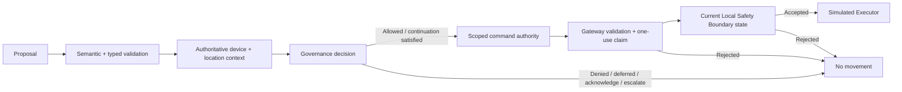
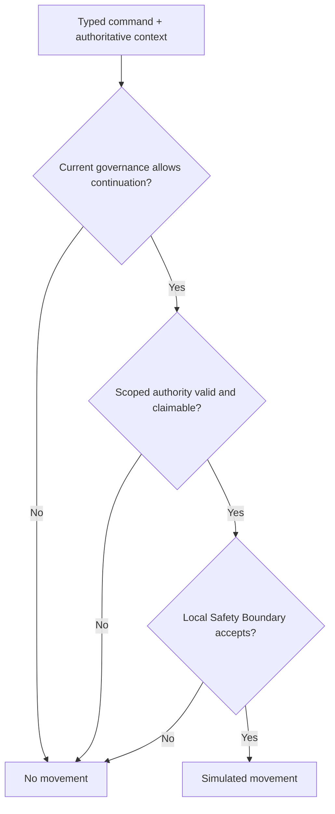

# Simulated Robotics-Command Governance Boundary

**Learning objective:** Apply governed-execution patterns to a deterministic simulated robot without implying that application governance can replace robotics safety engineering, certified control logic, or physical fail-safe design.

Robotics-adjacent systems make authority mistakes unusually concrete: a software proposal can eventually become physical action. Keeping proposal, governance, command authority, gateway enforcement, and the Local Safety Boundary separate makes it possible to reject stale, broadened, or locally unacceptable commands before the execution boundary.

**Pattern classification:** Experimental

**Difficulty:** Advanced

**Prerequisites:** Recommended — [Governed AI Tool Gateway](../tutorials/governed-ai-tool-gateway.md), [Scoped Capability and Host-Owned Execution](../tutorials/scoped-capability-and-host-owned-execution.md), and [Trust Boundaries and Least Privilege](../security/trust-boundaries-and-least-privilege.md). [Replay Protection and Bounded-Use Authority](../security/replay-protection-and-bounded-use.md), [Regional and Tenant Policy Overlays](../advanced/regional-and-tenant-policy-overlays.md), and [Risk-Based Decisions in Governed Systems](../governance/risk-based-decisions-in-governed-systems.md) are useful companions.

**Intended audience:** Primarily software/system architects and senior engineers reasoning about application-layer governance around robotics-adjacent, autonomous, or AI-planned systems. Robotics engineers and safety practitioners may use it as an application-boundary specimen, but it is not controller-design or safety-engineering guidance. General learners can stay on the short routes below and follow the companion material only when a boundary needs deeper treatment.

**Estimated study time:** 45–60 minutes for the guided path and 75–95 minutes for a careful full read.

> **Simulated-only safety notice:** This case study controls only deterministic simulated objects in memory. It does **not** establish production robotics safety, machine-safety certification, control-system suitability, functional-safety compliance, actuator safety, collision avoidance, safe speed or force limits, emergency-stop behavior, or physical fail-safe guarantees. The normalized values below are teaching data, not engineering limits for a real robot.

The central principle is:

> **Governance may permit a command. The Local Safety Boundary may still reject it. Neither a model proposal nor a governance decision may directly drive an actuator.**

## Five-Minute Route

Read these sections first:

1. **At a Glance**
2. **Boundary Summary**
3. **Semantic Command Allowlist**
4. **Governance Policy Matrix**
5. **Local Safety Boundary**
6. **Four Required Scenarios**
7. **What This Study Does Not Establish**

**Core path (~15–20 minutes):** After the five-minute route, add **Threat Model Summary**, **Minimal Execution Path**, **Authoritative Device and Location Context**, **The Simulated Gateway Validation Pipeline**, **Replay Protection Is Stateful**, **Expiry and Revocation Fail Closed**, **Governance-Relevant Drift and High-Frequency Safety State Are Different**, **Telemetry Is Evidence, Not Authority**, and **Required Invariants**. This route is intended for experienced reviewers who want the security and lifecycle model without every trace.

The remaining sections form the deep path through identity, capability binding, acknowledgment, drift, telemetry, failure behavior, evidence, and testable invariants.

---

## 1. At a Glance

The fictional environment contains one deterministic simulated mobile manipulator:

```text
Device:        sim-robot-17
Region:        sim-region-east
Current zone:  training-cell-a
Gateway:       simulated-robot-gateway
```

A planner or AI model may propose a semantic command such as:

```text
robot.move-to-zone
```

The host does not send that proposal to an actuator.

### Core architecture diagram



The diagram is the core model for the page. The rest of the study explains who owns each arrow, which facts are authoritative, and why later boundaries may still reject a command that passed an earlier one.

The primary invariant is:

```text
No valid command authority
        OR
Local Safety Boundary rejects
        ↓
Simulated movement calls = 0
```

This is intentionally stricter than:

```text
Policy said Allowed
        ↓
Move robot
```

because governance and the Local Safety Boundary answer different questions.

### Minimal execution path

The shortest successful path is:

```text
Proposal
  → semantic + typed validation
  → authoritative context
  → current governance = Allowed
  → scoped command authority
  → gateway validates and atomically claims authority
  → Local Safety Boundary = Accepted
  → Simulated Executor
```

Every arrow is a blocking boundary. A rejection at any step produces zero simulated movement. The deeper sections explain freshness, replay, acknowledgment, provenance, and failure behavior without changing this core path.

---

## 2. Boundary Summary

The case separates eight responsibilities. This table is the shortest boundary map for the page. The [Compact Glossary](#36-compact-glossary) is the canonical vocabulary; later sections apply these terms rather than redefine them.

| Boundary | Canonical responsibility | Blocking result |
| --- | --- | --- |
| Proposal | Capture what the planner or AI suggested | malformed proposal never advances |
| Semantic validation | Resolve a host-owned command name and typed arguments | unknown or invalid command is rejected |
| Authoritative context | Resolve device, location, operating mode, policy coordinates, and governance facts from trusted sources | unavailable or mismatched context blocks continuation |
| Governance | Decide whether regional and operational rules permit the exact command | non-`Allowed` outcome creates no command authority |
| Human continuation | Satisfy a bound acknowledgment or escalation requirement when policy requires one | unsatisfied continuation creates no command authority |
| Scoped authority | Bind one command attempt to device, audience, bounds, policy evidence, lifetime, and use | invalid, stale, revoked, or replayed authority is rejected |
| **Local Safety Boundary** | Evaluate current simulator/control-side state immediately before movement | any non-`Accepted` outcome blocks movement |
| **Simulated Executor** | Record the already-validated simulated side effect | receives no proposal or policy authority of its own |

One component may implement several rows in a teaching sample; the responsibility boundaries remain distinct.

### Threat model summary

This specimen is designed to make a small set of authority and freshness threats visible. The controls are application-layer teaching controls, not a robotics safety case.

| Threat or failure | Teaching control | What the control still does not establish |
| --- | --- | --- |
| Planner/model attempts a direct actuator path | semantic command gateway and host-owned Simulated Executor | production actuator isolation or certified control integrity |
| Proposal invents or broadens a command | host-owned semantic allowlist plus typed argument validation | that an allowed semantic command is physically safe |
| Proposal supplies a false device, zone, tenant, or region | authoritative host-resolved device/location/policy context | that the underlying registry or sensor source is infallible |
| Capability is altered or presented to the wrong gateway/device | integrity verification plus audience/device/command bindings | freshness, replay status, or Local Safety Boundary outcome |
| Capability is replayed or two consumers race | authoritative atomic one-use claim | exactly-once physical execution |
| Authority expires or is revoked while in flight | host-clock expiry plus ordered revocation/claim state | zero revocation latency in every distributed subsystem |
| Policy or governance-relevant device state changes | current context revalidation and supersession | high-frequency Local Safety Boundary state |
| Local Safety Boundary state is missing or stale | time-bounded Local Safety Snapshot and fail-to-no-movement behavior | production sensor validation, hazard analysis, or certified safety functions |
| Telemetry is reused as permission | the Telemetry boundary remains evidence only | correctness or completeness of the telemetry stream |

The threat model therefore assumes that hostile, stale, duplicated, or merely incorrect software inputs can reach the application boundary. It does **not** assume that application governance can contain mechanical, electrical, controller, sensor, timing, or hardware failures that belong to a real robotics safety architecture.

The semantic distinction still matters.

For example:

```text
Known command
      ≠
Allowed command
      ≠
Authorized command
      ≠
Locally safe command
      ≠
Executed command
```

The same separation applies whether the proposal originated from a person, deterministic planner, rules engine, or AI model.

---

## 3. Fictional Simulator Environment

All values in this section are invented.

### Devices

| Device | Device kind | Home region | Allowed gateway audience |
| --- | --- | --- | --- |
| `sim-robot-17` | `TrainingMobileManipulator` | `sim-region-east` | `simulated-robot-gateway` |
| `sim-robot-23` | `TrainingMobileManipulator` | `sim-region-west` | `simulated-robot-gateway` |

### Zones

| Zone | Region | Teaching meaning |
| --- | --- | --- |
| `training-cell-a` | `sim-region-east` | ordinary simulated workspace |
| `training-cell-b` | `sim-region-east` | second ordinary simulated workspace |
| `shared-cell-east` | `sim-region-east` | higher-consequence shared simulated workspace |
| `maintenance-cell-east` | `sim-region-east` | requires human escalation in this specimen |
| `training-cell-west` | `sim-region-west` | ordinary west-region simulated workspace |

### Command vocabulary

The simulator exposes only:

```text
robot.move-to-zone
robot.set-gripper-state
robot.stop
```

No generic:

```text
execute-script
raw-motor-command
write-register
set-voltage
invoke-arbitrary-driver
```

exists in the teaching surface.

The semantic allowlist is deliberate: a higher-level command is easier to validate, bind to policy, explain, and reject than a raw actuator primitive.

### Normalized teaching bounds

Movement proposals use dimensionless simulator values:

```text
NormalizedSpeed: 0.00 .. 1.00
NormalizedForce: 0.00 .. 1.00
```

These values do not correspond to meters per second, newtons, torque, payload, stopping distance, or any physical safety limit.

They exist only to demonstrate that policy and gateway layers may constrain command magnitude while the Local Safety Boundary still owns the final simulated acceptance check.

### Stop command semantics

`robot.stop` is a software-level semantic command in this teaching environment. It still requires its own scoped command authority, although governance may deliberately make it easier to authorize than movement (for example, no acknowledgment requirement). It is **not** a physical emergency-stop function and does not model certified emergency-stop behavior.

---

## 4. No Direct Model-to-Actuator Execution

The unsafe conceptual path is:

```text
Model output
    ↓
Robot SDK
    ↓
Actuator
```

This study prohibits that path.

A model receives no actuator credential, device driver, network socket, robot SDK handle, or Simulated Executor reference.

Its output is only data:

```csharp
public sealed record RobotCommandProposal(
    string ProposalId,
    string ProposedCommand,
    string DeviceId,
    IReadOnlyDictionary<string, string> Arguments,
    string? PlannerRationale);
```

For example:

```text
ProposalId:       prop-410
ProposedCommand:  robot.move-to-zone
DeviceId:         sim-robot-17
Arguments:
  targetZone = shared-cell-east
  normalizedSpeed = 0.35
```

The proposal means:

> A planner suggested that the host consider this command.

It does not mean:

> The robot should move.

That preserves the same boundary used by the [Governed AI Tool Gateway](../tutorials/governed-ai-tool-gateway.md): **the model may propose; the host retains execution authority.**

---

## 5. Semantic Command Allowlist

The host owns the command catalog.

```csharp
public sealed record RobotCommandDescriptor(
    string CommandName,
    string SchemaVersion,
    IReadOnlySet<string> RequiredArguments,
    string GovernanceOperation,
    string CapabilityScope,
    string GatewayAudience);

public interface IRobotCommandCatalog
{
    bool TryGet(
        string commandName,
        out RobotCommandDescriptor descriptor);
}
```

Representative entries are:

| Command | Required arguments | Governance operation | Capability scope |
| --- | --- | --- | --- |
| `robot.move-to-zone` | `targetZone`, `normalizedSpeed` | `robot.move` | `robot.move` |
| `robot.set-gripper-state` | `state`, `normalizedForce` | `robot.gripper.set` | `robot.gripper.set` |
| `robot.stop` | none | `robot.stop` | `robot.stop` |

`robot.stop` is only a software-level semantic command in this simulator. It is **not** the physical emergency-stop function of a real machine; the dedicated stop-command section later in this page keeps those concepts separate.

An unknown semantic command fails before policy evaluation:

```text
robot.rotate-tool-at-raw-rpm
        ↓
No catalog entry
        ↓
proposal.command-unknown
        ↓
No capability
Simulated Executor calls = 0
```

Do not let a model create a new executable command by inventing a name.

---

## 6. Typed Command Validation

After catalog lookup, parse the command into a typed intent.

```csharp
public sealed record MoveToZoneIntent(
    string ProposalId,
    string DeviceId,
    string TargetZone,
    decimal NormalizedSpeed);
```

The parser rejects:

- missing required arguments;
- unknown fields when the schema forbids them;
- malformed decimals;
- values outside the simulator's syntactic range;
- blank or malformed device and zone identifiers;
- commands whose schema version is unsupported.

For example:

```text
normalizedSpeed = 4.5
        ↓
Typed validation fails
        ↓
proposal.argument-out-of-range
        ↓
No policy evaluation
No capability
No simulated movement
```

This is **schema validation**, not the final safety decision.

A value can be syntactically valid and still be disallowed by policy or rejected by the Local Safety Boundary.

---

## 7. Authoritative Device and Location Context

The proposal contains a `DeviceId`, but it does not get to define the device's trusted properties.

The host resolves them from a device registry and current operational context.

```csharp
public sealed record SimulatedDeviceSnapshot(
    string DeviceId,
    string DeviceKind,
    string HomeRegion,
    string CurrentRegion,
    string CurrentZone,
    string OperationalMode,
    string CommandStateVersion,
    string ConfigurationVersion,
    bool AvailableForGovernedCommands);

public sealed record SimulatedZoneSnapshot(
    string ZoneId,
    string Region,
    string ZoneKind,
    string ZoneRegistryVersion);
```

The authoritative context might be:

```csharp
public sealed record RobotGovernanceContext(
    string ActorId,
    string TenantId,
    MoveToZoneIntent Intent,
    SimulatedDeviceSnapshot Device,
    SimulatedZoneSnapshot TargetZone,
    string PolicySetId,
    string PolicySetVersion,
    string PolicySetFingerprint,
    string CorrelationId,
    DateTimeOffset EvaluatedAt);
```

Sources are intentionally explicit:

| Fact | Teaching source |
| --- | --- |
| Actor | authenticated host principal or deterministic planner identity |
| Device kind / region | host-owned device registry |
| Current zone / command state | deterministic simulator state provider |
| Target zone region | host-owned zone registry |
| Tenant | host-owned device/resource relationship |
| Policy set | policy resolver using authoritative device + regional coordinates |
| Correlation ID | host orchestration boundary |

The model may suggest `sim-region-west` in free text.

That does not change the device's authoritative `CurrentRegion` or the target zone's registered region.

---

## 8. Location and Regional Policy Coordinates

This specimen resolves regional policy from the authoritative device and target-zone records.

Conceptually:

```text
Device = sim-robot-17
CurrentRegion = sim-region-east
TargetZone = shared-cell-east
        ↓
Resolve east-region robotics overlay
```

The caller cannot select a more permissive regional rule by adding:

```json
{
  "policyRegion": "sim-region-west"
}
```

That value is either rejected as unsupported input or ignored as non-authoritative metadata.

The [Regional and Tenant Policy Overlays](../advanced/regional-and-tenant-policy-overlays.md) material explains the general rule: policy scope should come from authoritative host context, not client preference.

---

## 9. Governance Policy Matrix

The fictional policy combines platform, regional, and operation-level constraints.

The rules below are **not** robotics safety recommendations or law.

| Condition | Governance outcome | Reason code | Authority issued immediately? |
| --- | --- | --- | --- |
| Known move command, same region, ordinary training zone, speed <= `0.40` | `Allowed` | `robot.move.allowed` | Yes, after current checks |
| Target = `shared-cell-east`, speed <= `0.30` | `AcknowledgmentRequired` | `robot.move.shared-zone-ack` | No |
| Target = `maintenance-cell-east` | `EscalationRecommended` | `robot.move.maintenance-zone-review` | No |
| Target zone is in another region | `Denied` | `robot.move.cross-region-blocked` | No |
| Normalized speed > `0.40` | `Denied` | `robot.move.policy-speed-bound` | No |
| Synthetic per-device command issuance rate exceeded | `Deferred` | `robot.command-rate-limited` | No |
| Required policy context unavailable | `Deferred` | `robot.policy-context-unavailable` | No |

The numeric thresholds are teaching-only normalized values.

They are not physical safety values and must not be copied into a real control system.

The governance evaluator returns a decision. It does not call the robot gateway.

### Rate, force, and speed are separate teaching bounds

The same pattern can constrain different command dimensions without pretending they are interchangeable safety mechanisms. For example, this simulator could define:

```text
Move command policy bound:
NormalizedSpeed <= 0.40

Gripper command policy bound:
NormalizedForce <= 0.25

Per-device command issuance bound:
No more than 4 newly governed motion/gripper commands per rolling teaching minute
```

Those numbers are arbitrary simulation values. A real system would need domain-specific units, dynamics, controller limits, stopping behavior, payload analysis, and safety engineering.

The rate bound is also not replay protection. Rate policy limits how frequently new commands may be authorized, while replay state answers whether one already-issued authority may be consumed again.

```csharp
public enum RobotGovernanceOutcome
{
    Allowed,
    Denied,
    Deferred,
    AcknowledgmentRequired,
    EscalationRecommended
}

public sealed record RobotGovernanceDecision(
    string DecisionId,
    RobotGovernanceOutcome Outcome,
    IReadOnlyList<string> ReasonCodes,
    string PolicySetId,
    string PolicySetVersion,
    string PolicySetFingerprint,
    string DeviceCommandStateVersion,
    string ZoneRegistryVersion,
    string CorrelationId,
    DateTimeOffset EvaluatedAt)
{
    public bool CanIssueCommandAuthority =>
        Outcome == RobotGovernanceOutcome.Allowed;
}
```

---

## 10. Risk Can Influence Governance Without Becoming Authority

A robotics scenario makes consequence and uncertainty salient, but this study does not introduce an opaque risk score.

Instead, policy may consume explicit factors such as:

```text
Zone kind
Command type
Command magnitude
Operational mode
Cross-region movement
Shared-workspace flag
Current incident posture
```

The risk lesson remains the same as [Risk-Based Decisions in Governed Systems](../governance/risk-based-decisions-in-governed-systems.md): risk posture can influence policy, but it is not authorization and cannot directly invoke the executor.

If a probabilistic perception score were introduced in a real design, it would require its own freshness, uncertainty, provenance, failure, and safety analysis. This deterministic specimen deliberately avoids that claim.

---

## 11. Acknowledgment Is a Continuation Requirement, Not a Safety Override

Suppose policy returns:

```text
AcknowledgmentRequired
Reason = robot.move.shared-zone-ack
```

The host can issue a challenge bound to the exact command:

```csharp
public sealed record RobotCommandAcknowledgmentChallenge(
    string ChallengeId,
    string DecisionId,
    string ActorId,
    string DeviceId,
    string CommandName,
    string TargetZone,
    decimal NormalizedSpeed,
    string RequirementCode,
    string RequiredResponseCode,
    string CorrelationId,
    DateTimeOffset ExpiresAt);
```

Acceptance means only:

> The identified actor satisfied this defined acknowledgment requirement for this exact proposed command.

It does **not** mean:

```text
The Local Safety Boundary may be skipped
```

or:

```text
Any later command is allowed
```

or:

```text
The simulator must move
```

After acceptance, rebuild current context and re-evaluate policy. If the result becomes `Allowed`, the host may issue fresh scoped command authority.

### Present authoritative context, not planner narrative

A higher-consequence acknowledgment should show the person the host-resolved facts that matter to the requirement, for example:

```text
Device = sim-robot-17
Current zone = training-cell-a
Target zone = shared-cell-east
Target region = sim-region-east
NormalizedSpeed = 0.20
Reason = robot.move.shared-zone-ack
Challenge expiry = <host time>
```

The UI should make the **current authoritative zone** prominent. If it also shows a current Local Safety Snapshot for situational awareness, include its `SafetyStateVersion` and observation time and label both as informational: the Local Safety Boundary is evaluated again at the gateway immediately before simulated movement. Do not bind a transient safety snapshot into standing acknowledgment semantics unless the domain deliberately requires that coupling.

Do not let model rationale or proposal-supplied location text masquerade as the authoritative context being acknowledged. A production analogue should version the presentation and preserve a digest or equivalent evidence when the exact wording materially matters. If authoritative context changes while the challenge is pending, the response remains historical evidence and the host performs current re-evaluation rather than treating the old presentation as current authority.

For a complete lifecycle treatment, see [Human Acknowledgment Workflow](human-acknowledgment-workflow.md).

---

## 12. Escalation Does Not Mint Authority

The fictional `maintenance-cell-east` rule returns:

```text
EscalationRecommended
```

That means this decision path is non-executable.

The system may route the case to an eligible human authority or a separate workflow, but the original decision produces:

```text
Command capability count = 0
Simulated Executor calls = 0
```

A later human disposition is evidence for a new governance decision, not a magic mutation of the old decision into executable authority.

---

## 13. Scope Command Authority Narrowly

An allowed governance decision can justify one short-lived command capability.

```csharp
public sealed record SimulatedRobotCommandCapability(
    string CapabilityId,
    string DecisionId,
    string Issuer,
    string Audience,
    string SubjectId,
    string DeviceId,
    string CommandName,
    string TargetZone,
    decimal MaxNormalizedSpeed,
    string DeviceCommandStateVersion,
    string ZoneRegistryVersion,
    string PolicySetId,
    string PolicySetVersion,
    string PolicySetFingerprint,
    string CorrelationId,
    DateTimeOffset IssuedAt,
    DateTimeOffset ExpiresAt,
    int MaxUses);
```

For this specimen:

```text
Audience = simulated-robot-gateway
MaxUses = 1
Lifetime = 30 seconds
```

The short lifetime is a teaching choice, not a recommendation for production robotics.

The capability is narrow across:

- device;
- semantic command;
- target zone;
- maximum normalized speed;
- intended gateway audience;
- governance-relevant device state version;
- zone registry version;
- policy identity;
- time;
- use count.

The capability does not contain a generic `robot.admin` or `*` scope.

---

## 14. Capability Integrity Is Separate from Capability Semantics

A capability must cross the planner/gateway boundary without becoming caller-editable authority.

Production designs might use:

- a signed portable artifact;
- a MAC-protected artifact inside one trust domain;
- an opaque capability ID resolved from server-side state;
- a hybrid design.

This case does not prescribe one representation.

Whatever representation is used, the gateway must establish integrity or trusted lookup **before** it treats fields such as `DeviceId`, `TargetZone`, `MaxNormalizedSpeed`, `Audience`, or `ExpiresAt` as authority.

A hash/fingerprint alone is not an authenticity proof.

After integrity is established, semantic validation is still required.

```text
Valid signature / MAC / opaque lookup
        ≠
Current policy allows
        ≠
Local Safety Boundary accepts
```

---

## 15. Device Identity and Gateway Identity Are Different

The gateway has its own authenticated service identity.

The simulated device also has a host-resolved identity.

Those answer different questions:

```text
Gateway identity
=
Which service is presenting / consuming command authority?
```

```text
Device identity
=
Which exact simulated device may receive this command?
```

A capability for:

```text
DeviceId = sim-robot-17
```

must never be accepted for:

```text
sim-robot-23
```

merely because both devices use the same gateway.

Likewise, authenticating the gateway does not grant it standing authority to command every registered device. The gateway may act only from valid, current, scoped authority.

This specimen does not demonstrate hardware-rooted identity, secure boot, device certificates, attestation, fieldbus authentication, or controller key custody.

---

## 16. The Simulated Gateway Validation Pipeline

Group validation into five phases.

### Phase A — Integrity and identity

1. Authenticate the gateway/worker identity where applicable.
2. Verify the capability representation or resolve the opaque capability from trusted state.
3. Confirm issuer and audience.

### Phase B — Semantic binding

4. Confirm command name is still allowlisted.
5. Confirm `DeviceId` matches the authoritative target device.
6. Confirm target zone and command arguments match the capability.
7. Confirm requested normalized speed does not exceed the capability bound.

### Phase C — Freshness

8. Check capability expiry using the host/gateway clock.
9. Re-resolve governance-relevant device context.
10. Re-resolve target-zone registry context.
11. Re-evaluate current policy or apply the documented freshness rule.

### Phase D — Replay and revocation

12. Atomically claim the one-use capability from host-owned state.

### Phase E — Local Safety Boundary and execution

13. Construct a validated simulated command.
14. Obtain a current, time-bounded Local Safety Snapshot and reject it if its freshness window has elapsed.
15. Ask the Local Safety Boundary whether that command may proceed under that current simulator safety state.
16. Only then invoke the Simulated Executor.

This ordering prevents an old or modified capability from reaching local movement code merely because its outer shape parsed successfully.

---

## 17. Replay Protection Is Stateful

A valid-looking command capability can still be a replay.

For this teaching specimen:

```text
Issued
  ↓
TryConsume atomically
  ├── first valid use → Claimed
  └── second use → RejectedReplay
```

The gateway uses durable/shared state in any multi-instance production analogue. The claim operation must provide an atomic compare-and-set (or equivalent transactional transition) within the consistency scope that owns one-use authority. An eventually consistent cache or replica may accelerate reads, but it cannot be the sole enforcement point for `MaxUses = 1`, because two gateways could otherwise observe `Issued` and both proceed.

An in-memory `HashSet` is acceptable for this deterministic teaching environment only if the limitation is explicit. It demonstrates the state transition, not the consistency guarantees required by a distributed production deployment.

The central replay invariant is:

```text
Capability consumed once
      ↓
Same capability presented again
      ↓
Second execution blocked
```

A signature cannot answer whether authority has already been consumed. See [Replay Protection and Bounded-Use Authority](../security/replay-protection-and-bounded-use.md).

---

## 18. Expiry and Revocation Fail Closed

The gateway rejects authority when:

```text
now > ExpiresAt
```

or when authoritative capability state says:

```text
Revoked
Superseded
Consumed
```

### Clock discipline

The gateway uses a host-owned clock for expiry. A production analogue must define its clock-synchronization assumption and bounded-skew behavior rather than trusting proposal, device, or caller timestamps. If the consuming boundary cannot establish time closely enough to apply the expiry contract, this teaching model fails to no movement instead of widening the lifetime silently.

The 30-second lifetime is still only teaching data. It is not a robotics timing recommendation.

### Revocation triggers and ordering

Representative revocation or supersession triggers include:

- operator cancellation;
- policy change that invalidates the command;
- device decommission or loss of command eligibility;
- authoritative zone/configuration change;
- simulator reset that invalidates prior command state.

A small evidence model could be:

```csharp
public sealed record SimulatedCommandAuthorityRevocation(
    string RevocationId,
    string CapabilityId,
    string ReasonCode,
    string SourceId,
    long ExpectedStateVersion,
    DateTimeOffset OccurredAt);
```

For a production analogue, revocation/supersession and claim should contend on the same authoritative capability-state record or another equivalently ordered consistency domain. A notification event may reduce cache latency, but it should not be the only thing that makes revocation effective at the gateway. The system should document the maximum propagation delay it is willing to tolerate and the residual risk that delay creates.

**Concrete teaching assumption:** assume revocation notification delivery may lag by up to **500 ms**, while claim and revocation themselves use the same authoritative, linearizable capability-state store. Under that assumption, the 500 ms lag may delay cache/UI awareness but may **not** allow a gateway claim after the authoritative revocation transition has won. The number is synthetic teaching data, not a robotics timing or safety recommendation. A real design must derive its own bound from its consistency model, network, failure modes, and safety case.

If the gateway cannot establish current replay/revocation state for a consequential simulated command, the teaching behavior is:

```text
Capability-state unavailable
        ↓
No movement
```

Do not fall back to:

```text
Queue / proposal exists
        ↓
Assume authority
```

or:

```text
Signature valid
        ↓
Ignore revocation state
```

The appropriate degraded behavior is domain-specific in production. This specimen deliberately chooses no simulated motion when required authority state cannot be established.

---

## 19. Governance-Relevant Drift and Local Safety Freshness Are Different

Physical systems can change state much faster than application policy.

Do not bind governance authority to every raw telemetry sample and then call that a complete safety design.

This specimen distinguishes:

### Governance-relevant state

```text
Device identity
Current region
Current zone
Operational mode
CommandStateVersion
ConfigurationVersion
ZoneRegistryVersion
Policy identity
```

### Local Safety Boundary state

```text
Emergency-stop flag
Obstacle-present flag
Local interlock state
Simulator motion state
Current Local Safety Freshness Window
```

The capability binds the first category where appropriate.

The **Local Safety Boundary** evaluates the second category immediately before simulated movement.

That separation is important because:

> **Governance freshness and the Local Safety Freshness Window are not the same problem.**

A real robot would require domain-specific timing, sensor validation, controller design, hazard analysis, and certified safety mechanisms beyond this case study.

---

## 20. Local Safety Boundary

**Local Safety Boundary** is the canonical term for the final simulator/control-side acceptance boundary on this page. Its teaching subcomponents are:

- `LocalSafetySnapshot` — trusted current-state input;
- **Local Safety Freshness Window** — the `ObservedAt`/`FreshUntil` interval in which that observation may be considered;
- `SimulatedLocalSafetyEvaluator` — the deterministic teaching component that evaluates the snapshot and validated command;
- `LocalSafetyOutcome` — the boundary result.

The teaching contract is:

```csharp
public sealed record LocalSafetySnapshot(
    bool EmergencyStopActive,
    bool ObstaclePresent,
    bool MotionInterlockOpen,
    decimal LocalNormalizedSpeedCeiling,
    string SafetyStateVersion,
    DateTimeOffset ObservedAt,
    DateTimeOffset FreshUntil);

public enum LocalSafetyOutcome
{
    Accepted,
    EmergencyStopActive,
    ObstacleDetected,
    InterlockOpen,
    SafetyStateUnavailableOrStale,
    LocalCommandBoundExceeded
}
```

The `SimulatedLocalSafetyEvaluator` receives the already-governed command plus the current `LocalSafetySnapshot`. `FreshUntil` is assigned by the trusted simulator-state provider under an explicit teaching freshness policy; receipt of an old snapshot does not refresh its age. If a slow provider returns after `FreshUntil`, the gateway rejects the snapshot and produces no movement.

Real control systems require domain-specific timing analysis and freshness guarantees; this timestamp model is only a way to make the software boundary testable.

The evaluator does **not** receive instructions to reinterpret policy.

Conceptually:

```text
Governance decision = Allowed
        ↓
Valid command capability
        ↓
Gateway validation = Accepted
        ↓
Local Safety Snapshot
        ↓
Accepted or Rejected
```

The critical rule is:

> **A non-`Accepted` Local Safety Boundary outcome is final for this command attempt. Governance cannot override it.**

If the Local Safety Boundary returns anything other than `Accepted`:

```text
Simulated movement calls = 0
```

The acknowledgment rule is defined in [Acknowledgment Is a Continuation Requirement, Not a Safety Override](#11-acknowledgment-is-a-continuation-requirement-not-a-safety-override); satisfying it does not alter this boundary result.

This architecture atomically claims the one-use command capability **before** the Local Safety Boundary check. A Local Safety Boundary rejection therefore consumes that command authority rather than returning it to `Issued`. If conditions later change and another attempt is appropriate, the host must create a fresh governed command and fresh authority. This conservative teaching choice prevents one capability from becoming a reusable stream of movement attempts.

---

### Governance and Local Safety Boundary responsibilities

Governance may ask:

```text
May this actor command this device?
May this device enter this region/zone?
Is this command category allowed?
Does policy require acknowledgment?
Is this command magnitude within a governance limit?
```

The Local Safety Boundary may ask:

```text
Is an emergency stop active now?
Is the simulated path locally blocked now?
Is an interlock open now?
Is the Local Safety Snapshot fresh enough for this simulator?
Does the validated command violate a local simulator envelope?
```

These questions can produce different answers without contradiction.

Example:

```text
Regional policy: Allowed
Operation policy: Allowed
Capability: Valid
Local Safety Boundary: ObstacleDetected
        ↓
No simulated movement
```

That is a successful architecture outcome, not a policy failure.

---

### Local Safety Evaluator

The teaching evaluator is intentionally simple:

```csharp
public static class SimulatedLocalSafetyEvaluator
{
    public static LocalSafetyOutcome Evaluate(
        ValidatedSimulatedMove command,
        LocalSafetySnapshot safety,
        DateTimeOffset now)
    {
        if (now > safety.FreshUntil)
        {
            return LocalSafetyOutcome.SafetyStateUnavailableOrStale;
        }

        if (safety.EmergencyStopActive)
        {
            return LocalSafetyOutcome.EmergencyStopActive;
        }

        if (safety.MotionInterlockOpen)
        {
            return LocalSafetyOutcome.InterlockOpen;
        }

        if (safety.ObstaclePresent)
        {
            return LocalSafetyOutcome.ObstacleDetected;
        }

        if (command.NormalizedSpeed > safety.LocalNormalizedSpeedCeiling)
        {
            return LocalSafetyOutcome.LocalCommandBoundExceeded;
        }

        return LocalSafetyOutcome.Accepted;
    }
}
```

This code demonstrates control flow only.

It is not a real collision detector, emergency-stop circuit, safety PLC, motion planner, safe-limited-speed function, or certified protective system.

---

### Simulated Executor

Only a validated command that passed governance and received `Accepted` from the Local Safety Boundary reaches the **Simulated Executor**.

```csharp
public sealed record ValidatedSimulatedMove(
    string ExecutionId,
    string DeviceId,
    string TargetZone,
    decimal NormalizedSpeed,
    string CorrelationId);

public sealed record SimulatedMovementResult(
    string ExecutionId,
    string DeviceId,
    string ResultCode,
    string ResultingZone,
    DateTimeOffset CompletedAt);

public interface ISimulatedRobotExecutor
{
    Task<SimulatedMovementResult> MoveAsync(
        ValidatedSimulatedMove command,
        CancellationToken cancellationToken);
}
```

The deterministic implementation only records invocations and changes in-memory simulator state.

It has no robot SDK, device driver, PLC connection, fieldbus, GPIO, serial port, motion controller, cloud robotics account, or hardware credential.

The Simulated Executor is the end of the teaching boundary.

---

### Gateway-to-executor handoff

The gateway owns rejection before the simulated execution boundary.

The Simulated Executor owns only the already-validated simulated side effect.

Avoid an executor API such as:

```csharp
MoveAsync(
    string arbitraryDevice,
    string rawCommand,
    byte[] driverPayload)
```

for this case study.

Prefer a narrow input whose construction is host-controlled:

```text
ValidatedSimulatedMove
```

This reduces the chance that an untrusted proposal can skip the boundary through a second code path.

---

## 21. Telemetry Is Evidence, Not Authority

The simulator emits telemetry such as:

```csharp
public sealed record SimulatedRobotTelemetry(
    string DeviceId,
    string CorrelationId,
    string EventKind,
    string ZoneId,
    string SafetyStateVersion,
    DateTimeOffset ObservedAt);
```

Possible events include:

```text
command-proposed
policy-evaluated
capability-issued
capability-rejected
local-safety-rejected
movement-started
movement-completed
movement-not-performed
```

Telemetry can help answer:

- What did the simulator observe?
- Which decision preceded the command?
- Which safety state rejected movement?
- Did simulated execution occur?

Telemetry does **not** answer:

> May a new command execute?

Do not implement:

```text
Last telemetry says robot was safe
        ↓
Reuse that event as authority for next movement
```

Likewise, a monitoring dashboard setting `Safe = true` is not a command capability.

Current Local Safety Boundary state input may originate from trusted local simulator state, but an exported telemetry event remains evidence about an observation, not standing permission.

### Operational signals worth watching

A production analogue would normally expose metrics and alerts around the boundaries themselves, for example:

- capability integrity failures;
- audience/device/target binding mismatches;
- replay or duplicate-claim attempts;
- expiry, revocation, and supersession rejections;
- policy-context-unavailable outcomes;
- stale local-safety snapshots;
- local-safety rejection rates by coarse outcome;
- simulated/production executor completion, failure, and ambiguous-result rates.

A spike can indicate abuse, drift, a broken deployment, or ordinary operational trouble. Metrics are detection signals, not proof of an attack. Avoid high-cardinality or sensitive labels when a coarse reason code is enough.

Alert policy should be explicit rather than implied by dashboard availability. For example, a production analogue might alert when replay/duplicate-claim attempts exceed an established baseline within a time window, when the local-safety rejection ratio rises sharply above its normal range, or when repeated capability-integrity/policy-context failures suggest a broken or hostile path. Exact thresholds and windows are operational choices; this specimen intentionally does not prescribe safety or security numbers.

---

## 22. Correlation and Decision Provenance

Use stable identifiers across the flow:

```text
ProposalId
DecisionId
ChallengeId when required
CapabilityId
ExecutionId
CorrelationId
```

A decision receipt might preserve:

```csharp
public sealed record RobotDecisionReceipt(
    string DecisionId,
    string ProposalId,
    string DeviceId,
    string CommandName,
    string TargetZone,
    string Outcome,
    IReadOnlyList<string> ReasonCodes,
    string PolicySetId,
    string PolicySetVersion,
    string PolicySetFingerprint,
    string DeviceCommandStateVersion,
    string ZoneRegistryVersion,
    string CorrelationId,
    DateTimeOffset EvaluatedAt);
```

A gateway receipt can then record:

```text
CapabilityId
Capability validation outcome
Replay / expiry outcome
Local Safety Boundary outcome
ExecutionId if one was created
Executor invocation count
```

Preserve the distinction:

```text
Decision evidence
        ≠
Capability evidence
        ≠
Local Safety Boundary evidence
        ≠
Execution evidence
```

A complete correlation chain helps a reviewer reconstruct why no movement occurred even when governance itself returned `Allowed`.

---

## 23. Four Required Scenarios

### Scenario decision tree



The required scenarios use one compact form: **input → blocking/accepting boundary → movement count**. The [Decision and Execution Matrix](#31-decision-and-execution-matrix) carries the broader comparison set.

### Scenario A — Valid command

```text
Allowed + exact unused authority + Local Safety Boundary Accepted
→ Gateway claim succeeds → Simulated Executor calls = 1
```

### Scenario B — Out-of-scope command

```text
Capability target = training-cell-b; presented target = maintenance-cell-east
→ Binding validation rejects → Simulated Executor calls = 0
```

### Scenario C — Expired authority

```text
ExpiresAt = 15:00:30Z; gateway clock = 15:00:31Z
→ Expiry validation rejects before claim → Simulated Executor calls = 0
```

### Scenario D — Governance allows, Local Safety Boundary rejects

```text
Governance Allowed + valid authority + ObstacleDetected
→ Local Safety Boundary rejects → Simulated Executor calls = 0
```

Scenario D is the defining physical-action lesson: governance permission is necessary in this architecture, but it is not sufficient for movement.

---

## 24. Higher-Consequence Acknowledgment Trace

Proposal:

```text
robot.move-to-zone
Device = sim-robot-17
Target = shared-cell-east
NormalizedSpeed = 0.20
```

Initial decision:

```text
AcknowledgmentRequired
robot.move.shared-zone-ack
```

No capability exists yet.

The human accepts the bound acknowledgment.

The host then:

1. reloads the device record;
2. reloads the zone record;
3. resolves the current policy set;
4. re-evaluates the exact command;
5. verifies the acknowledgment still satisfies the current requirement;
6. obtains `Allowed`;
7. issues new 30-second command authority;
8. sends it to the gateway;
9. gateway validates and atomically claims it;
10. the Local Safety Boundary still gets the final simulated acceptance check.

If an obstacle appears after acknowledgment but before execution:

```text
Acknowledgment = valid
Current governance = Allowed
Local Safety Boundary = ObstacleDetected
        ↓
No simulated movement
```

Acknowledgment is therefore never a safety override.

---

## 25. Governance Drift Before Gateway Use

Suppose authority was issued for:

```text
PolicySetVersion = 12
Target = training-cell-a
```

Before the gateway receives it, current policy advances to version `13` and now requires acknowledgment for the same move.

This architecture enforces strict current-policy re-evaluation before claim:

```text
Historical decision = Allowed
Current decision = AcknowledgmentRequired
        ↓
Old capability superseded
        ↓
No movement
```

Other systems may define compatibility rules for in-flight capabilities.

If they do, those rules should be explicit, versioned, and testable. An old policy decision should not remain authoritative merely because it once produced a capability.

---

## 26. Device or Location Drift Before Use

Suppose the capability is bound to:

```text
DeviceCommandStateVersion = state-41
CurrentZone = training-cell-a
Target = shared-cell-east
```

Before gateway use, the authoritative simulator moves the device through another host-controlled workflow and the command state becomes:

```text
state-42
CurrentZone = maintenance-cell-east
```

The old capability is stale for this specimen.

The gateway does not reinterpret it as permission from the new starting state.

```text
Current governance-relevant device state differs
        ↓
Supersede old capability
        ↓
Fresh decision required
```

This is intentionally separate from high-frequency obstacle or interlock changes, which the Local Safety Boundary evaluates independently.

---

## 27. Fail-Safe Simulated Behavior

This case uses a simple fail-safe teaching rule:

> **When a required governance, authority, or Local Safety Boundary fact cannot be established, do not create simulated movement.**

Examples:

| Failure | Teaching behavior |
| --- | --- |
| command catalog unavailable | reject/defer, no movement |
| device registry unavailable | defer, no movement |
| regional policy unavailable | defer, no movement |
| capability integrity cannot be established | reject, no movement |
| capability state store unavailable | reject/defer, no movement |
| replay state ambiguous | no movement |
| Local Safety Snapshot missing/stale | Local Safety Boundary rejects, no movement |
| Simulated Executor throws before changing state | record failure, do not infer success |

This is not a universal production robotics degraded-mode policy.

A real system may need a separately engineered safe-state strategy, emergency behavior, redundancy, local autonomy, or controlled shutdown. Those are outside Learning's simulated governance scope.

---

## 28. Operational Retry Is Not Authorization Retry

A gateway transport retry may be operationally reasonable before the capability is claimed.

Once command authority is consumed, do not reset it to `Issued` just because:

- the response was lost;
- a worker restarted;
- telemetry delivery failed;
- the caller timed out.

For this deterministic simulator, use a stable `ExecutionId` and reconcile Simulated Executor state if completion is ambiguous.

```text
Capability consumed
        ↓
Execution result uncertain
        ↓
Reconcile
        ↓
Do not replay old authority blindly
```

A real physical system has harder exactly-once and observation problems. This specimen makes no claim that a capability plus idempotency key can guarantee exactly-once physical motion.

---

## 29. A Compact End-to-End Orchestrator Sketch

The following pseudocode keeps the boundaries visible without pretending to be a production robotics stack:

```csharp
RobotCommandProposal proposal =
    await planner.ProposeAsync(cancellationToken);

RobotCommandDescriptor descriptor =
    commandCatalog.Require(proposal.ProposedCommand);

MoveToZoneIntent intent =
    proposalParser.ParseMoveToZone(proposal, descriptor);

RobotGovernanceContext context =
    await contextBuilder.BuildAsync(
        intent,
        actor,
        correlationId,
        cancellationToken);

RobotGovernanceDecision decision =
    policy.Evaluate(context, ids.NewDecisionId(), clock.UtcNow);

await evidence.RecordDecisionAsync(decision, cancellationToken);

if (!decision.CanIssueCommandAuthority)
{
    return GatewayWorkflowResult.FromDecision(decision);
}

SimulatedRobotCommandCapability capability =
    capabilityIssuer.Issue(context, decision, clock.UtcNow);

GatewayValidationResult validation =
    await gateway.ValidateAndClaimAsync(
        capability,
        intent,
        cancellationToken);

if (!validation.Accepted)
{
    await evidence.RecordGatewayRejectionAsync(
        validation,
        cancellationToken);

    return GatewayWorkflowResult.Blocked(validation.ReasonCode);
}

LocalSafetySnapshot safety =
    await safetyProvider.GetCurrentAsync(
        validation.DeviceId,
        cancellationToken);

LocalSafetyOutcome safetyOutcome =
    SimulatedLocalSafetyEvaluator.Evaluate(
        validation.ValidatedMove,
        safety,
        clock.UtcNow);

if (safetyOutcome != LocalSafetyOutcome.Accepted)
{
    await evidence.RecordSafetyRejectionAsync(
        validation,
        safetyOutcome,
        cancellationToken);

    return GatewayWorkflowResult.SafetyBlocked(
        safetyOutcome.ToString());
}

SimulatedMovementResult result =
    await executor.MoveAsync(
        validation.ValidatedMove,
        cancellationToken);

await evidence.RecordExecutionAsync(result, cancellationToken);
return GatewayWorkflowResult.Completed(result.ExecutionId);
```

The important part is not the class names.

The important part is that the Simulated Executor is unreachable until every prior boundary has accepted the exact command.

---

## 30. Architecture Responsibility Map

| Responsibility | Owner in this specimen | Must not silently become |
| --- | --- | --- |
| Planner / AI | proposal generation | actuator controller |
| Command catalog | semantic executable surface | policy engine |
| Context builder | authoritative device/location facts | execution authority |
| Policy evaluator | governance outcome | Local Safety Boundary |
| Acknowledgment coordinator | bound human response | blanket permission |
| Capability issuer | narrow continuation authority | arbitrary device credential |
| Gateway | capability/replay/freshness enforcement | policy author |
| Local Safety Boundary | snapshot freshness + immediate simulator acceptance | regional governance policy |
| Simulated Executor | deterministic simulated side effect | authority source |
| Telemetry/evidence | observation and reconstruction | permission for future movement |

Physical deployment could place these responsibilities differently.

Semantic responsibility remains the teaching point.

---

## 31. Decision and Execution Matrix

| Scenario | Governance | Capability | Gateway | Local Safety Boundary | Simulated movement calls |
| --- | --- | --- | --- | --- | ---: |
| ordinary in-region move | `Allowed` | valid | accepted | accepted | 1 |
| unknown semantic command | not evaluated | none | not reached | not reached | 0 |
| cross-region target | `Denied` | none | not reached | not reached | 0 |
| shared zone before acknowledgment | `AcknowledgmentRequired` | none | not reached | not reached | 0 |
| maintenance zone | `EscalationRecommended` | none | not reached | not reached | 0 |
| altered target after issuance | historical `Allowed` | mismatched | rejected | not reached | 0 |
| expired capability | historical `Allowed` | expired | rejected | not reached | 0 |
| replayed capability | historical `Allowed` | consumed | rejected | not reached | 0 |
| allowed command + obstacle | `Allowed` | valid | accepted | rejected | 0 |
| allowed command + stale Local Safety Boundary state | `Allowed` | valid | accepted | rejected | 0 |
| policy changed before use | current non-`Allowed` | superseded | rejected | not reached | 0 |

The table intentionally contains several cases where historical governance was `Allowed` but movement still does not occur.

---

## 32. Required Invariants

Tests should prove behavior at boundaries, not only construct records. A future executable companion should use only deterministic test doubles—planner, registries, policy resolver, capability state, Local Safety Snapshot provider, and Simulated Executor—and make executor invocation count observable. Property-style tests can then vary command, region, capability state, time, and safety state while asserting that every blocked combination keeps movement count at zero.

This page does not claim that the illustrative records and pseudocode are themselves a runnable robotics implementation. The invariant list is the contract an executable teaching companion should prove.

1. Unknown command name never reaches the policy evaluator or executor.
2. Invalid typed arguments never create command authority.
3. Proposal-supplied region cannot select policy scope.
4. Proposal-supplied device metadata cannot override the device registry.
5. `Denied` produces zero capabilities and zero executor calls.
6. `Deferred` produces zero capabilities and zero executor calls.
7. `AcknowledgmentRequired` produces zero capabilities until a valid bound response is followed by current re-evaluation.
8. `EscalationRecommended` produces zero capabilities.
9. Capability audience mismatch is rejected.
10. Device identity mismatch is rejected.
11. Command-name mismatch is rejected.
12. Target-zone mismatch is rejected.
13. Presented normalized speed cannot exceed the capability bound.
14. Expired authority produces zero executor calls.
15. Revoked or superseded authority produces zero executor calls.
16. Replayed authority cannot produce a second logical execution.
17. Current policy drift can supersede historical authority.
18. Governance-relevant device drift can supersede historical authority.
19. A non-`Accepted` Local Safety Boundary outcome produces zero movement even after governance `Allowed`.
20. Missing or stale Local Safety Boundary state fails to no movement in this teaching environment.
21. Telemetry records cannot be replayed as command authority.
22. Correlation connects proposal, decision, capability, safety result, and execution result.
23. Simulated Executor invocation is observable and countable.
24. No real robotics SDK, driver, credential, or hardware endpoint exists in the specimen.
25. Two concurrent consumers cannot both claim the same one-use capability in the production analogue.
26. A Local Safety Snapshot outside its Local Safety Freshness Window produces zero movement even if retrieval succeeded.
27. Revocation and claim against the same expected state version cannot both win.
28. A software `robot.stop` command still requires its own scoped capability in this specimen.
29. Acknowledgment presentation uses host-authoritative context rather than planner-supplied location claims.

The most important pair is:

```text
Governance Denied
      ↓
Simulated Executor calls = 0
```

and:

```text
Governance Allowed
Local Safety Boundary Rejected
      ↓
Simulated Executor calls = 0
```

---

## 33. Why This Boundary Matters Outside the Simulator

The exact components in a real system will differ, but the separation of responsibilities generalizes beyond this simulated robot.

| Real-system context | Application-layer mapping | What remains outside this case |
| --- | --- | --- |
| Industrial robot integration | MES/workflow/planner proposes a semantic task; application policy and scoped authority constrain what may reach a robot gateway | safety PLCs, certified robot controller functions, hazard analysis, cell safeguarding, real-time motion safety |
| Safety PLC / robot-controller boundary | application governance may block or narrow a semantic command before handoff | the safety PLC/controller remains independently responsible for engineered safety behavior and is not governed by this specimen |
| Autonomous mobile system | mission planner proposes destination/task; host resolves location and policy; a local subsystem retains immediate acceptance/rejection responsibility | localization safety case, obstacle avoidance, braking, control-loop timing, certified safety functions |
| AI-driven planner | model proposes a typed command; host owns command catalog, authoritative context, governance, and bounded authority | model quality does not establish actuator safety or physical correctness |
| Remote operator workflow | authenticated operator requests a command; host governs and correlates it before a local gateway decides whether it may proceed | human-machine-interface safety design, communications safety, local emergency behavior |

This is a **mapping of architectural responsibilities**, not a recommendation to reproduce these boxes in a production robot. Real systems may collapse, split, or relocate components according to their control architecture and safety case.

The transferable lesson is narrower:

> **Application-layer permission should be able to stop a command before actuation, while local engineered safety must remain able to reject a command even after application governance permits it.**

---

## 34. When a Simpler Architecture Is Enough

Do not add this complete lifecycle merely because software talks to a simulator.

A simpler host-controlled command handler may be enough when:

- commands are deterministic and non-consequential;
- all execution occurs synchronously inside one trusted process;
- ordinary authorization fully expresses the requirement;
- there is no AI/planner trust boundary;
- there is no delayed or reusable authority;
- regional or tenant policy does not vary;
- replay is harmless;
- local simulator safety can be handled by one immediate validation step.

The case earns its complexity only when the separation itself teaches something material about authority and physical-action boundaries.

---

## 35. What This Study Does Not Establish

This page is deliberately experimental and simulated.

It does **not** demonstrate or certify:

- production robot control;
- industrial automation suitability;
- functional-safety architecture;
- machinery-safety compliance;
- emergency-stop design;
- safe torque off;
- safe limited speed;
- collision avoidance;
- path planning;
- payload/load analysis;
- force/torque limiting;
- sensor redundancy;
- control-loop timing;
- real-time guarantees;
- deterministic networking;
- hardware-rooted device identity;
- secure firmware or boot;
- fieldbus security;
- physical access control;
- safety PLC behavior;
- regulatory compliance;
- certification under any robotics, machinery, automotive, medical, aerospace, or industrial standard;
- physical fail-safe guarantees.

A production robotics system requires domain-qualified engineering, hazard analysis, validated control architecture, appropriate hardware and software safety mechanisms, and applicable certification/compliance work.

Learning's contribution is narrower:

> **It demonstrates how proposal, governance, scoped authority, gateway enforcement, Local Safety Boundary responsibility, and execution evidence can remain separate architectural concepts.**

---

## 36. Compact Glossary

These are the canonical terms for this page. Earlier sections demonstrate them; they should not be reinterpreted as broader robotics or safety terminology.

| Term | Canonical meaning in this study |
| --- | --- |
| **Authoritative context** | Host-resolved device, location, configuration, tenant, and policy facts used for governance. |
| **Semantic allowlist** | Host-owned high-level command names and schemas eligible to become typed intents. |
| **Governance-relevant drift** | A change to decision inputs that can invalidate historical governance or scoped authority before use. |
| **Scoped command authority** | Narrow, time-bounded, audience/device/command-specific authority for one governed command attempt. |
| **Capability integrity** | Evidence that the authority artifact or authoritative lookup is authentic and unmodified enough to interpret; it does not prove freshness, replay state, or safety. |
| **Replay state** | Authoritative host state deciding whether bounded command authority may still be consumed. |
| **Local Safety Boundary** | The independent simulator/control-side acceptance boundary immediately before simulated movement. |
| **Local Safety Snapshot** | Trusted current-state input consumed by the Local Safety Boundary. |
| **Local Safety Freshness Window** | The bounded `ObservedAt` → `FreshUntil` interval during which a Local Safety Snapshot may be evaluated. |
| **Telemetry** | Evidence about observations or completed attempts; never authority for a future command. |
| **Simulated Executor** | Deterministic in-memory endpoint that records the already-validated simulated side effect. |

---

## 37. Related Learning

Use these pages for the individual boundaries composed here:

- [Governed AI Tool Gateway](../tutorials/governed-ai-tool-gateway.md) — model proposal versus host-owned execution.
- [Scoped Capability and Host-Owned Execution](../tutorials/scoped-capability-and-host-owned-execution.md) — narrow command authority.
- [Trust Boundaries and Least Privilege](../security/trust-boundaries-and-least-privilege.md) — authoritative context and minimum authority.
- [Replay Protection and Bounded-Use Authority](../security/replay-protection-and-bounded-use.md) — stateful one-use enforcement.
- [Regional and Tenant Policy Overlays](../advanced/regional-and-tenant-policy-overlays.md) — authoritative regional scope and explicit policy composition.
- [Risk-Based Decisions in Governed Systems](../governance/risk-based-decisions-in-governed-systems.md) — explicit risk factors as policy inputs.
- [Human Acknowledgment Workflow](human-acknowledgment-workflow.md) — bound acknowledgment and current re-evaluation.
- [Capability-Scoped Background Operation](capability-scoped-background-operation.md) — delayed authority, expiry, replay, and current-state validation across time/process boundaries.

---

## 38. Review Checklist

Before adapting this pattern, ask:

1. Is the command surface semantic rather than an arbitrary driver primitive?
2. Can an AI/planner only propose rather than execute?
3. Does the host own the command allowlist?
4. Are command arguments typed and validated before governance?
5. Are device identity and location facts host-authoritative?
6. Can a request self-select tenant or regional policy coordinates?
7. Are policy layers and precedence explicit?
8. Are normalized command bounds clearly separated from real safety limits?
9. Does a blocked governance outcome prevent authority issuance?
10. Is acknowledgment bound to one exact command?
11. Does acknowledgment trigger current re-evaluation?
12. Can escalation ever accidentally mint authority?
13. Is the capability bound to device, command, target, audience, time, and use?
14. Is capability integrity established before its claims are trusted?
15. Is gateway identity kept separate from device-specific command authority?
16. Is expiry checked at use time?
17. Is replay state atomic at the claimed consistency scope rather than enforced only through an eventually consistent cache?
18. Is revocation/supersession behavior explicit, ordered against claim, and bounded by a documented propagation assumption?
19. Is capability expiry based on a host-owned clock with an explicit skew/failure policy?
20. Is governance-relevant state drift distinguished from high-frequency safety state?
21. Does the Local Safety Boundary remain independently able to reject a governance-allowed command?
22. Can any human/model/policy path bypass a Local Safety Boundary rejection?
23. Does missing or stale Local Safety Boundary state fail to no movement in the simulated specimen?
24. Is telemetry treated as evidence rather than authority?
25. Are proposal, decision, capability, safety, and execution events correlated?
26. Are operational retry and fresh authorization kept distinct?
27. Does ambiguous execution avoid blindly reopening consumed authority?
28. Is the Simulated Executor physically disconnected from real hardware?
29. Are all simulator thresholds labeled as synthetic teaching values?
30. Does the documentation avoid claiming production safety or certification?
31. Would a simpler immediate command boundary solve the actual problem with less ceremony?
---

## Closing Principle

The robotics example makes the governed-execution boundary unusually concrete:

```text
Proposal
   ≠
Governance decision
   ≠
Command authority
   ≠
Gateway acceptance
   ≠
Local Safety Boundary outcome
   ≠
Physical execution
```

The final lesson is:

> **A system can be correctly governed and still be locally unsafe to move. The architecture should preserve both facts, allow either boundary to stop execution, and never treat an AI proposal or governance decision as a direct actuator command.**
