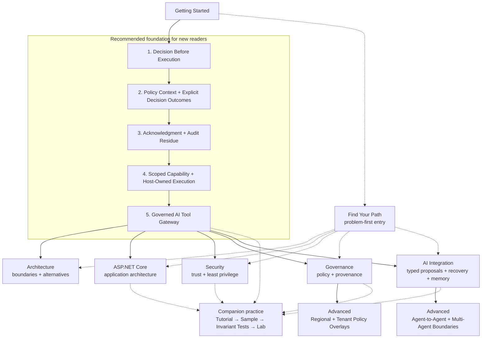

# Learning Path Map

ASI Backbone Learning is a curriculum, but it is not one mandatory linear course.

New readers are encouraged to build the governed-execution vocabulary through the five foundational topics in order. Experienced readers who already understand a boundary can enter a focused subject area through [Find Your Path](find-your-path.md) and return to earlier material only when a missing concept becomes relevant.

This page is intentionally a **conceptual map**, not another content index. The site table of contents remains the authoritative list of published material.

## Visual Map



### Recommended Versus Required Sequencing

The map does **not** impose a repository-wide hard prerequisite gate.

- **Solid arrows** show the recommended conceptual progression for a first-time reader or a strong local lead-in between related topics.
- **Dashed arrows** show optional routing or reinforcement. They are useful when a reader already understands the earlier boundary or wants to approach the material from a concrete problem.
- The five numbered foundational topics are the recommended sequence for newcomers because each topic adds a boundary used by the later governed-execution examples.
- The deeper Architecture, ASP.NET Core, Security, Governance, and AI Integration areas are parallel branches. Completing one branch is not a prerequisite for entering every other branch.
- Advanced material has **local** lead-ins rather than one universal prerequisite chain. Regional and tenant policy overlays build most directly on Governance; agent-to-agent and multi-agent execution boundaries build most directly on AI Integration.

Individual articles may still identify concepts that should be understood first. Follow those local prerequisites when they are more specific than this high-level map.

## Text Description

For readers who cannot use the diagram, the same learning path is described below.

1. Start with [Decision Before Execution](../tutorials/decision-before-execution.md). It establishes the invariant that evaluation and protected execution are separate responsibilities.
2. Continue to [Policy Context and Explicit Decision Outcomes](../tutorials/policy-context-and-explicit-decision-outcomes.md) to make decision inputs, outcomes, reason codes, and policy identity explicit.
3. Continue to [Acknowledgment and Audit Residue](../tutorials/acknowledgment-and-audit-residue.md) to add an explicit acknowledgment boundary and preserve evidence of the governed path.
4. Continue to [Scoped Capability and Host-Owned Execution](../tutorials/scoped-capability-and-host-owned-execution.md) to narrow execution authority and keep the final side effect under host control.
5. Complete the foundation with [Governed AI Tool Gateway](../tutorials/governed-ai-tool-gateway.md), which composes the earlier boundaries around AI-proposed tool execution.
6. After the foundation, choose the subject area that matches the problem you are studying: [Architecture](../architecture/index.md), [ASP.NET Core](../aspnetcore/index.md), [Security](../security/index.md), [Governance](../governance/index.md), or [AI Integration](../ai-integration/index.md).
7. Enter [Advanced](../advanced/index.md) material when the specific problem requires additional interacting boundaries. [Regional and Tenant Policy Overlays](../advanced/regional-and-tenant-policy-overlays.md) follows naturally from deeper governance work, while [Governed Agent-to-Agent Requests and Multi-Agent Execution Boundaries](../advanced/governed-agent-to-agent-requests-and-multi-agent-execution-boundaries.md) follows naturally from AI integration and host-owned execution reasoning.

If you already know which problem you need to solve, use [Find Your Path](find-your-path.md) instead of treating the numbered foundation as a reading requirement.

## Hands-On Reinforcement

The foundational learning model is:

```text
Tutorial
   ↓
Runnable Sample
   ↓
Architectural Invariant Tests
   ↓
Hands-On Lab
```

All five foundational topics have companion material that makes the boundary observable rather than leaving it only as prose. The [Executable Samples](../samples/index.md) show known behavior, tests turn important architectural claims into repeatable invariants, and the [Hands-On Labs](../labs/index.md) require learners to break, repair, extend, or critique the pattern.

The lab area also reinforces selected deeper topics in ASP.NET Core, Security, Governance, AI-assisted execution, architecture-decision reasoning, and degraded-mode behavior. A branch does not need a lab for every article to remain useful; the practice layer is deliberately selective.

## Keep the Map High-Level

This diagram should remain smaller than the repository itself.

Use it to answer four questions:

- Where should a new reader begin?
- Which concepts are designed to build on earlier concepts?
- Which deeper areas can be explored in parallel?
- Where can a learner move from reading into executable practice?

Use the site table of contents for complete coverage and [ROADMAP.md](https://github.com/AsiBackbone/Learning/blob/main/ROADMAP.md) for milestone history and future direction.

---

> **Use the map for orientation. Use the tutorials, samples, tests, and labs for learning.**
