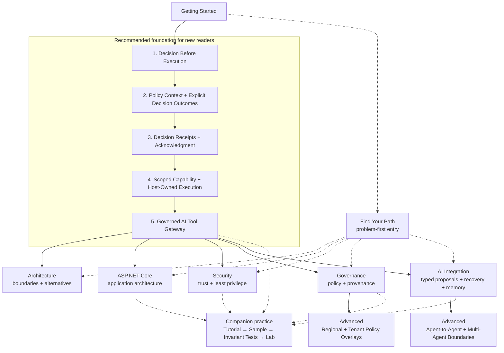

# Learning Path Map

AsiBackbone Learning is a curriculum, but it is not one mandatory linear course.

New readers can build the governed-execution vocabulary through the five foundational topics in order. Experienced readers can enter through [Find Your Path](find-your-path.md), choose the subject area that matches the problem, and return to earlier material only when a missing concept becomes relevant.

This page is a **conceptual map**, not another content index. The site table of contents remains the authoritative list of published material.

## Choose Your Route

| If you are... | Recommended route |
| --- | --- |
| New to governed execution | Follow the five-part foundation from Decision Before Execution through Governed AI Tool Gateway |
| Solving a known problem | Use [Find Your Path](find-your-path.md) and enter the shortest relevant branch |
| Exploring a subject area | Enter Architecture, ASP.NET Core, Security, Governance, or AI Integration directly |
| Ready for deeper interacting boundaries | Use Advanced material after the local concepts it depends on |
| Ready to practice | Move from tutorial → sample → invariant tests → lab |

> **Recommended sequence does not mean required prerequisite chain.**

## Visual Map



## How to Read the Map

- **Solid arrows** show the recommended conceptual progression for a first-time reader or a strong local lead-in between related topics.
- **Dashed arrows** show optional routing or reinforcement for readers who already understand an earlier boundary or are entering from a concrete problem.
- The five numbered topics form the recommended foundation because each adds a boundary used by later governed-execution examples.
- Architecture, ASP.NET Core, Security, Governance, and AI Integration are parallel branches. Completing one branch is not required before entering another.
- Advanced material uses **local lead-ins**, not one universal prerequisite chain. Regional and tenant policy overlays build most directly on Governance; agent-to-agent and multi-agent execution boundaries build most directly on AI Integration.

Individual articles may identify more specific prerequisites. Follow those local prerequisites when they are more precise than this high-level map.

## Foundation in Text

For readers who cannot use the diagram, the same foundation is listed below.

| Step | Topic | Boundary added |
| --- | --- | --- |
| 1 | [Decision Before Execution](../tutorials/decision-before-execution.md) | Evaluation and protected execution become separate responsibilities |
| 2 | [Policy Context and Explicit Decision Outcomes](../tutorials/policy-context-and-explicit-decision-outcomes.md) | Decision inputs, outcomes, reason codes, and policy identity become explicit |
| 3 | [Decision Receipts and Acknowledgment](../tutorials/decision-receipts-and-acknowledgment.md) | Acknowledgment becomes distinct and governed-path evidence is preserved |
| 4 | [Scoped Capability and Host-Owned Execution](../tutorials/scoped-capability-and-host-owned-execution.md) | Execution authority becomes narrow while the host retains the final side effect |
| 5 | [Governed AI Tool Gateway](../tutorials/governed-ai-tool-gateway.md) | Earlier boundaries are composed around AI-proposed tool execution |

After the foundation, choose the branch that matches the problem you are studying: [Architecture](../architecture/index.md), [ASP.NET Core](../aspnetcore/index.md), [Security](../security/index.md), [Governance](../governance/index.md), or [AI Integration](../ai-integration/index.md).

Enter [Advanced](../advanced/index.md) when the specific problem requires additional interacting boundaries. [Regional and Tenant Policy Overlays](../advanced/regional-and-tenant-policy-overlays.md) follows naturally from deeper governance work, while [Governed Agent-to-Agent Requests and Multi-Agent Execution Boundaries](../advanced/governed-agent-to-agent-requests-and-multi-agent-execution-boundaries.md) follows naturally from AI integration and host-owned execution reasoning.

If you already know which problem you need to solve, use [Find Your Path](find-your-path.md) instead of treating the numbered foundation as a reading requirement.

## Hands-On Reinforcement

The practice model is:

```text
Tutorial
   ↓
Runnable Sample
   ↓
Architectural Invariant Tests
   ↓
Hands-On Lab
```

All five foundational topics have companion material that makes the boundary observable rather than leaving it only as prose.

- [Executable Samples](../samples/index.md) show known behavior.
- Tests turn important architectural claims into repeatable invariants.
- [Hands-On Labs](../labs/index.md) require learners to break, repair, extend, or critique the pattern.

The lab area also reinforces selected deeper topics in ASP.NET Core, Security, Governance, AI-assisted execution, architecture-decision reasoning, and degraded-mode behavior. The practice layer is intentionally selective; not every article needs a dedicated lab.

## What This Map Is For

Use this page to answer four questions:

1. Where should a new reader begin?
2. Which concepts are designed to build on earlier concepts?
3. Which deeper areas can be explored in parallel?
4. Where can a learner move from reading into executable practice?

Use the site table of contents for complete coverage and [ROADMAP.md](https://github.com/AsiBackbone/Learning/blob/main/ROADMAP.md) for milestone history and future direction.

---

> **Use the map for orientation. Use the tutorials, samples, tests, and labs for learning.**
