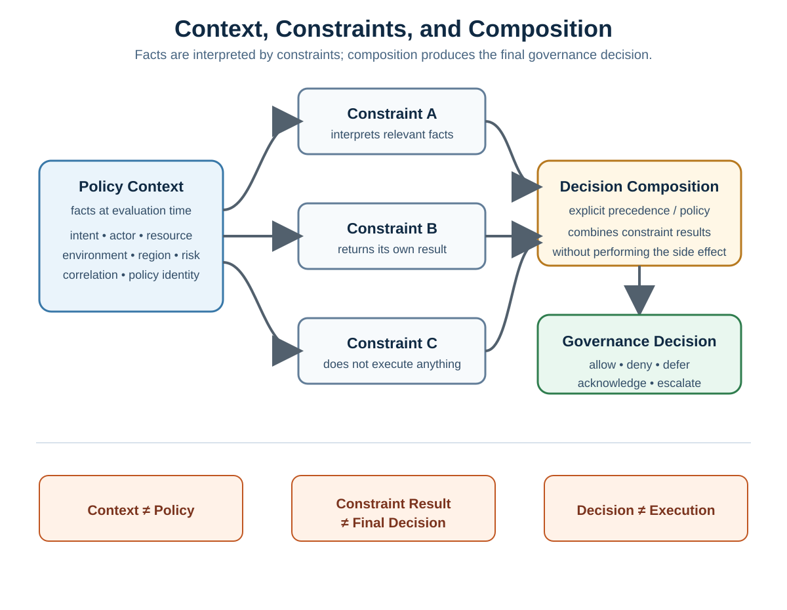

# Constraint Composition and Policy Precedence

**Pattern classification:** Canonical Pattern

**Difficulty:** Intermediate

**Prerequisites:** [Policy Context and Explicit Decision Outcomes](../tutorials/policy-context-and-explicit-decision-outcomes.md)

## At a Glance

> **Problem:** Several independently evaluated constraints can return different results, allowing evaluation order to become policy accidentally.
>
> **Core idea:** Evaluate constraints independently, then compose their results through an explicit, deterministic precedence strategy before any optional decision policy or host-owned execution.
>
> **Why it matters:** Constraint order should not silently decide which reasons survive, which outcome wins, whether all rules run, or whether a blocked operation can continue.
>
> **Read this if:** Your system has multiple policy rules, independently authored constraints, or decision results that need deterministic composition and reviewable precedence.



The foundational policy-context tutorial establishes two important ideas:

> **Policy context contains facts.**
>
> **Constraints interpret those facts.**

That separation remains correct when a system grows beyond one compact policy method.

The next architectural question is what happens when **several independent constraints** interpret the same context and do not all return the same result.

This article focuses on that middle part of the governance spine:

```text
Intent / request
      ↓
Policy context
      ↓
Constraint evaluation
      ↓
Constraint-result composition
      ↓
Base governance decision
      ↓
Optional decision policy
      ↓
Final governance decision
      ↓
Host-owned continuation or execution
```

The central lesson is:

> **Constraint evaluation and constraint composition are different responsibilities.**

A constraint answers a narrow rule question.

A composer answers how multiple rule results become one base decision.

An optional decision policy can then apply broader host or domain rules without taking ownership of the protected side effect.

## Why This Separation Matters

A single policy method can hide several responsibilities inside one sequence of `if` statements:

```csharp
if (!actor.IsAdministrator)
{
    return Denied;
}

if (resource.IsProtected)
{
    return EscalationRecommended;
}

if (environment.MaintenanceHoldActive)
{
    return Deferred;
}

return Allowed;
```

For a small operation, that may be entirely reasonable.

But once rules become independently authored, registered, tested, versioned, or reused, the ordering of those statements can accidentally become the policy.

For example:

```text
Rule A returns Warning
Rule B returns Deny
Rule C returns NotApplicable
```

The system still needs to answer:

```text
What is the final decision?
Which reasons survive?
Do all rules run?
Does order matter?
What happens if no rules exist?
What happens if one rule throws?
Can a later host policy introduce acknowledgment or escalation?
```

Those are composition questions, not individual constraint questions.

## Keep the Pipeline Vocabulary Explicit

A useful policy pipeline separates five responsibilities.

| Stage | Responsibility | Should not own |
| --- | --- | --- |
| Policy context | Capture the facts available for this decision | Hidden rule logic or execution |
| Constraint evaluation | Let each rule interpret the same decision context | Global precedence or side effects |
| Constraint composition | Combine individual constraint results into one base governance decision | Protected execution |
| Decision policy | Optionally reshape or raise the composed decision according to host/domain policy | Protected execution |
| Host execution | Enforce the final decision and perform or refuse the operation | Reinterpreting policy implicitly |

The distinction can be summarized as:

```text
Policy context
    = facts available for the decision

Constraint evaluation
    = individual rules interpret those facts

Constraint composition
    = constraint results become a base governance decision

Decision policy
    = optional host policy may raise or reshape the composed decision

Host execution
    = remains outside policy evaluation
```

Keeping these stages visible makes policy behavior easier to test, explain, and review.

## Constraint Results Are Local Findings

An individual constraint should normally return a result about **its own rule**, not a conclusion about the entire workflow.

A small framework-neutral result vocabulary is:

```text
Allow
Warning
Deny
NotApplicable
```

These results are intentionally narrower than the final governance-decision vocabulary.

### Allow

The constraint evaluated the context and found no reason to block or warn.

```text
Constraint: actor must be authenticated
Result: Allow
```

`Allow` does not mean the entire operation is allowed.

It means only:

> This constraint did not block the operation.

Another constraint may still deny it.

### Warning

The constraint found a condition that should remain visible but does not, by itself, block continuation.

```text
Constraint: export size is unusually large
Result: Warning
Reason: export.large-volume
```

A warning should not become a denial merely because it is evaluated before a stricter rule.

### Deny

The constraint intentionally blocks the proposed operation.

```text
Constraint: actor and resource must share a tenant
Result: Deny
Reason: export.cross-tenant
```

A returned denial is an expected policy outcome.

It should be represented as data, not as an exception.

### NotApplicable

The constraint does not apply to this context.

```text
Constraint: contractor export-hours restriction
Context: actor is an employee
Result: NotApplicable
```

This is different from `Allow`.

`Allow` means the rule applied and passed.

`NotApplicable` means the rule had nothing to decide.

That distinction helps diagnostics and policy review, even when both are neutral during composition.

## Composition Is a Policy of Its Own

Suppose three constraints return:

```text
Allow
Warning
Deny
```

A naive implementation may accidentally use registration order:

```csharp
foreach (var constraint in constraints)
{
    var result = await constraint.EvaluateAsync(context);

    if (result.IsTerminal)
    {
        return result;
    }
}
```

If "terminal" is not rigorously defined, the first result that happens to look final can win.

That means changing dependency-injection registration order can change governance behavior.

This is usually a design smell.

A composition policy should instead state the precedence rule directly.

For example:

```text
Deny > Warning > Allow
NotApplicable = neutral
```

The symbols here describe composition precedence, not numeric enum values.

The important point is that the ordering is documented and tested.

## A Conservative Base Composition

The current `AsiBackbone` default evaluator uses an intentionally conservative base composition model:

1. Any denial produces a denied base decision.
2. If there is no denial but at least one warning, the base decision is warning.
3. If constraints exist and none deny or warn, the base decision is allowed.
4. Not-applicable results do not block.
5. With the default configuration, an empty constraint collection denies rather than silently allowing.

In simplified pseudocode:

```csharp
GovernanceDecision Compose(
    IReadOnlyList<ConstraintResult> results)
{
    if (results.Count == 0)
    {
        return GovernanceDecision.Deny(
            "policy.no-constraints",
            "No active constraints were available.");
    }

    ConstraintResult[] denials =
        [.. results.Where(result => result.IsDenied)];

    if (denials.Length > 0)
    {
        return GovernanceDecision.Deny(
            reasons: denials.SelectMany(result => result.Reasons));
    }

    ConstraintResult[] warnings =
        [.. results.Where(result => result.IsWarning)];

    if (warnings.Length > 0)
    {
        return GovernanceDecision.Warning(
            reasons: warnings.SelectMany(result => result.Reasons));
    }

    return GovernanceDecision.Allow();
}
```

This is a teaching sketch, not a reproduction of the implementation source.

Its purpose is to make the precedence rule visible.

## Denial Precedence

Denial precedence means:

> If any active constraint intentionally blocks the request, the base decision cannot become allowed merely because other constraints passed.

For example:

| Constraint | Result | Reason |
| --- | --- | --- |
| Actor authenticated | Allow | — |
| Same tenant | Deny | `export.cross-tenant` |
| Export-size check | Warning | `export.large-volume` |

A denial-wins policy produces:

```text
Base decision: Denied
```

The successful authentication result does not cancel the cross-tenant denial.

The warning does not outrank the denial.

This sounds obvious when written down.

It becomes less obvious when rules are scattered across handlers, filters, middleware, feature flags, and service registrations.

That is why precedence belongs in one explicit composition boundary.

## Warning-Only Behavior

If no constraint blocks but one or more constraints warn, a warning-only composition can preserve advisory context while still allowing the host to continue.

Example:

| Constraint | Result |
| --- | --- |
| Actor authenticated | Allow |
| Same tenant | Allow |
| Export-size check | Warning |
| Contractor-hours rule | NotApplicable |

The base result becomes:

```text
Warning
```

The host can then decide whether warning is a proceedable outcome.

In the Learning model and current `AsiBackbone` decision model, warning is proceedable, but its reason should remain visible for review or audit.

## NotApplicable Is Neutral, Not Approval

A common mistake is to treat `NotApplicable` as equivalent to global approval.

Consider:

```text
Constraint A: NotApplicable
Constraint B: NotApplicable
Constraint C: Deny
```

The final base decision is still denied.

`NotApplicable` does not vote yes.

It simply contributes no blocking or warning result.

Another edge case is:

```text
Constraint A: NotApplicable
Constraint B: NotApplicable
```

The current `AsiBackbone` default evaluator treats a **non-empty** constraint set with no denials or warnings as allowed.

That is a distinct case from having **zero constraints**, which denies by default.

A host that wants all-not-applicable to fail closed can adopt a stricter documented composition policy, but that behavior should be intentional and tested.

## Worked Example: Governed Data Export

Consider a host that evaluates a proposed data export.

The context snapshot contains facts only:

```csharp
public sealed record ExportPolicyContext(
    string ActorId,
    string ActorType,
    string ActorTenant,
    string ResourceTenant,
    string Region,
    string Classification,
    int RecordCount,
    bool MaintenanceHoldActive,
    string CorrelationId,
    string PolicyVersion);
```

For one request:

```text
ActorId:          ops-agent-17
ActorType:        Employee
ActorTenant:      tenant-a
ResourceTenant:   tenant-a
Region:           US-LA
Classification:   Restricted
RecordCount:      250000
MaintenanceHold:  false
PolicyVersion:    export-policy/12
```

Five independent constraints evaluate the same snapshot.

### Constraint 1 — Authenticated Actor

```text
Question:
Is the actor identity acceptable for this operation?

Result:
Allow
```

### Constraint 2 — Tenant Boundary

```text
Question:
Does the actor tenant match the resource tenant?

Result:
Allow
```

### Constraint 3 — Large Export Advisory

```text
Question:
Does the record count exceed the review threshold?

Result:
Warning

Reason:
export.large-volume
```

### Constraint 4 — Restricted Regional Export

```text
Question:
May Restricted data be exported under the active regional rule?

Result:
Deny

Reason:
export.region.restricted
```

### Constraint 5 — Maintenance Hold

```text
Question:
Does a maintenance hold affect this operation?

Result:
NotApplicable
```

The individual results are therefore:

| Constraint | Result | Reason |
| --- | --- | --- |
| Authenticated actor | Allow | — |
| Tenant boundary | Allow | — |
| Large export advisory | Warning | `export.large-volume` |
| Restricted regional export | Deny | `export.region.restricted` |
| Maintenance hold | NotApplicable | — |

### Compose the Base Decision

Under a deny-wins full-evaluation policy:

```text
Allow
Allow
Warning
Deny
NotApplicable
      ↓
Denied
```

The base decision is denied because one active constraint blocks the request.

Under the current `AsiBackbone` default full-evaluation behavior, a denied composed decision focuses on blocking rationale rather than copying warning-only reasons into the final denial.

So the final blocking reason would include:

```text
export.region.restricted
```

The warning still existed as an evaluated constraint result, but it is not elevated into the blocking rationale by the default composer.

## Compare Composition Policies Deliberately

The same constraint results can be combined in different documented ways.

| Composition policy | Result for the worked example | Tradeoff |
| --- | --- | --- |
| Deny wins, full evaluation | Denied | Strong audit visibility; all blocking constraints can contribute reasons |
| Deny wins, short-circuit on first denial | Denied | Lower latency; later constraints do not run |
| First terminal result wins | Depends on rule order | Simple but highly order-sensitive unless ordering itself is the intended policy |
| Preserve warnings with denials | Denied with warning + denial context | Richer receipt, but can make blocking rationale noisier |
| Custom severity ladder | Depends on documented ladder | Can fit a domain, but must avoid arbitrary enum-number ordering |

The lesson is not that one table row is universally correct.

The lesson is:

> **Choose the policy, document it, and test it. Do not inherit it accidentally from iteration order.**

## Full Evaluation Versus Short-Circuiting

Two legitimate evaluator strategies are common.

### Full Evaluation

Every active constraint runs.

```text
Constraint A
Constraint B
Constraint C
Constraint D
      ↓
Compose all results
```

Benefits:

* More complete denial-reason visibility.
* Better policy diagnostics.
* Better reviewer understanding.
* Easier comparison of active rules.
* Useful for audit-heavy paths.

Costs:

* More work per decision.
* Potentially higher latency.
* More downstream dependency calls if constraints are not purely local.
* More telemetry and diagnostic volume.

The current `AsiBackbone` default favors full evaluation.

### Short-Circuit on First Denial

Evaluation stops when the first blocking constraint is found.

```text
Constraint A: Warning
Constraint B: Deny
      ↓
Stop
Constraint C: not evaluated
Constraint D: not evaluated
```

Benefits:

* Lower latency when denials are common.
* Less unnecessary work after a block is known.
* Useful for high-throughput or expensive-policy paths.

Costs:

* Later denial reasons are unavailable.
* Later warnings are unavailable.
* Diagnostics now depend more visibly on constraint order.
* Reordering constraints can change the reason set even when the final outcome remains denied.

In the current `AsiBackbone` evaluator, short-circuit behavior is an explicit option rather than an incidental side effect.

That distinction matters.

If the host chooses fast-abort behavior, it should treat the reduced evidence set as part of the architectural tradeoff.

## Preserve Useful Reasons Without Hiding the Block

Reason codes are part of policy explainability.

A useful denial should answer:

```text
Why was this blocked?
Which constraint produced the reason?
Which policy version was active?
Which correlation ID links the evaluation to surrounding evidence?
```

For full evaluation, a composer may aggregate multiple denial reasons:

```text
export.cross-tenant
export.region.restricted
export.actor.insufficient-assurance
```

A composer should avoid replacing those with a vague message such as:

```text
Policy failed.
```

At the same time, more information is not always better.

The current `AsiBackbone` default full-evaluation path keeps a denied decision focused on denial reasons rather than mixing advisory warnings into the final blocking rationale.

A host that needs warnings preserved alongside denials can implement that deliberately in a decision policy.

The key is that the choice is visible.

## Empty Policy Is an Architectural State

An empty constraint collection is not always equivalent to:

```text
No restrictions exist.
```

It may instead mean:

```text
Dependency injection failed
Configuration did not load
Policy discovery returned nothing
A feature flag removed every rule
A database-backed policy source is unavailable
The wrong policy set was selected
```

For governed surfaces, silently treating that state as allow can turn a configuration failure into an authorization or governance bypass.

That is why the current `AsiBackbone` 3.x default is fail closed:

```text
Zero constraints
      ↓
Denied
```

with the implementation reason code:

```text
asibackbone.policy.no_constraints
```

Hosts can explicitly choose permissive empty-policy behavior for controlled local scenarios, but the opt-out should be deliberate and observable.

## Expected Denial Is Not an Exception

Constraints should return explicit results for expected policy outcomes.

Prefer:

```csharp
return ConstraintResult.Deny(
    "export.region.restricted",
    "Restricted exports are not permitted by the active regional policy.");
```

Avoid:

```csharp
throw new InvalidOperationException(
    "Restricted exports are not permitted.");
```

The first form means:

```text
The rule evaluated successfully
and intentionally denied the request.
```

The second means:

```text
Constraint evaluation faulted unexpectedly.
```

Those are different operational states and should remain distinguishable.

## Unexpected Constraint Exceptions

A governed evaluator still needs a posture for unexpected constraint failures.

Possible choices include:

```text
Propagate exception
Fail closed as denial
Defer for retry
Escalate for review
```

The current `AsiBackbone` 3.x default converts eligible non-cancellation, non-critical constraint exceptions into a denied decision using:

```text
asibackbone.policy.constraint_exception
```

This is a safety default, not a policy-authoring shortcut.

Expected denial logic should still return a denial result normally.

Cancellation remains cancellation rather than being rewritten as a policy denial, and critical host/runtime failures should not be disguised as ordinary policy outcomes.

Production systems should also keep public reason messages free of exception text, stack traces, secrets, raw payloads, connection strings, and unnecessary user data.

## Composition Should Not Depend on Incidental Registration Order

Suppose these constraints are registered:

```csharp
services.AddSingleton<IConstraint, LargeExportConstraint>();
services.AddSingleton<IConstraint, RegionalExportConstraint>();
services.AddSingleton<IConstraint, TenantBoundaryConstraint>();
```

If the intended rule is:

```text
Any denial wins
```

then moving `TenantBoundaryConstraint` to the first registration position should not change an allowed result into a denied result or vice versa.

With full evaluation and explicit deny precedence, the outcome remains stable.

Registration order may still affect presentation details such as reason ordering, and it intentionally affects which reasons are observed when short-circuiting is enabled.

Those are narrower consequences than making the entire governance outcome depend on whichever rule ran first.

## Do Not Encode Precedence in Enum Numbers

A tempting shortcut is:

```csharp
public enum Outcome
{
    Allow = 0,
    Warning = 1,
    AcknowledgmentRequired = 2,
    Deferred = 3,
    EscalationRecommended = 4,
    Denied = 5
}
```

followed by:

```csharp
final = results.Max(result => result.Outcome);
```

This looks elegant but hides important semantics.

`Deferred`, `AcknowledgmentRequired`, and `EscalationRecommended` are not simply points on one universal severity scale.

They describe different workflow states.

For example:

* Deferred may mean "try again after maintenance."
* Acknowledgment required may mean "a qualified actor can continue after an explicit checkpoint."
* Escalation recommended may mean "route to a different authority."

Treating them as ordinal severity values can create accidental policy.

A better separation is:

```text
Constraint results
    ↓
Base composition with narrow precedence
    ↓
Optional decision policy with explicit workflow rules
```

## The Decision Policy Comes After Base Composition

Constraint composition should answer the narrow question:

> What do the individual constraints collectively say?

A decision policy can then answer a broader host or domain question:

> Given that composed result and this context, what governance state should the host observe next?

For example:

```text
Base decision: Warning
Context risk: High
      ↓
Decision policy
      ↓
AcknowledgmentRequired
```

Or:

```text
Base decision: Allowed
Regional overlay: Unsupported jurisdiction
      ↓
Decision policy
      ↓
Denied
```

Or:

```text
Base decision: Allowed
Gateway readiness evidence: Incomplete
      ↓
Decision policy
      ↓
EscalationRecommended
```

This gives the system a place to model outcomes such as:

```text
Deferred
AcknowledgmentRequired
EscalationRecommended
```

without forcing every individual constraint to understand the entire workflow.

## A Decision Policy Should Not Become an Execution Engine

The decision-policy boundary is still policy evaluation.

Avoid:

```csharp
public async Task<GovernanceDecision> ApplyAsync(...)
{
    if (composedDecision.CanProceed)
    {
        await externalService.ExecuteAsync(); // wrong boundary
    }

    return composedDecision;
}
```

The policy has now acquired side-effect authority.

Prefer:

```text
Context
   ↓
Constraints
   ↓
Base decision
   ↓
Decision policy
   ↓
Final decision
   ↓
Host enforces final decision
   ↓
Host performs or refuses execution
```

The decision describes the allowed next state.

The host owns the state transition that has real-world effect.

## Never Silently Weaken a Blocking Decision

A useful default rule for post-composition policy is:

> **Broader policy may narrow or reshape a proceedable decision, but it should not silently turn an existing block into permission.**

For example:

```csharp
if (!composedDecision.CanProceed)
{
    return composedDecision;
}
```

before applying regional or readiness overlays.

There may be specialized architectures where an explicit higher-authority override exists.

If so, that override should be modeled as an explicit, auditable authority path rather than hidden inside an ordinary decision policy.

## Determinism Expectations

A useful governance property is:

```text
Same relevant context
+
Same active constraints
+
Same policy version
+
Same deterministic inputs
      ↓
Same governance result
```

This does not mean every real-world system is perfectly deterministic.

A constraint may depend on changing facts such as:

* Current account state.
* Current risk score.
* Current region configuration.
* Current maintenance state.
* Current threat intelligence.

The architectural response is to make those facts explicit when practical.

Prefer:

```text
Host gathers current facts
      ↓
Creates policy-context snapshot
      ↓
Evaluator consumes snapshot
```

rather than allowing constraints to discover changing state invisibly throughout evaluation.

If a constraint must consult a live dependency, treat that dependency as part of the policy's operational assumptions and test the failure behavior explicitly.

## Policy Version and Hash Matter More as Composition Grows

When several constraints and a decision policy participate, the question:

> Which policy produced this decision?

becomes more important.

A useful decision or audit record should preserve policy identity such as:

```text
Policy version
Policy hash
Correlation ID
Reason codes
```

That does not magically make the result reproducible.

It does make the active policy structure more explainable.

For example:

```text
Decision: Denied
PolicyVersion: export-policy/12
PolicyHash: sha256:...
CorrelationId: 4d7f...
Reasons:
  - export.region.restricted
```

Policy identity becomes especially important when:

* Constraint sets change over time.
* Regional overlays differ.
* Rules are loaded from configuration.
* Multiple tenants use different policy bundles.
* A later audit reviewer must understand why a historical decision differed from today's behavior.

## Separate Policy Denial from Infrastructure Failure

A denial is a governance result.

A broken policy loader, unavailable database, malformed configuration, or crashed dependency is an operational failure.

A fail-closed evaluator may deliberately **map** some failures into a denied governance decision to prevent unsafe continuation.

That does not make the underlying operational failure equivalent to an ordinary policy denial.

Preserve the distinction through:

* Stable reason codes.
* Operational logging.
* Metrics or alerts where useful.
* Audit residue.
* Exception telemetry that does not leak sensitive data.

A reviewer should be able to tell the difference between:

```text
Denied because the regional rule prohibited the operation
```

and:

```text
Denied because a constraint unexpectedly failed and the evaluator failed closed
```

## Host-Owned Execution Remains the Final Boundary

Constraint composition does not perform the protected operation.

Decision policy does not perform the protected operation.

A final decision should return control to the host:

```csharp
GovernanceDecision decision =
    await evaluator.EvaluateAsync(
        context,
        cancellationToken);

if (!decision.CanProceed)
{
    return DenyOrRoute(decision);
}

await exportService.ExecuteAsync(
    context,
    cancellationToken);
```

A fuller governed flow may insert acknowledgment, audit, or capability validation before the host executes.

The important invariant remains:

```text
Denied final decision
      ↓
Protected executor invocation count = 0
```

## Testing the Composition Boundary

Composition deserves direct tests because it defines policy behavior across rules.

Useful invariant tests include:

### Any Denial Wins

```text
Allow + Deny
      ↓
Denied
```

### Warning Wins Only When No Denial Exists

```text
Allow + Warning + NotApplicable
      ↓
Warning
```

### NotApplicable Does Not Block

```text
Allow + NotApplicable
      ↓
Allowed
```

### Full Evaluation Aggregates Blocking Reasons

```text
Deny(reason-a) + Deny(reason-b)
      ↓
Denied
Reasons include reason-a and reason-b
```

### Short-Circuit Stops Later Constraints

```text
Warning
Deny
LaterConstraint
      ↓
Denied
LaterConstraint invocation count = 0
```

### Empty Policy Fails Closed by Default

```text
No constraints
      ↓
Denied
```

### Expected Denial Does Not Throw

```text
Known policy violation
      ↓
Constraint returns Deny
```

### Unexpected Exception Uses the Configured Failure Posture

```text
Constraint throws unexpectedly
      ↓
Configured fail-closed denial
or
Exception propagation
```

### Policy Does Not Execute

```text
Final decision produced
      ↓
No protected side effect until host explicitly continues
```

These tests make the composition rules executable rather than merely descriptive.

## When a Simpler Pattern Is Better

Do not introduce a composition pipeline simply because multiple conditions exist.

A direct guard clause may be better when:

* The rule belongs to one local operation.
* The conditions are few and stable.
* The code is already easy to read and test.
* There is no need for reusable rule registration.
* No richer governance lifecycle exists.

ASP.NET Core authorization may be better when:

* The main question is access control.
* Success/failure is sufficient.
* The actor and resource are the primary inputs.
* Execution follows immediately in the same request.
* Built-in policies, requirements, and handlers express the need cleanly.

A richer constraint-composition pipeline becomes more useful when:

* Rules are independently authored or configured.
* Multiple constraints may contribute reasons.
* Policy versions or regional overlays matter.
* Audit reviewers need to understand the active rule set.
* The system needs explicit failure posture for empty or faulting policy.
* A post-composition decision policy must introduce acknowledgment, deferment, or escalation.
* Approval and execution are deliberately separate architectural stages.

Use the smallest model that preserves the boundaries the problem actually needs.

## Relationship to the Foundational Tutorial

[Policy Context and Explicit Decision Outcomes](../tutorials/policy-context-and-explicit-decision-outcomes.md) intentionally uses a compact policy class so the beginner lesson remains visible:

```text
Explicit facts
   ↓
Explicit rules
   ↓
Explicit outcome
```

This article expands the middle stage without replacing that tutorial:

```text
Explicit facts
   ↓
Independent constraints
   ↓
Explicit composition
   ↓
Optional broader decision policy
   ↓
Explicit outcome
```

The beginner model is not wrong.

It is a smaller teaching model.

The composition model becomes useful when the rule set itself needs architecture.

## Working Implementation Map

The `AsiBackbone/AsiBackbone` repository provides a fuller implementation of these ideas.

| Learning concept | Working implementation reference | What to inspect |
| --- | --- | --- |
| Core policy vocabulary | [Core Domain Language](https://github.com/AsiBackbone/AsiBackbone/blob/main/docs/articles/core-domain-language.md) | Context, constraints, active policy structure, decisions, and host boundary |
| Constraint evaluation and base composition | [Policy Evaluator Pipeline](https://github.com/AsiBackbone/AsiBackbone/blob/main/docs/articles/policy-evaluator-pipeline.md) | Deny/warning/allow composition, empty-policy behavior, short-circuiting, exception posture, and reason handling |
| Post-composition policy | [Custom Decision Policy Examples](https://github.com/AsiBackbone/AsiBackbone/blob/main/docs/articles/custom-decision-policy-examples.md) | Warning preservation, regional overlays, acknowledgment, escalation, and host-owned execution |
| Concrete evaluator | [`DefaultAsiBackbonePolicyEvaluator`](https://github.com/AsiBackbone/AsiBackbone/blob/main/src/AsiBackbone.Core/Evaluation/DefaultAsiBackbonePolicyEvaluator.cs) | Source-level evaluation and composition behavior |
| Decision-policy contract | [`IAsiBackboneDecisionPolicy`](https://github.com/AsiBackbone/AsiBackbone/blob/main/src/AsiBackbone.Core/Evaluation/IAsiBackboneDecisionPolicy.cs) | Boundary between base composition and host/domain decision transformation |
| End-to-end behavior | [`PolicyEvaluatorEndToEndTests`](https://github.com/AsiBackbone/AsiBackbone/blob/main/tests/AsiBackbone.Core.Tests/Evaluation/PolicyEvaluatorEndToEndTests.cs) | Executable policy-evaluator invariants |

The Learning article remains framework-neutral on purpose.

The implementation repository is the better place to inspect package APIs, constructor overloads, options, and exact source behavior.

## Review Questions

When reviewing a composed policy pipeline, ask:

1. Does the policy context contain facts rather than hidden rule logic?
2. Does each constraint answer one understandable rule question?
3. Are `Allow`, `Warning`, `Deny`, and `NotApplicable` meanings explicit?
4. Is denial precedence documented?
5. Is warning-only behavior documented?
6. Is all-not-applicable behavior understood?
7. Is empty-policy behavior deliberate?
8. Does the system run all constraints or short-circuit?
9. If it short-circuits, is the lost reason visibility acceptable?
10. Are reason codes stable and useful?
11. Are expected denials returned rather than thrown?
12. Is unexpected exception behavior explicit?
13. Can a decision policy narrow or reshape the base decision without silently weakening a block?
14. Are policy version and policy hash preserved where decision lineage matters?
15. Can the same deterministic context and policy version produce a stable outcome?
16. Does host execution remain outside policy evaluation?
17. Would ordinary ASP.NET Core authorization or a direct guard clause solve the problem with less machinery?

If several answers are unclear, the system may have policy logic, but it does not yet have a well-defined composition architecture.

## Related Content

- [Policy Context and Explicit Decision Outcomes](../tutorials/policy-context-and-explicit-decision-outcomes.md) — begin with explicit decision-time facts and structured outcomes.
- [Practical Policy Testing and Decision-Table Strategies](practical-policy-testing-and-decision-table-strategies.md) — turn composition rules, precedence, and execution boundaries into explicit regression-testable cases.
- [Regional and Tenant Policy Overlays](../advanced/regional-and-tenant-policy-overlays.md) — extend composition from multiple constraints inside one policy boundary to multiple policy authorities with explicit narrowing, override, conflict, and provenance rules.
- [Decision Before Execution](../tutorials/decision-before-execution.md) — revisit the boundary between a governance decision and the protected side effect.
- [Acknowledgment and Audit Residue](../tutorials/acknowledgment-and-audit-residue.md) — continue from final decisions into acknowledgment and governance evidence.
- [When ASP.NET Core Authorization Is Enough](../architecture/when-aspnet-core-authorization-is-enough.md) — compare the richer governance model with a simpler built-in authorization approach.
- [Governed AI Tool Gateway](../tutorials/governed-ai-tool-gateway.md) — see composition participate in an end-to-end AI-assisted workflow while the host retains execution authority.

---

> **Make precedence a policy, not an accident of rule order.**
